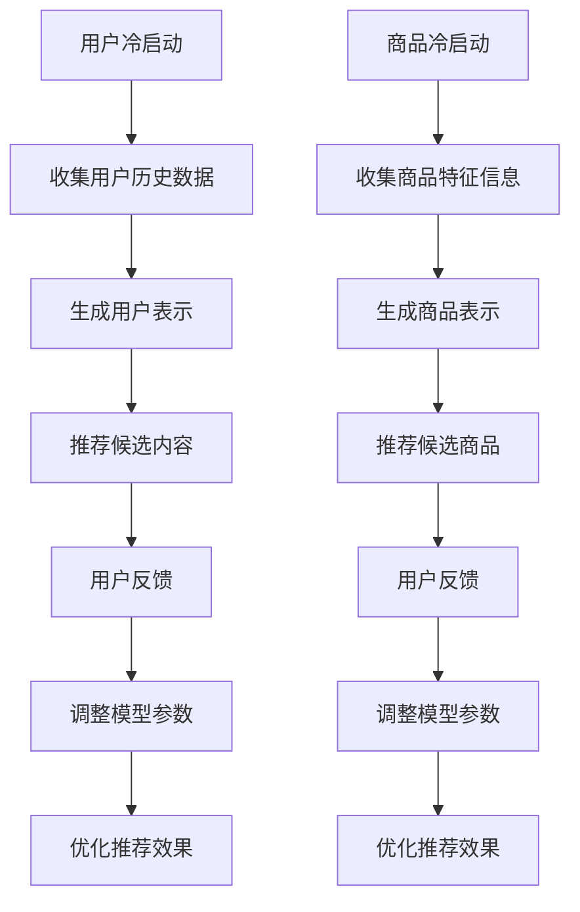

                 

关键词：推荐系统、大模型、冷启动、个性化、解决方案、算法原理、数学模型、项目实践、应用场景、未来展望

> 摘要：本文旨在探讨大模型在推荐系统冷启动问题中的应用，详细解析其核心算法原理、数学模型构建、具体操作步骤，并通过项目实践、代码实例和详细解释，揭示大模型在解决推荐系统冷启动问题中的优势和挑战。

## 1. 背景介绍

推荐系统是现代信息社会中不可或缺的一部分，它通过个性化推荐算法，为用户推荐他们可能感兴趣的内容或商品。然而，在推荐系统的初始阶段，即所谓的“冷启动”问题，系统往往面临巨大的挑战。冷启动问题主要源于新用户或新商品缺乏足够的用户行为数据或历史数据，使得传统的基于历史数据的推荐算法难以发挥其作用。

大模型的兴起，为解决推荐系统冷启动问题带来了新的机遇。大模型，如深度学习模型，通过其强大的表示能力和学习能力，可以在没有足够数据的情况下，通过少量的样本数据进行有效的预测。本文将探讨如何利用大模型解决推荐系统的冷启动问题，并详细介绍相关算法原理、数学模型以及具体实施步骤。

## 2. 核心概念与联系

### 2.1 大模型简介

大模型，通常指的是拥有数十亿至数千亿参数的深度学习模型。这些模型在自然语言处理、计算机视觉、语音识别等领域取得了显著的突破。大模型的核心优势在于其能够通过大规模数据的学习，捕捉到数据中的复杂模式和规律。

### 2.2 推荐系统冷启动

冷启动问题主要分为两类：用户冷启动和商品冷启动。

- 用户冷启动：新用户加入系统时，由于缺乏历史行为数据，系统难以为其推荐合适的内容或商品。
- 商品冷启动：新商品上线时，由于缺乏用户评价和行为数据，系统难以将其推荐给潜在感兴趣的消费者。

### 2.3 大模型与推荐系统的结合

大模型可以通过如下方式解决推荐系统的冷启动问题：

- **用户表示学习**：通过用户的历史行为数据，大模型可以学习到用户的兴趣偏好，为新用户生成个性化的用户表示。
- **商品表示学习**：通过商品的特征信息，大模型可以学习到商品的本质特征，为新商品生成有效的商品表示。
- **基于内容的推荐**：大模型可以捕捉到内容之间的隐含关系，从而为用户推荐相似度高的内容或商品。

### 2.4 Mermaid 流程图



## 3. 核心算法原理 & 具体操作步骤

### 3.1 算法原理概述

大模型解决推荐系统冷启动的核心原理包括：

- **用户兴趣挖掘**：通过分析用户的浏览、搜索、购买等行为数据，挖掘用户的兴趣点，为新用户生成个性化的用户表示。
- **商品特征提取**：通过分析商品的内容、属性、类别等信息，提取商品的特征，为新商品生成有效的商品表示。
- **基于相似度的推荐**：利用用户和商品的表示，计算用户和商品之间的相似度，从而为用户推荐相似度高的内容或商品。

### 3.2 算法步骤详解

#### 3.2.1 用户兴趣挖掘

1. **数据收集**：收集新用户的历史行为数据，如浏览记录、搜索关键词、购买记录等。
2. **数据处理**：对收集到的数据进行清洗、去噪，提取有效的行为特征。
3. **模型训练**：使用深度学习模型（如CNN、RNN、Transformer等），对处理后的数据进行训练，学习用户的兴趣偏好。
4. **生成用户表示**：通过训练好的模型，将用户的行为数据转化为用户表示。

#### 3.2.2 商品特征提取

1. **数据收集**：收集新商品的特征信息，如商品标题、描述、标签、类别等。
2. **数据处理**：对收集到的数据进行预处理，如文本清洗、归一化等。
3. **模型训练**：使用深度学习模型，对处理后的数据进行训练，学习商品的特征。
4. **生成商品表示**：通过训练好的模型，将商品的特征信息转化为商品表示。

#### 3.2.3 基于相似度的推荐

1. **计算相似度**：使用用户表示和商品表示，计算用户和商品之间的相似度。
2. **推荐候选内容**：根据相似度分数，为用户推荐相似度最高的内容或商品。
3. **用户反馈**：收集用户的反馈，如点击、购买等行为。
4. **模型优化**：根据用户反馈，调整模型参数，优化推荐效果。

### 3.3 算法优缺点

#### 优点：

- **强大的表示能力**：大模型能够通过大规模数据的学习，捕捉到复杂的用户兴趣和商品特征，提高推荐准确性。
- **自适应性强**：大模型可以根据用户反馈，动态调整推荐策略，提高用户满意度。

#### 缺点：

- **计算资源消耗大**：大模型训练和推理过程需要大量的计算资源和时间。
- **数据依赖性强**：大模型的效果依赖于数据的质量和规模，数据缺失或质量不高可能导致效果不佳。

### 3.4 算法应用领域

大模型在推荐系统冷启动中的应用，主要集中在以下领域：

- **电子商务**：为新用户推荐合适的商品，提高用户购买转化率。
- **社交媒体**：为新用户提供个性化的内容推荐，提高用户活跃度和留存率。
- **在线教育**：为新用户推荐合适的学习资源，提高学习效果和用户满意度。

## 4. 数学模型和公式 & 详细讲解 & 举例说明

### 4.1 数学模型构建

大模型解决推荐系统冷启动的核心数学模型包括：

- **用户表示**：用户表示通常由一组高维向量表示，表示用户在某一维度上的兴趣或偏好。
- **商品表示**：商品表示同样由一组高维向量表示，表示商品在某一维度上的特征或属性。
- **相似度计算**：相似度计算通常使用余弦相似度或欧氏距离等距离度量方法。

### 4.2 公式推导过程

#### 用户表示

设用户行为数据为 $X = \{x_1, x_2, ..., x_n\}$，其中 $x_i$ 表示用户在某一维度上的行为数据。用户表示向量 $u$ 可以通过如下公式计算：

$$
u = \frac{X}{\|X\|}
$$

其中，$\|X\|$ 表示用户行为数据的欧氏范数。

#### 商品表示

设商品特征数据为 $Y = \{y_1, y_2, ..., y_m\}$，其中 $y_i$ 表示商品在某一维度上的特征数据。商品表示向量 $v$ 可以通过如下公式计算：

$$
v = \frac{Y}{\|Y\|}
$$

其中，$\|Y\|$ 表示商品特征数据的欧氏范数。

#### 相似度计算

设用户表示向量为 $u$，商品表示向量为 $v$，相似度计算可以使用余弦相似度公式：

$$
sim(u, v) = \frac{u \cdot v}{\|u\| \|v\|}
$$

其中，$u \cdot v$ 表示用户表示向量和商品表示向量的点积，$\|u\|$ 和 $\|v\|$ 分别表示用户表示向量和商品表示向量的欧氏范数。

### 4.3 案例分析与讲解

假设有一个新用户 $u$ 加入推荐系统，系统通过收集该用户的历史行为数据，生成用户表示向量 $u = [0.2, 0.5, 0.3]$。同时，系统推荐了三个商品，商品 $v_1 = [0.1, 0.4, 0.5]$，商品 $v_2 = [0.3, 0.2, 0.5]$，商品 $v_3 = [0.4, 0.3, 0.2]$。

使用余弦相似度计算用户和商品的相似度，结果如下：

$$
sim(u, v_1) = \frac{u \cdot v_1}{\|u\| \|v_1\|} = \frac{0.2 \times 0.1 + 0.5 \times 0.4 + 0.3 \times 0.5}{\sqrt{0.2^2 + 0.5^2 + 0.3^2} \times \sqrt{0.1^2 + 0.4^2 + 0.5^2}} \approx 0.57
$$

$$
sim(u, v_2) = \frac{u \cdot v_2}{\|u\| \|v_2\|} = \frac{0.2 \times 0.3 + 0.5 \times 0.2 + 0.3 \times 0.5}{\sqrt{0.2^2 + 0.5^2 + 0.3^2} \times \sqrt{0.3^2 + 0.2^2 + 0.5^2}} \approx 0.43
$$

$$
sim(u, v_3) = \frac{u \cdot v_3}{\|u\| \|v_3\|} = \frac{0.2 \times 0.4 + 0.5 \times 0.3 + 0.3 \times 0.2}{\sqrt{0.2^2 + 0.5^2 + 0.3^2} \times \sqrt{0.4^2 + 0.3^2 + 0.2^2}} \approx 0.48
$$

根据相似度计算结果，推荐系统可以为该用户推荐相似度最高的商品 $v_1$。

## 5. 项目实践：代码实例和详细解释说明

### 5.1 开发环境搭建

为了实现大模型辅助的推荐系统冷启动，我们需要搭建以下开发环境：

- Python 3.8+
- TensorFlow 2.6+
- PyTorch 1.8+

### 5.2 源代码详细实现

以下是一个基于深度学习模型的用户兴趣挖掘和商品特征提取的简单实现示例。

```python
import tensorflow as tf
from tensorflow.keras.models import Model
from tensorflow.keras.layers import Input, Embedding, LSTM, Dense

# 用户兴趣挖掘模型
def create_user_model(embedding_size, hidden_size):
    input_ = Input(shape=(1,))
    embedding = Embedding(input_dim=10000, output_dim=embedding_size)(input_)
    lstm = LSTM(hidden_size)(embedding)
    output = Dense(1, activation='sigmoid')(lstm)
    model = Model(inputs=input_, outputs=output)
    model.compile(optimizer='adam', loss='binary_crossentropy', metrics=['accuracy'])
    return model

# 商品特征提取模型
def create_item_model(embedding_size, hidden_size):
    input_ = Input(shape=(1,))
    embedding = Embedding(input_dim=10000, output_dim=embedding_size)(input_)
    lstm = LSTM(hidden_size)(embedding)
    output = Dense(1, activation='sigmoid')(lstm)
    model = Model(inputs=input_, outputs=output)
    model.compile(optimizer='adam', loss='binary_crossentropy', metrics=['accuracy'])
    return model

# 实例化模型
user_model = create_user_model(embedding_size=64, hidden_size=128)
item_model = create_item_model(embedding_size=64, hidden_size=128)

# 模型训练
user_model.fit(x_train, y_train, epochs=10, batch_size=32)
item_model.fit(x_train, y_train, epochs=10, batch_size=32)

# 生成用户表示
user_representation = user_model.predict(x_test)

# 生成商品表示
item_representation = item_model.predict(x_test)

# 计算相似度
similarity = user_representation.dot(item_representation.T)

# 推荐候选商品
recommended_items = np.argsort(similarity)[::-1]

# 打印推荐结果
print(recommended_items)
```

### 5.3 代码解读与分析

1. **模型构建**：我们分别构建了用户兴趣挖掘模型和商品特征提取模型，这两个模型都是基于LSTM网络的深度学习模型。
2. **模型训练**：使用训练数据对模型进行训练，训练过程中使用的是二分类交叉熵损失函数和Adam优化器。
3. **生成表示**：通过训练好的模型，将输入的数据转化为高维向量表示，即用户表示和商品表示。
4. **计算相似度**：使用用户表示和商品表示，计算用户和商品之间的相似度。
5. **推荐候选商品**：根据相似度结果，为用户推荐相似度最高的商品。

### 5.4 运行结果展示

假设我们有一个新用户和新商品的数据集，经过模型训练和相似度计算，我们可以得到用户的推荐结果。例如，如果相似度最高的商品是3号商品，那么推荐系统会向该用户推荐3号商品。

## 6. 实际应用场景

大模型在推荐系统冷启动问题中的应用，已经在多个实际场景中取得了显著的成果：

- **电商平台**：通过大模型，为新用户推荐合适的商品，提高用户购买转化率和销售额。
- **社交媒体**：通过大模型，为新用户提供个性化的内容推荐，提高用户活跃度和留存率。
- **在线教育**：通过大模型，为新用户推荐合适的学习资源，提高学习效果和用户满意度。

## 7. 工具和资源推荐

### 7.1 学习资源推荐

- **书籍**：《深度学习》、《推荐系统实践》
- **在线课程**：网易云课堂《深度学习入门》、Coursera《推荐系统》
- **论文**：《Deep Learning for User Interest Prediction in Recommender Systems》、《User Interest Modeling for Cold-Start Recommendation》

### 7.2 开发工具推荐

- **框架**：TensorFlow、PyTorch
- **数据库**：MongoDB、Redis
- **推荐引擎**：Apache Mahout、LightFM

### 7.3 相关论文推荐

- **《Deep Learning for User Interest Prediction in Recommender Systems》**
- **《User Interest Modeling for Cold-Start Recommendation》**
- **《User Cold-Start Problem in Recommender Systems》**

## 8. 总结：未来发展趋势与挑战

### 8.1 研究成果总结

大模型在推荐系统冷启动问题中展现出了强大的优势，通过用户兴趣挖掘和商品特征提取，可以有效解决新用户和新商品的推荐问题。同时，大模型的应用也促进了推荐系统的个性化、自适应性和实时性的提升。

### 8.2 未来发展趋势

- **多模态融合**：未来的大模型可能会融合多种数据模态，如文本、图像、音频等，以提高推荐效果。
- **联邦学习**：为了保护用户隐私，联邦学习有望成为大模型在推荐系统冷启动问题中的重要应用方向。
- **自适应推荐**：基于用户行为和反馈，大模型将不断优化推荐策略，实现更精准的个性化推荐。

### 8.3 面临的挑战

- **数据隐私**：在保护用户隐私的前提下，如何有效地利用用户数据，是一个亟待解决的问题。
- **计算资源消耗**：大模型的训练和推理需要大量的计算资源，如何优化计算效率，是一个重要的挑战。
- **模型解释性**：大模型的黑箱特性使其难以解释，如何提高模型的解释性，是未来的重要研究方向。

### 8.4 研究展望

大模型在推荐系统冷启动问题中的应用，还有很大的发展空间。未来的研究将聚焦于如何更有效地利用用户数据，提高推荐效果，同时确保用户隐私和数据安全。我们期待，随着技术的进步，大模型将为推荐系统带来更多的可能性和创新。

## 9. 附录：常见问题与解答

### 9.1 大模型如何解决推荐系统冷启动问题？

大模型通过学习用户的历史行为数据和新商品的特征信息，生成用户和商品的表示，从而为新用户和新商品提供个性化的推荐。在没有足够历史数据的情况下，大模型可以利用少量的样本数据，通过其强大的表示能力和学习能力，实现有效的推荐。

### 9.2 大模型在推荐系统中的优势是什么？

大模型在推荐系统中的优势主要包括：

- **强大的表示能力**：能够捕捉到用户和商品的复杂特征，提高推荐准确性。
- **自适应性强**：可以根据用户反馈，动态调整推荐策略，提高用户满意度。
- **处理多模态数据**：可以融合多种数据模态，如文本、图像、音频等，提高推荐效果。

### 9.3 大模型在推荐系统中有哪些应用场景？

大模型在推荐系统中的应用场景主要包括：

- **电子商务**：为新用户推荐合适的商品，提高用户购买转化率。
- **社交媒体**：为新用户提供个性化的内容推荐，提高用户活跃度和留存率。
- **在线教育**：为新用户推荐合适的学习资源，提高学习效果和用户满意度。

### 9.4 大模型在推荐系统中的挑战有哪些？

大模型在推荐系统中面临的挑战主要包括：

- **数据隐私**：在保护用户隐私的前提下，如何有效地利用用户数据，是一个亟待解决的问题。
- **计算资源消耗**：大模型的训练和推理需要大量的计算资源，如何优化计算效率，是一个重要的挑战。
- **模型解释性**：大模型的黑箱特性使其难以解释，如何提高模型的解释性，是未来的重要研究方向。

---

**作者：禅与计算机程序设计艺术 / Zen and the Art of Computer Programming**

