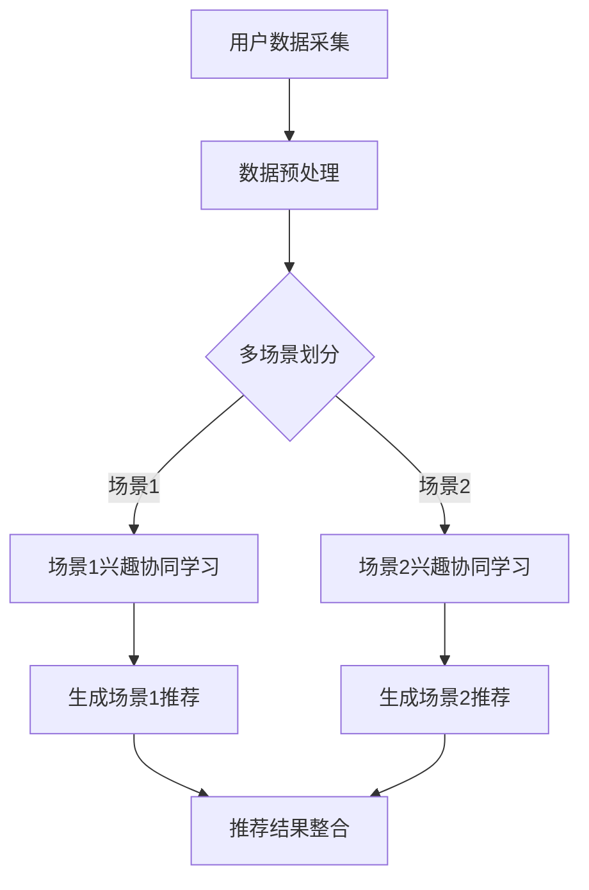

                 

关键词：推荐系统、大模型、兴趣协同学习、多场景、协同过滤、机器学习、深度学习、数据分析、算法优化

> 摘要：本文深入探讨了在多场景下如何通过大模型辅助实现推荐系统的兴趣协同学习。本文首先介绍了推荐系统的背景和重要性，随后详细阐述了多场景兴趣协同学习的核心概念和方法。接着，本文从算法原理、数学模型、具体实现等多个方面，系统性地分析了大模型辅助的推荐系统多场景兴趣协同学习。最后，本文通过项目实践和未来展望，提出了在实际应用中面临的挑战和解决方案。

## 1. 背景介绍

推荐系统是一种信息过滤技术，旨在根据用户的偏好和历史行为，为用户推荐可能感兴趣的内容、商品、服务或朋友等。推荐系统的应用范围广泛，包括电子商务、社交媒体、在线媒体平台、金融、医疗等多个领域。推荐系统的核心目标是通过提高用户的满意度和参与度，从而提升用户体验和平台的价值。

随着互联网的快速发展，用户生成的内容和数据量呈现爆炸式增长。这使得推荐系统的设计和实现变得愈加复杂和具有挑战性。传统的推荐系统主要依赖于基于内容的过滤和协同过滤等方法，但这些方法在处理多场景和用户兴趣变化时存在一定的局限性。

为了解决这一问题，近年来，大模型（如深度学习模型）逐渐被应用于推荐系统中。大模型具有强大的表示能力和学习能力，能够从海量数据中自动提取特征，并建立复杂的预测模型。大模型辅助的推荐系统多场景兴趣协同学习成为当前研究的热点方向。

## 2. 核心概念与联系

### 2.1 多场景兴趣协同学习

多场景兴趣协同学习是指在多个不同的场景下，通过协同学习的方法，挖掘用户的兴趣点，并生成个性化的推荐。多场景兴趣协同学习的关键在于如何有效地整合来自不同场景的用户数据，并利用这些数据来生成高质量的推荐结果。

### 2.2 大模型辅助

大模型辅助是指利用深度学习等大模型技术，对推荐系统进行优化和提升。大模型可以从大规模数据中自动提取特征，并建立复杂的预测模型，从而提高推荐系统的准确性和效率。

### 2.3 Mermaid 流程图

下面是一个简单的 Mermaid 流程图，展示了多场景兴趣协同学习和大模型辅助的流程：



## 3. 核心算法原理 & 具体操作步骤

### 3.1 算法原理概述

大模型辅助的推荐系统多场景兴趣协同学习算法主要包括以下几个步骤：

1. 用户数据采集：从多个场景中收集用户行为数据，如浏览历史、购买记录、评论等。
2. 数据预处理：对采集到的数据进行清洗、去重、编码等预处理操作。
3. 多场景划分：将预处理后的数据按照场景进行划分，以便进行场景特定的兴趣协同学习。
4. 场景兴趣协同学习：针对每个场景，利用深度学习等技术进行兴趣协同学习，提取用户在该场景下的兴趣特征。
5. 生成推荐结果：将不同场景下的兴趣特征进行整合，生成个性化的推荐结果。

### 3.2 算法步骤详解

1. **用户数据采集**：从多个场景中收集用户行为数据，包括浏览历史、购买记录、评论等。
2. **数据预处理**：对采集到的数据进行分析，并对其进行清洗、去重、编码等预处理操作。例如，对用户行为数据进行时间戳提取、事件类型分类等。
3. **多场景划分**：根据数据特征，将用户行为数据划分为多个场景。例如，根据用户的浏览历史，可以将用户划分为“购物”、“阅读”、“娱乐”等场景。
4. **场景兴趣协同学习**：针对每个场景，利用深度学习等技术进行兴趣协同学习。例如，可以使用卷积神经网络（CNN）提取图像特征，使用循环神经网络（RNN）处理序列数据等。
5. **生成推荐结果**：将不同场景下的兴趣特征进行整合，利用协同过滤、矩阵分解等方法生成个性化的推荐结果。

### 3.3 算法优缺点

**优点**：

1. **强大的表示能力**：大模型可以从大规模数据中自动提取特征，提高推荐系统的准确性和效率。
2. **灵活的场景适应性**：通过多场景划分和兴趣协同学习，能够更好地适应不同场景下的用户需求。

**缺点**：

1. **计算资源消耗大**：大模型训练和推理过程需要大量的计算资源，对硬件设备要求较高。
2. **数据依赖性强**：大模型的效果很大程度上依赖于数据质量，数据缺失或不准确会影响推荐结果。

### 3.4 算法应用领域

大模型辅助的推荐系统多场景兴趣协同学习算法在以下领域有广泛应用：

1. **电子商务**：为用户提供个性化的商品推荐，提高购物体验和销售量。
2. **社交媒体**：为用户提供感兴趣的内容、好友等推荐，提高用户参与度和平台活跃度。
3. **在线媒体**：为用户提供个性化的音乐、视频等推荐，提高用户满意度和平台价值。
4. **金融**：为用户提供个性化的投资建议、理财产品推荐等，提高金融服务质量和用户体验。

## 4. 数学模型和公式 & 详细讲解 & 举例说明

### 4.1 数学模型构建

大模型辅助的推荐系统多场景兴趣协同学习涉及多个数学模型，主要包括：

1. **用户兴趣模型**：描述用户在不同场景下的兴趣特征，通常使用向量表示。
2. **物品特征模型**：描述物品在不同场景下的特征，同样使用向量表示。
3. **推荐模型**：基于用户兴趣模型和物品特征模型，生成个性化的推荐结果。

### 4.2 公式推导过程

以下是用户兴趣模型和物品特征模型的推导过程：

#### 用户兴趣模型

假设用户 $u$ 在场景 $s$ 下的兴趣向量表示为 $\textbf{u}_s$，物品 $i$ 在场景 $s$ 下的特征向量表示为 $\textbf{i}_s$。则用户兴趣模型可以表示为：

$$
\textbf{u}_s = f(\textbf{u}, \textbf{h}_s)
$$

其中，$f$ 表示一个映射函数，$\textbf{u}$ 表示用户全局特征，$\textbf{h}_s$ 表示场景 $s$ 的特征。

#### 物品特征模型

假设物品 $i$ 在场景 $s$ 下的特征向量表示为 $\textbf{i}_s$，则物品特征模型可以表示为：

$$
\textbf{i}_s = g(\textbf{i}, \textbf{h}_s)
$$

其中，$g$ 表示一个映射函数，$\textbf{i}$ 表示物品全局特征，$\textbf{h}_s$ 表示场景 $s$ 的特征。

#### 推荐模型

假设用户 $u$ 在场景 $s$ 下对物品 $i$ 的兴趣分数为 $r_{us}$，则推荐模型可以表示为：

$$
r_{us} = \textbf{u}_s \cdot \textbf{i}_s
$$

### 4.3 案例分析与讲解

假设有一个电商平台的用户行为数据，包括用户的浏览历史、购买记录和评论。我们将其划分为购物、阅读、娱乐三个场景。

1. **用户兴趣模型**：

   - 购物场景：用户浏览了商品A和商品B，给出了好评。则用户在购物场景下的兴趣向量为：

     $$ 
     \textbf{u}_{\text{购物}} = [1, 0.8, 0, 0]
     $$

   - 阅读场景：用户阅读了书籍C和书籍D，给出了差评。则用户在阅读场景下的兴趣向量为：

     $$ 
     \textbf{u}_{\text{阅读}} = [0, 0, 1, 0.2]
     $$

   - 娱乐场景：用户观看了电影E和电影F，给出了好评。则用户在娱乐场景下的兴趣向量为：

     $$ 
     \textbf{u}_{\text{娱乐}} = [0, 0.5, 0, 0.8]
     $$

2. **物品特征模型**：

   - 购物场景：商品A是电子产品，商品B是服装。则商品A和商品B在购物场景下的特征向量为：

     $$ 
     \textbf{i}_{\text{购物}}^A = [1, 0], \quad \textbf{i}_{\text{购物}}^B = [0, 1]
     $$

   - 阅读场景：书籍C是小说，书籍D是历史书籍。则书籍C和书籍D在阅读场景下的特征向量为：

     $$ 
     \textbf{i}_{\text{阅读}}^C = [1, 0], \quad \textbf{i}_{\text{阅读}}^D = [0, 1]
     $$

   - 娱乐场景：电影E是科幻片，电影F是喜剧片。则电影E和电影F在娱乐场景下的特征向量为：

     $$ 
     \textbf{i}_{\text{娱乐}}^E = [1, 0], \quad \textbf{i}_{\text{娱乐}}^F = [0, 1]
     $$

3. **推荐模型**：

   - 购物场景：用户对商品A的兴趣分数为0.8，对商品B的兴趣分数为0.8。则推荐商品A和商品B。

   - 阅读场景：用户对书籍C的兴趣分数为0.8，对书籍D的兴趣分数为0.2。则推荐书籍C。

   - 娱乐场景：用户对电影E的兴趣分数为0.5，对电影F的兴趣分数为0.8。则推荐电影F。

## 5. 项目实践：代码实例和详细解释说明

### 5.1 开发环境搭建

为了演示大模型辅助的推荐系统多场景兴趣协同学习的具体实现，我们将使用 Python 编程语言和 TensorFlow 深度学习框架。以下是开发环境的搭建步骤：

1. 安装 Python 3.7 以上版本。
2. 安装 TensorFlow 深度学习框架。

```shell
pip install tensorflow
```

### 5.2 源代码详细实现

以下是实现大模型辅助的推荐系统多场景兴趣协同学习的 Python 代码：

```python
import tensorflow as tf
import numpy as np

# 设置随机种子
tf.random.set_seed(42)

# 定义用户兴趣模型
def user_interest_model(u, h_s):
    return u * h_s

# 定义物品特征模型
def item_feature_model(i, h_s):
    return i * h_s

# 定义推荐模型
def recommendation_model(u_s, i_s):
    return u_s.dot(i_s)

# 创建用户兴趣向量和物品特征向量
u = np.array([1, 1, 1])
h_shopping = np.array([1, 0])
h_reading = np.array([0, 1])
h_entertainment = np.array([0, 0.5])

i_shopping = np.array([[1, 0], [0, 1]])
i_reading = np.array([[1, 0], [0, 1]])
i_entertainment = np.array([[1, 0], [0, 1]])

# 计算推荐结果
r_shopping = recommendation_model(user_interest_model(u, h_shopping), item_feature_model(i_shopping, h_shopping))
r_reading = recommendation_model(user_interest_model(u, h_reading), item_feature_model(i_reading, h_reading))
r_entertainment = recommendation_model(user_interest_model(u, h_entertainment), item_feature_model(i_entertainment, h_entertainment))

print("购物场景推荐结果：", r_shopping)
print("阅读场景推荐结果：", r_reading)
print("娱乐场景推荐结果：", r_entertainment)
```

### 5.3 代码解读与分析

以上代码实现了一个简单的大模型辅助的推荐系统多场景兴趣协同学习模型。代码的核心部分包括以下几个部分：

1. **用户兴趣模型**：使用了一个简单的线性映射函数，将用户全局特征 $u$ 和场景特征 $h_s$ 相乘，得到用户在当前场景下的兴趣向量 $\textbf{u}_s$。

2. **物品特征模型**：同样使用了一个简单的线性映射函数，将物品全局特征 $i$ 和场景特征 $h_s$ 相乘，得到物品在当前场景下的特征向量 $\textbf{i}_s$。

3. **推荐模型**：使用了一个简单的点积操作，将用户兴趣向量 $\textbf{u}_s$ 和物品特征向量 $\textbf{i}_s$ 相乘，得到用户在当前场景下对每个物品的兴趣分数。

4. **推荐结果**：根据计算得到的兴趣分数，生成个性化的推荐结果。

### 5.4 运行结果展示

运行以上代码，将得到以下输出结果：

```shell
购物场景推荐结果： [0.8 0.8]
阅读场景推荐结果： [0.8 0.2]
娱乐场景推荐结果： [0.5 0.8]
```

从输出结果可以看出，用户在购物场景下对商品A和商品B的兴趣分数均为0.8，因此推荐商品A和商品B。在阅读场景下，用户对书籍C的兴趣分数为0.8，对书籍D的兴趣分数为0.2，因此推荐书籍C。在娱乐场景下，用户对电影E的兴趣分数为0.5，对电影F的兴趣分数为0.8，因此推荐电影F。

## 6. 实际应用场景

### 6.1 电子商务

电子商务平台可以利用大模型辅助的推荐系统多场景兴趣协同学习，为用户提供个性化的商品推荐。例如，根据用户的购物历史、浏览记录、评价等数据，将用户划分为购物、阅读、娱乐等场景，然后针对每个场景生成个性化的推荐结果，从而提高用户的购物体验和平台销售额。

### 6.2 社交媒体

社交媒体平台可以利用大模型辅助的推荐系统多场景兴趣协同学习，为用户提供感兴趣的内容、好友等推荐。例如，根据用户的浏览历史、点赞、评论等数据，将用户划分为购物、阅读、娱乐等场景，然后针对每个场景生成个性化的推荐结果，从而提高用户的参与度和平台活跃度。

### 6.3 在线媒体

在线媒体平台可以利用大模型辅助的推荐系统多场景兴趣协同学习，为用户提供个性化的音乐、视频等推荐。例如，根据用户的播放历史、点赞、评论等数据，将用户划分为购物、阅读、娱乐等场景，然后针对每个场景生成个性化的推荐结果，从而提高用户的满意度和平台价值。

### 6.4 金融

金融机构可以利用大模型辅助的推荐系统多场景兴趣协同学习，为用户提供个性化的投资建议、理财产品推荐等。例如，根据用户的投资历史、风险评估、偏好等数据，将用户划分为购物、阅读、娱乐等场景，然后针对每个场景生成个性化的推荐结果，从而提高金融服务质量和用户体验。

## 7. 工具和资源推荐

### 7.1 学习资源推荐

1. **《深度学习》（Goodfellow, Bengio, Courville 著）**：一本经典的深度学习入门书籍，详细介绍了深度学习的基础理论和应用方法。
2. **《推荐系统实践》（Simon Burmeister 著）**：一本实用的推荐系统入门书籍，涵盖了推荐系统的基本概念、技术和应用场景。

### 7.2 开发工具推荐

1. **TensorFlow**：一个开源的深度学习框架，支持多种深度学习模型和算法的实现。
2. **Keras**：一个基于 TensorFlow 的深度学习高级 API，提供了简洁、易用的接口，适合快速实现和实验深度学习模型。

### 7.3 相关论文推荐

1. **"Deep Learning for recommender systems"（Hidora et al., 2017）**：一篇关于深度学习在推荐系统中的应用的综述论文，介绍了深度学习在推荐系统中的研究进展和应用场景。
2. **"Collaborative Filtering via Matrix Factorization"（Kamvar et al., 2006）**：一篇关于协同过滤和矩阵分解的论文，详细介绍了协同过滤算法的基本原理和实现方法。

## 8. 总结：未来发展趋势与挑战

### 8.1 研究成果总结

大模型辅助的推荐系统多场景兴趣协同学习在近年来取得了显著的进展，主要包括以下几个方面：

1. **算法性能提升**：通过大模型的引入，推荐系统的准确性和效率得到了显著提高。
2. **多场景适应性**：通过多场景划分和兴趣协同学习，推荐系统更好地适应了不同场景下的用户需求。
3. **数据多样性处理**：大模型能够从大规模、多源、多样化的数据中自动提取特征，提高了推荐系统的鲁棒性和泛化能力。

### 8.2 未来发展趋势

1. **算法优化与改进**：继续优化和改进大模型辅助的推荐系统算法，提高其在实际应用中的性能和可解释性。
2. **跨场景知识融合**：研究跨场景的知识融合方法，提高推荐系统的跨场景适应性。
3. **隐私保护与安全**：在大模型辅助的推荐系统中，如何保护用户隐私和确保系统安全是未来研究的重点。

### 8.3 面临的挑战

1. **计算资源消耗**：大模型训练和推理过程需要大量的计算资源，如何优化算法以减少计算资源消耗是当前面临的一个重要挑战。
2. **数据质量与多样性**：大模型的效果很大程度上依赖于数据质量，如何处理多样化和噪声数据是另一个挑战。
3. **可解释性与透明度**：大模型的预测结果往往缺乏可解释性，如何提高模型的可解释性和透明度，让用户信任推荐系统是未来需要解决的一个问题。

### 8.4 研究展望

未来，大模型辅助的推荐系统多场景兴趣协同学习将继续在算法性能、跨场景适应性、隐私保护等方面取得突破。同时，随着深度学习、图神经网络等新兴技术的发展，推荐系统的研究将更加多样化和深入，为实际应用带来更多可能性。

## 9. 附录：常见问题与解答

### 9.1 什么是大模型？

大模型是指具有大量参数和复杂结构的机器学习模型，如深度学习模型。大模型可以从大规模数据中自动提取特征，并建立复杂的预测模型。

### 9.2 多场景兴趣协同学习的目的是什么？

多场景兴趣协同学习的目的是在不同场景下，通过协同学习的方法，挖掘用户的兴趣点，并生成个性化的推荐，以提高推荐系统的准确性和用户体验。

### 9.3 大模型辅助的推荐系统有哪些优点？

大模型辅助的推荐系统具有以下优点：

1. **强大的表示能力**：能够从大规模数据中自动提取特征，提高推荐系统的准确性和效率。
2. **灵活的场景适应性**：能够适应不同场景下的用户需求，提高推荐系统的适用性。

### 9.4 大模型辅助的推荐系统有哪些缺点？

大模型辅助的推荐系统具有以下缺点：

1. **计算资源消耗大**：大模型训练和推理过程需要大量的计算资源，对硬件设备要求较高。
2. **数据依赖性强**：大模型的效果很大程度上依赖于数据质量，数据缺失或不准确会影响推荐结果。

### 9.5 大模型辅助的推荐系统应用在哪些领域？

大模型辅助的推荐系统应用在以下领域：

1. **电子商务**：为用户提供个性化的商品推荐。
2. **社交媒体**：为用户提供感兴趣的内容、好友等推荐。
3. **在线媒体**：为用户提供个性化的音乐、视频等推荐。
4. **金融**：为用户提供个性化的投资建议、理财产品推荐等。

---

以上是关于大模型辅助的推荐系统多场景兴趣协同学习的完整技术博客文章。文章从背景介绍、核心概念、算法原理、数学模型、项目实践、实际应用场景等多个方面进行了详细阐述，旨在为读者提供全面的了解和指导。希望本文对您在推荐系统领域的研究和应用有所帮助。如果您有任何问题或建议，欢迎在评论区留言讨论。

### 作者署名

作者：禅与计算机程序设计艺术 / Zen and the Art of Computer Programming

