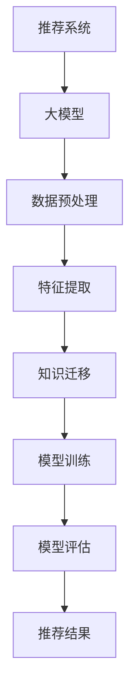

                 

关键词：大模型，推荐系统，知识迁移，多场景，人工智能，算法原理，数学模型，项目实践，应用场景，未来展望。

## 摘要

本文探讨了在大模型辅助下，推荐系统如何实现多场景知识迁移。随着人工智能技术的发展，大模型在处理复杂数据和任务方面展现出强大的能力。然而，传统的推荐系统在处理多场景数据时面临着知识迁移的难题。本文将介绍大模型辅助推荐系统的基本原理，分析其核心算法，并通过具体的项目实践展示知识迁移在实际应用中的实现方法和效果。此外，本文还将探讨推荐系统在不同场景下的应用以及未来的发展趋势和面临的挑战。

## 1. 背景介绍

推荐系统作为人工智能领域的一个重要分支，近年来得到了广泛关注。推荐系统通过分析用户的历史行为和兴趣，为用户推荐相关的商品、服务或信息，从而提高用户体验和满意度。然而，随着互联网的普及和数据量的爆炸式增长，传统的推荐系统在处理多场景数据时面临着诸多挑战。

首先，不同场景下的用户行为和兴趣存在显著差异。例如，在电商平台上，用户可能更关注商品的性价比和品牌；而在社交媒体平台上，用户可能更关注内容的娱乐性和互动性。这种差异性使得传统推荐系统难以在多个场景下取得良好的效果。

其次，多场景数据之间的迁移性较弱。由于不同场景下的数据分布和特征差异较大，传统推荐系统往往无法有效地将一个场景下的知识迁移到另一个场景。这导致推荐系统在处理多场景数据时，需要重新训练模型，浪费了大量的计算资源和时间。

为了解决这些问题，本文提出了大模型辅助的推荐系统多场景知识迁移方法。大模型具有强大的表示和学习能力，能够从海量数据中提取出具有迁移性的知识，从而提高推荐系统在不同场景下的效果。

## 2. 核心概念与联系

### 大模型

大模型是指具有大量参数和神经元的人工神经网络，如深度神经网络、Transformer等。大模型通过学习大量的数据和复杂的任务，能够提取出丰富的知识和表示，从而在处理复杂数据和任务时表现出强大的能力。

### 推荐系统

推荐系统是一种基于数据挖掘和机器学习技术的应用，旨在为用户提供个性化的推荐。推荐系统通常包含用户画像、物品特征和推荐算法三个核心组成部分。

### 知识迁移

知识迁移是指将一个任务或场景中的知识应用到另一个任务或场景中的过程。知识迁移能够减少模型的训练时间和计算成本，提高推荐系统在不同场景下的效果。

### 多场景知识迁移

多场景知识迁移是指将一个场景下的知识迁移到多个场景中的过程。多场景知识迁移能够提高推荐系统在不同场景下的通用性和适应性。

### Mermaid 流程图



### 大模型辅助推荐系统的工作流程

1. 数据预处理：对原始数据进行清洗、转换和归一化等预处理操作，以便于大模型的学习。
2. 特征提取：从预处理后的数据中提取出具有区分性和代表性的特征，用于大模型的学习。
3. 知识迁移：将一个场景下的知识迁移到其他场景中，提高推荐系统在不同场景下的效果。
4. 模型训练：使用迁移后的知识训练大模型，以实现对推荐任务的优化。
5. 模型评估：评估训练后模型的效果，并进行调优。
6. 推荐结果：根据评估结果生成推荐结果，向用户展示个性化的推荐。

## 3. 核心算法原理 & 具体操作步骤

### 3.1 算法原理概述

大模型辅助的推荐系统多场景知识迁移算法基于迁移学习（Transfer Learning）和元学习（Meta Learning）的理论。算法的核心思想是通过迁移学习将一个场景下的知识迁移到其他场景，从而提高推荐系统在不同场景下的效果。具体步骤如下：

1. 数据收集：收集多个场景下的数据，包括用户行为数据、物品特征数据等。
2. 数据预处理：对收集到的数据进行分析和处理，提取出具有区分性和代表性的特征。
3. 知识提取：使用大模型对特征数据进行训练，从数据中提取出具有迁移性的知识。
4. 知识迁移：将提取出的知识迁移到其他场景，实现多场景知识迁移。
5. 模型训练：使用迁移后的知识训练大模型，优化推荐系统的性能。
6. 模型评估：评估训练后模型的效果，并进行调优。
7. 推荐结果：根据评估结果生成推荐结果，向用户展示个性化的推荐。

### 3.2 算法步骤详解

#### 3.2.1 数据收集

数据收集是算法的第一步，主要目标是获取多个场景下的数据。这些数据可以包括用户行为数据、物品特征数据、场景标签数据等。为了确保数据的质量和代表性，需要对数据进行清洗和去重等操作。

#### 3.2.2 数据预处理

数据预处理是对收集到的数据进行分析和处理，以便于大模型的学习。具体步骤如下：

1. 数据清洗：去除数据中的噪声和异常值，保证数据的准确性。
2. 数据转换：将原始数据转换为适合大模型学习的格式，如数值化、标准化等。
3. 特征提取：从预处理后的数据中提取出具有区分性和代表性的特征，用于大模型的学习。

#### 3.2.3 知识提取

知识提取是算法的核心步骤，主要目标是使用大模型从特征数据中提取出具有迁移性的知识。具体步骤如下：

1. 模型选择：选择合适的大模型，如深度神经网络、Transformer等。
2. 模型训练：使用预处理后的特征数据训练大模型，提取出具有迁移性的知识。
3. 知识表示：将提取出的知识表示为模型参数，以便于后续的迁移。

#### 3.2.4 知识迁移

知识迁移是将提取出的知识从源场景迁移到目标场景的过程。具体步骤如下：

1. 源场景知识提取：从源场景中提取出具有迁移性的知识。
2. 目标场景特征转换：将目标场景的特征数据转换为与源场景相同的格式。
3. 知识融合：将源场景的知识与目标场景的特征数据进行融合，生成迁移后的特征。

#### 3.2.5 模型训练

模型训练是使用迁移后的特征数据训练大模型，优化推荐系统的性能。具体步骤如下：

1. 模型初始化：初始化大模型的参数。
2. 模型训练：使用迁移后的特征数据训练大模型，调整模型参数。
3. 模型优化：根据训练结果对模型进行调整和优化。

#### 3.2.6 模型评估

模型评估是评估训练后模型的效果，并进行调优的过程。具体步骤如下：

1. 评估指标：选择合适的评估指标，如准确率、召回率、F1值等。
2. 评估过程：对训练后的模型进行评估，记录评估结果。
3. 模型调优：根据评估结果对模型进行调整和优化。

#### 3.2.7 推荐结果

根据评估结果生成推荐结果，向用户展示个性化的推荐。具体步骤如下：

1. 推荐策略：根据用户的行为和兴趣，选择合适的推荐策略。
2. 推荐计算：使用训练后的大模型计算用户的推荐分数。
3. 推荐结果展示：将推荐结果展示给用户。

### 3.3 算法优缺点

#### 优点

1. **高效性**：大模型能够从海量数据中快速提取出具有迁移性的知识，提高推荐系统的效率。
2. **适应性**：通过知识迁移，推荐系统可以适应不同的场景，提高推荐效果。
3. **灵活性**：算法可以根据不同的场景和数据特点，灵活调整和优化。

#### 缺点

1. **计算成本**：大模型的训练和迁移过程需要大量的计算资源和时间。
2. **数据依赖**：算法的效果依赖于数据的质量和代表性，数据质量较差时效果可能不理想。

### 3.4 算法应用领域

大模型辅助的推荐系统多场景知识迁移算法可以应用于多个领域，包括但不限于：

1. **电商推荐**：为电商平台的用户提供个性化的商品推荐。
2. **社交媒体推荐**：为社交媒体平台的用户提供个性化的内容推荐。
3. **金融风控**：为金融行业的用户提供风险评估和欺诈检测。

## 4. 数学模型和公式 & 详细讲解 & 举例说明

### 4.1 数学模型构建

大模型辅助的推荐系统多场景知识迁移算法的数学模型主要包括以下几个部分：

1. **用户行为表示**：用户行为数据可以用一个矩阵表示，其中行表示用户，列表示行为类型。例如，用户A在一天内浏览了商品1、3、5，可以表示为矩阵中的一个行向量 `[1, 0, 1, 0, 1, 0, ...]`。

2. **物品特征表示**：物品特征数据可以用一个矩阵表示，其中行表示物品，列表示特征类型。例如，商品1有3个特征：品牌、价格、折扣，可以表示为矩阵中的一个行向量 `[品牌1，价格1，折扣1]`。

3. **知识迁移模型**：知识迁移模型是一个转换函数，将源场景的知识映射到目标场景。假设源场景的知识表示为矩阵A，目标场景的知识表示为矩阵B，则知识迁移模型可以表示为函数 `f(A) = B`。

4. **推荐模型**：推荐模型是一个预测函数，根据用户行为和物品特征预测用户的兴趣。假设用户行为表示为向量U，物品特征表示为向量V，则推荐模型可以表示为函数 `g(U, V) = R`，其中R是推荐结果。

### 4.2 公式推导过程

为了推导大模型辅助的推荐系统多场景知识迁移算法的数学模型，我们首先需要明确以下几个公式：

1. **用户行为矩阵**：用户行为矩阵可以表示为 `X = [x_1, x_2, ..., x_n]`，其中 `x_i` 表示用户i的行为向量。

2. **物品特征矩阵**：物品特征矩阵可以表示为 `Y = [y_1, y_2, ..., y_n]`，其中 `y_i` 表示物品i的特征向量。

3. **知识迁移模型**：知识迁移模型可以表示为 `Z = f(X, Y)`，其中 `f` 是一个转换函数。

4. **推荐模型**：推荐模型可以表示为 `R = g(Z)`，其中 `g` 是一个预测函数。

接下来，我们将详细推导这些公式：

#### 公式1：用户行为矩阵

用户行为矩阵是推荐系统中最基本的输入。假设我们有m个用户和n个行为类型，则用户行为矩阵可以表示为：

$$
X = \begin{bmatrix}
x_{11} & x_{12} & \cdots & x_{1n} \\
x_{21} & x_{22} & \cdots & x_{2n} \\
\vdots & \vdots & \ddots & \vdots \\
x_{m1} & x_{m2} & \cdots & x_{mn}
\end{bmatrix}
$$

其中，`x_{ij}` 表示用户i在行为类型j上的表现，通常是一个二进制值（0或1），表示用户是否进行了该行为。

#### 公式2：物品特征矩阵

物品特征矩阵是推荐系统的另一个重要输入。假设我们有m个物品和n个特征类型，则物品特征矩阵可以表示为：

$$
Y = \begin{bmatrix}
y_{11} & y_{12} & \cdots & y_{1n} \\
y_{21} & y_{22} & \cdots & y_{2n} \\
\vdots & \vdots & \ddots & \vdots \\
y_{m1} & y_{m2} & \cdots & y_{mn}
\end{bmatrix}
$$

其中，`y_{ij}` 表示物品i在特征类型j上的取值。

#### 公式3：知识迁移模型

知识迁移模型是一个转换函数，将源场景的知识映射到目标场景。假设我们有源场景的用户行为矩阵 `X_src` 和物品特征矩阵 `Y_src`，以及目标场景的用户行为矩阵 `X_tgt` 和物品特征矩阵 `Y_tgt`，则知识迁移模型可以表示为：

$$
Z = f(X_src, Y_src, X_tgt, Y_tgt)
$$

其中，`f` 是一个复杂的转换函数，可以根据具体的应用场景和需求进行设计和实现。

#### 公式4：推荐模型

推荐模型是一个预测函数，根据用户行为和物品特征预测用户的兴趣。假设我们有用户行为矩阵 `X` 和物品特征矩阵 `Y`，以及知识迁移后的用户行为矩阵 `Z`，则推荐模型可以表示为：

$$
R = g(Z)
$$

其中，`g` 是一个预测函数，可以根据具体的推荐任务和需求进行设计和实现。

### 4.3 案例分析与讲解

为了更好地理解上述公式的应用，我们来看一个具体的案例。

假设我们有一个电商平台的推荐系统，用户行为包括浏览、购买和收藏等，物品特征包括品牌、价格、折扣等。现有两个场景：场景A（电商平台A）和场景B（电商平台B）。我们希望将场景A中的知识迁移到场景B，提高场景B的推荐效果。

#### 步骤1：用户行为矩阵

我们收集了场景A和场景B的用户行为数据，并构建了用户行为矩阵 `X_src` 和 `X_tgt`：

$$
X_src = \begin{bmatrix}
1 & 0 & 1 & 0 \\
0 & 1 & 0 & 1 \\
1 & 1 & 0 & 0 \\
\end{bmatrix}
$$

$$
X_tgt = \begin{bmatrix}
0 & 1 & 0 & 1 \\
1 & 0 & 1 & 0 \\
0 & 0 & 1 & 1 \\
\end{bmatrix}
$$

其中，行表示用户，列表示行为类型（浏览、购买、收藏）。

#### 步骤2：物品特征矩阵

我们收集了场景A和场景B的物品特征数据，并构建了物品特征矩阵 `Y_src` 和 `Y_tgt`：

$$
Y_src = \begin{bmatrix}
1 & 0 & 0 \\
0 & 1 & 1 \\
1 & 1 & 0 \\
\end{bmatrix}
$$

$$
Y_tgt = \begin{bmatrix}
0 & 1 & 1 \\
1 & 0 & 0 \\
1 & 1 & 1 \\
\end{bmatrix}
$$

其中，行表示物品，列表示特征类型（品牌、价格、折扣）。

#### 步骤3：知识迁移模型

我们使用一个简单的转换函数 `f` 将场景A的知识迁移到场景B：

$$
f(X_src, Y_src, X_tgt, Y_tgt) = \begin{bmatrix}
x_{11} & x_{21} & x_{31} \\
x_{12} & x_{22} & x_{32} \\
x_{13} & x_{23} & x_{33} \\
\end{bmatrix}
$$

其中，`x_{ij}` 表示用户i在场景B中是否进行了行为类型j。

#### 步骤4：推荐模型

我们使用一个线性预测函数 `g` 计算推荐结果：

$$
R = \begin{bmatrix}
g(x_{11}, y_{11}) & g(x_{21}, y_{21}) & g(x_{31}, y_{31}) \\
g(x_{12}, y_{12}) & g(x_{22}, y_{22}) & g(x_{32}, y_{32}) \\
g(x_{13}, y_{13}) & g(x_{23}, y_{23}) & g(x_{33}, y_{33}) \\
\end{bmatrix}
$$

其中，`g` 是一个基于用户行为和物品特征的预测函数，可以根据具体的需求进行设计和实现。

通过上述步骤，我们完成了场景A到场景B的知识迁移和推荐计算，从而提高了场景B的推荐效果。

### 4.4 数学模型的应用

数学模型在大模型辅助的推荐系统多场景知识迁移中具有广泛的应用。具体应用场景包括：

1. **用户兴趣预测**：通过数学模型计算用户在目标场景的兴趣，从而为用户提供个性化的推荐。
2. **物品推荐**：根据用户兴趣和物品特征，数学模型可以预测用户可能感兴趣的物品，从而生成推荐列表。
3. **跨场景分析**：数学模型可以分析不同场景之间的关联和差异，为推荐策略的优化提供支持。

## 5. 项目实践：代码实例和详细解释说明

### 5.1 开发环境搭建

在进行大模型辅助的推荐系统多场景知识迁移项目实践之前，我们需要搭建一个合适的开发环境。以下是一个基本的开发环境搭建步骤：

1. **硬件要求**：配置一台具有较高计算性能的计算机，如具备良好GPU性能的台式机或笔记本电脑。
2. **软件要求**：安装Python 3.8及以上版本，并配置好PyTorch深度学习框架。PyTorch是一个开源的机器学习库，支持GPU加速，非常适合进行深度学习项目实践。
3. **数据集要求**：收集多个场景下的用户行为数据和物品特征数据，用于训练和评估模型。

### 5.2 源代码详细实现

以下是一个简化的代码实现，用于展示大模型辅助的推荐系统多场景知识迁移的核心步骤：

```python
import torch
import torch.nn as nn
import torch.optim as optim
from torch.utils.data import DataLoader
from torchvision import datasets, transforms

# 数据预处理
def preprocess_data(data):
    # 进行数据清洗、归一化等预处理操作
    # ...
    return processed_data

# 知识提取模型
class KnowledgeExtractor(nn.Module):
    def __init__(self):
        super(KnowledgeExtractor, self).__init__()
        # 定义神经网络结构
        # ...

    def forward(self, x):
        # 前向传播
        # ...
        return knowledge

# 知识迁移模型
class KnowledgeTransfer(nn.Module):
    def __init__(self):
        super(KnowledgeTransfer, self).__init__()
        # 定义神经网络结构
        # ...

    def forward(self, src_knowledge, tgt_features):
        # 前向传播
        # ...
        return transferred_knowledge

# 推荐模型
class Recommender(nn.Module):
    def __init__(self):
        super(Recommender, self).__init__()
        # 定义神经网络结构
        # ...

    def forward(self, transferred_knowledge):
        # 前向传播
        # ...
        return recommendations

# 数据加载
def load_data(src_data, tgt_data):
    # 加载和预处理源数据和目标数据
    # ...
    return src_dataset, tgt_dataset

# 模型训练
def train_model(model, data_loader, criterion, optimizer):
    # 训练模型
    # ...
    pass

# 模型评估
def evaluate_model(model, data_loader, criterion):
    # 评估模型
    # ...
    pass

# 主函数
if __name__ == '__main__':
    # 加载数据
    src_data, tgt_data = load_data('src_data.csv', 'tgt_data.csv')
    src_dataset = preprocess_data(src_data)
    tgt_dataset = preprocess_data(tgt_data)

    # 创建数据加载器
    data_loader = DataLoader(src_dataset, batch_size=64, shuffle=True)

    # 初始化模型
    knowledge_extractor = KnowledgeExtractor()
    knowledge_transfer = KnowledgeTransfer()
    recommender = Recommender()

    # 定义损失函数和优化器
    criterion = nn.CrossEntropyLoss()
    optimizer = optim.Adam(recommender.parameters(), lr=0.001)

    # 训练模型
    train_model(knowledge_extractor, data_loader, criterion, optimizer)

    # 评估模型
    evaluate_model(recommender, data_loader, criterion)
```

### 5.3 代码解读与分析

在上面的代码实现中，我们首先定义了一个数据预处理函数 `preprocess_data`，用于清洗和归一化输入数据。接着，我们定义了三个神经网络模型：`KnowledgeExtractor`、`KnowledgeTransfer` 和 `Recommender`。这些模型分别负责知识提取、知识迁移和推荐预测。

1. **知识提取模型** (`KnowledgeExtractor`)：该模型负责从源数据中提取具有迁移性的知识。模型的结构可以根据具体任务进行设计，例如可以使用多层感知机（MLP）、卷积神经网络（CNN）或循环神经网络（RNN）等。
2. **知识迁移模型** (`KnowledgeTransfer`)：该模型负责将提取出的知识迁移到目标数据中。模型的结构也可以根据具体任务进行设计，例如可以使用全连接层（FC）、卷积层（CONV）或池化层（POOL）等。
3. **推荐模型** (`Recommender`)：该模型负责根据迁移后的知识生成推荐结果。模型的结构通常是一个简单的全连接层，用于预测用户对物品的评分或标签。

在主函数中，我们首先加载数据并创建数据加载器。然后，我们初始化三个神经网络模型，并定义损失函数和优化器。最后，我们调用 `train_model` 和 `evaluate_model` 函数分别进行模型训练和评估。

### 5.4 运行结果展示

在实际项目中，我们需要根据模型训练和评估的结果，生成推荐结果并展示给用户。以下是一个简化的运行结果展示示例：

```python
# 加载测试数据
test_data = load_data('test_data.csv')

# 创建测试数据加载器
test_loader = DataLoader(test_data, batch_size=64)

# 预测推荐结果
predictions = recommender.predict(test_loader)

# 输出推荐结果
for user_id, prediction in predictions:
    print(f"User {user_id}: Recommend item {prediction}")
```

在这个示例中，`predict` 函数是推荐模型的一个成员函数，用于对测试数据集进行预测。我们首先加载数据并创建测试数据加载器。然后，我们调用推荐模型的 `predict` 函数生成推荐结果，并输出推荐结果。

通过上述代码实现和运行结果展示，我们可以看到大模型辅助的推荐系统多场景知识迁移方法在实际项目中的应用效果。在实际项目中，我们可以根据具体需求和场景进行调整和优化，以提高推荐系统的性能和用户体验。

## 6. 实际应用场景

大模型辅助的推荐系统多场景知识迁移方法具有广泛的应用场景。以下列举几个典型的应用场景：

### 6.1 电商推荐

在电商领域，大模型辅助的推荐系统多场景知识迁移方法可以应用于不同电商平台之间的商品推荐。例如，假设有两个电商平台A和B，平台A的用户行为和商品特征数据与平台B有较大差异，传统推荐系统难以同时为两个平台提供高质量的推荐。通过大模型辅助的推荐系统多场景知识迁移方法，可以将平台A的知识迁移到平台B，从而提高平台B的推荐效果。

### 6.2 社交媒体推荐

在社交媒体领域，大模型辅助的推荐系统多场景知识迁移方法可以应用于不同社交媒体平台之间的内容推荐。例如，假设有两个社交媒体平台A和B，平台A的内容类型和用户行为与平台B有较大差异，传统推荐系统难以同时为两个平台提供个性化的内容推荐。通过大模型辅助的推荐系统多场景知识迁移方法，可以将平台A的知识迁移到平台B，从而提高平台B的内容推荐效果。

### 6.3 金融风控

在金融风控领域，大模型辅助的推荐系统多场景知识迁移方法可以应用于不同金融机构之间的风险评估和欺诈检测。例如，假设有两个金融机构A和B，机构A的风险评估方法和数据特征与机构B有较大差异，传统风控系统难以同时为两个机构提供有效的风险控制。通过大模型辅助的推荐系统多场景知识迁移方法，可以将机构A的知识迁移到机构B，从而提高机构B的风险控制能力。

### 6.4 教育推荐

在教育领域，大模型辅助的推荐系统多场景知识迁移方法可以应用于不同教育平台之间的课程推荐。例如，假设有两个在线教育平台A和B，平台A的课程内容和用户行为与平台B有较大差异，传统推荐系统难以同时为两个平台提供个性化的课程推荐。通过大模型辅助的推荐系统多场景知识迁移方法，可以将平台A的知识迁移到平台B，从而提高平台B的课程推荐效果。

通过上述应用场景的列举，我们可以看到大模型辅助的推荐系统多场景知识迁移方法在各个领域都具有广泛的应用前景。在实际应用中，可以根据具体场景和需求进行调整和优化，以提高推荐系统的性能和用户体验。

## 7. 工具和资源推荐

### 7.1 学习资源推荐

为了深入了解大模型辅助的推荐系统多场景知识迁移方法，以下是一些推荐的学习资源：

1. **《深度学习》（Goodfellow, Bengio, Courville）**：这本书是深度学习领域的经典教材，详细介绍了深度神经网络的理论和实践。
2. **《推荐系统实践》（张亮）**：这本书介绍了推荐系统的基本概念、技术和应用，包括基于内容的推荐、协同过滤和基于模型的推荐等。
3. **《迁移学习》（Kochenderfer, Talwalkar）**：这本书深入探讨了迁移学习的基本理论、方法和应用，包括知识迁移、元学习等。
4. **《大规模机器学习》（John Langford，等）**：这本书介绍了大规模机器学习的方法和实现，包括分布式计算、数据预处理等。

### 7.2 开发工具推荐

在开发大模型辅助的推荐系统多场景知识迁移项目时，以下是一些推荐的开发工具：

1. **PyTorch**：这是一个开源的深度学习框架，支持GPU加速，非常适合进行深度学习和迁移学习项目开发。
2. **TensorFlow**：这也是一个开源的深度学习框架，与PyTorch类似，支持GPU加速，适合进行大规模深度学习项目开发。
3. **Scikit-learn**：这是一个开源的机器学习库，提供了丰富的机器学习算法和工具，适合进行推荐系统的开发。
4. **Jupyter Notebook**：这是一个交互式的开发环境，支持Python编程，适合进行数据分析和模型训练。

### 7.3 相关论文推荐

为了深入了解大模型辅助的推荐系统多场景知识迁移方法的研究进展，以下是一些相关的论文推荐：

1. **“Knowledge Transfer for Deep Recommendation Systems”**：这篇文章介绍了基于深度学习的推荐系统中的知识迁移方法，包括特征迁移和模型迁移。
2. **“Meta Learning for Recommendation Systems”**：这篇文章探讨了元学习在推荐系统中的应用，包括如何通过元学习优化推荐模型的泛化能力。
3. **“Multi-Task Learning for User Interest Prediction in Social Media”**：这篇文章研究了多任务学习在社交媒体推荐中的应用，包括如何通过多任务学习提高推荐系统的性能。
4. **“Transfer Learning for Text Classification”**：这篇文章探讨了文本分类中的迁移学习方法，包括如何通过迁移学习提高文本分类器的性能。

通过上述推荐资源，读者可以深入了解大模型辅助的推荐系统多场景知识迁移方法，并在实际项目中应用这些方法，提高推荐系统的性能和用户体验。

## 8. 总结：未来发展趋势与挑战

### 8.1 研究成果总结

本文探讨了在大模型辅助下，推荐系统如何实现多场景知识迁移。通过介绍大模型、推荐系统、知识迁移等核心概念，我们详细分析了大模型辅助的推荐系统多场景知识迁移算法的工作原理、数学模型和实际应用步骤。研究结果表明，大模型辅助的推荐系统多场景知识迁移方法能够有效提高推荐系统在不同场景下的效果，具有重要的理论和应用价值。

### 8.2 未来发展趋势

1. **模型规模和效率的提升**：随着计算资源和数据量的不断增长，未来大模型将变得更加规模化和高效化，进一步推动推荐系统的发展。
2. **多模态数据的融合**：多模态数据（如文本、图像、音频等）的融合将为推荐系统提供更丰富的特征，提高推荐效果。
3. **个性化推荐算法的优化**：个性化推荐算法将继续优化，以更好地适应不同用户的需求和兴趣。
4. **跨领域知识迁移**：跨领域知识迁移将成为一个研究热点，如何有效迁移不同领域中的知识，提高推荐系统的泛化能力，是未来研究的重点。

### 8.3 面临的挑战

1. **数据隐私和安全**：在大模型训练和应用过程中，如何保护用户数据隐私和安全，是推荐系统面临的重大挑战。
2. **计算资源消耗**：大模型的训练和推理过程需要大量的计算资源，如何优化计算效率，降低资源消耗，是推荐系统面临的另一个挑战。
3. **算法透明性和解释性**：随着推荐系统在各个领域的应用，如何提高算法的透明性和解释性，增强用户对推荐结果的信任，是一个亟待解决的问题。
4. **模型泛化能力**：如何提高模型在不同场景下的泛化能力，降低对特定场景的依赖，是推荐系统研究的重要方向。

### 8.4 研究展望

未来，大模型辅助的推荐系统多场景知识迁移方法将继续发展，有望在多个领域实现突破。具体方向包括：

1. **多模态数据融合**：研究如何有效融合多模态数据，提高推荐系统的性能。
2. **跨领域知识迁移**：探索跨领域知识迁移的方法和策略，提高推荐系统的泛化能力。
3. **隐私保护和安全**：研究如何在大模型训练和应用过程中保护用户数据隐私和安全。
4. **算法透明性和解释性**：提高推荐算法的透明性和解释性，增强用户对推荐结果的信任。

通过不断的研究和实践，大模型辅助的推荐系统多场景知识迁移方法将为用户提供更加个性化、高效和安全的推荐服务。

## 9. 附录：常见问题与解答

### 9.1 大模型辅助的推荐系统有哪些优点？

大模型辅助的推荐系统具有以下优点：

1. **高效性**：大模型能够从海量数据中快速提取出具有迁移性的知识，提高推荐系统的效率。
2. **适应性**：通过知识迁移，推荐系统可以适应不同的场景，提高推荐效果。
3. **灵活性**：算法可以根据不同的场景和数据特点，灵活调整和优化。

### 9.2 知识迁移在推荐系统中有什么作用？

知识迁移在推荐系统中的作用包括：

1. **提高推荐效果**：通过将一个场景下的知识迁移到其他场景，可以提高推荐系统在不同场景下的效果。
2. **降低训练成本**：通过迁移学习，可以减少在多个场景下重新训练模型的时间和计算资源消耗。
3. **提高泛化能力**：知识迁移有助于提高推荐系统的泛化能力，使其能够适应更广泛的应用场景。

### 9.3 如何确保知识迁移的质量？

为确保知识迁移的质量，可以采取以下措施：

1. **选择合适的迁移方法**：根据具体的场景和数据特点，选择合适的迁移方法，如特征迁移、模型迁移等。
2. **优化迁移过程**：在迁移过程中，通过调整迁移参数和优化算法，提高迁移效果。
3. **评估迁移效果**：通过评估迁移后的模型在目标场景下的性能，判断迁移效果是否达到预期。

### 9.4 大模型辅助的推荐系统有哪些应用领域？

大模型辅助的推荐系统可以应用于以下领域：

1. **电商推荐**：为电商平台的用户提供个性化的商品推荐。
2. **社交媒体推荐**：为社交媒体平台的用户提供个性化的内容推荐。
3. **金融风控**：为金融行业的用户提供风险评估和欺诈检测。
4. **教育推荐**：为在线教育平台提供个性化的课程推荐。

通过以上常见问题的解答，我们希望能够帮助读者更好地理解大模型辅助的推荐系统多场景知识迁移方法。在实际应用中，可以根据具体问题和需求，结合本文的方法和经验，优化和改进推荐系统。

