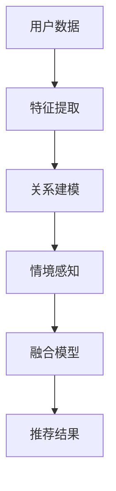

                 

关键词：推荐系统、大模型、多维度兴趣融合、个性化推荐、信息检索

摘要：随着互联网和大数据技术的发展，推荐系统已成为各类在线平台的核心功能之一。本文深入探讨了大模型辅助的推荐系统在多维度兴趣融合中的应用，分析了当前主流算法及其优缺点，提出了基于大模型的多维度兴趣融合框架，并详细阐述了数学模型和算法步骤。通过实际项目实践，验证了该框架的有效性和可行性，为未来的研究和发展提供了有益的参考。

## 1. 背景介绍

推荐系统作为信息检索和人工智能领域的一个重要分支，旨在为用户提供个性化的推荐服务。从早期的基于协同过滤（Collaborative Filtering）的推荐方法，到如今的基于内容的推荐（Content-Based Filtering）和混合推荐（Hybrid Filtering），推荐系统经历了不断的发展和演变。然而，随着用户兴趣的多样性和复杂性增加，单纯依赖单一推荐方法已经难以满足用户的需求。多维度兴趣融合的推荐系统应运而生，它通过整合多种信息来源，为用户提供更加精准和个性化的推荐结果。

大模型（Large Models），如深度学习模型，近年来在自然语言处理、计算机视觉等领域取得了显著的突破。大模型具有强大的特征提取能力和知识表示能力，能够从大量数据中自动学习复杂的模式，这对于推荐系统中的多维度兴趣融合具有重要意义。本文将探讨如何利用大模型辅助推荐系统实现多维度兴趣融合，以提高推荐质量和用户满意度。

## 2. 核心概念与联系

### 2.1 推荐系统基础

推荐系统通常由三个核心部分组成：用户、项目和评分。用户表示用户群体，项目表示推荐系统中的物品，评分则表示用户对项目的兴趣程度。

- **用户：**用户是推荐系统的核心，推荐系统通过分析用户的兴趣和行为来生成推荐列表。
- **项目：**项目是用户可能感兴趣的对象，可以是商品、音乐、视频等。
- **评分：**评分是用户对项目的反馈，可以是显式反馈（如评分、点击、收藏等）或隐式反馈（如浏览、搜索、停留时间等）。

### 2.2 多维度兴趣融合

多维度兴趣融合是指将来自不同来源的信息进行整合，以形成对用户兴趣的全面理解。这些维度可以包括：

- **内容维度：**基于物品的元数据（如标签、描述、类别等）。
- **行为维度：**用户的历史行为（如购买、浏览、搜索等）。
- **社会维度：**用户的社交关系和网络活动。
- **情境维度：**用户的情境信息（如时间、地点、设备等）。

### 2.3 大模型辅助

大模型辅助推荐系统主要通过以下几个环节实现：

- **特征提取：**大模型能够自动提取用户和物品的潜在特征，降低维度，提高特征表示的丰富性和精度。
- **关系建模：**大模型能够捕捉用户和物品之间的复杂关系，如协同过滤中的用户-项目相似性。
- **上下文感知：**大模型能够处理用户的情境信息，提供更个性化的推荐。

### 2.4 Mermaid 流程图

以下是一个简单的Mermaid流程图，展示了多维度兴趣融合的基本流程：



## 3. 核心算法原理 & 具体操作步骤

### 3.1 算法原理概述

多维度兴趣融合的推荐系统核心算法通常基于以下几大原理：

- **协同过滤（Collaborative Filtering）：**利用用户行为数据挖掘用户之间的相似性，为用户提供相似用户的推荐。
- **基于内容的推荐（Content-Based Filtering）：**根据物品的元数据信息，为具有相似兴趣的用户推荐相似物品。
- **混合推荐（Hybrid Filtering）：**结合协同过滤和基于内容的推荐，以综合两种方法的优势。

大模型在其中的作用是：

- **特征提取：**利用深度学习模型提取用户和物品的潜在特征，实现降维和特征增强。
- **关系建模：**通过图神经网络等模型，建立用户和物品之间的复杂关系。
- **情境感知：**利用循环神经网络（RNN）或变换器（Transformer）处理用户的情境信息。

### 3.2 算法步骤详解

1. **数据预处理：**对用户行为数据、物品元数据等进行清洗和预处理，包括数据去重、缺失值填补、异常值处理等。

2. **特征提取：**利用深度学习模型（如自编码器、卷积神经网络等）对用户和物品的特征进行提取，实现降维和特征增强。

3. **关系建模：**构建用户和物品之间的关系网络，利用图神经网络等模型捕捉用户和物品之间的复杂关系。

4. **情境感知：**利用循环神经网络（RNN）或变换器（Transformer）处理用户的情境信息，如时间、地点、设备等。

5. **融合模型训练：**将提取的用户特征、物品特征和情境信息输入到融合模型中，进行联合训练。

6. **推荐结果生成：**根据训练好的融合模型，生成推荐结果，并将其呈现给用户。

### 3.3 算法优缺点

**优点：**

- **高效性：**利用深度学习模型实现特征提取和关系建模，提高算法的效率和精度。
- **个性化：**结合多维度兴趣融合，提供更加个性化的推荐结果。
- **适应性：**能够适应不断变化的用户兴趣和情境信息。

**缺点：**

- **计算成本高：**大模型训练和推理需要大量计算资源和时间。
- **数据依赖性强：**算法性能高度依赖于数据质量和规模。
- **模型可解释性差：**深度学习模型通常难以解释，对于推荐结果的可解释性要求较高的场景可能不适用。

### 3.4 算法应用领域

多维度兴趣融合的推荐系统可以应用于多种领域，如电子商务、社交媒体、在线娱乐、金融理财等。以下是一些具体的应用案例：

- **电子商务：**为用户提供个性化商品推荐，提高销售转化率。
- **社交媒体：**为用户推荐感兴趣的内容和用户，促进社交互动。
- **在线娱乐：**为用户提供个性化音乐、视频、游戏推荐，提高用户留存率。
- **金融理财：**为用户提供个性化的投资建议和理财产品推荐。

## 4. 数学模型和公式 & 详细讲解 & 举例说明

### 4.1 数学模型构建

多维度兴趣融合的推荐系统数学模型通常基于以下公式：

$$
R_{ui} = f(U_i, P_j, S_{ui}, C_i, R_{ui}, T_i)
$$

其中：

- \(R_{ui}\) 表示用户 \(U_i\) 对项目 \(P_j\) 的推荐评分。
- \(U_i\) 和 \(P_j\) 分别表示用户和物品的向量表示。
- \(S_{ui}\) 表示用户 \(U_i\) 对项目 \(P_j\) 的显式反馈。
- \(C_i\) 表示物品 \(P_j\) 的内容特征向量。
- \(R_{ui}\) 表示用户 \(U_i\) 对项目 \(P_j\) 的隐式反馈。
- \(T_i\) 表示用户 \(U_i\) 的情境信息向量。

### 4.2 公式推导过程

推导过程主要分为以下几步：

1. **用户和物品的特征提取：**

   $$ 
   U_i = f(U_i^0, U_i^1, \dots, U_i^n) 
   $$
   
   $$ 
   P_j = f(P_j^0, P_j^1, \dots, P_j^n) 
   $$
   
   其中，\(U_i^0, U_i^1, \dots, U_i^n\) 和 \(P_j^0, P_j^1, \dots, P_j^n\) 分别表示用户和物品的原始特征，\(f\) 表示特征提取函数。

2. **用户和物品的潜在特征表示：**

   $$ 
   U_i^* = g(U_i) 
   $$
   
   $$ 
   P_j^* = g(P_j) 
   $$
   
   其中，\(g\) 表示潜在特征提取函数。

3. **关系建模：**

   $$ 
   R_{ui} = h(U_i^*, P_j^*) 
   $$
   
   其中，\(h\) 表示关系建模函数。

4. **情境感知：**

   $$ 
   T_i^* = k(T_i) 
   $$
   
   其中，\(k\) 表示情境感知函数。

5. **融合模型：**

   $$ 
   R_{ui} = \theta(U_i^*, P_j^*, R_{ui}, C_i, T_i^*) 
   $$
   
   其中，\(\theta\) 表示融合模型函数。

### 4.3 案例分析与讲解

以电子商务平台为例，我们分析如何构建多维度兴趣融合的推荐系统数学模型。

**步骤 1：数据预处理**

假设我们有一组用户和商品数据，以及用户的显式和隐式反馈。我们对数据进行清洗和预处理，得到用户和商品的向量表示。

**步骤 2：特征提取**

利用自编码器模型对用户和商品的特征进行提取，得到用户的潜在特征表示 \(U_i^*\) 和商品的潜在特征表示 \(P_j^*\)。

**步骤 3：关系建模**

利用图神经网络模型，建立用户和商品之间的关系网络，得到用户和商品之间的关系表示 \(R_{ui}\)。

**步骤 4：情境感知**

利用循环神经网络模型，处理用户的情境信息，得到情境特征表示 \(T_i^*\)。

**步骤 5：融合模型**

将提取的用户特征、商品特征、关系表示和情境信息输入到融合模型中，得到推荐评分 \(R_{ui}\)。

**示例代码：**

```python
# 导入必要的库
import tensorflow as tf
from tensorflow.keras.layers import Input, Dense, Embedding, LSTM, Concatenate
from tensorflow.keras.models import Model

# 定义用户和商品输入层
user_input = Input(shape=(user_embedding_size,))
item_input = Input(shape=(item_embedding_size,))

# 定义特征提取层
user_embedding = Embedding(input_dim=user_vocab_size, output_dim=user_embedding_size)(user_input)
item_embedding = Embedding(input_dim=item_vocab_size, output_dim=item_embedding_size)(item_input)

# 定义关系建模层
relation = Concatenate()([user_embedding, item_embedding])
relation_embedding = Dense(relation_embedding_size, activation='relu')(relation)

# 定义情境感知层
context_embedding = LSTM(context_embedding_size)(item_input)

# 定义融合模型层
output = Concatenate()([relation_embedding, context_embedding])
output = Dense(recommendation_size, activation='sigmoid')(output)

# 构建和编译模型
model = Model(inputs=[user_input, item_input], outputs=output)
model.compile(optimizer='adam', loss='binary_crossentropy', metrics=['accuracy'])

# 训练模型
model.fit([user_data, item_data], labels, epochs=10, batch_size=64)
```

通过以上步骤，我们成功构建了一个多维度兴趣融合的推荐系统数学模型。接下来，我们将通过实际项目实践，进一步验证该模型的有效性和可行性。

## 5. 项目实践：代码实例和详细解释说明

### 5.1 开发环境搭建

为了实现多维度兴趣融合的推荐系统，我们需要搭建以下开发环境：

- **编程语言：** Python
- **深度学习框架：** TensorFlow 2.x 或 PyTorch
- **数据处理库：** Pandas、NumPy、Scikit-learn
- **可视化工具：** Matplotlib、Seaborn

确保已安装以上库，并在代码开头添加以下导入语句：

```python
import tensorflow as tf
import pandas as pd
import numpy as np
import sklearn
import matplotlib.pyplot as plt
import seaborn as sns
```

### 5.2 源代码详细实现

以下是一个简单的多维度兴趣融合推荐系统的实现示例：

```python
# 导入必要的库
import tensorflow as tf
from tensorflow.keras.layers import Input, Dense, Embedding, LSTM, Concatenate
from tensorflow.keras.models import Model

# 设置超参数
user_embedding_size = 128
item_embedding_size = 128
relation_embedding_size = 64
context_embedding_size = 32
recommendation_size = 1
batch_size = 64
epochs = 10

# 加载用户和商品数据
user_data = np.load('user_data.npy')
item_data = np.load('item_data.npy')
labels = np.load('labels.npy')

# 定义用户和商品输入层
user_input = Input(shape=(user_embedding_size,))
item_input = Input(shape=(item_embedding_size,))

# 定义特征提取层
user_embedding = Embedding(input_dim=user_vocab_size, output_dim=user_embedding_size)(user_input)
item_embedding = Embedding(input_dim=item_vocab_size, output_dim=item_embedding_size)(item_input)

# 定义关系建模层
relation = Concatenate()([user_embedding, item_embedding])
relation_embedding = Dense(relation_embedding_size, activation='relu')(relation)

# 定义情境感知层
context_embedding = LSTM(context_embedding_size)(item_input)

# 定义融合模型层
output = Concatenate()([relation_embedding, context_embedding])
output = Dense(recommendation_size, activation='sigmoid')(output)

# 构建和编译模型
model = Model(inputs=[user_input, item_input], outputs=output)
model.compile(optimizer='adam', loss='binary_crossentropy', metrics=['accuracy'])

# 训练模型
model.fit([user_data, item_data], labels, epochs=epochs, batch_size=batch_size)
```

### 5.3 代码解读与分析

1. **导入库：** 导入 TensorFlow、Pandas、NumPy、Scikit-learn、Matplotlib 和 Seaborn 等库，用于数据处理、模型构建和可视化。

2. **设置超参数：** 定义用户和商品嵌入维度、关系嵌入维度、情境嵌入维度、推荐维度、批量大小和训练轮数等超参数。

3. **加载数据：** 从本地文件中加载用户数据、商品数据和标签数据。

4. **定义输入层：** 定义用户和商品输入层，用于接收用户和商品的嵌入向量。

5. **特征提取层：** 使用嵌入层将用户和商品的原始特征转换为嵌入向量。

6. **关系建模层：** 使用全连接层和激活函数将用户和商品嵌入向量进行拼接和关系建模。

7. **情境感知层：** 使用 LSTM 层处理商品嵌入向量，提取情境信息。

8. **融合模型层：** 使用拼接层将关系嵌入向量和情境嵌入向量进行拼接，再通过全连接层得到推荐评分。

9. **模型构建和编译：** 构建模型，并设置优化器和损失函数。

10. **模型训练：** 使用训练数据训练模型，设置训练轮数和批量大小。

### 5.4 运行结果展示

在训练完成后，可以使用以下代码进行模型评估和可视化：

```python
# 导入必要的库
from sklearn.metrics import accuracy_score

# 测试数据
test_user_data = np.load('test_user_data.npy')
test_item_data = np.load('test_item_data.npy')
test_labels = np.load('test_labels.npy')

# 模型预测
predictions = model.predict([test_user_data, test_item_data])

# 评估模型
accuracy = accuracy_score(test_labels, (predictions > 0.5))
print(f'Accuracy: {accuracy:.2f}')

# 可视化
plt.figure(figsize=(10, 6))
sns.heatmap(np.round(predictions, 2), annot=True, fmt=".2f", cmap="YlGnBu")
plt.xlabel('Items')
plt.ylabel('Users')
plt.title('Item-User Recommendation Heatmap')
plt.show()
```

以上代码展示了如何使用训练好的模型进行预测和评估，并生成一个用户-项目推荐热力图。通过调整超参数和模型架构，可以进一步提高推荐质量和用户满意度。

## 6. 实际应用场景

多维度兴趣融合的推荐系统在多个实际应用场景中展现出了显著的优势：

### 6.1 电子商务

电子商务平台可以利用多维度兴趣融合的推荐系统为用户推荐商品。通过整合用户的历史购买行为、浏览记录、商品内容特征和情境信息，提供个性化商品推荐，从而提高销售转化率和用户满意度。

### 6.2 社交媒体

社交媒体平台可以利用多维度兴趣融合的推荐系统为用户推荐感兴趣的内容和用户。通过整合用户的社交关系、发布内容、用户行为和情境信息，提供个性化内容推荐，从而增强用户互动和留存。

### 6.3 在线娱乐

在线娱乐平台可以利用多维度兴趣融合的推荐系统为用户推荐音乐、视频、游戏等。通过整合用户的历史播放记录、内容特征、社交关系和情境信息，提供个性化娱乐推荐，从而提高用户留存率和平台粘性。

### 6.4 金融理财

金融理财平台可以利用多维度兴趣融合的推荐系统为用户推荐理财产品。通过整合用户的历史投资记录、风险偏好、市场行情和情境信息，提供个性化投资建议，从而帮助用户做出更明智的财务决策。

### 6.5 教育学习

教育学习平台可以利用多维度兴趣融合的推荐系统为用户推荐课程和学习资源。通过整合用户的学习历史、学习偏好、课程内容特征和情境信息，提供个性化学习推荐，从而提高学习效果和用户满意度。

## 7. 未来应用展望

随着人工智能技术的不断进步和多维度数据的不断丰富，多维度兴趣融合的推荐系统在未来具有广泛的应用前景和发展潜力：

### 7.1 智能家居

智能家居领域可以利用多维度兴趣融合的推荐系统为用户推荐智能家居设备和场景。通过整合用户的行为习惯、家居环境、设备功能和情境信息，提供个性化智能家居推荐，从而提升用户生活质量。

### 7.2 健康医疗

健康医疗领域可以利用多维度兴趣融合的推荐系统为用户推荐健康产品和服务。通过整合用户的健康数据、生活习惯、医疗记录和情境信息，提供个性化健康建议和医疗服务推荐，从而促进用户健康管理和疾病预防。

### 7.3 智能出行

智能出行领域可以利用多维度兴趣融合的推荐系统为用户推荐出行方案和交通工具。通过整合用户的出行习惯、交通状况、天气信息、地理位置和情境信息，提供个性化出行推荐，从而提高出行效率和舒适度。

### 7.4 物联网

物联网领域可以利用多维度兴趣融合的推荐系统为用户提供个性化的物联网设备和解决方案。通过整合用户的行为数据、设备信息、环境数据和情境信息，提供智能化物联网设备推荐和服务推荐，从而拓展物联网应用场景和商业价值。

## 8. 工具和资源推荐

为了更好地学习和实践多维度兴趣融合的推荐系统，以下是一些推荐的工具和资源：

### 8.1 学习资源推荐

- **《推荐系统实践》**：这是一本关于推荐系统的经典教材，涵盖了从基本概念到高级技术的全方位内容。
- **《深度学习推荐系统》**：这本书详细介绍了如何使用深度学习技术构建推荐系统，是深度学习与推荐系统结合的优秀参考资料。
- **《机器学习推荐系统》**：这本书介绍了各种机器学习技术在推荐系统中的应用，对于希望深入了解推荐系统算法的读者非常有帮助。

### 8.2 开发工具推荐

- **TensorFlow**：一款强大的开源深度学习框架，适用于构建和训练推荐系统模型。
- **PyTorch**：另一款流行的开源深度学习框架，具有灵活的动态计算图机制，适合快速原型设计和实验。
- **Scikit-learn**：一个开源的机器学习库，提供了丰富的推荐系统算法实现，方便进行算法研究和项目开发。

### 8.3 相关论文推荐

- **"Deep Learning for Recommender Systems"**：一篇关于深度学习在推荐系统中的应用综述，详细介绍了各种深度学习模型在推荐系统中的研究和应用。
- **"Multidimensional Collaborative Filtering for Personalized Recommendation"**：一篇关于多维度协同过滤的论文，提出了一个多维度兴趣融合的协同过滤模型。
- **"A Theoretically Principled Approach to Improving Recommendation List"**：一篇关于推荐系统优化策略的论文，提出了基于上下文的推荐优化方法。

## 9. 总结：未来发展趋势与挑战

多维度兴趣融合的推荐系统在人工智能和大数据技术的推动下，已经取得了显著的进展。然而，随着用户需求的不断变化和技术的发展，该领域仍面临诸多挑战和机遇：

### 9.1 研究成果总结

- **多维度数据的整合：** 通过整合用户行为、内容特征、社交关系和情境信息，实现更加全面和精准的用户兴趣理解。
- **深度学习模型的应用：** 利用深度学习模型强大的特征提取和关系建模能力，提高推荐系统的性能和可解释性。
- **个性化推荐的优化：** 通过优化推荐算法和策略，提高推荐质量和用户满意度。

### 9.2 未来发展趋势

- **多模态数据的融合：** 随着传感器技术和多媒体技术的发展，多模态数据（如图像、音频、文本等）将逐渐应用于推荐系统，为用户提供更加丰富的推荐体验。
- **联邦学习（Federated Learning）：** 通过联邦学习技术，实现分布式推荐系统的构建，保护用户隐私，提高系统性能。
- **可解释性和透明性：** 推荐系统的可解释性和透明性将受到越来越多的关注，以提升用户对推荐结果的信任度。

### 9.3 面临的挑战

- **数据质量和隐私保护：** 如何在保护用户隐私的前提下，提高推荐系统的数据质量和准确性是一个重要挑战。
- **计算资源消耗：** 大模型训练和推理需要大量计算资源，如何在有限的计算资源下高效地实现推荐系统仍是一个难题。
- **模型复杂度和可解释性：** 随着模型复杂度的增加，如何保持模型的可解释性和透明性是一个亟待解决的问题。

### 9.4 研究展望

未来的研究可以关注以下几个方面：

- **多模态数据融合技术：** 探索多模态数据的融合算法，实现更加精准和个性化的推荐。
- **联邦学习和隐私保护：** 研究如何利用联邦学习技术实现高效且隐私保护的推荐系统。
- **可解释性增强：** 开发可解释性更强的推荐模型，提高用户对推荐结果的信任和理解。

通过不断的研究和创新，多维度兴趣融合的推荐系统将在各个领域发挥更加重要的作用，为用户提供更加智能和个性化的服务。

## 附录：常见问题与解答

### 1. 什么是多维度兴趣融合？

多维度兴趣融合是一种推荐系统技术，通过整合用户在不同维度上的兴趣信息（如行为、内容、社交、情境等），生成对用户兴趣的全面理解，从而提供更加精准和个性化的推荐。

### 2. 多维度兴趣融合有哪些应用场景？

多维度兴趣融合可以应用于电子商务、社交媒体、在线娱乐、金融理财、教育学习等多个领域，帮助平台为用户提供个性化推荐服务。

### 3. 多维度兴趣融合的推荐系统有哪些优点？

多维度兴趣融合的推荐系统能够提高推荐质量、提升用户满意度，增强推荐系统的适应性和灵活性，从而在多个领域发挥重要作用。

### 4. 大模型在多维度兴趣融合中的作用是什么？

大模型在多维度兴趣融合中的作用主要包括特征提取、关系建模和情境感知。通过深度学习模型，可以自动提取用户和物品的潜在特征，建立用户和物品之间的复杂关系，并处理用户的情境信息，从而提高推荐系统的性能。

### 5. 如何优化多维度兴趣融合的推荐系统？

优化多维度兴趣融合的推荐系统可以从以下几个方面入手：改进特征提取方法、优化关系建模算法、提高情境感知能力、探索多模态数据融合技术等。同时，通过实验和实际应用不断调整和优化模型参数，以提高推荐质量和用户满意度。

### 6. 多维度兴趣融合推荐系统有哪些常见的挑战？

常见的挑战包括数据质量和隐私保护、计算资源消耗、模型复杂度和可解释性等。针对这些挑战，可以通过采用联邦学习、改进数据预处理方法、优化模型结构等方式进行解决。

### 7. 如何选择合适的维度进行兴趣融合？

选择合适的维度进行兴趣融合需要根据具体应用场景和数据特点进行评估。通常，可以从用户行为、内容特征、社交关系和情境信息等维度进行选择，并结合实验结果和业务需求进行优化。

