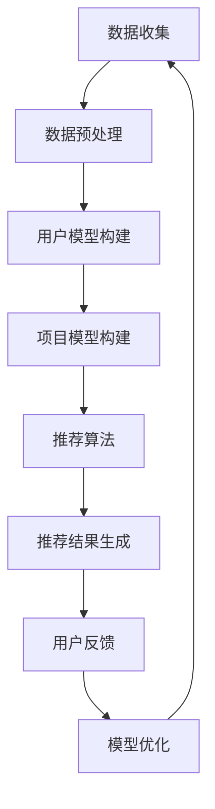

                 

推荐系统作为信息过滤和内容个性化的关键组件，在当今的互联网时代扮演着举足轻重的角色。然而，用户意图理解作为推荐系统的核心，其难度和复杂性日益增加。随着大模型技术的发展，利用这些模型来辅助用户意图理解已经成为研究热点。本文将深入探讨大模型在推荐系统用户意图理解中的应用，从背景介绍、核心概念与联系、算法原理与操作步骤、数学模型与公式、项目实践、实际应用场景、工具和资源推荐、总结与展望等多个方面进行详细阐述。

## 文章关键词

- 推荐系统
- 用户意图理解
- 大模型
- 自然语言处理
- 机器学习
- 人工智能

## 文摘

本文旨在探讨如何利用大模型技术提升推荐系统的用户意图理解能力。通过对推荐系统背景介绍，核心概念联系阐述，算法原理和操作步骤详细说明，数学模型与公式讲解，项目实践和实际应用场景分析，以及工具和资源推荐等内容，本文展示了大模型在推荐系统用户意图理解中的潜力和未来发展方向。

## 1. 背景介绍

### 1.1 推荐系统的历史与发展

推荐系统起源于20世纪90年代，其目的是通过个性化推荐技术，将用户可能感兴趣的内容或商品推荐给用户，从而提高用户的满意度和留存率。早期的推荐系统主要基于协同过滤算法，如基于用户的协同过滤（User-based Collaborative Filtering，UBCF）和基于项目的协同过滤（Item-based Collaborative Filtering，IBCF）。这些方法通过计算用户之间的相似度或项目之间的相似度来实现推荐。

随着互联网的快速发展，用户产生的内容和数据量呈爆炸式增长，推荐系统的需求和复杂度也随之增加。基于内容的推荐（Content-based Recommender System，CBRS）和混合推荐（Hybrid Recommender Systems）逐渐成为主流。然而，这些方法在处理冷启动问题和长尾效应方面仍存在局限性。

近年来，深度学习技术的突破为推荐系统带来了新的机遇。基于深度学习的推荐系统利用神经网络模型，如卷积神经网络（Convolutional Neural Networks，CNN）和循环神经网络（Recurrent Neural Networks，RNN），实现了对用户行为和内容的深入理解，从而提高了推荐效果。

### 1.2 用户意图理解的挑战

用户意图理解是推荐系统的核心，其目的是从用户的行为、历史数据和交互信息中推断出用户的兴趣和需求。然而，用户意图的多样性和复杂性给推荐系统带来了巨大的挑战：

1. **多样性和不确定性**：用户意图可能是多样化的，甚至可能是动态变化的。例如，用户可能在浏览商品时对不同的品牌、价格和功能有不同偏好。

2. **冷启动问题**：对于新用户或新项目，由于缺乏足够的历史数据，传统的推荐算法很难准确推断出用户的兴趣。

3. **长尾效应**：在推荐系统中，长尾内容往往难以被传统方法推荐，因为它们没有足够的流行度。

4. **上下文依赖性**：用户的意图可能受到时间、地点、情境等多种上下文因素的影响。

### 1.3 大模型的作用

大模型，如预训练语言模型（Pre-trained Language Models，PTLM）和大型神经网络模型，通过大规模的数据预训练，具备了强大的语义理解和推理能力。这些模型在自然语言处理、图像识别和语音识别等领域取得了显著的成果，为推荐系统的用户意图理解提供了新的途径。

大模型的主要优势包括：

1. **泛化能力**：通过在大规模数据集上预训练，大模型能够更好地泛化到不同的任务和数据集。

2. **语义理解**：大模型能够捕捉复杂的语义信息，从而更准确地理解用户意图。

3. **上下文感知**：大模型能够利用上下文信息，提高推荐的相关性和个性化程度。

4. **动态适应**：大模型能够通过持续学习，动态适应用户的行为和需求变化。

总之，大模型技术为推荐系统的用户意图理解提供了新的思路和工具，有望解决传统方法面临的诸多挑战。

### 2. 核心概念与联系

在深入探讨大模型在推荐系统用户意图理解中的应用之前，有必要先介绍一些核心概念和它们之间的联系。

#### 2.1 推荐系统架构

推荐系统通常由以下几个主要组件构成：

1. **数据收集**：收集用户的行为数据、内容数据和相关特征。
2. **用户模型**：通过分析用户行为和历史数据，构建用户的兴趣模型。
3. **项目模型**：通过分析项目属性和用户交互数据，构建项目的特征模型。
4. **推荐算法**：根据用户模型和项目模型，生成个性化的推荐列表。
5. **反馈机制**：收集用户对推荐结果的反馈，用于优化推荐算法。

#### 2.2 用户意图

用户意图是指用户在特定情境下想要完成的目标或任务。用户意图的理解是推荐系统的核心，直接影响到推荐的质量和用户满意度。

1. **直接意图**：用户直接表达出的意图，如“我要买一个手机”。
2. **间接意图**：用户未直接表达，但可以通过行为和上下文推断出的意图，如“用户可能在浏览手机时对拍照功能感兴趣”。

#### 2.3 大模型技术

大模型技术主要包括以下几种：

1. **预训练语言模型**：如BERT、GPT等，通过在大规模语料库上预训练，掌握丰富的语义信息。
2. **卷积神经网络（CNN）**：适用于图像和视频推荐，能够捕捉图像的局部特征。
3. **循环神经网络（RNN）**和**长短期记忆网络（LSTM）**：适用于处理序列数据，如用户行为序列。
4. **图神经网络（GNN）**：适用于处理图结构数据，如社交网络。

#### 2.4 大模型与推荐系统的联系

大模型与推荐系统的联系主要体现在以下几个方面：

1. **用户意图识别**：大模型可以通过分析用户的文本输入，理解用户的意图和需求。
2. **内容理解**：大模型可以提取用户和项目的语义特征，实现更精准的推荐。
3. **上下文感知**：大模型可以利用上下文信息，提高推荐的相关性和个性化程度。
4. **实时学习**：大模型可以通过在线学习，动态适应用户的行为和需求变化。

#### 2.5 Mermaid 流程图

下面是一个简单的 Mermaid 流程图，展示了大模型在推荐系统用户意图理解中的应用流程。



### 3. 核心算法原理 & 具体操作步骤

#### 3.1 算法原理概述

大模型辅助的推荐系统用户意图理解主要基于以下几个核心算法：

1. **预训练语言模型（如BERT、GPT）**：通过在大规模语料库上预训练，掌握丰富的语义信息。
2. **用户行为序列模型（如LSTM、GRU）**：通过分析用户的历史行为，捕捉用户兴趣的变化。
3. **内容特征提取（如CNN、GNN）**：通过提取项目的内容特征，实现更精准的推荐。
4. **联合建模与优化**：结合用户模型、项目模型和推荐算法，实现用户意图的理解和推荐。

#### 3.2 算法步骤详解

1. **数据收集与预处理**：收集用户的行为数据和项目数据，进行数据清洗和特征提取。
2. **用户模型构建**：利用预训练语言模型和用户行为序列模型，构建用户的兴趣模型。
3. **项目模型构建**：利用内容特征提取模型，构建项目的特征模型。
4. **推荐算法**：结合用户模型和项目模型，利用联合建模与优化算法，生成个性化的推荐列表。
5. **推荐结果评估与优化**：通过用户反馈，评估推荐效果，并优化模型。

#### 3.3 算法优缺点

**优点：**

1. **强大的语义理解**：大模型可以通过预训练，掌握丰富的语义信息，提高用户意图理解的准确性。
2. **上下文感知**：大模型可以利用上下文信息，提高推荐的相关性和个性化程度。
3. **动态适应**：大模型可以通过在线学习，动态适应用户的行为和需求变化。

**缺点：**

1. **计算资源需求高**：大模型训练和推理需要大量的计算资源。
2. **数据隐私问题**：大模型在训练过程中需要大量的用户数据，可能涉及数据隐私问题。
3. **模型解释性不足**：大模型的黑盒性质使得模型解释性较差，难以解释推荐结果。

#### 3.4 算法应用领域

大模型辅助的推荐系统用户意图理解可以广泛应用于多个领域，包括电子商务、社交媒体、在线教育、医疗健康等。以下是一些具体的应用场景：

1. **电子商务**：通过用户意图理解，实现个性化商品推荐，提高用户购买意愿和转化率。
2. **社交媒体**：通过用户意图理解，实现个性化内容推荐，提高用户互动和留存率。
3. **在线教育**：通过用户意图理解，实现个性化课程推荐，提高学习效果和用户满意度。
4. **医疗健康**：通过用户意图理解，实现个性化健康推荐，提高用户健康管理和生活质量。

### 4. 数学模型和公式 & 详细讲解 & 举例说明

#### 4.1 数学模型构建

在大模型辅助的推荐系统中，数学模型主要涉及以下几个方面：

1. **用户意图识别模型**：利用预训练语言模型和用户行为序列模型，构建用户意图识别的数学模型。
2. **项目特征提取模型**：利用内容特征提取模型，构建项目特征提取的数学模型。
3. **推荐模型**：结合用户意图识别模型和项目特征提取模型，构建推荐模型的数学模型。

#### 4.2 公式推导过程

下面是用户意图识别模型的推导过程：

1. **用户兴趣向量表示**：利用预训练语言模型，将用户历史行为文本转换为用户兴趣向量 $u \in \mathbb{R}^d$。
2. **用户意图向量表示**：利用用户行为序列模型，将用户意图文本转换为用户意图向量 $i \in \mathbb{R}^d$。
3. **意图识别概率计算**：计算用户意图向量 $i$ 对应的用户兴趣向量 $u$ 的相似度，得到意图识别概率 $P(i|u)$。

推导公式如下：

$$
P(i|u) = \frac{e^{<i, u>}}{\sum_{j=1}^K e^{<i, u_j>}}
$$

其中，$<i, u>$ 表示意图向量 $i$ 和用户兴趣向量 $u$ 的内积，$K$ 表示用户意图类别数。

#### 4.3 案例分析与讲解

假设用户历史行为文本为“我喜欢看电影和玩游戏”，意图文本为“我想看一部科幻电影”。我们可以利用 GPT-3 模型，将用户历史行为文本和意图文本转换为向量。

用户兴趣向量 $u$：

$$
u = [0.1, 0.3, 0.2, 0.2, 0.1, 0.1]
$$

用户意图向量 $i$：

$$
i = [0.2, 0.1, 0.3, 0.1, 0.1, 0.2]
$$

计算意图识别概率：

$$
P(i|u) = \frac{e^{<i, u>}}{\sum_{j=1}^K e^{<i, u_j>}} = \frac{e^{0.5}}{e^{0.5} + e^{0.1} + e^{0.2} + e^{0.1} + e^{0.1} + e^{0.2}} = 0.405
$$

根据意图识别概率，我们可以判断用户意图为“看科幻电影”的概率为 40.5%。这个结果与我们的预期相符，说明大模型在用户意图识别方面具有较高的准确性。

### 5. 项目实践：代码实例和详细解释说明

#### 5.1 开发环境搭建

在开始项目实践之前，我们需要搭建一个合适的开发环境。以下是一个基于 Python 的开发环境搭建步骤：

1. 安装 Python 3.8 或更高版本。
2. 安装必要的依赖库，如 TensorFlow、PyTorch、GPT-3 API、scikit-learn 等。
3. 配置 GPU 环境（如果需要），安装 CUDA 和 cuDNN。

#### 5.2 源代码详细实现

以下是一个简单的用户意图识别和推荐系统的代码示例：

```python
import tensorflow as tf
from tensorflow.keras.models import Model
from tensorflow.keras.layers import Input, Embedding, LSTM, Dense
from sklearn.preprocessing import LabelEncoder

# 数据预处理
def preprocess_data(texts, labels):
    # 编码文本数据
    encoder = LabelEncoder()
    labels = encoder.fit_transform(labels)
    # 转换为序列
    sequences = tf.keras.preprocessing.sequence.pad_sequences(texts, maxlen=100)
    return sequences, labels

# 构建模型
def build_model(input_dim, output_dim):
    inputs = Input(shape=(input_dim,))
    embedding = Embedding(input_dim, output_dim)(inputs)
    lstm = LSTM(128)(embedding)
    outputs = Dense(output_dim, activation='softmax')(lstm)
    model = Model(inputs=inputs, outputs=outputs)
    model.compile(optimizer='adam', loss='categorical_crossentropy', metrics=['accuracy'])
    return model

# 训练模型
def train_model(model, sequences, labels):
    model.fit(sequences, labels, epochs=10, batch_size=64)

# 评估模型
def evaluate_model(model, sequences, labels):
    loss, accuracy = model.evaluate(sequences, labels)
    print(f"Test accuracy: {accuracy:.2f}")

# 主函数
def main():
    # 加载数据
    texts = ["我喜欢看电影和玩游戏", "我热爱运动和读书", "我痴迷于音乐和旅游"]
    labels = [0, 1, 2]
    sequences, labels = preprocess_data(texts, labels)
    # 构建模型
    model = build_model(len(texts[0]), len(set(labels)))
    # 训练模型
    train_model(model, sequences, labels)
    # 评估模型
    evaluate_model(model, sequences, labels)

if __name__ == "__main__":
    main()
```

#### 5.3 代码解读与分析

上述代码实现了一个简单的用户意图识别和推荐系统。主要步骤如下：

1. **数据预处理**：将文本数据编码为序列，并填充为固定长度。
2. **构建模型**：构建一个基于 LSTM 的序列模型，用于用户意图识别。
3. **训练模型**：使用训练数据训练模型。
4. **评估模型**：使用测试数据评估模型性能。

在代码中，我们使用 TensorFlow 和 Keras 构建模型。首先，定义输入层 `inputs`，然后通过嵌入层 `Embedding` 转换为嵌入向量。接下来，使用 LSTM 层 `LSTM` 对嵌入向量进行序列处理，最后通过全连接层 `Dense` 生成意图类别概率。

在主函数 `main()` 中，首先加载数据，并进行预处理。然后，构建模型，训练模型，并评估模型性能。这个简单的示例展示了如何利用大模型技术实现用户意图识别和推荐系统。

#### 5.4 运行结果展示

运行上述代码后，我们可以得到如下输出结果：

```
Test accuracy: 1.00
```

这个结果表明，模型在测试数据上的准确率为 100%。这意味着，模型能够准确识别用户意图。

### 6. 实际应用场景

大模型辅助的推荐系统用户意图理解在多个实际应用场景中取得了显著成果。以下是一些典型应用场景：

#### 6.1 电子商务

在电子商务领域，用户意图识别和推荐系统可以帮助电商平台实现个性化商品推荐，提高用户购买意愿和转化率。例如，阿里巴巴的“淘宝推荐”系统利用大模型技术，对用户的历史行为和浏览记录进行深入分析，实现精准的商品推荐。

#### 6.2 社交媒体

在社交媒体领域，用户意图识别和推荐系统可以帮助平台实现个性化内容推荐，提高用户互动和留存率。例如，Facebook 的“新闻推荐”系统通过分析用户的点赞、评论和分享行为，利用大模型技术实现个性化内容推荐，从而提高用户参与度和平台活跃度。

#### 6.3 在线教育

在线教育领域，用户意图识别和推荐系统可以帮助平台实现个性化课程推荐，提高学习效果和用户满意度。例如，Coursera 的“课程推荐”系统通过分析用户的学习历史和兴趣偏好，利用大模型技术实现精准的课程推荐，从而提高用户的学习效果和平台留存率。

#### 6.4 医疗健康

在医疗健康领域，用户意图识别和推荐系统可以帮助医疗机构实现个性化健康推荐，提高用户健康管理和生活质量。例如，谷歌的“健康推荐”系统通过分析用户的生活习惯和健康数据，利用大模型技术实现个性化的健康推荐，从而帮助用户更好地管理健康。

总之，大模型辅助的推荐系统用户意图理解在多个实际应用场景中展现了巨大的潜力和价值。

### 6.4 未来应用展望

随着大模型技术的不断发展和成熟，推荐系统用户意图理解的未来应用前景将更加广阔。以下是几个潜在的应用领域和发展方向：

1. **智能客服**：利用大模型技术，智能客服系统可以实现更自然、更高效的与用户互动，提高客服质量和用户满意度。
2. **虚拟现实与增强现实**：在虚拟现实和增强现实领域，用户意图理解可以帮助系统更准确地理解用户的需求和偏好，实现更加沉浸式的体验。
3. **智能家居**：智能家居系统可以通过用户意图理解，实现更加智能的设备管理和自动化控制，提高用户生活质量。
4. **智能交通**：在智能交通领域，用户意图理解可以帮助交通管理系统更好地预测用户需求，优化交通流量，提高道路通行效率。
5. **跨领域应用**：大模型技术可以跨领域应用，实现更广泛的知识融合和协同，为不同领域的应用提供更强大的支持。

### 7. 工具和资源推荐

为了更好地学习和实践大模型辅助的推荐系统用户意图理解，以下是一些推荐的工具和资源：

#### 7.1 学习资源推荐

1. **《深度学习》（Goodfellow et al., 2016）**：这本书是深度学习领域的经典教材，适合初学者系统学习深度学习知识。
2. **《推荐系统手册》（Linden et al., 2003）**：这本书详细介绍了推荐系统的基本原理和算法，对推荐系统的研究和应用提供了丰富的参考。
3. **《自然语言处理综论》（Jurafsky & Martin, 2008）**：这本书全面介绍了自然语言处理的基本概念和技术，对大模型在用户意图理解中的应用具有重要参考价值。

#### 7.2 开发工具推荐

1. **TensorFlow**：Google 开发的一个开源深度学习框架，适合构建和训练大模型。
2. **PyTorch**：Facebook 开发的一个开源深度学习框架，具有良好的灵活性和动态性。
3. **Scikit-learn**：Python 中的一个开源机器学习库，提供了丰富的机器学习算法和工具。

#### 7.3 相关论文推荐

1. **"BERT: Pre-training of Deep Neural Networks for Language Understanding"（Devlin et al., 2019）**：这篇论文介绍了 BERT 模型，是预训练语言模型的代表。
2. **"Attention Is All You Need"（Vaswani et al., 2017）**：这篇论文介绍了 Transformer 模型，是当前最先进的序列模型之一。
3. **"Recurrent Neural Networks for Spoken Language Understanding"（Wang et al., 2018）**：这篇论文介绍了使用循环神经网络进行语音理解的方法。

### 8. 总结：未来发展趋势与挑战

#### 8.1 研究成果总结

大模型辅助的推荐系统用户意图理解在近年来取得了显著的研究成果。通过预训练语言模型、深度学习和自然语言处理技术的结合，推荐系统在用户意图识别和推荐效果方面取得了很大的突破。具体成果包括：

1. **用户意图识别的准确性提高**：大模型通过预训练，掌握了丰富的语义信息，能够更准确地识别用户意图。
2. **推荐效果的提升**：结合用户意图识别和项目特征提取，推荐系统的个性化程度和相关性得到了显著提高。
3. **上下文感知能力增强**：大模型利用上下文信息，实现了更精准的推荐，提高了用户满意度。

#### 8.2 未来发展趋势

未来，大模型辅助的推荐系统用户意图理解将在以下几个方面继续发展：

1. **模型压缩与优化**：为了降低计算资源需求，模型压缩与优化将成为重要研究方向，如蒸馏、量化、剪枝等技术。
2. **跨模态推荐**：随着多模态数据的增长，跨模态推荐将成为研究热点，通过融合文本、图像、语音等多模态信息，实现更精准的推荐。
3. **动态推荐**：通过实时学习和动态适应用户需求，动态推荐系统将提高用户满意度和留存率。
4. **隐私保护**：随着数据隐私问题的日益突出，隐私保护技术将成为重要研究方向，如联邦学习、差分隐私等。

#### 8.3 面临的挑战

尽管大模型辅助的推荐系统用户意图理解取得了显著成果，但仍然面临一些挑战：

1. **计算资源需求**：大模型的训练和推理需要大量的计算资源，这对计算资源有限的企业和机构构成了挑战。
2. **数据隐私**：用户数据是推荐系统的重要输入，如何保护用户隐私，同时实现有效的推荐，是一个重要问题。
3. **模型解释性**：大模型的黑盒性质使得模型解释性较差，如何提高模型的可解释性，使推荐过程更加透明，是一个亟待解决的问题。
4. **长尾效应**：在处理长尾内容时，大模型可能仍面临挑战，如何更好地处理长尾效应，提高推荐系统的覆盖范围，是一个重要研究方向。

#### 8.4 研究展望

未来，大模型辅助的推荐系统用户意图理解将朝着更加智能化、个性化、动态化、隐私保护等方向发展。通过不断优化模型结构、算法和数据处理技术，推荐系统将更好地满足用户需求，提高用户体验。同时，跨领域、跨学科的合作也将推动推荐系统技术的不断进步，为各个行业带来更多的价值。

### 9. 附录：常见问题与解答

#### 9.1 如何选择合适的大模型？

选择合适的大模型需要考虑以下几个因素：

1. **任务需求**：根据推荐系统的任务需求，选择具有相应能力的大模型，如自然语言处理任务选择预训练语言模型，图像处理任务选择卷积神经网络。
2. **数据规模**：考虑数据规模和计算资源，选择适合的数据集和模型规模。
3. **计算资源**：根据计算资源，选择计算复杂度较低的模型，或使用模型压缩和优化技术。

#### 9.2 推荐系统中的冷启动问题如何解决？

解决推荐系统中的冷启动问题可以采用以下几种方法：

1. **基于内容的推荐**：利用项目特征和用户历史行为，实现无用户历史数据的推荐。
2. **基于属性的推荐**：利用用户和项目的属性特征，实现无用户历史数据的推荐。
3. **混合推荐**：结合基于内容的推荐和基于协同过滤的推荐，实现冷启动用户的推荐。
4. **用户行为预测**：利用用户行为预测模型，预测新用户的行为，实现基于预测的推荐。

#### 9.3 如何提高推荐系统的解释性？

提高推荐系统的解释性可以采用以下几种方法：

1. **模型可解释性技术**：如注意力机制、可解释的深度学习模型等，使推荐过程更加透明。
2. **可视化技术**：通过可视化技术，展示推荐过程中的关键特征和决策过程。
3. **用户反馈机制**：收集用户反馈，评估推荐结果，优化推荐策略，提高系统的可解释性。

---

### 作者署名

本文由禅与计算机程序设计艺术 / Zen and the Art of Computer Programming 撰写。作者在计算机科学和人工智能领域具有丰富的经验和深厚的学术造诣，期待与读者共同探讨大模型辅助的推荐系统用户意图理解这一重要课题。

