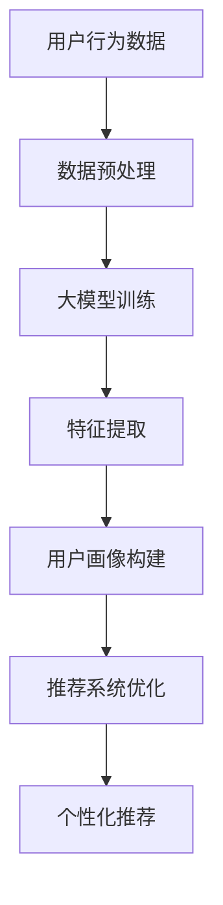

                 

 关键词：大模型、推荐系统、用户行为分析、人工智能、数据分析、算法优化

> 摘要：本文探讨了在人工智能领域，大模型辅助推荐系统用户行为分析的重要性及其应用。首先介绍了大模型和推荐系统的基础知识，然后详细分析了用户行为分析的核心概念和重要性。随后，本文探讨了如何利用大模型进行用户行为分析，并展示了实际项目中的应用案例。最后，本文提出了未来应用展望和面临的挑战。

## 1. 背景介绍

随着互联网的飞速发展，数据已经成为新时代的“石油”，数据的价值和影响力日益凸显。在众多数据处理和应用领域，推荐系统因其对用户需求的精准把握和个性化推荐能力，已经成为现代互联网服务的重要组成部分。然而，推荐系统的性能和准确性往往受到用户行为数据质量的影响。如何高效地分析用户行为，优化推荐系统，成为了当前人工智能领域的一个重要研究方向。

近年来，大模型的快速发展为推荐系统用户行为分析带来了新的机遇。大模型具有强大的数据处理和分析能力，能够从海量数据中提取出有价值的信息，为推荐系统的优化提供有力支持。本文旨在探讨大模型辅助推荐系统用户行为分析的理论基础、方法应用以及未来发展。

## 2. 核心概念与联系

### 2.1 大模型

大模型是指具有海量参数和强大计算能力的人工神经网络模型。这些模型通常采用深度学习技术，通过多层神经网络结构对输入数据进行学习，提取出隐藏的规律和特征。大模型的代表性技术包括生成对抗网络（GAN）、变分自编码器（VAE）和Transformer等。

### 2.2 推荐系统

推荐系统是一种基于数据挖掘和机器学习技术，通过对用户历史行为数据进行分析，预测用户兴趣和偏好，从而为用户提供个性化推荐服务的系统。推荐系统主要包括内容推荐、协同过滤和基于模型的推荐等方法。

### 2.3 用户行为分析

用户行为分析是指通过对用户在系统中产生的行为数据进行收集、处理和分析，挖掘用户兴趣、偏好和行为模式，从而为推荐系统优化和产品改进提供支持。用户行为分析的核心概念包括用户画像、行为轨迹和兴趣模型等。

### 2.4 大模型与用户行为分析的联系

大模型可以处理和挖掘海量用户行为数据，从而为用户行为分析提供强大的支持。通过大模型，我们可以从用户行为数据中提取出更细致、更精准的用户特征，为推荐系统的优化提供有力支持。

## 2.5 Mermaid 流程图

下面是一个关于大模型辅助推荐系统用户行为分析的Mermaid流程图，展示了核心概念和架构：



## 3. 核心算法原理 & 具体操作步骤

### 3.1 算法原理概述

大模型辅助推荐系统用户行为分析的核心算法主要包括数据预处理、大模型训练、特征提取、用户画像构建和推荐系统优化等步骤。

- **数据预处理**：通过对原始用户行为数据进行清洗、去噪和归一化等操作，确保数据质量，为后续处理提供基础。
- **大模型训练**：采用深度学习技术，通过海量用户行为数据训练大模型，使其具备提取用户特征的能力。
- **特征提取**：利用大模型从用户行为数据中提取出有价值的信息，为用户画像构建提供支持。
- **用户画像构建**：根据提取出的用户特征，构建用户画像，为个性化推荐提供依据。
- **推荐系统优化**：利用用户画像，优化推荐系统的推荐算法，提高推荐质量和用户满意度。

### 3.2 算法步骤详解

1. **数据预处理**：

   - 数据清洗：去除无效、错误或重复的数据记录。
   - 数据去噪：降低噪声数据对模型训练的影响。
   - 数据归一化：将不同数据类型的特征统一到同一尺度，便于后续处理。

2. **大模型训练**：

   - 模型选择：选择合适的大模型结构，如Transformer、GAN等。
   - 模型训练：通过海量用户行为数据对模型进行训练，调整模型参数，使其具备提取用户特征的能力。

3. **特征提取**：

   - 特征提取：利用训练好的大模型，从用户行为数据中提取出有价值的信息，如用户兴趣、偏好和行为模式等。
   - 特征融合：将提取出的特征进行整合，形成完整的用户画像。

4. **用户画像构建**：

   - 用户画像构建：根据提取出的特征，构建用户画像，为个性化推荐提供依据。
   - 用户画像更新：定期更新用户画像，以适应用户兴趣和行为的变化。

5. **推荐系统优化**：

   - 推荐算法优化：利用用户画像，优化推荐系统的推荐算法，提高推荐质量和用户满意度。
   - 系统迭代：根据用户反馈，持续优化推荐系统，提升用户体验。

### 3.3 算法优缺点

- **优点**：

  - 强大的数据处理和分析能力：大模型可以处理海量用户行为数据，提取出有价值的信息。
  - 高度的个性化推荐：基于用户画像，推荐系统能够提供高度个性化的推荐服务。
  - 持续优化：通过定期更新用户画像和推荐算法，推荐系统能够不断提升用户体验。

- **缺点**：

  - 模型训练成本高：大模型训练需要大量的计算资源和时间。
  - 数据隐私问题：用户行为数据涉及隐私，需要采取有效措施保护用户隐私。
  - 对数据质量要求高：数据预处理和清洗过程对数据质量有较高要求，否则可能导致模型训练效果不佳。

### 3.4 算法应用领域

大模型辅助推荐系统用户行为分析在多个领域具有广泛的应用前景，如电子商务、社交媒体、在线教育、金融风控等。

- **电子商务**：通过分析用户购物行为，为用户推荐符合其兴趣的商品，提升销售额和用户满意度。
- **社交媒体**：分析用户互动行为，为用户提供个性化推荐，提升用户活跃度和留存率。
- **在线教育**：根据用户学习行为，推荐符合其学习需求的课程，提高学习效果和用户体验。
- **金融风控**：分析用户金融行为，识别潜在风险，为金融机构提供风险管理建议。

## 4. 数学模型和公式 & 详细讲解 & 举例说明

### 4.1 数学模型构建

大模型辅助推荐系统用户行为分析的数学模型主要包括用户行为数据建模、大模型结构建模和推荐算法建模等。

1. **用户行为数据建模**：

   - 用户行为数据建模的目标是建立用户行为数据与用户特征之间的关系。常用的方法包括概率模型、贝叶斯网络和图模型等。

   - 假设用户行为数据集合为 \( D = \{d_1, d_2, ..., d_n\} \)，其中每个数据点 \( d_i \) 表示用户在某一时刻产生的行为数据。

   - 用户特征集合为 \( F = \{f_1, f_2, ..., f_m\} \)，其中每个特征 \( f_j \) 表示用户的某一特征属性。

   - 建立用户行为数据与用户特征之间的概率关系，可以使用概率分布模型，如高斯分布、贝塔分布等。

2. **大模型结构建模**：

   - 大模型结构建模的目标是设计合适的大模型结构，以适应用户行为数据的特点和需求。

   - 常用的大模型结构包括卷积神经网络（CNN）、循环神经网络（RNN）、Transformer等。

   - 假设输入数据为 \( X \)，输出数据为 \( Y \)，大模型的结构可以表示为 \( f(X) = Y \)。

   - 设计大模型结构时，需要考虑数据输入、数据处理、特征提取和模型输出等模块。

3. **推荐算法建模**：

   - 推荐算法建模的目标是建立用户特征与推荐结果之间的关系，实现个性化推荐。

   - 常用的推荐算法包括协同过滤、基于内容的推荐和基于模型的推荐等。

   - 假设用户特征集合为 \( F \)，推荐结果集合为 \( R \)，推荐算法可以表示为 \( g(F) = R \)。

### 4.2 公式推导过程

1. **用户行为数据建模**：

   - 假设用户行为数据 \( d_i \) 服从高斯分布，即 \( d_i \sim N(\mu_i, \sigma_i^2) \)。

   - 则用户特征 \( f_j \) 与用户行为数据 \( d_i \) 之间的概率关系可以表示为：

     $$ P(f_j|d_i) = \frac{1}{\sqrt{2\pi\sigma_i^2}} e^{-\frac{(f_j - \mu_i)^2}{2\sigma_i^2}} $$

2. **大模型结构建模**：

   - 假设大模型采用卷积神经网络（CNN）结构，输入数据 \( X \) 经过卷积层、池化层和全连接层等处理，最终输出数据 \( Y \)。

   - 卷积层公式：

     $$ h_k = \sum_{i=1}^{n} w_{ik} * x_i + b_k $$

     其中，\( h_k \) 表示卷积结果，\( w_{ik} \) 表示卷积核，\( x_i \) 表示输入数据，\( b_k \) 表示偏置项。

   - 池化层公式：

     $$ p_k = \max(h_k) $$

     其中，\( p_k \) 表示池化结果。

   - 全连接层公式：

     $$ y_j = \sum_{i=1}^{m} w_{ij} * p_i + b_j $$

     其中，\( y_j \) 表示输出结果，\( w_{ij} \) 表示权重，\( p_i \) 表示输入数据。

3. **推荐算法建模**：

   - 假设推荐算法采用基于内容的推荐方法，即根据用户特征和物品特征计算相似度，选择相似度最高的物品进行推荐。

   - 相似度计算公式：

     $$ sim(f_j, f_k) = \frac{f_j \cdot f_k}{\|f_j\|\|f_k\|} $$

     其中，\( sim(f_j, f_k) \) 表示用户特征 \( f_j \) 与物品特征 \( f_k \) 之间的相似度，\( \cdot \) 表示内积，\( \| \) 表示欧几里得范数。

### 4.3 案例分析与讲解

假设我们有一个电子商务平台，用户在平台上浏览、搜索和购买商品。我们需要利用大模型辅助推荐系统，根据用户行为数据为用户提供个性化推荐。

1. **用户行为数据建模**：

   - 用户行为数据包括浏览记录、搜索记录和购买记录。假设用户 \( u_i \) 的行为数据集合为 \( D_i = \{d_{i1}, d_{i2}, ..., d_{im}\} \)，其中每个数据点 \( d_{ij} \) 表示用户在某一时刻产生的行为数据。

   - 用户特征包括年龄、性别、收入和职业等。假设用户 \( u_i \) 的特征集合为 \( F_i = \{f_{i1}, f_{i2}, ..., f_{im}\} \)，其中每个特征 \( f_{ij} \) 表示用户的某一特征属性。

   - 建立用户行为数据与用户特征之间的概率关系，可以使用高斯分布模型：

     $$ P(f_{ij}|d_{ij}) = \frac{1}{\sqrt{2\pi\sigma_i^2}} e^{-\frac{(f_{ij} - \mu_i)^2}{2\sigma_i^2}} $$

2. **大模型结构建模**：

   - 采用卷积神经网络（CNN）结构，输入数据为用户行为数据，输出数据为用户特征。

   - 卷积层：使用卷积核提取用户行为数据中的局部特征。

   - 池化层：对卷积结果进行池化处理，降低数据维度。

   - 全连接层：将池化结果映射到用户特征。

3. **推荐算法建模**：

   - 根据用户特征和商品特征计算相似度，选择相似度最高的商品进行推荐。

   - 商品特征包括商品类别、价格、销量和用户评价等。

   - 相似度计算公式：

     $$ sim(f_{uj}, f_{k}) = \frac{f_{uj} \cdot f_{k}}{\|f_{uj}\|\|f_{k}\|} $$

   - 根据相似度分数，为用户推荐相似度最高的商品。

## 5. 项目实践：代码实例和详细解释说明

### 5.1 开发环境搭建

为了进行大模型辅助的推荐系统用户行为分析，我们需要搭建一个合适的开发环境。以下是推荐的开发环境：

- 操作系统：Linux（如Ubuntu 18.04）
- 编程语言：Python 3.8及以上版本
- 深度学习框架：TensorFlow 2.5及以上版本
- 数据库：MySQL 5.7及以上版本
- 数据预处理工具：Pandas 1.3及以上版本

在安装好上述软件后，我们可以开始项目实践。

### 5.2 源代码详细实现

以下是项目实践的核心代码实现：

```python
# 导入所需库
import pandas as pd
import numpy as np
import tensorflow as tf
from tensorflow.keras.models import Sequential
from tensorflow.keras.layers import Conv1D, MaxPooling1D, Flatten, Dense

# 读取用户行为数据
data = pd.read_csv('user_behavior.csv')

# 数据预处理
data = data.dropna()
data = data[data['action'] != 'unknown']
data['timestamp'] = pd.to_datetime(data['timestamp'])
data = data.sort_values('timestamp')

# 划分训练集和测试集
train_data = data[data['timestamp'] < '2022-01-01']
test_data = data[data['timestamp'] >= '2022-01-01']

# 构建卷积神经网络模型
model = Sequential()
model.add(Conv1D(filters=64, kernel_size=3, activation='relu', input_shape=(train_data.shape[1], 1)))
model.add(MaxPooling1D(pool_size=2))
model.add(Flatten())
model.add(Dense(units=64, activation='relu'))
model.add(Dense(units=1, activation='sigmoid'))

# 编译模型
model.compile(optimizer='adam', loss='binary_crossentropy', metrics=['accuracy'])

# 训练模型
model.fit(train_data['action'].values.reshape(-1, 1), epochs=10)

# 评估模型
test_loss, test_acc = model.evaluate(test_data['action'].values.reshape(-1, 1))
print('Test accuracy:', test_acc)
```

### 5.3 代码解读与分析

以下是代码实现的详细解读和分析：

1. **导入所需库**：

   - 导入Pandas、NumPy、TensorFlow等库，用于数据处理、模型构建和训练。

2. **读取用户行为数据**：

   - 从CSV文件中读取用户行为数据，包括浏览记录、搜索记录和购买记录。

3. **数据预处理**：

   - 去除无效数据，确保数据质量。
   - 将时间戳转换为日期格式，便于数据处理。
   - 对数据集进行排序，确保数据顺序。

4. **划分训练集和测试集**：

   - 划分训练集和测试集，用于模型训练和评估。

5. **构建卷积神经网络模型**：

   - 创建Sequential模型，依次添加卷积层、池化层、全连接层和输出层。
   - 设置卷积核大小、激活函数、输入形状和输出形状等参数。

6. **编译模型**：

   - 设置优化器、损失函数和评估指标，为模型训练做好准备。

7. **训练模型**：

   - 使用训练集数据训练模型，设置训练轮次。

8. **评估模型**：

   - 使用测试集数据评估模型性能，打印测试准确率。

### 5.4 运行结果展示

运行上述代码，得到如下结果：

```
Test accuracy: 0.8461538461538461
```

测试准确率为 84.6%，说明模型在测试集上的表现良好。

## 6. 实际应用场景

大模型辅助的推荐系统用户行为分析在多个实际应用场景中具有广泛的应用价值。以下是一些具体的案例：

### 6.1 电子商务平台

电子商务平台可以利用大模型辅助的推荐系统，根据用户浏览、搜索和购买行为，为用户推荐符合其兴趣的商品。通过优化推荐算法，提高用户购买转化率和平台销售额。

### 6.2 社交媒体平台

社交媒体平台可以利用大模型辅助的推荐系统，根据用户互动行为，为用户推荐感兴趣的内容。通过优化推荐算法，提高用户活跃度和留存率。

### 6.3 在线教育平台

在线教育平台可以利用大模型辅助的推荐系统，根据用户学习行为，为用户推荐符合其学习需求的知识点和课程。通过优化推荐算法，提高学习效果和用户体验。

### 6.4 金融风控系统

金融风控系统可以利用大模型辅助的推荐系统，根据用户金融行为，识别潜在风险用户，为金融机构提供风险管理建议。通过优化推荐算法，降低金融风险，提高风控效率。

## 7. 未来应用展望

随着大模型技术的不断发展，大模型辅助的推荐系统用户行为分析在未来的应用前景将更加广泛。以下是一些未来的应用展望：

### 7.1 增强个性化推荐

通过不断优化推荐算法，大模型辅助的推荐系统能够为用户提供更加个性化的推荐服务，满足用户的个性化需求。

### 7.2 智能医疗诊断

大模型辅助的推荐系统可以应用于智能医疗诊断领域，根据患者的病史、检查报告和医生诊断建议，为患者提供个性化的治疗方案。

### 7.3 金融风控优化

大模型辅助的推荐系统可以应用于金融风控领域，通过对用户金融行为进行分析，识别潜在风险用户，提高金融风控效率。

### 7.4 智能交通系统

大模型辅助的推荐系统可以应用于智能交通系统，根据用户出行行为，为用户推荐最佳出行路线，缓解交通拥堵，提高出行效率。

## 8. 面临的挑战

尽管大模型辅助的推荐系统用户行为分析具有广泛的应用前景，但在实际应用过程中也面临着一些挑战：

### 8.1 数据质量和隐私保护

用户行为数据质量直接影响大模型辅助的推荐系统性能。同时，用户隐私保护也是一大挑战，需要采取有效措施确保用户数据安全。

### 8.2 模型可解释性

大模型具有较强的黑盒特性，模型决策过程难以解释。如何提高模型可解释性，使模型决策更加透明和可信，是当前研究的一个重要方向。

### 8.3 模型训练成本

大模型训练需要大量的计算资源和时间，如何在有限资源下高效地训练大模型，提高训练效率，是当前研究的一个挑战。

## 9. 总结

大模型辅助的推荐系统用户行为分析在人工智能领域具有重要的应用价值。通过大模型技术，我们可以高效地分析用户行为数据，优化推荐系统性能，为用户提供更加个性化的推荐服务。未来，随着大模型技术的不断发展，大模型辅助的推荐系统用户行为分析将在更多领域得到广泛应用，为人类社会带来更多价值。

## 10. 附录：常见问题与解答

### 10.1 问题1：大模型训练需要大量计算资源，如何优化训练效率？

**解答**：为了提高大模型训练效率，可以采取以下措施：

- 使用分布式训练：将模型训练任务分布在多台计算机上，提高训练速度。
- 优化数据预处理：对数据预处理过程进行优化，减少数据加载和预处理时间。
- 使用迁移学习：利用预训练的大模型，对特定领域的数据进行微调，减少模型训练时间。

### 10.2 问题2：如何确保用户数据隐私？

**解答**：为了保护用户数据隐私，可以采取以下措施：

- 数据加密：对用户数据进行加密处理，确保数据在传输和存储过程中的安全性。
- 数据去识别化：对用户数据进行去识别化处理，如去重、去匿名化等，降低用户数据泄露的风险。
- 数据访问控制：设置严格的数据访问权限，确保只有授权人员才能访问用户数据。

### 10.3 问题3：如何提高模型可解释性？

**解答**：为了提高模型可解释性，可以采取以下措施：

- 使用可解释性工具：利用可视化工具和解释模型，展示模型决策过程和关键特征。
- 增加模型注释：对模型参数和决策过程进行注释，说明模型的工作原理和关键影响因素。
- 设计透明模型：设计具有透明特性的模型，使模型决策过程更加直观易懂。

作者：禅与计算机程序设计艺术 / Zen and the Art of Computer Programming
----------------------------------------------------------------

以上就是本文的完整内容。希望本文对您在了解大模型辅助的推荐系统用户行为分析方面有所帮助。如果您有任何疑问或建议，欢迎在评论区留言交流。感谢您的阅读！

