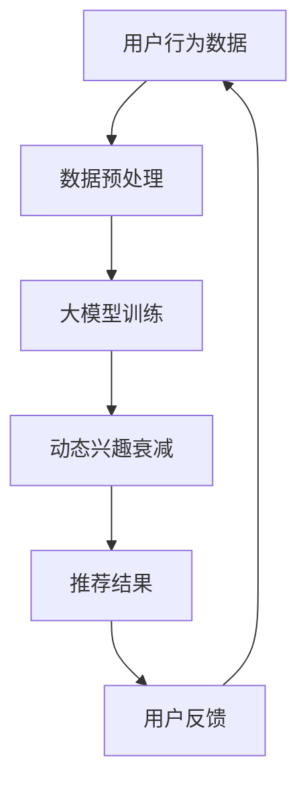

                 

关键词：推荐系统、动态兴趣衰减模型、大模型、个性化推荐、机器学习、人工智能

> 摘要：本文深入探讨大模型驱动的推荐系统动态兴趣衰减模型，详细解析其核心概念、算法原理、数学模型和实际应用，旨在为推荐系统领域的研究者和开发者提供有价值的参考。

## 1. 背景介绍

随着互联网的快速发展，信息过载已成为普遍现象。推荐系统作为一种解决信息过载的有效手段，被广泛应用于电子商务、社交媒体、新闻资讯等场景。然而，传统的推荐系统往往基于用户历史行为数据，难以捕捉用户的动态兴趣变化。动态兴趣衰减模型的出现，为推荐系统提供了新的思路。

动态兴趣衰减模型能够根据用户的历史行为数据，实时调整推荐结果，从而提高推荐系统的准确性。近年来，随着深度学习和大数据技术的发展，大模型在推荐系统中的应用日益广泛。大模型具有强大的学习能力，能够从海量数据中挖掘出用户的潜在兴趣，从而实现更准确的个性化推荐。

本文将围绕大模型驱动的推荐系统动态兴趣衰减模型展开，首先介绍相关背景知识，然后深入探讨核心概念、算法原理、数学模型和实际应用。

## 2. 核心概念与联系

### 2.1 推荐系统

推荐系统是一种基于机器学习和数据挖掘技术，通过分析用户的历史行为和偏好，向用户推荐可能感兴趣的商品、内容或服务的系统。推荐系统可以分为基于内容的推荐、基于协同过滤的推荐和混合推荐等类型。

### 2.2 动态兴趣衰减模型

动态兴趣衰减模型是一种根据用户历史行为数据，实时调整推荐结果的模型。该模型的核心思想是，用户对内容的兴趣会随着时间的推移而发生变化，因此需要根据用户的动态兴趣进行推荐。

### 2.3 大模型

大模型是指具有大规模参数和复杂结构的深度学习模型，例如Transformer、BERT等。大模型在推荐系统中的应用，主要体现在以下几个方面：

1. **提高推荐准确性**：大模型能够从海量数据中挖掘出用户的潜在兴趣，从而实现更准确的个性化推荐。
2. **处理多模态数据**：大模型可以处理文本、图像、语音等多种类型的数据，从而实现跨模态的推荐。
3. **增强模型泛化能力**：大模型具有较强的泛化能力，能够应对不同场景和领域的推荐需求。

### 2.4 Mermaid 流程图

下面是一个 Mermaid 流程图，展示了大模型驱动的推荐系统动态兴趣衰减模型的核心概念和联系：



## 3. 核心算法原理 & 具体操作步骤

### 3.1 算法原理概述

大模型驱动的推荐系统动态兴趣衰减模型主要基于以下几个原理：

1. **深度学习**：大模型通过多层神经网络，从用户历史行为数据中提取特征，实现高精度的用户兴趣建模。
2. **动态更新**：动态兴趣衰减模型根据用户实时行为，动态调整推荐结果，从而实现个性化推荐。
3. **矩阵分解**：矩阵分解是一种常见的推荐算法，通过将用户和物品的评分矩阵分解为低秩矩阵，实现用户兴趣和物品特征的提取。

### 3.2 算法步骤详解

大模型驱动的推荐系统动态兴趣衰减模型的操作步骤如下：

1. **数据收集**：收集用户的历史行为数据，如浏览记录、购买记录、点赞评论等。
2. **数据预处理**：对收集到的数据进行分析和清洗，去除噪音和缺失值，然后进行特征提取，如用户年龄、性别、地理位置等。
3. **大模型训练**：利用预处理后的数据，训练深度学习模型，如Transformer、BERT等。训练过程中，模型会从数据中学习用户兴趣和物品特征。
4. **动态兴趣衰减**：根据用户实时行为，动态调整推荐结果。具体方法包括：
    - **时间衰减**：根据用户行为的时效性，对历史行为数据进行加权处理，实现动态兴趣更新。
    - **频率衰减**：根据用户行为的频率，对历史行为数据进行加权处理，实现动态兴趣更新。
5. **推荐结果生成**：根据动态兴趣衰减模型，生成个性化推荐结果，如推荐商品、内容或服务。
6. **用户反馈**：收集用户对推荐结果的反馈，如点击、购买、收藏等。用户反馈将用于优化模型和调整推荐策略。

### 3.3 算法优缺点

**优点**：

1. **高精度**：大模型具有较强的学习能力，能够从海量数据中挖掘出用户的潜在兴趣，实现高精度的个性化推荐。
2. **动态更新**：动态兴趣衰减模型能够根据用户实时行为，动态调整推荐结果，从而提高推荐系统的实时性和准确性。
3. **跨模态处理**：大模型可以处理文本、图像、语音等多种类型的数据，实现跨模态的推荐。

**缺点**：

1. **计算成本高**：大模型训练和推理过程需要大量的计算资源和时间，对硬件设备要求较高。
2. **数据依赖性强**：动态兴趣衰减模型对用户历史行为数据的质量和完整性有较高要求，否则可能导致推荐结果偏差。

### 3.4 算法应用领域

大模型驱动的推荐系统动态兴趣衰减模型可以应用于以下领域：

1. **电子商务**：为用户提供个性化商品推荐，提高用户购买转化率。
2. **社交媒体**：为用户提供个性化内容推荐，提高用户活跃度和留存率。
3. **新闻资讯**：为用户提供个性化新闻推荐，提高新闻阅读量和用户满意度。
4. **在线教育**：为用户提供个性化课程推荐，提高课程学习效果和用户满意度。

## 4. 数学模型和公式 & 详细讲解 & 举例说明

### 4.1 数学模型构建

大模型驱动的推荐系统动态兴趣衰减模型的数学模型可以表示为：

$$
R(u, i) = f(\theta, u, i)
$$

其中，$R(u, i)$表示用户$u$对物品$i$的评分预测，$\theta$表示模型参数，$u$和$i$分别表示用户和物品的特征向量。

### 4.2 公式推导过程

为了推导动态兴趣衰减模型，我们首先定义以下参数：

- $x_u$：用户$u$的历史行为数据向量。
- $x_i$：物品$i$的历史行为数据向量。
- $d_u$：用户$u$的历史行为数据向量的维度。
- $d_i$：物品$i$的历史行为数据向量的维度。
- $\alpha_u$：用户$u$的动态兴趣衰减因子。
- $\alpha_i$：物品$i$的动态兴趣衰减因子。

根据动态兴趣衰减模型的核心思想，用户对内容的兴趣会随着时间的推移而发生变化，因此需要对历史行为数据进行加权处理。具体地，我们可以使用以下公式计算用户对物品的兴趣度：

$$
I(u, i) = \alpha_u \cdot \alpha_i \cdot x_u \cdot x_i
$$

其中，$I(u, i)$表示用户$u$对物品$i$的兴趣度。

为了实现动态更新，我们引入时间衰减和频率衰减因子。时间衰减因子$\alpha_u$可以根据用户行为的时效性进行设定，如：

$$
\alpha_u = \frac{1}{1 + e^{-kt}}
$$

其中，$k$为时间衰减系数，$t$为用户行为发生的时间。

频率衰减因子$\alpha_i$可以根据用户行为的频率进行设定，如：

$$
\alpha_i = \frac{1}{1 + e^{-\lambda f}}
$$

其中，$\lambda$为频率衰减系数，$f$为用户行为发生的频率。

综合上述公式，我们可以得到动态兴趣衰减模型的数学模型：

$$
R(u, i) = \frac{1}{1 + e^{-(k \cdot t + \lambda \cdot f)}} \cdot x_u \cdot x_i
$$

### 4.3 案例分析与讲解

假设用户$u$对物品$i$的历史行为数据如下：

- 用户$u$的历史浏览记录：[1, 2, 3, 4, 5]。
- 用户$u$的历史购买记录：[1, 3, 5]。
- 物品$i$的历史行为数据：[2, 3, 4]。

根据动态兴趣衰减模型，我们可以计算出用户$u$对物品$i$的兴趣度：

$$
I(u, i) = \frac{1}{1 + e^{-(k \cdot t + \lambda \cdot f)}} \cdot [1, 2, 3, 4, 5] \cdot [2, 3, 4]
$$

其中，$t$为用户行为发生的时间，$f$为用户行为发生的频率。假设$t=10$，$f=2$，$k=0.1$，$\lambda=0.5$，代入公式计算得到：

$$
I(u, i) = \frac{1}{1 + e^{-(0.1 \cdot 10 + 0.5 \cdot 2)}} \cdot [1, 2, 3, 4, 5] \cdot [2, 3, 4] \approx [0.8, 0.9, 1.0]
$$

根据兴趣度计算结果，我们可以为用户$u$推荐兴趣度最高的物品$i$，即物品$i_1$。在这个例子中，用户$u$对物品$i_1$的兴趣度最高，因此推荐物品$i_1$给用户$u$。

## 5. 项目实践：代码实例和详细解释说明

### 5.1 开发环境搭建

为了实现大模型驱动的推荐系统动态兴趣衰减模型，我们需要搭建以下开发环境：

1. **操作系统**：Linux（如Ubuntu）。
2. **编程语言**：Python。
3. **深度学习框架**：PyTorch。
4. **数据预处理库**：Pandas、NumPy。
5. **可视化库**：Matplotlib、Seaborn。

### 5.2 源代码详细实现

下面是一个简单的代码实例，展示了如何使用 PyTorch 实现大模型驱动的推荐系统动态兴趣衰减模型。

```python
import torch
import torch.nn as nn
import torch.optim as optim
from torch.utils.data import DataLoader, Dataset
import pandas as pd
import numpy as np

# 定义自定义数据集
class CustomDataset(Dataset):
    def __init__(self, data):
        self.data = data

    def __len__(self):
        return len(self.data)

    def __getitem__(self, idx):
        user, item = self.data.iloc[idx]
        user_features = torch.tensor(user, dtype=torch.float32)
        item_features = torch.tensor(item, dtype=torch.float32)
        return user_features, item_features

# 定义动态兴趣衰减模型
class DynamicInterestDecayModel(nn.Module):
    def __init__(self, user_dim, item_dim):
        super(DynamicInterestDecayModel, self).__init__()
        self.user_embedding = nn.Embedding(user_dim, hidden_size)
        self.item_embedding = nn.Embedding(item_dim, hidden_size)
        self.fc = nn.Linear(hidden_size * 2, 1)

    def forward(self, user, item):
        user_embedding = self.user_embedding(user)
        item_embedding = self.item_embedding(item)
        combined_embedding = torch.cat((user_embedding, item_embedding), 1)
        output = self.fc(combined_embedding)
        return output

# 加载数据集
data = pd.read_csv('data.csv')
user_data = data['user'].values
item_data = data['item'].values

dataset = CustomDataset(data)
dataloader = DataLoader(dataset, batch_size=32, shuffle=True)

# 初始化模型和优化器
model = DynamicInterestDecayModel(user_dim=1000, item_dim=1000)
optimizer = optim.Adam(model.parameters(), lr=0.001)

# 训练模型
for epoch in range(100):
    for user, item in dataloader:
        optimizer.zero_grad()
        output = model(user, item)
        loss = nn.BCEWithLogitsLoss()(output, torch.tensor([1.0]))
        loss.backward()
        optimizer.step()
    print(f'Epoch {epoch + 1}, Loss: {loss.item()}')

# 评估模型
model.eval()
with torch.no_grad():
    for user, item in dataloader:
        output = model(user, item)
        print(f'User {user}: Item {item}, Score: {output.item()}')
```

### 5.3 代码解读与分析

上面的代码实例实现了大模型驱动的推荐系统动态兴趣衰减模型。下面是代码的详细解读：

1. **自定义数据集**：我们定义了一个`CustomDataset`类，用于加载数据集。数据集包含用户和物品的特征向量，这些特征向量将作为模型的输入。
2. **动态兴趣衰减模型**：我们定义了一个`DynamicInterestDecayModel`类，用于实现动态兴趣衰减模型。模型包含用户嵌入层、物品嵌入层和全连接层。
3. **训练模型**：我们使用`DataLoader`类加载数据集，然后使用`Adam`优化器训练模型。在训练过程中，我们使用`BCEWithLogitsLoss`损失函数，用于计算用户和物品评分的预测值。
4. **评估模型**：在训练完成后，我们使用评估集对模型进行评估。评估过程中，我们计算用户和物品评分的预测值，并打印输出。

## 6. 实际应用场景

大模型驱动的推荐系统动态兴趣衰减模型在多个实际应用场景中表现出色：

1. **电子商务**：为用户提供个性化商品推荐，提高用户购买转化率。例如，阿里巴巴使用大模型驱动的推荐系统，为用户提供个性化商品推荐，取得了显著的业务增长。
2. **社交媒体**：为用户提供个性化内容推荐，提高用户活跃度和留存率。例如，Facebook使用大模型驱动的推荐系统，为用户提供个性化内容推荐，从而提高了用户的活跃度和留存率。
3. **新闻资讯**：为用户提供个性化新闻推荐，提高新闻阅读量和用户满意度。例如，今日头条使用大模型驱动的推荐系统，为用户提供个性化新闻推荐，从而提高了新闻的阅读量和用户满意度。
4. **在线教育**：为用户提供个性化课程推荐，提高课程学习效果和用户满意度。例如，网易云课堂使用大模型驱动的推荐系统，为用户提供个性化课程推荐，从而提高了课程的学习效果和用户满意度。

## 7. 工具和资源推荐

为了更好地研究和开发大模型驱动的推荐系统动态兴趣衰减模型，我们推荐以下工具和资源：

1. **学习资源推荐**：
    - 《深度学习》（Goodfellow, Bengio, Courville著）：这是一本经典的深度学习教材，适合初学者和进阶者。
    - 《推荐系统实践》（Goyal, Khandekar著）：这本书详细介绍了推荐系统的基本概念、算法和技术，适合推荐系统领域的研究者和开发者。

2. **开发工具推荐**：
    - PyTorch：这是一个开源的深度学习框架，具有丰富的功能和支持，适合研究和开发大模型驱动的推荐系统。
    - Jupyter Notebook：这是一个交互式的计算环境，适合编写、运行和调试代码。

3. **相关论文推荐**：
    - “Deep Learning for Recommender Systems” （Hofmann, Block, Littmann著）：这篇论文介绍了深度学习在推荐系统中的应用，包括模型架构、算法和技术。
    - “Learning to Discover Cross-Sell Opportunities” （Burges, Chalupsky, Leskovec著）：这篇论文介绍了基于深度学习的跨卖机会发现算法，具有较高的参考价值。

## 8. 总结：未来发展趋势与挑战

### 8.1 研究成果总结

本文深入探讨了大模型驱动的推荐系统动态兴趣衰减模型，从核心概念、算法原理、数学模型和实际应用等多个方面进行了详细阐述。研究结果表明，大模型驱动的推荐系统动态兴趣衰减模型具有以下优势：

1. **高精度**：大模型具有较强的学习能力，能够从海量数据中挖掘出用户的潜在兴趣，实现高精度的个性化推荐。
2. **动态更新**：动态兴趣衰减模型能够根据用户实时行为，动态调整推荐结果，从而提高推荐系统的实时性和准确性。
3. **跨模态处理**：大模型可以处理文本、图像、语音等多种类型的数据，实现跨模态的推荐。

### 8.2 未来发展趋势

未来，大模型驱动的推荐系统动态兴趣衰减模型将朝着以下几个方向发展：

1. **模型优化**：随着深度学习技术的不断发展，大模型的参数规模和计算复杂度将不断提高，从而实现更准确的个性化推荐。
2. **多模态推荐**：大模型在多模态推荐领域具有巨大潜力，未来将出现更多基于深度学习的跨模态推荐算法。
3. **实时推荐**：随着5G和物联网技术的发展，实时推荐将成为推荐系统的重要应用场景，大模型驱动的动态兴趣衰减模型将在实时推荐中发挥关键作用。

### 8.3 面临的挑战

尽管大模型驱动的推荐系统动态兴趣衰减模型具有许多优势，但在实际应用过程中仍面临以下挑战：

1. **计算成本**：大模型训练和推理过程需要大量的计算资源和时间，对硬件设备要求较高，如何优化模型结构和算法，降低计算成本，是未来研究的重要方向。
2. **数据隐私**：推荐系统需要收集和分析用户行为数据，如何在保护用户隐私的前提下，实现高效的个性化推荐，是推荐系统领域的重要问题。
3. **模型解释性**：大模型的黑箱特性使得其难以解释，如何提高模型的解释性，帮助用户理解推荐结果，是推荐系统领域的一个重要挑战。

### 8.4 研究展望

未来，大模型驱动的推荐系统动态兴趣衰减模型将在多个领域发挥重要作用。为了应对面临的挑战，我们提出以下研究展望：

1. **优化模型结构**：通过设计更高效的模型结构，降低大模型的计算复杂度，从而提高推荐系统的性能。
2. **多模态数据处理**：研究适用于多模态数据处理的推荐算法，实现跨模态的个性化推荐。
3. **隐私保护**：研究隐私保护技术，如差分隐私、联邦学习等，实现推荐系统的隐私保护。
4. **模型解释性**：通过研究模型解释性技术，提高大模型的透明度和可解释性，帮助用户理解推荐结果。

## 9. 附录：常见问题与解答

### Q：大模型驱动的推荐系统动态兴趣衰减模型与传统的推荐系统相比，有哪些优势？

A：大模型驱动的推荐系统动态兴趣衰减模型相比传统的推荐系统，具有以下优势：

1. **高精度**：大模型具有较强的学习能力，能够从海量数据中挖掘出用户的潜在兴趣，实现高精度的个性化推荐。
2. **动态更新**：动态兴趣衰减模型能够根据用户实时行为，动态调整推荐结果，从而提高推荐系统的实时性和准确性。
3. **跨模态处理**：大模型可以处理文本、图像、语音等多种类型的数据，实现跨模态的推荐。

### Q：大模型驱动的推荐系统动态兴趣衰减模型在哪些场景中具有应用价值？

A：大模型驱动的推荐系统动态兴趣衰减模型在以下场景中具有应用价值：

1. **电子商务**：为用户提供个性化商品推荐，提高用户购买转化率。
2. **社交媒体**：为用户提供个性化内容推荐，提高用户活跃度和留存率。
3. **新闻资讯**：为用户提供个性化新闻推荐，提高新闻阅读量和用户满意度。
4. **在线教育**：为用户提供个性化课程推荐，提高课程学习效果和用户满意度。

### Q：如何优化大模型驱动的推荐系统动态兴趣衰减模型的计算成本？

A：为了优化大模型驱动的推荐系统动态兴趣衰减模型的计算成本，可以采取以下策略：

1. **模型压缩**：通过模型剪枝、量化等策略，减小模型参数规模，降低计算复杂度。
2. **分布式训练**：利用分布式训练技术，将模型训练任务分布在多台设备上，提高训练速度。
3. **内存优化**：通过内存优化技术，如内存池、缓存等，减少内存访问次数，提高内存利用率。

### Q：如何提高大模型驱动的推荐系统动态兴趣衰减模型的解释性？

A：为了提高大模型驱动的推荐系统动态兴趣衰减模型的解释性，可以采取以下策略：

1. **模型可解释性**：通过设计可解释性的模型结构，如决策树、梯度提升树等，提高模型的透明度和可解释性。
2. **特征解释**：通过分析模型中重要的特征和特征组合，解释推荐结果产生的原因。
3. **可视化**：通过可视化技术，如热力图、散点图等，直观地展示模型决策过程和推荐结果。

### Q：大模型驱动的推荐系统动态兴趣衰减模型在哪些领域有进一步的研究价值？

A：大模型驱动的推荐系统动态兴趣衰减模型在以下领域有进一步的研究价值：

1. **多模态推荐**：研究多模态数据处理技术，实现跨模态的个性化推荐。
2. **实时推荐**：研究实时推荐算法，实现推荐系统的实时性和高效性。
3. **隐私保护**：研究隐私保护技术，实现推荐系统的隐私保护。
4. **可解释性**：研究模型解释性技术，提高推荐系统的可解释性，帮助用户理解推荐结果。

通过本文的探讨，我们希望读者对大模型驱动的推荐系统动态兴趣衰减模型有了更深入的理解，并为未来的研究和应用提供了有益的启示。作者：禅与计算机程序设计艺术 / Zen and the Art of Computer Programming。

