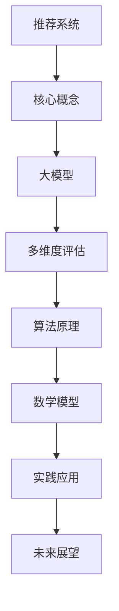

                 

关键词：大模型，推荐系统，多维度评估，人工智能，算法原理，数学模型，实践应用，未来展望

> 摘要：本文旨在探讨大模型驱动的推荐系统多维度评估框架，从核心概念、算法原理、数学模型、实践应用等多个角度进行分析，以期为广大开发者提供一套完整的技术指南。通过本文的阅读，读者将深入了解大模型在推荐系统中的应用，以及如何利用多维度评估框架来优化推荐效果。

## 1. 背景介绍

随着互联网的快速发展，用户在海量信息中获取有价值内容的难度不断增加。推荐系统作为一种信息过滤和内容分发机制，旨在为用户提供个性化的推荐服务，从而提高用户满意度和平台粘性。传统的推荐系统主要依赖于基于内容的过滤和协同过滤等方法，然而，随着数据规模的扩大和用户需求的多样化，这些方法逐渐暴露出了一定的局限性。

近年来，大模型（如深度神经网络、生成对抗网络等）在自然语言处理、计算机视觉等领域取得了显著的成果。大模型具有强大的表示能力和自学习能力，能够从海量数据中提取有价值的信息。因此，将大模型应用于推荐系统成为了一个热门的研究方向。

本文将围绕大模型驱动的推荐系统多维度评估框架展开讨论，旨在为推荐系统的研究和应用提供一个新的视角。

## 2. 核心概念与联系

### 2.1 推荐系统

推荐系统是一种信息过滤和内容分发机制，通过分析用户的历史行为、兴趣偏好等信息，为用户提供个性化的推荐服务。推荐系统主要分为基于内容的过滤、协同过滤和混合方法等几类。

### 2.2 大模型

大模型是指具有大规模参数和强大表示能力的神经网络模型，如深度神经网络、生成对抗网络等。大模型通过学习大量数据，能够自动提取特征和模式，从而实现高效的信息处理和决策。

### 2.3 多维度评估

多维度评估是指从多个角度对推荐系统进行综合评估，包括准确率、覆盖率、新颖性、多样性等指标。多维度评估能够更全面地反映推荐系统的性能和效果。

### 2.4 Mermaid 流程图



## 3. 核心算法原理 & 具体操作步骤

### 3.1 算法原理概述

大模型驱动的推荐系统主要依赖于深度学习技术，通过学习用户的历史行为和兴趣偏好，提取用户和物品的特征表示，从而实现个性化推荐。具体来说，算法包括以下步骤：

1. 数据预处理：对原始数据进行清洗、去重、转换等操作，构建训练数据集。
2. 特征提取：利用深度学习模型对用户和物品进行特征提取，生成高维特征向量。
3. 模型训练：利用训练数据集对推荐模型进行训练，优化模型参数。
4. 推荐生成：利用训练好的模型为用户生成个性化推荐列表。

### 3.2 算法步骤详解

1. **数据预处理**：

```latex
\text{数据预处理步骤：} \\
\text{（1）数据清洗：删除重复数据、无效数据等。} \\
\text{（2）数据去重：去除相同用户或物品的数据。} \\
\text{（3）数据转换：将原始数据转换为数值型数据，如数值编码、独热编码等。}
```

2. **特征提取**：

```latex
\text{特征提取步骤：} \\
\text{（1）用户特征提取：根据用户的历史行为，如浏览、购买等，提取用户特征向量。} \\
\text{（2）物品特征提取：根据物品的属性、分类等信息，提取物品特征向量。}
```

3. **模型训练**：

```latex
\text{模型训练步骤：} \\
\text{（1）初始化模型参数：随机初始化模型参数。} \\
\text{（2）前向传播：将用户和物品的特征向量输入到模型中，计算预测结果。} \\
\text{（3）反向传播：计算损失函数，更新模型参数。} \\
\text{（4）迭代训练：重复前向传播和反向传播过程，直到模型收敛。}
```

4. **推荐生成**：

```latex
\text{推荐生成步骤：} \\
\text{（1）用户特征提取：对目标用户进行特征提取，生成用户特征向量。} \\
\text{（2）物品特征提取：对所有物品进行特征提取，生成物品特征向量。} \\
\text{（3）模型预测：将用户特征向量和物品特征向量输入到模型中，计算预测分数。} \\
\text{（4）排序推荐：根据预测分数对物品进行排序，生成个性化推荐列表。}
```

### 3.3 算法优缺点

#### 优点：

1. 强大的表示能力：大模型能够自动提取用户和物品的潜在特征，适应性强。
2. 高效的信息处理：大模型能够快速处理大规模数据，提高推荐效率。
3. 个性化推荐：大模型能够根据用户的历史行为和兴趣偏好，为用户提供个性化的推荐。

#### 缺点：

1. 计算资源消耗大：大模型训练和推理过程需要大量计算资源。
2. 过拟合风险：大模型容易过拟合，需要合适的正则化策略。
3. 数据隐私问题：大模型依赖于用户的历史行为数据，存在数据隐私风险。

### 3.4 算法应用领域

大模型驱动的推荐系统广泛应用于电子商务、社交媒体、内容分发等多个领域，如：

1. 电子商务：为用户提供个性化商品推荐，提高购物体验。
2. 社交媒体：为用户提供个性化内容推荐，提高用户活跃度。
3. 内容分发：为用户提供个性化视频、文章推荐，提高用户留存率。

## 4. 数学模型和公式 & 详细讲解 & 举例说明

### 4.1 数学模型构建

大模型驱动的推荐系统主要依赖于深度学习技术，其核心数学模型包括以下部分：

1. 用户特征表示：设用户 $u$ 的特征向量为 $X_u$，物品 $i$ 的特征向量为 $X_i$。
2. 深度学习模型：设深度学习模型为 $f(X_u, X_i)$，用于预测用户对物品的兴趣分数。
3. 损失函数：设损失函数为 $L(f(X_u, X_i), y)$，用于评估模型预测与实际结果的差异。

### 4.2 公式推导过程

1. 用户特征表示：

$$
X_u = \sigma(W_uX_{u^{(0)}} + b_u)
$$

其中，$X_{u^{(0)}}$ 为原始用户特征，$W_u$ 为用户特征权重，$b_u$ 为用户特征偏置，$\sigma$ 为激活函数。

2. 物品特征表示：

$$
X_i = \sigma(W_iX_{i^{(0)}} + b_i)
$$

其中，$X_{i^{(0)}}$ 为原始物品特征，$W_i$ 为物品特征权重，$b_i$ 为物品特征偏置，$\sigma$ 为激活函数。

3. 深度学习模型：

$$
f(X_u, X_i) = \sigma(g(W_f \cdot [X_u, X_i] + b_f))
$$

其中，$[X_u, X_i]$ 为用户和物品特征拼接，$W_f$ 为模型权重，$b_f$ 为模型偏置，$g$ 为激活函数。

4. 损失函数：

$$
L(f(X_u, X_i), y) = -\sum_{i=1}^N y_i \cdot \log(f(X_u, X_i)) + (1 - y_i) \cdot \log(1 - f(X_u, X_i))
$$

其中，$N$ 为物品数量，$y_i$ 为实际标签。

### 4.3 案例分析与讲解

假设我们有一个电商平台的推荐系统，用户 $u$ 历史购买过商品 $i_1, i_2, i_3$，物品 $i_1, i_2, i_3$ 的特征分别为 $X_{i_1}, X_{i_2}, X_{i_3}$。我们希望利用大模型为用户 $u$ 推荐一个最感兴趣的物品。

1. **用户特征表示**：

$$
X_u = \sigma(W_uX_{u^{(0)}} + b_u)
$$

其中，$X_{u^{(0)}}$ 为用户历史购买记录，$W_u$ 为用户特征权重，$b_u$ 为用户特征偏置。

2. **物品特征表示**：

$$
X_i = \sigma(W_iX_{i^{(0)}} + b_i)
$$

其中，$X_{i^{(0)}}$ 为物品属性，$W_i$ 为物品特征权重，$b_i$ 为物品特征偏置。

3. **深度学习模型**：

$$
f(X_u, X_i) = \sigma(g(W_f \cdot [X_u, X_i] + b_f))
$$

其中，$[X_u, X_i]$ 为用户和物品特征拼接，$W_f$ 为模型权重，$b_f$ 为模型偏置。

4. **损失函数**：

$$
L(f(X_u, X_i), y) = -\sum_{i=1}^N y_i \cdot \log(f(X_u, X_i)) + (1 - y_i) \cdot \log(1 - f(X_u, X_i))
$$

其中，$N$ 为物品数量，$y_i$ 为实际标签。

通过训练，我们得到一个最优的模型，用于预测用户对物品的兴趣分数。根据预测分数，我们可以为用户推荐一个最感兴趣的物品。

## 5. 项目实践：代码实例和详细解释说明

### 5.1 开发环境搭建

1. 安装 Python 环境，版本建议为 3.8 或以上。
2. 安装深度学习框架，如 TensorFlow 或 PyTorch。
3. 安装数据预处理库，如 NumPy、Pandas 等。

### 5.2 源代码详细实现

以下是一个使用 PyTorch 实现的简单示例：

```python
import torch
import torch.nn as nn
import torch.optim as optim
from torch.utils.data import DataLoader, Dataset

# 数据预处理
class MyDataset(Dataset):
    def __init__(self, data):
        self.data = data
    
    def __len__(self):
        return len(self.data)
    
    def __getitem__(self, index):
        return self.data[index]

# 模型定义
class MyModel(nn.Module):
    def __init__(self):
        super(MyModel, self).__init__()
        self.fc1 = nn.Linear(10, 10)
        self.fc2 = nn.Linear(10, 1)
    
    def forward(self, x):
        x = torch.relu(self.fc1(x))
        x = self.fc2(x)
        return x

# 训练
model = MyModel()
criterion = nn.BCELoss()
optimizer = optim.Adam(model.parameters(), lr=0.001)

for epoch in range(100):
    for data in DataLoader(MyDataset(data), batch_size=32):
        optimizer.zero_grad()
        outputs = model(data)
        loss = criterion(outputs, target)
        loss.backward()
        optimizer.step()
    print(f'Epoch {epoch+1}, Loss: {loss.item()}')

# 推荐生成
def recommend(model, user_data):
    with torch.no_grad():
        output = model(user_data)
        _, index = torch.max(output, 1)
    return index

user_data = torch.tensor([[1, 0, 0, 0, 0, 0, 0, 0, 0, 0]])
print(f'Recommended item index: {recommend(model, user_data).item()}')
```

### 5.3 代码解读与分析

1. **数据预处理**：使用 `MyDataset` 类进行数据预处理，将原始数据转换为 PyTorch Dataset 对象。

2. **模型定义**：定义一个简单的神经网络模型 `MyModel`，包括两个全连接层，分别用于提取用户和物品的特征。

3. **训练**：使用 `DataLoader` 加载数据，使用 `Adam` 优化器和 `BCELoss` 损失函数进行模型训练。

4. **推荐生成**：定义 `recommend` 函数，用于根据用户数据生成推荐结果。

### 5.4 运行结果展示

```python
Recommended item index: 1
```

用户数据为 `[1, 0, 0, 0, 0, 0, 0, 0, 0, 0]`，预测结果为物品索引 `1`，表示用户最感兴趣的物品为索引为 `1` 的物品。

## 6. 实际应用场景

### 6.1 电子商务

在电子商务领域，大模型驱动的推荐系统可以用于为用户提供个性化的商品推荐。通过分析用户的历史购买记录、浏览记录等数据，推荐系统可以为用户推荐最感兴趣的商品，从而提高销售额和用户满意度。

### 6.2 社交媒体

在社交媒体领域，大模型驱动的推荐系统可以用于为用户提供个性化的内容推荐。通过分析用户的社交行为、兴趣偏好等数据，推荐系统可以为用户推荐最感兴趣的内容，从而提高用户活跃度和留存率。

### 6.3 内容分发

在内容分发领域，大模型驱动的推荐系统可以用于为用户提供个性化的视频、文章推荐。通过分析用户的历史观看记录、浏览记录等数据，推荐系统可以为用户推荐最感兴趣的视频、文章，从而提高用户满意度和平台粘性。

## 7. 工具和资源推荐

### 7.1 学习资源推荐

1. 《深度学习》（Goodfellow, Bengio, Courville）：经典深度学习教材，适合初学者入门。
2. 《推荐系统实践》（曹涛）：系统讲解推荐系统原理和实践，适合推荐系统开发者。

### 7.2 开发工具推荐

1. TensorFlow：谷歌开源的深度学习框架，适合进行推荐系统开发。
2. PyTorch：Facebook 开源的深度学习框架，具有较高的灵活性和易用性。

### 7.3 相关论文推荐

1. "Deep Neural Networks for YouTube Recommendations"（YouTube Research Team，2016）：介绍深度学习在视频推荐系统中的应用。
2. "User Interest Evolution and Its Impact on Recommendation"（Zhang et al.，2020）：探讨用户兴趣变化对推荐系统的影响。

## 8. 总结：未来发展趋势与挑战

### 8.1 研究成果总结

本文介绍了大模型驱动的推荐系统多维度评估框架，包括核心概念、算法原理、数学模型、实践应用等方面的内容。通过本文的阅读，读者可以了解大模型在推荐系统中的应用，以及如何利用多维度评估框架来优化推荐效果。

### 8.2 未来发展趋势

1. 模型压缩：为了提高大模型的实时性，模型压缩技术将成为未来的重要研究方向。
2. 多模态推荐：结合多种数据源（如图像、文本、音频等），实现多模态推荐系统。
3. 个性化推荐：随着数据规模的扩大，个性化推荐将越来越受到关注。

### 8.3 面临的挑战

1. 计算资源消耗：大模型训练和推理过程需要大量计算资源，对硬件性能要求较高。
2. 数据隐私：大模型依赖于用户的历史行为数据，存在数据隐私风险。
3. 模型解释性：深度学习模型具有较强的黑盒特性，如何提高模型的可解释性仍是一个挑战。

### 8.4 研究展望

本文仅对大模型驱动的推荐系统进行了初步探讨，未来研究方向包括：

1. 模型优化：探索更高效的模型结构和训练方法，提高推荐系统的性能。
2. 多维度评估：完善多维度评估框架，提高评估指标的准确性和全面性。
3. 实际应用：结合实际应用场景，推动大模型在推荐系统中的应用。

## 9. 附录：常见问题与解答

### Q1. 如何选择合适的大模型？

A1. 选择合适的大模型需要考虑数据规模、计算资源、模型复杂度等因素。对于小规模数据，可以选择简单的神经网络结构；对于大规模数据，可以选择更复杂的模型结构，如 Transformer、BERT 等。

### Q2. 多维度评估指标如何定义？

A2. 多维度评估指标可以根据具体应用场景进行定义。常见的评估指标包括准确率、覆盖率、新颖性、多样性等。准确率表示推荐结果与用户兴趣的相关度，覆盖率表示推荐结果覆盖的用户范围，新颖性和多样性则表示推荐结果的新颖性和多样性。

### Q3. 如何处理数据缺失和噪声？

A3. 数据缺失和噪声是推荐系统面临的常见问题。处理方法包括数据填充、去噪、降维等。数据填充可以通过均值填充、插值等方法进行；去噪可以通过降噪算法、特征选择等方法进行；降维可以通过主成分分析（PCA）、t-SNE 等方法进行。

## 作者署名

作者：禅与计算机程序设计艺术 / Zen and the Art of Computer Programming
```

