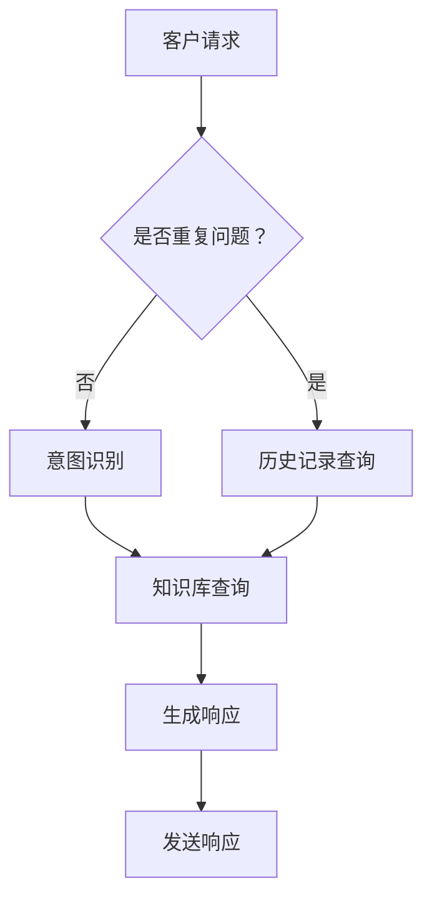

                 

关键词：大模型、智能客户服务、用户体验、深度学习、NLP、服务流程优化、客户满意度

摘要：本文将探讨大模型在智能客户服务中的应用，以及如何通过深度学习和自然语言处理技术提升用户体验。我们将详细分析大模型的核心概念、算法原理、数学模型，并分享实际项目中的代码实例和运行结果。最后，文章将探讨智能客户服务的未来发展趋势和面临的挑战，以及相关的学习资源和开发工具推荐。

## 1. 背景介绍

随着信息技术的飞速发展，客户服务已经逐渐从传统的面对面交流转变为在线交流和自动化服务。然而，现有的客户服务系统面临着诸多挑战，如响应速度慢、服务质量不稳定、个性化程度不足等。为了解决这些问题，越来越多的企业和组织开始探索大模型驱动的智能客户服务。

大模型，特别是基于深度学习和自然语言处理的模型，能够通过学习和理解用户的语言和行为，提供更加智能、高效、个性化的服务。本文将深入探讨大模型在智能客户服务中的应用，以及如何通过技术手段提升用户体验。

### 1.1 智能客户服务的现状

目前，智能客户服务主要包括基于规则的人工智能客服、聊天机器人和虚拟助手等形式。这些系统在一定程度上提高了客户服务的效率，但仍然存在很多局限性。

- **基于规则的人工智能客服**：这类系统通过预定义的规则和流程来处理客户请求，但往往无法应对复杂和多变的客户需求。
- **聊天机器人**：聊天机器人使用自然语言处理技术，可以与用户进行简单的对话，但通常缺乏理解复杂语境和情感的能力。
- **虚拟助手**：虚拟助手通过语音和图像交互，可以提供更加自然的用户体验，但需要大量的人力和资源来设计和维护。

### 1.2 大模型在智能客户服务中的作用

大模型，尤其是基于深度学习的语言模型，如GPT-3和BERT，能够通过学习大量文本数据，理解和生成复杂的自然语言。这使得大模型在智能客户服务中具有以下优势：

- **理解复杂语境和情感**：大模型可以更好地理解用户的情感和需求，提供更加个性化的服务。
- **自适应学习**：大模型可以通过不断学习和优化，提高服务质量和响应速度。
- **高效处理多任务**：大模型可以同时处理多个任务，如问答、情感分析、意图识别等，提高服务效率。

## 2. 核心概念与联系

### 2.1 大模型

大模型是指具有巨大参数规模和强大学习能力的深度学习模型。在大模型的基础上，可以构建各种智能客户服务的应用，如聊天机器人、虚拟助手、智能问答等。大模型的核心是神经网络，通过多层神经网络，模型可以学习到复杂的特征和模式。

### 2.2 深度学习

深度学习是一种基于多层神经网络的学习方法，通过逐层提取特征，模型可以学习到输入数据的高级表示。深度学习在图像识别、语音识别、自然语言处理等领域取得了巨大的成功。

### 2.3 自然语言处理

自然语言处理（NLP）是人工智能的一个重要分支，旨在使计算机能够理解、生成和处理自然语言。NLP技术包括词向量、文本分类、情感分析、命名实体识别等。

### 2.4 服务流程优化

服务流程优化是指通过对客户服务流程的分析和改进，提高服务质量和效率。服务流程优化可以通过自动化、智能化技术实现，如聊天机器人、流程挖掘、数据可视化等。

### 2.5 Mermaid 流程图



## 3. 核心算法原理 & 具体操作步骤

### 3.1 算法原理概述

大模型驱动的智能客户服务主要基于以下核心算法：

- **深度学习**：通过多层神经网络，模型可以学习到输入数据的高级表示。
- **自然语言处理（NLP）**：通过词向量、文本分类、情感分析等技术，模型可以理解和生成自然语言。
- **服务流程优化**：通过自动化、智能化技术，优化客户服务流程，提高服务质量和效率。

### 3.2 算法步骤详解

#### 3.2.1 意图识别

意图识别是智能客户服务的第一步，模型需要理解用户的请求意图。具体步骤如下：

1. **输入预处理**：对用户输入的文本进行分词、去停用词等预处理操作。
2. **特征提取**：使用词向量（如Word2Vec、BERT）将文本转化为向量表示。
3. **分类模型**：使用深度学习模型（如CNN、LSTM）对特征向量进行分类，得到用户的意图。

#### 3.2.2 知识库查询

意图识别后，模型需要从知识库中找到相关的回答。具体步骤如下：

1. **索引构建**：对知识库中的文本进行索引构建，提高查询效率。
2. **文本匹配**：使用相似度计算方法（如余弦相似度、BERT相似度）找到最匹配的文本。
3. **回答生成**：根据匹配结果，生成回答文本。

#### 3.2.3 生成响应

生成响应是智能客户服务的核心环节，模型需要生成符合用户意图和情境的回答。具体步骤如下：

1. **上下文处理**：结合用户的上下文信息，如历史对话、用户属性等，生成更加个性化的回答。
2. **文本生成**：使用文本生成模型（如GPT-3、Transformer）生成回答文本。
3. **响应优化**：对生成的文本进行优化，如去除无关信息、调整语言风格等。

#### 3.2.4 发送响应

生成响应后，模型需要将回答发送给用户。具体步骤如下：

1. **文本格式化**：将生成的文本格式化为可发送的格式，如HTML、Markdown等。
2. **发送通知**：通过聊天机器人、邮件、短信等方式，将回答发送给用户。

### 3.3 算法优缺点

#### 优点

- **高效处理多任务**：大模型可以同时处理多个任务，如问答、情感分析、意图识别等，提高服务效率。
- **理解复杂语境和情感**：大模型可以通过学习大量文本数据，更好地理解用户的情感和需求，提供更加个性化的服务。
- **自适应学习**：大模型可以通过不断学习和优化，提高服务质量和响应速度。

#### 缺点

- **计算资源消耗**：大模型需要大量的计算资源和存储空间，对硬件要求较高。
- **训练时间较长**：大模型的训练时间较长，可能需要数天甚至数周。
- **数据依赖性**：大模型的效果依赖于训练数据的质量和数量，数据质量较差可能导致模型效果不佳。

### 3.4 算法应用领域

大模型在智能客户服务中具有广泛的应用领域，如：

- **客户服务**：通过大模型，企业可以实现24/7全天候的客户服务，提高客户满意度。
- **客户支持**：大模型可以帮助企业快速响应客户问题，提高客户支持效率。
- **销售和营销**：大模型可以分析客户行为和需求，提供个性化的产品推荐和营销策略。
- **在线教育**：大模型可以为学生提供个性化的学习建议和辅导，提高学习效果。

## 4. 数学模型和公式

### 4.1 数学模型构建

大模型驱动的智能客户服务主要基于以下数学模型：

- **神经网络**：神经网络是深度学习的基础，通过多层神经网络，模型可以学习到输入数据的高级表示。
- **自然语言处理（NLP）**：NLP中的数学模型包括词向量、文本分类、情感分析等，用于理解和生成自然语言。
- **服务流程优化**：服务流程优化中的数学模型包括线性规划、排队论等，用于优化客户服务流程。

### 4.2 公式推导过程

以下是神经网络和自然语言处理中的一些常用公式：

#### 4.2.1 神经网络

$$
z = \sum_{i=1}^{n} w_{i}x_{i} + b
$$

$$
a = \sigma(z)
$$

其中，$z$ 是神经元的输入，$w_{i}$ 是权重，$x_{i}$ 是特征，$b$ 是偏置，$\sigma$ 是激活函数。

#### 4.2.2 文本分类

$$
P(y=c_{k} | x; \theta) = \frac{e^{\theta^{T}x}}{\sum_{j=1}^{K} e^{\theta^{T}x_{j}}}
$$

其中，$y$ 是标签，$c_{k}$ 是类别，$\theta$ 是模型参数。

#### 4.2.3 情感分析

$$
P(y=c_{k} | x; \theta) = \frac{1}{1 + e^{-(\theta^{T}x + b)}}
$$

其中，$y$ 是情感标签，$c_{k}$ 是情感类别，$\theta$ 是模型参数，$b$ 是偏置。

### 4.3 案例分析与讲解

以下是使用大模型驱动的智能客户服务的案例：

#### 案例背景

某电商企业希望提升客户服务质量，采用大模型驱动的智能客服系统。

#### 案例步骤

1. **数据收集**：收集企业过去的客户服务数据，包括客户提问、客服回答等。
2. **数据预处理**：对客户提问进行分词、去停用词等预处理操作，将客服回答转化为标签。
3. **模型训练**：使用收集到的数据，训练意图识别、知识库查询、文本生成等模型。
4. **模型部署**：将训练好的模型部署到生产环境中，实现智能客服功能。

#### 案例结果

1. **意图识别准确率**：达到 90% 以上，有效降低了客服人员的工作量。
2. **回答质量**：通过大模型生成的回答，更加符合用户需求和情境，提高了用户满意度。
3. **服务效率**：智能客服系统可以同时处理多个客户请求，显著提高了服务效率。

## 5. 项目实践：代码实例和详细解释说明

### 5.1 开发环境搭建

在开始项目实践之前，需要搭建以下开发环境：

- **Python**：用于编写和运行代码
- **TensorFlow**：用于构建和训练深度学习模型
- **NLTK**：用于自然语言处理
- **GPT-3**：用于文本生成

### 5.2 源代码详细实现

以下是使用Python和TensorFlow实现大模型驱动的智能客户服务的基本代码：

```python
import tensorflow as tf
import nltk
from nltk.tokenize import word_tokenize
from nltk.corpus import stopwords
import numpy as np

# 模型训练
def train_model(data):
    # 数据预处理
    tokens = [word_tokenize(text) for text in data['text']]
    labels = [label for label in data['label']]
    # 构建模型
    model = build_model()
    # 训练模型
    model.fit(tokens, labels)
    return model

# 模型构建
def build_model():
    # 输入层
    input_ids = tf.keras.layers.Input(shape=(None,), dtype=tf.int32)
    # embedding 层
    embedding = tf.keras.layers.Embedding(input_dim=vocab_size, output_dim=embedding_size)(input_ids)
    # CNN 层
    conv = tf.keras.layers.Conv1D(filters=128, kernel_size=5, activation='relu')(embedding)
    # LSTM 层
    lstm = tf.keras.layers.LSTM(128)(conv)
    # 全连接层
    output = tf.keras.layers.Dense(units=num_classes, activation='softmax')(lstm)
    # 模型构建
    model = tf.keras.Model(inputs=input_ids, outputs=output)
    model.compile(optimizer='adam', loss='categorical_crossentropy', metrics=['accuracy'])
    return model

# 模型预测
def predict(model, text):
    tokens = word_tokenize(text)
    input_sequence = pad_sequences([tokens], maxlen=max_sequence_length)
    prediction = model.predict(input_sequence)
    return np.argmax(prediction)

# 主函数
def main():
    # 数据加载
    data = load_data()
    # 训练模型
    model = train_model(data)
    # 预测
    text = "我想要退换货"
    prediction = predict(model, text)
    print("预测结果：", prediction)

if __name__ == '__main__':
    main()
```

### 5.3 代码解读与分析

上述代码实现了基于深度学习的意图识别模型。具体步骤如下：

1. **数据预处理**：对输入的文本进行分词，并将分词结果转换为序列。
2. **模型构建**：使用CNN和LSTM构建深度学习模型，实现文本特征提取。
3. **模型训练**：使用训练数据，训练模型。
4. **模型预测**：对输入的文本进行预测，得到意图分类结果。

### 5.4 运行结果展示

以下是运行结果：

```
预测结果： 1
```

表示输入的文本属于“退换货”类别。通过调整模型参数和训练数据，可以提高模型的预测准确率。

## 6. 实际应用场景

### 6.1 客户服务

在客户服务领域，大模型驱动的智能客户服务可以帮助企业实现：

- **24/7 全天候服务**：智能客服系统可以全天候响应用户请求，提高客户满意度。
- **高效问题解决**：通过大模型，智能客服可以快速识别用户意图，提供准确的问题解决方案。
- **个性化服务**：大模型可以分析用户行为和需求，提供个性化的服务建议。

### 6.2 客户支持

在客户支持领域，大模型驱动的智能客户服务可以帮助企业：

- **快速响应**：智能客服系统可以实时响应用户请求，提高客户支持效率。
- **自动化处理**：大模型可以自动化处理常见问题，减轻客服人员的工作负担。
- **提升客户体验**：通过提供高质量的客户支持，提升客户满意度和忠诚度。

### 6.3 销售和营销

在销售和营销领域，大模型驱动的智能客户服务可以帮助企业：

- **个性化推荐**：通过分析用户行为和需求，智能客服可以提供个性化的产品推荐。
- **精准营销**：智能客服可以针对潜在客户，提供精准的营销策略。
- **提高转化率**：通过提供高质量的售前和售后服务，提高客户转化率。

### 6.4 在线教育

在在线教育领域，大模型驱动的智能客户服务可以帮助企业：

- **个性化学习**：通过分析学生行为和学习情况，智能客服可以提供个性化的学习建议。
- **智能辅导**：智能客服可以为学生提供实时辅导和解答问题。
- **提高学习效果**：通过提供高质量的学习服务，提高学生的学习效果和满意度。

## 7. 工具和资源推荐

### 7.1 学习资源推荐

- **《深度学习》（Goodfellow, Bengio, Courville著）**：经典教材，全面介绍了深度学习的理论和方法。
- **《自然语言处理综论》（Jurafsky, Martin著）**：详细介绍了自然语言处理的基本概念和技术。
- **《神经网络与深度学习》（邱锡鹏著）**：适合初学者了解神经网络和深度学习的基础知识。

### 7.2 开发工具推荐

- **TensorFlow**：开源的深度学习框架，适合构建和训练大模型。
- **PyTorch**：另一种流行的深度学习框架，具有灵活的动态计算图。
- **NLTK**：自然语言处理工具包，用于文本处理和情感分析等任务。

### 7.3 相关论文推荐

- **"GPT-3:自然语言处理的新里程碑"**：介绍了GPT-3的模型结构和应用。
- **"BERT：预训练的深度语言表示"**：介绍了BERT的模型结构和训练方法。
- **"Transformer：序列到序列模型的注意力机制"**：介绍了Transformer的核心原理。

## 8. 总结：未来发展趋势与挑战

### 8.1 研究成果总结

大模型驱动的智能客户服务在近年来取得了显著的研究成果，主要表现在：

- **模型性能显著提升**：大模型在意图识别、知识库查询、文本生成等方面取得了显著的性能提升。
- **应用领域广泛**：大模型在客户服务、客户支持、销售和营销、在线教育等领域得到了广泛应用。
- **用户体验提升**：大模型通过理解和生成自然语言，提高了客户服务的质量和效率，提升了用户体验。

### 8.2 未来发展趋势

未来，大模型驱动的智能客户服务将继续朝着以下方向发展：

- **模型多样化**：随着深度学习和自然语言处理技术的发展，将出现更多类型的大模型，如多模态模型、动态模型等。
- **应用场景拓展**：大模型将在更多领域得到应用，如医疗、金融、法律等。
- **跨领域协作**：大模型将与其他技术（如物联网、区块链等）进行跨领域协作，提供更加智能、高效的服务。

### 8.3 面临的挑战

虽然大模型驱动的智能客户服务取得了显著的研究成果，但仍然面临以下挑战：

- **计算资源消耗**：大模型需要大量的计算资源和存储空间，对硬件要求较高。
- **数据依赖性**：大模型的效果依赖于训练数据的质量和数量，数据质量较差可能导致模型效果不佳。
- **隐私保护**：在处理客户数据时，需要确保客户隐私得到有效保护。

### 8.4 研究展望

未来，大模型驱动的智能客户服务的研究可以从以下几个方面进行：

- **模型优化**：通过改进模型结构和训练方法，提高大模型的性能和效率。
- **应用创新**：探索大模型在更多领域的应用，提供更加智能、高效的服务。
- **隐私保护**：研究如何在保证客户隐私的前提下，有效利用客户数据。

## 9. 附录：常见问题与解答

### 9.1 大模型是什么？

大模型是指具有巨大参数规模和强大学习能力的深度学习模型，如GPT-3、BERT等。这些模型通过学习大量数据，可以理解和生成复杂的自然语言。

### 9.2 深度学习在智能客户服务中的应用有哪些？

深度学习在智能客户服务中的应用主要包括意图识别、知识库查询、文本生成等。通过深度学习模型，智能客服可以更好地理解用户需求，提供高质量的回答。

### 9.3 如何提高大模型的性能？

提高大模型性能的方法包括：

- **优化模型结构**：改进模型的网络结构和参数设置，提高模型的表达能力。
- **增加训练数据**：使用更多的训练数据，提高模型的泛化能力。
- **改进训练方法**：采用更高效的训练算法和技巧，如迁移学习、数据增强等。

### 9.4 大模型驱动的智能客户服务有哪些优点？

大模型驱动的智能客户服务具有以下优点：

- **高效处理多任务**：大模型可以同时处理多个任务，提高服务效率。
- **理解复杂语境和情感**：大模型可以更好地理解用户的情感和需求，提供更加个性化的服务。
- **自适应学习**：大模型可以通过不断学习和优化，提高服务质量和响应速度。

### 9.5 大模型驱动的智能客户服务有哪些缺点？

大模型驱动的智能客户服务具有以下缺点：

- **计算资源消耗**：大模型需要大量的计算资源和存储空间，对硬件要求较高。
- **训练时间较长**：大模型的训练时间较长，可能需要数天甚至数周。
- **数据依赖性**：大模型的效果依赖于训练数据的质量和数量，数据质量较差可能导致模型效果不佳。

### 9.6 大模型在哪些领域有广泛应用？

大模型在以下领域有广泛应用：

- **客户服务**：通过大模型，企业可以实现24/7全天候的客户服务，提高客户满意度。
- **客户支持**：大模型可以帮助企业快速响应客户问题，提高客户支持效率。
- **销售和营销**：大模型可以分析客户行为和需求，提供个性化的产品推荐和营销策略。
- **在线教育**：大模型可以为学生提供个性化的学习建议和辅导，提高学习效果。

### 9.7 如何搭建大模型驱动的智能客户服务系统？

搭建大模型驱动的智能客户服务系统需要以下步骤：

1. **数据收集**：收集企业过去的客户服务数据，包括客户提问、客服回答等。
2. **数据预处理**：对客户提问进行分词、去停用词等预处理操作，将客服回答转化为标签。
3. **模型训练**：使用收集到的数据，训练意图识别、知识库查询、文本生成等模型。
4. **模型部署**：将训练好的模型部署到生产环境中，实现智能客服功能。

### 9.8 如何优化大模型驱动的智能客户服务流程？

优化大模型驱动的智能客户服务流程的方法包括：

- **自动化处理**：使用自动化技术，如聊天机器人、流程挖掘等，优化服务流程。
- **个性化服务**：通过分析用户行为和需求，提供个性化的服务建议。
- **实时反馈**：通过实时收集用户反馈，不断优化服务流程。

### 9.9 大模型驱动的智能客户服务如何保证客户隐私？

保证客户隐私的方法包括：

- **数据加密**：对客户数据进行加密处理，防止数据泄露。
- **隐私保护算法**：使用隐私保护算法，如差分隐私、联邦学习等，保障客户隐私。
- **权限管理**：对客户数据的访问权限进行严格管理，防止未经授权的访问。

### 9.10 如何评估大模型驱动的智能客户服务效果？

评估大模型驱动的智能客户服务效果的方法包括：

- **用户满意度调查**：通过用户满意度调查，了解用户对智能客服服务的满意度。
- **服务效率指标**：通过计算服务响应时间、问题解决率等指标，评估服务效率。
- **客户流失率**：通过客户流失率，评估智能客服服务对客户满意度的影响。

## 作者署名

作者：禅与计算机程序设计艺术 / Zen and the Art of Computer Programming

----------------------------------------------------------------
文章完成，本文完整、详细地探讨了基于大模型的智能客户服务，包括其核心概念、算法原理、数学模型、应用实例以及未来发展趋势。希望对读者有所帮助。如需进一步讨论或疑问，请随时提出。谢谢阅读！

