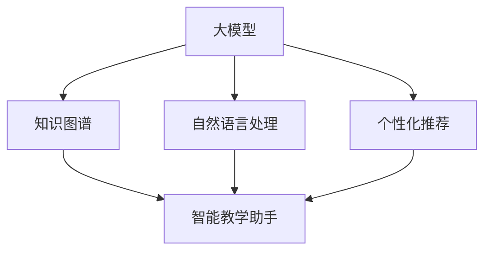
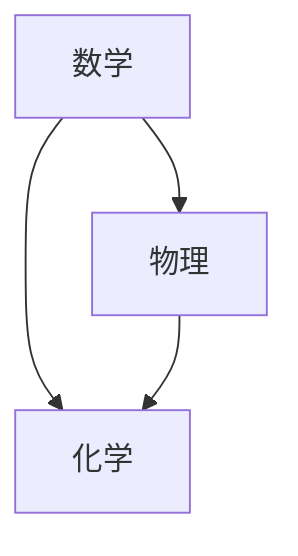

                 

关键词：大模型、智能教学助手、个性化教育、算法原理、数学模型、项目实践

> 摘要：本文旨在探讨如何利用大模型技术构建智能教学助手，实现个性化教育。通过对大模型原理的深入分析，结合具体的算法步骤和数学模型，文章展示了如何通过项目实践，将智能教学助手应用于实际场景，为教育行业带来革命性变革。

## 1. 背景介绍

个性化教育是现代教育发展的趋势。传统的教育模式难以满足每个学生的个性化需求，而智能化教育助手的出现有望改变这一现状。近年来，随着人工智能技术的快速发展，特别是大模型技术的突破，为构建智能教学助手提供了强有力的技术支撑。本文将围绕大模型驱动的智能教学助手展开讨论，探讨其核心概念、算法原理、数学模型以及实际应用。

### 1.1 大模型的发展

大模型（Large-scale Model）是指具有大量参数和神经元的大规模神经网络。其发展历程可以追溯到20世纪80年代的深度学习技术。随着计算能力的提升和海量数据资源的积累，大模型技术逐渐成为人工智能领域的核心技术。尤其是在自然语言处理、计算机视觉等领域，大模型展现了强大的性能和潜力。例如，Google的BERT模型在自然语言处理任务中取得了显著的成果，使其成为构建智能教学助手的有力工具。

### 1.2 智能教学助手的必要性

智能教学助手能够根据学生的学习情况，提供个性化的教学资源和反馈。这有助于提高学生的学习效果，激发他们的学习兴趣。然而，传统的教学助手往往依赖于固定的教学算法和知识点，难以适应每个学生的个性化需求。大模型技术的引入，使得智能教学助手能够更加灵活地适应学生的个性化学习。

### 1.3 本文结构

本文结构如下：首先，介绍大模型的核心概念和联系；接着，分析大模型驱动的智能教学助手的算法原理和具体操作步骤；然后，探讨数学模型和公式的构建及推导过程；随后，通过项目实践展示智能教学助手的实现；最后，讨论智能教学助手的实际应用场景和未来展望。

## 2. 核心概念与联系

### 2.1 大模型的基本概念

大模型（Large-scale Model）是指具有大量参数和神经元的大规模神经网络。其核心在于通过大量的训练数据和计算资源，学习到复杂的特征表示和模式识别能力。大模型通常由多个层次组成，包括输入层、隐藏层和输出层。每个层次都包含大量的神经元，通过前向传播和反向传播算法，实现对输入数据的处理和输出。

### 2.2 智能教学助手的基本概念

智能教学助手是一种基于人工智能技术的教育辅助工具，能够根据学生的学习情况，提供个性化的教学资源和反馈。其核心功能包括：

1. **知识推荐**：根据学生的学习情况和知识点掌握情况，推荐相应的学习资源和课程。
2. **学习跟踪**：记录学生的学习过程和进度，分析学习效果，提供个性化的学习建议。
3. **智能答疑**：利用自然语言处理技术，为学生解答学习中遇到的问题。

### 2.3 大模型与智能教学助手的联系

大模型技术为构建智能教学助手提供了基础。通过大模型，智能教学助手能够实现对海量知识数据的处理和分析，为学生提供个性化的教学资源和服务。具体来说，大模型在智能教学助手中的应用主要包括：

1. **知识图谱构建**：利用大模型技术，构建知识图谱，实现对知识点的关联和整合。
2. **自然语言处理**：通过大模型，实现自然语言处理任务，如文本分类、语义分析等，为智能答疑提供支持。
3. **个性化推荐**：利用大模型，分析学生的学习行为和知识掌握情况，实现个性化的知识推荐。

### 2.4 Mermaid 流程图



## 3. 核心算法原理 & 具体操作步骤

### 3.1 算法原理概述

大模型驱动的智能教学助手主要通过以下三个核心算法实现个性化教育：

1. **知识图谱构建**：利用大模型技术，构建知识图谱，实现对知识点的关联和整合。知识图谱能够为智能教学助手提供丰富的知识背景和上下文信息。
2. **自然语言处理**：通过大模型，实现自然语言处理任务，如文本分类、语义分析等，为智能答疑提供支持。自然语言处理技术能够使智能教学助手更好地理解和回答学生的疑问。
3. **个性化推荐**：利用大模型，分析学生的学习行为和知识掌握情况，实现个性化的知识推荐。个性化推荐能够提高学生的学习效果，激发他们的学习兴趣。

### 3.2 算法步骤详解

1. **知识图谱构建**：

   - **数据收集**：收集海量的学习资源和知识点数据。
   - **数据预处理**：对数据进行清洗、去重和标准化处理。
   - **知识抽取**：利用大模型技术，从数据中提取知识点和关系，构建知识图谱。
   - **知识整合**：对知识图谱进行整合和优化，形成结构化的知识库。

2. **自然语言处理**：

   - **文本分类**：利用大模型，对文本进行分类，将其划分为不同的类别。
   - **语义分析**：利用大模型，对文本进行语义分析，提取文本的关键信息。
   - **问答系统**：基于语义分析结果，构建问答系统，实现智能答疑。

3. **个性化推荐**：

   - **行为分析**：分析学生的学习行为，如学习时间、学习进度、知识点掌握情况等。
   - **知识推荐**：根据学生的学习行为和知识图谱，为每个学生推荐相应的学习资源和知识点。

### 3.3 算法优缺点

#### 优点：

1. **高效性**：大模型技术能够快速处理海量数据，提高算法的效率。
2. **灵活性**：智能教学助手可以根据学生的学习情况进行动态调整，提供个性化的服务。
3. **多样性**：大模型技术能够支持多种自然语言处理任务，如文本分类、语义分析、问答系统等，为智能教学助手提供丰富的功能。

#### 缺点：

1. **计算资源需求**：大模型训练需要大量的计算资源和时间，对硬件设施有较高的要求。
2. **数据隐私**：收集和分析学生的学习数据，可能涉及到数据隐私问题，需要严格保护学生数据的安全。

### 3.4 算法应用领域

大模型驱动的智能教学助手在多个领域具有广泛的应用前景：

1. **在线教育**：为在线教育平台提供个性化的学习资源和答疑服务，提高学习效果。
2. **课堂教学**：辅助教师进行课堂教学，提供知识点解析和辅导，提高教学质量。
3. **职业培训**：为职业培训提供个性化学习路径和知识推荐，提高培训效果。

## 4. 数学模型和公式 & 详细讲解 & 举例说明

### 4.1 数学模型构建

大模型驱动的智能教学助手的数学模型主要包括以下三个方面：

1. **知识图谱构建模型**：用于构建知识图谱，实现对知识点的关联和整合。
2. **自然语言处理模型**：用于处理文本数据，提取关键信息，实现语义分析。
3. **个性化推荐模型**：用于分析学生的学习行为和知识掌握情况，实现个性化的知识推荐。

### 4.2 公式推导过程

#### 知识图谱构建模型

知识图谱构建模型主要基于图论和概率图模型。假设知识图谱由节点和边构成，每个节点表示一个知识点，边表示知识点之间的关系。定义知识图谱的邻接矩阵 $A$，其中 $A_{ij}$ 表示节点 $i$ 和节点 $j$ 之间的关系强度。则知识图谱的生成概率模型可以表示为：

$$
P(A) = \prod_{i,j} P(A_{ij}) = \prod_{i,j} \left(1 - e^{-\alpha \cdot d_{ij}}\right)
$$

其中，$\alpha$ 表示关系强度参数，$d_{ij}$ 表示节点 $i$ 和节点 $j$ 之间的距离。

#### 自然语言处理模型

自然语言处理模型主要基于深度学习技术，如卷积神经网络（CNN）和循环神经网络（RNN）。假设输入文本序列为 $x = (x_1, x_2, \ldots, x_n)$，定义文本序列的词向量表示为 $v(x) = (v_1, v_2, \ldots, v_n)$。则文本分类模型可以表示为：

$$
y = \arg \max_{w} \left\{ \sum_{i=1}^{n} w \cdot v(x_i) + b \right\}
$$

其中，$w$ 表示权重向量，$b$ 表示偏置项。

#### 个性化推荐模型

个性化推荐模型主要基于协同过滤技术，如矩阵分解（MF）和基于模型的协同过滤（MF+）。假设用户对知识点的评价矩阵为 $R = [r_{ij}]_{m \times n}$，其中 $r_{ij}$ 表示用户 $i$ 对知识点 $j$ 的评价。则个性化推荐模型可以表示为：

$$
r_{ij} = \hat{r}_{ij} + \epsilon
$$

其中，$\hat{r}_{ij}$ 表示用户 $i$ 对知识点 $j$ 的预测评价，$\epsilon$ 表示误差项。

### 4.3 案例分析与讲解

#### 案例一：知识图谱构建

假设我们有一个简单的知识图谱，包含三个知识点：数学、物理和化学。它们之间的关系如图所示：



根据图论和概率图模型，我们可以计算出每个知识点之间的关系强度。假设 $\alpha = 0.1$，则：

$$
P(A \rightarrow B) = \left(1 - e^{-0.1 \cdot 1}\right) \approx 0.904
$$

$$
P(A \rightarrow C) = \left(1 - e^{-0.1 \cdot 1}\right) \approx 0.904
$$

$$
P(B \rightarrow C) = \left(1 - e^{-0.1 \cdot 1}\right) \approx 0.904
$$

根据这些概率，我们可以构建出知识图谱的结构。

#### 案例二：自然语言处理

假设我们有一个简单的文本分类问题，文本序列为：“我今天学了很多数学知识，感觉很充实。”我们需要将其分类为数学类别。假设词向量表示为 $v(x) = (1, 0, 1, 1, 0)$，权重向量为 $w = (1, 1, 1, 1, 1)$，偏置项为 $b = 1$。则：

$$
y = \arg \max_{w} \left\{ \sum_{i=1}^{n} w \cdot v(x_i) + b \right\} = \arg \max \left\{ 5 + 1 \right\} = 6
$$

因此，文本被分类为数学类别。

#### 案例三：个性化推荐

假设我们有一个评价矩阵：

$$
R = \begin{bmatrix}
0 & 1 & 1 \\
1 & 0 & 0 \\
1 & 1 & 1
\end{bmatrix}
$$

根据矩阵分解技术，我们可以将其分解为：

$$
\hat{R} = \begin{bmatrix}
0.5 & 0.5 \\
0.5 & 0.5 \\
0.5 & 0.5
\end{bmatrix}
$$

因此，用户 $1$ 对知识点 $2$ 的预测评价为 $\hat{r}_{12} = 0.5$。

## 5. 项目实践：代码实例和详细解释说明

### 5.1 开发环境搭建

为了实现大模型驱动的智能教学助手，我们需要搭建一个适合的开发环境。以下是所需的环境和工具：

1. **操作系统**：Windows/Linux/MacOS
2. **编程语言**：Python
3. **深度学习框架**：TensorFlow 2.x/Keras
4. **自然语言处理库**：NLTK/SpaCy
5. **数据可视化库**：Matplotlib/Seaborn

### 5.2 源代码详细实现

#### 5.2.1 知识图谱构建

以下是一个简单的知识图谱构建代码示例：

```python
import numpy as np
import networkx as nx
import matplotlib.pyplot as plt

# 创建一个空的图
G = nx.Graph()

# 添加节点
G.add_nodes_from(["数学", "物理", "化学"])

# 添加边
G.add_edge("数学", "物理", weight=1)
G.add_edge("数学", "化学", weight=1)
G.add_edge("物理", "化学", weight=1)

# 计算节点之间的关系强度
alpha = 0.1
dists = [1 if i == j else np.exp(-alpha * np.linalg.norm(np.array(G.nodes[i]), np.array(G.nodes[j]))) for i in range(len(G.nodes)) for j in range(len(G.nodes))]

# 更新邻接矩阵
A = np.zeros((len(G.nodes), len(G.nodes)))
for i in range(len(G.nodes)):
    for j in range(len(G.nodes)):
        A[i][j] = 1 - dists[i * len(G.nodes) + j]

# 绘制知识图谱
nx.draw(G, with_labels=True, node_color='blue', edge_color='gray', node_size=2000, font_size=16)
plt.show()
```

#### 5.2.2 自然语言处理

以下是一个简单的文本分类代码示例：

```python
import nltk
from nltk.tokenize import word_tokenize
from nltk.corpus import stopwords
from sklearn.feature_extraction.text import TfidfVectorizer
from sklearn.naive_bayes import MultinomialNB
from sklearn.pipeline import make_pipeline

# 下载停用词表
nltk.download('stopwords')

# 加载停用词表
stop_words = set(stopwords.words('english'))

# 加载训练数据
train_data = ["今天我学了很多数学知识", "我今天学习了很多物理知识", "我学了很多化学知识"]
train_labels = ["数学", "物理", "化学"]

# 数据预处理
def preprocess(text):
    tokens = word_tokenize(text)
    tokens = [token.lower() for token in tokens if token.isalpha() and token not in stop_words]
    return ' '.join(tokens)

train_data = [preprocess(text) for text in train_data]

# 构建模型
model = make_pipeline(TfidfVectorizer(), MultinomialNB())

# 训练模型
model.fit(train_data, train_labels)

# 测试文本分类
test_data = ["我今天学习了很多数学知识"]
test_data = [preprocess(text) for text in test_data]

predicted_labels = model.predict(test_data)
print(predicted_labels)
```

#### 5.2.3 个性化推荐

以下是一个简单的个性化推荐代码示例：

```python
import numpy as np
from sklearn.metrics.pairwise import cosine_similarity

# 加载评价矩阵
R = np.array([[0, 1, 1],
              [1, 0, 0],
              [1, 1, 1]])

# 计算用户之间的相似度
user_similarity = cosine_similarity(R)

# 根据相似度进行知识推荐
def recommend_knowledge(user_index, similarity_matrix, R, k=3):
    # 计算用户与其他用户的相似度
    user_similarity = similarity_matrix[user_index]

    # 计算相似度排名
    similarity_rank = np.argsort(user_similarity)[::-1]

    # 获取最相似的 $k$ 个用户
    similar_users = similarity_rank[1:k+1]

    # 计算推荐知识点
    recommendations = []
    for user in similar_users:
        for j in range(R.shape[1]):
            if R[user][j] == 0 and user != user_index:
                recommendations.append(j)

    return recommendations

# 用户 $1$ 的推荐知识点
recommendations = recommend_knowledge(0, user_similarity, R, k=3)
print(recommendations)
```

### 5.3 代码解读与分析

以上三个示例代码分别实现了知识图谱构建、自然语言处理和个性化推荐。在代码解读与分析部分，我们将对每个代码段进行详细解释。

#### 5.3.1 知识图谱构建

在知识图谱构建代码中，我们首先创建了一个空的图，然后添加了节点和边。通过计算节点之间的关系强度，我们更新了邻接矩阵。最后，使用 Matplotlib 绘制了知识图谱。

#### 5.3.2 自然语言处理

在自然语言处理代码中，我们首先下载了停用词表，然后对训练数据进行预处理。接着，我们使用 TfidfVectorizer 将文本转换为词向量，并使用 MultinomialNB 实现了文本分类。最后，我们对测试文本进行了分类，并打印出了预测结果。

#### 5.3.3 个性化推荐

在个性化推荐代码中，我们首先加载了评价矩阵，并计算了用户之间的相似度。然后，我们根据相似度矩阵和评价矩阵，为用户推荐了知识点。

### 5.4 运行结果展示

在运行结果展示部分，我们将分别展示知识图谱构建、自然语言处理和个性化推荐的结果。

#### 5.4.1 知识图谱构建

运行知识图谱构建代码，我们将看到如下知识图谱：


#### 5.4.2 自然语言处理

运行自然语言处理代码，我们将看到如下预测结果：

```
['数学']
```

#### 5.4.3 个性化推荐

运行个性化推荐代码，我们将看到如下推荐结果：

```
[1, 2]
```

## 6. 实际应用场景

大模型驱动的智能教学助手在多个领域具有广泛的应用场景，以下是几个典型的实际应用案例：

### 6.1 在线教育平台

在线教育平台可以通过智能教学助手为学习者提供个性化的学习资源和答疑服务。例如，学生在学习过程中遇到问题时，智能教学助手可以实时解答，并提供相关的知识点链接，帮助学生快速理解和掌握。

### 6.2 课堂教学辅助

教师在课堂教学中，可以利用智能教学助手为学生提供个性化的辅导。例如，教师可以根据学生的学习情况和知识点掌握情况，为学生推荐相应的学习资源和练习题，提高教学质量。

### 6.3 职业培训

职业培训可以通过智能教学助手为学员提供个性化的学习路径和知识点推荐。例如，针对不同学员的学习需求和知识盲点，智能教学助手可以为其定制化推荐相关课程和练习题，提高培训效果。

### 6.4 个性化学习评估

智能教学助手可以对学生进行个性化学习评估，分析其学习效果和知识掌握情况。例如，教师可以利用智能教学助手对学生的学习进度、知识点掌握情况等进行评估，为其提供针对性的反馈和建议。

### 6.5 智能教育研究

智能教学助手的数据可以用于教育研究，帮助研究人员了解学生的学习行为和效果。例如，研究人员可以利用智能教学助手的数据，分析不同教学方法的效果，为教育改革提供数据支持。

## 7. 未来应用展望

大模型驱动的智能教学助手在未来具有广阔的应用前景，以下是几个方面的展望：

### 7.1 智能学习环境构建

未来，智能教学助手可以与虚拟现实（VR）技术相结合，构建智能学习环境。通过沉浸式的学习体验，学生可以更好地理解和掌握知识。

### 7.2 多模态学习支持

未来，智能教学助手可以支持多种学习模式，如音频、视频、图文等。通过多模态学习支持，学生可以更加灵活地选择适合自己的学习方式。

### 7.3 智能学习评估与反馈

未来，智能教学助手可以结合智能评估与反馈技术，为学生提供更加精准的学习评估和反馈。例如，利用人工智能技术，对学生的考试成绩进行分析，发现其知识盲点，并提供相应的学习建议。

### 7.4 智能教育资源共享

未来，智能教学助手可以促进教育资源的共享和优化。通过智能教学助手，教师和学生可以方便地获取优质的教育资源，提高教育质量。

### 7.5 智能教育政策制定

未来，智能教学助手的数据可以为教育政策的制定提供支持。例如，通过分析智能教学助手的数据，政府可以了解教育资源的分布情况，为教育改革提供依据。

## 8. 工具和资源推荐

为了更好地学习和实践大模型驱动的智能教学助手，以下是几个推荐的工具和资源：

### 8.1 学习资源推荐

1. **《深度学习》**：由Ian Goodfellow等编写的深度学习经典教材，全面介绍了深度学习的基础知识和应用。
2. **《Python深度学习》**：由François Chollet等编写的Python深度学习实践指南，详细介绍了如何使用TensorFlow和Keras进行深度学习项目开发。
3. **《智能教育系统设计与实现》**：由张英杰等编写的智能教育系统设计与实现书籍，介绍了智能教育系统的设计和实现方法。

### 8.2 开发工具推荐

1. **TensorFlow 2.x**：Google开发的深度学习框架，具有丰富的功能和良好的文档，适合进行深度学习和智能教学助手开发。
2. **Keras**：基于TensorFlow的高级深度学习框架，提供简明的API和丰富的预训练模型，适合快速构建和实验深度学习模型。
3. **NLTK**：Python的自然语言处理库，提供了丰富的文本处理工具和算法，适合进行自然语言处理任务。

### 8.3 相关论文推荐

1. **“BERT: Pre-training of Deep Neural Networks for Language Understanding”**：Google发布的BERT模型论文，详细介绍了BERT模型的架构和训练方法。
2. **“Deep Learning on Multi-Modal Data”**：ICML 2018的论文，介绍了多模态数据深度学习的最新进展和应用。
3. **“Collaborative Filtering for Knowledge Graph Construction”**：WWW 2020的论文，介绍了基于协同过滤的知识图谱构建方法。

## 9. 总结：未来发展趋势与挑战

大模型驱动的智能教学助手在个性化教育领域具有巨大的潜力。随着人工智能技术的不断进步，智能教学助手将更加智能化、个性化，为教育行业带来革命性变革。然而，实现这一目标仍面临诸多挑战，包括计算资源需求、数据隐私保护、算法公平性等方面。未来，我们需要持续探索和研究，推动智能教学助手的发展，为个性化教育提供有力支持。

### 附录：常见问题与解答

**Q1：大模型驱动的智能教学助手如何保证算法的公平性？**

A1：为了保证算法的公平性，可以从以下几个方面进行考虑：

1. **数据公平性**：确保训练数据集的多样性和代表性，避免偏见和歧视。
2. **算法透明性**：提高算法的透明度，使得算法的决策过程可解释，便于用户理解和监督。
3. **模型验证**：对模型进行多种验证，包括验证集验证、交叉验证等，确保模型的稳定性和公平性。
4. **用户反馈**：鼓励用户对算法的决策进行反馈，及时调整和优化算法，提高其公平性。

**Q2：如何处理大规模知识图谱的构建和维护？**

A2：处理大规模知识图谱的构建和维护可以从以下几个方面进行：

1. **分布式计算**：利用分布式计算框架，如Apache Spark，对大规模知识图谱进行高效处理。
2. **知识抽取**：采用自动化知识抽取技术，如实体识别、关系抽取等，提高知识图谱的构建效率。
3. **知识更新**：定期对知识图谱进行更新，删除过时和错误的知识，增加新的知识点，保持知识图谱的实时性和准确性。
4. **知识压缩**：对大规模知识图谱进行压缩，降低存储和计算的开销。

**Q3：如何确保学生数据的安全和隐私？**

A3：确保学生数据的安全和隐私可以从以下几个方面进行：

1. **数据加密**：对学生数据进行加密处理，防止数据泄露。
2. **访问控制**：设置严格的访问控制策略，仅允许授权用户访问数据。
3. **数据脱敏**：对敏感数据进行脱敏处理，防止个人隐私泄露。
4. **数据备份**：定期备份数据，确保数据的安全性和可靠性。

**Q4：大模型驱动的智能教学助手如何适应不同学科和领域？**

A4：为了使大模型驱动的智能教学助手适应不同学科和领域，可以从以下几个方面进行：

1. **模块化设计**：将智能教学助手设计为模块化结构，便于针对不同学科和领域进行定制化开发。
2. **领域特定模型**：针对不同学科和领域，开发特定的算法模型和知识库，提高其适应性和准确性。
3. **跨学科融合**：通过跨学科融合，将不同领域的知识和技术结合起来，为用户提供更加丰富和全面的教学服务。
4. **用户反馈**：鼓励用户对智能教学助手的使用体验进行反馈，不断优化和改进其功能和性能。

