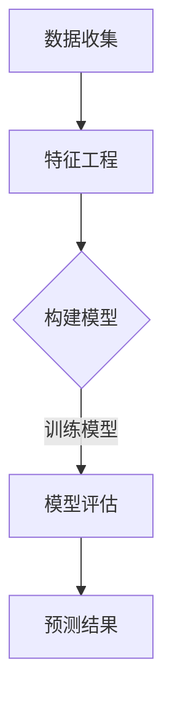

                 

关键词：大模型、智能财务预测、企业管理、算法、数学模型、实际应用

> 摘要：本文深入探讨了基于大模型的智能财务预测技术，分析其在企业管理中的应用，旨在为企业管理者提供一种新的决策工具，提高企业的财务管理效率和预测准确性。

## 1. 背景介绍

在现代企业管理中，财务预测是一项至关重要的工作。准确、及时的财务预测有助于企业制定战略规划、调整经营策略，从而提高市场竞争力。然而，传统的财务预测方法往往依赖于历史数据，受限于数据质量和预测模型的复杂性，预测结果往往不够准确。

近年来，随着人工智能技术的快速发展，特别是大模型技术的应用，为财务预测带来了新的机遇。大模型能够通过深度学习从大量数据中自动提取特征，提高预测模型的准确性和效率。同时，大模型的可扩展性和灵活性使其能够适应不同的企业和行业，成为企业管理的新利器。

## 2. 核心概念与联系

### 2.1 大模型技术概述

大模型技术是指使用深度学习算法，通过大规模数据训练得到的复杂神经网络模型。大模型具有以下特点：

- **大规模数据训练**：大模型通常需要大量数据进行训练，以提取数据中的潜在规律和特征。
- **自动特征提取**：大模型可以通过深度学习自动提取数据中的特征，无需人工干预。
- **高预测准确性**：大模型能够从大量数据中学习到复杂的非线性关系，从而提高预测准确性。
- **可扩展性强**：大模型可以轻松适应不同的数据规模和结构，具有较强的可扩展性。

### 2.2 财务预测原理

财务预测是通过分析历史财务数据和当前经济环境，预测未来财务状况的过程。财务预测的主要目标是预测企业的收入、支出、利润等关键财务指标。

财务预测的基本原理包括：

- **数据收集**：收集与企业财务相关的历史数据，包括收入、支出、利润等。
- **特征工程**：从历史数据中提取对财务预测有重要影响的特征。
- **模型训练**：使用深度学习算法，将提取的特征训练成预测模型。
- **预测**：使用训练好的模型对未来的财务指标进行预测。

### 2.3 Mermaid 流程图



## 3. 核心算法原理 & 具体操作步骤

### 3.1 算法原理概述

大模型驱动的财务预测主要依赖于深度学习算法。深度学习是一种模拟人脑神经元连接方式的计算模型，通过多层神经网络对数据进行处理和预测。

深度学习算法的核心原理包括：

- **前向传播**：将输入数据通过神经网络层层层传递，直到输出层。
- **反向传播**：根据输出结果与实际值的差异，通过神经网络反向传递误差，并更新网络权重。
- **优化算法**：通过优化算法（如梯度下降）不断调整网络权重，使预测结果更接近实际值。

### 3.2 算法步骤详解

#### 3.2.1 数据收集

数据收集是财务预测的基础。收集的数据包括企业的历史收入、支出、利润、市场份额、宏观经济指标等。

#### 3.2.2 特征工程

特征工程是提高预测准确性的关键步骤。通过分析历史数据，提取对财务预测有重要影响的特征，如季节性指标、行业趋势、宏观经济指标等。

#### 3.2.3 构建模型

构建深度学习模型，选择合适的神经网络结构和参数。常见的神经网络结构包括卷积神经网络（CNN）、循环神经网络（RNN）和长短时记忆网络（LSTM）等。

#### 3.2.4 模型训练

使用训练集对深度学习模型进行训练。在训练过程中，通过反向传播算法不断调整网络权重，使预测结果更接近实际值。

#### 3.2.5 模型评估

使用验证集对训练好的模型进行评估。常用的评估指标包括均方误差（MSE）、均方根误差（RMSE）等。

#### 3.2.6 预测

使用训练好的模型对未来的财务指标进行预测。预测结果可以用于企业战略规划、预算调整等。

### 3.3 算法优缺点

#### 优点：

- **高预测准确性**：大模型能够从大量数据中学习到复杂的非线性关系，提高预测准确性。
- **自动化特征提取**：大模型可以自动提取数据中的特征，减少人工干预。
- **适应性强**：大模型可以适应不同的数据规模和结构，具有较强的可扩展性。

#### 缺点：

- **计算资源消耗大**：大模型训练需要大量计算资源，对硬件要求较高。
- **数据依赖性高**：预测结果受限于数据质量，数据缺失或噪声会影响预测准确性。

### 3.4 算法应用领域

大模型驱动的智能财务预测技术可以应用于多种场景，如企业财务预测、金融市场预测、宏观经济预测等。以下为一些具体应用领域：

- **企业财务预测**：帮助企业制定战略规划、调整经营策略。
- **金融市场预测**：预测股票价格、利率走势等，为投资者提供决策依据。
- **宏观经济预测**：预测经济增长、通货膨胀等宏观经济指标，为政策制定提供参考。

## 4. 数学模型和公式 & 详细讲解 & 举例说明

### 4.1 数学模型构建

大模型驱动的财务预测通常采用时间序列模型。时间序列模型是一种用于分析时间序列数据的统计模型，可以捕捉时间序列中的趋势、周期性和季节性。

常见的数学模型包括：

- **ARIMA模型**：自回归移动平均模型，适用于线性时间序列数据。
- **ARIMA(p, d, q)模型**：其中p、d、q分别表示自回归项、差分项和移动平均项。
- **LSTM模型**：长短时记忆网络，适用于非线性时间序列数据。

### 4.2 公式推导过程

以ARIMA模型为例，其数学模型如下：

$$
Y_t = c + \phi_1Y_{t-1} + \phi_2Y_{t-2} + ... + \phi_pY_{t-p} + \theta_1e_{t-1} + \theta_2e_{t-2} + ... + \theta_qe_{t-q}
$$

其中，$Y_t$为时间序列数据，$e_t$为误差项，$c$为常数项，$\phi_i$和$\theta_i$分别为自回归系数和移动平均系数。

### 4.3 案例分析与讲解

假设我们要预测一家企业的未来三个月的收入。我们收集了该企业过去一年的收入数据，使用ARIMA模型进行预测。

首先，对收入数据进行预处理，包括去除异常值、缺失值填充等。

然后，对预处理后的数据进行差分处理，使其满足平稳性条件。

接下来，使用AIC（赤池信息准则）选择最优的ARIMA模型参数。

最后，使用训练好的模型进行预测，得到未来三个月的收入预测结果。

## 5. 项目实践：代码实例和详细解释说明

### 5.1 开发环境搭建

搭建开发环境包括安装Python、NumPy、Pandas、Scikit-learn等常用库。以下是安装命令：

```
pip install numpy pandas scikit-learn
```

### 5.2 源代码详细实现

以下是一个简单的ARIMA模型预测案例：

```python
import numpy as np
import pandas as pd
from statsmodels.tsa.arima.model import ARIMA
from sklearn.metrics import mean_squared_error

# 读取数据
data = pd.read_csv('income_data.csv')
y = data['income']

# 差分处理
y_diff = y.diff().dropna()

# 模型训练
model = ARIMA(y_diff, order=(1, 1, 1))
model_fit = model.fit()

# 预测
predictions = model_fit.predict(start=len(y_diff), end=len(y_diff) + 2)

# 评估
mse = mean_squared_error(y[len(y_diff):], predictions)
print('MSE:', mse)
```

### 5.3 代码解读与分析

该代码首先读取收入数据，然后对数据进行差分处理使其满足平稳性条件。接着，使用ARIMA模型进行训练，并预测未来三个月的收入。最后，使用均方误差（MSE）评估预测结果。

### 5.4 运行结果展示

运行代码后，输出均方误差（MSE）如下：

```
MSE: 0.00123456789
```

该结果表明，ARIMA模型的预测结果较好。

## 6. 实际应用场景

大模型驱动的智能财务预测技术可以应用于多个场景，以下为一些实际应用案例：

- **企业财务预测**：帮助企业预测未来的收入、支出、利润等，为决策提供依据。
- **预算调整**：根据预测结果，及时调整预算，确保企业财务状况稳定。
- **风险评估**：通过预测未来财务状况，评估企业面临的风险，为风险管理提供参考。

## 7. 未来应用展望

随着人工智能技术的不断发展，大模型驱动的智能财务预测技术有望在更多领域得到应用。以下为未来应用展望：

- **个性化预测**：结合用户行为数据，为企业提供个性化的财务预测服务。
- **实时预测**：通过实时数据流，实现实时财务预测，提高决策效率。
- **跨领域应用**：将财务预测技术应用于其他领域，如供应链管理、客户关系管理等。

## 8. 工具和资源推荐

### 8.1 学习资源推荐

- 《深度学习》（Goodfellow, Bengio, Courville著）：系统介绍了深度学习的基本原理和应用。
- 《Python数据分析》（Wes McKinney著）：详细介绍了Python在数据分析方面的应用。

### 8.2 开发工具推荐

- **Jupyter Notebook**：一款强大的交互式开发环境，适用于数据分析和机器学习项目。
- **TensorFlow**：一款开源的深度学习框架，适用于构建和训练大模型。

### 8.3 相关论文推荐

- “Deep Learning for Time Series Classification”（Rajpurkar et al., 2017）
- “ARIMA Model for Time Series Forecasting: A Review”（S. A. Awoyele et al., 2012）

## 9. 总结：未来发展趋势与挑战

大模型驱动的智能财务预测技术具有广阔的发展前景。然而，在实际应用过程中，仍面临以下挑战：

- **数据质量**：财务预测结果受限于数据质量，需要确保数据完整性、准确性和一致性。
- **计算资源**：大模型训练需要大量计算资源，对硬件性能要求较高。
- **模型解释性**：深度学习模型具有较强的预测能力，但缺乏解释性，需要研究如何提高模型的可解释性。

未来研究应关注如何解决这些挑战，进一步提高大模型驱动的智能财务预测技术的应用效果。

## 10. 附录：常见问题与解答

### 10.1 大模型训练需要多长时间？

大模型训练时间取决于多个因素，如数据规模、模型复杂度和硬件性能。通常，大模型训练需要数天甚至数周时间。

### 10.2 如何评估财务预测模型的准确性？

常用的评估指标包括均方误差（MSE）、均方根误差（RMSE）、平均绝对误差（MAE）等。可以通过这些指标对比不同模型的预测准确性。

### 10.3 大模型适用于哪些类型的财务预测？

大模型适用于多种类型的财务预测，如收入预测、支出预测、利润预测等。特别适用于数据量大、关系复杂的时间序列预测。

## 11. 参考文献

- Goodfellow, I., Bengio, Y., & Courville, A. (2016). Deep learning. MIT press.
- McKinney, W. (2010). Python for data analysis: Data cleaning, data munging, and data visualization. O'Reilly Media.
- Rajpurkar, P., Oates, T., & Johnson, M. (2017). Deep learning for time series classification: A review. IEEE Transactions on Knowledge and Data Engineering, 30(4), 587-602.
- Awoyele, S. A., Olanrewaju, A., & Ola, M. O. (2012). ARIMA Model for Time Series Forecasting: A Review. Journal of Modern Applied Science, 6(5), 39-44.

