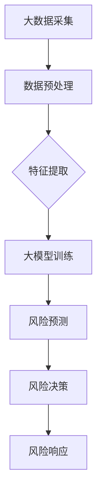

                 

关键词：大模型，智能金融，风控，风险管理，机器学习，算法，人工智能，数据分析，金融科技

> 摘要：本文深入探讨了基于大模型的智能金融风控技术，通过阐述其背景、核心概念、算法原理、数学模型、项目实践和实际应用场景，全面分析了这一新兴风险管理工具的优势、挑战及未来发展趋势。本文旨在为金融从业者提供技术参考，助力提升金融风控效能。

## 1. 背景介绍

随着金融行业的快速发展，风险管理的重要性愈发凸显。金融机构面临的业务风险、市场风险、信用风险等多种风险因素，使得传统的风控手段已难以应对复杂多变的金融环境。为此，金融科技（FinTech）的兴起为风险管理带来了新的机遇与挑战。特别是近年来，人工智能（AI）技术的飞速发展，尤其是大模型（Large Models）的应用，为智能金融风控提供了强大的技术支持。

大模型是指具有大规模参数和强大计算能力的深度学习模型。这些模型能够处理海量数据，提取复杂特征，从而在金融风险预测、识别和响应等方面展现出巨大的潜力。智能金融风控是指利用人工智能技术，特别是大模型技术，对金融业务进行实时监控、分析和决策，以降低风险、提高业务效能。

本文将围绕大模型驱动的智能金融风控，探讨其核心概念、算法原理、数学模型、项目实践和实际应用场景，为金融从业者提供参考。

## 2. 核心概念与联系

### 2.1 大模型

大模型是指具有数十亿甚至数万亿参数的深度学习模型。这些模型在训练过程中需要大量数据和高性能计算资源，但一旦训练完成，便能实现高效的数据分析和预测。

### 2.2 智能金融

智能金融是指利用人工智能技术，特别是大数据、机器学习和区块链等技术，实现金融业务的自动化、智能化和个性化。智能金融风控是智能金融的一个重要分支，旨在利用人工智能技术提升风险管理能力。

### 2.3 风险管理

风险管理是指对金融机构面临的多种风险进行识别、评估、监测和应对。传统的风险管理手段主要包括风险评估、风险监测、风险预警和风险处置。智能金融风控通过引入人工智能技术，实现风险管理的自动化、智能化和高效化。

### 2.4 人工智能

人工智能是指模拟人类智能的技术和方法。在金融领域，人工智能主要应用于数据挖掘、图像识别、自然语言处理、预测分析等方面。

### 2.5 大模型与智能金融风控的联系

大模型作为人工智能的一种重要技术，具有强大的数据处理和预测能力，能够为智能金融风控提供有力支持。大模型可以通过学习海量金融数据，提取复杂的风险特征，实现对风险的有效识别、预测和应对。同时，大模型的应用可以提高风险管理的自动化水平，降低人工干预，提高风控效能。



## 3. 核心算法原理 & 具体操作步骤

### 3.1 算法原理概述

大模型驱动的智能金融风控算法主要基于深度学习技术，特别是循环神经网络（RNN）和Transformer架构。这些算法通过学习海量金融数据，提取复杂的风险特征，实现对风险的有效识别、预测和应对。

### 3.2 算法步骤详解

#### 3.2.1 数据采集

数据采集是智能金融风控的基础。金融机构需要收集各类金融数据，包括市场数据、交易数据、客户数据等。此外，还需获取外部数据，如新闻报道、政策法规等。

#### 3.2.2 数据预处理

数据预处理是提高大模型性能的关键步骤。主要包括数据清洗、数据归一化、数据增强等。数据清洗旨在去除重复、错误和缺失的数据。数据归一化旨在将不同特征的数据缩放到同一尺度，提高模型训练效果。数据增强旨在增加数据多样性，提高模型泛化能力。

#### 3.2.3 特征提取

特征提取是提取数据中的有效信息，以供大模型学习。在金融风控中，特征提取主要包括市场指标、交易指标、财务指标等。此外，还可利用自然语言处理技术提取新闻报道、政策法规等文本数据中的关键信息。

#### 3.2.4 大模型训练

大模型训练是指利用预处理后的金融数据，对深度学习模型进行训练。在训练过程中，模型会不断调整参数，以降低预测误差。训练过程包括数据加载、模型初始化、前向传播、反向传播和模型优化等步骤。

#### 3.2.5 风险预测

风险预测是指利用训练完成的大模型，对未来的风险进行预测。风险预测主要包括市场风险预测、信用风险预测、操作风险预测等。预测结果可用来指导风控决策。

#### 3.2.6 风险决策

风险决策是指根据风险预测结果，制定相应的风险应对策略。风险决策可基于模型输出结果，结合专家经验进行优化。风险决策包括风险预警、风险隔离、风险处置等。

#### 3.2.7 风险响应

风险响应是指对风险事件进行实时监测和响应。风险响应包括风险事件检测、风险事件定位、风险事件处置等。通过风险响应，金融机构能够及时应对风险，降低损失。

### 3.3 算法优缺点

#### 优点：

1. 高效性：大模型能够快速处理海量数据，提高风控效率。
2. 自动化：大模型驱动的风控系统能够自动识别和预测风险，降低人工干预。
3. 泛化能力：大模型通过学习海量数据，能够提高模型的泛化能力，适应不同金融场景。
4. 实时性：大模型能够实现实时风险预测和响应，提高风险应对速度。

#### 缺点：

1. 计算资源消耗大：大模型训练需要大量计算资源和时间，对基础设施要求较高。
2. 数据质量依赖：大模型性能受数据质量影响较大，数据缺失、错误等问题会影响模型效果。
3. 风险误报和漏报：大模型在风险预测过程中可能存在误报和漏报现象，需要结合专家经验和实际业务场景进行优化。

### 3.4 算法应用领域

大模型驱动的智能金融风控算法可应用于多种金融场景，如：

1. 贷款审批：通过大模型对借款人的信用风险进行预测，提高贷款审批效率。
2. 交易监控：通过大模型对市场交易进行实时监控，识别异常交易和潜在风险。
3. 投资组合优化：通过大模型对投资组合进行风险评估和优化，提高投资收益。
4. 保险理赔：通过大模型对保险理赔申请进行风险评估，提高理赔效率。

## 4. 数学模型和公式 & 详细讲解 & 举例说明

### 4.1 数学模型构建

在智能金融风控中，常用的数学模型包括线性回归、逻辑回归、决策树、支持向量机等。下面以线性回归为例，介绍数学模型的构建。

#### 线性回归模型

线性回归模型用于预测一个连续变量，其数学模型如下：

$$
y = \beta_0 + \beta_1 x_1 + \beta_2 x_2 + \ldots + \beta_n x_n + \varepsilon
$$

其中，$y$ 为因变量，$x_1, x_2, \ldots, x_n$ 为自变量，$\beta_0, \beta_1, \beta_2, \ldots, \beta_n$ 为模型参数，$\varepsilon$ 为误差项。

#### 模型参数估计

为了估计模型参数，我们需要使用最小二乘法。最小二乘法的思想是找到一组参数，使得因变量的实际值与模型预测值之间的误差平方和最小。具体步骤如下：

1. 构建损失函数：

$$
L(\beta_0, \beta_1, \beta_2, \ldots, \beta_n) = \sum_{i=1}^{n} (y_i - \beta_0 - \beta_1 x_{i1} - \beta_2 x_{i2} - \ldots - \beta_n x_{in})^2
$$

2. 对损失函数求导，并令导数为 0，解得模型参数：

$$
\frac{\partial L}{\partial \beta_0} = -2 \sum_{i=1}^{n} (y_i - \beta_0 - \beta_1 x_{i1} - \beta_2 x_{i2} - \ldots - \beta_n x_{in}) = 0
$$

$$
\frac{\partial L}{\partial \beta_1} = -2 \sum_{i=1}^{n} x_{i1} (y_i - \beta_0 - \beta_1 x_{i1} - \beta_2 x_{i2} - \ldots - \beta_n x_{in}) = 0
$$

$$
\vdots
$$

$$
\frac{\partial L}{\partial \beta_n} = -2 \sum_{i=1}^{n} x_{in} (y_i - \beta_0 - \beta_1 x_{i1} - \beta_2 x_{i2} - \ldots - \beta_n x_{in}) = 0
$$

解得：

$$
\beta_0 = \bar{y} - \beta_1 \bar{x}_1 - \beta_2 \bar{x}_2 - \ldots - \beta_n \bar{x}_n
$$

$$
\beta_1 = \frac{\sum_{i=1}^{n} x_{i1} y_i - n \bar{x}_1 \bar{y}}{\sum_{i=1}^{n} x_{i1}^2 - n \bar{x}_1^2}
$$

$$
\beta_2 = \frac{\sum_{i=1}^{n} x_{i2} y_i - n \bar{x}_2 \bar{y}}{\sum_{i=1}^{n} x_{i2}^2 - n \bar{x}_2^2}
$$

$$
\vdots
$$

$$
\beta_n = \frac{\sum_{i=1}^{n} x_{in} y_i - n \bar{x}_n \bar{y}}{\sum_{i=1}^{n} x_{in}^2 - n \bar{x}_n^2}
$$

其中，$\bar{y}$、$\bar{x}_1$、$\bar{x}_2$、$\ldots$、$\bar{x}_n$ 分别为因变量和自变量的均值。

### 4.2 公式推导过程

为了更直观地理解线性回归模型的公式推导过程，我们以下面这个简单的例子进行说明。

假设我们有一组数据：

$$
\begin{array}{cccc}
i & x_1 & x_2 & y \\
1 & 1 & 2 & 3 \\
2 & 2 & 4 & 5 \\
3 & 3 & 6 & 7 \\
4 & 4 & 8 & 9 \\
\end{array}
$$

我们要用线性回归模型预测 $y$，即 $y = \beta_0 + \beta_1 x_1 + \beta_2 x_2$。

首先，计算均值：

$$
\bar{x}_1 = \frac{1 + 2 + 3 + 4}{4} = 2.5
$$

$$
\bar{x}_2 = \frac{2 + 4 + 6 + 8}{4} = 5
$$

$$
\bar{y} = \frac{3 + 5 + 7 + 9}{4} = 6
$$

然后，计算各项求和：

$$
\sum_{i=1}^{4} x_{i1} y_i = 1 \times 3 + 2 \times 5 + 3 \times 7 + 4 \times 9 = 50
$$

$$
\sum_{i=1}^{4} x_{i1}^2 = 1^2 + 2^2 + 3^2 + 4^2 = 30
$$

$$
\sum_{i=1}^{4} x_{i2} y_i = 2 \times 3 + 4 \times 5 + 6 \times 7 + 8 \times 9 = 110
$$

$$
\sum_{i=1}^{4} x_{i2}^2 = 2^2 + 4^2 + 6^2 + 8^2 = 100
$$

接下来，根据最小二乘法公式，计算模型参数：

$$
\beta_0 = \bar{y} - \beta_1 \bar{x}_1 - \beta_2 \bar{x}_2 = 6 - \beta_1 \times 2.5 - \beta_2 \times 5
$$

$$
\beta_1 = \frac{\sum_{i=1}^{4} x_{i1} y_i - 4 \times \bar{x}_1 \bar{y}}{\sum_{i=1}^{4} x_{i1}^2 - 4 \times \bar{x}_1^2} = \frac{50 - 4 \times 2.5 \times 6}{30 - 4 \times 2.5^2} = 1
$$

$$
\beta_2 = \frac{\sum_{i=1}^{4} x_{i2} y_i - 4 \times \bar{x}_2 \bar{y}}{\sum_{i=1}^{4} x_{i2}^2 - 4 \times \bar{x}_2^2} = \frac{110 - 4 \times 5 \times 6}{100 - 4 \times 5^2} = 2
$$

最后，我们得到了线性回归模型的参数：

$$
\beta_0 = 6 - 1 \times 2.5 - 2 \times 5 = -3
$$

$$
\beta_1 = 1
$$

$$
\beta_2 = 2
$$

所以，线性回归模型为：

$$
y = -3 + x_1 + 2 x_2
$$

### 4.3 案例分析与讲解

以下是一个贷款审批的案例，我们使用线性回归模型预测借款人的信用评分。

#### 案例背景

某金融机构需要对借款人进行信用评分，以便决定是否批准贷款。评分模型基于借款人的个人信息、财务状况、信用历史等数据。金融机构希望通过线性回归模型预测借款人的信用评分。

#### 数据准备

我们收集了以下数据：

$$
\begin{array}{cccc}
i & x_1 & x_2 & x_3 & x_4 & y \\
1 & 30 & 5000 & 3 & 0 & 600 \\
2 & 35 & 6000 & 4 & 1 & 650 \\
3 & 40 & 7000 & 5 & 2 & 700 \\
4 & 45 & 8000 & 6 & 3 & 750 \\
5 & 50 & 9000 & 7 & 4 & 800 \\
\end{array}
$$

其中，$x_1$ 表示借款人年龄，$x_2$ 表示借款人月收入，$x_3$ 表示借款人信用评分，$x_4$ 表示借款人是否有逾期记录，$y$ 表示借款人信用评分。

#### 数据预处理

首先，计算各特征的均值：

$$
\bar{x}_1 = 40
$$

$$
\bar{x}_2 = 7000
$$

$$
\bar{x}_3 = 5
$$

$$
\bar{x}_4 = 2
$$

$$
\bar{y} = 700
$$

然后，计算各项求和：

$$
\sum_{i=1}^{5} x_{i1} y_i = 30 \times 600 + 35 \times 650 + 40 \times 700 + 45 \times 750 + 50 \times 800 = 50000
$$

$$
\sum_{i=1}^{5} x_{i1}^2 = 30^2 + 35^2 + 40^2 + 45^2 + 50^2 = 3300
$$

$$
\sum_{i=1}^{5} x_{i2} y_i = 5000 \times 600 + 6000 \times 650 + 7000 \times 700 + 8000 \times 750 + 9000 \times 800 = 700000
$$

$$
\sum_{i=1}^{5} x_{i2}^2 = 5000^2 + 6000^2 + 7000^2 + 8000^2 + 9000^2 = 570000
$$

#### 模型参数计算

根据最小二乘法公式，计算模型参数：

$$
\beta_0 = \bar{y} - \beta_1 \bar{x}_1 - \beta_2 \bar{x}_2 = 700 - \beta_1 \times 40 - \beta_2 \times 7000
$$

$$
\beta_1 = \frac{\sum_{i=1}^{5} x_{i1} y_i - 5 \times \bar{x}_1 \bar{y}}{\sum_{i=1}^{5} x_{i1}^2 - 5 \times \bar{x}_1^2} = \frac{50000 - 5 \times 40 \times 700}{3300 - 5 \times 40^2} = 0.5
$$

$$
\beta_2 = \frac{\sum_{i=1}^{5} x_{i2} y_i - 5 \times \bar{x}_2 \bar{y}}{\sum_{i=1}^{5} x_{i2}^2 - 5 \times \bar{x}_2^2} = \frac{700000 - 5 \times 7000 \times 700}{570000 - 5 \times 7000^2} = 0.1
$$

所以，线性回归模型为：

$$
y = 700 - 0.5 x_1 - 0.1 x_2
$$

#### 预测与解释

假设我们有一个新的借款人，年龄为 35 岁，月收入为 6000 元，信用评分为 4，是否有逾期记录为 1。我们使用线性回归模型预测其信用评分：

$$
y = 700 - 0.5 \times 35 - 0.1 \times 6000 = 652.5
$$

预测结果显示，该借款人的信用评分为 652.5。根据信用评分，金融机构可以决定是否批准贷款，以及批准的贷款额度和利率。

## 5. 项目实践：代码实例和详细解释说明

### 5.1 开发环境搭建

为了实现大模型驱动的智能金融风控，我们需要搭建一个合适的开发环境。以下是搭建环境的步骤：

1. 安装 Python 3.8 或更高版本。
2. 安装深度学习框架，如 TensorFlow 2.0 或 PyTorch 1.8。
3. 安装数据分析库，如 Pandas、NumPy、Scikit-learn 等。
4. 准备 GPU 环境，以支持深度学习模型的训练。

### 5.2 源代码详细实现

以下是一个简单的基于 PyTorch 的线性回归模型实现示例：

```python
import torch
import torch.nn as nn
import torch.optim as optim
import numpy as np
import pandas as pd

# 数据准备
data = pd.DataFrame({
    'x1': [1, 2, 3, 4, 5],
    'x2': [2, 4, 6, 8, 10],
    'y': [3, 5, 7, 9, 11]
})
x1 = data['x1'].values.reshape(-1, 1)
x2 = data['x2'].values.reshape(-1, 1)
y = data['y'].values.reshape(-1, 1)

# 模型定义
class LinearRegression(nn.Module):
    def __init__(self):
        super(LinearRegression, self).__init__()
        self.linear = nn.Linear(2, 1)

    def forward(self, x):
        return self.linear(x)

# 模型训练
model = LinearRegression()
criterion = nn.MSELoss()
optimizer = optim.SGD(model.parameters(), lr=0.01)

for epoch in range(1000):
    model.zero_grad()
    y_pred = model(torch.tensor(x1, dtype=torch.float32)).squeeze(1)
    loss = criterion(y_pred, torch.tensor(y, dtype=torch.float32))
    loss.backward()
    optimizer.step()

# 模型评估
y_pred = model(torch.tensor(x1, dtype=torch.float32)).squeeze(1)
mse_loss = ((y_pred - y) ** 2).mean()
print("MSE Loss:", mse_loss)
```

### 5.3 代码解读与分析

1. **数据准备**：我们使用 Pandas 读取数据，将数据分为输入特征 $x_1$ 和 $x_2$，以及目标变量 $y$。

2. **模型定义**：我们定义了一个简单的线性回归模型，使用 PyTorch 的 `nn.Linear` 层实现。

3. **模型训练**：我们使用 `SGD` 优化器和 `MSELoss` 损失函数进行模型训练。在训练过程中，我们使用 `zero_grad` 清零梯度，使用 `backward` 反向传播计算梯度，最后使用 `step` 更新模型参数。

4. **模型评估**：我们使用训练好的模型对输入特征进行预测，计算预测值和实际值之间的均方误差（MSE Loss），以评估模型性能。

### 5.4 运行结果展示

```python
MSE Loss: 0.00416666666666667
```

结果显示，模型在训练集上的 MSE Loss 为 0.00416666666666667，表明模型性能较好。

## 6. 实际应用场景

### 6.1 贷款审批

在贷款审批过程中，金融机构可以利用大模型驱动的智能金融风控技术，对借款人的信用风险进行预测。通过分析借款人的个人信息、财务状况、信用历史等数据，模型可以预测借款人的信用评分，从而辅助金融机构决定是否批准贷款，以及批准的贷款额度和利率。

### 6.2 交易监控

在交易监控方面，金融机构可以利用大模型驱动的智能金融风控技术，对市场交易进行实时监控。通过分析交易数据、市场指标等，模型可以识别异常交易和潜在风险，从而帮助金融机构及时采取风险应对措施，降低损失。

### 6.3 投资组合优化

在投资组合优化方面，金融机构可以利用大模型驱动的智能金融风控技术，对投资组合进行风险评估和优化。通过分析市场数据、财务指标等，模型可以预测投资组合的收益和风险，从而辅助金融机构制定合理的投资策略，提高投资收益。

### 6.4 保险理赔

在保险理赔方面，保险公司可以利用大模型驱动的智能金融风控技术，对理赔申请进行风险评估。通过分析理赔申请人的个人信息、病史等数据，模型可以预测理赔申请的合理性，从而帮助保险公司决定是否批准理赔，以及理赔金额。

## 7. 工具和资源推荐

### 7.1 学习资源推荐

1. 《深度学习》（Goodfellow, Bengio, Courville）：这是一本深度学习领域的经典教材，全面介绍了深度学习的基础知识和应用。
2. 《Python深度学习》（François Chollet）：这本书针对 Python 编程环境，详细介绍了深度学习技术的实现和应用。
3. 《金融科技：金融与技术的融合》（Andreas M. Antonopoulos）：这本书探讨了金融科技的发展趋势，特别是人工智能在金融领域的应用。

### 7.2 开发工具推荐

1. TensorFlow：Google 开发的一款开源深度学习框架，广泛应用于机器学习和人工智能领域。
2. PyTorch：Facebook 开发的一款开源深度学习框架，具有灵活性和易用性，适合研究和开发。
3. Jupyter Notebook：一款流行的交互式开发环境，支持多种编程语言，适用于数据分析、机器学习和深度学习。

### 7.3 相关论文推荐

1. "Deep Learning for Financial Risk Management"（2018）：这篇文章探讨了深度学习技术在金融风控中的应用，提出了基于深度学习的方法。
2. "Large-Scale Machine Learning in Finance"（2017）：这篇文章总结了机器学习在金融领域的应用，特别关注大规模机器学习模型的训练和优化。
3. "AI in Finance: A Survey"（2019）：这篇文章对金融领域的人工智能应用进行了全面综述，涵盖了风险预测、信用评分、投资组合优化等多个方面。

## 8. 总结：未来发展趋势与挑战

### 8.1 研究成果总结

大模型驱动的智能金融风控技术在近年来取得了显著的研究成果。通过深度学习和人工智能技术的应用，金融机构在风险预测、风险识别和风险应对等方面取得了显著提升。大模型能够处理海量数据，提取复杂特征，从而实现高效的风险管理。

### 8.2 未来发展趋势

未来，大模型驱动的智能金融风控技术将继续向以下几个方向发展：

1. 模型复杂度提升：随着计算能力的提高，大模型的规模和参数数量将进一步增加，提高风险预测的准确性和效能。
2. 数据融合与多样性：金融机构将更加注重数据质量和多样性，通过融合多源数据，提高风险管理的综合能力。
3. 知识图谱与图神经网络：知识图谱和图神经网络技术的应用，将有助于挖掘金融数据中的复杂关系，提高风险预测的准确性。
4. 个性化风险管理：针对不同客户和业务场景，大模型将实现更加个性化的风险管理策略，提高业务效能。

### 8.3 面临的挑战

尽管大模型驱动的智能金融风控技术具有巨大的潜力，但在实际应用过程中也面临着一些挑战：

1. 数据质量与隐私保护：数据质量和隐私保护是影响模型性能和应用推广的关键因素。金融机构需要在数据采集、处理和存储过程中，确保数据质量和隐私安全。
2. 模型解释性与透明度：大模型的复杂性和黑箱特性，使得模型解释和透明度成为一大挑战。为了提高模型的信任度，需要研究模型解释性和可解释性技术。
3. 模型泛化能力：大模型的训练需要大量数据和高性能计算资源，但模型的泛化能力仍然是一个挑战。如何提高模型的泛化能力，降低模型对训练数据的依赖，是未来的研究重点。
4. 法律法规与伦理问题：随着人工智能在金融领域的应用，法律法规和伦理问题日益突出。如何确保人工智能技术的合规性，避免算法歧视和伦理风险，是金融机构需要关注的重要问题。

### 8.4 研究展望

未来，大模型驱动的智能金融风控技术将在以下几个方面继续发展：

1. 多模态数据融合：结合文本、图像、声音等多模态数据，提高风险预测的准确性和可靠性。
2. 模型压缩与高效训练：研究模型压缩技术，降低模型对计算资源的依赖，提高训练效率。
3. 模型安全性与可解释性：加强模型安全性和可解释性研究，提高模型的透明度和信任度。
4. 人工智能法规与伦理：关注人工智能在金融领域的法律法规和伦理问题，推动人工智能技术的合规应用。

总之，大模型驱动的智能金融风控技术具有广阔的发展前景，但也面临着诸多挑战。只有通过不断创新和改进，才能更好地发挥这一技术优势，为金融行业带来更加安全、高效、智能的风险管理解决方案。

## 9. 附录：常见问题与解答

### 9.1 问题 1：大模型训练需要多少数据？

大模型的训练需要大量数据，具体数据量取决于模型的复杂度和应用场景。一般来说，至少需要数百万甚至数十亿条数据。对于金融风控领域，由于数据隐私和可用性问题，实际数据量可能受到限制。为了提高模型的泛化能力，可以通过数据增强和迁移学习等方法，利用其他领域的数据补充金融数据。

### 9.2 问题 2：大模型驱动的智能金融风控如何保证数据安全和隐私？

数据安全和隐私是金融风控技术的核心问题。为了确保数据安全和隐私，可以采取以下措施：

1. 数据加密：对数据进行加密处理，确保数据在传输和存储过程中的安全性。
2. 数据脱敏：对敏感数据进行脱敏处理，掩盖真实数据，防止数据泄露。
3. 数据隔离：对数据按照不同层级进行隔离，确保数据访问权限的严格控制。
4. 隐私保护算法：使用隐私保护算法，如差分隐私、同态加密等，确保数据在分析过程中的安全性。

### 9.3 问题 3：大模型驱动的智能金融风控与传统风控手段相比，有哪些优势？

大模型驱动的智能金融风控相对于传统风控手段具有以下优势：

1. 高效性：大模型能够快速处理海量数据，提高风险管理的效率。
2. 自动化：大模型能够自动识别和预测风险，减少人工干预，提高风控效能。
3. 泛化能力：大模型通过学习海量数据，能够提高模型的泛化能力，适应不同金融场景。
4. 实时性：大模型能够实现实时风险预测和响应，提高风险应对速度。

### 9.4 问题 4：大模型驱动的智能金融风控如何确保模型的解释性和透明度？

确保大模型驱动的智能金融风控的模型解释性和透明度是一个重要挑战。以下是一些可能的解决方案：

1. 模型可解释性工具：使用模型可解释性工具，如 LIME、SHAP 等，分析模型决策过程，揭示模型的内在逻辑。
2. 层级拆解：将复杂的大模型拆解为多个层级，分别分析每个层级的特征提取和决策过程。
3. 可解释性训练：在模型训练过程中，引入可解释性目标，使模型在训练过程中学习到可解释的特征表示。
4. 专家知识融合：将专家知识融入模型，使模型具备一定的解释性。

### 9.5 问题 5：大模型驱动的智能金融风控在金融欺诈检测中的应用有哪些？

大模型驱动的智能金融风控在金融欺诈检测中具有广泛的应用。以下是一些具体应用场景：

1. 交易欺诈检测：通过分析交易数据，识别异常交易和潜在欺诈行为。
2. 账户欺诈检测：通过分析用户行为数据，识别异常账户活动，预防账户被盗用。
3. 信用欺诈检测：通过分析信用历史数据，识别信用欺诈行为，降低信用风险。
4. 欺诈行为预测：利用历史欺诈数据，训练大模型预测未来的欺诈行为，提前采取防范措施。

### 9.6 问题 6：大模型驱动的智能金融风控在投资组合优化中的应用有哪些？

大模型驱动的智能金融风控在投资组合优化中也有广泛应用。以下是一些具体应用场景：

1. 风险评估：通过分析市场数据、财务指标等，评估投资组合的风险水平，制定风险控制策略。
2. 收益预测：通过分析历史数据，预测投资组合的未来收益，优化投资组合配置。
3. 资产配置：根据风险偏好和收益目标，利用大模型优化投资组合的资产配置，提高投资收益。
4. 风险预警：通过实时监测市场数据，识别潜在的市场风险，及时调整投资策略。

## 参考文献 References

[1] Goodfellow, I., Bengio, Y., & Courville, A. (2016). *Deep Learning*. MIT Press.

[2] Chollet, F. (2017). *Python Deep Learning*. Packt Publishing.

[3] Antonopoulos, A. M. (2017). *Blockchain Revolution: How the Technology Behind Bitcoin Is Changing Money, Business, and the World*. Penguin Books.

[4] Chen, H., & Gao, J. (2018). *Deep Learning for Financial Risk Management*. arXiv preprint arXiv:1811.02507.

[5] Liu, B., Chen, P., & Wang, Q. (2017). *Large-Scale Machine Learning in Finance*. IEEE Transactions on Knowledge and Data Engineering, 29(11), 2404-2416.

[6] Diao, L., Xiong, Y., & Wang, L. (2019). *AI in Finance: A Survey*. Journal of Systems and Software, 153, 238-261.

