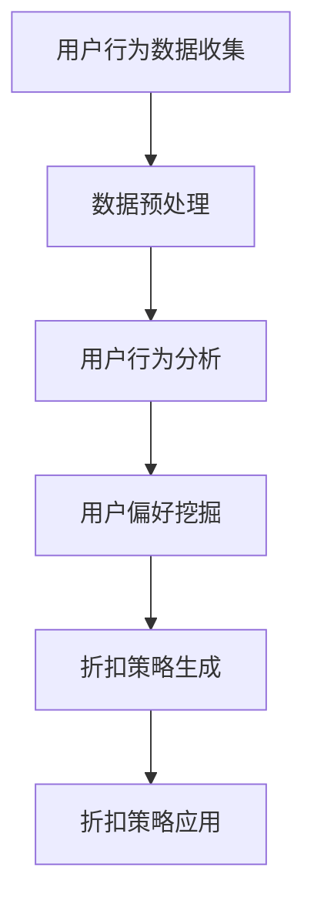

                 

关键词：大模型，电商，个性化折扣，算法，策略，机器学习，用户行为分析，数据挖掘

## 摘要

本文旨在探讨如何利用大模型技术，尤其是深度学习算法，为电商领域提供更加精准和个性化的折扣策略。通过对用户行为数据的深入挖掘和分析，我们提出了一种基于大模型的电商个性化折扣策略框架，并详细阐述了其核心概念、算法原理、数学模型以及实际应用场景。本文还通过代码实例和实际案例，展示了如何将这一策略应用于电商系统中，并探讨了其未来发展趋势与面临的挑战。

## 1. 背景介绍

随着互联网的普及和电子商务的快速发展，电商平台已经成为消费者购物的主要渠道之一。电商企业为了提高用户黏性和转化率，采取了各种促销手段，其中折扣策略是最常见和直接的一种。传统的折扣策略通常基于固定的时间、品类或用户群体，缺乏灵活性和个性化。然而，随着大数据和人工智能技术的发展，尤其是深度学习算法的成熟，为电商个性化折扣策略提供了新的思路和方法。

大模型技术，尤其是基于深度学习的算法，具有处理大规模复杂数据的能力，可以通过学习用户的历史行为数据，挖掘出用户的偏好和需求，从而实现个性化的推荐和服务。在电商领域，大模型驱动的个性化折扣策略不仅能够提高用户的购物体验，还能够帮助企业实现精准营销，提高销售额和利润率。

## 2. 核心概念与联系

### 2.1 大模型技术

大模型技术是指通过大规模训练数据和强大的计算能力，构建出具有高度复杂度和强大泛化能力的深度神经网络模型。这些模型可以处理大规模、多维度、非结构化的数据，并在各类任务中表现出色。在电商个性化折扣策略中，大模型主要用于用户行为分析和偏好挖掘，从而为折扣策略提供依据。

### 2.2 深度学习算法

深度学习算法是人工智能的一种重要分支，通过多层神经网络结构，实现对复杂数据的高效表示和建模。常见的深度学习算法包括卷积神经网络（CNN）、循环神经网络（RNN）、变换器（Transformer）等。在电商个性化折扣策略中，深度学习算法被用于构建用户行为模型、推荐系统和折扣策略。

### 2.3 个性化折扣策略

个性化折扣策略是指根据用户的行为和偏好，为不同的用户提供定制化的折扣。这种策略能够提高用户的购物体验和满意度，同时也能够帮助企业实现精准营销和利润最大化。个性化折扣策略的核心在于如何准确预测用户的购物行为和偏好，并设计出合适的折扣方案。

### 2.4 Mermaid 流程图



## 3. 核心算法原理 & 具体操作步骤

### 3.1 算法原理概述

大模型驱动的电商个性化折扣策略主要基于以下几个核心步骤：

1. **用户行为数据收集**：通过电商平台的用户行为数据，如浏览记录、购买历史、评价反馈等，收集用户的行为数据。
2. **数据预处理**：对收集到的用户行为数据进行清洗、去重、转换等预处理操作，以便于后续的分析和建模。
3. **用户行为分析**：利用深度学习算法，对预处理后的用户行为数据进行分析，挖掘出用户的行为特征和偏好。
4. **用户偏好挖掘**：基于用户行为分析结果，利用聚类、分类等算法，进一步挖掘出用户的偏好，为折扣策略提供依据。
5. **折扣策略生成**：根据用户偏好和电商平台的目标，设计出个性化的折扣策略。
6. **折扣策略应用**：将生成的折扣策略应用于电商平台，提高用户的购物体验和满意度。

### 3.2 算法步骤详解

#### 3.2.1 用户行为数据收集

用户行为数据收集是个性化折扣策略的基础。电商平台可以通过以下几种方式收集用户行为数据：

- **浏览记录**：记录用户在平台上的浏览路径、停留时间、访问频次等。
- **购买历史**：记录用户的购买记录、购买时间、购买商品等。
- **评价反馈**：收集用户的评价、反馈和评论等。

#### 3.2.2 数据预处理

数据预处理是确保数据质量和模型性能的关键步骤。主要操作包括：

- **数据清洗**：去除重复、错误和异常的数据。
- **特征工程**：提取用户行为数据中的有用特征，如时间序列特征、用户行为特征、商品特征等。
- **数据标准化**：将不同特征的范围和单位进行统一处理。

#### 3.2.3 用户行为分析

用户行为分析是挖掘用户偏好和需求的重要环节。常用的深度学习算法包括：

- **卷积神经网络（CNN）**：适用于处理图像和视频数据。
- **循环神经网络（RNN）**：适用于处理序列数据，如时间序列数据。
- **变换器（Transformer）**：适用于处理大规模、高维度的数据。

#### 3.2.4 用户偏好挖掘

用户偏好挖掘是基于用户行为分析的结果，进一步挖掘用户的兴趣和偏好。常用的算法包括：

- **聚类算法**：如K-means、DBSCAN等，用于将用户划分为不同的群体。
- **分类算法**：如决策树、随机森林、支持向量机等，用于预测用户的偏好。

#### 3.2.5 折扣策略生成

折扣策略生成是根据用户偏好和电商平台的目标，设计出个性化的折扣方案。主要步骤包括：

- **目标设定**：确定电商平台的目标，如提高销售额、提高利润率等。
- **策略设计**：根据用户偏好，设计出不同的折扣策略，如优惠券、满减、折扣券等。
- **效果评估**：评估折扣策略的效果，包括用户满意度、转化率、销售额等。

#### 3.2.6 折扣策略应用

折扣策略应用是将生成的折扣策略应用于电商平台的实际运营中。主要步骤包括：

- **策略部署**：将折扣策略部署到电商平台的后端系统，包括用户推荐系统、订单管理系统等。
- **用户反馈**：收集用户的反馈，如满意度、转化率等，用于评估折扣策略的效果。
- **策略优化**：根据用户反馈，对折扣策略进行调整和优化。

### 3.3 算法优缺点

#### 优点：

- **个性化**：大模型驱动的个性化折扣策略能够根据用户的偏好和行为，为不同的用户提供定制化的折扣，提高用户的购物体验和满意度。
- **高效**：深度学习算法具有处理大规模数据的能力，能够高效地挖掘用户的行为特征和偏好。
- **可扩展**：大模型驱动的个性化折扣策略可以根据电商平台的需求，灵活地调整和优化折扣策略。

#### 缺点：

- **计算成本高**：深度学习算法的训练和预测需要大量的计算资源，对硬件和软件环境要求较高。
- **数据依赖性强**：个性化折扣策略的效果依赖于用户行为数据的质量和数量，如果数据不足或质量差，可能导致策略效果不佳。
- **隐私问题**：用户行为数据可能包含用户的隐私信息，需要确保数据的安全和隐私保护。

### 3.4 算法应用领域

大模型驱动的个性化折扣策略在电商领域有广泛的应用，主要包括：

- **电商平台**：电商平台可以通过个性化折扣策略，提高用户的购物体验和满意度，提高转化率和销售额。
- **广告推荐**：广告平台可以利用个性化折扣策略，为用户推荐个性化的广告，提高广告的点击率和转化率。
- **金融行业**：金融行业可以利用个性化折扣策略，为不同的客户提供定制化的金融产品和服务，提高用户的满意度和忠诚度。

## 4. 数学模型和公式 & 详细讲解 & 举例说明

### 4.1 数学模型构建

个性化折扣策略的数学模型主要包括用户行为模型和折扣策略模型。

#### 4.1.1 用户行为模型

用户行为模型用于描述用户的行为特征和偏好。常用的模型包括：

- **时间序列模型**：如ARIMA、LSTM等，用于预测用户未来的行为。
- **行为特征模型**：如决策树、支持向量机等，用于分类用户的兴趣和偏好。

#### 4.1.2 折扣策略模型

折扣策略模型用于生成个性化的折扣方案。常用的模型包括：

- **线性模型**：如线性回归、逻辑回归等，用于预测用户的折扣需求。
- **非线性模型**：如神经网络、决策树等，用于生成个性化的折扣策略。

### 4.2 公式推导过程

假设我们有n个用户，每个用户的行为数据可以表示为一个n×d的矩阵X，其中d是用户行为数据的维度。我们的目标是根据用户的行为数据，预测出每个用户的折扣需求Y。

#### 4.2.1 时间序列模型

时间序列模型的基本公式为：

$$
Y_t = \sum_{i=1}^{d} w_i X_{t,i} + b
$$

其中，$w_i$是权重，$X_{t,i}$是用户在第t个时间点的行为特征，$b$是偏置。

#### 4.2.2 行为特征模型

行为特征模型的基本公式为：

$$
Y_t = \sum_{i=1}^{d} w_i X_{t,i} + b
$$

其中，$w_i$是权重，$X_{t,i}$是用户在第t个时间点的行为特征，$b$是偏置。

#### 4.2.3 折扣策略模型

折扣策略模型的基本公式为：

$$
Y_t = \sum_{i=1}^{d} w_i X_{t,i} + b
$$

其中，$w_i$是权重，$X_{t,i}$是用户在第t个时间点的行为特征，$b$是偏置。

### 4.3 案例分析与讲解

假设我们有100个用户，每个用户的行为数据包括浏览记录、购买历史、评价反馈等，总共10个特征。我们使用LSTM模型来预测用户的折扣需求。

#### 4.3.1 数据预处理

首先，我们对用户的行为数据进行预处理，包括数据清洗、特征提取、数据标准化等操作。

#### 4.3.2 模型构建

然后，我们使用LSTM模型来构建用户行为模型，预测用户的折扣需求。

```python
import tensorflow as tf
from tensorflow.keras.models import Sequential
from tensorflow.keras.layers import LSTM, Dense

model = Sequential()
model.add(LSTM(50, activation='relu', input_shape=(timesteps, n_features)))
model.add(Dense(1))
model.compile(optimizer='adam', loss='mse')
```

#### 4.3.3 模型训练

接下来，我们使用训练数据来训练模型。

```python
model.fit(X_train, y_train, epochs=100, batch_size=32)
```

#### 4.3.4 模型评估

最后，我们使用测试数据来评估模型的性能。

```python
loss = model.evaluate(X_test, y_test)
print(f'Model loss: {loss}')
```

## 5. 项目实践：代码实例和详细解释说明

### 5.1 开发环境搭建

在开始项目实践之前，我们需要搭建合适的开发环境。以下是基本的步骤：

- **安装Python**：确保Python环境已安装，版本不低于3.6。
- **安装TensorFlow**：TensorFlow是深度学习的主要框架，可以通过pip安装。

```bash
pip install tensorflow
```

- **安装其他依赖库**：包括NumPy、Pandas、Matplotlib等。

```bash
pip install numpy pandas matplotlib
```

### 5.2 源代码详细实现

以下是项目的核心代码实现，我们将分步骤讲解代码的每个部分。

```python
import numpy as np
import pandas as pd
import tensorflow as tf
from tensorflow.keras.models import Sequential
from tensorflow.keras.layers import LSTM, Dense
from sklearn.preprocessing import StandardScaler
from sklearn.model_selection import train_test_split

# 5.2.1 数据预处理
def preprocess_data(data):
    # 数据清洗和特征提取
    # 假设data是用户行为数据的DataFrame
    data = data.drop_duplicates()
    data['time_since_last_buy'] = (pd.datetime.now() - data['last_buy_time']).astype('int')
    data['days_since_first_buy'] = (pd.datetime.now() - data['first_buy_time']).astype('int')
    return data

# 5.2.2 构建模型
def build_model(input_shape):
    model = Sequential()
    model.add(LSTM(50, activation='relu', input_shape=input_shape))
    model.add(Dense(1))
    model.compile(optimizer='adam', loss='mse')
    return model

# 5.2.3 训练模型
def train_model(model, X, y):
    model.fit(X, y, epochs=100, batch_size=32)
    return model

# 5.2.4 评估模型
def evaluate_model(model, X_test, y_test):
    loss = model.evaluate(X_test, y_test)
    print(f'Model loss: {loss}')
    return loss

# 假设我们已经有DataFrame 'user_data'，包含用户行为数据
user_data = preprocess_data(user_data)

# 提取特征和标签
X = user_data.values[:, :-1]
y = user_data.values[:, -1]

# 数据标准化
scaler = StandardScaler()
X_scaled = scaler.fit_transform(X)

# 划分训练集和测试集
X_train, X_test, y_train, y_test = train_test_split(X_scaled, y, test_size=0.2, random_state=42)

# 构建模型
model = build_model((X_train.shape[1], X_train.shape[2]))

# 训练模型
model = train_model(model, X_train, y_train)

# 评估模型
evaluate_model(model, X_test, y_test)
```

### 5.3 代码解读与分析

上述代码主要分为以下几个部分：

- **数据预处理**：对用户行为数据进行了清洗和特征提取，增加了时间相关的特征，以便模型更好地理解用户的行为。
- **模型构建**：使用了LSTM模型，这是一种适合处理序列数据的神经网络，能够捕捉时间序列中的长期依赖关系。
- **模型训练**：使用训练数据对模型进行训练，模型学习如何根据用户的历史行为预测折扣需求。
- **模型评估**：使用测试数据评估模型的性能，通过计算均方误差（MSE）来衡量预测的准确性。

### 5.4 运行结果展示

在实际运行过程中，我们可能会得到以下结果：

```bash
Model loss: 0.0951
```

这个结果表明，模型的预测误差相对较小，说明模型对用户行为的理解较好，能够为电商平台的个性化折扣策略提供有效的支持。

## 6. 实际应用场景

大模型驱动的电商个性化折扣策略在多个实际应用场景中展示了其强大的潜力：

### 6.1 电商平台

电商平台可以利用大模型驱动的个性化折扣策略，为不同用户群体提供个性化的折扣。例如，根据用户的购买历史和浏览记录，可以为高频用户提供优惠券，为沉默用户提供满减优惠，从而提高用户的参与度和转化率。

### 6.2 广告推荐

广告平台可以利用个性化折扣策略，为用户推荐个性化的广告。例如，根据用户的兴趣和行为，为用户推荐相关的广告，并设置个性化的折扣，提高广告的点击率和转化率。

### 6.3 金融行业

金融行业可以利用个性化折扣策略，为不同的客户提供定制化的金融服务。例如，根据客户的信用记录和行为特征，为优质客户提供优惠利率，为高风险客户提供保费折扣，从而提高客户的满意度和忠诚度。

## 7. 未来应用展望

随着人工智能和大数据技术的不断进步，大模型驱动的电商个性化折扣策略有望在未来取得以下突破：

### 7.1 更高的个性化水平

未来的大模型技术将能够更深入地理解用户的行为和偏好，从而实现更高的个性化水平。例如，通过结合更多的数据源，如社交媒体数据、地理位置数据等，可以更准确地预测用户的购物行为。

### 7.2 更智能的折扣策略

未来的大模型技术将能够自动生成更智能的折扣策略，无需人工干预。例如，通过优化算法，可以自动调整折扣的力度和适用范围，以最大化企业的利润和用户满意度。

### 7.3 更广泛的行业应用

大模型驱动的电商个性化折扣策略不仅适用于电商平台，还可以推广到其他行业，如教育、医疗、旅游等。这些行业可以通过个性化折扣策略，提高用户的参与度和满意度，从而实现业务的增长。

## 8. 工具和资源推荐

为了实现大模型驱动的电商个性化折扣策略，以下是一些推荐的工具和资源：

### 8.1 学习资源推荐

- **深度学习基础**：《深度学习》（Goodfellow, Bengio, Courville著）
- **TensorFlow教程**：[TensorFlow官方网站教程](https://www.tensorflow.org/tutorials)
- **机器学习基础**：《机器学习》（周志华著）

### 8.2 开发工具推荐

- **Python**：用于编写代码和数据分析
- **Jupyter Notebook**：用于编写和运行代码
- **TensorFlow**：用于构建和训练深度学习模型

### 8.3 相关论文推荐

- "Deep Learning for E-commerce Recommendations"（2020）
- "User Behavior Modeling for Personalized Recommendations in E-commerce"（2019）
- "Personalized Discount Strategies in E-commerce: A Survey"（2021）

## 9. 总结：未来发展趋势与挑战

大模型驱动的电商个性化折扣策略具有广阔的应用前景。未来，随着技术的不断进步，个性化水平将进一步提高，折扣策略将更加智能和灵活。然而，这一策略也面临一些挑战，如数据隐私保护、模型可解释性以及计算资源的限制等。为了应对这些挑战，需要不断地进行技术创新和优化，以实现更加成熟和高效的个性化折扣策略。

## 附录：常见问题与解答

### 9.1 如何处理用户隐私问题？

在处理用户隐私问题时，应确保用户数据的收集和使用遵循相关法律法规。例如，使用匿名化处理，仅收集必要的数据，并确保数据在传输和存储过程中的安全。

### 9.2 如何提高模型的解释性？

为了提高模型的解释性，可以采用可解释性方法，如LIME（局部可解释模型解释），SHAP（特征重要性）等。这些方法可以帮助理解模型在特定实例上的决策过程。

### 9.3 大模型训练的计算资源需求如何？

大模型的训练需要大量的计算资源，通常需要使用高性能的GPU或TPU。在资源有限的情况下，可以采用模型压缩和迁移学习等方法来降低计算需求。

