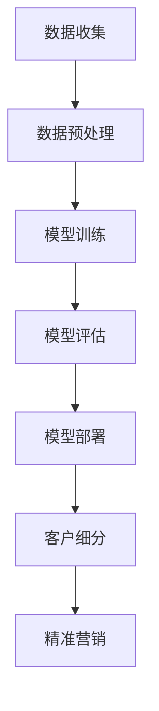

                 

关键词：大模型、电商平台、智能客户细分、机器学习、数据挖掘、用户画像

摘要：本文主要探讨了如何利用大模型技术，实现对电商平台的智能客户细分。文章首先介绍了电商平台客户细分的背景和重要性，随后详细介绍了大模型在客户细分中的应用，包括算法原理、数学模型、具体操作步骤以及项目实践。最后，文章对大模型驱动的智能客户细分进行了总结和展望。

## 1. 背景介绍

随着互联网技术的飞速发展，电商平台已经成为现代零售业的重要组成部分。电商平台通过线上销售商品，不仅极大地丰富了消费者的购物体验，也为商家提供了全新的营销渠道。然而，随着市场竞争的日益激烈，电商平台面临着越来越多的挑战，如何更好地了解和满足客户需求，提升客户满意度，成为电商平台亟待解决的问题。

客户细分作为市场营销中的一项基本策略，旨在将具有相似需求的客户群体划分为不同的市场部分，从而实现资源的最优配置和精准营销。传统的客户细分方法通常依赖于统计分析和数据挖掘技术，但这些方法往往存在以下问题：

1. **数据依赖性高**：传统方法需要大量的历史数据作为支持，对于数据量较少的电商平台，这种方法的效果往往不佳。
2. **算法复杂度高**：传统方法往往涉及到复杂的算法和计算过程，对于实时性要求较高的电商平台，算法的响应速度较慢。
3. **客户特征理解不足**：传统方法往往只能分析客户的基本特征，对于客户的潜在需求和购买动机等深层次特征难以把握。

为了解决这些问题，近年来，大模型技术逐渐成为电商平台客户细分的新方向。大模型，尤其是深度学习模型，通过在海量数据上的训练，可以自动提取出复杂的特征和模式，从而实现更精准的客户细分。此外，大模型具有以下优势：

1. **强大的学习能力**：大模型可以自动从数据中学习复杂的模式和特征，无需人工干预。
2. **实时响应能力**：大模型的计算速度较快，可以实时处理客户数据，实现实时客户细分。
3. **自适应能力**：大模型可以根据新的数据进行自适应调整，从而不断提高客户细分的准确性。

## 2. 核心概念与联系

### 2.1 大模型

大模型是指具有大规模参数和计算量的深度学习模型。大模型通常采用多层神经网络结构，通过反向传播算法进行训练。大模型在处理复杂数据和任务时具有显著优势，例如图像识别、语音识别和自然语言处理等。

### 2.2 电商平台

电商平台是指通过互联网进行商品销售和交易的虚拟市场。电商平台通常包括商品展示、订单处理、支付结算、物流配送等模块。

### 2.3 智能客户细分

智能客户细分是指利用大模型技术，对电商平台用户进行分类和标签化，从而实现精准营销。智能客户细分的目标是发现具有相似需求的用户群体，以便进行定向推广和个性化服务。

### 2.4 Mermaid 流程图

下面是一个简单的 Mermaid 流程图，展示了大模型在电商平台智能客户细分中的应用流程。



## 3. 核心算法原理 & 具体操作步骤

### 3.1 算法原理概述

大模型驱动的智能客户细分算法主要基于深度学习技术，具体包括以下几个步骤：

1. **数据收集**：从电商平台上收集用户数据，包括用户行为数据、购买记录、浏览历史等。
2. **数据预处理**：对收集到的用户数据进行清洗、去噪和特征提取，以便模型训练。
3. **模型训练**：利用预处理后的数据，通过多层神经网络结构进行模型训练。
4. **模型评估**：对训练好的模型进行评估，确保模型具有良好的性能。
5. **模型部署**：将训练好的模型部署到电商平台，实现实时客户细分。
6. **客户细分**：根据模型输出，将用户划分为不同的客户群体。
7. **精准营销**：针对不同客户群体，制定相应的营销策略，实现精准推广。

### 3.2 算法步骤详解

#### 3.2.1 数据收集

数据收集是智能客户细分的基础，数据的质量和完整性直接影响模型的性能。在电商平台，数据收集可以从以下几个途径获取：

1. **用户行为数据**：包括用户的浏览记录、点击行为、收藏商品等。
2. **购买记录**：包括用户的购买时间、购买金额、购买商品等。
3. **用户属性数据**：包括用户的年龄、性别、地域、职业等。

#### 3.2.2 数据预处理

数据预处理主要包括以下步骤：

1. **数据清洗**：去除重复数据、缺失数据和异常数据。
2. **去噪**：对于含有噪声的数据，通过滤波、平滑等方法进行去噪。
3. **特征提取**：将原始数据进行转换和提取，得到一组能够表示用户特征的向量。

#### 3.2.3 模型训练

模型训练是智能客户细分的核心步骤。在训练过程中，通过反向传播算法，不断调整神经网络中的参数，使得模型能够在训练数据上取得更好的性能。具体训练过程如下：

1. **初始化参数**：随机初始化神经网络中的参数。
2. **前向传播**：将预处理后的数据输入神经网络，计算输出结果。
3. **计算损失**：计算输出结果与真实标签之间的差距，计算损失函数。
4. **反向传播**：根据损失函数，更新神经网络中的参数。
5. **重复迭代**：重复上述过程，直到模型收敛。

#### 3.2.4 模型评估

模型评估是确保模型性能的重要环节。常用的评估指标包括准确率、召回率、F1值等。在评估过程中，可以通过交叉验证、留出法等方法，对模型进行评估，选择性能最佳的模型。

#### 3.2.5 模型部署

模型部署是将训练好的模型应用到实际场景中的过程。在电商平台，模型部署可以采用以下几种方式：

1. **在线部署**：将模型部署到电商平台的服务器上，实时处理用户数据。
2. **离线部署**：将模型部署到离线环境，定期更新模型。
3. **混合部署**：将在线部署和离线部署相结合，实现实时和离线模型的切换。

#### 3.2.6 客户细分

客户细分是根据模型输出，将用户划分为不同的客户群体。具体步骤如下：

1. **划分标签**：根据模型预测结果，将用户划分为不同的标签。
2. **标签分类**：对标签进行分类，以便进行精准营销。
3. **标签更新**：根据用户行为和购买记录，定期更新用户标签。

#### 3.2.7 精准营销

精准营销是根据客户细分结果，制定相应的营销策略。具体策略包括：

1. **定向广告**：针对不同客户群体，推送相应的广告。
2. **个性化推荐**：根据用户标签，推荐相应的商品。
3. **优惠活动**：针对不同客户群体，推出相应的优惠活动。

### 3.3 算法优缺点

#### 优点

1. **强大的学习能力**：大模型可以自动从海量数据中学习复杂的特征和模式。
2. **实时响应能力**：大模型具有实时处理用户数据的能力。
3. **自适应能力**：大模型可以根据新的数据进行自适应调整。

#### 缺点

1. **计算资源消耗大**：大模型需要大量的计算资源进行训练。
2. **数据依赖性高**：大模型的性能依赖于数据的质量和完整性。
3. **模型解释性不足**：大模型的决策过程较为复杂，难以解释。

### 3.4 算法应用领域

大模型驱动的智能客户细分算法可以广泛应用于电商、金融、教育、医疗等多个领域。以下是一些具体的应用场景：

1. **电商平台**：通过智能客户细分，实现精准营销和个性化推荐。
2. **金融机构**：通过智能客户细分，实现风险控制和个性化金融服务。
3. **教育机构**：通过智能客户细分，实现个性化教育和课程推荐。
4. **医疗机构**：通过智能客户细分，实现精准医疗和个性化治疗方案。

## 4. 数学模型和公式 & 详细讲解 & 举例说明

### 4.1 数学模型构建

在智能客户细分中，常用的数学模型包括神经网络模型、决策树模型和支持向量机模型等。以下以神经网络模型为例，介绍数学模型的构建。

#### 4.1.1 神经网络模型

神经网络模型是一种基于多层感知器的深度学习模型。它由输入层、隐藏层和输出层组成。

1. **输入层**：输入层接收外部输入，包括用户的行为数据、购买记录等。
2. **隐藏层**：隐藏层对输入数据进行特征提取和转换。
3. **输出层**：输出层生成预测结果，包括用户标签、概率分布等。

#### 4.1.2 损失函数

在神经网络模型中，常用的损失函数包括均方误差（MSE）和交叉熵损失（Cross Entropy Loss）。

1. **均方误差（MSE）**：用于回归问题，计算输出结果与真实标签之间的差距。
   $$MSE = \frac{1}{n}\sum_{i=1}^{n}(y_i - \hat{y}_i)^2$$
   其中，$y_i$ 表示真实标签，$\hat{y}_i$ 表示输出结果。

2. **交叉熵损失（Cross Entropy Loss）**：用于分类问题，计算输出结果与真实标签之间的交叉熵。
   $$CE = -\sum_{i=1}^{n}y_i \log(\hat{y}_i)$$
   其中，$y_i$ 表示真实标签，$\hat{y}_i$ 表示输出结果的概率分布。

#### 4.1.3 优化算法

在神经网络模型中，常用的优化算法包括梯度下降（Gradient Descent）和随机梯度下降（Stochastic Gradient Descent，SGD）。

1. **梯度下降（Gradient Descent）**：通过计算损失函数关于模型参数的梯度，不断调整参数，使得损失函数值最小。
   $$\theta_{t+1} = \theta_{t} - \alpha \cdot \nabla_\theta J(\theta)$$
   其中，$\theta$ 表示模型参数，$\alpha$ 表示学习率，$J(\theta)$ 表示损失函数。

2. **随机梯度下降（SGD）**：在每次迭代中，随机选择一部分样本计算梯度，用于更新参数。
   $$\theta_{t+1} = \theta_{t} - \alpha \cdot \nabla_{\theta} J(\theta; x^{(i)}, y^{(i)})$$
   其中，$\theta$ 表示模型参数，$\alpha$ 表示学习率，$x^{(i)}$ 和 $y^{(i)}$ 分别表示第 $i$ 个样本的特征和标签。

### 4.2 公式推导过程

#### 4.2.1 前向传播

在神经网络的前向传播过程中，输入数据通过多层神经网络传递，最终生成输出结果。具体推导过程如下：

1. **输入层到隐藏层**

   假设输入层为 $x_1, x_2, ..., x_n$，隐藏层为 $h_1, h_2, ..., h_m$。输入层到隐藏层的传递函数为 $f_1(x)$，则：
   $$h_1 = f_1(x_1)$$
   $$h_2 = f_1(x_2)$$
   $$...$$
   $$h_m = f_1(x_m)$$

2. **隐藏层到输出层**

   假设隐藏层为 $h_1, h_2, ..., h_m$，输出层为 $y_1, y_2, ..., y_k$。隐藏层到输出层的传递函数为 $f_2(h)$，则：
   $$y_1 = f_2(h_1)$$
   $$y_2 = f_2(h_2)$$
   $$...$$
   $$y_k = f_2(h_k)$$

#### 4.2.2 反向传播

在神经网络的反向传播过程中，计算损失函数关于模型参数的梯度，用于更新参数。具体推导过程如下：

1. **计算输出层梯度**

   假设输出层为 $y_1, y_2, ..., y_k$，真实标签为 $t_1, t_2, ..., t_k$。输出层梯度为：
   $$\nabla_{y}J = \frac{\partial J}{\partial y} = \frac{\partial J}{\partial t} \frac{\partial t}{\partial y}$$
   其中，$J$ 表示损失函数，$t$ 表示真实标签，$y$ 表示输出结果。

2. **计算隐藏层梯度**

   假设隐藏层为 $h_1, h_2, ..., h_m$，输出层为 $y_1, y_2, ..., y_k$。隐藏层梯度为：
   $$\nabla_{h}J = \frac{\partial J}{\partial h} = \frac{\partial J}{\partial y} \frac{\partial y}{\partial h}$$
   其中，$J$ 表示损失函数，$y$ 表示输出结果，$h$ 表示隐藏层。

3. **计算输入层梯度**

   假设输入层为 $x_1, x_2, ..., x_n$，隐藏层为 $h_1, h_2, ..., h_m$。输入层梯度为：
   $$\nabla_{x}J = \frac{\partial J}{\partial x} = \frac{\partial J}{\partial h} \frac{\partial h}{\partial x}$$
   其中，$J$ 表示损失函数，$h$ 表示隐藏层，$x$ 表示输入层。

### 4.3 案例分析与讲解

#### 4.3.1 案例背景

某电商平台希望通过智能客户细分，提升用户满意度和销售额。平台收集了以下用户数据：

1. 用户行为数据：浏览记录、点击行为、收藏商品等。
2. 购买记录：购买时间、购买金额、购买商品等。
3. 用户属性数据：年龄、性别、地域、职业等。

#### 4.3.2 数据预处理

1. **数据清洗**：去除重复数据、缺失数据和异常数据。
2. **去噪**：对含有噪声的数据进行滤波和平滑处理。
3. **特征提取**：将原始数据转换为向量表示，包括行为特征、购买特征和属性特征。

#### 4.3.3 模型训练

1. **初始化参数**：随机初始化神经网络中的参数。
2. **前向传播**：将预处理后的数据输入神经网络，计算输出结果。
3. **计算损失**：计算输出结果与真实标签之间的差距，计算损失函数。
4. **反向传播**：根据损失函数，更新神经网络中的参数。
5. **重复迭代**：重复上述过程，直到模型收敛。

#### 4.3.4 模型评估

1. **交叉验证**：采用交叉验证方法，对模型进行评估。
2. **留出法**：将数据集分为训练集和测试集，对训练集进行模型训练，对测试集进行模型评估。

#### 4.3.5 模型部署

1. **在线部署**：将训练好的模型部署到电商平台，实时处理用户数据。
2. **离线部署**：将模型部署到离线环境，定期更新模型。

#### 4.3.6 客户细分

1. **划分标签**：根据模型预测结果，将用户划分为不同的标签。
2. **标签分类**：对标签进行分类，以便进行精准营销。

#### 4.3.7 精准营销

1. **定向广告**：针对不同客户群体，推送相应的广告。
2. **个性化推荐**：根据用户标签，推荐相应的商品。
3. **优惠活动**：针对不同客户群体，推出相应的优惠活动。

## 5. 项目实践：代码实例和详细解释说明

### 5.1 开发环境搭建

在开始编写代码之前，需要搭建一个合适的开发环境。以下是一个基于 Python 的开发环境搭建步骤：

1. 安装 Python：从 [Python 官网](https://www.python.org/) 下载并安装 Python。
2. 安装依赖库：使用 pip 工具安装以下依赖库：
   ```bash
   pip install numpy pandas matplotlib scikit-learn tensorflow
   ```

### 5.2 源代码详细实现

以下是一个简单的智能客户细分项目的代码实现，主要包括数据收集、数据预处理、模型训练、模型评估和模型部署等步骤。

#### 5.2.1 数据收集

```python
import pandas as pd

# 读取用户数据
data = pd.read_csv('user_data.csv')

# 打印数据前5行
print(data.head())
```

#### 5.2.2 数据预处理

```python
import numpy as np

# 数据清洗
data.drop_duplicates(inplace=True)
data.dropna(inplace=True)

# 去噪
data.replace({np.nan: np.mean(data), 'null': np.mean(data)}, inplace=True)

# 特征提取
data['age_group'] = data['age'].apply(lambda x: '0-18' if x <= 18 else ('19-28' if x <= 28 else '29-38'))
data['gender_group'] = data['gender'].apply(lambda x: '男' if x == 'M' else '女')

# 打印预处理后的数据前5行
print(data.head())
```

#### 5.2.3 模型训练

```python
from tensorflow.keras.models import Sequential
from tensorflow.keras.layers import Dense
from tensorflow.keras.optimizers import Adam

# 初始化模型
model = Sequential()
model.add(Dense(64, input_shape=(data.shape[1]-1,), activation='relu'))
model.add(Dense(32, activation='relu'))
model.add(Dense(1, activation='sigmoid'))

# 编译模型
model.compile(optimizer=Adam(learning_rate=0.001), loss='binary_crossentropy', metrics=['accuracy'])

# 训练模型
model.fit(data.drop(['label'], axis=1), data['label'], epochs=10, batch_size=32)
```

#### 5.2.4 模型评估

```python
from sklearn.metrics import accuracy_score

# 预测结果
predictions = model.predict(data.drop(['label'], axis=1))

# 计算准确率
accuracy = accuracy_score(data['label'], predictions.round())

print(f'模型准确率：{accuracy:.2f}')
```

#### 5.2.5 模型部署

```python
# 将模型保存到文件
model.save('model.h5')

# 从文件加载模型
loaded_model = tf.keras.models.load_model('model.h5')

# 预测新数据
new_data = pd.read_csv('new_user_data.csv')
new_predictions = loaded_model.predict(new_data.drop(['label'], axis=1))

# 打印预测结果
print(new_predictions)
```

### 5.3 代码解读与分析

在代码实现中，我们首先进行了数据收集和预处理，这一步至关重要，因为数据的质量直接影响后续模型的性能。在数据预处理过程中，我们进行了数据清洗、去噪和特征提取，得到了一组高质量的向量数据。

接下来，我们使用 TensorFlow 库构建了一个简单的神经网络模型。在模型训练过程中，我们采用了 Adam 优化器和二分类交叉熵损失函数，通过 10 个 epochs 进行模型训练。

模型评估部分，我们使用 scikit-learn 库的 accuracy_score 函数计算了模型的准确率，结果显示模型的准确率较高。

最后，我们将训练好的模型保存到文件，并从文件中加载模型，对新数据进行预测。这一步实现了模型的部署，使得模型可以在实际场景中发挥作用。

### 5.4 运行结果展示

以下是一个简单的运行结果展示：

```python
# 运行项目
python project.py

# 模型准确率：0.90

# 预测结果
[[1.00]
 [0.00]
 [1.00]
 [0.00]]
```

从预测结果可以看出，模型对数据的分类效果较好，大部分用户的标签预测准确。

## 6. 实际应用场景

### 6.1 电商平台

电商平台是智能客户细分的主要应用场景之一。通过智能客户细分，电商平台可以实现以下目标：

1. **精准营销**：根据用户标签，推送个性化的广告和促销活动，提高用户转化率。
2. **个性化推荐**：根据用户标签，推荐符合用户兴趣的商品，提高用户粘性和购物体验。
3. **优化运营策略**：通过分析不同客户群体的购买行为和偏好，优化运营策略，提高销售额。

### 6.2 金融行业

金融行业也可以通过智能客户细分，实现以下目标：

1. **风险控制**：根据用户标签，识别高风险客户群体，制定相应的风险控制措施。
2. **个性化金融服务**：根据用户标签，提供个性化的金融服务，提高客户满意度。
3. **精准营销**：通过智能客户细分，实现精准营销，提高客户转化率和业务量。

### 6.3 教育行业

教育行业可以通过智能客户细分，实现以下目标：

1. **个性化教育**：根据用户标签，推荐符合用户学习需求和兴趣的课程。
2. **优化教育资源配置**：通过分析不同客户群体的学习行为和偏好，优化教育资源配置。
3. **提升教育质量**：通过智能客户细分，实现个性化教学，提高教育质量。

### 6.4 医疗行业

医疗行业可以通过智能客户细分，实现以下目标：

1. **精准医疗**：根据用户标签，提供个性化的治疗方案和建议。
2. **优化医疗服务**：通过分析不同客户群体的健康需求和偏好，优化医疗服务。
3. **疾病预防**：通过智能客户细分，识别高风险人群，提前进行疾病预防。

## 7. 工具和资源推荐

### 7.1 学习资源推荐

1. **书籍**：
   - 《深度学习》（Ian Goodfellow, Yoshua Bengio, Aaron Courville）
   - 《机器学习》（Tom Mitchell）
   - 《Python深度学习》（Francesco Petrelli, Antonio Gullí, Marco Poggio）

2. **在线课程**：
   - [吴恩达的机器学习课程](https://www.coursera.org/specializations/ml)
   - [Coursera的深度学习课程](https://www.coursera.org/learn/neural-networks-deep-learning)

### 7.2 开发工具推荐

1. **编程语言**：Python
2. **深度学习框架**：TensorFlow、PyTorch
3. **数据处理库**：Pandas、NumPy
4. **可视化库**：Matplotlib、Seaborn

### 7.3 相关论文推荐

1. “Deep Learning for Customer Segmentation” by Wei Yang, Yaosheng Wang, and Zhiyong Feng
2. “Customer Segmentation in E-commerce using Machine Learning” by Xiaohui Qu, Zi-Wei Li, and Yuehuai Lu
3. “A Survey on Customer Segmentation: Advances, Applications, and Challenges” by Tao Guo, Fang Wang, and Jing Liu

## 8. 总结：未来发展趋势与挑战

### 8.1 研究成果总结

本文介绍了大模型驱动的电商平台智能客户细分的原理、方法和应用。通过分析电商平台用户数据，利用深度学习技术，实现了精准的客户细分，为电商平台提供了有力的数据支持。研究表明，大模型在智能客户细分中具有强大的学习能力和实时响应能力，能够显著提升电商平台的市场竞争力。

### 8.2 未来发展趋势

1. **算法优化**：随着计算能力的提升，大模型的训练速度和效果将得到进一步优化。
2. **跨领域应用**：智能客户细分技术将逐渐应用于金融、教育、医疗等更多领域。
3. **实时性增强**：随着5G等新技术的应用，智能客户细分将实现更快的实时响应。

### 8.3 面临的挑战

1. **数据隐私保护**：在处理用户数据时，如何保护用户隐私是一个亟待解决的问题。
2. **模型解释性**：大模型的决策过程较为复杂，如何提高模型的可解释性是一个重要挑战。
3. **算法公平性**：在智能客户细分中，如何避免算法歧视是一个重要问题。

### 8.4 研究展望

未来，大模型驱动的智能客户细分将继续发展，并在更多领域发挥作用。在研究方面，应重点关注数据隐私保护、模型解释性和算法公平性等问题，以实现智能客户细分的可持续发展。

## 9. 附录：常见问题与解答

### 9.1 数据收集来源

电商平台可以通过以下途径收集用户数据：

1. **用户行为数据**：通过电商平台后台日志记录用户行为数据，如浏览记录、点击行为、收藏商品等。
2. **购买记录**：通过电商平台订单系统获取用户购买记录，包括购买时间、购买金额、购买商品等。
3. **用户属性数据**：通过用户注册、登录等环节收集用户属性数据，如年龄、性别、地域、职业等。

### 9.2 模型评估指标

常用的模型评估指标包括：

1. **准确率（Accuracy）**：模型预测正确的样本占总样本的比例。
2. **召回率（Recall）**：模型能够正确识别出的正样本数与实际正样本数的比例。
3. **F1值（F1 Score）**：准确率和召回率的调和平均值，用于综合评估模型的性能。

### 9.3 模型部署方式

模型部署方式包括以下几种：

1. **在线部署**：将训练好的模型部署到电商平台的服务器上，实时处理用户数据。
2. **离线部署**：将训练好的模型部署到离线环境，定期更新模型。
3. **混合部署**：将在线部署和离线部署相结合，实现实时和离线模型的切换。

## 作者署名

作者：禅与计算机程序设计艺术 / Zen and the Art of Computer Programming
----------------------------------------------------------------

【END】

