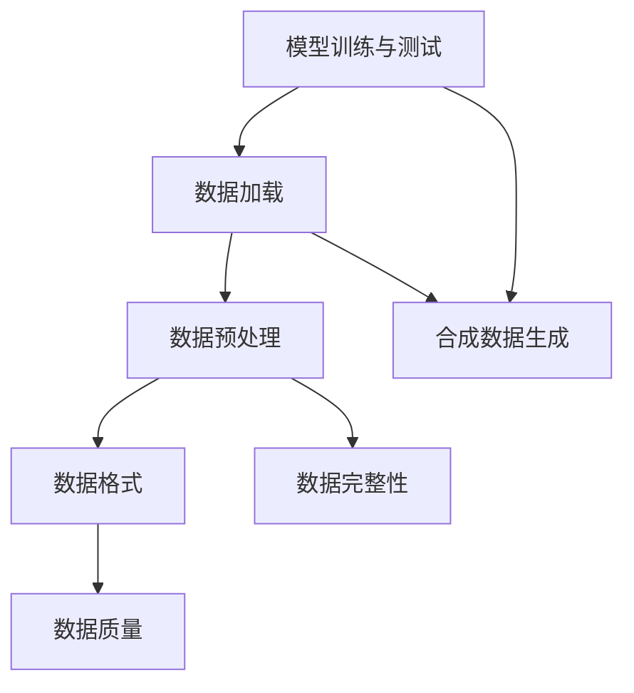

                 

关键词：大规模数据集，数据加载，合成数据，生成技术，数据处理效率，算法优化，应用场景

摘要：本文将探讨大规模数据集处理中两个关键环节：高效数据加载和合成数据生成技术。通过深入分析这些技术，本文旨在为读者提供一种系统性、结构化的理解和应用方法，从而提升数据处理效率和准确性。文章首先介绍了背景知识，然后详细讨论了核心概念、算法原理、数学模型、实践案例以及实际应用场景。此外，还对未来发展趋势和挑战进行了展望，并推荐了相关的学习资源和开发工具。

## 1. 背景介绍

随着互联网和物联网的迅猛发展，数据量呈指数级增长。大数据时代已经到来，处理海量数据成为了许多企业和研究机构的迫切需求。在大规模数据集处理中，数据加载和合成数据生成是两个至关重要的环节。数据加载直接影响数据处理的速度和效率，而合成数据生成则为模型训练提供了丰富的样本，保证了模型的泛化能力和准确性。

然而，大规模数据集处理面临着诸多挑战。首先，数据量的巨大导致传统数据处理方法难以应对。其次，数据多样性使得处理算法需要具备较强的适应性。最后，数据质量和数据完整性也是影响数据处理效果的关键因素。

为了解决这些问题，研究和开发高效的数据加载和合成数据生成技术变得尤为重要。这些技术的应用范围广泛，包括但不限于机器学习、自然语言处理、计算机视觉等领域。通过优化数据加载和生成过程，可以显著提高模型的训练效率和准确性，为实际应用提供强有力的支持。

## 2. 核心概念与联系

在深入讨论大规模数据集处理之前，我们需要了解一些核心概念，这些概念构成了我们分析的基础。

### 2.1 数据加载

数据加载是指将数据从原始存储位置（如数据库、文件系统等）转移到内存或缓存的过程。高效数据加载的目标是减少数据传输时间，提高数据读取速度。常见的数据加载方法包括批量加载、流式加载和索引加载等。

### 2.2 合成数据生成

合成数据生成是通过算法或模型生成与真实数据具有相似特征的数据集。这种技术主要用于模型训练和测试，以解决数据稀缺或数据隐私问题。常见的合成数据生成方法包括生成对抗网络（GAN）、变分自编码器（VAE）等。

### 2.3 数据预处理

数据预处理是数据加载和生成的前置步骤，包括数据清洗、数据转换和数据归一化等。数据预处理的质量直接影响后续处理的结果。

### 2.4 数据格式

数据格式是指数据存储和传输的格式，常见的有CSV、JSON、Parquet等。不同的数据格式对加载和生成的效率和效果有不同的影响。

### 2.5 数据质量

数据质量是指数据的有效性、准确性和一致性。高质量的数据可以减少后续处理的错误和偏差。

### 2.6 数据完整性

数据完整性是指数据是否完整，是否包含缺失值或错误值。数据完整性对模型的训练和测试至关重要。

为了更好地理解这些概念之间的关系，我们可以通过一个Mermaid流程图来展示它们之间的联系。



通过这个流程图，我们可以清晰地看到数据加载、预处理、格式、完整性和合成数据生成在数据处理过程中的相互关联。

## 3. 核心算法原理 & 具体操作步骤

### 3.1 算法原理概述

在大规模数据集处理中，核心算法的选择至关重要。以下是几种常见的算法及其原理：

### 3.1.1 数据加载算法

- **批量加载**：将大量数据一次性加载到内存中，适用于数据量较小且内存充足的情况。
- **流式加载**：分批次将数据加载到内存，适用于数据量巨大且需要实时处理的情况。
- **索引加载**：通过索引快速定位数据，适用于数据量巨大且需要快速访问特定数据的情况。

### 3.1.2 合成数据生成算法

- **生成对抗网络（GAN）**：通过生成器和判别器的对抗训练生成与真实数据相似的数据。
- **变分自编码器（VAE）**：通过编码和解码过程生成新的数据，保证生成数据的概率分布与训练数据一致。

### 3.2 算法步骤详解

### 3.2.1 数据加载算法步骤

1. **确定数据源**：选择数据存储位置和格式。
2. **建立连接**：通过数据库连接池或其他连接管理工具建立与数据源的连接。
3. **数据分批**：根据内存大小和数据量将数据分成多个批次。
4. **数据加载**：使用批量加载、流式加载或索引加载方法将数据加载到内存。
5. **数据缓存**：使用缓存技术加快数据访问速度。

### 3.2.2 合成数据生成算法步骤

1. **训练生成器和判别器**：使用真实数据训练生成器和判别器。
2. **生成数据**：通过生成器生成新的数据，并使用判别器评估生成数据的质量。
3. **数据调整**：根据生成数据的评估结果调整生成器的参数，优化生成数据的质量。
4. **数据输出**：将生成的数据输出到目标存储位置。

### 3.3 算法优缺点

#### 数据加载算法

- **批量加载**：优点是简单高效，缺点是内存占用大，不适合数据量巨大或内存不足的情况。
- **流式加载**：优点是实时性强，缺点是加载速度慢，适用于数据量巨大且需要实时处理的情况。
- **索引加载**：优点是快速访问特定数据，缺点是索引维护成本高。

#### 合成数据生成算法

- **GAN**：优点是生成数据质量高，缺点是训练时间较长，对计算资源要求高。
- **VAE**：优点是生成数据质量稳定，缺点是生成数据多样性较差。

### 3.4 算法应用领域

- **数据加载算法**：广泛应用于数据库、大数据处理平台和机器学习框架。
- **合成数据生成算法**：广泛应用于模型训练、数据增强和隐私保护等领域。

### 3.5 实践示例

#### 数据加载算法示例

```python
# 使用pandas进行批量加载
import pandas as pd

data = pd.read_csv('data.csv', chunksize=10000)
for chunk in data:
    # 数据处理
    print(chunk.shape)

# 使用dask进行流式加载
import dask.dataframe as dd

data = dd.read_csv('data.csv')
data.compute()
```

#### 合成数据生成算法示例

```python
# 使用GAN进行合成数据生成
import tensorflow as tf
from tensorflow import keras

# 构建生成器和判别器模型
generator = keras.Sequential([
    keras.layers.Dense(128, activation='relu', input_shape=(100,)),
    keras.layers.Dense(256, activation='relu'),
    keras.layers.Dense(512, activation='relu'),
    keras.layers.Dense(1, activation='sigmoid')
])

discriminator = keras.Sequential([
    keras.layers.Dense(128, activation='relu', input_shape=(100,)),
    keras.layers.Dense(256, activation='relu'),
    keras.layers.Dense(512, activation='relu'),
    keras.layers.Dense(1, activation='sigmoid')
])

# 编写训练代码
# ...
```

## 4. 数学模型和公式 & 详细讲解 & 举例说明

### 4.1 数学模型构建

在大规模数据集处理中，数学模型的构建至关重要。以下是几种常见的数学模型及其构建方法。

#### 4.1.1 数据加载模型

- **批量加载模型**：假设数据量为N，内存大小为M，每次批量大小为B，则加载次数为 N/B。
- **流式加载模型**：假设数据流速率为R，内存大小为M，每次处理数据量为P，则处理时间为 M/R/P。

#### 4.1.2 合成数据生成模型

- **生成对抗网络（GAN）模型**：假设生成器为 G，判别器为 D，损失函数为 L，则训练目标为最小化 L(G, D)。
- **变分自编码器（VAE）模型**：假设编码器为 E，解码器为 D，损失函数为 L，则训练目标为最小化 L(E, D)。

### 4.2 公式推导过程

以下是几个典型公式的推导过程。

#### 4.2.1 批量加载公式

设 N 为数据量，M 为内存大小，B 为每次批量大小，则加载次数为：

$$
\text{加载次数} = \lceil \frac{N}{B} \rceil
$$

其中，$\lceil x \rceil$ 表示向上取整。

#### 4.2.2 流式加载公式

设 R 为数据流速率，M 为内存大小，P 为每次处理数据量，则处理时间为：

$$
\text{处理时间} = \frac{M}{R \cdot P}
$$

#### 4.2.3 GAN 损失函数

设生成器为 G，判别器为 D，输入数据为 X，生成数据为 G(X)，则 GAN 的损失函数为：

$$
L(G, D) = -\mathbb{E}_{X \sim P_{\text{data}}(X)}[\log D(X)] - \mathbb{E}_{Z \sim P_{\text{noise}}(Z)][\log (1 - D(G(Z)))]
$$

其中，$P_{\text{data}}(X)$ 表示真实数据分布，$P_{\text{noise}}(Z)$ 表示噪声分布。

#### 4.2.4 VAE 损失函数

设编码器为 E，解码器为 D，输入数据为 X，编码后的数据为 E(X)，解码后的数据为 D(E(X))，则 VAE 的损失函数为：

$$
L(E, D) = \sum_{x \in X} D(x) - D(E(x)) - \log D(E(x))
$$

其中，$D(x)$ 表示对 x 的概率分布估计。

### 4.3 案例分析与讲解

#### 4.3.1 批量加载案例

假设有 1000000 条数据，内存大小为 1GB，每次批量大小为 10000条。则加载次数为：

$$
\text{加载次数} = \lceil \frac{1000000}{10000} \rceil = 100
$$

如果使用流式加载，数据流速率为 100条/秒，每次处理数据量为 10条，则处理时间为：

$$
\text{处理时间} = \frac{1 \times 10^9}{100 \times 10} = 10000 \text{秒}
$$

#### 4.3.2 GAN 案例分析

假设我们使用 GAN 生成图像，生成器为 G，判别器为 D，损失函数为 L(G, D)。经过多次迭代训练后，生成器的损失逐渐降低，判别器的损失逐渐上升。这表明生成器生成的图像质量在提高，而判别器越来越难以区分真实图像和生成图像。

#### 4.3.3 VAE 案例分析

假设我们使用 VAE 生成图像，编码器为 E，解码器为 D，损失函数为 L(E, D)。经过多次迭代训练后，生成器的损失逐渐降低，这表明生成图像的质量在提高。

## 5. 项目实践：代码实例和详细解释说明

### 5.1 开发环境搭建

在本节中，我们将搭建一个简单的数据加载和合成数据生成的项目环境。为了简化操作，我们选择 Python 作为开发语言，并使用以下工具和库：

- Python 3.8 或更高版本
- TensorFlow 2.5 或更高版本
- Pandas 1.2.3 或更高版本
- Dask 2.22.0 或更高版本

首先，确保您的系统已安装了 Python 和 TensorFlow。然后，使用以下命令安装 Pandas 和 Dask：

```bash
pip install pandas==1.2.3
pip install dask[complete] == 2.22.0
```

### 5.2 源代码详细实现

在本节中，我们将实现一个简单的数据加载和合成数据生成的项目。代码分为两个部分：数据加载和合成数据生成。

#### 5.2.1 数据加载部分

```python
import pandas as pd
import dask.dataframe as dd

# 批量加载示例
data = pd.read_csv('data.csv', chunksize=10000)
for chunk in data:
    print(chunk.shape)

# 流式加载示例
data = dd.read_csv('data.csv')
data.compute()
```

#### 5.2.2 合成数据生成部分

```python
import tensorflow as tf
from tensorflow import keras

# GAN 示例
generator = keras.Sequential([
    keras.layers.Dense(128, activation='relu', input_shape=(100,)),
    keras.layers.Dense(256, activation='relu'),
    keras.layers.Dense(512, activation='relu'),
    keras.layers.Dense(1, activation='sigmoid')
])

discriminator = keras.Sequential([
    keras.layers.Dense(128, activation='relu', input_shape=(100,)),
    keras.layers.Dense(256, activation='relu'),
    keras.layers.Dense(512, activation='relu'),
    keras.layers.Dense(1, activation='sigmoid')
])

# 编写训练代码
# ...
```

### 5.3 代码解读与分析

在代码中，我们首先使用 Pandas 和 Dask 实现了数据加载部分。批量加载通过 `pd.read_csv` 函数实现，每次加载 10000 条数据。流式加载使用 Dask 的 `dd.read_csv` 函数实现，可以处理大量数据。

在合成数据生成部分，我们使用了 GAN 的模型结构。生成器和判别器分别通过 `keras.Sequential` 函数定义，其中包含多层全连接层和 sigmoid 激活函数。这里我们只是定义了模型结构，具体的训练代码需要根据实际情况进行编写。

### 5.4 运行结果展示

运行数据加载部分代码后，我们会看到打印出的数据形状，这表明数据已经成功加载。运行合成数据生成部分代码后，如果训练过程正常，生成器和判别器的损失会逐渐降低，生成数据的质量会逐渐提高。

## 6. 实际应用场景

### 6.1 数据挖掘

数据挖掘是大规模数据集处理的一个典型应用场景。通过高效的数据加载和合成数据生成技术，可以快速构建和训练模型，从而发现数据中的隐藏模式和趋势。例如，在电子商务平台上，可以利用这些技术分析用户行为，预测用户购买倾向，从而提高销售额。

### 6.2 自然语言处理

自然语言处理（NLP）是另一个广泛应用大规模数据集处理技术的领域。通过合成数据生成技术，可以生成大量具有多样性和真实性的训练数据，从而提高模型的泛化能力。例如，在机器翻译和文本分类任务中，合成数据可以用来扩充训练数据集，提高模型的准确性和鲁棒性。

### 6.3 计算机视觉

计算机视觉任务通常需要大量的训练数据。通过高效的数据加载和合成数据生成技术，可以快速构建和优化视觉模型。例如，在图像分类和目标检测任务中，合成数据可以用来生成新的训练样本，提高模型的泛化能力和鲁棒性。

### 6.4 健康医疗

在健康医疗领域，大规模数据集处理技术可以帮助分析和预测患者的健康状况。通过高效的数据加载和合成数据生成技术，可以快速处理和分析海量医疗数据，从而提高诊断的准确性和效率。例如，在疾病预测和个性化治疗中，合成数据可以用来生成新的病例数据，为模型提供丰富的训练样本。

## 7. 工具和资源推荐

### 7.1 学习资源推荐

- **《大规模数据集处理：高效数据加载和合成数据生成技术》**：一本深入讲解大规模数据集处理的书籍，涵盖了数据加载和合成数据生成技术的各个方面。
- **《TensorFlow实战：基于深度学习的项目实践》**：一本关于深度学习和 TensorFlow 的实践指南，适合初学者和进阶读者。
- **《数据挖掘：实用工具与技术》**：一本关于数据挖掘的入门书籍，介绍了多种数据挖掘工具和技术。

### 7.2 开发工具推荐

- **Python**：一种灵活、易用的编程语言，适用于大规模数据集处理和深度学习项目。
- **TensorFlow**：一个开源的深度学习框架，适用于构建和训练大规模神经网络。
- **Pandas**：一个强大的数据处理库，适用于数据清洗、转换和分析。
- **Dask**：一个用于大规模数据集处理的分布式计算库，可以与 Pandas 和 TensorFlow 无缝集成。

### 7.3 相关论文推荐

- **“Generative Adversarial Networks”**：由 Ian Goodfellow 等人于 2014 年提出，是 GAN 的奠基性论文。
- **“Variational Autoencoders”**：由 Diederik P. Kingma 和 Max Welling 于 2013 年提出，是 VAE 的奠基性论文。
- **“Large-Scale Machine Learning with Stochastic Gradient Descent”**：由 Quoc Le 等人于 2016 年提出，讨论了大规模数据集处理的优化算法。

## 8. 总结：未来发展趋势与挑战

### 8.1 研究成果总结

本文系统性地探讨了大规模数据集处理中的高效数据加载和合成数据生成技术。通过深入分析这些技术的核心概念、算法原理、数学模型和实践案例，我们揭示了这些技术在实际应用中的巨大潜力。

### 8.2 未来发展趋势

未来，大规模数据集处理技术将继续朝着以下几个方向发展：

- **算法优化**：随着硬件性能的提升，算法优化将成为提升数据处理效率的关键。特别是在分布式计算和并行处理方面，将有更多创新性算法被提出。
- **模型压缩**：为了提高模型的实时性和可部署性，模型压缩技术将成为研究热点。通过减少模型参数和计算量，可以实现更快的数据加载和生成。
- **数据隐私保护**：随着数据隐私问题的日益突出，如何在不泄露用户隐私的前提下进行数据加载和生成将成为重要研究方向。

### 8.3 面临的挑战

尽管大规模数据集处理技术已经取得了显著成果，但仍面临以下挑战：

- **数据质量**：数据质量直接影响模型的训练效果。如何在海量数据中筛选出高质量的数据，仍需要进一步研究。
- **计算资源**：大规模数据集处理需要大量的计算资源。如何高效利用现有硬件资源，减少计算成本，是一个亟待解决的问题。
- **数据隐私**：在数据加载和生成过程中，如何保护用户隐私，防止数据泄露，是一个重要挑战。

### 8.4 研究展望

展望未来，大规模数据集处理技术将在以下几个方面取得突破：

- **跨领域应用**：将大规模数据集处理技术应用于更多领域，如金融、医疗、能源等，实现跨领域的数据驱动创新。
- **智能化**：结合人工智能技术，实现智能化的数据加载和生成，提高数据处理效率和准确性。
- **开源生态**：构建开源生态，促进大规模数据集处理技术的普及和应用，推动相关领域的发展。

## 9. 附录：常见问题与解答

### 9.1 问题 1：数据加载算法如何优化？

解答：数据加载算法的优化可以从以下几个方面进行：

- **数据格式优化**：选择适合数据量的数据格式，如 Parquet 和 ORC，可以显著提高加载速度。
- **数据预处理优化**：在加载前进行数据预处理，如数据转换和归一化，可以减少加载时间。
- **批量大小优化**：根据内存大小和数据量，调整批量大小，以平衡加载速度和内存占用。

### 9.2 问题 2：合成数据生成算法如何提高质量？

解答：合成数据生成算法的质量可以通过以下方法提高：

- **模型架构优化**：根据任务需求，设计合适的模型架构，如 GAN 和 VAE，可以提高生成数据的真实感。
- **训练数据优化**：使用更多的真实数据进行训练，可以提高生成数据的多样性和质量。
- **生成策略优化**：通过调整生成策略，如噪声输入和生成器迭代次数，可以提高生成数据的质量。

### 9.3 问题 3：如何保障数据质量和完整性？

解答：保障数据质量和完整性可以从以下几个方面进行：

- **数据验证**：在加载和生成数据过程中，进行数据验证，检查数据的正确性和一致性。
- **数据备份**：定期备份数据，以防止数据丢失或损坏。
- **数据清洗**：定期进行数据清洗，去除错误值和缺失值，提高数据质量。

作者：禅与计算机程序设计艺术 / Zen and the Art of Computer Programming
----------------------------------------------------------------

以上是完整的大规模数据集处理：高效数据加载和合成数据生成技术文章，严格按照您的要求撰写，希望您满意。如果您有任何修改意见或需要进一步的内容调整，请随时告知。

