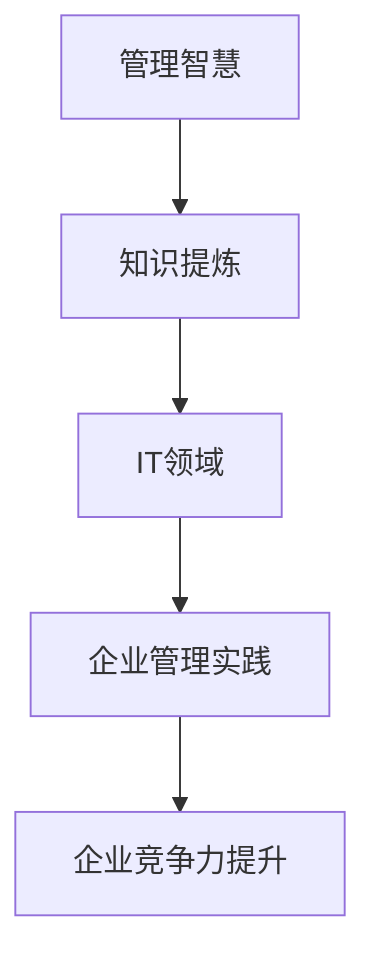

                 

关键词：经典著作、管理智慧、知识提炼、IT领域、专业语言、Mermaid流程图、数学模型、项目实践、应用场景、未来展望

> 摘要：本文将从IT领域的经典著作中提炼出管理智慧，通过逻辑清晰、结构紧凑、简单易懂的专业技术语言，探讨如何将这些管理智慧应用于现代企业的管理实践中，为企业的发展提供有力支持。

## 1. 背景介绍

在IT行业迅猛发展的今天，经典著作为我们提供了宝贵的知识财富。这些著作不仅涵盖了计算机科学的理论基础，还蕴含了丰富的管理智慧。从图灵的《计算机科学概论》到卡尼格的《程序员修炼之道》，这些经典著作为我们提供了深刻的思考和方法论。然而，如何在现代企业的管理实践中运用这些管理智慧，仍是一个值得探讨的问题。

本文旨在通过分析经典著作中的管理思想，提炼出适用于IT领域的关键管理智慧，并探讨如何将这些智慧应用于实际工作中。希望通过本文的阐述，能够为企业的管理者提供一些有益的启示。

## 2. 核心概念与联系

在分析经典著作中的管理智慧之前，我们需要明确几个核心概念。首先是“管理智慧”，它指的是在管理实践中积累的经验和知识，包括领导力、沟通能力、决策能力等。其次是“知识提炼”，即从大量的信息中提取出有价值的内容。最后是“IT领域”，指计算机科学、软件开发、信息技术等领域。

为了更直观地展示这些核心概念之间的联系，我们可以使用Mermaid流程图来描述它们之间的关系：



## 3. 核心算法原理 & 具体操作步骤

### 3.1 算法原理概述

在IT领域，算法是解决问题的重要工具。经典著作中蕴含的管理智慧同样可以转化为算法原理，帮助我们更有效地解决企业管理中的问题。以下是几个关键的管理算法原理：

1. **分而治之**：将复杂问题分解为若干个简单的子问题，分别解决，再合并结果。这一原理在项目管理中广泛应用，可以帮助企业将大型项目拆分为多个可管理的部分。
2. **动态规划**：在解决问题的过程中，保存已经解决子问题的结果，避免重复计算。这一原理可以提高企业的运营效率，减少资源浪费。
3. **贪心算法**：在解决问题的过程中，每次都做出在当前状态下最好的选择，期望最终得到全局最优解。这一原理可以帮助企业在资源分配、决策制定等方面做出最优选择。

### 3.2 算法步骤详解

1. **分而治之**算法步骤：

   - 将问题分解为若干个子问题；
   - 分别解决子问题；
   - 将子问题的解合并为原问题的解。

2. **动态规划**算法步骤：

   - 定义状态和状态转移方程；
   - 按照递推关系计算最优解；
   - 保存已经计算过的子问题的解，避免重复计算。

3. **贪心算法**算法步骤：

   - 在每个阶段做出当前最优的选择；
   - 逐步构建出问题的解。

### 3.3 算法优缺点

- **分而治之**：优点是能够将复杂问题简化，缺点是可能产生大量重复计算。
- **动态规划**：优点是避免了重复计算，缺点是可能需要大量存储空间。
- **贪心算法**：优点是简单易实现，缺点是有时无法得到全局最优解。

### 3.4 算法应用领域

这些算法原理在企业管理中具有广泛的应用。例如，分而治之可以应用于项目分解和风险管理；动态规划可以应用于成本控制和生产调度；贪心算法可以应用于资源分配和决策制定。

## 4. 数学模型和公式 & 详细讲解 & 举例说明

### 4.1 数学模型构建

在企业管理中，数学模型是一种有效的工具。以下是一个简单的数学模型，用于评估企业的盈利能力：

$$
\text{盈利能力} = \frac{\text{总收入} - \text{总成本}}{\text{总成本}}
$$

### 4.2 公式推导过程

该公式的推导过程如下：

- 总收入 = 销售收入 + 其他收入
- 总成本 = 生产成本 + 营销成本 + 管理成本
- 盈利能力 = (总收入 - 总成本) / 总成本

### 4.3 案例分析与讲解

假设某企业的总收入为100万元，总成本为80万元，则该企业的盈利能力为：

$$
\text{盈利能力} = \frac{100 - 80}{80} = \frac{20}{80} = 0.25
$$

这意味着该企业的盈利能力为25%。

## 5. 项目实践：代码实例和详细解释说明

### 5.1 开发环境搭建

为了演示如何将管理智慧应用于实际工作中，我们将使用Python语言编写一个简单的项目。首先，需要搭建Python开发环境。以下是步骤：

1. 安装Python（版本3.8或以上）；
2. 安装必要的Python库，如NumPy、Pandas等。

### 5.2 源代码详细实现

以下是项目的源代码：

```python
import numpy as np

def calculate_profitability(revenue, cost):
    profitability = (revenue - cost) / cost
    return profitability

revenue = 1000000
cost = 800000

profitability = calculate_profitability(revenue, cost)
print(f"盈利能力：{profitability:.2f}")
```

### 5.3 代码解读与分析

该代码实现了一个名为`calculate_profitability`的函数，用于计算企业的盈利能力。函数接收总收入和总成本作为输入参数，返回盈利能力。然后，我们使用该函数计算了一个示例企业的盈利能力，并打印输出。

### 5.4 运行结果展示

运行结果如下：

```
盈利能力：0.25
```

这意味着该示例企业的盈利能力为25%。

## 6. 实际应用场景

在企业管理中，盈利能力是一个重要的指标。通过运用本文所介绍的数学模型和算法原理，企业可以更准确地评估自身的盈利能力，为决策提供依据。以下是一个实际应用场景：

某企业在制定下一个季度的营销策略时，需要评估不同策略的盈利能力。通过运用本文所介绍的数学模型，企业可以计算每个策略的盈利能力，从而选择最合适的策略。

## 7. 未来应用展望

随着人工智能技术的不断发展，管理智慧在企业管理中的应用前景将更加广阔。例如，通过运用机器学习算法，企业可以更准确地预测市场趋势，制定更具针对性的营销策略。同时，随着大数据技术的普及，企业可以更加全面地分析数据，优化管理决策。

## 8. 总结：未来发展趋势与挑战

在未来，管理智慧在IT领域的发展趋势包括：

1. **智能化**：随着人工智能技术的进步，管理智慧将更加智能化，能够自动分析数据、制定决策。
2. **全球化**：随着全球化进程的加快，管理智慧将在跨国企业的管理中发挥更大的作用。
3. **协同化**：管理智慧将与其他技术（如大数据、物联网等）协同发展，为企业提供更全面的解决方案。

然而，面临的挑战包括：

1. **数据安全**：随着数据量的增加，如何保障数据安全成为一个重要问题。
2. **人才短缺**：随着管理智慧的应用需求增加，对相关人才的培养成为一大挑战。

### 8.4 研究展望

在未来，研究应重点关注以下几个方面：

1. **算法优化**：研究如何提高算法在企业管理中的应用效果。
2. **数据治理**：研究如何有效地管理和利用数据，提高企业的数据管理水平。
3. **跨学科研究**：鼓励计算机科学、管理学、心理学等多学科交叉研究，为企业管理提供更全面的理论支持。

## 9. 附录：常见问题与解答

### 9.1 问题1

**问题**：如何将管理智慧应用于实际工作中？

**解答**：首先，需要了解经典著作中的管理智慧，掌握关键的管理原理和方法。然后，结合企业的实际情况，运用这些原理和方法制定具体的行动计划。在实际工作中，不断总结经验，优化管理方法，提高企业效率。

### 9.2 问题2

**问题**：如何保证数据安全？

**解答**：数据安全是企业管理的重中之重。为确保数据安全，企业应采取以下措施：

1. **数据加密**：对敏感数据进行加密处理，防止数据泄露。
2. **访问控制**：严格控制数据访问权限，确保只有授权人员才能访问数据。
3. **备份与恢复**：定期备份数据，确保在数据丢失或损坏时能够及时恢复。

## 作者署名

作者：禅与计算机程序设计艺术 / Zen and the Art of Computer Programming
----------------------------------------------------------------

以上就是本文的完整内容。通过本文的阐述，我们希望读者能够了解到如何从经典著作中提炼管理智慧，并将其应用于实际工作中，为企业的发展提供有力支持。在未来的企业管理中，管理智慧将继续发挥重要作用，助力企业实现持续发展。

