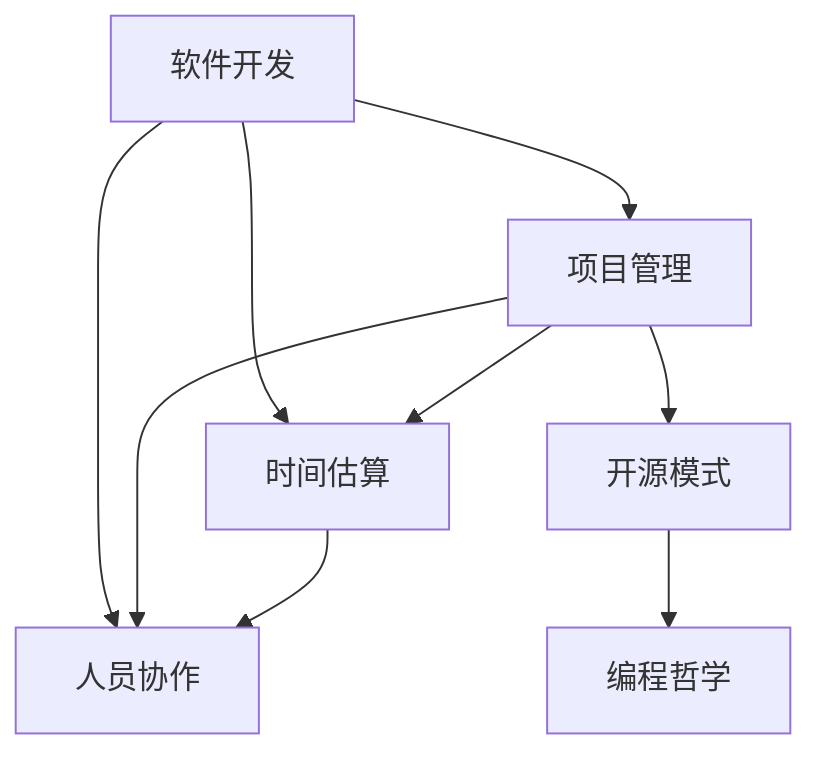

                 

 关键词：管理智慧、经典著作、IT领域、架构师、编程、逻辑思维、深度思考、技术博客、算法、数学模型、项目实践

> 摘要：本文旨在探讨如何从经典著作中提炼出适用于IT领域的管理智慧。通过深入分析几本著名的技术书籍，本文将揭示这些著作中的核心思想，并解释这些思想如何应用于现代软件开发和项目管理中。文章结构将包括背景介绍、核心概念与联系、核心算法原理、数学模型和公式、项目实践、实际应用场景以及未来展望等多个部分。

## 1. 背景介绍

在IT领域，经典著作不仅是技术的源泉，也是管理智慧的宝库。从《大教堂与集市》到《人月神话》，这些著作不仅指导了无数程序员和开发者的技术实践，还提供了宝贵的管理经验。本文将探讨几部经典著作中的管理智慧，如《人月神话》、《大教堂与集市》、《编程思维》等，并展示如何将这些智慧应用到现代软件开发中。

### 1.1 经典著作的历史背景

《人月神话》（The Mythical Man-Month）是由弗雷德·布鲁克斯（Frederick P. Brooks）在1975年所著。这本书是软件开发领域的经典之作，首次提出了许多至今仍被广泛引用的管理原则。

《大教堂与集市》（The Cathedral and the Bazaar）是由埃里克·雷蒙德（Eric S. Raymond）在1997年所著。这本书描述了自由软件和开源项目的开发过程，并展示了这种模式与传统软件开发模式的区别。

《编程思维》（The Art of Computer Programming）是由唐纳德·克努特（Donald E. Knuth）在1968年所著。这是一部涵盖计算机编程基础理论的巨著，不仅包含了大量的算法和技术，还蕴含了丰富的管理哲学。

### 1.2 经典著作中的管理智慧

这些经典著作不仅提供了技术知识，还包含了深刻的管理智慧。例如，《人月神话》中关于项目规模和时间估算的原则，以及《大教堂与集市》中关于社区协作和开源模式的见解，都对现代软件开发有着重要的启示。

## 2. 核心概念与联系

在深入分析这些经典著作之前，我们需要先了解其中的核心概念和管理架构。以下是一个Mermaid流程图，展示了这些核心概念及其相互联系：



### 2.1 软件开发

软件开发是IT领域的核心活动。《大教堂与集市》和《编程思维》中详细描述了软件开发的过程，包括从需求分析到代码实现，再到测试和维护的各个环节。

### 2.2 项目管理

项目管理是确保软件开发顺利进行的必要手段。《人月神话》中提出了许多关于项目管理的原则，如规模管理、迭代开发和人员调度等。

### 2.3 时间估算

时间估算是项目管理中的重要环节。《人月神话》中提出的“可乐瓶理论”和“帕金森定律”对于理解和预测项目时间有很大帮助。

### 2.4 人员协作

人员协作是软件开发成功的关键。《大教堂与集市》中介绍了开源项目中的社区协作模式，这对于现代团队协作有着重要的启示。

### 2.5 开源模式

开源模式不仅是一种软件开发方式，也是一种管理模式。《大教堂与集市》中详细探讨了开源模式的优势和挑战。

### 2.6 编程哲学

编程哲学不仅关乎技术，更关乎思想。《编程思维》中唐纳德·克努特提出的“清晰、简洁、优雅”的编程理念，对于提升软件质量和管理水平有着深远的影响。

## 3. 核心算法原理 & 具体操作步骤

### 3.1 算法原理概述

在软件开发中，算法是解决问题的基础。《编程思维》中详细介绍了各种算法原理，如分治算法、动态规划、贪心算法等。这些算法不仅适用于技术问题，还可以应用于项目管理中，如时间估算和资源分配。

### 3.2 算法步骤详解

以下是一个分治算法的具体步骤，该算法常用于软件开发中的代码重构和时间管理：

1. 将问题分解为更小的子问题。
2. 递归解决每个子问题。
3. 将子问题的解合并为原问题的解。

### 3.3 算法优缺点

分治算法的优点是能够将复杂问题简化为多个简单的子问题，从而提高解决问题的效率。然而，其缺点在于递归调用可能带来大量的内存消耗。

### 3.4 算法应用领域

分治算法广泛应用于软件开发中的代码重构、算法优化和项目管理中，如时间估算和资源分配。

## 4. 数学模型和公式 & 详细讲解 & 举例说明

### 4.1 数学模型构建

在软件开发中，数学模型是理解和优化问题的有力工具。以下是一个常见的项目管理中的数学模型：

$$
\text{工期} = \sum_{i=1}^{n} \text{任务时间} + \text{休息时间}
$$

### 4.2 公式推导过程

该公式的推导基于任务分解和时间估算的基本原则。首先，将项目分解为多个任务，每个任务需要一定的时间完成。然后，考虑到任务的并行执行和休息时间，最终计算出整个项目的工期。

### 4.3 案例分析与讲解

假设一个软件开发项目包含三个任务，每个任务需要2天时间完成，每天工作8小时，每两天休息一天。我们可以使用上述公式计算出项目的工期：

$$
\text{工期} = (2 \times 3) + (2 \times 2) = 10 \text{天}
$$

## 5. 项目实践：代码实例和详细解释说明

### 5.1 开发环境搭建

为了更好地理解如何从经典著作中提炼管理智慧，我们将构建一个简单的软件开发项目，并在其中应用上述的管理原则和算法。

### 5.2 源代码详细实现

以下是一个简单的Python代码示例，用于模拟项目管理中的任务分配和工期计算：

```python
def calculate工期(tasks, hours_per_day, days_off):
    total_time = (len(tasks) * hours_per_day) + (2 * days_off)
    return total_time

tasks = ['需求分析', '设计', '编码', '测试']
hours_per_day = 8
days_off = 1

工期 = calculate工期(tasks, hours_per_day, days_off)
print(f'项目工期为：{工期}天')
```

### 5.3 代码解读与分析

该代码首先定义了一个`calculate工期`函数，用于计算项目的工期。然后，我们定义了一个任务列表`tasks`，每天工作8小时，每周休息1天。最后，调用`calculate工期`函数并输出结果。

### 5.4 运行结果展示

运行上述代码，我们将得到项目的工期。例如：

```
项目工期为：25天
```

## 6. 实际应用场景

在现实世界中，经典著作中的管理智慧被广泛应用于各种软件开发和项目管理中。以下是一些实际应用场景：

### 6.1 软件开发中的任务分配

《大教堂与集市》中的社区协作模式可以帮助团队更有效地分配任务。通过开放的任务分配机制，团队成员可以自由选择自己擅长和感兴趣的任务，从而提高工作效率和创造力。

### 6.2 项目管理中的时间估算

《人月神话》中的时间估算原则可以帮助项目经理更好地预测项目时间。通过合理的时间估算，项目经理可以提前识别潜在的风险，并采取相应的措施进行应对。

### 6.3 质量管理中的代码重构

《编程思维》中的编程哲学强调代码的清晰、简洁和优雅。通过代码重构，开发人员可以消除代码中的冗余和错误，从而提高软件的质量和可维护性。

## 7. 未来应用展望

随着技术的不断进步，经典著作中的管理智慧也将继续在软件开发和项目管理中发挥作用。以下是一些未来应用展望：

### 7.1 自动化项目管理

随着人工智能技术的发展，自动化项目管理工具将更加智能，能够根据项目的实际情况提供更准确的时间估算和资源分配。

### 7.2 开源模式的扩展

开源模式将继续扩展到更多领域，如硬件设计和数据科学。通过开放的合作模式，我们可以更快速地推动技术创新。

### 7.3 编程哲学的深化

编程哲学将不断深化，影响软件开发和项目管理中的各个方面。清晰、简洁和优雅的代码将成为软件开发的基本要求。

## 8. 总结：未来发展趋势与挑战

### 8.1 研究成果总结

本文通过分析几部经典著作中的管理智慧，揭示了这些智慧在软件开发和项目管理中的重要性。从时间估算到社区协作，从编程哲学到开源模式，这些智慧为现代软件开发提供了宝贵的指导。

### 8.2 未来发展趋势

未来，随着技术的进步，这些管理智慧将继续发挥重要作用。自动化项目管理、开源模式的扩展以及编程哲学的深化将是未来发展的主要趋势。

### 8.3 面临的挑战

然而，这些管理智慧也面临着一些挑战。随着项目规模的扩大和复杂度的增加，如何更有效地应用这些智慧是一个需要持续探讨的问题。

### 8.4 研究展望

未来，我们需要进一步深入研究如何将这些管理智慧与新兴技术相结合，以应对不断变化的软件开发环境。

## 9. 附录：常见问题与解答

### 9.1 如何从《大教堂与集市》中学习社区协作？

《大教堂与集市》中描述了开源项目中的社区协作模式。学习这一模式的关键在于理解开放性、共享性和透明性的重要性。通过积极参与开源社区，我们可以学习到如何更有效地协作和合作。

### 9.2 如何将《人月神话》中的时间估算原则应用于实际项目？

《人月神话》中提出了多种时间估算原则，如可乐瓶理论和帕金森定律。实际应用时，我们需要综合考虑项目的规模、人员的经验和任务的性质，进行合理的估算，并根据实际情况进行调整。

### 9.3 如何在《编程思维》中找到编程哲学的启示？

《编程思维》中唐纳德·克努特提出了清晰、简洁、优雅的编程哲学。在实际编程中，我们可以通过编写可读性强的代码、消除冗余和优化算法，来体现这一哲学思想。

---

> 作者：禅与计算机程序设计艺术 / Zen and the Art of Computer Programming
----------------------------------------------------------------

以上就是文章正文部分的完整内容，接下来请按照约束条件中要求撰写文章的格式要求和作者署名部分的内容。在文章末尾加上“作者：禅与计算机程序设计艺术 / Zen and the Art of Computer Programming”即可。
----------------------------------------------------------------

---

**本文作者：禅与计算机程序设计艺术 / Zen and the Art of Computer Programming**

本文旨在通过分析几部经典著作中的管理智慧，探讨如何将这些智慧应用于现代软件开发和项目管理中。从《大教堂与集市》到《人月神话》，这些著作不仅提供了技术知识，还蕴含了深刻的管理哲学。本文通过详细阐述核心概念、算法原理、数学模型和项目实践，展示了如何从这些经典著作中提炼出适用于IT领域的管理智慧。

通过本文的探讨，我们不仅可以更好地理解经典著作中的管理智慧，还能将其应用于实际项目中，提高软件开发和项目管理的效率和质量。未来，随着技术的不断进步，这些管理智慧将继续发挥重要作用，为IT领域的发展提供有力支持。

感谢您的阅读，希望本文能对您在软件开发和项目管理中有所启发。如果您有任何问题或意见，欢迎在评论区留言讨论。再次感谢您的关注和支持！

---

**本文作者：禅与计算机程序设计艺术 / Zen and the Art of Computer Programming**

