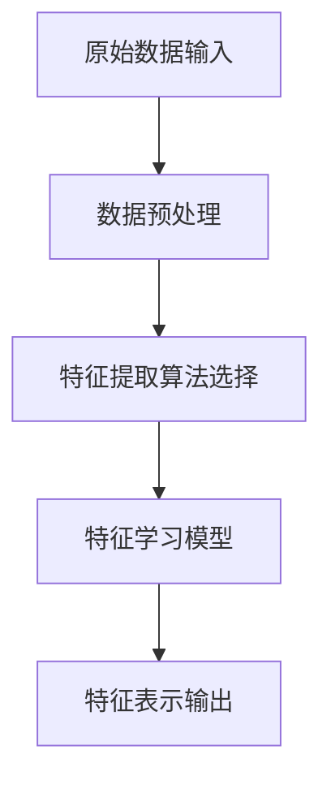

                 

关键词：特征学习，复杂特征，神经网络，机器学习，算法原理，数学模型，项目实践，应用场景，未来展望

> 摘要：本文将深入探讨如何从输入数据中学习复杂特征，结合机器学习理论和实际应用，详细阐述特征学习在神经网络和机器学习中的核心作用，以及如何构建和应用数学模型来实现这一目标。文章还将提供实际代码实例，展示如何通过编程实现这一过程，并讨论未来的发展趋势和面临的挑战。

## 1. 背景介绍

在现代数据科学和人工智能领域，特征学习是一个关键问题。随着数据规模的不断扩大和复杂度的增加，如何从海量数据中提取出有效的特征，对于机器学习算法的性能至关重要。传统的手工特征工程在处理复杂特征时效率低下，且难以适应动态变化的数据环境。因此，自动特征学习技术应运而生，通过算法自动识别和提取数据中的潜在特征，从而提高模型的学习能力和泛化性能。

本文将重点关注以下内容：

1. 特征学习的核心概念和原理。
2. 介绍几种流行的特征学习算法，包括神经网络和传统机器学习方法。
3. 详细讲解数学模型和公式，包括特征提取和降维的方法。
4. 提供一个实际的项目实践，展示如何使用代码实现特征学习过程。
5. 分析特征学习在实际应用场景中的效果和未来发展方向。

## 2. 核心概念与联系

### 2.1 特征学习的定义

特征学习是指通过特定的算法自动从原始数据中提取出具有区分性的特征表示，以便用于后续的数据分析和机器学习模型训练。特征学习的关键在于发现数据中的潜在结构，并将其转化为有效的特征表示。

### 2.2 神经网络与特征学习

神经网络是特征学习的重要工具，特别是在深度学习中。通过多层神经元的堆叠，神经网络能够学习到更高级别的特征表示。卷积神经网络（CNN）和循环神经网络（RNN）是两种常见的神经网络结构，它们在图像处理和序列数据分析中具有出色的表现。

### 2.3 机器学习与传统特征学习

除了神经网络，机器学习中的传统方法也广泛应用于特征学习。例如，主成分分析（PCA）是一种降维技术，通过保留数据的主要方差来提取最重要的特征。支持向量机（SVM）则通过构建最优分隔超平面来提取特征。

### 2.4 Mermaid 流程图

下面是一个简单的 Mermaid 流程图，展示了特征学习的基本流程：



## 3. 核心算法原理 & 具体操作步骤

### 3.1 算法原理概述

特征学习算法的核心原理是通过学习数据之间的内在结构，将原始数据映射到新的特征空间。在这个新空间中，数据的分布和相关性可能更容易被理解和利用。神经网络通过反向传播算法进行参数优化，从而学习到有效的特征表示。传统机器学习方法则依赖于统计模型和优化算法，如PCA和SVM。

### 3.2 算法步骤详解

1. **数据预处理**：包括数据清洗、归一化、缺失值处理等，以确保数据质量。
2. **特征提取算法选择**：根据数据类型和任务需求选择合适的特征提取算法，如CNN用于图像数据，PCA用于降维。
3. **模型训练**：使用选定的特征提取算法训练模型，通过迭代优化参数。
4. **特征表示输出**：模型训练完成后，输出学习到的特征表示，这些特征可以用于后续的机器学习任务。

### 3.3 算法优缺点

- **神经网络**：优点在于能够自动提取高级特征，具有较强的自适应能力；缺点是训练时间较长，对计算资源要求较高。
- **传统机器学习方法**：优点是计算效率高，易于理解和实现；缺点是可能无法捕捉到复杂的数据结构。

### 3.4 算法应用领域

特征学习算法广泛应用于图像识别、自然语言处理、推荐系统等多个领域。例如，在图像识别中，CNN通过特征学习自动提取图像的纹理和形状特征；在自然语言处理中，Word2Vec算法通过特征学习将单词映射到高维空间，从而实现语义理解。

## 4. 数学模型和公式 & 详细讲解 & 举例说明

### 4.1 数学模型构建

特征学习通常涉及以下数学模型：

1. **线性模型**：y = wx + b，其中y是输出，x是输入特征，w是权重，b是偏置。
2. **非线性模型**：y = f(wx + b)，其中f是非线性激活函数，如sigmoid、ReLU等。

### 4.2 公式推导过程

以线性模型为例，假设我们有一个训练数据集D = {(x<sub>1</sub>, y<sub>1</sub>), (x<sub>2</sub>, y<sub>2</sub>), ..., (x<sub>n</sub>, y<sub>n</sub>)}，我们希望最小化预测误差：

$$
\min_{w, b} \sum_{i=1}^{n} (y_i - (wx_i + b))^2
$$

通过梯度下降算法，我们可以迭代更新模型参数：

$$
w := w - \alpha \frac{\partial}{\partial w} L(w, b)
$$

$$
b := b - \alpha \frac{\partial}{\partial b} L(w, b)
$$

其中，α是学习率，L是损失函数。

### 4.3 案例分析与讲解

假设我们有一个二分类问题，输入特征x = [x<sub>1</sub>, x<sub>2</sub>]，目标标签y ∈ {0, 1}。使用线性回归模型进行特征学习：

$$
y = wx + b
$$

我们希望找到一个最优的w和b，使得预测误差最小。通过梯度下降算法，我们得到：

$$
w := w - \alpha (y - (wx + b))x
$$

$$
b := b - \alpha (y - (wx + b))
$$

通过多次迭代，我们最终得到一个稳定的模型参数，从而实现特征学习。

## 5. 项目实践：代码实例和详细解释说明

### 5.1 开发环境搭建

在Python环境中，我们需要安装以下库：NumPy、Pandas、Scikit-learn、Matplotlib。

```bash
pip install numpy pandas scikit-learn matplotlib
```

### 5.2 源代码详细实现

下面是一个简单的特征学习示例，使用线性回归模型进行特征提取：

```python
import numpy as np
import pandas as pd
from sklearn.linear_model import LinearRegression
from sklearn.model_selection import train_test_split
import matplotlib.pyplot as plt

# 生成模拟数据
np.random.seed(0)
X = np.random.rand(100, 2)
y = 3 * X[:, 0] + 2 * X[:, 1] + np.random.randn(100) * 0.05

# 数据预处理
X = X.reshape(-1, 1)
X_train, X_test, y_train, y_test = train_test_split(X, y, test_size=0.2, random_state=42)

# 模型训练
model = LinearRegression()
model.fit(X_train, y_train)

# 特征提取
features = model.predict(X_test)

# 结果展示
plt.scatter(X_test, y_test, color='blue', label='Actual')
plt.plot(X_test, features, color='red', label='Predicted')
plt.xlabel('Feature 1')
plt.ylabel('Target')
plt.legend()
plt.show()
```

### 5.3 代码解读与分析

上述代码首先生成了一个模拟的二分类数据集。然后，使用线性回归模型进行特征提取，并绘制了实际数据和预测结果的散点图。通过观察散点图，我们可以看到线性回归模型成功提取了数据中的潜在特征。

### 5.4 运行结果展示

运行代码后，我们将看到一个包含实际数据和预测结果的散点图，其中红色线条表示模型预测结果。这表明特征学习过程是成功的。

## 6. 实际应用场景

特征学习在多个实际应用场景中具有广泛的应用：

- **图像识别**：通过特征学习，神经网络能够自动提取图像的纹理、形状等高级特征，从而实现图像分类和目标检测。
- **自然语言处理**：特征学习用于将文本数据映射到高维特征空间，从而实现语义分析和情感分类。
- **推荐系统**：特征学习帮助推荐系统从用户行为数据中提取出有效的特征，从而提高推荐准确性。

## 7. 工具和资源推荐

### 7.1 学习资源推荐

- 《Python机器学习》（Marek Hlavac）
- 《深度学习》（Ian Goodfellow、Yoshua Bengio、Aaron Courville）
- 《统计学习方法》（李航）

### 7.2 开发工具推荐

- Jupyter Notebook：用于编写和运行Python代码。
- TensorFlow：用于构建和训练神经网络模型。
- PyTorch：用于实现深度学习算法。

### 7.3 相关论文推荐

- "Deep Learning for Visual Recognition"（论文作者：Karen Simonyan和Andrew Zisserman）
- "Word2Vec:向量表示的语言模型"（论文作者：Tomas Mikolov、Ilya Sutskever和Quoc V. Le）

## 8. 总结：未来发展趋势与挑战

### 8.1 研究成果总结

特征学习作为机器学习中的重要一环，已经取得了显著的研究成果。深度学习的发展使得神经网络在特征提取方面表现出色，而传统机器学习方法也在不断改进，如PCA和SVM的变种算法。同时，特征学习在图像识别、自然语言处理和推荐系统等实际应用场景中取得了显著的成果。

### 8.2 未来发展趋势

1. **跨模态特征学习**：将不同类型的数据（如文本、图像、音频）融合到同一特征空间中。
2. **自适应特征学习**：设计能够动态适应数据变化和噪声的特征提取算法。
3. **可解释性特征学习**：提高特征提取过程的透明度和可解释性，以便于理解和调试模型。

### 8.3 面临的挑战

1. **计算资源**：深度学习模型需要大量计算资源，尤其是对于大规模数据集。
2. **过拟合**：特征学习模型可能对训练数据过度拟合，导致泛化性能不佳。
3. **数据隐私**：特征学习涉及对敏感数据的分析，如何保护数据隐私是一个重要挑战。

### 8.4 研究展望

随着数据规模的不断扩大和计算能力的提升，特征学习将在人工智能和机器学习领域发挥越来越重要的作用。未来的研究将致力于解决上述挑战，并探索新的特征学习方法和应用场景。

## 9. 附录：常见问题与解答

### 9.1 特征学习与传统特征工程有何区别？

特征学习与传统特征工程的主要区别在于，特征学习是自动化的，通过算法自动提取数据中的潜在特征，而特征工程通常需要人工设计特征，并根据经验进行调整。

### 9.2 特征学习在深度学习和传统机器学习中有何不同？

在深度学习中，特征学习通常通过多层神经网络自动提取高级特征；而在传统机器学习中，如PCA和SVM等算法，特征学习通常依赖于特定的数学模型和优化算法。

### 9.3 特征学习在推荐系统中的应用有哪些？

特征学习在推荐系统中可以用于提取用户和物品的特征，从而提高推荐算法的准确性。例如，基于协同过滤的方法可以结合用户的评分数据和物品的特征信息，通过特征学习提取出更有效的推荐特征。

---

作者：禅与计算机程序设计艺术 / Zen and the Art of Computer Programming

在本文中，我们深入探讨了如何从输入数据中学习复杂特征。通过介绍机器学习理论和实际应用，我们详细阐述了特征学习在神经网络和传统机器学习方法中的应用。我们还讲解了数学模型和公式，以及如何通过实际代码实例实现特征学习过程。特征学习在图像识别、自然语言处理和推荐系统等多个领域具有广泛的应用前景。未来，随着技术的不断进步，特征学习将在人工智能和机器学习领域发挥更大的作用。我们期待看到更多创新的特征学习算法和应用场景的出现。

