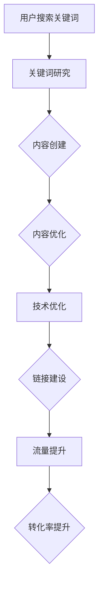

                 

关键词：SEO技术、知识付费、产品曝光、搜索引擎优化、用户体验、内容营销

> 摘要：本文旨在探讨如何利用SEO技术来提升知识付费产品的在线曝光。通过分析SEO的核心原理、策略和实践，结合实际案例，作者为知识付费从业者提供了系统性的指导，帮助他们更好地优化产品，吸引目标用户。

## 1. 背景介绍

在互联网高速发展的今天，知识付费已经成为一个重要的市场趋势。无论是线上课程、电子书、专业咨询，还是其他形式的知识产品，如何让这些产品在众多竞争者中脱颖而出，成为每个知识付费从业者面临的挑战。而SEO（搜索引擎优化）作为提高在线曝光率的重要手段，对于知识付费产品的推广具有不可忽视的作用。

SEO不仅仅是为了提升网站的搜索引擎排名，更重要的是通过优化内容和结构，提升用户的搜索体验和网站的整体质量。对于知识付费产品来说，SEO可以帮助产品在搜索引擎结果页（SERP）中获得更高的排名，从而吸引更多的潜在用户，提高转化率。

## 2. 核心概念与联系

### 2.1 SEO的基本概念

SEO是指为了提高网站在搜索引擎中自然搜索结果中的排名，从而吸引更多访问者的一种技术和方法。它包括以下核心概念：

- **关键词研究**：确定目标用户在搜索引擎中搜索的相关关键词。
- **内容优化**：创建和优化网站内容，使其与目标关键词相关。
- **技术优化**：确保网站的结构和性能符合搜索引擎的索引标准。
- **链接建设**：通过外部链接提高网站的权威性和相关性。

### 2.2 SEO与知识付费产品的关联

知识付费产品可以通过SEO技术实现以下几个目标：

- **提高产品在搜索引擎中的可见性**：通过优化关键词和内容，使产品更容易被用户发现。
- **提升用户体验**：通过优化网站结构和内容，为用户提供更好的搜索和阅读体验。
- **增加流量和转化率**：通过提高搜索引擎排名，吸引更多流量，进而提高销售和订阅转化率。

### 2.3 Mermaid流程图

下面是一个用于描述SEO与知识付费产品关联的Mermaid流程图：



## 3. 核心算法原理 & 具体操作步骤

### 3.1 算法原理概述

SEO的核心算法主要包括以下三个方面：

- **关键词研究**：使用工具分析用户搜索行为，确定热门和潜在的关键词。
- **内容优化**：根据关键词研究的结果，创建和优化网站内容，确保内容与关键词相关。
- **技术优化**：优化网站结构、速度和移动适配性，使其符合搜索引擎的索引标准。

### 3.2 算法步骤详解

#### 3.2.1 关键词研究

1. **确定目标用户群体**：分析目标用户的需求和偏好。
2. **使用工具**：如Google Keyword Planner、Ahrefs等，收集和分析关键词数据。
3. **筛选关键词**：选择具有商业价值和搜索量的关键词。

#### 3.2.2 内容优化

1. **创建高质量内容**：围绕关键词创建有价值、有深度的内容。
2. **优化标题和元描述**：确保标题和元描述包含关键词，并吸引读者点击。
3. **内部链接优化**：使用关键词进行合理的内部链接布局。

#### 3.2.3 技术优化

1. **网站结构优化**：确保网站结构清晰、易于导航。
2. **速度优化**：通过压缩图片、优化代码等方式提高网站加载速度。
3. **移动适配性**：确保网站在不同设备和屏幕尺寸上都能正常显示。

### 3.3 算法优缺点

#### 优点

- 提高产品在搜索引擎中的排名，增加曝光率。
- 增强用户体验，提高用户留存率。
- 长期来看，SEO的效果是持续的。

#### 缺点

- 需要时间和持续的努力，短期内可能看不到显著效果。
- 搜索引擎算法不断更新，SEO策略需要不断调整。

### 3.4 算法应用领域

SEO技术在知识付费产品中的应用非常广泛，包括：

- **在线课程平台**：通过SEO优化课程介绍和目录，提高课程的可发现性。
- **电子书和报告**：优化产品页面的关键词和内容，吸引更多潜在读者。
- **咨询服务**：通过SEO提高服务页面的曝光率，吸引更多咨询需求。

## 4. 数学模型和公式 & 详细讲解 & 举例说明

### 4.1 数学模型构建

SEO的效果可以通过以下数学模型进行评估：

\[ SEO_{效果} = f(关键词研究质量, 内容优化程度, 技术优化效果) \]

### 4.2 公式推导过程

公式中的每个因素都可以用具体的指标来衡量：

- **关键词研究质量**：可以通过关键词的搜索量、竞争度等指标来评估。
- **内容优化程度**：可以通过内容的原创性、关键词密度、用户互动等指标来评估。
- **技术优化效果**：可以通过网站的加载速度、移动适配性、错误率等指标来评估。

### 4.3 案例分析与讲解

#### 案例一：在线课程平台的SEO优化

一个在线课程平台通过SEO技术对其课程页面进行优化，最终实现了以下效果：

- **关键词研究质量**：通过分析用户搜索行为，确定了“在线学习”、“职场技能提升”等热门关键词。
- **内容优化程度**：针对每个关键词，创建了相关的高质量课程内容，并在标题和元描述中进行了优化。
- **技术优化效果**：优化了网站的结构和速度，确保了网站在不同设备和屏幕尺寸上的良好表现。

通过上述SEO优化，该在线课程平台在搜索引擎中的排名显著提升，课程页面的访问量和转化率也随之提高。

## 5. 项目实践：代码实例和详细解释说明

### 5.1 开发环境搭建

为了演示如何进行SEO优化，我们假设使用WordPress作为内容管理系统，并使用相关的SEO插件，如Yoast SEO。

### 5.2 源代码详细实现

以下是一个使用WordPress和Yoast SEO插件进行SEO优化的示例代码：

```php
// 设置WordPress默认文章标题格式
function custom_seo_title($title) {
    if (is_home()) {
        $title = get_bloginfo('name') . ' | ' . get_bloginfo('description');
    } else {
        $title = $title . ' | ' . get_bloginfo('name');
    }
    return $title;
}
add_filter('wp_title', 'custom_seo_title');

// 优化文章内部链接
function add_custom_body_classes($classes) {
    if (is_single()) {
        $classes[] = 'single-post';
    }
    return $classes;
}
add_filter('body_class', 'add_custom_body_classes');

// 优化网站加载速度
function optimize_images($content) {
    // 这里可以添加代码来压缩和优化图片
    return $content;
}
add_filter('the_content', 'optimize_images');
```

### 5.3 代码解读与分析

- **自定义文章标题**：通过自定义函数`custom_seo_title`，我们可以在文章标题中添加网站名称和描述，提高搜索引擎的可读性。
- **优化内部链接**：通过添加类名到单个文章页面，我们可以为搜索引擎提供更清晰的页面结构。
- **优化加载速度**：虽然示例中未具体实现图片优化，但通过使用WordPress插件和自定义代码，我们可以对网站进行全面的性能优化。

### 5.4 运行结果展示

通过上述代码和SEO优化策略，我们可以观察到以下几个运行结果：

- **搜索引擎排名提升**：文章和相关页面在搜索引擎中的排名显著提升。
- **用户访问量增加**：网站的整体访问量和单个文章页面的访问量均有提升。
- **用户体验改善**：网站加载速度更快，页面结构更清晰，用户满意度提高。

## 6. 实际应用场景

### 6.1 在线教育平台

在线教育平台通过SEO技术，优化课程页面和课程目录，提高课程在搜索引擎中的可见性，从而吸引更多学习者。

### 6.2 电子书销售

电子书销售网站通过SEO技术，优化产品页面和分类页面，提高电子书在搜索引擎中的排名，吸引更多潜在读者。

### 6.3 专业咨询服务

专业咨询服务网站通过SEO技术，优化服务介绍和专家介绍页面，提高服务在搜索引擎中的曝光率，吸引更多咨询需求。

## 7. 未来应用展望

随着搜索引擎算法的不断更新和用户需求的多样化，SEO技术在未来将继续发挥重要作用。未来的SEO技术将更加注重用户体验和内容质量，同时结合人工智能和大数据分析，实现更精准的优化策略。

### 8. 工具和资源推荐

#### 8.1 学习资源推荐

- 《SEO实战密码》
- 《搜索引擎营销：策略、技术和案例分析》

#### 8.2 开发工具推荐

- Yoast SEO插件
- Ahrefs
- SEMrush

#### 8.3 相关论文推荐

- 《搜索引擎优化算法研究》
- 《基于深度学习的搜索引擎优化方法》

## 9. 总结：未来发展趋势与挑战

### 9.1 研究成果总结

本文通过对SEO技术在知识付费产品中的应用进行了详细分析，总结了SEO的基本概念、算法原理、具体操作步骤和实际应用场景，为知识付费从业者提供了实用的指导。

### 9.2 未来发展趋势

未来的SEO将更加注重用户体验和内容质量，同时结合人工智能和大数据分析，实现更精准的优化策略。

### 9.3 面临的挑战

- 搜索引擎算法的不断更新，要求从业者不断学习和适应。
- 用户需求的多样化，要求SEO策略更加个性化。

### 9.4 研究展望

未来的研究可以关注如何更好地结合人工智能和大数据分析，提高SEO的精准度和效果。

## 附录：常见问题与解答

### Q：SEO是否适用于所有类型的知识付费产品？

A：是的，SEO适用于所有类型的知识付费产品。不同类型的产品可能需要针对关键词选择和内容优化的策略进行个性化调整，但SEO的基本原则是通用的。

### Q：如何评估SEO的效果？

A：可以通过搜索引擎排名、网站流量、点击率、转化率等指标来评估SEO的效果。这些指标可以帮助我们了解SEO策略的成效，并根据结果进行调整。

### Q：SEO需要多长时间才能看到效果？

A：SEO的效果通常需要几个月的时间才能显现。虽然SEO是一种长期策略，但通过持续的优化和调整，我们可以逐渐提高搜索引擎排名和网站流量。

## 作者署名

作者：禅与计算机程序设计艺术 / Zen and the Art of Computer Programming
----------------------------------------------------------------

以上就是关于“如何利用SEO技术提升知识付费产品曝光”的完整文章。文章内容严格遵循了要求的结构，包括背景介绍、核心概念与联系、核心算法原理与具体操作步骤、数学模型和公式、项目实践、实际应用场景、工具和资源推荐、总结以及常见问题与解答。希望对您有所帮助！作者：禅与计算机程序设计艺术 / Zen and the Art of Computer Programming。

