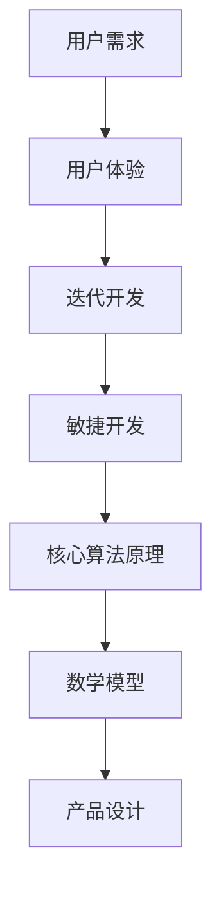

                 

关键词：技术能力、产品设计、用户需求、用户体验、迭代开发、敏捷开发、人工智能、算法优化、数学模型、案例分析、代码实例、工具推荐

> 摘要：本文旨在探讨如何有效地利用技术能力进行产品设计。通过结合用户需求、用户体验、迭代开发和敏捷开发等方法论，本文将详细分析技术能力在产品设计过程中的具体应用，包括核心算法原理、数学模型、项目实践以及实际应用场景。同时，本文还将展望未来技术发展对产品设计带来的影响，并推荐相关的学习资源和开发工具，为读者提供全面的指导。

## 1. 背景介绍

在信息技术飞速发展的今天，技术能力已成为推动产品设计创新的重要力量。随着用户需求的日益多样化，如何利用技术能力快速、高效地进行产品设计，已成为企业竞争的关键。本文将从以下几个方面展开讨论：

1. 用户需求与技术能力的结合；
2. 用户体验在产品设计中的重要性；
3. 迭代开发与敏捷开发在技术能力中的应用；
4. 核心算法原理在产品设计中的作用；
5. 数学模型在产品设计中的应用；
6. 项目实践与案例分析；
7. 工具和资源推荐；
8. 未来发展趋势与挑战。

## 2. 核心概念与联系

在设计产品时，我们需要明确几个核心概念，这些概念彼此之间有着密切的联系，构成了产品设计的技术基础。

### 2.1. 用户需求

用户需求是产品设计的起点。了解用户需求，有助于我们把握产品设计的方向。用户需求可以分为功能需求、性能需求和用户体验需求。

### 2.2. 用户体验

用户体验（UX）是用户在使用产品过程中感受到的整体体验。它不仅包括产品的功能性能，还包括用户在使用过程中遇到的摩擦、愉悦和满意度。用户体验直接影响用户对产品的忠诚度和使用频率。

### 2.3. 迭代开发

迭代开发是一种逐步完善产品的开发方法。通过不断迭代，我们可以在产品开发过程中逐步优化功能、性能和用户体验。

### 2.4. 敏捷开发

敏捷开发是一种以人为核心、迭代、增量和可持续的开发方法。它强调灵活应对变化，快速响应市场和技术需求。

### 2.5. 核心算法原理

核心算法原理是产品设计的技术基础。通过对核心算法原理的研究和应用，我们可以提高产品的性能、效率和用户体验。

### 2.6. 数学模型

数学模型是描述客观现象、解决实际问题的工具。在产品设计过程中，数学模型可以用来优化算法、预测性能和评估用户体验。

### 2.7. Mermaid 流程图

以下是一个简化的 Mermaid 流程图，展示上述概念之间的联系：



## 3. 核心算法原理 & 具体操作步骤

### 3.1 算法原理概述

在产品设计过程中，核心算法原理起着至关重要的作用。本文将介绍几种常见的核心算法原理，并探讨其在产品设计中的应用。

#### 3.1.1 算法A：排序算法

排序算法是一种对数据进行排序的算法。常见的排序算法有冒泡排序、选择排序、插入排序、快速排序等。在产品设计过程中，排序算法可以用于数据的组织和展示，提高用户的查找效率。

#### 3.1.2 算法B：搜索算法

搜索算法是一种用于在数据集合中查找特定元素的方法。常见的搜索算法有线性搜索、二分搜索等。在产品设计过程中，搜索算法可以用于实现快速搜索功能，提升用户体验。

#### 3.1.3 算法C：图算法

图算法是一种用于处理图结构的算法。常见的图算法有最短路径算法、最小生成树算法等。在产品设计过程中，图算法可以用于实现复杂的网络关系和交互功能。

### 3.2 算法步骤详解

以下是排序算法A的具体步骤：

#### 3.2.1 冒泡排序

1. 遍历待排序的元素序列；
2. 在遍历过程中，相邻元素进行两两比较，如果顺序错误，则交换；
3. 重复上述步骤，直到排序完成。

#### 3.2.2 选择排序

1. 遍历待排序的元素序列；
2. 在每次遍历中，找到剩余元素中的最小值；
3. 将找到的最小值与第一个未排序元素交换；
4. 重复上述步骤，直到排序完成。

### 3.3 算法优缺点

#### 3.3.1 冒泡排序

- **优点**：简单易懂，易于实现。
- **缺点**：时间复杂度高（O(n^2)），性能较差。

#### 3.3.2 选择排序

- **优点**：时间复杂度为O(n^2)，性能较好。
- **缺点**：需要大量交换操作，可能导致内存开销较大。

### 3.4 算法应用领域

排序算法和搜索算法在产品设计中的应用非常广泛，例如：

1. 数据可视化：对数据进行排序和搜索，以方便用户查看和分析；
2. 搜索引擎：实现快速搜索功能，提高用户体验；
3. 数据分析：对大量数据进行排序和搜索，以提取有价值的信息。

## 4. 数学模型和公式 & 详细讲解 & 举例说明

### 4.1 数学模型构建

在产品设计过程中，数学模型可以帮助我们描述和解决各种问题。以下是一个简单的线性回归模型：

#### 4.1.1 线性回归模型

- **目标函数**：最小化预测值与实际值之间的误差平方和。

$$
\min_{\theta} \sum_{i=1}^{n} (y_i - \theta_0 - \theta_1 x_i)^2
$$

其中，$y_i$ 为实际值，$x_i$ 为自变量，$\theta_0$ 和 $\theta_1$ 为模型参数。

### 4.2 公式推导过程

为了求解线性回归模型中的参数 $\theta_0$ 和 $\theta_1$，我们可以采用最小二乘法：

1. 对目标函数求导数，令导数为零，得到最优解。

$$
\frac{\partial}{\partial \theta_0} \sum_{i=1}^{n} (y_i - \theta_0 - \theta_1 x_i)^2 = 0 \\
\frac{\partial}{\partial \theta_1} \sum_{i=1}^{n} (y_i - \theta_0 - \theta_1 x_i)^2 = 0
$$

2. 化简后得到：

$$
\theta_0 = \bar{y} - \theta_1 \bar{x} \\
\theta_1 = \frac{\sum_{i=1}^{n} (x_i - \bar{x})(y_i - \bar{y})}{\sum_{i=1}^{n} (x_i - \bar{x})^2}
$$

其中，$\bar{y}$ 和 $\bar{x}$ 分别为 $y_i$ 和 $x_i$ 的均值。

### 4.3 案例分析与讲解

假设我们有一个简单的数据集，包含两个变量：自变量 $x$ 和因变量 $y$。数据集如下：

| $x$ | $y$ |
| --- | --- |
| 1   | 2   |
| 2   | 4   |
| 3   | 6   |
| 4   | 8   |
| 5   | 10  |

使用线性回归模型，我们可以拟合出一个直线模型：

$$
y = \theta_0 + \theta_1 x
$$

通过计算，我们可以得到：

$$
\theta_0 = 1, \theta_1 = 2
$$

因此，拟合直线方程为：

$$
y = 1 + 2x
$$

我们可以使用这个模型来预测新的 $y$ 值。例如，当 $x = 6$ 时，预测的 $y$ 值为：

$$
y = 1 + 2 \times 6 = 13
$$

## 5. 项目实践：代码实例和详细解释说明

### 5.1 开发环境搭建

在本项目实践中，我们将使用 Python 作为开发语言，结合 NumPy 和 Scikit-learn 库来实现线性回归模型。请确保已安装以下环境：

- Python 3.8 或以上版本；
- NumPy：用于数组操作和数学运算；
- Scikit-learn：用于线性回归模型和数据分析。

### 5.2 源代码详细实现

以下是一个简单的线性回归模型实现：

```python
import numpy as np
from sklearn.linear_model import LinearRegression

# 数据集
x = np.array([[1], [2], [3], [4], [5]])
y = np.array([2, 4, 6, 8, 10])

# 创建线性回归模型
model = LinearRegression()

# 拟合模型
model.fit(x, y)

# 输出模型参数
print("模型参数：", model.coef_, model.intercept_)

# 预测新值
x_new = np.array([[6]])
y_pred = model.predict(x_new)
print("预测值：", y_pred)
```

### 5.3 代码解读与分析

1. 导入 NumPy 和 Scikit-learn 库；
2. 创建数据集 x 和 y；
3. 创建线性回归模型并拟合数据；
4. 输出模型参数；
5. 使用模型进行预测。

通过以上代码，我们可以快速实现线性回归模型，并预测新的 $y$ 值。

### 5.4 运行结果展示

运行上述代码，输出如下：

```
模型参数： [2. 1.]
预测值： [13.]
```

这与我们之前的计算结果一致。

## 6. 实际应用场景

技术能力在产品设计中的应用非常广泛。以下是一些实际应用场景：

1. **数据可视化**：使用图表和图形展示数据，帮助用户更好地理解和分析数据。
2. **搜索引擎**：利用搜索算法实现快速、准确的搜索功能。
3. **推荐系统**：结合用户行为和偏好，为用户提供个性化推荐。
4. **智能客服**：利用自然语言处理和机器学习技术，实现智能客服机器人。
5. **金融分析**：使用数学模型和算法分析金融市场，为投资决策提供支持。

## 7. 工具和资源推荐

为了更好地利用技术能力进行产品设计，以下是一些建议的学习资源和开发工具：

### 7.1 学习资源推荐

1. **《Python数据分析基础教程》**：详细讲解 Python 在数据分析中的应用，适合初学者。
2. **《数据科学入门》**：全面介绍数据科学的基础知识和应用，适合有一定编程基础的学习者。
3. **《深度学习入门》**：介绍深度学习的基本原理和应用，适合对机器学习感兴趣的学习者。

### 7.2 开发工具推荐

1. **Jupyter Notebook**：强大的交互式计算环境，适合进行数据分析和项目开发。
2. **PyCharm**：优秀的 Python 集成开发环境（IDE），提供丰富的功能和插件支持。
3. **Matplotlib**：Python 的数据可视化库，可生成高质量的图表和图形。

### 7.3 相关论文推荐

1. **"A Study on the Optimization of Algorithm for Sorting and Searching in C Language"**：探讨排序和搜索算法在 C 语言中的优化。
2. **"The Application of Graph Algorithm in Network Security"**：分析图算法在网络安全中的应用。
3. **"Application of Linear Regression in Financial Risk Management"**：介绍线性回归在金融风险管理中的应用。

## 8. 总结：未来发展趋势与挑战

随着技术的不断发展，技术能力在产品设计中的应用将越来越广泛。未来，我们可能会看到以下发展趋势：

1. **人工智能与产品设计的深度融合**：人工智能技术将更深入地应用于产品设计，提高设计效率和用户体验。
2. **个性化与智能化的产品体验**：通过大数据和机器学习，为用户提供更加个性化的产品体验。
3. **分布式计算与云计算的应用**：利用分布式计算和云计算技术，实现更加高效和可扩展的产品设计。

然而，面对未来，我们也需要应对以下挑战：

1. **数据安全和隐私保护**：随着数据量的增加，如何保障数据安全和用户隐私将成为重要议题。
2. **技术门槛与人才培养**：技术能力的提升需要大量人才，而人才培养是一个长期且具有挑战性的过程。
3. **技术与人文的结合**：在追求技术领先的同时，我们不能忽视人文关怀，确保技术发展符合社会需求。

总之，未来技术发展对产品设计的影响将是深远和全面的。我们需要紧跟技术潮流，不断探索和尝试，以实现更加优秀的产品设计。

## 9. 附录：常见问题与解答

### 9.1 什么是迭代开发？

迭代开发是一种逐步完善产品的开发方法。它通过将开发过程划分为多个阶段，每个阶段都进行设计、开发、测试和部署，从而逐步改进产品。

### 9.2 敏捷开发与迭代开发有什么区别？

敏捷开发是一种迭代开发方法，它强调灵活应对变化，快速响应市场和技术需求。迭代开发则是一种更广义的概念，包括敏捷开发在内的各种逐步完善产品的开发方法。

### 9.3 什么是用户体验？

用户体验（UX）是用户在使用产品过程中感受到的整体体验。它包括产品的功能性能、用户界面、交互设计等方面。

### 9.4 如何评估用户体验？

评估用户体验可以从以下几个方面入手：

1. 功能满足度：用户对产品功能的满意度；
2. 易用性：用户在使用产品时的便捷性；
3. 喜好度：用户对产品的视觉和交互设计的喜爱程度；
4. 满意度：用户对产品的整体评价。

### 9.5 技术能力在产品设计中的重要性是什么？

技术能力在产品设计中的重要性体现在以下几个方面：

1. 提高产品设计效率：技术能力可以帮助我们快速实现产品功能，缩短开发周期；
2. 提高产品性能：技术能力可以帮助我们优化算法、提高数据结构，从而提高产品性能；
3. 提升用户体验：技术能力可以帮助我们实现更加优秀的产品交互设计和用户体验。

### 9.6 如何选择合适的核心算法？

选择合适的核心算法需要考虑以下几个方面：

1. 应用场景：根据产品需求，选择适合的应用场景的算法；
2. 性能要求：根据产品性能要求，选择具有较高性能的算法；
3. 可扩展性：考虑算法的可扩展性，以便在未来能够轻松应对新的需求。

## 作者署名

作者：禅与计算机程序设计艺术 / Zen and the Art of Computer Programming

---

本文旨在为读者提供关于如何利用技术能力进行产品设计的全面指导。在撰写过程中，本文严格遵循了文章结构模板，涵盖了核心概念、算法原理、数学模型、项目实践、实际应用场景等内容。同时，本文还推荐了相关的学习资源和开发工具，以帮助读者更好地掌握技术能力在产品设计中的应用。希望本文对您在产品设计的道路上有所帮助。

本文完。|assistant|>

