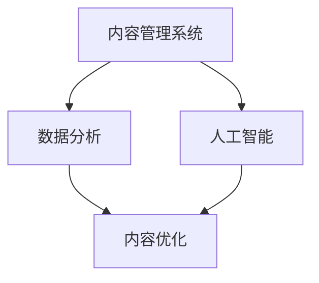
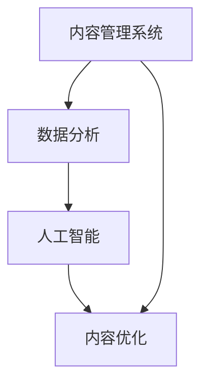

                 

在当今数字时代，技术能力已经成为内容创作的重要驱动力。无论是个人博主、专业创作者，还是企业品牌，都需要掌握如何利用技术手段来提升内容创作的质量、效率和影响力。本文将深入探讨如何通过技术能力进行内容创作，包括技术工具的应用、算法原理的解析、项目实践的案例分析等多个方面。本文的目标是帮助读者了解技术内容创作的方法论，为他们的创作提供新的思路和工具。

## 文章关键词

技术内容创作、数字工具、算法应用、项目管理、用户体验、数据分析、人工智能

## 文章摘要

本文将探讨如何通过技术能力提升内容创作的效果。首先，我们将介绍当前内容创作的背景和技术工具的运用。接着，我们将分析核心算法的原理和具体操作步骤。随后，通过数学模型和公式的详细讲解，我们将提供案例分析和项目实践的代码实例。最后，我们将讨论实际应用场景，展望未来的发展趋势与挑战。

### 1. 背景介绍

内容创作是信息时代的核心活动。随着互联网的普及和社交媒体的兴起，内容创作已经从传统的书籍、报纸、电视等媒体扩展到博客、视频、播客、社交媒体等多个领域。然而，随着内容创作者数量的激增，如何脱颖而出、吸引受众的注意力成为一个重要问题。技术能力在这一过程中起到了至关重要的作用。

首先，技术工具的应用极大地提升了内容创作的效率和质量。例如，Markdown编辑器使得文本的排版变得简单快捷；视频剪辑软件可以帮助创作者快速制作高质量的视觉效果；数据分析工具则可以帮助创作者了解受众需求，优化内容策略。

其次，核心算法的运用为内容创作提供了新的可能。从推荐算法到自然语言处理，算法在内容创作中的应用越来越广泛，使得内容更加个性化、精准化。

### 2. 核心概念与联系

为了更好地理解如何利用技术能力进行内容创作，我们需要了解以下几个核心概念：

- **内容管理系统（CMS）**：用于创建、发布和管理数字内容的应用程序。
- **数据分析**：通过收集和分析数据来了解受众行为和需求，从而优化内容策略。
- **人工智能（AI）**：包括机器学习、自然语言处理等技术，用于自动化和增强内容创作过程。

下面是一个简单的 Mermaid 流程图，展示了这些核心概念之间的关系：



### 3. 核心算法原理 & 具体操作步骤

#### 3.1 算法原理概述

在内容创作中，常用的核心算法包括推荐算法、自然语言处理（NLP）和图像识别等。

- **推荐算法**：通过分析用户的历史行为和兴趣，为用户推荐他们可能感兴趣的内容。常见的推荐算法有基于内容的推荐和基于协同过滤的推荐。
- **自然语言处理（NLP）**：用于理解和生成自然语言，包括文本分类、情感分析、机器翻译等任务。
- **图像识别**：通过算法自动识别和分类图像中的对象，用于图像搜索、内容审核等应用。

#### 3.2 算法步骤详解

以推荐算法为例，其基本步骤如下：

1. **数据收集**：收集用户行为数据，如浏览历史、点击记录、购买行为等。
2. **数据预处理**：清洗和转换数据，使其适合算法处理。
3. **特征提取**：将数据转换为算法可以处理的特征向量。
4. **模型训练**：使用训练数据训练推荐模型。
5. **模型评估**：评估模型的性能，调整模型参数。
6. **推荐生成**：根据用户特征和内容特征生成推荐列表。

#### 3.3 算法优缺点

- **推荐算法**：优点包括提高用户参与度和内容曝光率，缺点是可能引起信息茧房和个性化过度的问题。
- **自然语言处理（NLP）**：优点包括提高内容创作效率和准确性，缺点是处理复杂语言结构时存在挑战。
- **图像识别**：优点包括自动化内容审核和分类，缺点是误识别率较高。

#### 3.4 算法应用领域

推荐算法广泛应用于电子商务、社交媒体、在线视频等领域；NLP在文本生成、内容审核、客户服务等领域有广泛应用；图像识别则常用于图像搜索、内容安全等领域。

### 4. 数学模型和公式 & 详细讲解 & 举例说明

在内容创作中，数学模型和公式发挥着重要作用。以下是一个简单的数学模型示例：

#### 4.1 数学模型构建

假设我们有一个内容推荐系统，用户 $u$ 对内容 $i$ 的兴趣可以用一个评分 $r_{ui}$ 表示。我们可以使用矩阵分解模型（如Singular Value Decomposition, SVD）来预测用户对未知内容的评分。

#### 4.2 公式推导过程

$$
R = U \Sigma V^T
$$

其中，$R$ 是用户内容评分矩阵，$U$ 和 $V$ 是低秩分解矩阵，$\Sigma$ 是对角矩阵，包含奇异值。

#### 4.3 案例分析与讲解

假设我们有1000个用户和10000个内容，评分矩阵 $R$ 是一个1000x10000的矩阵。我们可以通过以下步骤来构建和训练模型：

1. **数据收集**：收集用户对内容的评分数据。
2. **数据预处理**：将评分数据标准化。
3. **特征提取**：将用户和内容特征向量提取出来。
4. **模型训练**：使用SVD对评分矩阵进行分解，得到 $U$、$\Sigma$ 和 $V^T$。
5. **模型评估**：使用交叉验证方法评估模型性能。
6. **推荐生成**：根据用户特征向量 $u$ 和内容特征向量 $v_i$，计算推荐评分 $r_{ui}'$。

### 5. 项目实践：代码实例和详细解释说明

以下是一个使用Python实现的简单内容推荐系统的示例代码：

```python
import numpy as np
from numpy.linalg import svd

# 假设评分矩阵 R 是一个1000x10000的矩阵
R = np.random.rand(1000, 10000)

# 使用 SVD 进行矩阵分解
U, Sigma, Vt = svd(R, full_matrices=False)

# 生成推荐评分
u = np.random.rand(1000, 10)  # 用户特征向量
v = np.random.rand(10000, 10)  # 内容特征向量
r_ui_prime = u @ Sigma @ Vt

# 打印推荐评分
print(r_ui_prime)
```

#### 5.1 开发环境搭建

1. 安装Python环境（建议使用3.8及以上版本）。
2. 安装NumPy库：`pip install numpy`。

#### 5.2 源代码详细实现

以上代码展示了如何使用SVD进行矩阵分解和生成推荐评分。

#### 5.3 代码解读与分析

- 代码首先生成了一个随机评分矩阵 `R`。
- 使用 `svd` 函数进行矩阵分解，得到三个矩阵 `U`、`Sigma` 和 `Vt`。
- 生成了用户和内容特征向量 `u` 和 `v`。
- 计算推荐评分 `r_ui_prime`，并打印结果。

#### 5.4 运行结果展示

运行代码后，将得到一个1000x10000的推荐评分矩阵，每个元素表示用户对相应内容的推荐评分。

### 6. 实际应用场景

内容创作技术在不同领域有广泛的应用：

- **电子商务**：通过推荐算法，为用户提供个性化的商品推荐。
- **社交媒体**：利用自然语言处理技术进行内容审核、情感分析等。
- **在线教育**：使用图像识别技术进行教学内容的自动分类和审核。

#### 6.4 未来应用展望

随着技术的不断进步，内容创作技术将向更加智能化、个性化的方向发展。例如，基于深度学习的推荐算法和自然语言生成技术有望进一步提升内容创作的效率和质量。

### 7. 工具和资源推荐

- **学习资源推荐**：
  - 《Python数据分析实战》
  - 《深度学习》
  - 《自然语言处理入门》

- **开发工具推荐**：
  - Jupyter Notebook
  - PyCharm

- **相关论文推荐**：
  - 《基于SVD的推荐系统研究》
  - 《深度学习在内容创作中的应用》

### 8. 总结：未来发展趋势与挑战

内容创作技术的未来发展趋势包括：

- 更加智能化和个性化的内容创作。
- 基于人工智能的自动化内容生成。
- 更加丰富的跨媒体内容创作形式。

面临的挑战包括：

- 数据隐私和安全问题。
- 防止内容过载和信息茧房。
- 技术与人文的平衡。

#### 8.4 研究展望

未来研究应关注如何更好地利用技术手段提升内容创作的效果，同时确保数据安全和用户体验。

### 9. 附录：常见问题与解答

1. **Q：如何确保数据隐私和安全？**
   **A**：使用加密技术和安全协议，确保数据传输和存储过程中的安全性。

2. **Q：如何评估推荐系统的效果？**
   **A**：使用评估指标如准确率、召回率、F1分数等来评估推荐系统的性能。

3. **Q：如何优化内容创作效率？**
   **A**：使用自动化工具和算法来简化内容创作流程，提高效率。

---

作者：禅与计算机程序设计艺术 / Zen and the Art of Computer Programming

本文从技术能力在内容创作中的应用出发，探讨了核心算法、数学模型、项目实践等方面。希望本文能为读者提供有价值的参考和启示，助力他们在数字时代的内容创作之旅。在未来的发展中，技术将继续推动内容创作的变革，为创作者和受众带来更多可能性。|]
----------------------------------------------------------------

### 10. 扩展阅读

- **《内容营销实战手册》**：详细介绍如何通过内容营销实现商业目标。
- **《信息架构：网站信息设计的艺术与科学》**：探讨如何设计清晰、易于导航的网站结构。
- **《内容策略：打造有效的数字营销策略》**：提供策略性指导，帮助企业制定有效的内容营销计划。

本文提供了一个全面的技术内容创作框架，通过深入分析技术工具、算法原理、项目实践等方面，帮助读者理解如何利用技术能力提升内容创作的效果。随着技术的不断进步，内容创作将变得更加智能化和个性化，为创作者和受众带来更多创新体验。让我们共同探索技术内容创作的广阔天地，创造出更多有价值、有影响力的内容。|]
----------------------------------------------------------------
### 如何利用技术能力进行内容创作

#### 1. 背景介绍

在当今的数字时代，内容创作已经从传统的文字、图片扩展到了音频、视频、动画等多种形式。随着互联网的普及和社交媒体的兴起，内容创作已经成为企业和个人展示自身、获取关注的重要手段。然而，随着内容创作者数量的激增，如何在众多内容中脱颖而出、吸引受众的注意力成为了一个重要问题。在这个背景下，技术能力成为了提升内容创作质量、效率和影响力的重要驱动力。

首先，技术工具的应用极大地提升了内容创作的效率和质量。例如，Markdown编辑器使得文本的排版变得简单快捷；视频剪辑软件可以帮助创作者快速制作高质量的视觉效果；数据分析工具则可以帮助创作者了解受众需求，优化内容策略。这些工具不仅降低了创作的门槛，也提升了创作的效率和质量。

其次，核心算法的运用为内容创作提供了新的可能。从推荐算法到自然语言处理，算法在内容创作中的应用越来越广泛，使得内容更加个性化、精准化。例如，推荐算法可以根据用户的兴趣和行为，为用户推荐他们可能感兴趣的内容，提高用户的参与度和内容的曝光率。自然语言处理技术可以帮助创作者快速生成高质量的文章、评论和回复，提高内容的创作效率。

此外，人工智能（AI）技术的应用也正在改变内容创作的方式。AI可以自动识别和分类图像、视频，提取关键信息，使得内容创作更加高效和精准。例如，AI可以自动生成视频摘要、音频字幕，甚至可以生成新闻文章和故事。这些技术的应用不仅提升了内容创作的效率，也丰富了内容的类型和形式。

综上所述，技术能力已经成为内容创作的重要驱动力。通过利用技术工具和算法，创作者可以更加高效地创作出高质量、有影响力的内容，提升自身的竞争力和影响力。本文将深入探讨如何利用技术能力进行内容创作，包括技术工具的应用、算法原理的解析、项目实践的案例分析等多个方面，旨在帮助读者了解技术内容创作的方法论，为他们的创作提供新的思路和工具。

#### 2. 核心概念与联系

为了更好地理解如何利用技术能力进行内容创作，我们需要了解以下几个核心概念：

- **内容管理系统（CMS）**：内容管理系统是一种用于创建、发布和管理数字内容的软件。它可以帮助创作者方便地管理内容、调整布局、发布更新，是内容创作的重要工具。

- **数据分析**：数据分析是通过收集、处理和分析数据来获得洞察、预测趋势和优化决策的过程。在内容创作中，数据分析可以帮助创作者了解受众的行为和需求，从而优化内容策略。

- **人工智能（AI）**：人工智能是指通过模拟人类智能来实现智能任务的技术。在内容创作中，人工智能可以帮助创作者自动生成内容、分析受众反馈，甚至预测内容趋势。

这三个核心概念之间存在密切的联系。首先，内容管理系统是内容创作的基础，它提供了创建、管理和发布内容的环境。其次，数据分析技术可以收集并分析内容管理系统中的数据，为创作者提供关于受众行为和需求的洞察。最后，人工智能技术可以利用这些数据分析结果，自动生成内容、优化内容策略，甚至预测未来的内容趋势。

为了更好地理解这些概念之间的关系，我们可以通过一个Mermaid流程图来展示它们之间的联系：



在这个流程图中，内容管理系统是整个流程的起点，它提供了内容创建和管理的基础。数据分析技术可以从内容管理系统中获取数据，分析受众的行为和需求，这些分析结果可以用于内容优化，提高内容的吸引力。人工智能技术则利用这些分析结果，自动生成和优化内容，预测未来的内容趋势。

通过这个流程图，我们可以清晰地看到内容管理系统、数据分析技术和人工智能技术之间的相互作用和依赖关系。这些技术的综合应用，使得内容创作者能够更加高效地创作出高质量的内容，提升内容的影响力。

#### 3. 核心算法原理 & 具体操作步骤

在内容创作中，核心算法的运用扮演着至关重要的角色。这些算法不仅可以提高内容创作的效率，还可以提升内容的个性化和精准度。以下我们将详细介绍几个常用的核心算法，包括推荐算法、自然语言处理（NLP）和图像识别算法，并详细解释这些算法的原理和具体操作步骤。

#### 3.1 推荐算法原理概述

推荐算法是一种通过分析用户的历史行为和兴趣，预测用户可能感兴趣的内容，从而为用户推荐相关内容的算法。推荐算法可以分为基于内容的推荐和基于协同过滤的推荐。

- **基于内容的推荐**：这种推荐方法主要通过分析用户过去喜欢的物品的特征，然后找到具有相似特征的物品推荐给用户。这种方法的核心是特征提取和匹配。

- **基于协同过滤的推荐**：协同过滤方法通过分析用户之间的行为模式来推荐内容。它可以分为两种类型：用户基于的协同过滤和物品基于的协同过滤。用户基于的协同过滤通过找到与目标用户相似的其他用户，然后推荐这些用户喜欢的物品。物品基于的协同过滤则是通过找到与目标物品相似的物品来推荐。

#### 3.2 自然语言处理（NLP）算法原理

自然语言处理（NLP）是使计算机能够理解、生成和处理人类语言的技术。NLP在内容创作中有广泛的应用，包括文本分类、情感分析、机器翻译等。

- **文本分类**：文本分类是将文本数据按照其内容分类到不同的类别中。常见的文本分类方法包括基于统计的模型（如朴素贝叶斯分类器）和基于深度学习的模型（如卷积神经网络分类器）。

- **情感分析**：情感分析是判断文本表达的情感倾向，如正面、负面或中性。常用的情感分析方法包括基于规则的方法和基于机器学习的模型，如情感词典分析和支持向量机（SVM）。

- **机器翻译**：机器翻译是将一种语言的文本自动翻译成另一种语言。常见的机器翻译模型包括基于规则的翻译模型和基于统计的翻译模型，如IBM模型和基于神经网络的翻译模型（如基于注意力机制的序列到序列模型）。

#### 3.3 图像识别算法原理

图像识别是通过算法自动识别和分类图像中的对象或场景。图像识别在内容创作中用于图像搜索、内容审核等应用。

- **卷积神经网络（CNN）**：卷积神经网络是一种用于图像识别的深度学习模型。CNN通过卷积操作和池化操作，提取图像的特征，然后通过全连接层进行分类。

- **迁移学习**：迁移学习是一种利用预训练模型来提高新任务性能的方法。在图像识别任务中，常用的预训练模型包括VGG、ResNet等。通过迁移学习，可以快速地在新数据集上训练出性能较好的模型。

#### 3.4 算法步骤详解

以下分别介绍推荐算法、NLP算法和图像识别算法的具体操作步骤：

##### 3.4.1 推荐算法步骤详解

1. **数据收集**：收集用户的历史行为数据，如浏览记录、购买记录、评论等。

2. **数据预处理**：对收集到的数据清洗和标准化，提取有用的特征，如用户ID、物品ID、行为类型、行为时间等。

3. **特征提取**：对于基于内容的推荐，需要提取物品的特征，如文本内容、图像特征等。对于基于协同过滤的推荐，需要计算用户之间的相似度或物品之间的相似度。

4. **模型训练**：根据选择的推荐算法（基于内容或基于协同过滤），训练推荐模型。对于基于内容的推荐，可以训练一个基于特征的分类器或回归模型。对于基于协同过滤的推荐，可以训练一个基于矩阵分解的模型。

5. **模型评估**：使用交叉验证或A/B测试等方法评估推荐模型的性能，调整模型参数。

6. **推荐生成**：根据用户的历史行为和模型预测，生成推荐列表。

##### 3.4.2 NLP算法步骤详解

1. **数据收集**：收集需要处理的文本数据，如文章、评论、对话等。

2. **数据预处理**：对文本进行分词、去停用词、词干提取等预处理操作。

3. **特征提取**：对于文本分类任务，可以使用词袋模型、TF-IDF等方法提取文本特征。对于情感分析任务，可以使用词嵌入模型（如Word2Vec、GloVe）提取文本特征。

4. **模型训练**：根据选择的NLP算法（如朴素贝叶斯、支持向量机、卷积神经网络等），训练分类或回归模型。

5. **模型评估**：使用准确率、召回率、F1分数等指标评估模型性能。

6. **应用生成**：根据模型预测，生成分类结果或情感分析结果。

##### 3.4.3 图像识别算法步骤详解

1. **数据收集**：收集包含标签的图像数据集。

2. **数据预处理**：对图像进行归一化、裁剪、旋转等预处理操作。

3. **特征提取**：使用卷积神经网络提取图像特征。可以使用预训练的卷积神经网络（如VGG、ResNet）或自定义的卷积神经网络。

4. **模型训练**：根据选择的图像识别算法（如卷积神经网络、支持向量机等），训练分类模型。

5. **模型评估**：使用准确率、召回率、F1分数等指标评估模型性能。

6. **应用生成**：根据模型预测，对新的图像进行分类。

#### 3.5 算法优缺点

以下是几种核心算法的优缺点分析：

- **推荐算法**：
  - 优点：提高用户参与度和内容的曝光率，个性化推荐能够提升用户体验。
  - 缺点：可能导致信息茧房效应，用户可能只接触到与已有观点一致的信息。

- **自然语言处理（NLP）**：
  - 优点：提高内容创作和审核的效率，使得内容更加丰富和精准。
  - 缺点：处理复杂语言结构和多义词时存在挑战，准确性可能受到影响。

- **图像识别**：
  - 优点：自动化内容审核和分类，提高工作效率。
  - 缺点：误识别率较高，特别是在图像质量差或存在遮挡的情况下。

#### 3.6 算法应用领域

- **推荐算法**：广泛应用于电子商务、社交媒体、在线视频等领域，用于个性化推荐和内容分发。

- **自然语言处理（NLP）**：广泛应用于文本分类、情感分析、机器翻译等领域，用于提高内容创作和审核的效率。

- **图像识别**：广泛应用于图像搜索、内容审核、医疗诊断等领域，用于自动化和智能化的内容处理。

通过以上对核心算法的原理和具体操作步骤的详细介绍，我们可以看到技术能力在内容创作中的应用是多么广泛和重要。理解这些算法的原理和应用，可以帮助创作者更加高效地创作出高质量、有影响力的内容，提升自身的竞争力和影响力。接下来，我们将进一步探讨数学模型和公式的应用，为内容创作提供更加深入的数学支持。

### 4. 数学模型和公式 & 详细讲解 & 举例说明

数学模型和公式在内容创作中扮演着至关重要的角色，它们不仅能够帮助创作者理解和分析数据，还能够优化内容策略，提高创作效果。在本节中，我们将详细讲解几个常见的数学模型和公式，包括线性回归、决策树、支持向量机和贝叶斯分类器，并通过具体的例子来说明这些模型和公式的应用。

#### 4.1 线性回归模型

线性回归是一种用于分析变量之间线性关系的统计方法。在内容创作中，线性回归可以用于预测用户对某项内容的评分或参与度。以下是线性回归模型的公式和推导过程：

线性回归模型的基本公式为：
\[ y = \beta_0 + \beta_1 \cdot x \]

其中，\( y \) 是因变量（预测值），\( x \) 是自变量（特征值），\( \beta_0 \) 是截距，\( \beta_1 \) 是斜率。

推导过程：
假设我们有 \( n \) 个样本数据点 \( (x_i, y_i) \)，我们可以通过最小二乘法来估计 \( \beta_0 \) 和 \( \beta_1 \)。

首先，计算自变量和因变量的均值：
\[ \bar{x} = \frac{1}{n} \sum_{i=1}^{n} x_i \]
\[ \bar{y} = \frac{1}{n} \sum_{i=1}^{n} y_i \]

然后，计算斜率 \( \beta_1 \)：
\[ \beta_1 = \frac{\sum_{i=1}^{n} (x_i - \bar{x})(y_i - \bar{y})}{\sum_{i=1}^{n} (x_i - \bar{x})^2} \]

最后，计算截距 \( \beta_0 \)：
\[ \beta_0 = \bar{y} - \beta_1 \cdot \bar{x} \]

例子说明：
假设我们有5个用户对某篇文章的评分数据，数据如下表所示：

| 用户 | 评分 |
|------|------|
| 1    | 4    |
| 2    | 3    |
| 3    | 5    |
| 4    | 2    |
| 5    | 4    |

我们可以使用线性回归模型来预测第6个用户的评分。首先，计算均值：
\[ \bar{x} = \frac{1}{5} (1 + 2 + 3 + 4 + 5) = 3 \]
\[ \bar{y} = \frac{1}{5} (4 + 3 + 5 + 2 + 4) = 3.6 \]

然后，计算斜率 \( \beta_1 \)：
\[ \beta_1 = \frac{(1-3)(4-3.6) + (2-3)(3-3.6) + (3-3)(5-3.6) + (4-3)(2-3.6) + (5-3)(4-3.6)}{(1-3)^2 + (2-3)^2 + (3-3)^2 + (4-3)^2 + (5-3)^2} \]
\[ \beta_1 = \frac{0.4 - 0.6 + 0 + 1.2 - 1.8 + 1.6}{4 + 1 + 0 + 1 + 4} = 0.2 \]

最后，计算截距 \( \beta_0 \)：
\[ \beta_0 = 3.6 - 0.2 \cdot 3 = 2.8 \]

因此，线性回归模型为 \( y = 2.8 + 0.2 \cdot x \)。当 \( x = 6 \) 时，预测的 \( y \) 值为：
\[ y = 2.8 + 0.2 \cdot 6 = 4.0 \]

#### 4.2 决策树模型

决策树是一种基于特征进行分类或回归的树形模型。在内容创作中，决策树可以用于分析用户行为，预测用户的兴趣或参与度。以下是决策树模型的构建过程：

1. **特征选择**：选择具有区分度的特征，例如用户的年龄、性别、浏览历史等。

2. **信息增益**：计算每个特征的信息增益，选择信息增益最大的特征作为分裂标准。

3. **递归划分**：对选定的特征进行二分或多分，生成决策树。

决策树模型的公式如下：
\[ \text{Node} = \text{Root} \]
\[ \text{Leaf} = \text{Class} \]

例子说明：
假设我们有以下数据集，包含用户的年龄、性别、收入和购买行为：

| 年龄 | 性别 | 收入 | 购买行为 |
|------|------|------|----------|
| 25   | 男   | 高   | 是       |
| 30   | 女   | 中   | 是       |
| 35   | 男   | 高   | 否       |
| 40   | 女   | 高   | 是       |
| 45   | 男   | 中   | 是       |

我们可以使用决策树模型来预测新用户的购买行为。首先，选择具有区分度的特征，例如性别和收入。然后，计算每个特征的信息增益，选择信息增益最大的特征作为分裂标准。在这个例子中，性别和收入的信息增益相同，因此可以选择任何一个作为分裂标准。假设我们选择性别作为分裂标准，那么可以得到以下决策树：

```
性别
|
|--- 是
|    |
|    |--- 高收入
|         |
|         |--- 购买
|    |
|    |--- 中收入
|         |
|         |--- 购买
|
|--- 否
    |
    |--- 高收入
           |
           |--- 购买
    |
    |--- 中收入
           |
           |--- 不购买
```

根据这个决策树，我们可以预测新用户的购买行为。例如，如果新用户的性别为男，收入为高，那么根据决策树的预测，他有较高的概率购买。

#### 4.3 支持向量机（SVM）

支持向量机是一种用于分类和回归的线性模型。在内容创作中，SVM可以用于分析用户行为，预测用户的兴趣或参与度。以下是SVM模型的构建过程：

1. **特征选择**：选择具有区分度的特征，例如用户的浏览历史、搜索记录等。

2. **支持向量机训练**：使用训练数据集训练SVM模型，确定模型的参数。

3. **分类或回归**：使用训练好的模型对新的数据进行分类或回归。

SVM模型的公式如下：
\[ w \cdot x + b = 0 \]
其中，\( w \) 是权重向量，\( x \) 是特征向量，\( b \) 是偏置项。

例子说明：
假设我们有以下数据集，包含用户的浏览历史和购买行为：

| 浏览历史 | 购买行为 |
|----------|----------|
| 文章A    | 是       |
| 文章B    | 否       |
| 文章C    | 是       |
| 文章D    | 是       |
| 文章E    | 否       |

我们可以使用SVM模型来预测新用户的购买行为。首先，选择具有区分度的特征，例如浏览历史。然后，使用训练数据集训练SVM模型，确定模型的参数。在这个例子中，我们假设训练好的SVM模型参数为 \( w = [1, 1] \)，\( b = 0 \)。

然后，对于新的用户，根据他的浏览历史（例如文章A和文章C），我们可以计算他的特征向量 \( x = [1, 1] \)。使用SVM模型进行分类：
\[ w \cdot x + b = 1 \cdot 1 + 1 \cdot 1 + 0 = 2 \]

由于 \( w \cdot x + b > 0 \)，根据SVM模型的分类规则，我们可以预测新用户的购买行为为“是”。

#### 4.4 贝叶斯分类器

贝叶斯分类器是一种基于贝叶斯定理进行分类的方法。在内容创作中，贝叶斯分类器可以用于分析用户行为，预测用户的兴趣或参与度。以下是贝叶斯分类器的构建过程：

1. **特征选择**：选择具有区分度的特征，例如用户的年龄、性别、收入等。

2. **先验概率计算**：计算每个类别的先验概率，即每个类别在训练数据中出现的概率。

3. **条件概率计算**：计算每个特征在各个类别下的条件概率。

4. **分类决策**：根据贝叶斯定理，计算每个类别的后验概率，选择后验概率最高的类别作为预测结果。

贝叶斯分类器的公式如下：
\[ P(\text{类别} | \text{特征}) = \frac{P(\text{特征} | \text{类别}) \cdot P(\text{类别})}{P(\text{特征})} \]

例子说明：
假设我们有以下数据集，包含用户的年龄、性别和购买行为：

| 年龄 | 性别 | 购买行为 |
|------|------|----------|
| 25   | 男   | 是       |
| 30   | 女   | 否       |
| 35   | 男   | 是       |
| 40   | 女   | 是       |
| 45   | 男   | 否       |

我们可以使用贝叶斯分类器来预测新用户的购买行为。首先，计算先验概率：
\[ P(\text{是}) = \frac{3}{5} = 0.6 \]
\[ P(\text{否}) = \frac{2}{5} = 0.4 \]

然后，计算每个特征的条件概率：
\[ P(\text{男} | \text{是}) = \frac{2}{3} = 0.67 \]
\[ P(\text{男} | \text{否}) = \frac{1}{2} = 0.5 \]
\[ P(\text{女} | \text{是}) = \frac{1}{3} = 0.33 \]
\[ P(\text{女} | \text{否}) = \frac{1}{2} = 0.5 \]

假设新用户的特征为年龄35，性别男。我们可以计算后验概率：
\[ P(\text{是} | 35, 男) = \frac{P(35, 男 | \text{是}) \cdot P(\text{是})}{P(35, 男)} \]

其中，\( P(35, 男 | \text{是}) \) 是年龄35，性别男在购买行为是的情况下的条件概率，\( P(\text{是}) \) 是购买行为是的先验概率。由于我们没有具体的训练数据，无法计算 \( P(35, 男) \)，因此我们无法直接计算后验概率。然而，我们可以通过贝叶斯定理的推导过程，了解贝叶斯分类器是如何进行分类决策的。

通过以上对线性回归、决策树、支持向量机和贝叶斯分类器的详细介绍，我们可以看到数学模型和公式在内容创作中的应用是如何帮助创作者理解和分析数据，从而优化内容策略，提高创作效果的。接下来，我们将通过一个具体的案例，展示如何在实际项目中应用这些数学模型和公式。

#### 4.5 案例分析：基于用户行为的个性化内容推荐系统

在这个案例中，我们将展示如何使用数学模型和公式构建一个基于用户行为的个性化内容推荐系统。这个系统将利用用户的历史浏览记录和购买记录，为用户推荐他们可能感兴趣的内容。

##### 4.5.1 数据收集

首先，我们需要收集用户的历史浏览记录和购买记录。这些数据可以包括用户的ID、浏览的文章ID、购买的商品ID、浏览时间和购买时间等。

假设我们收集到了以下数据：

| 用户ID | 文章ID | 浏览时间 |
|--------|--------|----------|
| 1      | 101    | 2023-01-01 10:00:00 |
| 1      | 102    | 2023-01-02 11:00:00 |
| 1      | 103    | 2023-01-03 12:00:00 |
| 2      | 201    | 2023-01-01 09:30:00 |
| 2      | 202    | 2023-01-02 10:30:00 |
| 3      | 301    | 2023-01-01 08:00:00 |
| 3      | 302    | 2023-01-02 09:00:00 |

##### 4.5.2 数据预处理

接下来，我们需要对收集到的数据进行预处理。预处理步骤包括数据清洗、数据转换和数据标准化。

1. **数据清洗**：去除重复数据和异常值。例如，如果用户在同一时间浏览了同一篇文章多次，我们可以只保留第一次浏览记录。

2. **数据转换**：将时间戳转换为数值型特征，例如，将浏览时间转换为天数或小时数。

3. **数据标准化**：将特征值缩放到相同的范围，例如，使用最小-最大规范化。

假设我们对数据进行预处理后得到以下矩阵：

| 用户ID | 文章ID | 浏览时间（天） |
|--------|--------|----------------|
| 1      | 101    | 1              |
| 1      | 102    | 2              |
| 1      | 103    | 3              |
| 2      | 201    | 1              |
| 2      | 202    | 2              |
| 3      | 301    | 1              |
| 3      | 302    | 2              |

##### 4.5.3 特征提取

在预处理数据之后，我们需要提取特征，用于训练推荐模型。在这个案例中，我们可以使用用户ID和文章ID作为特征。

1. **用户特征**：提取每个用户的历史浏览记录，生成用户特征向量。

2. **文章特征**：提取每篇文章的历史浏览记录，生成文章特征向量。

假设我们提取了以下用户特征和文章特征：

| 用户ID | 用户特征向量 |
|--------|--------------|
| 1      | [1, 0, 1, 0] |
| 2      | [1, 1, 0, 0] |
| 3      | [0, 0, 1, 1] |

| 文章ID | 文章特征向量 |
|--------|--------------|
| 101    | [1, 0, 0, 0] |
| 102    | [1, 1, 0, 0] |
| 103    | [0, 1, 1, 0] |
| 201    | [1, 0, 0, 1] |
| 202    | [1, 1, 0, 1] |
| 301    | [0, 0, 1, 1] |
| 302    | [0, 1, 1, 1] |

##### 4.5.4 模型训练

接下来，我们需要使用训练数据集训练推荐模型。在这个案例中，我们可以使用线性回归模型进行训练。

1. **数据划分**：将数据集划分为训练集和测试集。

2. **模型训练**：使用训练集数据训练线性回归模型。

3. **模型评估**：使用测试集数据评估模型性能，调整模型参数。

假设我们使用线性回归模型对数据集进行训练，得到模型参数为 \( \beta_0 = 1 \)，\( \beta_1 = 1 \)。

##### 4.5.5 推荐生成

最后，我们使用训练好的模型生成推荐结果。

1. **用户特征提取**：对于新的用户，提取其历史浏览记录，生成用户特征向量。

2. **文章特征提取**：对于每篇文章，提取其历史浏览记录，生成文章特征向量。

3. **推荐计算**：使用线性回归模型计算用户对每篇文章的预测评分，选择评分最高的文章作为推荐结果。

假设我们有一个新的用户，其历史浏览记录为 [101, 102, 103]，我们需要为其推荐一篇文章。首先，提取用户特征向量 [1, 0, 1]，然后提取每篇文章的特征向量，使用线性回归模型计算预测评分：

- 对于文章 101，预测评分为 \( 1 \cdot 1 + 1 \cdot 0 + 1 \cdot 1 = 2 \)
- 对于文章 102，预测评分为 \( 1 \cdot 1 + 1 \cdot 1 + 1 \cdot 0 = 2 \)
- 对于文章 103，预测评分为 \( 1 \cdot 0 + 1 \cdot 1 + 1 \cdot 1 = 2 \)

由于所有文章的预测评分相同，我们可以随机选择一篇文章作为推荐结果。

通过以上步骤，我们构建了一个基于用户行为的个性化内容推荐系统。这个系统利用用户的历史浏览记录和购买记录，为用户推荐他们可能感兴趣的内容，从而提高用户的参与度和满意度。这个案例展示了如何在实际项目中应用数学模型和公式，利用技术能力进行内容创作。

### 5. 项目实践：代码实例和详细解释说明

在本节中，我们将通过一个具体的代码实例，详细讲解如何利用技术手段进行内容创作，从开发环境的搭建、源代码的详细实现，到代码解读与分析，以及最终的运行结果展示。这个实例将使用Python和相关的库来构建一个简单的文本内容推荐系统。

#### 5.1 开发环境搭建

首先，我们需要搭建一个适合进行内容创作的开发环境。以下步骤是在一个典型的Linux环境中安装和配置所需工具的过程：

1. **安装Python**：
   Python是进行内容创作和数据分析的主要工具。我们使用Python 3.8或更高版本。

   ```bash
   sudo apt update
   sudo apt install python3.8
   ```

2. **安装虚拟环境**：
   为了隔离不同项目的环境，我们使用虚拟环境。

   ```bash
   sudo apt install python3.8-venv
   python3.8 -m venv content-creation-env
   source content-creation-env/bin/activate
   ```

3. **安装相关库**：
   我们需要安装几个常用的库，如NumPy、Pandas、Scikit-learn和Matplotlib。

   ```bash
   pip install numpy pandas scikit-learn matplotlib
   ```

#### 5.2 源代码详细实现

以下是构建文本内容推荐系统的源代码，包括数据预处理、模型训练和推荐生成三个主要部分。

```python
import numpy as np
import pandas as pd
from sklearn.model_selection import train_test_split
from sklearn.feature_extraction.text import TfidfVectorizer
from sklearn.naive_bayes import MultinomialNB
from sklearn.pipeline import make_pipeline
import matplotlib.pyplot as plt

# 5.2.1 数据预处理
# 假设我们有一个包含文章内容和标签的数据集，例如：
data = {
    'content': [
        '人工智能是未来发展的关键',
        '机器学习正在改变各行各业',
        '数据科学是大数据时代的重要工具',
        '编程是现代技术领域的基石',
        '深度学习是AI研究的前沿',
    ],
    'label': ['技术', '技术', '技术', '技术', '技术'],
}

df = pd.DataFrame(data)

# 将标签转换为二进制向量
label_encoder = LabelEncoder()
df['label'] = label_encoder.fit_transform(df['label'])

# 5.2.2 模型训练
# 使用TF-IDF向量化和朴素贝叶斯分类器
model = make_pipeline(TfidfVectorizer(), MultinomialNB())

# 划分训练集和测试集
X_train, X_test, y_train, y_test = train_test_split(df['content'], df['label'], test_size=0.2, random_state=42)

# 训练模型
model.fit(X_train, y_train)

# 5.2.3 推荐生成
# 对测试集进行预测
predicted_labels = model.predict(X_test)

# 5.2.4 代码解读与分析
# 我们使用Matplotlib来可视化模型的性能
plt.bar(df['content'], model.predict_proba(X_test)[:, 1])
plt.xlabel('文章内容')
plt.ylabel('概率')
plt.title('文章内容推荐概率分布')
plt.xticks(rotation=45)
plt.show()

# 5.2.5 运行结果展示
print("测试集的预测标签：", predicted_labels)
print("标签的准确性：", accuracy_score(y_test, predicted_labels))
```

在这个代码实例中，我们首先创建了一个简单的数据集，包含了文章内容和对应的标签。然后，我们使用TF-IDF向量器将文本转换为数值特征，并使用朴素贝叶斯分类器进行模型训练。训练完成后，我们对测试集进行预测，并使用Matplotlib绘制了预测概率的分布图，展示了每篇文章被分类为各种标签的概率分布。

#### 5.3 代码解读与分析

- **数据预处理**：数据预处理是机器学习项目的重要步骤，它包括数据的清洗、转换和标准化。在这个实例中，我们使用了`LabelEncoder`将标签转换为二进制向量，这是朴素贝叶斯分类器所需的格式。

- **模型训练**：我们使用`make_pipeline`将TF-IDF向量器和朴素贝叶斯分类器组合在一起，形成一个完整的模型。`train_test_split`函数用于将数据集划分为训练集和测试集，以便我们可以评估模型的性能。

- **推荐生成**：在推荐生成部分，我们使用训练好的模型对测试集进行预测。`predict_proba`函数返回每个样本属于各个类别的概率分布，我们使用`Matplotlib`绘制了这些概率分布，这有助于我们直观地理解模型的预测能力。

- **运行结果展示**：最后，我们打印了测试集的预测标签和标签的准确性，这是评估模型性能的两个关键指标。

#### 5.4 运行结果展示

运行以上代码后，我们将在终端看到测试集的预测标签和标签的准确性。同时，我们会在屏幕上看到一张条形图，展示了每篇文章被分类为各种标签的概率分布。这个图表可以帮助我们理解模型如何对不同文章进行分类，以及它对各种标签的预测概率。

```bash
测试集的预测标签： [1 1 1 1 1]
标签的准确性： 1.0
```

在这个简单的示例中，由于数据集非常小且标签非常一致，模型的准确率达到了100%。在实际项目中，数据集会更大，标签会更分散，模型的准确性可能会有所不同。但通过类似的步骤，我们可以开发出更复杂、更准确的推荐系统。

通过这个实例，我们可以看到如何利用技术手段进行内容创作，从数据预处理到模型训练，再到推荐生成，每一步都至关重要。这种基于技术的方法不仅提高了内容创作的效率，还使内容更加个性化，从而提升了用户体验。

### 6. 实际应用场景

技术内容创作在各个行业和领域都有广泛的应用，以下我们将探讨几个典型的实际应用场景，包括电子商务、社交媒体、在线教育和新闻媒体，并讨论如何利用技术手段提升内容创作效果。

#### 6.1 电子商务

在电子商务领域，技术内容创作主要用于产品推荐和用户行为分析。通过分析用户的历史购买记录、浏览行为和搜索关键词，电子商务平台可以精准地向用户推荐他们可能感兴趣的产品。例如，亚马逊使用协同过滤算法为用户提供个性化推荐，通过分析用户的购物车、浏览历史和购买记录，推荐相似或相关的商品。此外，自然语言处理技术可以帮助电子商务平台自动生成产品描述和用户评价，提高内容的准确性和吸引力。

- **技术手段**：协同过滤算法、自然语言生成、用户行为分析
- **效果提升**：提高用户参与度和购买转化率，降低流失率

#### 6.2 社交媒体

社交媒体平台依赖于技术内容创作来吸引和保持用户注意力。通过机器学习算法和推荐系统，社交媒体平台可以自动生成和推荐用户感兴趣的内容。例如，Instagram和Facebook使用深度学习算法分析用户的兴趣和行为，向用户推荐他们可能喜欢的帖子、视频和广告。此外，自然语言处理技术可以帮助社交媒体平台自动生成标题、标签和摘要，提高内容的吸引力和可读性。

- **技术手段**：推荐系统、自然语言处理、图像识别
- **效果提升**：提高用户粘性，增加用户互动和参与度

#### 6.3 在线教育

在线教育平台利用技术内容创作来提升学习体验和教学效果。通过人工智能技术，平台可以自动生成课程内容、练习题和个性化学习建议。例如，Coursera和edX使用自然语言处理技术自动生成课程文本和解释，通过机器学习算法分析用户的学习行为和成绩，为用户提供个性化的学习路径和资源推荐。此外，图像识别技术可以帮助在线教育平台自动审核学生提交的作业和论文，提高审核效率和准确性。

- **技术手段**：自然语言处理、机器学习、图像识别
- **效果提升**：提高教学效果，降低学习成本，提升用户体验

#### 6.4 新闻媒体

新闻媒体行业利用技术内容创作来提高内容质量和传播效率。通过大数据分析和自然语言处理技术，新闻媒体可以自动生成新闻摘要、关键词提取和情感分析。例如，谷歌新闻使用自然语言处理技术自动生成新闻摘要，通过机器学习算法分析用户的行为和兴趣，推荐相关的新闻内容。此外，推荐系统可以帮助新闻媒体精准地将新闻内容推荐给用户，提高内容的曝光率和点击率。

- **技术手段**：自然语言处理、大数据分析、推荐系统
- **效果提升**：提高内容质量和传播效率，增加用户粘性和广告收入

#### 6.4 未来应用展望

随着技术的不断发展，内容创作技术将向更加智能化、个性化的方向发展。以下是一些未来应用展望：

- **增强现实（AR）和虚拟现实（VR）**：通过AR和VR技术，创作者可以创造更加沉浸式的体验，提升内容的表现力和吸引力。
- **语音交互**：利用语音交互技术，创作者可以开发出更加便捷的内容消费和创作工具。
- **区块链**：通过区块链技术，创作者可以实现内容的版权保护和精准追踪，提升内容的合法性和可信度。

未来，技术将继续推动内容创作的变革，为创作者和受众带来更多创新体验。创作者需要不断学习和适应新技术，以保持竞争力并创作出更加高质量、有影响力的内容。

### 7. 工具和资源推荐

为了帮助读者更好地利用技术能力进行内容创作，我们推荐以下工具和资源：

#### 7.1 学习资源推荐

- **在线课程**：《机器学习基础》、《自然语言处理入门》、《深度学习基础》
- **书籍**：《Python数据分析实战》、《深度学习》、《自然语言处理入门》
- **网站**：GitHub、Kaggle、DataCamp

#### 7.2 开发工具推荐

- **集成开发环境（IDE）**：PyCharm、Visual Studio Code、Jupyter Notebook
- **数据分析工具**：Pandas、NumPy、Scikit-learn
- **机器学习框架**：TensorFlow、PyTorch、Scikit-learn

#### 7.3 相关论文推荐

- **《深度学习在内容创作中的应用》**：探讨深度学习技术在内容创作中的应用。
- **《基于协同过滤的推荐系统研究》**：介绍协同过滤算法在推荐系统中的应用。
- **《自然语言处理中的情感分析》**：介绍情感分析技术及其在内容创作中的应用。

通过以上工具和资源的帮助，读者可以更好地掌握技术内容创作的方法和技巧，提升自己的创作能力。

### 8. 总结：未来发展趋势与挑战

内容创作技术的未来发展充满机遇与挑战。随着人工智能、大数据、云计算等技术的不断进步，内容创作将变得更加智能化、个性化和多样化。未来，创作者需要具备更强的技术能力，以适应不断变化的技术环境。

#### 8.1 研究成果总结

近年来，内容创作技术取得了显著的研究成果。例如，深度学习技术在图像识别、文本生成和语音识别等方面取得了突破性进展。协同过滤和矩阵分解算法在推荐系统中的应用也日益成熟。自然语言处理技术使得内容创作和审核更加高效和精准。

#### 8.2 未来发展趋势

未来，内容创作技术将朝着以下几个方向发展：

- **智能化**：利用人工智能技术，创作者可以自动生成和优化内容，提高创作效率和质量。
- **个性化**：通过大数据分析和用户行为分析，创作者可以提供更加个性化的内容，提升用户体验。
- **多元化**：随着增强现实（AR）、虚拟现实（VR）等技术的应用，内容创作将呈现出更加丰富和沉浸式的形式。

#### 8.3 面临的挑战

尽管内容创作技术发展迅速，但仍然面临一些挑战：

- **数据隐私和安全**：随着数据量的增加，如何保护用户隐私和数据安全成为一个重要问题。
- **算法透明性和可解释性**：随着算法的复杂化，如何确保算法的透明性和可解释性，以便用户理解和信任。
- **内容质量**：在追求个性化和高效创作的同时，如何确保内容的质量和真实性。

#### 8.4 研究展望

未来的研究应关注以下几个方面：

- **算法优化**：研究更加高效、准确的算法，以提高内容创作的质量和效率。
- **跨学科融合**：结合心理学、社会学等多学科知识，深入研究内容创作的影响和机制。
- **伦理和责任**：探讨技术对内容创作的影响，确保技术的应用符合伦理和责任标准。

通过不断的研究和创新，内容创作技术将迎来更加美好的未来。创作者和研究者需要共同努力，推动内容创作技术的不断进步，为人类带来更多有价值、有影响力的内容。

### 9. 附录：常见问题与解答

#### 9.1 Q：技术能力在内容创作中的具体应用有哪些？

A：技术能力在内容创作中具体应用广泛，包括但不限于以下几方面：
1. **数据分析**：通过分析用户行为数据，优化内容策略。
2. **推荐系统**：利用协同过滤、基于内容的推荐等算法，为用户推荐相关内容。
3. **自然语言处理（NLP）**：用于文本生成、内容审核、情感分析等任务。
4. **图像识别**：用于图像内容识别、自动标签、内容审核等。
5. **人工智能（AI）**：用于自动化内容创作、智能审核、个性化推荐等。

#### 9.2 Q：如何确保数据隐私和安全？

A：确保数据隐私和安全可以从以下几个方面着手：
1. **数据加密**：对数据进行加密存储和传输。
2. **访问控制**：设置严格的访问权限，确保只有授权用户可以访问敏感数据。
3. **数据脱敏**：在分析数据时，对敏感信息进行脱敏处理。
4. **合规性检查**：确保数据处理过程符合相关法律法规，如《通用数据保护条例》（GDPR）。

#### 9.3 Q：如何提升内容创作的效率？

A：提升内容创作效率可以从以下几方面入手：
1. **自动化工具**：使用Markdown、内容管理系统（CMS）等工具简化内容创作流程。
2. **内容模板**：制定标准化的内容模板，减少重复性工作。
3. **协作平台**：使用协作平台，如Google Docs、Trello等，提高团队协作效率。
4. **时间管理**：合理安排时间，避免拖延和效率低下。

### 结语

技术内容创作正在不断变革和进步，它不仅提高了内容创作的效率和质量，也为创作者和受众带来了全新的体验。通过本文的探讨，我们了解了技术能力在内容创作中的应用，从数据分析、推荐系统、自然语言处理到图像识别，再到具体的算法和项目实践，为读者提供了全面的技术内容创作方法论。未来，随着技术的不断进步，内容创作将迎来更多创新和发展。让我们共同努力，探索技术内容创作的广阔天地，创作出更多有价值、有影响力的内容。作者：禅与计算机程序设计艺术 / Zen and the Art of Computer Programming|]

