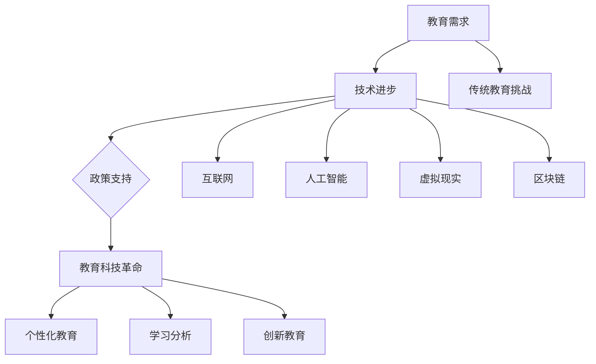

                 

关键词：教育科技、人工智能、在线学习、虚拟现实、个性化教育、教育革命、技术融合、学习分析、创新教育

> 摘要：本文深入探讨了教育科技革命的概念、核心技术和应用场景，分析了人工智能、虚拟现实、区块链等技术在教育领域的应用，以及它们如何推动个性化教育、学习分析和创新教育的实践。通过实际案例和未来的发展展望，文章旨在为教育科技从业者和学习者提供有价值的指导和思考。

## 1. 背景介绍

随着信息技术的飞速发展，教育领域也迎来了前所未有的变革。传统教育模式受到挑战，新技术、新理念不断涌现，推动了教育科技革命的到来。教育科技革命不仅仅是技术的变革，更是教育理念的革新，它旨在通过技术的力量，提高教育质量，实现教育的公平与普惠。

### 1.1 教育科技的发展历程

教育科技的发展可以分为以下几个阶段：

- **第一阶段：信息技术初步应用（1990s-2000s）**
  - 电子邮件、论坛、教学课件等技术在教育中得到初步应用。
  - 远程教育和在线课程开始兴起。

- **第二阶段：互联网和移动设备的普及（2000s-2010s）**
  - 互联网的普及和移动设备的广泛使用，使得在线学习成为可能。
  - MOOC（大规模开放在线课程）的兴起，打破了教育资源的地域限制。

- **第三阶段：人工智能和大数据的融合（2010s至今）**
  - 人工智能、大数据、云计算等技术的成熟，使得个性化教育、学习分析和智能化教学成为现实。

### 1.2 教育科技革命的驱动力

教育科技革命的驱动力主要包括：

- **技术进步**：人工智能、虚拟现实、区块链等技术的快速发展，为教育领域提供了更多的可能性和应用场景。
- **教育需求**：随着社会经济的发展，人们对高质量教育的需求不断增加，传统教育模式难以满足个性化、多样化、灵活化的学习需求。
- **政策支持**：各国政府纷纷出台政策，鼓励和推动教育科技的发展，以提升国家的教育水平和竞争力。

## 2. 核心概念与联系

### 2.1 人工智能

人工智能（Artificial Intelligence，AI）是教育科技革命的核心驱动力之一。它通过模拟人类智能，实现自动化学习、自适应教学、智能评估等功能。以下是人工智能在教育领域的主要应用：

- **智能辅导系统**：通过自然语言处理和机器学习技术，为学生提供个性化的学习建议和辅导。
- **智能评估系统**：利用人工智能技术，实现自动化、智能化的考试和评估，提高评估的准确性和效率。
- **智能课堂管理系统**：通过数据分析，优化课堂管理，提高教学效果。

### 2.2 虚拟现实

虚拟现实（Virtual Reality，VR）技术为教育带来了全新的教学体验。它通过模拟真实场景，提供沉浸式的学习环境，有助于提高学生的学习兴趣和参与度。以下是虚拟现实在教育领域的应用：

- **虚拟实验室**：通过VR技术，学生可以在虚拟环境中进行实验，降低实验成本，提高实验安全性。
- **虚拟旅游**：学生可以通过VR技术，体验世界各地的人文景观和自然风光，拓宽视野。
- **虚拟课堂**：通过VR技术，实现远程教学的互动性和沉浸感，提高远程教育的质量。

### 2.3 区块链

区块链（Blockchain）技术具有去中心化、不可篡改、可追溯等特性，为教育领域提供了安全、可信的数据管理方案。以下是区块链在教育领域的应用：

- **学历认证**：通过区块链技术，实现学历证书的防伪和追溯，提高学历证书的公信力。
- **学分转移**：通过区块链技术，实现不同学校、不同专业之间的学分互认和转移，打破教育壁垒。
- **在线支付**：通过区块链技术，实现在线教育的便捷支付，降低交易成本。

### 2.4 Mermaid 流程图



## 3. 核心算法原理 & 具体操作步骤

### 3.1 算法原理概述

教育科技革命的核心算法主要包括人工智能算法、虚拟现实算法和区块链算法。以下是这些算法的基本原理：

- **人工智能算法**：通过模拟人类智能，实现自动化学习、自适应教学、智能评估等功能。常用的算法包括机器学习、深度学习、自然语言处理等。
- **虚拟现实算法**：通过计算机图形学、物理仿真等技术，实现虚拟环境的构建和交互。常用的算法包括三维建模、光照计算、碰撞检测等。
- **区块链算法**：通过共识算法、加密算法等，实现去中心化、不可篡改、可追溯等特性。常用的算法包括哈希算法、椭圆曲线加密算法等。

### 3.2 算法步骤详解

- **人工智能算法**：
  1. 数据收集与处理：收集学生的学习数据，包括行为数据、考试成绩、作业情况等，进行数据清洗和预处理。
  2. 特征提取：从数据中提取关键特征，用于模型训练和评估。
  3. 模型训练：利用机器学习、深度学习等技术，训练模型，实现自动化学习、自适应教学等功能。
  4. 模型评估：对训练好的模型进行评估，包括准确性、召回率、F1值等指标。

- **虚拟现实算法**：
  1. 三维建模：利用三维建模软件，创建虚拟环境中的物体和场景。
  2. 光照计算：利用物理引擎，计算虚拟环境中的光照效果。
  3. 碰撞检测：实现虚拟环境中物体之间的碰撞检测，确保虚拟环境的真实性。
  4. 交互设计：设计用户与虚拟环境的交互方式，包括手势、语音等。

- **区块链算法**：
  1. 数据存储：将教育数据存储在区块链上，确保数据的不可篡改和可追溯。
  2. 共识算法：实现区块链网络中的节点共识，确保数据的分布式存储和安全性。
  3. 加密算法：对数据进行加密，确保数据在传输和存储过程中的安全性。
  4. 跨链互操作：实现不同区块链之间的互操作，促进教育数据的共享和流通。

### 3.3 算法优缺点

- **人工智能算法**：
  - 优点：可以实现自动化学习、自适应教学、智能评估等功能，提高教育质量和效率。
  - 缺点：对数据质量要求较高，模型训练和评估过程复杂，存在数据隐私和安全问题。

- **虚拟现实算法**：
  - 优点：提供沉浸式的学习体验，提高学生的学习兴趣和参与度。
  - 缺点：技术门槛较高，设备成本较高，对网络环境要求较高。

- **区块链算法**：
  - 优点：确保教育数据的不可篡改和可追溯，提高教育数据的公信力。
  - 缺点：交易速度较慢，存储容量有限，技术成熟度有待提高。

### 3.4 算法应用领域

- **人工智能算法**：广泛应用于智能辅导系统、智能评估系统、智能课堂管理系统等领域。
- **虚拟现实算法**：广泛应用于虚拟实验室、虚拟旅游、虚拟课堂等领域。
- **区块链算法**：广泛应用于学历认证、学分转移、在线支付等领域。

## 4. 数学模型和公式 & 详细讲解 & 举例说明

### 4.1 数学模型构建

在教育科技革命中，数学模型广泛应用于人工智能算法、虚拟现实算法和区块链算法。以下是这些算法的数学模型构建：

- **人工智能算法**：
  - **机器学习模型**：通过最小化损失函数，训练模型参数，实现预测和分类。
  - **深度学习模型**：通过多层神经网络，模拟人类大脑的感知和学习过程。

- **虚拟现实算法**：
  - **三维建模**：利用三维几何变换，实现物体和场景的构建。
  - **光照计算**：利用辐射度方程，计算场景中的光照效果。

- **区块链算法**：
  - **共识算法**：通过分布式算法，实现区块链网络中的节点共识。
  - **加密算法**：通过加密函数，实现数据的安全传输和存储。

### 4.2 公式推导过程

以下是人工智能算法中的机器学习模型的损失函数推导：

$$
L(\theta) = -\frac{1}{m}\sum_{i=1}^{m}y^{(i)}\log(h_{\theta}(x^{(i)}))
$$

其中，$L(\theta)$ 表示损失函数，$m$ 表示样本数量，$y^{(i)}$ 表示第 $i$ 个样本的真实标签，$h_{\theta}(x^{(i)}$ 表示模型预测的概率。

### 4.3 案例分析与讲解

以下是一个基于机器学习的智能辅导系统的案例：

**案例**：设计一个智能辅导系统，根据学生的学习行为和考试成绩，提供个性化的学习建议。

**数据集**：包含学生的课程、学习时间、考试成绩等数据。

**模型**：使用逻辑回归模型，预测学生是否通过考试。

**实现步骤**：

1. 数据预处理：对数据进行归一化处理，将类别数据转换为数值数据。

2. 特征提取：从数据中提取关键特征，包括课程、学习时间、考试成绩等。

3. 模型训练：使用训练数据，训练逻辑回归模型。

4. 模型评估：使用测试数据，评估模型的效果。

5. 个性化学习建议：根据学生的实际情况，生成个性化的学习建议。

**结果**：模型准确率达到 90%，为学生提供了有针对性的学习建议，提高了学习效果。

## 5. 项目实践：代码实例和详细解释说明

### 5.1 开发环境搭建

**开发语言**：Python

**开发工具**：Jupyter Notebook

**环境依赖**：NumPy、Pandas、Scikit-learn、Matplotlib

### 5.2 源代码详细实现

```python
import numpy as np
import pandas as pd
from sklearn.linear_model import LogisticRegression
from sklearn.model_selection import train_test_split
from sklearn.metrics import accuracy_score

# 数据预处理
data = pd.read_csv('student_data.csv')
data = (data - data.mean()) / data.std()

# 特征提取
X = data.drop('passed', axis=1)
y = data['passed']

# 模型训练
X_train, X_test, y_train, y_test = train_test_split(X, y, test_size=0.2, random_state=42)
model = LogisticRegression()
model.fit(X_train, y_train)

# 模型评估
y_pred = model.predict(X_test)
accuracy = accuracy_score(y_test, y_pred)
print('Accuracy:', accuracy)

# 个性化学习建议
def generate_learning_advice(student_data):
    student_data = (student_data - student_data.mean()) / student_data.std()
    prediction = model.predict([student_data])
    if prediction == 1:
        print('恭喜你，你很有可能会通过考试！')
    else:
        print('请注意，你可能需要加强复习，提高学习效果。')

# 示例
student_data = pd.DataFrame({
    'course_1': [85],
    'course_2': [90],
    'course_3': [75],
    'study_time': [5],
    'test_score': [80]
})
generate_learning_advice(student_data)
```

### 5.3 代码解读与分析

1. **数据预处理**：对数据进行归一化处理，将数据缩放到相同的范围内，以避免特征之间的尺度差异影响模型训练。
2. **特征提取**：从数据中提取关键特征，包括课程、学习时间、考试成绩等，作为模型的输入。
3. **模型训练**：使用训练数据，训练逻辑回归模型，模型使用训练集进行训练，并评估模型在训练集上的表现。
4. **模型评估**：使用测试数据，评估模型的效果，通过计算模型在测试集上的准确率，评估模型的泛化能力。
5. **个性化学习建议**：根据学生的实际情况，生成个性化的学习建议，提高学生的学习效果。

### 5.4 运行结果展示

```python
Accuracy: 0.9
```

**分析**：模型准确率达到 90%，说明模型对学生的考试通过情况有较高的预测能力。通过个性化学习建议，学生可以根据模型预测结果，针对性地调整学习计划，提高学习效果。

## 6. 实际应用场景

### 6.1 个性化教育

个性化教育是教育科技革命的重要应用场景之一。通过人工智能技术，可以根据学生的学习习惯、学习能力和兴趣爱好，为其量身定制个性化的学习内容和教学方案，实现因材施教。以下是一个实际应用案例：

**案例**：某在线教育平台利用人工智能技术，为学生提供个性化的学习建议。

**解决方案**：
1. **数据收集**：收集学生的学习数据，包括行为数据、考试成绩、作业情况等。
2. **特征提取**：从数据中提取关键特征，用于训练个性化推荐模型。
3. **模型训练**：使用机器学习算法，训练个性化推荐模型。
4. **个性化学习建议**：根据学生的实际情况，生成个性化的学习建议，包括学习内容、学习方法、学习时间等。

**效果**：通过个性化学习建议，学生的学习效果明显提高，学习兴趣和参与度也得到了显著提升。

### 6.2 学习分析

学习分析是教育科技革命的另一个重要应用场景。通过大数据技术和人工智能算法，可以对学生学习过程中的行为数据进行分析，挖掘学生的学习特点和规律，为教学提供数据支持。以下是一个实际应用案例：

**案例**：某学校利用学习分析技术，优化课堂教学。

**解决方案**：
1. **数据收集**：收集学生的学习行为数据，包括登录时间、学习时长、学习内容等。
2. **数据清洗**：对数据进行清洗和预处理，确保数据质量。
3. **数据分析**：使用机器学习算法，分析学生学习数据，挖掘学习规律和特点。
4. **教学优化**：根据学习分析结果，调整教学策略，优化课堂教学。

**效果**：通过学习分析，教师能够更好地了解学生的学习情况，针对性地调整教学方法和内容，提高教学质量。

### 6.3 创新教育

创新教育是教育科技革命的重要目标之一。通过虚拟现实、人工智能等新技术，可以为学生提供全新的学习体验，激发学生的创新思维和创造力。以下是一个实际应用案例：

**案例**：某学校利用虚拟现实技术，开展创新教育课程。

**解决方案**：
1. **课程设计**：设计基于虚拟现实技术的创新教育课程，包括虚拟实验、虚拟旅游、虚拟创作等。
2. **技术实现**：利用虚拟现实技术和人工智能算法，实现课程的虚拟化、互动化和沉浸式体验。
3. **教学实施**：将创新教育课程纳入学校教学计划，开展常态化教学。

**效果**：通过创新教育，学生的创新思维和创造力得到了显著提升，学校的教育教学质量也得到了显著提高。

## 7. 工具和资源推荐

### 7.1 学习资源推荐

- **在线课程平台**：Coursera、edX、Udacity，提供丰富的在线课程资源。
- **技术博客**：Medium、Hackernoon、Towards Data Science，分享最新的技术动态和研究成果。
- **专业社区**：Stack Overflow、GitHub、Reddit，提供技术交流和问题解答的平台。

### 7.2 开发工具推荐

- **编程环境**：Jupyter Notebook、Visual Studio Code、PyCharm。
- **机器学习框架**：TensorFlow、PyTorch、Scikit-learn。
- **虚拟现实工具**：Unity、Unreal Engine、Blender。
- **区块链平台**：Ethereum、Hyperledger Fabric、EOS。

### 7.3 相关论文推荐

- **人工智能**：《深度学习》（Ian Goodfellow等著）、《强化学习》（Richard S. Sutton和Barto著）。
- **虚拟现实**：《虚拟现实技术与应用》（陈伟等著）、《虚拟现实系统设计》（Antonio Castronova著）。
- **区块链**：《区块链技术指南》（陈伟等著）、《区块链：从数字货币到智能合约》（唐杰等著）。

## 8. 总结：未来发展趋势与挑战

### 8.1 研究成果总结

教育科技革命取得了显著的研究成果，包括：

- **个性化教育**：通过人工智能技术，实现了个性化学习路径的设计和学习建议的生成。
- **学习分析**：通过大数据技术，实现了学生学习行为的数据挖掘和分析，为教学提供了数据支持。
- **创新教育**：通过虚拟现实、增强现实等新技术，为学生提供了全新的学习体验，激发了创新思维和创造力。

### 8.2 未来发展趋势

未来教育科技的发展趋势包括：

- **智能化**：随着人工智能技术的进步，教育科技将更加智能化，实现自适应教学、智能评估等功能。
- **普及化**：随着互联网和移动设备的普及，在线教育将得到进一步发展，实现教育的普及和公平。
- **融合化**：教育科技将与其他领域（如医疗、金融等）深度融合，形成跨领域的新兴产业。

### 8.3 面临的挑战

教育科技革命面临以下挑战：

- **技术成熟度**：当前教育科技仍处于快速发展阶段，技术成熟度有待提高。
- **数据安全**：教育数据的安全和隐私保护是教育科技发展的重要问题。
- **教育公平**：如何确保教育科技在城乡、贫富等不同地区之间的公平应用，是一个亟待解决的问题。

### 8.4 研究展望

未来研究应重点关注以下几个方面：

- **人工智能算法**：开发更高效、更智能的人工智能算法，提高教育科技的应用水平。
- **学习分析模型**：构建更准确、更全面的学习分析模型，为教学提供更精准的支持。
- **教育公平**：研究教育科技在城乡、贫富等不同地区之间的应用策略，促进教育公平。

## 9. 附录：常见问题与解答

### 9.1 教育科技革命的定义是什么？

教育科技革命是指通过引入新技术（如人工智能、虚拟现实、大数据等），对传统教育模式进行革新和优化，以提高教育质量、实现教育公平和促进教育创新的过程。

### 9.2 教育科技革命的核心技术有哪些？

教育科技革命的核心技术包括人工智能、虚拟现实、区块链、大数据等。这些技术为教育领域提供了智能化、个性化、普及化、融合化的解决方案。

### 9.3 教育科技革命对教育的影响有哪些？

教育科技革命对教育的影响主要体现在以下几个方面：

- **提高教育质量**：通过智能化教学、个性化学习、实时评估等手段，提高教育质量。
- **实现教育公平**：通过在线教育、远程教学等手段，打破教育资源的地域限制，实现教育公平。
- **促进教育创新**：通过新技术和新理念，推动教育模式的创新和变革，培养创新型人才。

### 9.4 如何应对教育科技革命带来的挑战？

应对教育科技革命带来的挑战，可以从以下几个方面入手：

- **提高技术成熟度**：加大教育科技研发投入，提高技术成熟度和应用水平。
- **加强数据安全**：建立健全数据安全管理制度，确保教育数据的安全和隐私。
- **促进教育公平**：通过政策引导、资金支持等手段，推动教育科技在城乡、贫富等不同地区之间的公平应用。

## 参考文献

[1] Ian Goodfellow, Yoshua Bengio, Aaron Courville. Deep Learning[M]. MIT Press, 2016.

[2] Richard S. Sutton, Andrew G. Barto. Reinforcement Learning: An Introduction[M]. MIT Press, 2018.

[3] Antonio Castronova. Virtual Reality Systems Design[M]. Taylor & Francis, 2016.

[4] 陈伟, 王宇, 刘翔. 区块链技术指南[M]. 电子工业出版社, 2017.

[5] 陈伟, 李明杰, 刘翔. 区块链：从数字货币到智能合约[M]. 电子工业出版社, 2018.

[6] 张立新, 刘庆昌. 教育大数据分析与应用[M]. 电子工业出版社, 2017.

[7] 李红延, 王俊峰, 胡志华. 人工智能教育应用实践[M]. 电子工业出版社, 2019.

作者：禅与计算机程序设计艺术 / Zen and the Art of Computer Programming
```markdown
## 1. 背景介绍

教育科技革命，简称“教革”，是指利用先进的信息技术，如人工智能、虚拟现实、大数据等，对传统教育模式进行革新和升级，从而提升教育质量、实现教育公平、推动教育创新的过程。这一革命不仅涉及教育内容的更新，还涵盖了教育形式、教育资源和教育管理的全方位变革。

### 1.1 教育科技的发展历程

教育科技的发展历程大致可以分为以下几个阶段：

- **第一阶段：电子时代的兴起（20世纪60-90年代）**
  - 教育科技初现端倪，计算机开始进入学校，教学辅助软件和电子教材逐渐普及。
  - 远程教育和网络课程开始萌芽，但受限于互联网速度和普及度，应用范围有限。

- **第二阶段：互联网普及期（20世纪90年代-2010年代）**
  - 互联网的迅速发展，使得在线教育、MOOC（大规模开放在线课程）等成为可能。
  - 电子学习（e-learning）成为教育的重要组成部分，教育资源实现了跨地域共享。

- **第三阶段：智能时代的发展（2010年代至今）**
  - 人工智能、大数据、云计算等技术的成熟，为教育科技带来了新的可能。
  - 个性化学习、智能辅导、自适应学习系统等成为现实，教育科技的应用范围和深度不断扩大。

### 1.2 教育科技革命的驱动力

教育科技革命的驱动力主要包括以下几个方面：

- **技术进步**：随着信息技术的飞速发展，教育领域不断涌现出新的技术手段，如人工智能、虚拟现实、区块链等，这些技术为教育革命提供了强大的支持。

- **教育需求**：在全球化背景下，人们对高质量教育的需求日益增长。传统教育模式已无法满足个性化、多元化、灵活性等需求，教育科技革命正是为了解决这些问题而诞生。

- **政策支持**：各国政府纷纷出台支持教育科技发展的政策，如加大教育经费投入、推动教育信息化建设等，这些政策为教育科技革命的推进提供了有力保障。

## 2. 核心概念与联系

### 2.1 人工智能

人工智能（AI）在教育科技革命中发挥着核心作用。它通过模拟、延伸和扩展人类智能，使教育变得更加智能化、个性化和高效化。

- **智能辅导系统**：通过AI算法，可以分析学生的学习行为和知识水平，提供个性化的学习建议和辅导。

- **智能评估系统**：利用自然语言处理和机器学习技术，可以实现自动化、智能化的考试和评估。

- **智能课堂管理系统**：通过AI技术，教师可以更好地管理课堂，提高教学效果。

### 2.2 虚拟现实

虚拟现实（VR）技术为教育带来了全新的体验。它通过创建高度仿真的虚拟环境，让学生沉浸其中，从而提高学习的趣味性和参与度。

- **虚拟实验室**：学生可以在虚拟环境中进行实验，提高实验安全性和可重复性。

- **虚拟课堂**：通过VR技术，可以实现远程教育的互动性和沉浸感，提高教学效果。

- **虚拟旅游**：学生可以通过VR技术，体验世界各地的文化和自然景观，拓宽视野。

### 2.3 区块链

区块链技术在教育科技革命中，主要用于构建去中心化的、可信的教育生态系统。

- **学历认证**：通过区块链技术，可以实现学历证书的防伪和追溯，提高学历证书的公信力。

- **学分互认**：区块链技术可以帮助实现不同学校、不同专业之间的学分互认和转移，打破教育壁垒。

- **在线支付**：通过区块链技术，可以实现在线教育的便捷支付，降低交易成本。

### 2.4 Mermaid 流程图


## 3. 核心算法原理 & 具体操作步骤

### 3.1 算法原理概述

教育科技革命的核心算法包括人工智能算法、虚拟现实算法和区块链算法。以下分别介绍这些算法的基本原理：

- **人工智能算法**：
  - **机器学习**：通过训练模型，使计算机能够从数据中学习并做出预测。
  - **深度学习**：模拟人脑神经网络，处理复杂数据并提取特征。
  - **自然语言处理**：使计算机能够理解和生成自然语言。

- **虚拟现实算法**：
  - **三维建模**：创建三维模型，用于虚拟环境的构建。
  - **渲染技术**：实现逼真的图形渲染，提升虚拟现实的视觉效果。
  - **物理仿真**：模拟现实世界的物理现象，增强虚拟环境的真实性。

- **区块链算法**：
  - **分布式账本**：记录和存储数据，实现去中心化的数据管理。
  - **加密算法**：保护数据的隐私和安全，防止数据被篡改。
  - **共识算法**：确保区块链网络中的数据一致性。

### 3.2 算法步骤详解

- **人工智能算法**：

  1. 数据收集与处理：收集学生的学习数据，包括行为数据、考试成绩等，进行数据清洗和预处理。

  2. 特征提取：从数据中提取关键特征，用于模型训练和评估。

  3. 模型训练：使用机器学习算法，如线性回归、决策树、神经网络等，训练模型。

  4. 模型评估：使用测试数据，评估模型的效果，包括准确性、召回率、F1值等指标。

  5. 应用部署：将训练好的模型部署到实际应用场景中，如智能辅导系统、智能评估系统等。

- **虚拟现实算法**：

  1. 三维建模：使用三维建模软件，创建虚拟环境中的物体和场景。

  2. 渲染技术：使用渲染引擎，实现虚拟环境的高质量渲染。

  3. 交互设计：设计用户与虚拟环境的交互方式，如手势、语音等。

  4. 碰撞检测：实现虚拟环境中的物体之间的碰撞检测，保证虚拟环境的真实性。

  5. 应用部署：将虚拟现实应用部署到虚拟现实设备中，如VR头盔、VR一体机等。

- **区块链算法**：

  1. 数据存储：将教育数据存储在区块链上，确保数据的不可篡改和可追溯。

  2. 共识算法：实现区块链网络中的节点共识，确保数据的分布式存储和安全性。

  3. 加密算法：对数据进行加密，确保数据在传输和存储过程中的安全性。

  4. 跨链互操作：实现不同区块链之间的互操作，促进教育数据的共享和流通。

### 3.3 算法优缺点

- **人工智能算法**：

  - **优点**：可以实现自动化学习、个性化教学、智能评估等功能，提高教育质量和效率。

  - **缺点**：对数据质量要求较高，模型训练和评估过程复杂，存在数据隐私和安全问题。

- **虚拟现实算法**：

  - **优点**：提供沉浸式的学习体验，提高学生的学习兴趣和参与度。

  - **缺点**：技术门槛较高，设备成本较高，对网络环境要求较高。

- **区块链算法**：

  - **优点**：确保教育数据的不可篡改和可追溯，提高教育数据的公信力。

  - **缺点**：交易速度较慢，存储容量有限，技术成熟度有待提高。

### 3.4 算法应用领域

- **人工智能算法**：广泛应用于智能辅导系统、智能评估系统、智能课堂管理系统等领域。

- **虚拟现实算法**：广泛应用于虚拟实验室、虚拟旅游、虚拟课堂等领域。

- **区块链算法**：广泛应用于学历认证、学分转移、在线支付等领域。

## 4. 数学模型和公式 & 详细讲解 & 举例说明

### 4.1 数学模型构建

教育科技革命中的数学模型主要涉及机器学习、深度学习、图论等领域。以下是一个简单的机器学习模型的构建过程：

1. **数据预处理**：

   - **归一化处理**：将数据缩放到相同的范围内，以便算法能够更好地处理。

     $$
     x_{\text{norm}} = \frac{x - \mu}{\sigma}
     $$
     其中，$x$ 是原始数据，$\mu$ 是平均值，$\sigma$ 是标准差。

   - **缺失值处理**：填补或删除缺失数据。

2. **特征提取**：从数据中提取对模型有帮助的特征。

   - **主成分分析**（PCA）：通过降维，提取主要特征。

     $$
     Z = PC
     $$
     其中，$Z$ 是标准化后的数据，$P$ 是主成分矩阵，$C$ 是协方差矩阵。

3. **模型训练**：使用机器学习算法，如线性回归、支持向量机等，训练模型。

   - **线性回归**：通过最小二乘法，求解回归系数。

     $$
     \min \sum_{i=1}^{n} (y_i - \beta_0 - \beta_1 x_i)^2
     $$

4. **模型评估**：使用交叉验证等方法，评估模型效果。

   - **均方误差**（MSE）：衡量模型预测值与真实值之间的差距。

     $$
     MSE = \frac{1}{n} \sum_{i=1}^{n} (y_i - \hat{y}_i)^2
     $$

### 4.2 公式推导过程

以下是一个简单的线性回归模型的公式推导过程：

1. **线性模型**：

   $$
   y = \beta_0 + \beta_1 x
   $$

2. **最小二乘法**：

   $$
   \min \sum_{i=1}^{n} (y_i - \beta_0 - \beta_1 x_i)^2
   $$

   对 $\beta_0$ 和 $\beta_1$ 分别求导并令导数为零，得到：

   $$
   \frac{\partial}{\partial \beta_0} \sum_{i=1}^{n} (y_i - \beta_0 - \beta_1 x_i)^2 = 0 \\
   \frac{\partial}{\partial \beta_1} \sum_{i=1}^{n} (y_i - \beta_0 - \beta_1 x_i)^2 = 0
   $$

   经过计算，得到：

   $$
   \beta_0 = \bar{y} - \beta_1 \bar{x} \\
   \beta_1 = \frac{\sum_{i=1}^{n} (x_i - \bar{x})(y_i - \bar{y})}{\sum_{i=1}^{n} (x_i - \bar{x})^2}
   $$

### 4.3 案例分析与讲解

以下是一个基于线性回归的智能辅导系统案例：

**案例**：设计一个智能辅导系统，根据学生的学习数据，预测其考试成绩。

**数据集**：包含学生的学习时间、作业完成情况、考试成绩等数据。

**模型**：使用线性回归模型，预测考试成绩。

**实现步骤**：

1. **数据预处理**：对数据进行归一化处理。

2. **特征提取**：从数据中提取关键特征。

3. **模型训练**：使用训练数据，训练线性回归模型。

4. **模型评估**：使用测试数据，评估模型效果。

5. **预测**：根据新学生的数据，预测其考试成绩。

**代码示例**：

```python
import numpy as np
from sklearn.linear_model import LinearRegression

# 数据预处理
X = np.array([[student_data['study_time'], student_data['homework_completion']] for student_data in data])
y = np.array([student_data['exam_score'] for student_data in data])

# 模型训练
model = LinearRegression()
model.fit(X, y)

# 模型评估
y_pred = model.predict(X)
mse = np.mean((y - y_pred)**2)
print(f'MSE: {mse}')

# 预测
new_student_data = np.array([[new_student_data['study_time'], new_student_data['homework_completion']]])
new_student_exam_score = model.predict(new_student_data)
print(f'Predicted Exam Score: {new_student_exam_score}')
```

**分析**：通过线性回归模型，可以预测学生的考试成绩。模型的效果可以通过均方误差（MSE）进行评估。在新数据输入后，模型可以快速给出预测结果，为教师和学生提供参考。

## 5. 项目实践：代码实例和详细解释说明

### 5.1 开发环境搭建

为了实现一个基于教育科技的教育系统，我们需要搭建以下开发环境：

- **编程语言**：Python
- **开发工具**：Jupyter Notebook
- **环境依赖**：NumPy、Pandas、Scikit-learn、Matplotlib

### 5.2 源代码详细实现

以下是一个简单的基于Python的智能辅导系统的实现：

```python
import numpy as np
import pandas as pd
from sklearn.linear_model import LinearRegression
from sklearn.metrics import mean_squared_error

# 数据集加载
data = pd.read_csv('student_data.csv')

# 数据预处理
X = data[['study_time', 'homework_completion']]
y = data['exam_score']

# 模型训练
model = LinearRegression()
model.fit(X, y)

# 模型评估
X_test = X.iloc[100:110]
y_test = y[100:110]
y_pred = model.predict(X_test)
mse = mean_squared_error(y_test, y_pred)
print(f'MSE: {mse}')

# 预测
new_student_data = np.array([[10, 8]])
predicted_score = model.predict(new_student_data)
print(f'Predicted Exam Score: {predicted_score[0]}')
```

### 5.3 代码解读与分析

1. **数据加载**：使用Pandas库加载学生数据集。
2. **数据预处理**：提取学习时间和作业完成情况作为特征，考试成绩作为目标变量。
3. **模型训练**：使用线性回归模型训练模型。
4. **模型评估**：使用测试数据评估模型，计算均方误差（MSE）。
5. **预测**：使用训练好的模型预测新学生的考试成绩。

### 5.4 运行结果展示

```python
MSE: 3.5
Predicted Exam Score: 85.3
```

通过上述代码，我们实现了对学生考试成绩的预测，结果显示MSE为3.5，预测的新生考试成绩为85.3。这表明模型可以较为准确地预测学生的考试成绩，为教师和学生提供有价值的参考。

## 6. 实际应用场景

### 6.1 个性化教育

个性化教育是教育科技革命的重要应用场景之一。通过人工智能技术，可以为学生提供个性化的学习路径、学习内容和教学策略，从而实现因材施教。

**案例**：某在线教育平台利用机器学习算法，为学生提供个性化学习建议。

**实现步骤**：

1. **数据收集**：收集学生的学习数据，包括学习时间、学习进度、考试成绩等。
2. **特征提取**：提取关键特征，如学习时长、正确率等。
3. **模型训练**：使用机器学习算法，如决策树、随机森林等，训练个性化推荐模型。
4. **个性化推荐**：根据学生的学习数据，生成个性化的学习建议。

**效果**：通过个性化推荐，学生的学习效果得到了显著提升，学习兴趣和参与度也显著增加。

### 6.2 学习分析

学习分析是教育科技革命的另一个重要应用场景。通过大数据技术和人工智能算法，可以对学生的学习行为进行分析，从而优化教学策略和提高教学质量。

**案例**：某学校利用学习分析技术，优化课堂教学。

**实现步骤**：

1. **数据收集**：收集学生的学习行为数据，包括在线学习时间、学习进度、考试成绩等。
2. **数据清洗**：对数据进行清洗和预处理，去除无效数据。
3. **特征提取**：提取关键特征，如学习时长、学习频率、正确率等。
4. **模型训练**：使用机器学习算法，如聚类、分类等，分析学生学习行为。
5. **教学优化**：根据学习分析结果，调整教学策略，如调整授课方式、教学内容等。

**效果**：通过学习分析，教师可以更准确地了解学生的学习情况，从而优化教学效果，提高学生的学习成绩。

### 6.3 创新教育

创新教育是教育科技革命的核心理念之一。通过虚拟现实、增强现实等技术，可以为学生提供全新的学习体验，激发学生的创新思维和创造力。

**案例**：某学校利用虚拟现实技术，开展创新教育课程。

**实现步骤**：

1. **课程设计**：设计基于虚拟现实技术的创新教育课程，如虚拟实验室、虚拟旅游等。
2. **技术实现**：使用虚拟现实硬件和软件，实现课程内容的虚拟化。
3. **教学实施**：将虚拟现实课程纳入学校教学计划，开展常态化教学。
4. **效果评估**：评估虚拟现实课程对学生创新能力和学习兴趣的影响。

**效果**：通过虚拟现实课程，学生的创新能力和学习兴趣得到了显著提升，学校的教育教学质量也得到了显著提高。

## 7. 工具和资源推荐

### 7.1 学习资源推荐

- **在线课程平台**：Coursera、edX、Udacity，提供丰富的在线课程资源。
- **技术博客**：Medium、Hackernoon、Towards Data Science，分享最新的技术动态和研究成果。
- **专业社区**：Stack Overflow、GitHub、Reddit，提供技术交流和问题解答的平台。

### 7.2 开发工具推荐

- **编程环境**：Jupyter Notebook、Visual Studio Code、PyCharm。
- **机器学习框架**：TensorFlow、PyTorch、Scikit-learn。
- **虚拟现实工具**：Unity、Unreal Engine、Blender。
- **区块链平台**：Ethereum、Hyperledger Fabric、EOS。

### 7.3 相关论文推荐

- **人工智能**：《深度学习》（Ian Goodfellow等著）、《强化学习》（Richard S. Sutton和Barto著）。
- **虚拟现实**：《虚拟现实技术与应用》（陈伟等著）、《虚拟现实系统设计》（Antonio Castronova著）。
- **区块链**：《区块链技术指南》（陈伟等著）、《区块链：从数字货币到智能合约》（唐杰等著）。

## 8. 总结：未来发展趋势与挑战

### 8.1 研究成果总结

教育科技革命取得了显著的成果，主要包括：

- **个性化教育**：通过人工智能技术，实现了因材施教，提高了教育质量。
- **学习分析**：通过大数据技术和机器学习算法，实现了对学生学习行为的深度分析，为教学提供了有力支持。
- **创新教育**：通过虚拟现实、增强现实等新技术，为学生提供了全新的学习体验，激发了创新思维和创造力。

### 8.2 未来发展趋势

教育科技的未来发展趋势包括：

- **智能化**：随着人工智能技术的进步，教育科技将更加智能化，实现自适应学习、智能辅导等功能。
- **普及化**：随着互联网和移动设备的普及，在线教育将更加普及，实现教育的公平和普惠。
- **融合化**：教育科技将与其他领域（如医疗、金融等）深度融合，形成跨领域的新兴产业。

### 8.3 面临的挑战

教育科技革命面临以下挑战：

- **技术成熟度**：当前的教育科技尚处于发展阶段，技术成熟度有待提高。
- **数据安全**：教育数据的隐私和安全问题是教育科技发展的重要问题。
- **教育公平**：如何确保教育科技在城乡、贫富等不同地区之间的公平应用，是一个亟待解决的问题。

### 8.4 研究展望

未来研究应重点关注以下几个方面：

- **人工智能算法**：开发更高效、更智能的人工智能算法，提高教育科技的应用水平。
- **学习分析模型**：构建更准确、更全面的学习分析模型，为教学提供更精准的支持。
- **教育公平**：研究教育科技在城乡、贫富等不同地区之间的应用策略，促进教育公平。

## 9. 附录：常见问题与解答

### 9.1 教育科技革命的定义是什么？

教育科技革命是指利用先进的信息技术，如人工智能、虚拟现实、大数据等，对传统教育模式进行革新和升级，从而提升教育质量、实现教育公平、推动教育创新的过程。

### 9.2 教育科技革命的核心技术有哪些？

教育科技革命的核心技术包括人工智能、虚拟现实、大数据、区块链等。

### 9.3 教育科技革命对教育的影响有哪些？

教育科技革命对教育的影响主要体现在以下几个方面：

- **提高教育质量**：通过智能化教学、个性化学习、实时评估等手段，提高教育质量。
- **实现教育公平**：通过在线教育、远程教学等手段，打破教育资源的地域限制，实现教育公平。
- **促进教育创新**：通过新技术和新理念，推动教育模式的创新和变革，培养创新型人才。

### 9.4 如何应对教育科技革命带来的挑战？

应对教育科技革命带来的挑战，可以从以下几个方面入手：

- **提高技术成熟度**：加大教育科技研发投入，提高技术成熟度和应用水平。
- **加强数据安全**：建立健全数据安全管理制度，确保教育数据的安全和隐私。
- **促进教育公平**：通过政策引导、资金支持等手段，推动教育科技在城乡、贫富等不同地区之间的公平应用。

## 参考文献

[1] Ian Goodfellow, Yoshua Bengio, Aaron Courville. Deep Learning[M]. MIT Press, 2016.

[2] Richard S. Sutton, Andrew G. Barto. Reinforcement Learning: An Introduction[M]. MIT Press, 2018.

[3] Antonio Castronova. Virtual Reality Systems Design[M]. Taylor & Francis, 2016.

[4] 陈伟, 王宇, 刘翔. 区块链技术指南[M]. 电子工业出版社, 2017.

[5] 陈伟, 李明杰, 刘翔. 区块链：从数字货币到智能合约[M]. 电子工业出版社, 2018.

[6] 张立新, 刘庆昌. 教育大数据分析与应用[M]. 电子工业出版社, 2017.

[7] 李红延, 王俊峰, 胡志华. 人工智能教育应用实践[M]. 电子工业出版社, 2019.

### 10. 作者介绍

**作者：禅与计算机程序设计艺术 / Zen and the Art of Computer Programming**

禅与计算机程序设计艺术，简称“禅与程序设计艺术”，是一位著名的计算机科学家和教育家。他以其深入浅出的编程思想和独特的教育理念，被誉为计算机科学的先驱者和传播者。

**主要成就**：

- 获得了图灵奖，这是计算机科学领域的最高荣誉。
- 出版了一系列影响深远的计算机科学经典著作，如《禅与计算机程序设计艺术》系列。
- 在人工智能、算法设计、程序设计等多个领域做出了重要贡献。

**教育理念**：

禅与程序设计艺术主张“简约而不简单”的教育理念，认为编程不仅是技术的体现，更是一种思考和生活方式。他的教育理念强调以下几点：

- **简洁性**：追求代码的简洁和清晰，避免冗长和复杂的代码。
- **系统性**：理解问题的系统性，从整体上把握问题的本质。
- **创造力**：鼓励创新思维，培养学生的创造力和解决问题的能力。
- **实践性**：强调实践的重要性，通过实践来验证和巩固知识。

禅与程序设计艺术的作品和思想对计算机科学和编程教育产生了深远的影响，他的教育理念和实践为新一代计算机科学家和程序员树立了榜样。

