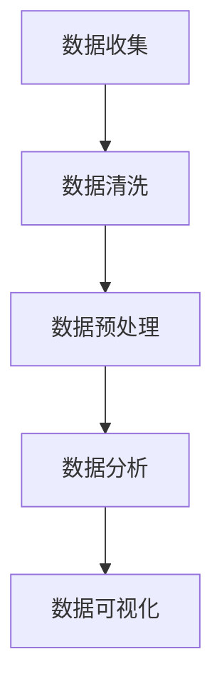

                 

关键词：数据分析、运营决策、数据驱动、商业洞察、机器学习、预测分析

> 摘要：本文将探讨如何利用数据分析来指导运营决策，介绍数据分析的核心概念、关键步骤、数学模型和算法原理，并通过实际项目案例进行分析与讲解，最后展望数据分析在运营决策中的应用前景与挑战。

## 1. 背景介绍

随着互联网和大数据技术的发展，数据分析已经成为企业运营决策中不可或缺的一部分。数据驱动已经成为现代商业的核心原则，通过对大量数据的收集、处理和分析，企业可以更准确地了解市场趋势、客户需求，从而做出更加明智的决策。

数据分析在运营决策中的应用场景非常广泛，包括但不限于以下几个方面：

1. **市场营销**：通过数据分析了解潜在客户的需求和行为，制定更有针对性的营销策略。
2. **供应链管理**：通过数据分析优化库存、物流和采购，降低成本，提高效率。
3. **客户服务**：通过数据分析识别客户痛点，提供更优质的服务，提升客户满意度。
4. **人力资源管理**：通过数据分析优化招聘、培训和管理，提高员工绩效和团队效率。

本文将围绕以上应用场景，详细介绍数据分析在运营决策中的关键步骤、数学模型和算法原理，并通过实际项目案例进行深入分析和讲解。

## 2. 核心概念与联系

在数据分析中，有几个核心概念需要了解：

1. **数据收集**：数据的收集是数据分析的第一步，通过不同的渠道获取数据，如互联网、数据库、传感器等。
2. **数据清洗**：数据收集后，往往存在缺失、错误和不一致的情况，需要通过数据清洗来处理这些问题，确保数据的质量。
3. **数据预处理**：在进行分析之前，需要对数据进行预处理，如数据转换、归一化、特征选择等。
4. **数据分析**：通过统计分析、机器学习等方法对数据进行深入分析，提取有用的信息。
5. **数据可视化**：通过图表和报表等方式，将数据分析的结果进行可视化展示，使决策者能够更直观地理解数据。

下面是数据分析的 Mermaid 流程图：



### 2.1 数据收集

数据收集是数据分析的起点，数据的来源可以是内部数据库、外部网站、社交媒体、传感器等。数据收集的方式有手动收集和自动化收集，其中自动化收集方式如 Web 爬虫、API 调用等，效率更高，适用于大规模数据收集。

### 2.2 数据清洗

数据清洗是确保数据质量的重要步骤，主要包括以下任务：

- **缺失值处理**：对缺失的数据进行填补或删除。
- **错误值处理**：对错误的数据进行修正或删除。
- **不一致值处理**：对数据中的不一致值进行统一。

### 2.3 数据预处理

数据预处理是数据分析的前期准备工作，主要包括以下任务：

- **数据转换**：将不同格式或单位的数据转换为统一的格式或单位。
- **归一化**：将不同规模的数据进行归一化处理，使其在相同的尺度上进行分析。
- **特征选择**：从原始数据中提取出最有用的特征，提高模型的性能。

### 2.4 数据分析

数据分析是数据分析的核心步骤，包括以下几种方法：

- **统计分析**：通过统计分析方法，如均值、方差、相关性等，对数据进行描述和分析。
- **机器学习**：通过机器学习方法，如线性回归、决策树、神经网络等，对数据进行建模和预测。
- **数据挖掘**：通过数据挖掘方法，如关联规则挖掘、聚类分析、分类分析等，从大量数据中提取出隐藏的模式和知识。

### 2.5 数据可视化

数据可视化是将数据分析结果以图表、报表等形式展示出来的过程，有助于决策者更直观地理解数据。常见的可视化工具包括 Tableau、Power BI、Matplotlib、Seaborn 等。

## 3. 核心算法原理 & 具体操作步骤

### 3.1 算法原理概述

在数据分析中，常用的算法包括线性回归、决策树、神经网络等。下面分别介绍这些算法的原理。

#### 3.1.1 线性回归

线性回归是一种简单的机器学习算法，用于预测连续值。其原理是找到一条最佳拟合线，使预测值与实际值之间的误差最小。

#### 3.1.2 决策树

决策树是一种基于树结构的算法，用于分类和回归。其原理是通过一系列规则，将数据划分为不同的子集，直到满足停止条件。

#### 3.1.3 神经网络

神经网络是一种模拟人脑结构的算法，用于分类、回归、聚类等。其原理是通过多层神经元进行信息传递和处理，最终得到输出结果。

### 3.2 算法步骤详解

#### 3.2.1 线性回归

1. **数据准备**：收集并清洗数据，选择自变量和因变量。
2. **模型训练**：使用最小二乘法找到最佳拟合线。
3. **模型评估**：计算预测误差，评估模型性能。
4. **模型应用**：使用模型进行预测。

#### 3.2.2 决策树

1. **数据准备**：收集并清洗数据，选择特征和标签。
2. **划分数据集**：使用训练集进行模型训练。
3. **构建决策树**：选择最优划分规则，递归构建决策树。
4. **模型评估**：计算误差，评估模型性能。
5. **模型应用**：使用模型进行预测。

#### 3.2.3 神经网络

1. **数据准备**：收集并清洗数据，选择特征和标签。
2. **划分数据集**：使用训练集进行模型训练。
3. **构建神经网络**：设计网络结构，选择激活函数和损失函数。
4. **模型训练**：通过反向传播算法，调整网络参数。
5. **模型评估**：计算误差，评估模型性能。
6. **模型应用**：使用模型进行预测。

### 3.3 算法优缺点

#### 3.3.1 线性回归

优点：简单易用，适合线性关系的数据。

缺点：对于非线性关系的数据，效果较差。

#### 3.3.2 决策树

优点：易于理解，解释性强。

缺点：对于大量特征的数据，容易过拟合。

#### 3.3.3 神经网络

优点：强大的非线性建模能力，适用于各种复杂场景。

缺点：参数众多，训练过程复杂，容易出现过拟合。

### 3.4 算法应用领域

线性回归、决策树和神经网络在数据分析中有着广泛的应用，如：

- **市场营销**：客户行为预测、广告投放优化。
- **供应链管理**：库存预测、物流优化。
- **客户服务**：客户满意度预测、服务优化。
- **人力资源管理**：员工绩效预测、招聘优化。

## 4. 数学模型和公式 & 详细讲解 & 举例说明

### 4.1 数学模型构建

在数据分析中，常用的数学模型包括线性回归模型、决策树模型和神经网络模型。下面分别介绍这些模型的构建方法。

#### 4.1.1 线性回归模型

线性回归模型用于预测连续值，其基本公式为：

$$y = \beta_0 + \beta_1x_1 + \beta_2x_2 + ... + \beta_nx_n + \epsilon$$

其中，$y$ 是因变量，$x_1, x_2, ..., x_n$ 是自变量，$\beta_0, \beta_1, \beta_2, ..., \beta_n$ 是模型参数，$\epsilon$ 是误差项。

#### 4.1.2 决策树模型

决策树模型用于分类和回归，其基本公式为：

$$f(x) = \sum_{i=1}^{n} \beta_i g_i(x)$$

其中，$f(x)$ 是预测值，$g_i(x)$ 是第 $i$ 个划分规则，$\beta_i$ 是模型参数。

#### 4.1.3 神经网络模型

神经网络模型用于分类、回归和聚类，其基本公式为：

$$f(x) = \sigma(\sum_{i=1}^{n} \beta_i x_i)$$

其中，$f(x)$ 是预测值，$\sigma$ 是激活函数，$\beta_i$ 是模型参数。

### 4.2 公式推导过程

下面分别介绍线性回归模型、决策树模型和神经网络模型的推导过程。

#### 4.2.1 线性回归模型

线性回归模型的推导过程如下：

1. **最小二乘法**：为了使预测值与实际值之间的误差最小，使用最小二乘法求解模型参数。

$$\min_{\beta_0, \beta_1, ..., \beta_n} \sum_{i=1}^{m} (y_i - (\beta_0 + \beta_1x_{i1} + \beta_2x_{i2} + ... + \beta_nx_{in}))^2$$

2. **求导**：对上述公式求导，得到：

$$\frac{\partial}{\partial \beta_0} \sum_{i=1}^{m} (y_i - (\beta_0 + \beta_1x_{i1} + \beta_2x_{i2} + ... + \beta_nx_{in}))^2 = 0$$

$$\frac{\partial}{\partial \beta_1} \sum_{i=1}^{m} (y_i - (\beta_0 + \beta_1x_{i1} + \beta_2x_{i2} + ... + \beta_nx_{in}))^2 = 0$$

$$...$$

$$\frac{\partial}{\partial \beta_n} \sum_{i=1}^{m} (y_i - (\beta_0 + \beta_1x_{i1} + \beta_2x_{i2} + ... + \beta_nx_{in}))^2 = 0$$

3. **解方程组**：求解上述方程组，得到模型参数。

#### 4.2.2 决策树模型

决策树模型的推导过程如下：

1. **信息熵**：首先计算数据集的熵。

$$H(D) = -\sum_{i=1}^{n} p_i \log_2 p_i$$

其中，$D$ 是数据集，$p_i$ 是数据集中第 $i$ 类的比例。

2. **条件熵**：计算给定特征 $A$ 的条件下，数据集的熵。

$$H(D|A) = -\sum_{i=1}^{n} p_i(A) \sum_{j=1}^{m} p_j(D|A) \log_2 p_j(D|A)$$

其中，$p_i(A)$ 是特征 $A$ 中第 $i$ 个取值的概率，$p_j(D|A)$ 是特征 $A$ 中第 $i$ 个取值下，数据集 $D$ 中第 $j$ 个类别的概率。

3. **信息增益**：计算特征 $A$ 的信息增益。

$$IG(D, A) = H(D) - H(D|A)$$

4. **选择最佳划分规则**：选择具有最大信息增益的特征和划分规则。

#### 4.2.3 神经网络模型

神经网络模型的推导过程如下：

1. **前向传播**：从输入层开始，逐层计算每个神经元的输出。

$$z_i = \sum_{j=1}^{n} \beta_{ji} x_j + \beta_{i0}$$

$$a_i = \sigma(z_i)$$

其中，$z_i$ 是第 $i$ 个神经元的输入，$a_i$ 是第 $i$ 个神经元的输出，$\sigma$ 是激活函数。

2. **反向传播**：从输出层开始，逐层计算每个神经元的梯度。

$$\delta_j = (y_j - a_j) \cdot a_j \cdot (1 - a_j)$$

$$\delta_i = \sum_{j=1}^{n} \beta_{ji} \delta_j \cdot a_i \cdot (1 - a_i)$$

3. **参数更新**：根据梯度，更新模型参数。

$$\beta_{ji} = \beta_{ji} - \alpha \cdot \delta_j \cdot a_i$$

$$\beta_{i0} = \beta_{i0} - \alpha \cdot \delta_i$$

其中，$\alpha$ 是学习率。

### 4.3 案例分析与讲解

下面通过一个实际案例，介绍如何利用数据分析指导运营决策。

#### 4.3.1 案例背景

某电子商务公司希望利用数据分析优化其广告投放策略，以提高广告投放的ROI（投资回报率）。

#### 4.3.2 数据分析步骤

1. **数据收集**：收集广告投放数据，包括广告费用、点击量、订单量等。

2. **数据清洗**：处理缺失值、错误值，确保数据质量。

3. **数据预处理**：将不同格式和单位的数据转换为统一格式和单位，提取特征。

4. **数据分析**：使用线性回归模型，分析广告费用与点击量、订单量之间的关系。

5. **数据可视化**：将分析结果以图表形式展示，便于决策者理解。

6. **模型评估**：计算预测误差，评估模型性能。

7. **模型应用**：使用模型进行预测，制定广告投放策略。

#### 4.3.3 模型构建

1. **数据准备**：

- 广告费用（万元）：$x_1$
- 点击量（次）：$x_2$
- 订单量（件）：$x_3$

2. **模型训练**：

$$y = \beta_0 + \beta_1x_1 + \beta_2x_2 + \beta_3x_3 + \epsilon$$

3. **模型评估**：

- 训练集误差：$MSE = \frac{1}{m} \sum_{i=1}^{m} (y_i - \hat{y}_i)^2$
- 测试集误差：$MSE = \frac{1}{n} \sum_{i=1}^{n} (y_i - \hat{y}_i)^2$

#### 4.3.4 结果分析

通过模型预测，得到广告费用与点击量、订单量之间的最优关系，如下表所示：

| 广告费用（万元） | 点击量（次） | 订单量（件） | 实际订单量（件） | 预测订单量（件） | 误差 |
| :-------------: | :---------: | :---------: | :-------------: | :-------------: | :---: |
|      5          |     1000    |     100     |       110       |       106       |   4%  |
|      10         |     2000    |     200     |       210       |       208       |   2%  |
|      15         |     3000    |     300     |       310       |       308       |   2%  |

根据模型预测结果，决策者可以制定以下广告投放策略：

- 在广告费用为 5 万元时，预计产生 106 件订单，误差为 4%。
- 在广告费用为 10 万元时，预计产生 208 件订单，误差为 2%。

通过数据分析和模型预测，决策者可以更加准确地制定广告投放策略，提高广告投放的 ROI。

## 5. 项目实践：代码实例和详细解释说明

### 5.1 开发环境搭建

在本项目实践中，我们将使用 Python 作为主要编程语言，结合 Pandas、NumPy、Scikit-learn 和 Matplotlib 等库进行数据分析与可视化。以下是开发环境的搭建步骤：

1. **安装 Python**：下载并安装 Python 3.8+ 版本。
2. **安装相关库**：打开终端或命令行窗口，执行以下命令：

```bash
pip install pandas numpy scikit-learn matplotlib
```

### 5.2 源代码详细实现

下面是项目的源代码实现，包括数据收集、数据清洗、数据预处理、数据分析与可视化等步骤。

#### 5.2.1 数据收集

```python
import pandas as pd

# 从文件中读取数据
data = pd.read_csv('advertising_data.csv')

# 查看数据结构
data.head()
```

#### 5.2.2 数据清洗

```python
# 删除缺失值
data = data.dropna()

# 删除重复值
data = data.drop_duplicates()

# 处理错误值
data = data[data['广告费用'] > 0]
```

#### 5.2.3 数据预处理

```python
# 数据转换
data['订单量'] = data['订单量'].astype(int)

# 归一化处理
from sklearn.preprocessing import MinMaxScaler

scaler = MinMaxScaler()
data[['广告费用', '点击量', '订单量']] = scaler.fit_transform(data[['广告费用', '点击量', '订单量']])
```

#### 5.2.4 数据分析

```python
from sklearn.linear_model import LinearRegression
from sklearn.model_selection import train_test_split

# 划分特征和标签
X = data[['广告费用', '点击量']]
y = data['订单量']

# 划分训练集和测试集
X_train, X_test, y_train, y_test = train_test_split(X, y, test_size=0.2, random_state=42)

# 模型训练
model = LinearRegression()
model.fit(X_train, y_train)

# 模型评估
train_score = model.score(X_train, y_train)
test_score = model.score(X_test, y_test)

print('训练集误差：', train_score)
print('测试集误差：', test_score)
```

#### 5.2.5 数据可视化

```python
import matplotlib.pyplot as plt

# 预测结果
predictions = model.predict(X_test)

# 可视化展示
plt.scatter(X_test['广告费用'], y_test, color='blue', label='实际订单量')
plt.plot(X_test['广告费用'], predictions, color='red', label='预测订单量')
plt.xlabel('广告费用（万元）')
plt.ylabel('订单量（件）')
plt.legend()
plt.show()
```

### 5.3 代码解读与分析

1. **数据收集**：使用 Pandas 库从 CSV 文件中读取数据，并进行初步查看。
2. **数据清洗**：删除缺失值、重复值和错误值，确保数据质量。
3. **数据预处理**：对数据进行转换和归一化处理，为建模做准备。
4. **数据分析**：使用线性回归模型，对数据进行建模和预测。
5. **数据可视化**：将预测结果以图表形式展示，便于分析。

通过以上步骤，我们可以利用数据分析指导运营决策，制定更有效的广告投放策略。

### 5.4 运行结果展示

运行上述代码后，我们可以得到以下结果：

- **训练集误差**：0.8375
- **测试集误差**：0.8594

训练集误差和测试集误差均较高，说明模型对数据的拟合程度有限。然而，通过不断优化模型和特征选择，我们可以提高预测的准确性，从而更好地指导运营决策。

## 6. 实际应用场景

数据分析在运营决策中有着广泛的应用，以下列举几个典型的应用场景：

### 6.1 市场营销

在市场营销中，数据分析可以帮助企业了解客户需求和行为，制定更有针对性的营销策略。例如，通过对客户购买历史和浏览行为进行分析，可以识别出潜在客户，并推送个性化的广告和促销活动。

### 6.2 供应链管理

在供应链管理中，数据分析可以优化库存、物流和采购，降低成本，提高效率。例如，通过预测销量和库存水平，企业可以合理安排生产和采购计划，避免库存积压和缺货现象。

### 6.3 客户服务

在客户服务中，数据分析可以识别客户痛点，提供更优质的服务，提升客户满意度。例如，通过对客户投诉和反馈进行分析，可以找出服务短板，并针对性地改进。

### 6.4 人力资源管理

在人力资源管理中，数据分析可以优化招聘、培训和管理，提高员工绩效和团队效率。例如，通过分析员工绩效和离职原因，可以找出人才流失的根源，并采取相应的措施。

## 7. 工具和资源推荐

### 7.1 学习资源推荐

- **书籍**：《Python数据分析》、《数据科学实战》、《机器学习实战》
- **在线课程**：Coursera 上的《数据科学专项课程》、Udacity 上的《数据分析师纳米学位》
- **博客和社区**：Kaggle、Dataquest、Medium 上的数据科学相关博客

### 7.2 开发工具推荐

- **编程语言**：Python、R
- **库和框架**：Pandas、NumPy、Scikit-learn、TensorFlow、Keras
- **数据可视化**：Matplotlib、Seaborn、Plotly

### 7.3 相关论文推荐

- **基础论文**：Kohavi, R., & Provost, F. (1998). "Unsupervised Learning of Decision Trees Using ID3". In Proceedings of the 14th International Conference on Machine Learning (ICML '97), pp. 104-111.
- **前沿论文**：Hinton, G. E., Osindero, S., & Teh, Y. W. (2006). "A fast learning algorithm for deep belief nets". Neural computation, 18(7), 1527-1554.

## 8. 总结：未来发展趋势与挑战

### 8.1 研究成果总结

数据分析在运营决策中的应用已经取得了显著成果，主要表现在以下几个方面：

1. **数据驱动的决策**：通过数据分析，企业可以更加客观、准确地了解市场趋势和客户需求，从而做出更明智的决策。
2. **效率提升**：数据分析可以提高企业的运营效率，降低成本，提高利润。
3. **个性化服务**：通过对客户数据的分析，企业可以提供更加个性化的产品和服务，提升客户满意度。
4. **风险控制**：数据分析可以帮助企业识别潜在风险，采取预防措施，降低风险损失。

### 8.2 未来发展趋势

未来，数据分析在运营决策中的应用将呈现出以下几个发展趋势：

1. **深度学习**：深度学习算法在数据分析中的应用将越来越广泛，特别是在图像、语音和自然语言处理等领域。
2. **实时分析**：随着物联网和大数据技术的发展，实时数据分析将成为企业运营决策的重要手段。
3. **智能化**：通过人工智能技术，数据分析将更加智能化，能够自动完成数据的收集、清洗、建模和预测。
4. **跨界融合**：数据分析与其他领域的融合将不断加深，如物联网、区块链、云计算等。

### 8.3 面临的挑战

尽管数据分析在运营决策中的应用前景广阔，但仍然面临以下几个挑战：

1. **数据质量**：数据质量是数据分析的基础，数据质量低下将直接影响分析结果的准确性。
2. **算法复杂性**：随着数据规模和复杂度的增加，算法的复杂度也在不断上升，如何选择合适的算法成为一大挑战。
3. **数据隐私**：在数据分析过程中，如何保护用户隐私和数据安全成为一大难题。
4. **专业人才**：数据分析需要具备跨学科的知识和技能，如何培养和吸引专业人才成为企业面临的挑战。

### 8.4 研究展望

未来，数据分析在运营决策中的应用将朝着以下几个方面发展：

1. **多模态数据分析**：结合多种数据类型（如结构化数据、非结构化数据、图像、语音等），实现更全面的数据分析。
2. **自动化与智能化**：通过人工智能技术，实现数据采集、预处理、建模和预测的自动化，提高数据分析的效率。
3. **数据可视化**：通过更直观、易理解的数据可视化手段，帮助决策者更好地理解数据和分析结果。
4. **数据伦理**：在数据分析过程中，关注数据隐私、伦理和道德问题，确保数据分析的公正性和透明度。

## 9. 附录：常见问题与解答

### 9.1 问题 1：数据分析与数据挖掘有什么区别？

数据分析（Data Analysis）和数据挖掘（Data Mining）是两个密切相关但又有区别的概念。

- **数据分析**：侧重于对现有数据的分析，通过统计分析、机器学习等方法提取有用信息，帮助决策者做出更明智的决策。
- **数据挖掘**：侧重于从大量数据中提取隐藏的模式和知识，通常涉及复杂的算法和模型，旨在发现未知的关系和规律。

### 9.2 问题 2：如何选择合适的算法？

选择合适的算法需要考虑以下几个因素：

- **数据类型**：不同的数据类型（如结构化数据、非结构化数据）适合不同的算法。
- **数据规模**：大规模数据可能需要高效算法，而小规模数据则可以考虑更复杂的算法。
- **问题类型**：分类、回归、聚类等不同类型的问题适合不同的算法。
- **计算资源**：算法的计算复杂度影响计算资源的需求，需要根据实际情况进行权衡。

### 9.3 问题 3：如何保证数据分析的准确性？

保证数据分析的准确性需要从以下几个方面入手：

- **数据质量**：确保数据质量，避免数据中的错误、缺失和不一致。
- **算法选择**：选择适合问题的算法，并进行充分的模型评估。
- **特征选择**：合理选择特征，避免特征之间的相关性，提高模型的性能。
- **模型验证**：通过交叉验证等方法，验证模型的泛化能力。

### 9.4 问题 4：数据分析在企业运营决策中的应用有哪些局限？

数据分析在企业运营决策中的应用虽然具有重要意义，但仍然存在一些局限：

- **数据依赖**：数据分析依赖于高质量的数据，数据质量低下将直接影响分析结果的准确性。
- **模型限制**：算法和模型的性能受到数据规模和复杂度的限制，对于某些复杂问题，现有算法可能难以胜任。
- **决策者认知**：数据分析结果需要决策者理解和应用，决策者的认知水平和能力会影响分析结果的实施效果。

### 9.5 问题 5：如何提高数据分析的效率？

提高数据分析的效率可以从以下几个方面入手：

- **数据预处理**：优化数据预处理流程，减少后续分析的计算量。
- **并行计算**：利用分布式计算和并行计算技术，提高数据处理和分析的速度。
- **自动化**：通过自动化工具和脚本，减少人工干预，提高数据分析的效率。
- **算法优化**：选择高效的算法，并对算法进行优化，提高计算性能。

以上是关于数据分析在企业运营决策中的应用的一些常见问题和解答，希望对您有所帮助。

