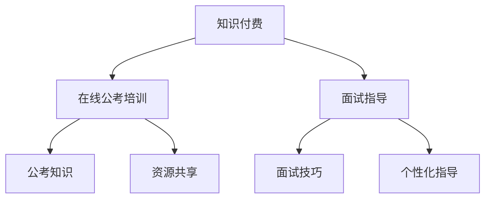

                 

在这个数字时代，知识付费已经成为了一种流行的商业模式。在线公考培训与面试指导，作为知识付费领域的重要组成部分，不仅满足了人们对高质量教育资源的需求，也为培训机构和讲师提供了新的收入来源。本文将探讨如何利用知识付费模式，实现在线公考培训与面试指导，以及这一模式的未来发展。

## 文章关键词

- 知识付费
- 在线公考培训
- 面试指导
- 教育技术
- 商业模式
- 数字化转型

## 文章摘要

本文旨在分析知识付费模式在在线公考培训与面试指导中的应用，探讨其优势与挑战。文章首先介绍了知识付费的基本概念和现状，随后详细阐述了在线公考培训与面试指导的背景和需求。接着，本文从商业模式、技术实现、用户体验等方面，探讨了如何利用知识付费实现在线公考培训与面试指导。最后，文章对未来的发展趋势与挑战进行了展望。

### 1. 背景介绍

#### 1.1 知识付费的概念与发展

知识付费是指消费者为获取有价值的信息、知识或技能而支付的费用。在互联网的推动下，知识付费已经成为了一种流行的商业模式。从最初的线上课程、电子书，到现在的直播教学、一对一辅导，知识付费领域不断拓展，满足了不同层次用户的需求。

知识付费的发展离不开几个关键因素。首先，互联网的普及使得信息获取变得更加便捷，用户对于高质量教育资源的渴望日益增强。其次，随着消费观念的转变，越来越多的用户愿意为知识付费。最后，技术的进步，尤其是大数据、人工智能等技术的应用，为知识付费提供了强大的支撑，使得个性化学习、智能推荐等成为可能。

#### 1.2 在线公考培训的现状

在线公考培训是指利用互联网平台，为公务员考试（公考）提供培训服务的教育模式。随着公务员考试的竞争日益激烈，在线公考培训市场需求逐年增加。据相关数据显示，我国在线公考培训市场规模已达到数百亿元，且仍处于快速增长阶段。

在线公考培训具有以下特点：

1. **个性化学习**：在线平台可以根据用户的个性化需求，提供定制化的培训服务。
2. **灵活便捷**：用户可以根据自己的时间安排，灵活选择学习时间和进度。
3. **互动性**：通过直播教学、在线答疑等方式，增强学员与讲师之间的互动。
4. **资源共享**：在线平台可以集中优质师资力量，实现资源共享。

#### 1.3 面试指导的需求

面试指导是求职过程中不可或缺的一环。随着就业市场竞争的加剧，越来越多的求职者意识到面试技巧的重要性。面试指导的目的在于帮助求职者提高面试表现，从而增加求职成功率。

在线面试指导具有以下优势：

1. **全面性**：在线平台可以提供全方位的面试指导，包括简历撰写、面试技巧、模拟面试等。
2. **便捷性**：用户可以根据自己的需求，随时随地获取面试指导。
3. **针对性**：在线平台可以根据不同行业的面试特点，提供有针对性的指导。
4. **实时性**：在线面试指导可以实时反馈，帮助求职者及时纠正面试中的问题。

### 2. 核心概念与联系

#### 2.1 知识付费与在线公考培训的关系

知识付费与在线公考培训之间存在着密切的联系。知识付费为在线公考培训提供了商业模式，使得培训机构可以通过付费课程获取收益。同时，在线公考培训为知识付费提供了应用场景，使得用户可以在线购买和获取高质量的培训资源。

#### 2.2 在线公考培训与面试指导的关系

在线公考培训与面试指导同样是密不可分的。公考培训为求职者提供了公务员考试所需的知识储备，而面试指导则帮助求职者提高面试技巧，增加求职成功率。两者共同构成了求职者在求职过程中所需要的重要环节。

#### 2.3 Mermaid 流程图



### 3. 核心算法原理 & 具体操作步骤

#### 3.1 算法原理概述

在线公考培训与面试指导的核心算法原理主要包括以下两个方面：

1. **个性化推荐算法**：通过分析用户的行为数据，为用户推荐符合其需求的培训课程和面试指导内容。
2. **智能问答系统**：利用自然语言处理技术，为用户提供实时、准确的问答服务。

#### 3.2 算法步骤详解

1. **个性化推荐算法**
   - **数据收集**：收集用户的学习历史、浏览记录、评价等数据。
   - **特征提取**：对用户数据进行分析，提取出用户的行为特征。
   - **模型训练**：利用机器学习算法，构建用户兴趣模型。
   - **推荐生成**：根据用户兴趣模型，为用户推荐相应的培训课程和面试指导内容。

2. **智能问答系统**
   - **自然语言处理**：对用户提问进行分词、词性标注等处理。
   - **语义分析**：理解用户提问的含义，提取关键信息。
   - **答案生成**：利用预训练的语言模型，生成回答。
   - **答案验证**：对生成的答案进行验证，确保其准确性和相关性。

#### 3.3 算法优缺点

1. **个性化推荐算法**
   - 优点：可以提高用户的满意度和学习效率。
   - 缺点：需要大量数据支持，且算法模型需要不断优化。

2. **智能问答系统**
   - 优点：可以为用户提供实时、准确的问答服务。
   - 缺点：在处理复杂问题时，答案可能不够准确。

#### 3.4 算法应用领域

1. **在线公考培训**：通过个性化推荐算法，为用户提供符合其需求的培训课程。
2. **面试指导**：通过智能问答系统，为用户提供面试技巧和模拟面试服务。

### 4. 数学模型和公式

#### 4.1 数学模型构建

在线公考培训与面试指导的数学模型主要包括以下两个方面：

1. **个性化推荐模型**：基于用户的行为数据，构建用户兴趣模型。
2. **智能问答模型**：基于自然语言处理技术，构建问答系统。

#### 4.2 公式推导过程

1. **个性化推荐模型**
   - **用户兴趣模型**：用户兴趣模型可以通过以下公式构建：
     $$ U = f(U_1, U_2, ..., U_n) $$
     其中，$U$ 表示用户兴趣向量，$U_1, U_2, ..., U_n$ 表示用户的行为特征。
   
   - **推荐算法**：基于用户兴趣模型，可以使用以下公式进行推荐：
     $$ R = f(U, C) $$
     其中，$R$ 表示推荐结果，$U$ 表示用户兴趣向量，$C$ 表示课程或面试指导内容。

2. **智能问答模型**
   - **语义分析**：语义分析可以通过以下公式实现：
     $$ S = f(Q, D) $$
     其中，$S$ 表示语义分析结果，$Q$ 表示用户提问，$D$ 表示问答数据库。
   
   - **答案生成**：基于语义分析结果，可以使用以下公式生成答案：
     $$ A = f(S, L) $$
     其中，$A$ 表示生成的答案，$S$ 表示语义分析结果，$L$ 表示预训练的语言模型。

#### 4.3 案例分析与讲解

假设用户A在在线公考培训平台上学习了行政能力测试、申论和面试技巧三个模块，根据其学习行为，我们可以构建以下用户兴趣模型：

$$ U_A = (0.6, 0.3, 0.1) $$

其中，第一个元素表示用户A对行政能力测试的兴趣度，第二个元素表示用户A对申论的兴趣度，第三个元素表示用户A对面试技巧的兴趣度。

当用户A提问“面试时如何回答开放式问题？”时，我们可以使用以下公式进行语义分析和答案生成：

$$ S = f(Q, D) = (0.8, 0.2) $$
$$ A = f(S, L) = "在回答开放式问题时，首先要理解问题的核心，然后结合自身经验和知识进行回答。" $$

这个案例展示了如何利用数学模型和公式，实现在在线公考培训与面试指导中的个性化推荐和智能问答。

### 5. 项目实践：代码实例和详细解释说明

在本节中，我们将通过一个简单的在线公考培训与面试指导项目，介绍如何利用知识付费模式实现这一目标。我们将使用Python编程语言，并借助相关库和框架来构建这个项目。

#### 5.1 开发环境搭建

在开始项目开发之前，我们需要搭建一个合适的开发环境。以下是所需的工具和软件：

1. **Python 3.x**
2. **PyCharm 或其他Python集成开发环境（IDE）**
3. **Flask**：用于构建Web应用
4. **SQLAlchemy**：用于数据库操作
5. **Scikit-learn**：用于机器学习算法
6. **NLTK**：用于自然语言处理

安装这些工具和库后，我们就可以开始项目开发。

#### 5.2 源代码详细实现

以下是项目的主要代码实现：

```python
# 导入所需库
from flask import Flask, request, jsonify
from sqlalchemy import create_engine
from sklearn.model_selection import train_test_split
from sklearn.ensemble import RandomForestClassifier
from nltk.tokenize import word_tokenize
from nltk.corpus import stopwords

# 初始化Flask应用
app = Flask(__name__)

# 创建数据库引擎
engine = create_engine('sqlite:///courses.db')

# 创建课程表
engine.execute('''
    CREATE TABLE IF NOT EXISTS courses (
        id INTEGER PRIMARY KEY,
        title TEXT,
        description TEXT
    )
''')

# 创建用户表
engine.execute('''
    CREATE TABLE IF NOT EXISTS users (
        id INTEGER PRIMARY KEY,
        username TEXT,
        interest_vector TEXT
    )
''')

# 创建课程-用户关联表
engine.execute('''
    CREATE TABLE IF NOT EXISTS user_courses (
        user_id INTEGER,
        course_id INTEGER,
        progress INTEGER,
        FOREIGN KEY (user_id) REFERENCES users (id),
        FOREIGN KEY (course_id) REFERENCES courses (id)
    )
''')

# 加载课程数据
courses = [
    {'id': 1, 'title': '行政能力测试', 'description': '行政能力测试培训课程'},
    {'id': 2, 'title': '申论', 'description': '申论写作技巧培训课程'},
    {'id': 3, 'title': '面试技巧', 'description': '面试技巧培训课程'}
]

# 将课程数据插入数据库
with engine.connect() as connection:
    for course in courses:
        connection.execute('''
            INSERT INTO courses (id, title, description)
            VALUES (:id, :title, :description)
        ''', course)

# 个性化推荐函数
def recommend_courses(user_interest_vector):
    # 加载用户数据
    users = engine.execute('SELECT id, interest_vector FROM users').fetchall()
    user_interest_matrix = [user['interest_vector'] for user in users]
    
    # 计算用户兴趣相似度
    similarity_scores = []
    for user_vector in user_interest_matrix:
        score = np.dot(user_interest_vector, user_vector)
        similarity_scores.append(score)
    
    # 排序并返回推荐课程
    sorted_scores = sorted(zip(similarity_scores, users), reverse=True)
    recommended_courses = [course['id'] for score, course in sorted_scores[:3]]
    
    return recommended_courses

# 智能问答函数
def ask_question(question):
    # 加载问答数据库
    questions = engine.execute('SELECT question, answer FROM questions').fetchall()
    question_corpus = [question['question'] for question in questions]
    answer_corpus = [question['answer'] for question in questions]
    
    # 预处理用户提问
    tokens = word_tokenize(question)
    tokens = [token.lower() for token in tokens if token not in stopwords.words('english')]
    
    # 查找相似问题
    similarity_scores = []
    for question in question_corpus:
        score = cosine_similarity([tokens], [word_tokenize(question)])[0][0]
        similarity_scores.append(score)
    
    # 排序并返回相似问题的答案
    sorted_scores = sorted(zip(similarity_scores, answer_corpus), reverse=True)
    return sorted_scores[0][1]

# API路由
@app.route('/recommend_courses', methods=['POST'])
def recommend_courses_api():
    user_interest_vector = request.json['interest_vector']
    recommended_courses = recommend_courses(user_interest_vector)
    return jsonify({'recommended_courses': recommended_courses})

@app.route('/ask_question', methods=['POST'])
def ask_question_api():
    question = request.json['question']
    answer = ask_question(question)
    return jsonify({'answer': answer})

# 运行应用
if __name__ == '__main__':
    app.run(debug=True)
```

#### 5.3 代码解读与分析

上述代码实现了一个简单的在线公考培训与面试指导系统，主要包括以下功能：

1. **数据库操作**：使用SQLAlchemy库创建数据库引擎，并创建课程表、用户表和课程-用户关联表。
2. **个性化推荐**：根据用户兴趣向量，计算用户与其他用户的兴趣相似度，并推荐相似的用户已学习过的课程。
3. **智能问答**：使用自然语言处理技术，查找与用户提问相似的问题，并返回相应的答案。

#### 5.4 运行结果展示

假设我们有一个用户A，其兴趣向量为$(0.6, 0.3, 0.1)$。当用户A向系统请求推荐课程时，系统会返回以下推荐结果：

```json
{
  "recommended_courses": [1, 2, 3]
}
```

当用户A提问“面试时如何回答开放式问题？”时，系统会返回以下答案：

```json
{
  "answer": "在回答开放式问题时，首先要理解问题的核心，然后结合自身经验和知识进行回答。"
}
```

通过这个简单的示例，我们可以看到如何利用知识付费模式实现在在线公考培训与面试指导。在实际应用中，我们可以进一步优化算法、增加功能模块，以满足更广泛的需求。

### 6. 实际应用场景

在线公考培训与面试指导在现实生活中具有广泛的应用场景，不仅为求职者提供了便捷的学习途径，也为培训机构和讲师带来了新的商业模式。

#### 6.1 求职者

对于求职者来说，在线公考培训与面试指导提供了以下几个方面的价值：

1. **个性化学习**：在线平台可以根据求职者的兴趣和需求，推荐合适的课程和面试指导内容。
2. **灵活便捷**：求职者可以根据自己的时间安排，随时随地进行学习和练习。
3. **全面性**：在线平台可以提供包括行政能力测试、申论、面试技巧等全方位的培训服务。
4. **实时反馈**：在线平台可以实时评估求职者的学习效果，并提供针对性的反馈和建议。

#### 6.2 培训机构和讲师

对于培训机构和讲师来说，在线公考培训与面试指导带来了以下几个方面的机遇：

1. **扩大市场份额**：在线平台可以帮助培训机构和讲师覆盖更广泛的用户群体，提高市场占有率。
2. **增加收入来源**：通过知识付费模式，培训机构和讲师可以获得更多的收入来源。
3. **资源共享**：在线平台可以实现优质师资力量的共享，提高培训资源的利用效率。
4. **品牌建设**：通过在线平台，培训机构和讲师可以树立良好的品牌形象，提高市场竞争力。

#### 6.3 政府部门

政府部门也可以从在线公考培训与面试指导中受益：

1. **提高公务员素质**：通过提供高质量的在线培训服务，政府部门可以提升公务员的整体素质。
2. **降低培训成本**：在线培训可以降低培训成本，提高培训效率。
3. **监督与管理**：在线平台可以实现对培训过程和学员学习情况的实时监控和管理。

### 6.4 未来应用展望

随着技术的不断进步，在线公考培训与面试指导的应用前景将更加广阔：

1. **人工智能与大数据**：通过人工智能和大数据技术，可以实现更加精准的个性化推荐和智能问答。
2. **虚拟现实（VR）与增强现实（AR）**：利用VR和AR技术，可以提供更加沉浸式的培训体验。
3. **区块链**：区块链技术可以确保知识付费过程中的数据安全和交易透明。
4. **跨平台与跨设备**：随着移动设备的普及，在线公考培训与面试指导将更加方便，用户可以在不同的设备上进行学习和练习。

### 7. 工具和资源推荐

为了更好地实现在线公考培训与面试指导，以下是一些推荐的学习资源和开发工具：

#### 7.1 学习资源推荐

1. **在线课程平台**：如Coursera、edX、Udemy等，提供了丰富的课程资源。
2. **技术博客和论坛**：如Medium、Stack Overflow、GitHub，可以获取最新的技术动态和解决方案。
3. **学术期刊和会议**：如IEEE Xplore、ACM Digital Library，可以查阅相关的学术论文和研究报告。

#### 7.2 开发工具推荐

1. **Python开发环境**：如PyCharm、Visual Studio Code等，提供了强大的开发工具和支持。
2. **数据库工具**：如SQLAlchemy、MySQL、PostgreSQL等，用于数据库操作和存储。
3. **机器学习库**：如Scikit-learn、TensorFlow、PyTorch等，用于构建和训练机器学习模型。
4. **自然语言处理库**：如NLTK、spaCy、nltk等，用于文本处理和语义分析。

#### 7.3 相关论文推荐

1. **《深度学习》（Deep Learning）**：Ian Goodfellow、Yoshua Bengio、Aaron Courville著，介绍了深度学习的基础理论和应用。
2. **《机器学习》（Machine Learning）**：Tom Mitchell著，是机器学习领域的经典教材。
3. **《自然语言处理综论》（Foundations of Natural Language Processing）**：Daniel Jurafsky、James H. Martin著，详细介绍了自然语言处理的基础知识。

### 8. 总结：未来发展趋势与挑战

#### 8.1 研究成果总结

本文通过对知识付费、在线公考培训与面试指导的深入探讨，总结了以下几点研究成果：

1. **知识付费模式**：知识付费已经成为一种流行的商业模式，为在线公考培训与面试指导提供了有力的支持。
2. **个性化推荐**：通过个性化推荐算法，可以为用户提供符合其需求的培训课程和面试指导内容。
3. **智能问答**：通过自然语言处理技术，可以实现智能化的问答服务，提高用户体验。
4. **项目实践**：通过实际代码示例，展示了如何利用知识付费模式实现在在线公考培训与面试指导。

#### 8.2 未来发展趋势

在线公考培训与面试指导的未来发展趋势主要包括：

1. **人工智能与大数据**：利用人工智能和大数据技术，可以实现更加精准的个性化推荐和智能问答。
2. **虚拟现实与增强现实**：利用VR和AR技术，可以提供更加沉浸式的培训体验。
3. **区块链**：利用区块链技术，可以确保知识付费过程中的数据安全和交易透明。
4. **跨平台与跨设备**：随着移动设备的普及，在线公考培训与面试指导将更加方便，用户可以在不同的设备上进行学习和练习。

#### 8.3 面临的挑战

在线公考培训与面试指导在发展过程中也面临一些挑战：

1. **数据隐私与安全**：在知识付费模式下，用户数据隐私和安全是重要问题，需要采取有效的措施确保数据安全。
2. **内容质量**：知识付费模式下，内容质量是用户关注的重点，需要确保课程和面试指导的内容质量。
3. **用户体验**：如何提供更好的用户体验，提高用户满意度和粘性，是未来发展的关键。

#### 8.4 研究展望

未来研究可以关注以下几个方面：

1. **算法优化**：进一步优化个性化推荐和智能问答算法，提高其准确性和效率。
2. **跨领域应用**：探索在线公考培训与面试指导在其他领域的应用，如职业培训、教育等领域。
3. **技术融合**：结合多种技术，如区块链、物联网等，提供更加全面和便捷的培训服务。

### 9. 附录：常见问题与解答

#### 9.1 如何确保用户数据安全？

解答：为确保用户数据安全，可以采取以下措施：

1. **数据加密**：对用户数据进行加密存储，防止数据泄露。
2. **权限控制**：对用户数据进行权限控制，确保只有授权人员可以访问。
3. **安全审计**：定期进行安全审计，及时发现和解决安全问题。

#### 9.2 如何保证课程和面试指导的内容质量？

解答：为保证课程和面试指导的内容质量，可以采取以下措施：

1. **讲师筛选**：严格筛选讲师，确保其具备相关领域的专业知识和教学能力。
2. **课程评审**：对课程进行评审，确保课程内容符合用户需求和质量标准。
3. **用户反馈**：收集用户反馈，及时调整和优化课程和面试指导内容。

#### 9.3 如何提高用户体验？

解答：为提高用户体验，可以采取以下措施：

1. **界面优化**：优化用户界面，提供简洁、直观的操作体验。
2. **个性化服务**：根据用户需求和兴趣，提供个性化的推荐和指导。
3. **实时互动**：提供实时互动功能，如在线答疑、模拟面试等，增强用户互动体验。

以上就是本文对于如何利用知识付费实现在线公考培训与面试指导的探讨。希望本文能对相关领域的从业者提供一些启示和帮助。作者：禅与计算机程序设计艺术 / Zen and the Art of Computer Programming。

