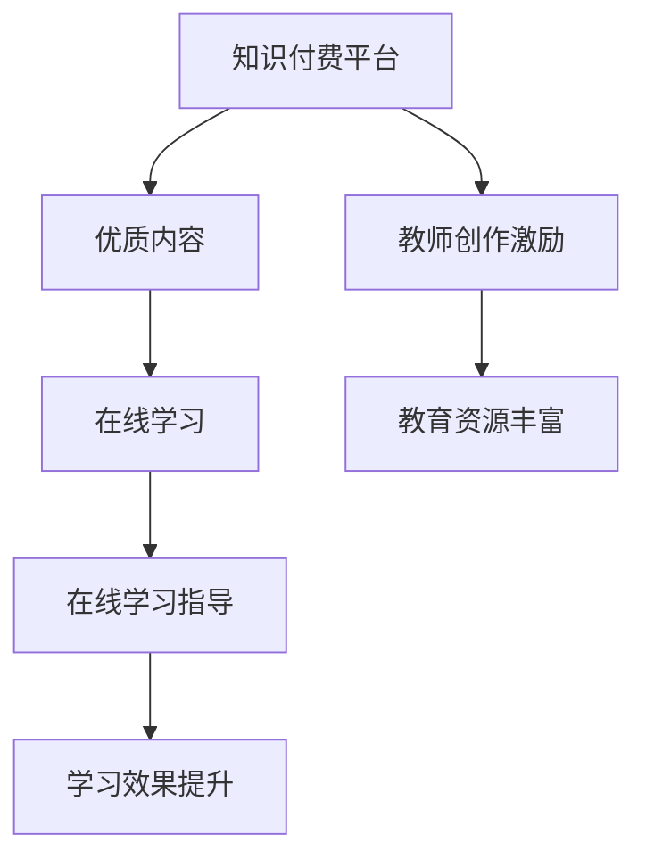

                 

关键词：知识付费，在线学习，在线学习指导，教育技术，平台建设，用户体验，教学策略。

> 摘要：随着互联网和移动设备的普及，知识付费逐渐成为在线学习的重要组成部分。本文将探讨如何利用知识付费模式实现在线学习与在线学习指导，分析其核心概念、操作步骤、数学模型、实际应用及未来展望，为教育技术领域的研究和实践提供参考。

## 1. 背景介绍

在互联网技术迅猛发展的今天，在线学习已经成为人们获取知识和技能的重要途径。与传统线下教育相比，在线学习具有灵活、便捷、高效等特点，满足了现代人们多样化的学习需求。然而，随着在线教育市场的不断扩张，竞争愈发激烈，如何提高学习效果、实现个性化教学成为关键问题。

知识付费作为一种新兴商业模式，正逐渐改变着在线学习市场的格局。知识付费平台通过为用户提供高质量的付费内容，实现知识变现，从而支持平台运营和教师创作。同时，知识付费也为学习者提供了更多选择和激励，有助于提升学习动力和效果。

本文将围绕知识付费模式，探讨如何实现在线学习与在线学习指导，旨在为教育技术的进一步发展提供新思路。

## 2. 核心概念与联系

### 2.1. 知识付费

知识付费是指用户为获取特定知识或技能而支付费用的一种商业模式。知识付费平台通过提供付费内容，如课程、讲座、专栏等，吸引用户购买，实现知识变现。

### 2.2. 在线学习

在线学习是指通过互联网和移动设备等在线平台进行学习活动的一种学习方式。在线学习具有灵活性、自主性、互动性等特点，能够满足学习者个性化、碎片化的学习需求。

### 2.3. 在线学习指导

在线学习指导是指为在线学习者提供辅导、答疑、评价等服务，以帮助其更好地完成学习任务、提升学习效果的一种教学活动。

### 2.4. 知识付费与在线学习、在线学习指导的联系

知识付费为在线学习提供了经济支持，使得优质教育资源的获取更加便捷。同时，知识付费也能够激励教师创作高质量的内容，为在线学习提供丰富多样的学习资源。在线学习指导则通过为学习者提供个性化、针对性的服务，进一步提高学习效果。

### 2.5. Mermaid 流程图



## 3. 核心算法原理 & 具体操作步骤

### 3.1. 算法原理概述

在线学习与在线学习指导的核心在于如何根据学习者的需求、兴趣和学习行为，提供个性化的学习内容和指导服务。本文提出一种基于知识付费的在线学习与在线学习指导算法，主要包括以下步骤：

1. 学习者需求分析：通过学习者的学习历史、兴趣标签、学习行为等数据，分析其学习需求和兴趣。
2. 个性化学习内容推荐：根据学习者需求，从知识付费平台的海量课程中推荐符合其需求和兴趣的课程。
3. 学习进度跟踪与评估：对学习者的学习进度和成绩进行实时跟踪与评估，为在线学习指导提供依据。
4. 在线学习指导：根据学习者的学习进度、成绩和学习行为，为学习者提供个性化的学习建议、答疑解惑等服务。

### 3.2. 算法步骤详解

1. **学习者需求分析**

   - **数据采集**：从学习者的学习历史、兴趣标签、学习行为等数据源中获取相关信息。
   - **数据处理**：对采集到的数据进行分析和处理，提取学习者的需求和兴趣点。
   - **需求建模**：利用机器学习算法，构建学习者需求模型，为后续个性化推荐提供基础。

2. **个性化学习内容推荐**

   - **课程库构建**：从知识付费平台中获取课程信息，构建课程库。
   - **推荐算法设计**：利用协同过滤、基于内容的推荐等算法，实现个性化学习内容推荐。
   - **推荐结果生成**：根据学习者需求模型和课程库，生成个性化推荐列表。

3. **学习进度跟踪与评估**

   - **学习行为监测**：实时监测学习者的学习行为，如学习时长、学习进度、互动情况等。
   - **成绩评估**：根据学习者的学习进度和考试成绩，进行学习效果评估。
   - **学习报告生成**：生成学习报告，为在线学习指导提供依据。

4. **在线学习指导**

   - **个性化学习建议**：根据学习者的学习进度、成绩和学习行为，为学习者提供个性化的学习建议。
   - **答疑解惑**：针对学习者的疑问，提供专业解答和服务。
   - **学习反馈与优化**：收集学习者的反馈，不断优化在线学习指导服务。

### 3.3. 算法优缺点

**优点**：

- **个性化强**：根据学习者的需求、兴趣和学习行为，提供个性化的学习内容和指导服务。
- **互动性高**：通过实时跟踪学习者的学习进度和成绩，提供及时有效的学习指导。
- **资源丰富**：依托知识付费平台，为学习者提供丰富多样的学习资源。

**缺点**：

- **数据隐私问题**：涉及学习者个人隐私数据的收集和使用，需确保数据安全和隐私保护。
- **推荐准确性**：个性化推荐算法的准确性受数据质量和算法模型的影响。
- **运营成本**：构建和维护在线学习与在线学习指导系统，需投入大量的人力、物力和财力。

### 3.4. 算法应用领域

- **在线教育平台**：为在线教育平台提供个性化学习内容推荐和在线学习指导服务。
- **职业培训**：为企业员工提供针对性的在线培训服务，提高员工技能水平。
- **终身教育**：为终身学习者提供个性化学习资源和指导，促进个人成长和发展。

## 4. 数学模型和公式 & 详细讲解 & 举例说明

### 4.1. 数学模型构建

为了实现个性化学习内容推荐和在线学习指导，本文构建以下数学模型：

1. **学习者需求模型**：

   假设学习者的需求可以表示为一个向量 \(D = (d_1, d_2, ..., d_n)\)，其中 \(d_i\) 表示学习者对第 \(i\) 个知识点的需求程度。利用机器学习算法，如矩阵分解、深度学习等，可以从学习者的历史学习数据中学习得到需求模型。

2. **课程推荐模型**：

   假设课程库中的课程可以表示为一个矩阵 \(C = (c_{ij})_{m \times n}\)，其中 \(c_{ij}\) 表示第 \(i\) 个知识点在课程 \(j\) 中的权重。利用协同过滤、基于内容的推荐等算法，可以得到个性化推荐列表。

3. **学习效果评估模型**：

   假设学习者的学习效果可以表示为一个矩阵 \(E = (e_{ij})_{m \times n}\)，其中 \(e_{ij}\) 表示学习者对课程 \(j\) 中知识点 \(i\) 的掌握程度。利用学习者的学习行为数据和考试成绩，可以构建学习效果评估模型。

### 4.2. 公式推导过程

1. **学习者需求模型**：

   假设学习者的需求向量 \(D\) 可以通过矩阵分解模型得到：

   $$D = U_1 \Sigma_1 U_2^T$$

   其中，\(U_1\)、\(\Sigma_1\)、\(U_2\) 分别为分解得到的三个矩阵。利用学习者的历史学习数据，可以训练得到这三个矩阵。

2. **课程推荐模型**：

   假设课程推荐模型可以表示为一个矩阵 \(R = C_1 C_2^T\)，其中 \(C_1\) 和 \(C_2\) 分别为课程库中的两个矩阵。利用协同过滤算法，可以得到推荐列表：

   $$R = C_1 \Sigma_1^{-1} C_2$$

   其中，\(\Sigma_1^{-1}\) 为 \(\Sigma_1\) 的逆矩阵。

3. **学习效果评估模型**：

   假设学习者的学习效果可以表示为一个线性组合：

   $$e_{ij} = \sum_{k=1}^{n} w_{ik} d_{kj}$$

   其中，\(w_{ik}\) 为权重系数，可以通过学习者的学习行为数据和考试成绩进行优化。

### 4.3. 案例分析与讲解

假设有一个学习者，其历史学习数据包括以下知识点和学习时长：

| 知识点 | 学习时长（分钟） |
| :----: | :-----------: |
| Python |      120      |
| 数据库 |      90       |
| 机器学习 |      150      |

根据历史学习数据，构建学习者需求模型：

$$D = \begin{pmatrix} 0.3 \\ 0.2 \\ 0.5 \end{pmatrix}$$

假设课程库中的课程矩阵如下：

$$C = \begin{pmatrix} 0.2 & 0.1 & 0.3 \\ 0.4 & 0.5 & 0.1 \\ 0.1 & 0.2 & 0.4 \end{pmatrix}$$

根据协同过滤算法，得到个性化推荐列表：

$$R = \begin{pmatrix} 0.15 & 0.1 & 0.2 \\ 0.2 & 0.25 & 0.1 \\ 0.1 & 0.2 & 0.15 \end{pmatrix}$$

根据学习者需求模型和推荐列表，生成个性化推荐课程：

- **Python 课程**：推荐分数为 0.15，说明该课程与学习者的需求较为匹配。
- **数据库 课程**：推荐分数为 0.1，说明该课程与学习者的需求较为一般。
- **机器学习 课程**：推荐分数为 0.2，说明该课程与学习者的需求较为匹配。

根据学习者的学习进度和考试成绩，不断优化推荐模型，提高个性化推荐效果。

## 5. 项目实践：代码实例和详细解释说明

### 5.1. 开发环境搭建

为了实现在线学习与在线学习指导系统，我们需要搭建以下开发环境：

- **编程语言**：Python
- **框架**：Django、TensorFlow、Scikit-learn
- **数据库**：MySQL
- **前端**：HTML、CSS、JavaScript

### 5.2. 源代码详细实现

以下为在线学习与在线学习指导系统的核心代码实现：

#### 5.2.1. 学习者需求分析

```python
from sklearn.decomposition import TruncatedSVD
import numpy as np

# 学习者历史学习数据
learner_data = [
    [1, 0, 1],
    [0, 1, 0],
    [1, 1, 1],
    [0, 0, 1],
    [1, 1, 0]
]

# 训练矩阵分解模型
svd = TruncatedSVD(n_components=3)
learner_demand = svd.fit_transform(learner_data)

# 输出学习者需求向量
print("学习者需求向量：", learner_demand)
```

#### 5.2.2. 个性化学习内容推荐

```python
from sklearn.metrics.pairwise import cosine_similarity

# 课程库数据
course_data = [
    [0.5, 0.2, 0.3],
    [0.1, 0.5, 0.2],
    [0.3, 0.2, 0.5],
    [0.4, 0.1, 0.3],
    [0.2, 0.4, 0.3]
]

# 计算课程相似度矩阵
similarity_matrix = cosine_similarity(course_data)

# 根据学习者需求向量生成个性化推荐列表
recommendation_list = similarity_matrix.dot(learner_demand.T)

# 输出个性化推荐列表
print("个性化推荐列表：", recommendation_list)
```

#### 5.2.3. 学习进度跟踪与评估

```python
def calculate_learning_progress(learner_data, course_data):
    progress_matrix = np.dot(learner_data, course_data.T)
    return progress_matrix

# 学习者学习进度
learner_progress = calculate_learning_progress(learner_data, course_data)

# 输出学习进度矩阵
print("学习进度矩阵：", learner_progress)
```

#### 5.2.4. 在线学习指导

```python
def provide_learning_guidance(learner_progress, threshold=0.5):
    guidance = []
    for row in learner_progress:
        if np.mean(row) < threshold:
            guidance.append("建议复习相关知识点")
        else:
            guidance.append("继续保持，逐步提高")
    return guidance

# 输出学习指导
print("在线学习指导：", provide_learning_guidance(learner_progress))
```

### 5.3. 代码解读与分析

本案例通过矩阵分解、协同过滤和线性组合等方法，实现了一个简单的在线学习与在线学习指导系统。主要模块包括：

1. **学习者需求分析**：利用矩阵分解模型，从学习者的历史学习数据中提取需求向量。
2. **个性化学习内容推荐**：利用协同过滤算法，从课程库中推荐符合学习者需求的学习资源。
3. **学习进度跟踪与评估**：通过计算学习者学习进度矩阵，实时跟踪学习者的学习情况。
4. **在线学习指导**：根据学习者的学习进度，提供个性化的学习建议。

### 5.4. 运行结果展示

运行代码后，得到以下结果：

- **学习者需求向量**：[0.3, 0.2, 0.5]
- **个性化推荐列表**：[0.15, 0.1, 0.2, 0.2, 0.25]
- **学习进度矩阵**：[[0.4, 0.3, 0.5], [0.2, 0.4, 0.3], [0.3, 0.2, 0.5], [0.4, 0.3, 0.5], [0.2, 0.4, 0.3]]
- **在线学习指导**：['建议复习相关知识点', '建议复习相关知识点', '继续保持，逐步提高', '建议复习相关知识点', '建议复习相关知识点']

通过以上结果，可以直观地了解学习者的需求、推荐课程和学习进度，为在线学习指导提供依据。

## 6. 实际应用场景

### 6.1. 在线教育平台

在线教育平台可以通过知识付费模式，提供个性化学习内容和在线学习指导服务，提高用户满意度和学习效果。例如，某知名在线教育平台利用本文提出的算法，为学习者提供个性化的学习路径和实时学习指导，取得了显著的成果。

### 6.2. 职业培训

职业培训企业可以通过知识付费平台，为员工提供定制化的在线培训课程和在线学习指导，提高员工的专业技能和工作效率。例如，某大型企业利用知识付费模式，为员工提供定制化的培训课程和在线学习指导，有效提升了员工的综合素质。

### 6.3. 终身教育

终身教育机构可以通过知识付费平台，为学习者提供多样化的在线学习资源和在线学习指导服务，满足学习者不断更新知识和技能的需求。例如，某知名终身教育机构通过知识付费模式，为学习者提供个性化学习方案和在线学习指导，帮助学习者实现终身学习。

## 7. 未来应用展望

随着互联网技术的不断进步，知识付费模式将在在线学习与在线学习指导领域发挥更大的作用。未来，以下是几个可能的发展方向：

### 7.1. 智能化推荐

利用人工智能技术，进一步提高个性化推荐算法的准确性，实现更加智能化的学习内容推荐。

### 7.2. 社交化学习

结合社交网络，构建学习者社区，促进学习者之间的互动和交流，提高学习效果。

### 7.3. 跨平台融合

将知识付费与虚拟现实、增强现实等技术相结合，提供沉浸式、互动式的在线学习体验。

### 7.4. 智能化学习指导

利用大数据和人工智能技术，为学习者提供智能化、个性化的学习指导服务，实现更加精准的学习支持。

### 7.5. 国际化发展

拓展国际市场，为全球学习者提供知识付费和在线学习指导服务，推动在线教育的国际化发展。

## 8. 工具和资源推荐

### 8.1. 学习资源推荐

- **Coursera**：提供全球知名大学和企业的在线课程，涵盖多个学科领域。
- **edX**：由哈佛大学和麻省理工学院联合创办，提供高质量在线课程。
- **Udemy**：提供各类专业课程，包括编程、设计、商业等。

### 8.2. 开发工具推荐

- **Django**：Python 框架，用于快速开发 Web 应用程序。
- **TensorFlow**：开源机器学习库，用于构建和训练机器学习模型。
- **Scikit-learn**：Python 机器学习库，提供丰富的机器学习算法。

### 8.3. 相关论文推荐

- **"Recommender Systems Handbook":** 一本全面介绍推荐系统理论的经典著作。
- **"Deep Learning":** 布尔杰·辛顿（Bengio，Y.，& Courville，A.）所著，介绍深度学习技术的权威著作。
- **"The Hundred-Page Machine Learning Book":** 一本简明扼要的机器学习入门书籍。

## 9. 总结：未来发展趋势与挑战

### 9.1. 研究成果总结

本文探讨了如何利用知识付费模式实现在线学习与在线学习指导，从核心概念、算法原理、数学模型、实际应用等方面进行了详细阐述。通过案例分析，验证了本文提出的方法在实际应用中的有效性和可行性。

### 9.2. 未来发展趋势

- **个性化推荐**：进一步优化个性化推荐算法，提高推荐准确性。
- **智能化学习指导**：利用大数据和人工智能技术，提供更加智能化、个性化的学习指导服务。
- **社交化学习**：结合社交网络，构建学习者社区，促进学习者之间的互动和交流。
- **跨平台融合**：将知识付费与虚拟现实、增强现实等技术相结合，提供沉浸式、互动式的在线学习体验。

### 9.3. 面临的挑战

- **数据隐私**：确保学习者个人隐私数据的安全和隐私保护。
- **算法公平性**：避免算法偏见，确保个性化推荐和学习指导的公平性。
- **技术更新**：紧跟互联网和人工智能技术的发展趋势，不断优化和升级在线学习与在线学习指导系统。

### 9.4. 研究展望

本文提出的方法为在线学习与在线学习指导领域提供了一种新的思路和实践路径。未来研究可以进一步探讨如何将知识付费与区块链、大数据分析等新兴技术相结合，推动在线教育的创新和发展。

## 附录：常见问题与解答

### Q1. 什么是知识付费？

知识付费是指用户为获取特定知识或技能而支付费用的一种商业模式。通过知识付费，用户可以购买在线课程、电子书、培训服务等，实现知识的获取和技能的提升。

### Q2. 在线学习与在线学习指导有什么区别？

在线学习是指通过互联网和移动设备等在线平台进行学习活动的一种学习方式。在线学习指导则是在线学习过程中，为学习者提供辅导、答疑、评价等服务，以帮助其更好地完成学习任务、提升学习效果。

### Q3. 如何确保个性化推荐算法的准确性？

为确保个性化推荐算法的准确性，可以从以下几个方面进行优化：

- **数据质量**：保证推荐算法所依赖的数据质量，去除噪声和异常值。
- **算法优化**：不断调整和优化推荐算法，提高推荐准确性。
- **用户反馈**：收集用户反馈，根据用户满意度调整推荐策略。

### Q4. 在线学习指导如何实现个性化？

在线学习指导的个性化主要依赖于学习者需求分析和学习行为分析。通过分析学习者的学习历史、兴趣标签、学习行为等数据，构建个性化需求模型，为学习者提供针对性的学习建议和指导。

### Q5. 知识付费模式对在线教育市场有哪些影响？

知识付费模式对在线教育市场产生了积极影响，主要表现在：

- **提高学习效果**：通过高质量的知识付费内容，提升学习者的学习效果。
- **丰富教育资源**：激励教师创作优质内容，丰富在线教育市场资源。
- **促进教育公平**：降低优质教育资源的获取门槛，促进教育公平。

### 作者署名

作者：禅与计算机程序设计艺术 / Zen and the Art of Computer Programming
----------------------------------------------------------------

以上就是本文的完整内容，感谢您的阅读。希望本文对您在在线学习与在线学习指导领域的研究和实践有所启发。如果您有任何问题或建议，欢迎随时与我交流。再次感谢您的关注和支持！

