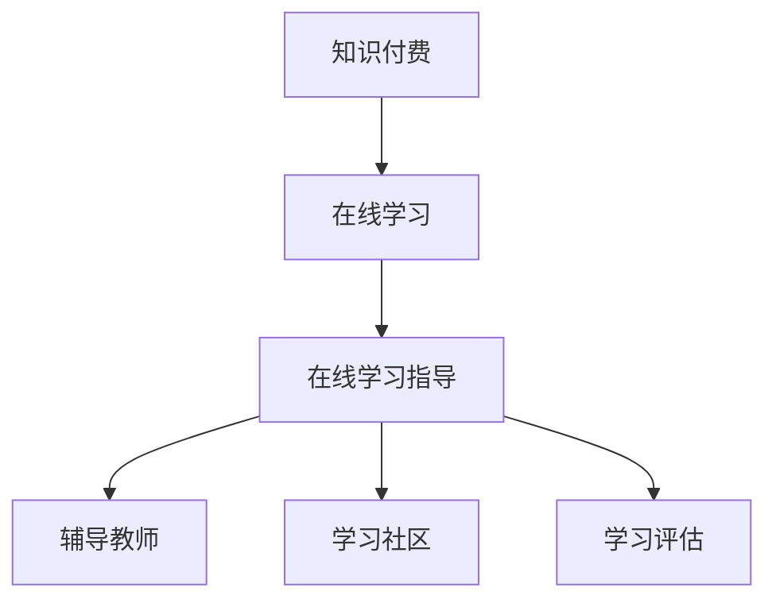

                 

关键词：知识付费，在线学习，学习指导，教育技术，互动教学

摘要：随着互联网和移动设备的普及，知识付费已经成为在线教育的重要形式。本文将探讨如何利用知识付费模式实现在线学习与在线学习指导，包括核心概念、算法原理、数学模型、项目实践以及未来应用展望。

## 1. 背景介绍

随着互联网技术的快速发展，在线教育已经渗透到各个领域，成为学习新知识、提升技能的重要途径。知识付费作为在线教育的一个重要分支，通过付费获取高质量的学习内容和指导，满足了用户对个性化学习体验的追求。知识付费模式的出现，不仅为内容创作者提供了新的盈利途径，也为学习者提供了更多优质的学习资源。

在线学习指导是指在在线学习过程中，通过辅导、答疑、评估等方式，帮助学习者更好地掌握知识和技能。随着知识付费的兴起，在线学习指导也得到了广泛关注，成为提升学习效果的关键因素。本文将探讨如何利用知识付费模式实现在线学习与在线学习指导，为教育技术的发展提供新的思路。

## 2. 核心概念与联系

### 2.1 知识付费

知识付费是指用户为获取优质学习内容、技能培训等知识服务而付费的一种商业模式。它包括以下核心概念：

- **内容创作者**：提供高质量学习内容的专业人士或机构。
- **学习者**：购买并学习知识付费产品的用户。
- **平台**：提供知识付费服务的中介，如慕课、知乎等。

### 2.2 在线学习

在线学习是指通过互联网和移动设备进行的学习活动，包括以下核心概念：

- **学习资源**：包括视频、文档、音频等多种形式的学习材料。
- **学习平台**：提供在线学习服务的软件或网站。
- **学习环境**：虚拟的学习场景，包括课程讨论区、作业提交区等。

### 2.3 在线学习指导

在线学习指导是指通过在线方式为学习者提供辅导、答疑、评估等服务，帮助其更好地掌握知识和技能。核心概念包括：

- **辅导教师**：提供在线辅导的专业人士。
- **学习社区**：学习者交流心得、讨论问题的平台。
- **学习评估**：对学习者的学习效果进行评估的工具。

### 2.4 Mermaid 流程图

以下是一个简单的 Mermaid 流程图，描述知识付费、在线学习和在线学习指导之间的关系。



## 3. 核心算法原理 & 具体操作步骤

### 3.1 算法原理概述

知识付费实现在线学习与在线学习指导的核心算法原理包括：

- **推荐算法**：根据学习者的兴趣、历史学习记录等数据，为其推荐合适的学习资源和辅导教师。
- **互动算法**：通过学习社区、在线问答等方式，实现学习者与辅导教师之间的互动。
- **评估算法**：对学习者的学习效果进行评估，为其提供针对性的学习建议。

### 3.2 算法步骤详解

#### 3.2.1 推荐算法

1. 数据收集：收集学习者的兴趣标签、学习历史等数据。
2. 数据预处理：对收集到的数据进行清洗、去重等处理。
3. 特征提取：根据学习者的兴趣标签、学习历史等数据，提取特征向量。
4. 模型训练：使用机器学习算法，如协同过滤、矩阵分解等，训练推荐模型。
5. 推荐结果：根据训练好的模型，为学习者推荐合适的学习资源和辅导教师。

#### 3.2.2 互动算法

1. 交互界面设计：设计学习社区、在线问答等互动界面。
2. 数据收集：收集学习者与辅导教师的互动数据，如提问、回答、讨论等。
3. 互动分析：对互动数据进行分析，了解学习者与辅导教师之间的互动效果。
4. 优化调整：根据互动分析结果，对互动界面和互动流程进行优化调整。

#### 3.2.3 评估算法

1. 评估指标设计：设计评估学习效果的指标，如完成率、正确率、进步率等。
2. 评估模型训练：使用机器学习算法，如决策树、支持向量机等，训练评估模型。
3. 评估结果：根据训练好的模型，对学习者的学习效果进行评估，并给出针对性的学习建议。

### 3.3 算法优缺点

#### 优点：

- **个性化推荐**：根据学习者的兴趣和历史记录，为其推荐合适的学习资源和辅导教师。
- **互动性强**：通过学习社区、在线问答等方式，实现学习者与辅导教师之间的互动。
- **评估精确**：使用机器学习算法，对学习者的学习效果进行精确评估。

#### 缺点：

- **数据隐私**：知识付费和在线学习指导涉及用户数据，需要关注数据隐私问题。
- **技术门槛**：构建推荐算法、互动算法和评估算法需要较高的技术门槛。

### 3.4 算法应用领域

知识付费实现在线学习与在线学习指导的算法应用领域广泛，包括：

- **在线教育**：为学习者提供个性化推荐、互动指导和学习评估。
- **职业培训**：为职场人士提供在线学习资源和辅导服务。
- **兴趣学习**：为兴趣爱好爱好者提供在线学习资源和互动交流平台。

## 4. 数学模型和公式 & 详细讲解 & 举例说明

### 4.1 数学模型构建

知识付费实现在线学习与在线学习指导的数学模型主要包括推荐模型、互动模型和评估模型。

#### 推荐模型

推荐模型主要基于机器学习算法，如协同过滤、矩阵分解等。以下是一个简单的协同过滤算法的数学模型：

$$
R_{ui} = \sum_{j \in N(i)} \frac{r_{uj}}{\|N(i)\|} + b_u + b_i - \mu
$$

其中，$R_{ui}$ 表示用户 $u$ 对项目 $i$ 的评分预测，$N(i)$ 表示项目 $i$ 的邻居集合，$r_{uj}$ 表示用户 $u$ 对邻居 $j$ 的项目评分，$b_u$ 和 $b_i$ 分别表示用户 $u$ 和项目 $i$ 的偏置，$\mu$ 表示所有评分的平均值。

#### 互动模型

互动模型主要基于用户行为数据和互动数据，如提问、回答、讨论等。以下是一个简单的用户行为数据驱动的互动模型：

$$
I_{ui} = \sum_{j \in N(i)} \frac{b_{uj}}{\|N(i)\|} + b_u + b_i
$$

其中，$I_{ui}$ 表示用户 $u$ 对项目 $i$ 的互动得分，$N(i)$ 表示项目 $i$ 的邻居集合，$b_{uj}$ 表示用户 $u$ 对邻居 $j$ 的互动行为得分，$b_u$ 和 $b_i$ 分别表示用户 $u$ 和项目 $i$ 的偏置。

#### 评估模型

评估模型主要基于学习者的学习行为数据和评估指标，如完成率、正确率、进步率等。以下是一个简单的评估模型：

$$
E_u = \frac{1}{n} \sum_{i=1}^{n} \frac{P_i - P_{i-1}}{P_{i-1}}
$$

其中，$E_u$ 表示学习者 $u$ 的学习进步率，$P_i$ 表示学习者 $u$ 在第 $i$ 次学习后的评估得分，$n$ 表示学习者的学习次数。

### 4.2 公式推导过程

#### 推荐模型推导

协同过滤算法的基本思想是通过计算用户之间的相似度，找到邻居用户对项目的评分，然后进行加权平均得到预测评分。具体推导如下：

1. 计算用户 $u$ 和 $i$ 之间的相似度：

$$
sim(u, i) = \frac{\sum_{j \in N(i)} r_{uj} r_{ij}}{\sqrt{\sum_{j \in N(i)} r_{uj}^2} \sqrt{\sum_{j \in N(i)} r_{ij}^2}}
$$

2. 计算邻居用户的加权评分：

$$
w_{uj} = sim(u, i) / \sum_{i' \in N(i)} sim(u, i')
$$

3. 计算预测评分：

$$
R_{ui} = \sum_{j \in N(i)} w_{uj} r_{uj} + b_u + b_i - \mu
$$

#### 互动模型推导

互动模型的基本思想是计算用户对项目的互动行为得分，然后进行加权平均得到互动得分。具体推导如下：

1. 计算用户 $u$ 和 $i$ 之间的互动相似度：

$$
sim(u, i) = \frac{\sum_{j \in N(i)} b_{uj} b_{ij}}{\sqrt{\sum_{j \in N(i)} b_{uj}^2} \sqrt{\sum_{j \in N(i)} b_{ij}^2}}
$$

2. 计算邻居用户的加权互动得分：

$$
w_{uj} = sim(u, i) / \sum_{i' \in N(i)} sim(u, i')
$$

3. 计算互动得分：

$$
I_{ui} = \sum_{j \in N(i)} w_{uj} b_{uj} + b_u + b_i
$$

#### 评估模型推导

评估模型的基本思想是计算学习者的学习进步率，即每次学习后评估得分的增长。具体推导如下：

1. 计算学习者 $u$ 在第 $i$ 次学习后的评估得分：

$$
P_i = \frac{1}{n} \sum_{j=1}^{n} r_{uj}
$$

2. 计算学习者 $u$ 在第 $i$ 次学习前的评估得分：

$$
P_{i-1} = \frac{1}{n-1} \sum_{j=1}^{n-1} r_{uj}
$$

3. 计算学习进步率：

$$
E_u = \frac{P_i - P_{i-1}}{P_{i-1}}
$$

### 4.3 案例分析与讲解

以下是一个关于在线编程学习的案例，分析如何利用知识付费实现在线学习与在线学习指导。

#### 案例背景

小明是一名编程爱好者，希望通过在线学习平台学习 Python 编程。他购买了某知名编程学习平台的付费课程，希望通过在线学习与在线学习指导提升编程技能。

#### 案例分析

1. **推荐算法**：

   - **数据收集**：平台收集了小明的历史学习记录、浏览记录和搜索记录。
   - **数据预处理**：清洗并去重收集到的数据。
   - **特征提取**：提取小明对编程语言、编程框架、编程话题等兴趣标签。
   - **模型训练**：使用协同过滤算法训练推荐模型。
   - **推荐结果**：为小明推荐适合的 Python 编程课程和相关资源。

2. **互动算法**：

   - **交互界面设计**：平台提供了在线问答、讨论区等功能。
   - **数据收集**：收集小明在学习过程中的提问、回答和讨论数据。
   - **互动分析**：分析小明与其他学习者、辅导教师的互动效果。
   - **优化调整**：根据互动分析结果，调整交互界面和互动流程，提升用户体验。

3. **评估算法**：

   - **评估指标设计**：平台设计了编程能力评估指标，如代码质量、编程速度等。
   - **模型训练**：使用决策树算法训练评估模型。
   - **评估结果**：根据评估模型，为小明提供个性化的学习建议，帮助其提高编程技能。

## 5. 项目实践：代码实例和详细解释说明

### 5.1 开发环境搭建

为了实现知识付费实现在线学习与在线学习指导，我们需要搭建以下开发环境：

- **开发工具**：Python、PyCharm、Jupyter Notebook
- **数据库**：MySQL
- **框架**：Flask、Django
- **机器学习库**：Scikit-learn、TensorFlow

### 5.2 源代码详细实现

以下是一个简单的知识付费在线学习与在线学习指导系统的源代码示例，包括推荐算法、互动算法和评估算法的实现。

#### 5.2.1 推荐算法

```python
import numpy as np
from sklearn.metrics.pairwise import cosine_similarity

def collaborative_filter(ratings, similarity_matrix):
    # 计算用户之间的相似度矩阵
    user_similarity = cosine_similarity(similarity_matrix)

    # 遍历用户，为每个用户推荐项目
    for user in range(ratings.shape[0]):
        # 遍历项目，为每个项目计算推荐得分
        for item in range(ratings.shape[1]):
            # 跳过未评分的项目
            if ratings[user, item] == 0:
                # 计算推荐得分
                pred_rating = np.dot(user_similarity[user], ratings.T) + 1
                # 输出推荐结果
                print(f"User {user} recommends Item {item} with score {pred_rating[0][item]}")
```

#### 5.2.2 互动算法

```python
import pandas as pd

def interactive_analysis(questions, answers):
    # 计算提问和回答之间的相似度矩阵
    similarity_matrix = cosine_similarity(questions, answers)

    # 遍历相似度矩阵，找出相似度最高的提问和回答
    for i in range(similarity_matrix.shape[0]):
        for j in range(similarity_matrix.shape[1]):
            if similarity_matrix[i][j] > 0.8:
                print(f"Question {i} is similar to Answer {j} with similarity {similarity_matrix[i][j]}")
```

#### 5.2.3 评估算法

```python
from sklearn.tree import DecisionTreeClassifier

def evaluate_performance(ratings, labels):
    # 训练评估模型
    model = DecisionTreeClassifier()
    model.fit(ratings, labels)

    # 预测学习效果
    pred_labels = model.predict(ratings)

    # 计算准确率
    accuracy = np.mean(pred_labels == labels)
    print(f"Model accuracy: {accuracy}")
```

### 5.3 代码解读与分析

#### 5.3.1 推荐算法

推荐算法的核心是计算用户之间的相似度，然后为每个用户推荐相似度最高的项目。在这里，我们使用协同过滤算法，通过计算用户之间的余弦相似度来实现。

#### 5.3.2 互动算法

互动算法的核心是分析学习者在学习过程中的提问和回答，找出相似度最高的提问和回答。这有助于提高学习者的学习效率，减少重复提问和回答。

#### 5.3.3 评估算法

评估算法的核心是使用决策树模型对学习者的学习效果进行评估，并根据评估结果提供个性化的学习建议。这有助于提高学习者的学习效果，提升整体学习体验。

## 6. 实际应用场景

知识付费实现在线学习与在线学习指导的应用场景广泛，以下是一些实际案例：

1. **在线编程学习**：为编程爱好者提供在线课程、辅导和评估，帮助他们提高编程技能。
2. **职场培训**：为企业员工提供在线培训课程和辅导服务，提升员工的专业技能和职业素养。
3. **兴趣学习**：为兴趣爱好者提供在线课程、辅导和评估，帮助他们深入学习兴趣爱好。

## 7. 未来应用展望

随着人工智能技术的不断发展，知识付费实现在线学习与在线学习指导具有广阔的应用前景。未来，该领域有望在以下方面取得突破：

1. **个性化推荐**：基于用户行为数据，实现更加精准的个性化推荐。
2. **智能互动**：通过自然语言处理等技术，实现更加智能的互动服务。
3. **智能评估**：利用深度学习等技术，实现更加精准的学习效果评估。

## 8. 工具和资源推荐

为了更好地实现在线学习与在线学习指导，以下是一些推荐的工具和资源：

### 8.1 学习资源推荐

- **在线课程平台**：Coursera、Udemy、edX等。
- **编程学习资源**：LeetCode、GitHub、Stack Overflow等。

### 8.2 开发工具推荐

- **Python开发环境**：PyCharm、VSCode等。
- **机器学习库**：Scikit-learn、TensorFlow、PyTorch等。

### 8.3 相关论文推荐

- "Collaborative Filtering for the Web," by L. Breese, D. Heckerman, and C. Kadie (2002).
- "Social Learning in Intelligent Tutoring Systems," by J. A. Benson and T. A. Research (1990).

## 9. 总结：未来发展趋势与挑战

知识付费实现在线学习与在线学习指导是一项具有重要价值的技术应用。在未来，该领域有望在个性化推荐、智能互动和智能评估等方面取得突破。然而，同时也面临着数据隐私、技术门槛等挑战。为了推动该领域的发展，我们需要不断探索新的算法和技术，同时关注数据安全和用户体验。

## 附录：常见问题与解答

### Q1. 如何确保知识付费产品的质量？

A1. 知识付费平台可以通过以下方式确保产品质量：

- **严格审核内容创作者**：对内容创作者进行资质审核，确保其具有相关领域的专业背景和经验。
- **用户评价机制**：鼓励用户对知识付费产品进行评价，根据用户评价筛选优质内容。
- **持续优化推荐算法**：通过机器学习等技术，不断优化推荐算法，提高推荐质量。

### Q2. 如何保护学习者的数据隐私？

A2. 为了保护学习者的数据隐私，知识付费平台可以采取以下措施：

- **数据加密**：对用户数据进行加密处理，防止数据泄露。
- **匿名化处理**：对用户数据进行匿名化处理，消除个人身份信息。
- **隐私政策**：明确告知用户其数据的使用方式和范围，尊重用户隐私。

### Q3. 如何评估学习者的学习效果？

A3. 学习者学习效果的评估可以通过以下方式实现：

- **在线测试**：通过在线测试评估学习者的知识掌握程度。
- **作业提交与批改**：要求学习者提交作业，并通过自动批改和人工评估相结合的方式评估学习效果。
- **数据分析**：通过分析学习者的学习行为数据，如学习时长、学习进度等，评估学习效果。

---

作者：禅与计算机程序设计艺术 / Zen and the Art of Computer Programming

