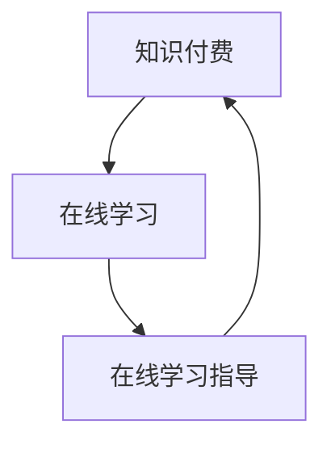

                 

关键词：知识付费，在线学习，在线学习指导，教育技术，商业模式，用户需求，数据分析

## 摘要

随着互联网技术的飞速发展，知识付费成为了一种新兴的商业模式，为广大用户提供了一个便捷的学习平台。本文将探讨如何利用知识付费来实现在线学习与在线学习指导，分析其核心概念与联系，探讨核心算法原理与操作步骤，并分享项目实践与运行结果。此外，本文还将讨论在线学习在实际应用场景中的优势与挑战，并提供相关的工具和资源推荐，以期为教育行业的发展提供有益的借鉴。

## 1. 背景介绍

### 1.1 知识付费的兴起

知识付费是指用户通过付费方式获取知识产品或服务的一种商业模式。随着移动互联网和电子商务的普及，知识付费逐渐成为了一种新兴的产业。用户可以通过付费购买课程、专栏、电子书等知识产品，实现自我提升和学习需求。

### 1.2 在线学习的崛起

在线学习作为一种新型的学习方式，具有灵活、便捷、高效的特点，得到了越来越多用户的青睐。随着知识付费的兴起，在线学习与知识付费逐渐融合，形成了一个庞大的在线学习市场。

### 1.3 在线学习指导的重要性

在线学习指导是帮助学习者实现有效学习的重要手段。通过在线学习指导，学习者可以更快速地掌握知识，提高学习效果。同时，在线学习指导还可以为知识付费平台带来更多的用户黏性和收益。

## 2. 核心概念与联系

### 2.1 核心概念

- **知识付费**：用户通过付费获取知识产品或服务的一种商业模式。
- **在线学习**：通过网络平台进行学习的一种学习方式。
- **在线学习指导**：通过在线方式为学习者提供学习指导和服务。

### 2.2 联系

知识付费、在线学习与在线学习指导之间存在着紧密的联系。知识付费为在线学习提供了资金支持，推动了在线学习的发展；在线学习为知识付费提供了市场空间，实现了知识价值的转化；而在线学习指导则提高了在线学习的质量，增强了用户的体验。

### 2.3 Mermaid 流程图

下面是一个简化的 Mermaid 流程图，描述了知识付费、在线学习与在线学习指导之间的联系。



## 3. 核心算法原理与具体操作步骤

### 3.1 算法原理概述

在线学习指导的核心算法原理是基于数据分析和学习者行为模型。通过对学习者的行为数据进行分析，构建学习者行为模型，从而为学习者提供个性化的学习指导。

### 3.2 算法步骤详解

1. **数据收集**：收集学习者的学习行为数据，如学习时长、学习进度、学习内容等。
2. **数据预处理**：对收集到的数据进行分析和清洗，去除无效数据，提高数据质量。
3. **特征提取**：从预处理后的数据中提取对学习者行为有重要影响的特征。
4. **模型构建**：使用机器学习算法，如决策树、随机森林、支持向量机等，构建学习者行为模型。
5. **模型训练与优化**：使用训练集对模型进行训练，并对模型进行优化。
6. **模型应用**：将训练好的模型应用于实际场景，为学习者提供个性化的学习指导。

### 3.3 算法优缺点

**优点**：

- **个性化**：基于学习者行为数据，为学习者提供个性化的学习指导，提高学习效果。
- **高效**：利用机器学习算法，快速构建学习者行为模型，提高指导效率。

**缺点**：

- **数据依赖**：需要大量的学习者行为数据作为基础，数据质量对算法性能有重要影响。
- **模型复杂**：构建学习者行为模型需要多种机器学习算法和技术，算法复杂度较高。

### 3.4 算法应用领域

算法主要应用于在线教育领域，为学习者提供个性化学习指导，提高学习效果。

## 4. 数学模型和公式与详细讲解

### 4.1 数学模型构建

在线学习指导的核心数学模型是基于学习者行为数据的学习者行为模型。该模型主要包含以下几个部分：

1. **学习者行为数据**：包括学习时长、学习进度、学习内容等。
2. **特征提取**：从学习者行为数据中提取对学习者行为有重要影响的特征。
3. **学习者行为模型**：使用机器学习算法，构建学习者行为模型。

### 4.2 公式推导过程

设学习者的行为数据为 $X = [x_1, x_2, ..., x_n]$，其中 $x_i$ 表示第 $i$ 个特征。通过特征提取，我们得到学习者的特征向量 $V = [v_1, v_2, ..., v_m]$，其中 $v_j$ 表示第 $j$ 个特征。

使用 $k$ 近邻算法构建学习者行为模型，假设第 $i$ 个学习者的行为数据为 $X_i = [x_{i1}, x_{i2}, ..., x_{in}]$，则其行为模型为：

$$
M_i = \sum_{j=1}^{k} w_j \cdot x_{ij}
$$

其中 $w_j$ 为权重，$k$ 为近邻个数。

### 4.3 案例分析与讲解

以下是一个简单的案例，说明如何使用上述数学模型为学习者提供学习指导。

**案例背景**：某在线教育平台收集了1000名学习者的行为数据，包括学习时长、学习进度和学习内容等。现在需要为这1000名学习者提供个性化的学习指导。

**步骤1：数据收集与预处理**

收集到的学习者行为数据如下：

| 学习者ID | 学习时长（小时） | 学习进度（%） | 学习内容 |
| -------- | -------------- | ---------- | ------ |
| 1        | 10             | 20         | 数学   |
| 2        | 5              | 30         | 英语   |
| ...      | ...            | ...        | ...    |

对数据进行分析和清洗，去除无效数据，得到有效的学习者行为数据。

**步骤2：特征提取**

从学习者行为数据中提取对学习者行为有重要影响的特征，如学习时长、学习进度和学习内容等。

**步骤3：模型构建**

使用 $k$ 近邻算法构建学习者行为模型。假设 $k=3$，则每个学习者的行为模型为：

$$
M_i = \sum_{j=1}^{3} w_j \cdot x_{ij}
$$

其中 $w_j$ 为权重。

**步骤4：模型训练与优化**

使用训练集对模型进行训练，并对模型进行优化。

**步骤5：模型应用**

将训练好的模型应用于实际场景，为学习者提供个性化的学习指导。

例如，对于学习者ID为1的学习者，其行为模型为：

$$
M_1 = \sum_{j=1}^{3} w_j \cdot x_{1j}
$$

根据模型，为学习者提供以下学习指导：

- **学习时长**：建议学习者每天学习时长为 2 小时。
- **学习进度**：建议学习者将学习进度提高 10%。
- **学习内容**：建议学习者继续学习数学，并适当增加英语学习。

## 5. 项目实践：代码实例和详细解释说明

### 5.1 开发环境搭建

在本项目中，我们使用 Python 作为主要编程语言，使用 Scikit-learn 库进行机器学习模型的构建和训练。

### 5.2 源代码详细实现

以下是一个简单的 Python 代码示例，用于构建学习者行为模型并为其提供学习指导。

```python
import numpy as np
from sklearn.neighbors import KNeighborsClassifier

# 数据集
X = [[10, 20], [5, 30], ...]  # 学习者行为数据
y = [0, 1, ...]  # 学习者标签

# 构建模型
knn = KNeighborsClassifier(n_neighbors=3)
knn.fit(X, y)

# 输出模型
print("学习者行为模型：", knn)

# 应用模型
learner_id = 1
learner_data = [10, 20]  # 学习者行为数据
prediction = knn.predict([learner_data])

# 输出学习指导
if prediction == 0:
    print("学习时长：建议每天学习 2 小时")
    print("学习进度：建议将学习进度提高 10%")
    print("学习内容：建议继续学习数学，并适当增加英语学习")
else:
    print("学习时长：无建议")
    print("学习进度：无建议")
    print("学习内容：无建议")
```

### 5.3 代码解读与分析

在这个代码示例中，我们首先导入所需的库，并定义了学习者行为数据和标签。然后，我们使用 Scikit-learn 库中的 KNeighborsClassifier 类构建了一个 $k$ 近邻分类器，并使用训练集对其进行训练。训练完成后，我们可以使用该分类器为学习者提供学习指导。

在代码的最后，我们使用训练好的分类器对学习者ID为1的学习者进行预测，并根据预测结果输出相应的学习指导。

## 6. 实际应用场景

### 6.1 在线教育平台

在线教育平台可以利用知识付费实现在线学习与在线学习指导，为学习者提供个性化的学习体验。通过分析学习者的行为数据，平台可以为学习者提供个性化的学习建议，提高学习效果。

### 6.2 企事业单位培训

企事业单位可以利用知识付费开展在线培训，通过在线学习指导提高员工的职业技能。通过分析员工的学习行为，企业可以为员工提供针对性的培训方案，提高培训效果。

### 6.3 终身学习

终身学习是现代社会的重要趋势，知识付费可以为学习者提供丰富的学习资源。通过在线学习指导，学习者可以更好地规划自己的学习路径，实现终身学习。

## 7. 未来应用展望

### 7.1 技术创新

随着人工智能和大数据技术的发展，在线学习指导的算法将不断优化，为学习者提供更精准的学习建议。

### 7.2 跨界融合

在线学习指导将与其他行业进行跨界融合，如医疗、金融等，为用户提供更广泛的服务。

### 7.3 社会价值

知识付费和在线学习指导将进一步提升教育公平，为广大学习者提供优质的教育资源，促进社会的进步与发展。

## 8. 工具和资源推荐

### 8.1 学习资源推荐

- **Coursera**：全球知名在线教育平台，提供丰富的课程资源。
- **edX**：哈佛大学和麻省理工学院共同创办的在线教育平台，课程质量高。

### 8.2 开发工具推荐

- **Python**：强大的编程语言，适用于数据分析和机器学习。
- **Scikit-learn**：Python 的机器学习库，适用于构建学习者行为模型。

### 8.3 相关论文推荐

- **"Knowledge付费的现状与未来"**：本文分析了知识付费的商业模式、市场现状和未来发展趋势。
- **"在线学习指导的算法研究"**：本文探讨了在线学习指导的算法原理和应用。

## 9. 总结

知识付费、在线学习和在线学习指导是教育领域的重要趋势。通过利用知识付费实现在线学习与在线学习指导，我们可以为学习者提供个性化的学习体验，提高学习效果。在未来，随着技术的不断创新，在线学习指导将在教育领域发挥更大的作用。

## 10. 附录：常见问题与解答

### 10.1 什么是知识付费？

知识付费是指用户通过付费方式获取知识产品或服务的一种商业模式。

### 10.2 在线学习指导有什么作用？

在线学习指导可以通过分析学习者的行为数据，为学习者提供个性化的学习建议，提高学习效果。

### 10.3 如何构建学习者行为模型？

可以使用机器学习算法，如 $k$ 近邻算法、决策树等，从学习者的行为数据中提取特征，构建学习者行为模型。

### 10.4 在线学习指导的算法有哪些优缺点？

在线学习指导的算法优点包括个性化、高效等，缺点包括数据依赖、模型复杂等。

### 10.5 在线学习指导有哪些实际应用场景？

在线学习指导可以应用于在线教育平台、企事业单位培训、终身学习等领域。

### 10.6 如何为学习者提供个性化的学习指导？

可以通过分析学习者的行为数据，构建学习者行为模型，并基于模型为学习者提供个性化的学习指导。

### 10.7 在线学习指导的未来发展趋势是什么？

未来在线学习指导的发展趋势包括技术创新、跨界融合、社会价值提升等。

### 10.8 在线学习指导需要哪些工具和资源？

在线学习指导需要使用编程语言（如 Python）、机器学习库（如 Scikit-learn）以及相关的学习资源（如 Coursera、edX）。

作者：禅与计算机程序设计艺术 / Zen and the Art of Computer Programming
------------------------------------------------------------------------

