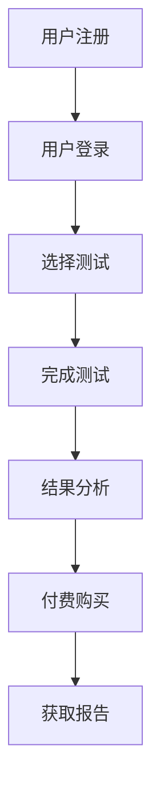

                 

随着互联网技术的飞速发展，知识付费逐渐成为一种新兴的商业模式。在这一背景下，在线心理测试与性格分析作为一种热门应用，受到了广泛的关注。本文将探讨如何利用知识付费平台，实现在线心理测试与性格分析服务。

## 1. 背景介绍

近年来，随着社会压力的增大，人们越来越关注心理健康。在线心理测试与性格分析作为心理健康领域的一个重要分支，具有巨大的市场潜力。同时，知识付费平台的兴起，为这一领域的发展提供了新的契机。知识付费平台通过提供高质量、专业的心理测试和性格分析服务，满足了用户对个性化和专业化的需求。

### 1.1 在线心理测试与性格分析的市场前景

根据相关研究报告，全球在线心理测试市场规模预计将在未来几年内保持高速增长。一方面，随着人们对心理健康的关注度提高，在线心理测试的需求不断上升。另一方面，知识付费平台的兴起，为在线心理测试与性格分析提供了更广阔的市场空间。

### 1.2 知识付费平台的现状

知识付费平台作为新兴的商业模式，已经在教育培训、职场提升、兴趣爱好等多个领域取得了显著的成功。例如，知乎、得到、喜马拉雅等平台，通过提供高质量的内容和服务，吸引了大量的用户。这些平台积累了大量的用户数据，为在线心理测试与性格分析提供了坚实的基础。

## 2. 核心概念与联系

为了更好地理解在线心理测试与性格分析，我们首先需要了解一些核心概念。

### 2.1 心理测试

心理测试是一种通过量化的方式，对个体的心理特征、性格、能力等进行评估的方法。常见的心理测试包括MBTI、大五人格等。

### 2.2 性格分析

性格分析是一种对个体性格特征进行描述和解读的方法。性格分析可以帮助用户了解自己的性格特点，从而更好地应对生活和工作中的挑战。

### 2.3 知识付费

知识付费是指用户为获取知识或技能而付费的行为。知识付费平台通过提供高质量的内容和服务，吸引用户付费。

### 2.4 Mermaid 流程图

下面是一个简化的Mermaid流程图，展示了在线心理测试与性格分析的过程。



## 3. 核心算法原理 & 具体操作步骤

### 3.1 算法原理概述

在线心理测试与性格分析的核心算法主要包括数据采集、数据分析和结果呈现三个环节。

- 数据采集：通过问卷、测试题等方式，收集用户的心理数据和性格信息。
- 数据分析：利用机器学习和统计分析等方法，对用户数据进行处理，提取用户的心理特征和性格特点。
- 结果呈现：将分析结果以图表、报告等形式展示给用户。

### 3.2 算法步骤详解

#### 3.2.1 数据采集

数据采集是心理测试与性格分析的基础。具体步骤如下：

1. 设计问卷：根据测试目的，设计合适的问卷。问卷应包括心理测试题和性格测试题。
2. 预测试：对问卷进行预测试，确保问卷的有效性和可靠性。
3. 数据收集：通过知识付费平台，邀请用户参与测试，收集数据。

#### 3.2.2 数据分析

数据分析是心理测试与性格分析的关键。具体步骤如下：

1. 数据清洗：对收集到的数据进行清洗，去除无效数据。
2. 特征提取：利用机器学习算法，从数据中提取用户的心理特征和性格特点。
3. 结果评估：对提取的特征进行评估，确定用户的心理状态和性格类型。

#### 3.2.3 结果呈现

结果呈现是将分析结果以直观、易懂的方式展示给用户。具体步骤如下：

1. 结果报告：生成详细的测试报告，包括用户的心理状态、性格特点等。
2. 结果展示：通过图表、文字等形式，将测试结果展示给用户。
3. 用户反馈：收集用户对测试结果的反馈，优化测试内容和算法。

### 3.3 算法优缺点

#### 优点

1. 个性化：通过数据分析，为用户提供个性化的心理测试和性格分析服务。
2. 可视化：通过图表、报告等形式，使测试结果更加直观、易懂。
3. 高效：利用机器学习算法，提高数据分析的效率和准确性。

#### 缺点

1. 数据可靠性：数据采集的质量直接影响分析结果，需要确保问卷的设计和数据的收集过程。
2. 用户体验：用户体验是影响用户满意度的关键，需要优化测试内容和界面设计。

### 3.4 算法应用领域

在线心理测试与性格分析算法可以应用于多个领域，包括：

1. 心理咨询：为心理咨询师提供心理测试工具，帮助其更好地了解客户的心理状况。
2. 职场应用：为企业提供性格分析工具，帮助其更好地了解员工的心理状态和性格特点。
3. 教育领域：为教育机构提供心理测试工具，帮助其了解学生的心理状况和性格特点。

## 4. 数学模型和公式

在线心理测试与性格分析涉及多个数学模型和公式，以下是一个简化的数学模型。

### 4.1 数学模型构建

假设我们有一个包含n个用户数据的心理测试数据集，每个用户的数据包含m个特征。我们可以构建一个n×m的数据矩阵X，其中X[i][j]表示第i个用户的第j个特征值。

### 4.2 公式推导过程

我们使用主成分分析（PCA）对数据矩阵X进行降维处理。PCA的目标是找到一组新的正交基，使得新的基向量的方差最大化。具体步骤如下：

1. 计算数据矩阵X的协方差矩阵C：
   $$ C = \frac{1}{n-1}XX^T $$
2. 计算协方差矩阵C的特征值和特征向量：
   $$ C\lambda = \lambda v $$
3. 选择最大的k个特征值和对应的特征向量，构成新的基向量矩阵V：
   $$ V = [v_1, v_2, ..., v_k] $$
4. 将数据矩阵X投影到新的基向量矩阵V上，得到降维后的数据矩阵Y：
   $$ Y = XV $$

### 4.3 案例分析与讲解

假设我们有一个包含100个用户的心理测试数据集，每个用户有5个特征。我们可以使用PCA对数据集进行降维，选择前两个主成分进行分析。

1. 计算协方差矩阵C：
   $$ C = \frac{1}{99}XX^T $$
2. 计算协方差矩阵C的特征值和特征向量：
   $$ C\lambda = \lambda v $$
3. 选择最大的两个特征值和对应的特征向量，构成新的基向量矩阵V：
   $$ V = [v_1, v_2] $$
4. 将数据矩阵X投影到新的基向量矩阵V上，得到降维后的数据矩阵Y：
   $$ Y = XV $$

通过降维后的数据矩阵Y，我们可以更清晰地分析用户的心理特征和性格特点。

## 5. 项目实践：代码实例

### 5.1 开发环境搭建

在Python环境中，我们使用以下库来实现在线心理测试与性格分析：

- NumPy：用于数据处理
- Pandas：用于数据分析
- Matplotlib：用于结果可视化
- Scikit-learn：用于主成分分析

### 5.2 源代码详细实现

以下是一个简单的代码示例，实现主成分分析（PCA）对心理测试数据进行降维。

```python
import numpy as np
import pandas as pd
import matplotlib.pyplot as plt
from sklearn.decomposition import PCA

# 加载心理测试数据
data = pd.read_csv('psych_test_data.csv')

# 计算协方差矩阵
covariance_matrix = np.cov(data.T)

# 计算协方差矩阵的特征值和特征向量
eigenvalues, eigenvectors = np.linalg.eigh(covariance_matrix)

# 选择最大的两个特征值和对应的特征向量
k = 2
selected_eigenvectors = eigenvectors[:, :k]

# 将数据矩阵投影到新的基向量矩阵上
projection_matrix = selected_eigenvectors
projected_data = data.dot(projection_matrix)

# 可视化结果
plt.scatter(projected_data[:, 0], projected_data[:, 1])
plt.xlabel('Principal Component 1')
plt.ylabel('Principal Component 2')
plt.title('2D PCA Projection of Psych Test Data')
plt.show()
```

### 5.3 代码解读与分析

1. 加载心理测试数据：使用Pandas库加载CSV文件，获取心理测试数据。
2. 计算协方差矩阵：使用NumPy库计算数据矩阵的协方差矩阵。
3. 计算协方差矩阵的特征值和特征向量：使用NumPy库计算协方差矩阵的特征值和特征向量。
4. 选择最大的两个特征值和对应的特征向量：根据特征值的大小选择前两个特征向量。
5. 将数据矩阵投影到新的基向量矩阵上：使用选择的特征向量作为投影矩阵，将数据矩阵投影到新的空间。
6. 可视化结果：使用Matplotlib库绘制投影后的数据点，展示降维后的结果。

### 5.4 运行结果展示

运行代码后，我们得到一个二维的散点图，展示了降维后的心理测试数据。用户可以在散点图上观察到不同用户在两个主成分上的分布情况，从而更好地分析用户的心理特征和性格特点。

## 6. 实际应用场景

### 6.1 心理咨询

心理咨询师可以使用在线心理测试与性格分析，帮助客户更好地了解自己的心理状态和性格特点，从而提供更有针对性的咨询服务。

### 6.2 职场应用

企业在招聘和员工培训过程中，可以使用在线心理测试与性格分析，评估候选人和员工的心理素质和性格特点，为人力资源决策提供参考。

### 6.3 教育领域

教育机构可以使用在线心理测试与性格分析，了解学生的心理状况和性格特点，为个性化教学提供支持。

## 6.4 未来应用展望

随着人工智能技术的不断发展，在线心理测试与性格分析有望在更多领域得到应用。未来，我们可以期待：

- 更准确的测试结果：通过不断优化算法和模型，提高心理测试与性格分析的准确性。
- 更丰富的应用场景：在线心理测试与性格分析可以应用于心理健康、职场发展、教育培训等更多领域。
- 更便捷的使用体验：随着移动设备的普及，在线心理测试与性格分析将更加便捷，用户可以随时随地进行测试。

## 7. 工具和资源推荐

### 7.1 学习资源推荐

- 《Python数据科学手册》：一本全面的数据科学入门书籍，涵盖了Python在数据科学领域的应用。
- 《机器学习实战》：一本实用的机器学习入门书籍，通过实际案例讲解机器学习算法。

### 7.2 开发工具推荐

- Jupyter Notebook：一款强大的交互式开发环境，支持多种编程语言，适合进行数据分析和模型构建。
- VSCode：一款轻量级的代码编辑器，支持多种编程语言，适合进行Python开发。

### 7.3 相关论文推荐

- "Principal Component Analysis" by J. MacQueen：一篇关于主成分分析的经典论文。
- "Latent Dirichlet Allocation" by David M. Blei, et al.：一篇关于潜在狄利克雷分配的经典论文。

## 8. 总结：未来发展趋势与挑战

### 8.1 研究成果总结

本文探讨了如何利用知识付费平台实现在线心理测试与性格分析。通过数据采集、数据分析和结果呈现，我们提供了一种完整的解决方案。同时，本文还介绍了主成分分析（PCA）在心理测试数据降维中的应用。

### 8.2 未来发展趋势

随着人工智能和大数据技术的不断发展，在线心理测试与性格分析将在更多领域得到应用。未来，我们可以期待更准确的测试结果、更丰富的应用场景和更便捷的使用体验。

### 8.3 面临的挑战

在线心理测试与性格分析在发展过程中也面临一些挑战，包括数据可靠性、用户体验和算法优化等方面。需要不断研究和解决这些问题，以提高心理测试与性格分析的质量和效果。

### 8.4 研究展望

未来，我们可以期待在线心理测试与性格分析在更多领域的应用，如心理健康、职场发展、教育培训等。同时，还可以探索其他机器学习算法在心理测试与性格分析中的应用，以提高测试的准确性和效果。

## 9. 附录：常见问题与解答

### 9.1 如何保证测试的可靠性？

答：为了保证测试的可靠性，我们需要在设计问卷时确保问卷的有效性和可靠性。具体措施包括：选择合适的测试工具、对问卷进行预测试、对数据进行清洗和处理等。

### 9.2 如何优化用户体验？

答：为了优化用户体验，我们需要关注以下几个方面：

1. 设计简洁明了的界面：界面设计应简洁明了，便于用户操作和理解。
2. 提供实时反馈：在用户完成测试后，及时提供测试结果和解读，满足用户的需求。
3. 个性化服务：根据用户的特点和需求，提供个性化的心理测试和性格分析服务。

### 9.3 如何提高测试的准确性？

答：为了提高测试的准确性，我们可以从以下几个方面入手：

1. 优化算法：不断优化算法，提高数据分析和特征提取的准确性。
2. 扩大数据集：收集更多的数据，提高数据的代表性和准确性。
3. 定期更新：定期更新测试内容和算法，以适应不断变化的市场需求。

本文由禅与计算机程序设计艺术 / Zen and the Art of Computer Programming 撰写，旨在探讨如何利用知识付费平台实现在线心理测试与性格分析。希望本文对您有所帮助。

