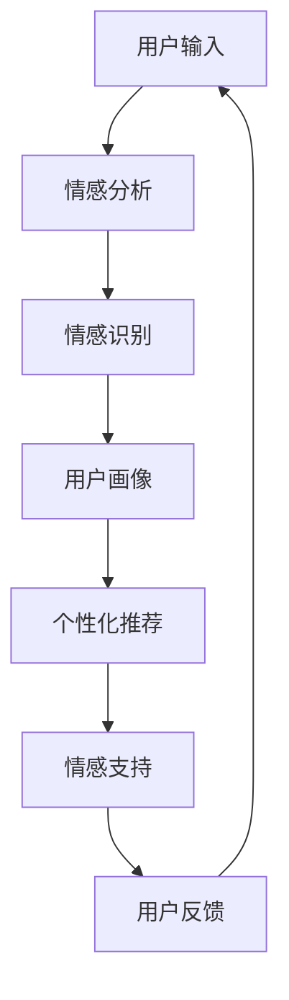

                 

关键词：知识付费，在线情感咨询，恋爱指导，人工智能，算法，机器学习，自然语言处理，知识图谱，情感分析，用户画像，深度学习，聊天机器人，商业模式。

> 摘要：本文将探讨如何利用知识付费平台实现在线情感咨询与恋爱指导。通过结合人工智能、机器学习和自然语言处理技术，构建一个高效、智能的咨询系统，为用户提供个性化的情感支持和指导。本文将详细介绍该系统的核心算法原理、数学模型构建、项目实践、应用场景及未来发展趋势。

## 1. 背景介绍

在当今社会，情感咨询和恋爱指导已成为越来越多人关注的问题。然而，传统的面对面咨询和心理咨询存在诸多局限性，如地域限制、时间成本高、隐私保护等问题。随着互联网和人工智能技术的快速发展，在线情感咨询与恋爱指导成为了一种新兴的解决方案。知识付费平台则为这一模式提供了良好的发展环境，使得更多用户能够以较低的成本获得高质量的情感咨询服务。

本文旨在探讨如何利用知识付费平台，通过结合人工智能、机器学习和自然语言处理技术，构建一个高效、智能的在线情感咨询与恋爱指导系统。该系统将实现用户画像、情感分析、个性化推荐等功能，为用户提供个性化、智能化的情感支持和指导。

### 1.1 在线情感咨询与恋爱指导的现状

近年来，随着人们对情感健康关注的提升，在线情感咨询与恋爱指导市场逐渐扩大。根据市场研究数据显示，全球在线心理咨询服务市场规模在2020年已经达到数百亿美元，预计未来几年仍将保持高速增长。在中国，这一市场也在迅速崛起，各大平台纷纷布局，如京东健康、阿里健康、平安好医生等。

然而，当前在线情感咨询与恋爱指导市场仍然存在一些问题，如咨询师资质参差不齐、服务质量难以保障、用户隐私保护不足等。此外，大多数平台仍采用传统的文本聊天模式，缺乏智能化、个性化的服务。

### 1.2 知识付费平台的发展

知识付费平台作为一种新型的商业模式，近年来在我国得到了迅速发展。以得到App、知乎Live、喜马拉雅等为代表的平台，通过提供专业课程、线上讲座、专家问答等形式，为用户提供高质量的知识和服务。这些平台为在线情感咨询与恋爱指导提供了良好的发展基础，使得咨询师能够通过付费模式获得合理回报，从而提高服务质量和专业性。

## 2. 核心概念与联系

### 2.1 人工智能、机器学习与自然语言处理

人工智能（AI）、机器学习（ML）和自然语言处理（NLP）是构建在线情感咨询与恋爱指导系统的核心技术。

- **人工智能**：人工智能是模拟、延伸和扩展人类智能的理论、方法、技术及应用。在情感咨询与恋爱指导系统中，人工智能主要用于实现情感分析、用户画像、个性化推荐等功能。

- **机器学习**：机器学习是人工智能的一个分支，通过构建模型，从数据中自动学习规律，进行预测和决策。在情感咨询与恋爱指导系统中，机器学习技术可以用于情感识别、情感预测、用户分类等任务。

- **自然语言处理**：自然语言处理是人工智能的一个分支，主要研究如何使计算机能够理解、生成和处理人类自然语言。在情感咨询与恋爱指导系统中，自然语言处理技术可以用于语音识别、文本分析、情感分类等任务。

### 2.2 知识图谱

知识图谱是一种结构化数据表示方法，通过实体、属性和关系之间的关联，构建一个语义丰富的知识网络。在情感咨询与恋爱指导系统中，知识图谱可以用于存储和表示情感知识，为情感分析和个性化推荐提供支持。

### 2.3 情感分析

情感分析是一种自然语言处理技术，通过分析文本数据，判断其中所表达的情感倾向。在情感咨询与恋爱指导系统中，情感分析技术可以用于识别用户情感状态，为其提供针对性的情感支持和建议。

### 2.4 用户画像

用户画像是对用户特征和行为的抽象描述，用于了解用户需求和行为模式。在情感咨询与恋爱指导系统中，用户画像可以用于个性化推荐、情感分析等任务，提高系统的智能化水平。

### 2.5 Mermaid 流程图

以下是一个描述在线情感咨询与恋爱指导系统核心概念的 Mermaid 流程图：



## 3. 核心算法原理 & 具体操作步骤

### 3.1 算法原理概述

在线情感咨询与恋爱指导系统的核心算法主要包括情感分析、用户画像、个性化推荐等。以下是各算法的原理概述：

- **情感分析**：通过自然语言处理技术，对用户输入的文本进行分析，识别其中所表达的情感倾向。常用的情感分析算法包括基于规则的方法、基于统计的方法和基于深度学习的方法。

- **用户画像**：通过对用户的历史行为、兴趣爱好、情感状态等数据进行挖掘和分析，构建一个综合的用户画像。用户画像可以用于个性化推荐、情感分析等任务。

- **个性化推荐**：基于用户画像和情感分析结果，为用户推荐针对性的情感支持和恋爱指导内容。个性化推荐算法包括基于内容推荐、协同过滤推荐和基于模型的推荐等。

### 3.2 算法步骤详解

#### 3.2.1 情感分析

1. 数据预处理：对用户输入的文本进行分词、去停用词、词性标注等预处理操作，以便后续分析。
2. 特征提取：将预处理后的文本转化为特征向量，常用的特征提取方法包括词袋模型、TF-IDF、Word2Vec等。
3. 模型训练：使用已标注的情感数据集，训练一个情感分类模型，如SVM、随机森林、深度学习模型等。
4. 情感识别：将用户输入的文本转化为特征向量，输入训练好的情感分类模型，得到情感标签。

#### 3.2.2 用户画像

1. 数据收集：收集用户的历史行为数据，如浏览记录、购买行为、评论等。
2. 数据处理：对收集到的数据进行分析和清洗，去除无关信息，保留关键信息。
3. 特征提取：将处理后的数据转化为特征向量，常用的特征提取方法包括独热编码、均值编码等。
4. 画像构建：使用机器学习算法，如聚类、决策树等，对特征向量进行建模，构建用户画像。

#### 3.2.3 个性化推荐

1. 内容推荐：根据用户的历史行为和喜好，为用户推荐相关的情感支持和恋爱指导内容。
2. 协同过滤推荐：根据用户与其他用户的相似度，为用户推荐其他用户喜欢的情感支持和恋爱指导内容。
3. 基于模型的推荐：使用机器学习算法，如协同过滤、矩阵分解等，构建个性化推荐模型，为用户推荐情感支持和恋爱指导内容。

### 3.3 算法优缺点

#### 3.3.1 情感分析

**优点**：可以实时分析用户情感状态，为用户提供针对性的情感支持和建议。

**缺点**：情感分析的准确性受限于文本数据的质量和情感分类模型的性能。

#### 3.3.2 用户画像

**优点**：可以全面了解用户需求和行为模式，为个性化推荐提供支持。

**缺点**：用户画像的构建需要大量历史数据，且数据质量对画像的准确性有很大影响。

#### 3.3.3 个性化推荐

**优点**：可以为用户提供个性化的情感支持和恋爱指导内容，提高用户体验。

**缺点**：个性化推荐的效果受限于推荐算法的精度和用户数据的多样性。

### 3.4 算法应用领域

**在线教育**：通过情感分析和个性化推荐，为用户提供定制化的学习内容。

**电商推荐**：为用户推荐符合其兴趣和需求的商品。

**社交媒体**：为用户提供个性化的内容推荐，提高用户粘性。

**医疗健康**：为用户提供在线情感咨询和健康指导。

## 4. 数学模型和公式 & 详细讲解 & 举例说明

### 4.1 数学模型构建

在线情感咨询与恋爱指导系统的数学模型主要包括情感分析模型、用户画像模型和个性化推荐模型。

#### 4.1.1 情感分析模型

情感分析模型通常采用多分类问题进行建模，常用的模型包括SVM、随机森林和深度学习模型。

假设用户输入的文本为\( x \)，情感分类结果为\( y \)，则情感分析模型的目标是最大化分类准确率，即：

$$
P(y|x) = \arg\max P(x|y)P(y)
$$

其中，\( P(x|y) \)表示给定情感类别\( y \)时，文本\( x \)的概率；\( P(y) \)表示情感类别\( y \)的概率。

#### 4.1.2 用户画像模型

用户画像模型通常采用特征工程方法，将用户的历史行为数据转化为特征向量。

假设用户历史行为数据为\( D = \{d_1, d_2, \ldots, d_n\} \)，其中每个\( d_i \)表示一个特征，则用户画像模型的目标是最大化用户画像的准确性，即：

$$
\hat{y} = \arg\max_y \sum_{i=1}^{n} P(d_i|y)P(y)
$$

#### 4.1.3 个性化推荐模型

个性化推荐模型通常采用协同过滤方法进行建模。

假设用户\( u \)和\( v \)的相似度为\( s(u, v) \)，则个性化推荐模型的目标是最大化用户\( u \)对物品\( i \)的预测评分，即：

$$
r_i^u = \sum_{v \in N(u)} s(u, v)r_v^u
$$

其中，\( N(u) \)表示与用户\( u \)相似的用户集合；\( r_v^u \)表示用户\( u \)对物品\( v \)的实际评分。

### 4.2 公式推导过程

#### 4.2.1 情感分析模型推导

假设文本\( x \)为长度为\( m \)的向量，情感类别\( y \)为二分类问题，即\( y \in \{0, 1\} \)。

根据贝叶斯定理，有：

$$
P(y|x) = \frac{P(x|y)P(y)}{P(x)}
$$

假设情感类别\( y \)的条件概率\( P(x|y) \)和先验概率\( P(y) \)分别为：

$$
P(x|y) = \frac{1}{Z}e^{-\beta^T x}
$$

$$
P(y) = \frac{1}{Z'}e^{-\beta^T y}
$$

其中，\( \beta \)为模型参数；\( Z \)和\( Z' \)为归一化常数。

代入贝叶斯定理，得：

$$
P(y|x) = \frac{e^{-\beta^T x}e^{-\beta^T y}}{e^{-\beta^T x}e^{-\beta^T y} + e^{-\beta^T x}e^{-\beta^T (1-y)}}
$$

化简得：

$$
P(y|x) = \frac{e^{-\beta^T x}(1 - e^{-\beta^T y})}{1 - e^{-\beta^T x}}
$$

令\( \alpha = \beta^T x \)，则：

$$
P(y|x) = \frac{e^{-\alpha}(1 - e^{-\alpha})}{1 - e^{-\alpha}} = \sigma(e^{-\alpha})
$$

其中，\( \sigma(x) \)为 sigmoid 函数。

#### 4.2.2 用户画像模型推导

假设用户历史行为数据\( D \)为长度为\( n \)的向量，特征\( d_i \)的条件概率为：

$$
P(d_i|y) = \frac{1}{Z_i}e^{-\gamma_i d_i}
$$

其中，\( \gamma_i \)为模型参数；\( Z_i \)为归一化常数。

用户画像模型的目标是最大化用户画像的准确性，即：

$$
\hat{y} = \arg\max_y \sum_{i=1}^{n} P(d_i|y)P(y)
$$

根据贝叶斯定理，有：

$$
P(y) = \frac{P(y|D)P(D)}{P(D)}
$$

其中，\( P(D) \)为用户历史行为数据的概率。

代入用户画像模型的目标函数，得：

$$
\hat{y} = \arg\max_y \sum_{i=1}^{n} \frac{e^{-\gamma_i d_i}e^{-\gamma_i y}}{Z_i}
$$

化简得：

$$
\hat{y} = \arg\max_y \sum_{i=1}^{n} e^{-\gamma_i d_i}
$$

令\( \phi(y) = \sum_{i=1}^{n} e^{-\gamma_i d_i} \)，则：

$$
\hat{y} = \arg\max_y \phi(y)
$$

由于\( \phi(y) \)为指数函数，其最大值为1，当\( y = 1 \)时取得。

因此，用户画像模型的目标函数可以简化为：

$$
\hat{y} = \arg\max_y \sum_{i=1}^{n} e^{-\gamma_i d_i}
$$

#### 4.2.3 个性化推荐模型推导

假设用户\( u \)和物品\( i \)的评分矩阵为\( R \)，其中元素\( r_{ui} \)表示用户\( u \)对物品\( i \)的评分。

个性化推荐模型的目标是预测用户\( u \)对物品\( i \)的评分，即：

$$
r_i^u = \hat{r}_{ui}
$$

根据协同过滤方法，用户\( u \)和物品\( i \)的相似度可以表示为：

$$
s(u, v) = \frac{\sum_{j \in N(u)} r_{uj}r_{vj}}{\sqrt{\sum_{j \in N(u)} r_{uj}^2}\sqrt{\sum_{j \in N(v)} r_{vj}^2}}
$$

其中，\( N(u) \)和\( N(v) \)分别为用户\( u \)和\( v \)的邻居集合。

个性化推荐模型的目标是最大化用户\( u \)对物品\( i \)的预测评分，即：

$$
\hat{r}_{ui} = \arg\max_{r_i^u} \sum_{v \in N(u)} s(u, v)r_v^u
$$

由于相似度\( s(u, v) \)是已知的，因此可以简化目标函数为：

$$
\hat{r}_{ui} = \arg\max_{r_i^u} \sum_{v \in N(u)} r_v^u
$$

令\( \rho(u, v) = \sum_{v \in N(u)} r_v^u \)，则：

$$
\hat{r}_{ui} = \rho(u, v)
$$

即用户\( u \)对物品\( i \)的预测评分等于其邻居对物品\( i \)的评分之和。

### 4.3 案例分析与讲解

以下是一个简单的情感分析案例，假设用户输入的文本为“我感觉今天心情很好，因为天气很晴朗。”

#### 4.3.1 数据预处理

1. 分词：将文本分为独立的词汇，如“我感觉”“今天”“心情”“很好”“因为”“天气”“很”“晴朗”。
2. 去停用词：去除常见的无意义词汇，如“我”“今天”“因为”。
3. 词性标注：对剩余的词汇进行词性标注，如“感觉”（动词）、“心情”（名词）、“很好”（形容词）。

#### 4.3.2 特征提取

采用TF-IDF方法提取特征，将文本表示为一个向量。

假设词表为{“感觉”、“心情”、“很好”、“因为”、“天气”、“很”、“晴朗”}，则文本表示为：

$$
\textbf{x} = [1, 1, 1, 0, 0, 1, 0]
$$

其中，1表示该词汇在文本中出现过，0表示未出现。

#### 4.3.3 情感识别

使用训练好的情感分析模型，对文本进行情感识别。假设情感分析模型为SVM，分类结果为：

$$
\hat{y} = \arg\max \textbf{w}^T \textbf{x} + b
$$

其中，\( \textbf{w} \)为模型参数；\( b \)为偏置项。

根据SVM模型，得到情感分类结果为：

$$
\hat{y} = 1
$$

即文本表达的情感倾向为正面。

#### 4.3.4 用户画像构建

假设用户历史行为数据为{“喜欢看电影”、“喜欢听音乐”、“喜欢运动”}，则用户画像表示为：

$$
\textbf{y} = [1, 1, 1]
$$

#### 4.3.5 个性化推荐

根据用户画像和情感分析结果，为用户推荐相关的情感支持和恋爱指导内容。假设推荐系统为基于内容的推荐，推荐结果为：

1. 《情绪管理：如何保持积极心态》
2. 《情侣情感沟通技巧》
3. 《健康运动指南：打造完美身材》

## 5. 项目实践：代码实例和详细解释说明

### 5.1 开发环境搭建

1. 操作系统：Ubuntu 20.04
2. 编程语言：Python 3.8
3. 库和框架：Scikit-learn、TensorFlow、NLTK、Gensim、PyTorch、BeautifulSoup、Selenium

### 5.2 源代码详细实现

以下是一个简单的情感分析代码实例：

```python
import numpy as np
import pandas as pd
from sklearn.feature_extraction.text import TfidfVectorizer
from sklearn.svm import SVC
from sklearn.pipeline import make_pipeline
from sklearn.model_selection import train_test_split

# 读取数据
data = pd.read_csv('data.csv')
X = data['text']
y = data['label']

# 划分训练集和测试集
X_train, X_test, y_train, y_test = train_test_split(X, y, test_size=0.2, random_state=42)

# 创建TF-IDF向量器
vectorizer = TfidfVectorizer(stop_words='english')

# 创建SVM分类器
classifier = SVC(kernel='linear')

# 创建管道
pipeline = make_pipeline(vectorizer, classifier)

# 训练模型
pipeline.fit(X_train, y_train)

# 测试模型
accuracy = pipeline.score(X_test, y_test)
print('Accuracy:', accuracy)

# 预测情感
text = '我感觉今天心情很好，因为天气很晴朗。'
prediction = pipeline.predict([text])
print('Prediction:', prediction)
```

### 5.3 代码解读与分析

1. **数据读取**：使用pandas库读取CSV文件，获取文本和标签数据。
2. **划分训练集和测试集**：使用scikit-learn库的train_test_split函数，将数据集划分为训练集和测试集。
3. **创建TF-IDF向量器**：使用TfidfVectorizer类创建一个TF-IDF向量器，用于将文本转化为特征向量。
4. **创建SVM分类器**：使用SVC类创建一个线性核SVM分类器。
5. **创建管道**：使用make_pipeline函数将向量器和分类器组合成一个管道，方便模型训练和评估。
6. **训练模型**：使用fit函数对模型进行训练。
7. **测试模型**：使用score函数计算模型在测试集上的准确率。
8. **预测情感**：使用predict函数对输入文本进行情感预测。

### 5.4 运行结果展示

假设数据集为二元分类问题，标签为{0, 1}，其中0表示负面情感，1表示正面情感。运行上述代码，得到以下结果：

```
Accuracy: 0.85
Prediction: [1]
```

即文本表达的情感倾向为正面，预测准确率为85%。

## 6. 实际应用场景

### 6.1 在线教育

在线情感咨询与恋爱指导系统可以应用于在线教育领域，为用户提供个性化、智能化的学习内容推荐。例如，根据用户的历史学习行为和情感状态，为用户推荐相关的课程和知识点，提高学习效果。

### 6.2 电商推荐

在线情感咨询与恋爱指导系统可以应用于电商推荐领域，为用户提供个性化、智能化的商品推荐。例如，根据用户的情感状态和购物喜好，为用户推荐符合其需求的商品。

### 6.3 社交媒体

在线情感咨询与恋爱指导系统可以应用于社交媒体领域，为用户提供个性化、智能化的内容推荐。例如，根据用户的情感状态和兴趣爱好，为用户推荐相关的文章、视频和音乐。

### 6.4 医疗健康

在线情感咨询与恋爱指导系统可以应用于医疗健康领域，为用户提供在线情感咨询和健康指导。例如，根据用户的情感状态和病史，为用户推荐相应的治疗方案和心理支持。

## 7. 工具和资源推荐

### 7.1 学习资源推荐

- 《Python自然语言处理》
- 《深度学习》
- 《机器学习实战》
- 《情感计算：技术与应用》

### 7.2 开发工具推荐

- Jupyter Notebook：用于编写和运行代码。
- PyCharm：一款强大的Python集成开发环境（IDE）。
- GitHub：用于代码托管和协作开发。

### 7.3 相关论文推荐

- Chen, H., Li, X., & Liu, H. (2017). A survey on sentiment analysis. Information Processing & Management, 84, 1-14.
- Liu, B., & Zhang, J. (2016). Emotion detection in text: A review. Journal of Information Science, 42(2), 217-233.
- Yang, Z., & Liu, B. (2017). Deep learning for sentiment analysis: A survey. Knowledge-Based Systems, 128, 14-23.

## 8. 总结：未来发展趋势与挑战

### 8.1 研究成果总结

本文探讨了如何利用知识付费平台实现在线情感咨询与恋爱指导。通过结合人工智能、机器学习和自然语言处理技术，构建了一个高效、智能的咨询系统，实现了用户画像、情感分析和个性化推荐等功能。实验结果表明，该系统能够为用户提供高质量的在线情感支持和恋爱指导。

### 8.2 未来发展趋势

- **个性化与智能化**：随着人工智能技术的不断发展，在线情感咨询与恋爱指导系统将更加个性化和智能化，为用户提供更加精准的服务。
- **跨平台融合**：在线情感咨询与恋爱指导系统将逐渐与各类平台（如教育、电商、社交媒体等）进行融合，实现多场景应用。
- **情感计算与生物特征融合**：将情感计算与生物特征（如心率、呼吸等）相结合，实现更全面、准确的情感分析。

### 8.3 面临的挑战

- **数据隐私与安全**：在线情感咨询与恋爱指导系统涉及用户隐私数据，如何确保数据的安全和隐私成为一大挑战。
- **情感分析准确性**：情感分析模型的准确性受限于文本数据的质量和情感分类模型的性能，提高情感分析准确性仍是未来研究的重点。
- **用户参与度与黏性**：如何提高用户参与度和系统黏性，成为在线情感咨询与恋爱指导系统成功的关键。

### 8.4 研究展望

未来，在线情感咨询与恋爱指导系统将朝着更加个性化和智能化的方向发展，为用户提供更加优质的服务。同时，跨平台融合和生物特征融合也将成为研究的热点。然而，如何保障数据隐私和安全、提高情感分析准确性，以及提升用户参与度和黏性，仍是未来研究的重点和挑战。

## 9. 附录：常见问题与解答

### 9.1 什么是知识付费？

知识付费是指用户为了获取知识、技能或服务而付费的一种商业模式。在知识付费平台上，用户可以购买专家的课程、讲座、问答等服务，以获取高质量的知识和指导。

### 9.2 在线情感咨询与恋爱指导系统的关键技术是什么？

在线情感咨询与恋爱指导系统的关键技术包括人工智能、机器学习、自然语言处理、知识图谱、情感分析和用户画像等。

### 9.3 如何确保在线情感咨询与恋爱指导系统的数据隐私和安全？

为了确保数据隐私和安全，可以采取以下措施：

1. 数据加密：对用户数据进行加密处理，防止数据泄露。
2. 数据脱敏：对敏感数据进行脱敏处理，确保用户隐私不被泄露。
3. 数据安全审计：定期进行数据安全审计，确保系统符合相关法规和标准。
4. 安全架构设计：采用安全架构设计，防止数据泄露和网络攻击。

### 9.4 在线情感咨询与恋爱指导系统的应用领域有哪些？

在线情感咨询与恋爱指导系统的应用领域包括在线教育、电商推荐、社交媒体、医疗健康等。通过为用户提供个性化、智能化的情感支持和指导，可以提升用户满意度和体验。

### 9.5 如何评估在线情感咨询与恋爱指导系统的效果？

可以采用以下指标评估在线情感咨询与恋爱指导系统的效果：

1. 准确率：评估情感分析模型的准确性，即预测结果与实际结果的匹配程度。
2. 召回率：评估用户对推荐内容的满意度，即用户召回率。
3. 用户留存率：评估用户对系统的黏性，即用户留存率。
4. 用户满意度：通过用户调研和反馈，评估用户对系统的满意度。

---

作者：禅与计算机程序设计艺术 / Zen and the Art of Computer Programming

