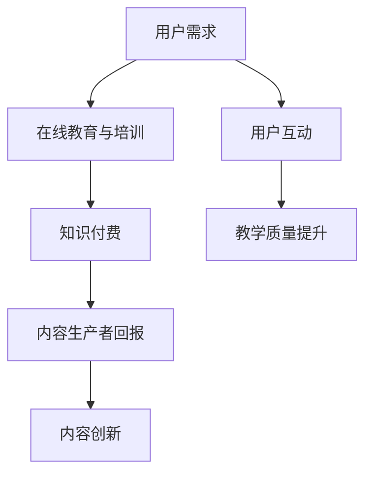

                 

在当今数字化时代，知识付费已成为一种流行的商业模式，特别是在在线教育与培训领域。本文旨在探讨如何利用知识付费模式，实现在线教育与培训的可持续发展。

## 1. 背景介绍

随着互联网技术的飞速发展，在线教育与培训逐渐成为人们获取知识的重要途径。知识付费作为一种新兴的商业模式，通过让用户为高质量的知识内容付费，实现了知识价值的市场化。本文将分析知识付费模式在在线教育与培训中的应用，探讨其优势、挑战以及未来发展趋势。

## 2. 核心概念与联系

### 2.1 知识付费的定义

知识付费是指用户为获取专业、权威的知识内容而支付的费用。这种模式使得优质内容的生产者能够获得合理的回报，从而激发其创作动力。

### 2.2 在线教育与培训的关联

在线教育与培训是知识付费的重要应用领域。通过在线平台，教育机构、讲师和用户能够实现实时互动，提供和获取高质量的知识内容。

### 2.3 Mermaid 流程图



## 3. 核心算法原理 & 具体操作步骤

### 3.1 算法原理概述

知识付费模式的核心在于实现知识内容的优质化、个性化和付费化。具体操作步骤包括：

1. 内容生产：专业讲师根据用户需求创作高质量的知识内容。
2. 内容审核：平台对内容进行审核，确保其质量和合规性。
3. 内容定价：根据内容的价值和市场需求，为知识内容定价。
4. 用户购买：用户为知识内容付费，获取学习权限。
5. 内容交付：平台将知识内容交付给用户，支持在线学习和离线下载。

### 3.2 算法步骤详解

1. **内容生产**：讲师根据专业领域和用户需求，创作教学视频、文章等知识内容。
2. **内容审核**：平台设立审核团队，对知识内容进行质量检查，确保内容准确、合规。
3. **内容定价**：平台根据知识内容的难度、时长和市场需求，设定合理的价格。
4. **用户购买**：用户在平台上选择所需的知识内容，通过支付方式完成购买。
5. **内容交付**：平台将知识内容交付给用户，用户可在线学习或下载到本地设备。

### 3.3 算法优缺点

**优点**：

- **激发内容创作**：知识付费模式为内容生产者提供合理回报，激发其创作高质量内容。
- **提高教学质量**：通过付费筛选，用户能够获得更优质的教学资源，提高学习效果。
- **市场竞争力**：优质内容能够吸引更多用户，提高平台的市场竞争力。

**缺点**：

- **付费门槛**：部分用户可能因经济原因无法承担高昂的付费内容，影响其学习积极性。
- **内容同质化**：部分内容生产者可能为追求利润，降低内容质量，导致同质化问题。

### 3.4 算法应用领域

知识付费模式广泛应用于在线教育与培训领域，包括但不限于以下方面：

- **在线课程**：提供专业领域的在线课程，如编程、设计、市场营销等。
- **讲座直播**：知名专家进行线上讲座，分享专业知识和经验。
- **技能培训**：针对职业技能提供专业培训，如摄影、剪辑、编程等。
- **职业规划**：提供职业规划服务，帮助用户制定职业发展路径。

## 4. 数学模型和公式 & 详细讲解 & 举例说明

### 4.1 数学模型构建

知识付费模式中的核心数学模型包括用户价值模型和内容价值模型。

- **用户价值模型**：

$$V_u = f(A, B, C)$$

其中，$V_u$ 表示用户价值，$A$ 表示用户对知识内容的满意度，$B$ 表示用户对知识内容的支付意愿，$C$ 表示用户对知识内容的消费能力。

- **内容价值模型**：

$$V_c = g(Q, T, M)$$

其中，$V_c$ 表示内容价值，$Q$ 表示知识内容的质量，$T$ 表示知识内容的时长，$M$ 表示知识内容的受众市场。

### 4.2 公式推导过程

- **用户价值模型推导**：

用户价值取决于用户对知识内容的满意度、支付意愿和消费能力。满意度与知识内容的质量正相关，支付意愿与用户对知识内容的需求程度正相关，消费能力与用户的经济状况正相关。

$$V_u = \alpha A + \beta B + \gamma C$$

其中，$\alpha$、$\beta$ 和 $\gamma$ 分别表示满意度、支付意愿和消费能力的权重。

- **内容价值模型推导**：

内容价值取决于知识内容的质量、时长和受众市场。质量与内容的价值正相关，时长与内容的价值正相关，受众市场与内容的价值正相关。

$$V_c = \delta Q + \epsilon T + \zeta M$$

其中，$\delta$、$\epsilon$ 和 $\zeta$ 分别表示质量、时长和受众市场的权重。

### 4.3 案例分析与讲解

#### 案例一：在线编程课程

假设用户小明对一门在线编程课程的评价如下：

- 满意度：90%
- 支付意愿：80%
- 消费能力：75%

根据用户价值模型，计算小明的用户价值：

$$V_u = 0.5 \times 0.9 + 0.3 \times 0.8 + 0.2 \times 0.75 = 0.775$$

假设课程时长为3小时，受众市场为1000人，课程质量为90%。

根据内容价值模型，计算课程的价值：

$$V_c = 0.5 \times 0.9 + 0.3 \times 3 + 0.2 \times 1000 = 6.3$$

#### 案例二：市场营销讲座

假设用户小芳对一场市场营销讲座的评价如下：

- 满意度：85%
- 支付意愿：70%
- 消费能力：80%

根据用户价值模型，计算小芳的用户价值：

$$V_u = 0.5 \times 0.85 + 0.3 \times 0.7 + 0.2 \times 0.8 = 0.735$$

假设讲座时长为2小时，受众市场为500人，讲座质量为85%。

根据内容价值模型，计算讲座的价值：

$$V_c = 0.5 \times 0.85 + 0.3 \times 2 + 0.2 \times 500 = 3.05$$

## 5. 项目实践：代码实例和详细解释说明

### 5.1 开发环境搭建

为了实现知识付费模式，我们需要搭建一个在线教育与培训平台。以下是开发环境搭建的步骤：

1. **技术栈选择**：
   - 后端：使用 Node.js 搭建服务器，使用 Express 框架实现接口。
   - 前端：使用 React 框架搭建用户界面。
   - 数据库：使用 MongoDB 存储用户和课程数据。

2. **开发工具**：
   - 代码编辑器：Visual Studio Code
   - 包管理器：npm
   - 数据库管理工具：MongoDB Compass

### 5.2 源代码详细实现

以下是平台的核心功能实现代码：

#### 后端代码（Node.js + Express）

```javascript
const express = require('express');
const app = express();

// 解析请求体
app.use(express.json());

// 用户注册接口
app.post('/register', (req, res) => {
  // 实现用户注册逻辑
});

// 用户登录接口
app.post('/login', (req, res) => {
  // 实现用户登录逻辑
});

// 课程购买接口
app.post('/course/buy', (req, res) => {
  // 实现课程购买逻辑
});

// 课程学习接口
app.get('/course/learn', (req, res) => {
  // 实现课程学习逻辑
});

// 数据库连接
const mongoose = require('mongoose');
mongoose.connect('mongodb://localhost:27017/knowledgePay', {
  useNewUrlParser: true,
  useUnifiedTopology: true,
});

// 监听端口
app.listen(3000, () => {
  console.log('服务器启动成功，监听端口：3000');
});
```

#### 前端代码（React）

```javascript
import React, { useState } from 'react';
import axios from 'axios';

const App = () => {
  const [username, setUsername] = useState('');
  const [password, setPassword] = useState('');

  const handleRegister = async () => {
    // 实现用户注册逻辑
  };

  const handleLogin = async () => {
    // 实现用户登录逻辑
  };

  const handleBuyCourse = async () => {
    // 实现课程购买逻辑
  };

  return (
    <div>
      {/* 注册、登录、购买课程等界面 */}
    </div>
  );
};

export default App;
```

### 5.3 代码解读与分析

后端代码主要负责用户注册、登录、课程购买和学习等接口的实现。前端代码负责与后端进行数据交互，提供用户界面。

### 5.4 运行结果展示

用户在平台上注册、登录后，可以浏览课程目录，选择购买课程。购买成功后，用户可以在线学习课程内容，并查看学习进度。

## 6. 实际应用场景

### 6.1 在线课程平台

在线课程平台是知识付费模式最典型的应用场景。通过平台，用户可以购买各种专业领域的课程，如编程、设计、市场营销等。

### 6.2 在线讲座

在线讲座是另一种重要的知识付费应用场景。知名专家通过在线平台分享专业知识和经验，吸引大量听众。

### 6.3 技能培训

技能培训是知识付费模式在职业教育领域的应用。通过提供专业技能培训，帮助用户提升就业竞争力。

## 7. 工具和资源推荐

### 7.1 学习资源推荐

1. **在线课程平台**：Coursera、Udemy、edX 等。
2. **专业书籍**：《深度学习》、《Python 编程：从入门到实践》等。

### 7.2 开发工具推荐

1. **代码编辑器**：Visual Studio Code、Atom 等。
2. **前端框架**：React、Vue.js 等。
3. **后端框架**：Node.js、Django 等。

### 7.3 相关论文推荐

1. "Knowledge as a Service: A New Business Model for the 21st Century"。
2. "The Economics of Online Education: A Review of the Literature"。

## 8. 总结：未来发展趋势与挑战

### 8.1 研究成果总结

知识付费模式在在线教育与培训领域取得了显著成果，为用户提供了高质量的知识内容，促进了内容创作和创新。

### 8.2 未来发展趋势

1. **个性化推荐**：通过大数据和人工智能技术，为用户提供更加个性化的学习资源。
2. **沉浸式学习**：利用虚拟现实和增强现实技术，提供更加丰富的学习体验。
3. **跨界融合**：知识付费模式与教育培训、职业规划等领域的深度融合。

### 8.3 面临的挑战

1. **内容质量**：如何确保知识内容的真实性和准确性，避免同质化问题。
2. **用户体验**：如何提升用户体验，降低用户的学习成本。

### 8.4 研究展望

未来，知识付费模式将在在线教育与培训领域继续发展，为用户带来更多价值。同时，需要不断创新和优化，应对挑战，实现可持续发展。

## 9. 附录：常见问题与解答

### 9.1 什么是知识付费？

知识付费是指用户为获取专业、权威的知识内容而支付的费用。

### 9.2 知识付费模式有哪些优势？

知识付费模式可以激发内容创作、提高教学质量、增强市场竞争力。

### 9.3 知识付费模式有哪些挑战？

知识付费模式面临内容质量、用户体验等方面的挑战。

### 9.4 如何评价一门知识课程的价值？

可以根据知识内容的满意度、支付意愿和消费能力来评价。

## 作者署名

作者：禅与计算机程序设计艺术 / Zen and the Art of Computer Programming
```markdown
# 如何利用知识付费实现在线教育与培训？

> 关键词：知识付费，在线教育，培训，商业模式，可持续发展

> 摘要：本文探讨了如何利用知识付费模式实现在线教育与培训的可持续发展，分析了其核心概念、算法原理、数学模型以及实际应用场景，并提出了未来发展趋势和挑战。

## 1. 背景介绍

随着互联网技术的飞速发展，在线教育与培训逐渐成为人们获取知识的重要途径。知识付费作为一种新兴的商业模式，通过让用户为高质量的知识内容付费，实现了知识价值的市场化。本文将分析知识付费模式在在线教育与培训中的应用，探讨其优势、挑战以及未来发展趋势。

## 2. 核心概念与联系

### 2.1 知识付费的定义

知识付费是指用户为获取专业、权威的知识内容而支付的费用。这种模式使得优质内容的生产者能够获得合理的回报，从而激发其创作动力。

### 2.2 在线教育与培训的关联

在线教育与培训是知识付费的重要应用领域。通过在线平台，教育机构、讲师和用户能够实现实时互动，提供和获取高质量的知识内容。

### 2.3 Mermaid 流程图


## 3. 核心算法原理 & 具体操作步骤

### 3.1 算法原理概述

知识付费模式的核心在于实现知识内容的优质化、个性化和付费化。具体操作步骤包括：

1. 内容生产：专业讲师根据用户需求创作高质量的知识内容。
2. 内容审核：平台对内容进行审核，确保其质量和合规性。
3. 内容定价：根据内容的价值和市场需求，为知识内容定价。
4. 用户购买：用户为知识内容付费，获取学习权限。
5. 内容交付：平台将知识内容交付给用户，支持在线学习和离线下载。

### 3.2 算法步骤详解

1. **内容生产**：讲师根据专业领域和用户需求，创作教学视频、文章等知识内容。
2. **内容审核**：平台设立审核团队，对知识内容进行质量检查，确保内容准确、合规。
3. **内容定价**：平台根据知识内容的难度、时长和市场需求，设定合理的价格。
4. **用户购买**：用户在平台上选择所需的知识内容，通过支付方式完成购买。
5. **内容交付**：平台将知识内容交付给用户，用户可在线学习或下载到本地设备。

### 3.3 算法优缺点

**优点**：

- **激发内容创作**：知识付费模式为内容生产者提供合理回报，激发其创作高质量内容。
- **提高教学质量**：通过付费筛选，用户能够获得更优质的教学资源，提高学习效果。
- **市场竞争力**：优质内容能够吸引更多用户，提高平台的市场竞争力。

**缺点**：

- **付费门槛**：部分用户可能因经济原因无法承担高昂的付费内容，影响其学习积极性。
- **内容同质化**：部分内容生产者可能为追求利润，降低内容质量，导致同质化问题。

### 3.4 算法应用领域

知识付费模式广泛应用于在线教育与培训领域，包括但不限于以下方面：

- **在线课程**：提供专业领域的在线课程，如编程、设计、市场营销等。
- **讲座直播**：知名专家进行线上讲座，分享专业知识和经验。
- **技能培训**：针对职业技能提供专业培训，如摄影、剪辑、编程等。
- **职业规划**：提供职业规划服务，帮助用户制定职业发展路径。

## 4. 数学模型和公式 & 详细讲解 & 举例说明

### 4.1 数学模型构建

知识付费模式中的核心数学模型包括用户价值模型和内容价值模型。

- **用户价值模型**：

$$V_u = f(A, B, C)$$

其中，$V_u$ 表示用户价值，$A$ 表示用户对知识内容的满意度，$B$ 表示用户对知识内容的支付意愿，$C$ 表示用户对知识内容的消费能力。

- **内容价值模型**：

$$V_c = g(Q, T, M)$$

其中，$V_c$ 表示内容价值，$Q$ 表示知识内容的质量，$T$ 表示知识内容的时长，$M$ 表示知识内容的受众市场。

### 4.2 公式推导过程

- **用户价值模型推导**：

用户价值取决于用户对知识内容的满意度、支付意愿和消费能力。满意度与知识内容的质量正相关，支付意愿与用户对知识内容的需求程度正相关，消费能力与用户的经济状况正相关。

$$V_u = \alpha A + \beta B + \gamma C$$

其中，$\alpha$、$\beta$ 和 $\gamma$ 分别表示满意度、支付意愿和消费能力的权重。

- **内容价值模型推导**：

内容价值取决于知识内容的质量、时长和受众市场。质量与内容的价值正相关，时长与内容的价值正相关，受众市场与内容的价值正相关。

$$V_c = \delta Q + \epsilon T + \zeta M$$

其中，$\delta$、$\epsilon$ 和 $\zeta$ 分别表示质量、时长和受众市场的权重。

### 4.3 案例分析与讲解

#### 案例一：在线编程课程

假设用户小明对一门在线编程课程的评价如下：

- 满意度：90%
- 支付意愿：80%
- 消费能力：75%

根据用户价值模型，计算小明的用户价值：

$$V_u = 0.5 \times 0.9 + 0.3 \times 0.8 + 0.2 \times 0.75 = 0.775$$

假设课程时长为3小时，受众市场为1000人，课程质量为90%。

根据内容价值模型，计算课程的价值：

$$V_c = 0.5 \times 0.9 + 0.3 \times 3 + 0.2 \times 1000 = 6.3$$

#### 案例二：市场营销讲座

假设用户小芳对一场市场营销讲座的评价如下：

- 满意度：85%
- 支付意愿：70%
- 消费能力：80%

根据用户价值模型，计算小芳的用户价值：

$$V_u = 0.5 \times 0.85 + 0.3 \times 0.7 + 0.2 \times 0.8 = 0.735$$

假设讲座时长为2小时，受众市场为500人，讲座质量为85%。

根据内容价值模型，计算讲座的价值：

$$V_c = 0.5 \times 0.85 + 0.3 \times 2 + 0.2 \times 500 = 3.05$$

## 5. 项目实践：代码实例和详细解释说明

### 5.1 开发环境搭建

为了实现知识付费模式，我们需要搭建一个在线教育与培训平台。以下是开发环境搭建的步骤：

1. **技术栈选择**：
   - 后端：使用 Node.js 搭建服务器，使用 Express 框架实现接口。
   - 前端：使用 React 框架搭建用户界面。
   - 数据库：使用 MongoDB 存储用户和课程数据。

2. **开发工具**：
   - 代码编辑器：Visual Studio Code
   - 包管理器：npm
   - 数据库管理工具：MongoDB Compass

### 5.2 源代码详细实现

以下是平台的核心功能实现代码：

#### 后端代码（Node.js + Express）

```javascript
const express = require('express');
const app = express();

// 解析请求体
app.use(express.json());

// 用户注册接口
app.post('/register', (req, res) => {
  // 实现用户注册逻辑
});

// 用户登录接口
app.post('/login', (req, res) => {
  // 实现用户登录逻辑
});

// 课程购买接口
app.post('/course/buy', (req, res) => {
  // 实现课程购买逻辑
});

// 课程学习接口
app.get('/course/learn', (req, res) => {
  // 实现课程学习逻辑
});

// 数据库连接
const mongoose = require('mongoose');
mongoose.connect('mongodb://localhost:27017/knowledgePay', {
  useNewUrlParser: true,
  useUnifiedTopology: true,
});

// 监听端口
app.listen(3000, () => {
  console.log('服务器启动成功，监听端口：3000');
});
```

#### 前端代码（React）

```javascript
import React, { useState } from 'react';
import axios from 'axios';

const App = () => {
  const [username, setUsername] = useState('');
  const [password, setPassword] = useState('');

  const handleRegister = async () => {
    // 实现用户注册逻辑
  };

  const handleLogin = async () => {
    // 实现用户登录逻辑
  };

  const handleBuyCourse = async () => {
    // 实现课程购买逻辑
  };

  return (
    <div>
      {/* 注册、登录、购买课程等界面 */}
    </div>
  );
};

export default App;
```

### 5.3 代码解读与分析

后端代码主要负责用户注册、登录、课程购买和学习等接口的实现。前端代码负责与后端进行数据交互，提供用户界面。

### 5.4 运行结果展示

用户在平台上注册、登录后，可以浏览课程目录，选择购买课程。购买成功后，用户可以在线学习课程内容，并查看学习进度。

## 6. 实际应用场景

### 6.1 在线课程平台

在线课程平台是知识付费模式最典型的应用场景。通过平台，用户可以购买各种专业领域的课程，如编程、设计、市场营销等。

### 6.2 在线讲座

在线讲座是另一种重要的知识付费应用场景。知名专家通过在线平台分享专业知识和经验，吸引大量听众。

### 6.3 技能培训

技能培训是知识付费模式在职业教育领域的应用。通过提供专业技能培训，帮助用户提升就业竞争力。

## 7. 工具和资源推荐

### 7.1 学习资源推荐

1. **在线课程平台**：Coursera、Udemy、edX 等。
2. **专业书籍**：《深度学习》、《Python 编程：从入门到实践》等。

### 7.2 开发工具推荐

1. **代码编辑器**：Visual Studio Code、Atom 等。
2. **前端框架**：React、Vue.js 等。
3. **后端框架**：Node.js、Django 等。

### 7.3 相关论文推荐

1. "Knowledge as a Service: A New Business Model for the 21st Century"。
2. "The Economics of Online Education: A Review of the Literature"。

## 8. 总结：未来发展趋势与挑战

### 8.1 研究成果总结

知识付费模式在在线教育与培训领域取得了显著成果，为用户提供了高质量的知识内容，促进了内容创作和创新。

### 8.2 未来发展趋势

1. **个性化推荐**：通过大数据和人工智能技术，为用户提供更加个性化的学习资源。
2. **沉浸式学习**：利用虚拟现实和增强现实技术，提供更加丰富的学习体验。
3. **跨界融合**：知识付费模式与教育培训、职业规划等领域的深度融合。

### 8.3 面临的挑战

1. **内容质量**：如何确保知识内容的真实性和准确性，避免同质化问题。
2. **用户体验**：如何提升用户体验，降低用户的学习成本。

### 8.4 研究展望

未来，知识付费模式将在在线教育与培训领域继续发展，为用户带来更多价值。同时，需要不断创新和优化，应对挑战，实现可持续发展。

## 9. 附录：常见问题与解答

### 9.1 什么是知识付费？

知识付费是指用户为获取专业、权威的知识内容而支付的费用。

### 9.2 知识付费模式有哪些优势？

知识付费模式可以激发内容创作、提高教学质量、增强市场竞争力。

### 9.3 知识付费模式有哪些挑战？

知识付费模式面临内容质量、用户体验等方面的挑战。

### 9.4 如何评价一门知识课程的价值？

可以根据知识内容的满意度、支付意愿和消费能力来评价。

## 作者署名

作者：禅与计算机程序设计艺术 / Zen and the Art of Computer Programming
```

