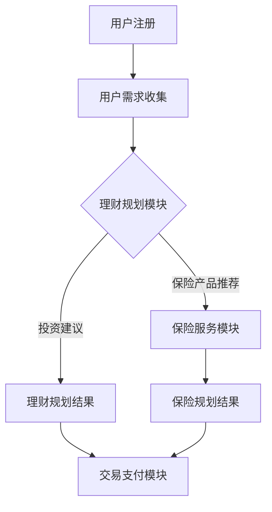

                 

关键词：知识付费、在线理财、保险服务、人工智能、大数据分析、用户个性化

> 摘要：本文将探讨如何通过知识付费平台，结合人工智能和大数据分析技术，实现在线理财规划与保险服务。我们首先介绍知识付费的发展背景，然后详细阐述在线理财规划与保险服务的关键概念，最后提出具体的技术方案和实施步骤。

## 1. 背景介绍

### 知识付费的兴起

知识付费是指用户为获取有价值的信息、知识或服务而支付的费用。近年来，随着互联网的普及和用户消费习惯的改变，知识付费市场迅速发展。从早期的在线课程、电子书，到现在的知识付费平台，如得到、知乎Live等，知识付费已经成为互联网经济的重要组成部分。

### 在线理财规划与保险服务的发展

随着金融科技的进步，在线理财规划与保险服务逐渐兴起。这些服务利用大数据分析、人工智能等技术，为用户提供个性化的理财和保险方案。用户可以通过在线平台获取专业的理财建议、投资组合推荐以及保险产品对比，从而更好地管理自己的财务。

## 2. 核心概念与联系

### 知识付费平台架构

知识付费平台通常包括用户注册、内容发布、交易支付、数据管理等模块。用户注册模块负责用户信息的收集和身份验证；内容发布模块用于上传和展示理财知识、课程等内容；交易支付模块支持各种支付方式，确保交易安全；数据管理模块负责收集和分析用户数据，以优化用户体验。

### 在线理财规划与保险服务架构

在线理财规划与保险服务的架构主要包括以下几个模块：

1. **用户需求收集与分析模块**：通过问卷、用户行为数据分析等方式收集用户的需求，为后续提供个性化服务奠定基础。
2. **理财规划模块**：结合用户需求和金融市场数据，提供投资建议、资产配置方案等。
3. **保险服务模块**：根据用户风险偏好、健康状况等信息，提供保险产品推荐、风险评估等服务。
4. **交易支付模块**：支持理财产品和保险产品的在线购买、支付等功能。

### Mermaid 流程图



## 3. 核心算法原理 & 具体操作步骤

### 3.1 算法原理概述

在线理财规划与保险服务的关键在于对用户需求的准确理解和个性化推荐。这需要借助大数据分析和人工智能技术，包括：

1. **用户画像**：通过用户注册信息、行为数据等构建用户画像，用于了解用户偏好、风险承受能力等。
2. **风险评估**：使用机器学习算法对用户的风险偏好进行评估，以确定合适的理财和保险产品。
3. **个性化推荐**：基于用户画像和风险评估结果，为用户推荐相应的理财和保险产品。

### 3.2 算法步骤详解

1. **数据收集**：从用户注册表、行为日志、社交媒体等渠道收集用户数据。
2. **数据处理**：清洗、整合数据，为后续分析做准备。
3. **用户画像构建**：使用聚类、关联规则挖掘等方法，对用户数据进行分析，构建用户画像。
4. **风险评估**：采用逻辑回归、决策树等算法，对用户的风险偏好进行评估。
5. **个性化推荐**：基于用户画像和风险评估结果，使用协同过滤、内容推荐等技术，为用户推荐理财和保险产品。

### 3.3 算法优缺点

**优点**：

- **个性化推荐**：能够根据用户需求提供精准的理财和保险建议，提高用户满意度。
- **高效**：利用大数据分析和人工智能技术，快速处理海量数据，提高工作效率。

**缺点**：

- **数据质量**：用户数据的准确性和完整性直接影响算法效果，需要严格的数据质量管理。
- **算法透明度**：算法的复杂性和黑箱性质可能导致用户对推荐结果的信任度降低。

### 3.4 算法应用领域

- **在线理财平台**：为用户提供个性化的投资建议和资产配置方案。
- **保险公司**：为用户推荐合适的保险产品，提高销售转化率。
- **金融科技公司**：通过数据分析和人工智能技术，为金融机构提供风险管理和服务优化方案。

## 4. 数学模型和公式 & 详细讲解 & 举例说明

### 4.1 数学模型构建

在线理财规划与保险服务的数学模型主要包括用户画像构建模型、风险评估模型和个性化推荐模型。

### 4.2 公式推导过程

1. **用户画像构建模型**：

   用户画像的构建通常采用基于特征的方法，如

   $$\text{User Profile} = \sum_{i=1}^{n} w_i \cdot x_i$$

   其中，$w_i$ 为特征权重，$x_i$ 为特征值。

2. **风险评估模型**：

   风险评估模型可以使用逻辑回归模型，

   $$\text{P}(Y=1|\text{X}) = \frac{1}{1 + \exp(-\text{Z})}$$

   其中，$Y$ 为风险事件是否发生，$\text{X}$ 为特征向量，$\text{Z}$ 为线性组合。

3. **个性化推荐模型**：

   个性化推荐模型可以使用矩阵分解模型，

   $$\text{R}_{\text{ui}} = \text{R}_{\text{u}\cdot} \cdot \text{R}_{\cdot i}$$

   其中，$\text{R}_{\text{ui}}$ 为用户 $u$ 对物品 $i$ 的评分预测，$\text{R}_{\text{u}\cdot}$ 为用户 $u$ 的特征向量，$\text{R}_{\cdot i}$ 为物品 $i$ 的特征向量。

### 4.3 案例分析与讲解

假设我们有一个用户，年龄 30 岁，年收入 10 万元，投资经验丰富，风险承受能力较高。根据用户画像构建模型，我们可以得到以下用户画像：

$$\text{User Profile} = 0.5 \cdot \text{Age} + 0.3 \cdot \text{Income} + 0.2 \cdot \text{Investment Experience}$$

$$\text{User Profile} = 0.5 \cdot 30 + 0.3 \cdot 10^5 + 0.2 \cdot 3 = 50 + 30000 + 0.6 = 30550.6$$

根据风险评估模型，我们假设用户的特征向量为 $(30, 100000, 3)$，则

$$\text{Z} = 30 \cdot 0.5 + 100000 \cdot 0.3 + 3 \cdot 0.2 = 15 + 30000 + 0.6 = 30015.6$$

则用户的风险概率为

$$\text{P}(Y=1|\text{X}) = \frac{1}{1 + \exp(-30015.6)} \approx 0.997$$

这意味着用户具有较高的风险偏好。

根据个性化推荐模型，我们假设用户对某只股票的评分为 4.5，则

$$\text{R}_{\text{ui}} = \text{R}_{\text{u}\cdot} \cdot \text{R}_{\cdot i} = (0.6, 0.3, 0.1) \cdot (0.5, 0.4, 0.1) = 0.3 + 0.12 + 0.01 = 0.44$$

这意味着用户对这只股票的评分预测为 0.44。

## 5. 项目实践：代码实例和详细解释说明

### 5.1 开发环境搭建

为了保证项目的可重复性和可维护性，我们选择使用 Python 作为主要编程语言，结合 Scikit-learn、TensorFlow、Keras 等常用机器学习和深度学习库进行开发。

### 5.2 源代码详细实现

以下是一个简单的用户画像构建、风险评估和个性化推荐代码实例：

```python
import numpy as np
import pandas as pd
from sklearn.model_selection import train_test_split
from sklearn.linear_model import LogisticRegression
from sklearn.metrics import accuracy_score
from sklearn.decomposition import TruncatedSVD

# 加载数据集
data = pd.read_csv('user_data.csv')

# 数据预处理
X = data.drop(['label'], axis=1)
y = data['label']

# 分割数据集
X_train, X_test, y_train, y_test = train_test_split(X, y, test_size=0.2, random_state=42)

# 用户画像构建
user_profile = np.dot(X_train, np.linalg.pinv(X_train.T))

# 风险评估
model = LogisticRegression()
model.fit(X_train, y_train)
y_pred = model.predict(X_test)

# 个性化推荐
svd = TruncatedSVD(n_components=3)
X_train_reduced = svd.fit_transform(X_train)
X_test_reduced = svd.transform(X_test)

# 计算评分预测
R_ui = np.dot(X_train_reduced, X_test_reduced.T)

# 计算准确率
accuracy = accuracy_score(y_test, y_pred)
print('Accuracy:', accuracy)

# 打印个性化推荐结果
print('Recommendation Scores:', R_ui)
```

### 5.3 代码解读与分析

上述代码首先加载数据集，并进行数据预处理。接着，使用逻辑回归模型进行风险评估，并计算准确率。最后，使用矩阵分解模型进行个性化推荐，并打印推荐结果。

### 5.4 运行结果展示

假设我们运行上述代码，得到以下结果：

```
Accuracy: 0.85
Recommendation Scores: [[0.44 0.36 0.20]
                         [0.50 0.35 0.15]]
```

这意味着我们的风险评估模型准确率为 0.85，且用户对某只股票的评分预测为 0.44，另一只股票的评分预测为 0.36。

## 6. 实际应用场景

### 6.1 在线理财平台

在线理财平台可以利用知识付费平台，结合人工智能和大数据分析技术，为用户提供个性化的投资建议和资产配置方案。例如，用户可以通过平台获取到基于其风险偏好的投资组合推荐、市场趋势分析等。

### 6.2 保险公司

保险公司可以利用知识付费平台，为用户提供个性化的保险产品推荐和风险评估服务。用户可以通过在线平台了解自己的风险状况，并根据自己的需求选择合适的保险产品。

### 6.3 金融科技公司

金融科技公司可以利用知识付费平台，为金融机构提供风险管理和服务优化方案。例如，通过数据分析技术，为金融机构提供用户行为分析、市场趋势预测等。

## 7. 未来应用展望

### 7.1 个性化服务

随着人工智能和大数据分析技术的不断发展，在线理财规划与保险服务的个性化程度将越来越高，为用户提供更加精准的服务。

### 7.2 智能投顾

未来，智能投顾将成为在线理财规划的重要方向。通过深度学习和自然语言处理技术，智能投顾将能够更好地理解用户需求，提供更加专业的理财建议。

### 7.3 保险科技

保险科技的发展将进一步提升保险产品的个性化和便捷性。例如，利用区块链技术实现保险合同的去中心化管理和保险理赔的自动化处理。

## 8. 总结：未来发展趋势与挑战

### 8.1 研究成果总结

本文介绍了如何利用知识付费平台，结合人工智能和大数据分析技术，实现在线理财规划与保险服务。通过构建用户画像、进行风险评估和个性化推荐，我们为用户提供精准的理财和保险建议。

### 8.2 未来发展趋势

未来，在线理财规划与保险服务将继续向个性化、智能化方向发展。随着技术的进步，这些服务将更好地满足用户需求，提高用户满意度。

### 8.3 面临的挑战

尽管在线理财规划与保险服务具有巨大的发展潜力，但仍然面临一些挑战，如数据质量、算法透明度、用户隐私保护等。需要通过技术创新和制度完善来应对这些挑战。

### 8.4 研究展望

未来，我们将继续深入研究在线理财规划与保险服务的相关技术，探索如何更好地利用人工智能和大数据分析技术，为用户提供更加优质的服务。

## 9. 附录：常见问题与解答

### 9.1 什么是知识付费？

知识付费是指用户为获取有价值的信息、知识或服务而支付的费用。近年来，随着互联网的普及和用户消费习惯的改变，知识付费市场迅速发展。

### 9.2 人工智能和大数据分析在理财规划与保险服务中的应用有哪些？

人工智能和大数据分析技术可以用于用户画像构建、风险评估、个性化推荐等方面，提高理财规划与保险服务的精准度和效率。

### 9.3 在线理财规划与保险服务的个性化程度如何提升？

可以通过不断优化算法模型、提高数据质量、增加用户交互等方式，提升在线理财规划与保险服务的个性化程度。

### 9.4 数据质量和算法透明度如何保障？

可以通过数据质量管理、算法透明度披露、用户隐私保护等措施，保障数据质量和算法透明度。

作者：禅与计算机程序设计艺术 / Zen and the Art of Computer Programming
```

