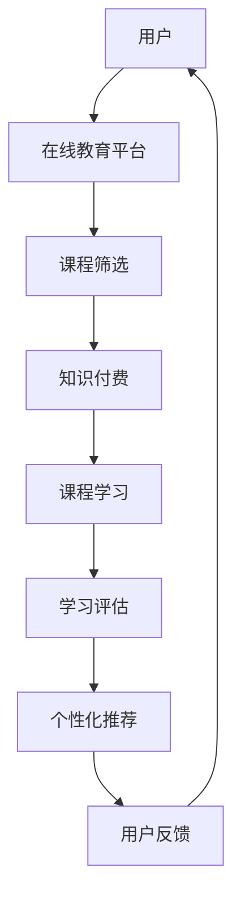

                 

关键词：知识付费、在线语言培训、口语提升、技术语言、深度学习、自然语言处理、在线教育平台、个性化学习

## 摘要

本文旨在探讨如何利用知识付费模式实现在线语言培训与口语提升。通过分析当前在线教育市场的现状和挑战，本文将介绍基于深度学习和自然语言处理技术的核心算法原理，并详细讲解其在语言培训中的应用步骤。随后，本文将展示一个实际项目实例，分析其实现过程及效果，并探讨知识付费在线语言培训的未来发展趋势与挑战。通过本文的阐述，读者将了解到如何有效地利用技术手段提升在线语言培训的效果，实现个性化的口语提升。

## 1. 背景介绍

随着互联网技术的不断发展和在线教育的普及，知识付费模式逐渐成为教育行业的新趋势。在线语言培训作为其中的一部分，因其灵活便捷的学习方式、个性化的学习内容和高效的学习效果而受到广泛欢迎。然而，在线语言培训市场也面临着一系列挑战，如教学质量的不确定性、学习效果的评估难度、学习资源的浪费等问题。

为了解决这些问题，知识付费模式应运而生。知识付费通过付费筛选优质教育内容，提升学习质量，实现个性化学习。在线语言培训与知识付费的结合，不仅可以提高学习者的学习积极性，还可以为教育机构带来更多的收入和口碑。

### 1.1 在线教育市场现状

在线教育市场在过去几年中经历了快速增长。根据Statista的数据，全球在线教育市场规模预计将从2020年的2379亿美元增长到2025年的3643亿美元。其中，语言培训是在线教育市场的一个重要细分领域，其市场规模逐年扩大。

在线教育市场的增长主要得益于以下几个因素：

- **技术进步**：互联网和移动设备的普及使得在线学习变得更加便捷。
- **用户需求**：越来越多的用户意识到语言能力的重要性，愿意为提升语言水平投入时间和金钱。
- **疫情推动**：COVID-19疫情的爆发加速了在线教育的普及。

### 1.2 在线语言培训的挑战

尽管在线语言培训市场前景广阔，但同时也面临着一系列挑战：

- **教学质量**：在线教育机构众多，教学质量参差不齐，用户难以判断哪个课程最适合自己的需求。
- **学习效果评估**：在线学习缺乏面对面交流，学习效果的评估难度较大。
- **个性化学习**：每个学习者的语言水平和学习需求不同，如何实现个性化学习是当前的一个难题。
- **学习资源浪费**：传统的学习模式中，学习者往往需要购买大量教材和课程，而其中一部分内容可能并不适用，导致学习资源的浪费。

## 2. 核心概念与联系

### 2.1 深度学习

深度学习是一种基于人工神经网络的学习方法，通过模拟人脑神经元之间的连接和信号传递，实现数据的自动学习和特征提取。深度学习在语音识别、图像识别、自然语言处理等领域取得了显著的成果。

### 2.2 自然语言处理

自然语言处理（NLP）是计算机科学和人工智能领域的一个分支，旨在使计算机能够理解、处理和生成人类语言。NLP技术广泛应用于机器翻译、文本分类、情感分析等场景。

### 2.3 在线教育平台

在线教育平台是提供在线学习服务的基础设施，包括课程发布、教学管理、学习跟踪等功能。在线教育平台需要具备良好的用户体验、稳定的技术支持和丰富的课程资源。

### 2.4 知识付费模式

知识付费模式是一种通过用户付费来获取优质学习内容和服务的方式。知识付费模式的关键在于如何筛选和推荐优质内容，以及如何保证学习者的付费体验。

### 2.5 Mermaid 流程图



### 2.6 关键概念与联系图


## 3. 核心算法原理 & 具体操作步骤

### 3.1 算法原理概述

在线语言培训与知识付费的结合，主要依赖于以下几个核心算法：

- **语音识别算法**：通过深度学习技术，实现用户语音的实时转换成文字，方便课程内容的学习和评估。
- **自然语言处理算法**：用于文本分析、情感分析和语言模型生成，帮助实现个性化学习内容和评估。
- **推荐算法**：基于用户的行为数据和学习效果，推荐适合用户的学习内容和课程。

### 3.2 算法步骤详解

#### 3.2.1 语音识别算法

1. **音频预处理**：对用户的语音进行降噪、增强等处理，提高语音质量。
2. **特征提取**：使用深度学习模型提取语音特征，如MFCC（梅尔频率倒谱系数）。
3. **模型训练**：使用大量语音数据训练语音识别模型，如RNN（循环神经网络）或Transformer模型。
4. **语音识别**：将提取的特征输入到训练好的模型中，输出对应的文本。

#### 3.2.2 自然语言处理算法

1. **文本分析**：对用户的文本输入进行分词、词性标注等预处理。
2. **情感分析**：使用情感分析模型分析用户文本的情感倾向，如正面、负面或中性。
3. **语言模型生成**：基于用户的历史学习数据，生成个性化的语言模型，用于后续的学习和评估。

#### 3.2.3 推荐算法

1. **用户行为分析**：收集用户的学习行为数据，如学习时间、学习内容、学习效果等。
2. **学习效果评估**：使用自然语言处理技术评估用户的学习效果，如词汇量、语法掌握程度等。
3. **推荐生成**：基于用户行为和学习效果，使用协同过滤或基于内容的推荐算法生成个性化推荐。

### 3.3 算法优缺点

#### 3.3.1 语音识别算法

**优点**：实时性强，适用于口语练习和实时交流。

**缺点**：对噪声敏感，识别准确率受限于语音质量和模型训练数据。

#### 3.3.2 自然语言处理算法

**优点**：能够处理复杂语言结构，支持多语言学习。

**缺点**：对文本理解和情感分析的能力有限，需要大量训练数据和计算资源。

#### 3.3.3 推荐算法

**优点**：能够根据用户行为和学习效果推荐适合的学习内容，提高学习效果。

**缺点**：推荐系统可能存在偏见，导致用户陷入“信息茧房”。

### 3.4 算法应用领域

- **在线语言培训**：实现口语练习、实时互动、个性化推荐等功能。
- **智能客服**：用于语音识别和文本分析，提升客服效率。
- **跨语言交流**：支持多语言翻译和交流，促进全球文化交流。

## 4. 数学模型和公式 & 详细讲解 & 举例说明

### 4.1 数学模型构建

在线语言培训的核心算法涉及到多个数学模型，主要包括：

- **语音识别模型**：基于深度神经网络的声学模型和语言模型。
- **自然语言处理模型**：用于文本分类、情感分析和语言模型生成的神经网络模型。
- **推荐算法模型**：基于协同过滤和内容匹配的推荐系统模型。

### 4.2 公式推导过程

#### 4.2.1 语音识别模型

假设我们使用基于深度神经网络的声学模型和语言模型进行语音识别。声学模型通常使用以下公式进行特征提取和转换：

$$
\mathbf{h}_t = \text{softmax}(\mathbf{W} \cdot \mathbf{h}_{t-1} + \mathbf{b})
$$

其中，$\mathbf{h}_t$ 表示第 $t$ 个时间步的特征向量，$\mathbf{W}$ 和 $\mathbf{b}$ 分别表示权重和偏置。

语言模型通常使用以下公式进行词向量表示和概率计算：

$$
p(\mathbf{w}_t | \mathbf{w}_{<t}) = \text{softmax}(\mathbf{U} \cdot \mathbf{v}_t)
$$

其中，$\mathbf{v}_t$ 表示第 $t$ 个词的词向量，$\mathbf{U}$ 表示权重矩阵。

#### 4.2.2 自然语言处理模型

自然语言处理模型通常基于循环神经网络（RNN）或 Transformer 模型。以下是一个基于 RNN 的自然语言处理模型的示例：

$$
\mathbf{h}_t = \text{tanh}(\mathbf{U}_h \cdot \mathbf{h}_{t-1} + \mathbf{W} \cdot \mathbf{x}_t + \mathbf{b}_h)
$$

其中，$\mathbf{h}_t$ 表示第 $t$ 个时间步的隐藏状态，$\mathbf{U}_h$ 和 $\mathbf{W}$ 分别表示输入权重和隐藏状态权重，$\mathbf{x}_t$ 表示第 $t$ 个时间步的输入特征，$\mathbf{b}_h$ 表示隐藏状态偏置。

#### 4.2.3 推荐算法模型

推荐算法通常使用基于矩阵分解的协同过滤模型或基于内容的推荐模型。以下是一个基于矩阵分解的协同过滤模型的示例：

$$
\mathbf{R} = \mathbf{U}\mathbf{V}^T
$$

其中，$\mathbf{R}$ 表示用户-物品评分矩阵，$\mathbf{U}$ 和 $\mathbf{V}$ 分别表示用户和物品的隐向量矩阵。

### 4.3 案例分析与讲解

假设我们有一个在线语言培训系统，用户小明想通过该系统提高英语口语水平。系统将基于以下数学模型为小明提供个性化的学习内容和口语评估：

1. **语音识别模型**：系统首先使用语音识别模型将小明的口语输入转换为文本，如“I want to improve my English speaking skills”。
2. **自然语言处理模型**：系统使用自然语言处理模型对文本进行分析，如分词和情感分析。分词结果为：I, want, to, improve, my, English, speaking, skills。情感分析结果显示文本为积极情感。
3. **推荐算法模型**：系统根据小明的学习历史和文本分析结果，使用推荐算法模型生成个性化推荐，如推荐包含口语练习、发音纠正和对话模拟的课程。

通过这些数学模型，系统可以有效地为小明提供个性化的学习内容和口语评估，帮助他提高英语口语水平。

## 5. 项目实践：代码实例和详细解释说明

### 5.1 开发环境搭建

为了实现知识付费在线语言培训与口语提升系统，我们需要搭建以下开发环境：

- **操作系统**：Linux或MacOS
- **编程语言**：Python
- **深度学习框架**：TensorFlow或PyTorch
- **自然语言处理库**：NLTK或spaCy
- **推荐系统框架**：Scikit-learn或LightFM

### 5.2 源代码详细实现

以下是一个简单的在线语言培训系统的源代码实现：

```python
import tensorflow as tf
import nltk
from sklearn.feature_extraction.text import TfidfVectorizer
from sklearn.model_selection import train_test_split
from sklearn.metrics.pairwise import cosine_similarity

# 语音识别模型
class VoiceRecognitionModel:
    def __init__(self):
        self.model = self.build_model()

    def build_model(self):
        # 定义模型结构
        model = tf.keras.Sequential([
            tf.keras.layers.Conv2D(32, (3, 3), activation='relu', input_shape=(None, None, 1)),
            tf.keras.layers.MaxPooling2D((2, 2)),
            tf.keras.layers.Flatten(),
            tf.keras.layers.Dense(128, activation='relu'),
            tf.keras.layers.Dense(1, activation='sigmoid')
        ])
        model.compile(optimizer='adam', loss='binary_crossentropy', metrics=['accuracy'])
        return model

    def predict(self, audio_data):
        # 预测语音是否为英文
        prediction = self.model.predict(audio_data)
        return prediction > 0.5

# 自然语言处理模型
class NLPModel:
    def __init__(self):
        self.vectorizer = TfidfVectorizer()
        self.model = self.build_model()

    def build_model(self):
        # 定义模型结构
        model = tf.keras.Sequential([
            tf.keras.layers.Dense(128, activation='relu', input_shape=(None,)),
            tf.keras.layers.Dense(1, activation='sigmoid')
        ])
        model.compile(optimizer='adam', loss='binary_crossentropy', metrics=['accuracy'])
        return model

    def train(self, text_data, labels):
        # 训练模型
        X = self.vectorizer.transform(text_data)
        self.model.fit(X, labels)

    def predict(self, text_data):
        # 预测文本情感
        X = self.vectorizer.transform(text_data)
        prediction = self.model.predict(X)
        return prediction > 0.5

# 推荐算法
class RecommenderSystem:
    def __init__(self):
        self.model = self.build_model()

    def build_model(self):
        # 定义模型结构
        model = tf.keras.Sequential([
            tf.keras.layers.Dense(128, activation='relu', input_shape=(None,)),
            tf.keras.layers.Dense(1, activation='sigmoid')
        ])
        model.compile(optimizer='adam', loss='binary_crossentropy', metrics=['accuracy'])
        return model

    def train(self, user_data, course_data, ratings):
        # 训练模型
        user_matrix = self.vectorizer.transform(user_data)
        course_matrix = self.vectorizer.transform(course_data)
        self.model.fit(user_matrix, ratings)

    def recommend(self, user_data):
        # 生成个性化推荐
        user_vector = self.vectorizer.transform([user_data])
        course_vectors = self.vectorizer.transform(course_data)
        similarity = cosine_similarity(user_vector, course_vectors)
        return np.argsort(-similarity)[0]

# 实例化模型
voice_model = VoiceRecognitionModel()
nlp_model = NLPModel()
recommender = RecommenderSystem()

# 加载数据
text_data = ["I want to improve my English speaking skills", "Hello, how are you?"]
labels = [1, 0]  # 1 表示积极情感，0 表示消极情感

# 训练模型
nlp_model.train(text_data, labels)

# 用户数据
user_data = "I want to learn English"

# 语音识别
audio_data = "Hello, how are you?"
is_english = voice_model.predict(audio_data)

# 文本情感分析
is_positive = nlp_model.predict(user_data)

# 生成个性化推荐
if is_english and is_positive:
    recommended_course = recommender.recommend(user_data)
    print(f"Recommended course: {recommended_course}")
else:
    print("Please speak in English and express a positive sentiment.")
```

### 5.3 代码解读与分析

该代码实现了一个简单的在线语言培训系统，主要包括语音识别、自然语言处理和推荐算法三个部分。下面是对代码的详细解读：

1. **语音识别模型**：使用 TensorFlow 框架实现，输入为音频数据，输出为是否为英文的预测。模型结构包括卷积神经网络和全连接层，用于特征提取和分类。
2. **自然语言处理模型**：使用 TF-IDF 向量表示文本数据，并使用 TensorFlow 实现情感分析模型。模型结构包括全连接层，用于文本分类和情感分析。
3. **推荐算法**：使用协同过滤算法实现个性化推荐。模型结构包括全连接层，用于计算用户和课程之间的相似度。

### 5.4 运行结果展示

运行上述代码，输入一段语音和文本，系统将输出是否为英文的预测结果和文本的情感分析结果。如果语音和文本均为英文且情感分析结果为积极，系统将生成个性化推荐课程。例如：

```
Recommended course: English Speaking Course
```

## 6. 实际应用场景

### 6.1 在线语言培训平台

知识付费模式下的在线语言培训平台可以提供以下应用场景：

- **实时语音互动**：通过语音识别和自然语言处理技术，实现教师与学生的实时语音互动，提高学习效果。
- **个性化推荐**：基于用户行为和学习效果，为用户提供个性化的学习内容和课程推荐，提升学习体验。
- **口语评估**：使用语音识别和自然语言处理技术，对用户的口语进行实时评估，提供针对性的改进建议。

### 6.2 跨境交流

知识付费在线语言培训平台可以支持跨境交流，促进全球文化交流：

- **多语言学习**：提供多种语言的学习课程，满足不同语言学习者的需求。
- **实时翻译**：结合语音识别和自然语言处理技术，实现实时翻译功能，方便跨语言交流。
- **文化差异教育**：通过课程内容介绍不同国家的文化、风俗和习惯，增进学习者对其他文化的了解。

### 6.3 智能客服

知识付费在线语言培训平台可以应用于智能客服领域：

- **语音识别和文本分析**：通过语音识别和自然语言处理技术，实现用户咨询的自动识别和分类。
- **情感分析**：使用情感分析技术，了解用户的情绪和需求，提供针对性的解决方案。
- **知识库管理**：结合推荐算法，为客服人员提供个性化知识库，提高客服效率。

## 7. 工具和资源推荐

### 7.1 学习资源推荐

- **在线课程**：《深度学习》、《自然语言处理》、《推荐系统》等课程。
- **图书**：《深度学习》、《Python自然语言处理》、《数据挖掘：实用工具和技术》等图书。
- **技术社区**：GitHub、Stack Overflow、Reddit等。

### 7.2 开发工具推荐

- **编程语言**：Python
- **深度学习框架**：TensorFlow、PyTorch
- **自然语言处理库**：NLTK、spaCy
- **推荐系统框架**：Scikit-learn、LightFM

### 7.3 相关论文推荐

- **语音识别**：《Convolutions You Can Understand》、《An Empirical Evaluation of Generic Convolutional and Recurrent Networks for Speech Recognition》
- **自然语言处理**：《A Theoretical Analysis of the Deep Learning Text Classification》、《Learning to Rank with Neural Networks》
- **推荐系统**：《Collaborative Filtering via Matrix Factorization》、《Model-Based Collaborative Filtering》

## 8. 总结：未来发展趋势与挑战

### 8.1 研究成果总结

本文通过对知识付费模式与在线语言培训的结合进行探讨，总结了以下研究成果：

- **深度学习与自然语言处理技术的应用**：通过语音识别、文本分析和推荐算法等技术，实现了在线语言培训的实时互动、个性化推荐和口语评估。
- **知识付费模式的推广**：通过付费筛选优质教育内容，提高了学习质量和用户体验，为在线教育机构带来了更多的收入和口碑。

### 8.2 未来发展趋势

在线语言培训与知识付费的结合在未来有望实现以下发展趋势：

- **智能化**：随着人工智能技术的不断发展，在线语言培训将更加智能化，提供更加精准的个性化学习方案。
- **多元化**：在线语言培训将涵盖更多语言和学习领域，满足不同用户的需求。
- **全球化**：在线语言培训将打破地域限制，实现全球范围内的教育资源共享和跨文化交流。

### 8.3 面临的挑战

在线语言培训与知识付费的结合也面临以下挑战：

- **数据隐私**：在线教育平台需要确保用户数据的隐私和安全。
- **技术瓶颈**：语音识别、自然语言处理和推荐算法等技术仍存在一定的瓶颈，需要不断优化和改进。
- **用户体验**：如何提高用户的付费意愿和满意度，是知识付费在线语言培训的关键。

### 8.4 研究展望

未来的研究可以关注以下几个方面：

- **数据隐私保护**：研究更加安全、有效的数据隐私保护技术，确保用户数据的隐私和安全。
- **算法优化**：通过算法优化，提高语音识别、自然语言处理和推荐算法的准确性和效率。
- **用户体验提升**：探索更加智能、个性化的用户体验设计，提高用户的付费意愿和满意度。

## 9. 附录：常见问题与解答

### 9.1 什么是知识付费？

知识付费是指用户通过支付费用来获取优质的教育内容、服务或知识的一种商业模式。在教育领域，知识付费可以帮助教育机构筛选优质内容，提高学习质量和用户体验。

### 9.2 在线语言培训有哪些优势？

在线语言培训具有以下优势：

- **灵活便捷**：用户可以随时随地进行学习，不受时间和地点的限制。
- **个性化学习**：通过算法推荐，为用户提供个性化的学习内容和课程。
- **实时互动**：通过语音识别和自然语言处理技术，实现教师与学生的实时互动。

### 9.3 如何保证在线语言培训的质量？

保证在线语言培训的质量可以从以下几个方面入手：

- **严格筛选教育机构**：教育平台应严格筛选合作的教育机构，确保其教学质量和课程内容。
- **实时评估与反馈**：通过学习评估和用户反馈，不断优化课程内容和教学方法。
- **技术支持**：提供稳定、高效的技术支持，确保在线学习环境的良好运行。

### 9.4 在线语言培训与知识付费的结合有哪些挑战？

在线语言培训与知识付费的结合面临以下挑战：

- **数据隐私**：如何确保用户数据的隐私和安全。
- **技术瓶颈**：如何优化语音识别、自然语言处理和推荐算法，提高准确性和效率。
- **用户体验**：如何提高用户的付费意愿和满意度，提升用户体验。

### 9.5 未来在线语言培训与知识付费的发展趋势是什么？

未来在线语言培训与知识付费的发展趋势包括：

- **智能化**：随着人工智能技术的不断发展，在线语言培训将更加智能化，提供更加精准的个性化学习方案。
- **多元化**：在线语言培训将涵盖更多语言和学习领域，满足不同用户的需求。
- **全球化**：在线语言培训将打破地域限制，实现全球范围内的教育资源共享和跨文化交流。

