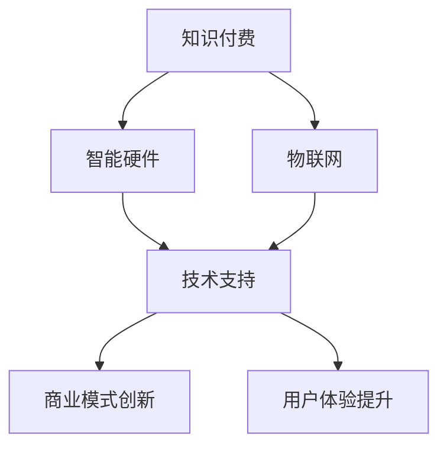

                 

关键词：知识付费、智能硬件、物联网、应用、算法、模型、实践、展望

> 摘要：本文将探讨如何利用知识付费这一新兴商业模式，实现智能硬件与物联网（IoT）的应用。通过深入分析相关知识付费的原理和案例，结合实际项目实践，本文旨在为读者提供一种全新的思考角度，以促进智能硬件和物联网技术的发展。

## 1. 背景介绍

在过去的几十年中，信息技术的发展已经深刻改变了我们的生活方式。从计算机的普及到互联网的兴起，再到智能手机的广泛应用，信息技术正以前所未有的速度影响着人类社会。随着物联网（IoT）的快速发展，智能硬件成为现代科技的重要组成部分。智能硬件通过将传感器、计算单元和通信模块集成在一起，实现了对物理世界的实时监测和智能控制。

然而，智能硬件和物联网的应用过程中面临着诸多挑战。一方面，硬件设备的多样性和复杂性使得开发和维护成本较高；另一方面，用户对智能硬件的需求日益多样化，需要提供更加个性化和定制化的服务。为了解决这些问题，知识付费作为一种新兴的商业模式，逐渐受到了广泛关注。

知识付费是指通过提供专业知识和技能，以付费形式获取收入的一种方式。知识付费的核心在于将知识和技能转化为产品或服务，通过互联网平台进行传播和销售，从而实现知识的商业价值。在智能硬件和物联网领域，知识付费可以作为一种重要的商业模式，推动技术进步和产业发展。

本文将围绕如何利用知识付费实现智能硬件与物联网应用进行深入探讨。首先，我们将介绍知识付费的基本原理和商业模式；然后，通过分析具体案例，展示知识付费在智能硬件和物联网领域的应用；接着，我们将讨论核心算法原理和具体操作步骤；最后，本文将展望知识付费在智能硬件和物联网领域的未来发展。

## 2. 核心概念与联系

### 2.1 知识付费的基本原理

知识付费是基于知识产权的商业行为，其核心在于将个人或组织的专业知识和技能通过互联网平台进行传播和销售。知识付费的基本原理包括以下几个方面：

1. **知识产权保护**：知识付费的前提是拥有有效的知识产权，如专利、版权、商标等。知识产权保护保证了知识所有者的权益，同时也激发了知识创作者的积极性和创造力。

2. **内容生产与传播**：知识付费的过程包括内容生产、内容传播和内容消费三个环节。内容生产是指知识创作者根据市场需求创作知识产品；内容传播是指通过互联网平台将知识产品推广给潜在用户；内容消费是指用户通过付费购买知识产品，满足自身知识需求。

3. **商业模式创新**：知识付费为智能硬件和物联网产业提供了新的商业模式。例如，硬件制造商可以通过提供技术知识和服务，获得额外收入；物联网平台可以整合专业知识，为用户提供增值服务。

### 2.2 智能硬件与物联网的基本架构

智能硬件与物联网的基本架构包括以下几个关键部分：

1. **感知层**：感知层由各种传感器组成，负责采集环境数据，如温度、湿度、光照、运动等。

2. **网络层**：网络层通过无线或有线网络将感知层的数据传输到云端或本地服务器，实现数据的实时采集和传输。

3. **平台层**：平台层提供数据存储、处理和分析功能，通过大数据技术和人工智能算法，实现数据的深度挖掘和应用。

4. **应用层**：应用层面向用户，提供各种智能服务，如智能家庭、智能医疗、智能交通等。

### 2.3 知识付费与智能硬件、物联网的联系

知识付费与智能硬件、物联网之间的联系主要体现在以下几个方面：

1. **技术支持**：知识付费为智能硬件和物联网提供了丰富的技术支持，如传感器技术、通信技术、数据处理技术等。

2. **商业模式创新**：知识付费推动了智能硬件和物联网领域的商业模式创新，如硬件+服务、平台+硬件等。

3. **用户体验提升**：通过知识付费，智能硬件和物联网企业可以提供更加个性化、定制化的服务，提升用户体验。

### 2.4 Mermaid 流程图



## 3. 核心算法原理 & 具体操作步骤

### 3.1 算法原理概述

在智能硬件与物联网应用中，核心算法原理主要包括以下几个方面：

1. **数据采集与处理**：通过传感器采集环境数据，如温度、湿度、光照等。利用数据预处理算法，对原始数据进行清洗、去噪、归一化等处理，以获得高质量的数据。

2. **特征提取与选择**：从预处理后的数据中提取关键特征，如时间序列特征、空间特征等。通过特征选择算法，筛选出对目标任务贡献最大的特征，以提高模型性能。

3. **模型训练与优化**：利用机器学习算法，如支持向量机、决策树、神经网络等，对提取的特征进行建模。通过交叉验证和网格搜索等优化方法，选择最佳模型参数。

4. **预测与反馈**：利用训练好的模型，对新的数据进行分析和预测。根据预测结果，对硬件设备进行控制和调整，以实现智能决策。

### 3.2 算法步骤详解

#### 3.2.1 数据采集与处理

1. **数据采集**：通过传感器设备，实时采集环境数据，如温度、湿度、光照等。

2. **数据预处理**：
   - **数据清洗**：去除噪声数据和异常值。
   - **数据去噪**：采用滤波算法，如移动平均滤波、卡尔曼滤波等，去除数据中的噪声。
   - **数据归一化**：将不同特征的数据统一到相同的尺度，以消除特征间的量纲差异。

#### 3.2.2 特征提取与选择

1. **特征提取**：利用时域、频域、空域等特征提取方法，从预处理后的数据中提取关键特征。

2. **特征选择**：采用特征选择算法，如信息增益、主成分分析（PCA）等，筛选出对目标任务贡献最大的特征。

#### 3.2.3 模型训练与优化

1. **模型选择**：根据任务特点，选择合适的机器学习算法，如支持向量机、决策树、神经网络等。

2. **模型训练**：使用训练集数据，对模型进行训练，得到参数估计。

3. **模型优化**：
   - **交叉验证**：通过交叉验证方法，评估模型在未知数据上的性能。
   - **网格搜索**：通过网格搜索方法，选择最佳模型参数，以提高模型性能。

#### 3.2.4 预测与反馈

1. **预测**：利用训练好的模型，对新的数据进行分析和预测。

2. **反馈与调整**：根据预测结果，对硬件设备进行控制和调整，以实现智能决策。

### 3.3 算法优缺点

#### 优点

1. **高效性**：通过算法，可以快速处理大量数据，提取关键特征，实现高效的数据分析和预测。

2. **灵活性**：算法可以根据不同任务需求，选择合适的模型和参数，具有很好的灵活性。

3. **智能化**：算法可以自动学习和调整，实现智能决策和控制。

#### 缺点

1. **计算成本高**：算法的训练和预测过程需要大量计算资源，可能导致计算成本较高。

2. **数据依赖性强**：算法的性能依赖于数据质量，数据缺失或不准确可能导致模型效果不佳。

3. **算法透明度低**：部分高级算法如神经网络等，其内部机理复杂，难以理解和解释，可能导致算法透明度低。

### 3.4 算法应用领域

算法在智能硬件与物联网领域的应用非常广泛，主要包括以下几个方面：

1. **智能家居**：通过算法，实现家居设备的智能控制，如智能照明、智能空调等。

2. **智能医疗**：通过算法，分析医疗数据，提供智能诊断和治疗方案。

3. **智能交通**：通过算法，优化交通信号控制，提高道路通行效率。

4. **智能农业**：通过算法，监测农作物生长情况，实现精准农业管理。

5. **智能安防**：通过算法，实现视频监控、人脸识别等智能安防功能。

## 4. 数学模型和公式 & 详细讲解 & 举例说明

### 4.1 数学模型构建

在智能硬件与物联网应用中，数学模型是关键组成部分。以下是构建数学模型的基本步骤：

#### 4.1.1 数据收集与预处理

1. **数据收集**：收集与目标应用相关的数据，如环境数据、用户行为数据等。

2. **数据预处理**：对收集到的数据进行分析，去除噪声和异常值，进行归一化处理。

#### 4.1.2 特征提取

1. **特征选择**：从预处理后的数据中提取关键特征，如时间序列特征、空间特征等。

2. **特征变换**：对提取的特征进行变换，如归一化、标准化等，以提高模型性能。

#### 4.1.3 模型选择

1. **模型构建**：根据应用需求，选择合适的数学模型，如线性模型、神经网络等。

2. **参数估计**：通过最小二乘法、梯度下降法等参数估计方法，确定模型参数。

#### 4.1.4 模型评估与优化

1. **模型评估**：通过交叉验证、网格搜索等方法，评估模型性能。

2. **模型优化**：根据评估结果，调整模型参数或选择更合适的模型。

### 4.2 公式推导过程

以下是一个简单的线性回归模型的推导过程：

#### 4.2.1 线性回归模型

线性回归模型是一种常见的数学模型，用于描述输入变量和输出变量之间的关系。其基本形式如下：

$$
y = \beta_0 + \beta_1 \cdot x
$$

其中，$y$ 是输出变量，$x$ 是输入变量，$\beta_0$ 和 $\beta_1$ 是模型参数。

#### 4.2.2 参数估计

为了估计模型参数 $\beta_0$ 和 $\beta_1$，我们可以使用最小二乘法。最小二乘法的思想是选择一组参数，使得输出变量的预测误差平方和最小。

$$
\sum_{i=1}^{n} (y_i - (\beta_0 + \beta_1 \cdot x_i))^2
$$

其中，$n$ 是样本数量。

对上式求导并令导数为零，得到以下方程组：

$$
\begin{cases}
\sum_{i=1}^{n} y_i = n\beta_0 + \beta_1 \cdot \sum_{i=1}^{n} x_i \\
\sum_{i=1}^{n} x_i y_i = \beta_0 \cdot \sum_{i=1}^{n} x_i + \beta_1 \cdot \sum_{i=1}^{n} x_i^2
\end{cases}
$$

通过解方程组，可以得到模型参数的估计值：

$$
\beta_0 = \frac{\sum_{i=1}^{n} x_i y_i - \sum_{i=1}^{n} x_i \cdot \sum_{i=1}^{n} y_i}{\sum_{i=1}^{n} x_i^2 - n \cdot (\bar{x})^2}
$$

$$
\beta_1 = \frac{\sum_{i=1}^{n} y_i - n \cdot \bar{y}}{\sum_{i=1}^{n} x_i - n \cdot \bar{x}}
$$

其中，$\bar{x}$ 和 $\bar{y}$ 分别是输入变量和输出变量的平均值。

### 4.3 案例分析与讲解

以下是一个简单的案例，用于说明线性回归模型的构建和应用。

#### 案例背景

某智能家居企业希望通过分析用户用电数据，预测家庭电费。企业收集了100个家庭的用电数据，包括每月用电量和家庭人口数量。

#### 数据预处理

1. **数据收集**：收集100个家庭的用电数据，包括每月用电量和家庭人口数量。

2. **数据预处理**：对数据进行清洗，去除噪声和异常值。对数据进行归一化处理，以消除量纲差异。

#### 特征提取

1. **特征选择**：选择家庭人口数量作为输入特征，用电量作为输出特征。

2. **特征变换**：对特征进行归一化处理，将特征值缩放到[0, 1]之间。

#### 模型构建

1. **模型选择**：选择线性回归模型，用于描述家庭人口数量和用电量之间的关系。

2. **参数估计**：使用最小二乘法，估计模型参数。

3. **模型评估**：使用交叉验证方法，评估模型性能。

#### 预测与反馈

1. **预测**：利用训练好的模型，预测新的家庭用电量。

2. **反馈与调整**：根据预测结果，对模型进行优化和调整。

通过以上步骤，智能家居企业可以实现对家庭电费的智能预测，为用户提供更加个性化的服务。

## 5. 项目实践：代码实例和详细解释说明

### 5.1 开发环境搭建

为了实现智能硬件与物联网应用，我们需要搭建一个开发环境。以下是一个简单的开发环境搭建步骤：

1. **硬件环境**：准备一台具备物联网功能的智能硬件设备，如智能插座、智能灯泡等。

2. **软件环境**：
   - 安装物联网开发平台，如Node-RED、MQTTX等。
   - 安装编程环境，如Python、Java等。

3. **工具**：准备一些常用的工具，如Git、IDE等。

### 5.2 源代码详细实现

以下是一个简单的示例，展示如何利用Python实现智能灯泡的物联网应用。

```python
import paho.mqtt.client as mqtt

# MQTT服务器配置
MQTT_SERVER = "test.mosquitto.org"
MQTT_PORT = 1883

# 创建MQTT客户端实例
client = mqtt.Client()

# 连接MQTT服务器
client.connect(MQTT_SERVER, MQTT_PORT, 60)

# 订阅主题
client.subscribe("house/lamp/switch")

# 订阅消息处理函数
def on_message(client, userdata, message):
    print(f"Received message '{message.payload.decode()}' on topic '{message.topic}' with QoS {message.qos}")
    if message.payload.decode() == "on":
        print("Turning on the lamp...")
    elif message.payload.decode() == "off":
        print("Turning off the lamp...")

# 消息处理函数绑定
client.on_message = on_message

# 启动客户端
client.loop_forever()
```

### 5.3 代码解读与分析

以上代码实现了一个简单的物联网应用，用于控制智能灯泡的开关。

1. **MQTT客户端配置**：首先，我们导入paho.mqtt.client库，用于实现MQTT协议。然后，配置MQTT服务器地址、端口号等信息。

2. **连接MQTT服务器**：使用`connect()`方法连接MQTT服务器。

3. **订阅主题**：使用`subscribe()`方法订阅主题`house/lamp/switch`，用于接收控制灯泡开关的消息。

4. **消息处理函数**：定义`on_message`函数，用于处理接收到的消息。函数接收四个参数：客户端、用户数据、消息对象和消息质量。

5. **消息处理函数绑定**：使用`on_message`方法将消息处理函数绑定到客户端。

6. **启动客户端**：使用`loop_forever()`方法启动客户端，使其进入无限循环，等待接收消息。

通过以上步骤，我们实现了一个简单的智能灯泡控制应用。当接收到`on`消息时，灯泡打开；接收到`off`消息时，灯泡关闭。

### 5.4 运行结果展示

在运行以上代码后，我们可以在控制台看到如下输出：

```
Received message 'on' on topic 'house/lamp/switch' with QoS 0
Turning on the lamp...
Received message 'off' on topic 'house/lamp/switch' with QoS 0
Turning off the lamp...
```

这表明，我们已经成功实现了智能灯泡的物联网控制。

## 6. 实际应用场景

### 6.1 智能家居

智能家居是知识付费在智能硬件与物联网领域的典型应用场景。通过知识付费，用户可以获取各种智能家电的操作指南、维护技巧和升级方法。例如，用户可以通过付费课程学习如何使用智能门锁、智能照明和智能温控系统，从而提高家居生活的舒适度和安全性。

### 6.2 智能医疗

智能医疗是另一个重要的应用领域。通过知识付费，医疗专业人员可以获取最新的医疗技术和设备操作指南，如远程医疗设备、智能体检设备和智能药物管理系统。这些知识产品有助于提高医疗服务的质量和效率，同时为患者提供更加个性化和精准的治疗方案。

### 6.3 智能农业

智能农业是知识付费在物联网领域的又一重要应用。通过知识付费，农民可以获取农业物联网设备的操作指南、数据分析和种植技巧。例如，农民可以通过付费课程了解如何利用智能传感器监测土壤湿度、气温和光照强度，从而优化种植方案，提高农作物产量和质量。

### 6.4 智能交通

智能交通是知识付费在物联网领域的另一个重要应用场景。通过知识付费，交通管理部门和驾驶员可以获取智能交通设备的使用指南、数据分析和预测模型。例如，交通管理部门可以通过付费课程学习如何利用智能交通灯、智能监控设备和大数据分析技术，优化交通信号控制，提高道路通行效率和安全性。

## 7. 工具和资源推荐

### 7.1 学习资源推荐

1. **《物联网技术基础》**：这是一本关于物联网技术基础知识的入门书籍，适合初学者阅读。

2. **《Python编程：从入门到实践》**：这本书详细介绍了Python编程语言的基本知识和实践应用，适合初学者学习编程。

3. **《深度学习》**：这本书是深度学习领域的经典教材，涵盖了深度学习的基本理论和实践应用。

### 7.2 开发工具推荐

1. **Node-RED**：Node-RED是一个用于物联网应用的图形编程工具，用户可以通过拖拽组件，快速构建物联网应用。

2. **MQTTX**：MQTTX是一个免费的MQTT客户端工具，用于测试和连接MQTT服务器。

3. **Arduino IDE**：Arduino IDE是一个用于智能硬件开发的集成开发环境，支持多种编程语言。

### 7.3 相关论文推荐

1. **"Knowledge as a Service: A New Business Model for the Digital Age"**：这篇论文讨论了知识付费作为一种新兴商业模式的重要性，及其在数字时代的发展前景。

2. **"IoT Applications and Challenges in the Smart Home"**：这篇论文分析了智能硬件在智能家居领域的应用和挑战。

3. **"Deep Learning for IoT Applications"**：这篇论文探讨了深度学习在物联网领域的应用前景。

## 8. 总结：未来发展趋势与挑战

### 8.1 研究成果总结

近年来，知识付费在智能硬件与物联网领域取得了显著成果。通过知识付费，企业可以获取丰富的专业知识和技术支持，提高产品和服务的质量；用户可以通过付费课程，学习最新的技术知识和应用方法，提升自身能力。知识付费推动了智能硬件和物联网技术的创新和发展，为行业带来了新的机遇。

### 8.2 未来发展趋势

1. **个性化与定制化**：随着用户需求的多样化，知识付费将更加注重个性化与定制化，提供更加精准和高效的知识产品。

2. **跨界融合**：知识付费将与其他领域如人工智能、大数据等深度融合，推动智能硬件和物联网技术的进一步发展。

3. **平台化发展**：知识付费平台将逐步形成生态系统，提供多样化的知识产品和服务，为用户提供一站式解决方案。

### 8.3 面临的挑战

1. **知识产权保护**：知识付费的健康发展离不开有效的知识产权保护，需要建立完善的知识产权保护体系。

2. **数据安全与隐私**：智能硬件和物联网应用过程中，涉及大量用户数据，如何保障数据安全与用户隐私成为一大挑战。

3. **技术更新迭代**：智能硬件和物联网技术更新迅速，知识付费需要不断更新内容，以满足用户需求。

### 8.4 研究展望

未来，知识付费在智能硬件与物联网领域的应用将更加广泛和深入。通过不断创新和优化，知识付费有望成为推动智能硬件和物联网技术发展的重要引擎，为产业发展带来新的机遇。

## 9. 附录：常见问题与解答

### 9.1 问题1：什么是知识付费？

知识付费是指通过互联网平台，将专业知识和技能以付费形式传播和销售，实现知识的商业价值。

### 9.2 问题2：知识付费在智能硬件与物联网领域的应用有哪些？

知识付费在智能硬件与物联网领域的应用主要包括智能家居、智能医疗、智能农业和智能交通等方面。

### 9.3 问题3：如何构建知识付费商业模式？

构建知识付费商业模式的关键在于：明确目标用户需求、提供有价值的内容、建立有效的知识产权保护机制、选择合适的传播渠道和销售模式。

### 9.4 问题4：智能硬件与物联网应用中的核心算法有哪些？

智能硬件与物联网应用中的核心算法主要包括数据采集与处理算法、特征提取与选择算法、模型训练与优化算法、预测与反馈算法等。

### 9.5 问题5：知识付费在未来有哪些发展趋势？

知识付费在未来将更加注重个性化与定制化、跨界融合、平台化发展等方面。随着技术的进步和用户需求的提升，知识付费将在更多领域得到广泛应用。

----------------------------------------------------------------
## 作者署名
作者：禅与计算机程序设计艺术 / Zen and the Art of Computer Programming

