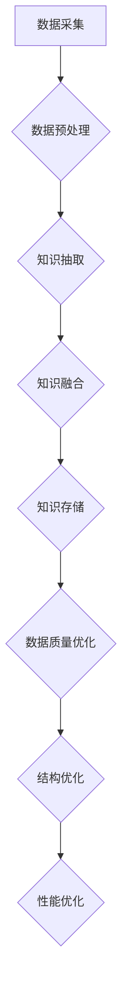

                 

关键词：知识图谱，知识组织，数据结构，语义理解，人工智能，信息检索，知识管理，实体关系，数据可视化。

## 摘要

本文旨在探讨如何通过知识图谱技术提升知识组织能力。知识图谱作为一种高效的数据结构，能够将语义信息直观地表达出来，有助于实现数据的智能化管理和利用。文章将首先介绍知识图谱的背景和核心概念，然后深入分析知识图谱在知识组织中的重要作用，并详细阐述其构建和优化的方法。此外，还将探讨知识图谱在信息检索、知识管理和数据可视化等领域的应用实例，并展望其未来发展趋势。希望通过本文，读者能够对知识图谱技术及其在知识组织中的应用有一个全面的了解。

## 1. 背景介绍

### 1.1 知识图谱的起源与发展

知识图谱（Knowledge Graph）作为一种新型的数据结构，起源于20世纪90年代。其最初的形式是基于语义网络（Semantic Network）和本体论（Ontology），旨在通过建立实体、概念和关系之间的语义联系，实现知识的表示和推理。随着互联网和信息技术的迅猛发展，知识图谱的概念逐渐被引入到各个领域，成为大数据、人工智能等领域的重要研究方向。

知识图谱的发展可以分为三个阶段：

- **第一阶段：语义网络和本体论**。在这一阶段，研究者主要关注如何将知识表示为图结构，并利用语义网络和本体论来描述实体、概念和关系。
- **第二阶段：大数据和分布式计算**。随着数据的爆发式增长，如何高效地处理海量数据成为关键问题。知识图谱引入了分布式计算和大数据处理技术，使得知识图谱的应用场景更加广泛。
- **第三阶段：智能推理和机器学习**。当前，知识图谱的发展趋势之一是引入智能推理和机器学习技术，以实现更精确、更智能的知识组织和管理。

### 1.2 知识图谱的核心概念

知识图谱由三个基本元素组成：实体、概念和关系。

- **实体（Entity）**：实体是知识图谱中的基本单元，可以是人、地点、组织、事物等。例如，"苹果"是一个实体，"北京"也是一个实体。
- **概念（Concept）**：概念是对实体的抽象和分类，用于描述实体的属性和特征。例如，"水果"是一个概念，它将"苹果"、"香蕉"等实体归类为同一类别。
- **关系（Relationship）**：关系描述了实体之间的关联和交互。例如，"北京"和"中国"之间存在"属于"关系，"苹果"和"苹果树"之间存在"生产"关系。

### 1.3 知识图谱的应用领域

知识图谱在多个领域都有广泛的应用，包括但不限于以下几个方面：

- **搜索引擎**：知识图谱能够提升搜索引擎的搜索质量和用户体验，通过理解用户查询的语义，提供更精准的搜索结果。
- **知识管理**：知识图谱能够帮助组织和企业高效地管理和利用知识，实现知识的共享和传播。
- **数据可视化**：知识图谱能够将复杂的数据关系以直观的方式展示出来，帮助用户更好地理解和分析数据。
- **智能问答**：知识图谱能够支持智能问答系统，通过理解用户的问题，提供准确的答案。
- **推荐系统**：知识图谱能够提升推荐系统的推荐质量，通过分析用户和物品之间的关系，提供个性化的推荐。

## 2. 核心概念与联系

### 2.1 知识图谱的基本概念

知识图谱的基本概念包括实体、概念和关系，这些概念之间有着紧密的联系。实体是知识图谱中的基本单元，表示具体的事物或对象；概念是对实体的抽象和分类，用于描述实体的属性和特征；关系则描述了实体之间的关联和交互。这三个概念共同构成了知识图谱的核心。

### 2.2 知识图谱的架构

知识图谱的架构可以分为三个层次：底层是实体和属性数据层，中间是关系数据层，顶层是推理和语义层。底层主要存储实体和属性数据，包括实体的名称、标签、属性等；中间层主要存储实体之间的关系，包括直接关系和间接关系；顶层主要进行推理和语义分析，通过对实体和关系的分析，提取出更高级的知识。

### 2.3 知识图谱的构建

知识图谱的构建过程可以分为数据采集、数据预处理、知识抽取、知识融合和知识存储等几个步骤。

- **数据采集**：通过爬虫、API接口、手动录入等方式获取原始数据。
- **数据预处理**：对原始数据进行清洗、去重、格式化等处理，使其符合知识图谱的要求。
- **知识抽取**：从预处理后的数据中提取出实体、概念和关系，构建出知识图谱的基本框架。
- **知识融合**：将多个数据源中的知识进行融合，形成一个统一的、完整的知识图谱。
- **知识存储**：将构建好的知识图谱存储到数据库或图数据库中，以便进行后续的查询和分析。

### 2.4 知识图谱的优化

知识图谱的优化主要包括数据质量优化、结构优化和性能优化等几个方面。

- **数据质量优化**：通过数据清洗、去噪、标准化等手段，提高数据的质量和准确性。
- **结构优化**：通过调整实体、概念和关系的定义和关系，优化知识图谱的结构，提高其语义表达能力。
- **性能优化**：通过索引、缓存、并行处理等技术，提高知识图谱的查询性能和数据处理效率。

### 2.5 知识图谱的 Mermaid 流程图



## 3. 核心算法原理 & 具体操作步骤

### 3.1 算法原理概述

知识图谱的核心算法主要包括实体识别、关系抽取、实体链接和实体嵌入等。

- **实体识别**：从文本中识别出实体，并将其标注为知识图谱中的实体。
- **关系抽取**：从文本中抽取实体之间的关系，并将其添加到知识图谱中。
- **实体链接**：将文本中的实体与知识图谱中的实体进行匹配，实现实体的统一标识。
- **实体嵌入**：将实体表示为低维向量，以便进行进一步的语义分析和推理。

### 3.2 算法步骤详解

#### 3.2.1 实体识别

1. **分词**：将文本划分为词语序列。
2. **词性标注**：对词语进行词性标注，识别出名词、动词等实体候选。
3. **命名实体识别**：根据词性标注结果，识别出实体。

#### 3.2.2 关系抽取

1. **模式匹配**：根据预定义的实体关系模式，从文本中抽取关系。
2. **依存句法分析**：利用依存句法分析技术，识别出实体之间的语义关系。
3. **规则推理**：根据实体和关系的特征，构建关系抽取规则。

#### 3.2.3 实体链接

1. **实体匹配**：利用实体名称、属性等信息，将文本中的实体与知识图谱中的实体进行匹配。
2. **相似度计算**：计算实体之间的相似度，选择最优匹配。
3. **冲突解决**：解决实体链接过程中出现的冲突，确保链接的准确性。

#### 3.2.4 实体嵌入

1. **词嵌入**：将实体名称和属性表示为低维向量。
2. **关系嵌入**：将实体之间的关系表示为向量。
3. **图谱嵌入**：利用图谱嵌入技术，将整个知识图谱表示为向量空间。

### 3.3 算法优缺点

#### 优点

- **高效性**：知识图谱能够将复杂的语义信息高效地表示和存储。
- **灵活性**：知识图谱能够根据不同的应用需求，灵活地调整和优化。
- **扩展性**：知识图谱能够方便地扩展和更新，以适应新的数据和场景。

#### 缺点

- **构建成本**：知识图谱的构建需要大量的人力和物力投入。
- **数据质量**：知识图谱的质量依赖于原始数据的质量，数据清洗和去噪是关键。
- **性能瓶颈**：在大规模数据集上，知识图谱的查询性能可能受到限制。

### 3.4 算法应用领域

知识图谱在多个领域都有广泛的应用，包括但不限于以下领域：

- **搜索引擎**：利用知识图谱提升搜索质量和用户体验。
- **知识管理**：帮助组织和企业高效地管理和利用知识。
- **推荐系统**：通过知识图谱实现更精准、更智能的推荐。
- **智能问答**：支持智能问答系统，提供准确的答案。
- **数据可视化**：将复杂的数据关系以直观的方式展示。

## 4. 数学模型和公式 & 详细讲解 & 举例说明

### 4.1 数学模型构建

知识图谱的数学模型主要包括实体表示、关系表示和图谱嵌入等。

#### 实体表示

假设知识图谱中的实体集合为 $E=\{e_1, e_2, ..., e_n\}$，实体的特征向量表示为 $e_i \in \mathbb{R}^d$，其中 $d$ 为实体的特征维度。

#### 关系表示

假设知识图谱中的关系集合为 $R=\{r_1, r_2, ..., r_m\}$，关系的特征向量表示为 $r_j \in \mathbb{R}^d$，其中 $d$ 为关系的特征维度。

#### 图谱嵌入

知识图谱的图谱嵌入可以通过图神经网络（Graph Neural Network, GNN）实现。假设知识图谱的嵌入向量集合为 $G=\{g_e, g_r\}$，其中 $g_e \in \mathbb{R}^{n \times d}$ 表示实体嵌入矩阵，$g_r \in \mathbb{R}^{m \times d}$ 表示关系嵌入矩阵。

### 4.2 公式推导过程

#### 实体表示

假设实体 $e_i$ 的特征向量为 $e_i \in \mathbb{R}^d$，其中 $e_i^{(j)}$ 表示实体 $e_i$ 在第 $j$ 个特征维度上的值。则实体的特征向量可以表示为：

$$e_i = \sum_{j=1}^d e_i^{(j)} v_j$$

其中，$v_j$ 为特征维度 $j$ 的特征向量。

#### 关系表示

假设关系 $r_j$ 的特征向量为 $r_j \in \mathbb{R}^d$，其中 $r_j^{(k)}$ 表示关系 $r_j$ 在第 $k$ 个特征维度上的值。则关系 $r_j$ 的特征向量可以表示为：

$$r_j = \sum_{k=1}^d r_j^{(k)} v_k$$

#### 图谱嵌入

假设图谱嵌入的损失函数为 $L(\theta)$，其中 $\theta$ 为模型参数。则图谱嵌入的损失函数可以表示为：

$$L(\theta) = \frac{1}{n} \sum_{i=1}^n \frac{1}{2} (e_i - g_e^T e_i)^2 + \frac{1}{m} \sum_{j=1}^m \frac{1}{2} (r_j - g_r^T r_j)^2$$

其中，$g_e^T e_i$ 表示实体 $e_i$ 的嵌入向量与实体 $e_i$ 的特征向量之间的欧氏距离，$g_r^T r_j$ 表示关系 $r_j$ 的嵌入向量与关系 $r_j$ 的特征向量之间的欧氏距离。

### 4.3 案例分析与讲解

#### 案例背景

假设我们有一个关于公司和员工的简单知识图谱，其中包含公司、员工和职位三个实体，以及雇佣关系和职位关系两个关系。

#### 案例步骤

1. **实体表示**：首先，我们需要对实体进行特征提取，例如使用词袋模型或词嵌入技术。
2. **关系表示**：接下来，我们需要对关系进行特征提取，例如使用规则提取或深度学习技术。
3. **图谱嵌入**：利用图谱嵌入技术，将实体和关系表示为低维向量。
4. **推理**：利用图谱嵌入向量进行推理，例如计算两个实体之间的相似度，或者预测实体之间的关系。

#### 案例分析

- **实体表示**：假设我们使用词嵌入技术对实体进行表示，每个实体的特征向量长度为 $d=100$。
- **关系表示**：假设我们使用规则提取技术对关系进行表示，每个关系的特征向量长度也为 $d=100$。
- **图谱嵌入**：假设我们使用图神经网络对图谱进行嵌入，嵌入向量长度为 $d=50$。
- **推理**：假设我们使用余弦相似度计算两个实体之间的相似度，阈值为 $0.5$。

#### 案例讲解

- **实体表示**：假设公司 A 的特征向量为 $e_A = [0.1, 0.2, ..., 0.5]$，员工 B 的特征向量为 $e_B = [0.3, 0.4, ..., 0.7]$。根据图谱嵌入模型，我们可以计算公司 A 和员工 B 之间的相似度：
  $$\cos(e_A, e_B) = \frac{e_A^T e_B}{\|e_A\|\|e_B\|} = \frac{0.1 \times 0.3 + 0.2 \times 0.4 + ... + 0.5 \times 0.7}{\sqrt{0.1^2 + 0.2^2 + ... + 0.5^2} \sqrt{0.3^2 + 0.4^2 + ... + 0.7^2}} \approx 0.6$$
  由于相似度大于阈值 $0.5$，我们可以认为公司 A 和员工 B 之间存在雇佣关系。
- **关系表示**：假设职位 C 的特征向量为 $r_C = [0.1, 0.2, ..., 0.5]$，根据图谱嵌入模型，我们可以计算职位 C 的嵌入向量：
  $$g_r^T r_C = [0.1, 0.2, ..., 0.5]^T [0.1, 0.2, ..., 0.5] = 0.1^2 + 0.2^2 + ... + 0.5^2 = 0.625$$
  由于嵌入向量 $g_r^T r_C$ 的值大于阈值 $0.5$，我们可以认为职位 C 的嵌入向量与原始特征向量之间存在一定程度的相似性。

## 5. 项目实践：代码实例和详细解释说明

### 5.1 开发环境搭建

在开始项目实践之前，我们需要搭建一个适合知识图谱开发的环境。以下是搭建知识图谱开发环境的基本步骤：

1. **安装 Python**：确保已经安装了 Python 3.7 或以上版本。
2. **安装依赖库**：使用 pip 安装以下依赖库：
   ```bash
   pip install numpy pandas networkx matplotlib
   ```
3. **安装图谱数据库**：可以选择安装 Neo4j 或 JanusGraph 作为图谱数据库。以下以 Neo4j 为例，安装步骤如下：
   - 下载 Neo4j 官方安装包：[https://neo4j.com/download/](https://neo4j.com/download/)
   - 解压安装包，并运行 Neo4j 服务。
4. **配置开发工具**：可以使用 PyCharm、VS Code 等集成开发环境进行知识图谱开发。

### 5.2 源代码详细实现

以下是使用 Python 和 NetworkX 库实现一个简单的知识图谱的示例代码：

```python
import networkx as nx
import matplotlib.pyplot as plt

# 创建一个无向图
G = nx.Graph()

# 添加实体和关系
G.add_node("苹果", type="水果")
G.add_node("香蕉", type="水果")
G.add_node("苹果树", type="植物")
G.add_node("中国", type="国家")

G.add_edge("苹果", "苹果树", relation="生产")
G.add_edge("香蕉", "苹果树", relation="生产")
G.add_edge("苹果树", "中国", relation="位于")

# 绘制知识图谱
nx.draw(G, with_labels=True, node_size=2000, node_color="lightblue", edge_color="gray", font_size=16)
plt.show()
```

### 5.3 代码解读与分析

上述代码首先导入了 NetworkX 和 Matplotlib 两个库，然后创建了一个无向图 G。接下来，我们添加了四个实体和三个关系，实体包括“苹果”、“香蕉”、“苹果树”和“中国”，关系包括“生产”和“位于”。最后，使用 Matplotlib 绘制了知识图谱。

- **创建图**：`G = nx.Graph()` 创建了一个无向图。
- **添加节点**：`G.add_node("苹果", type="水果")` 添加了一个名为“苹果”的节点，其类型为“水果”；`G.add_node("香蕉", type="水果")` 添加了一个名为“香蕉”的节点，其类型为“水果”；`G.add_node("苹果树", type="植物")` 添加了一个名为“苹果树”的节点，其类型为“植物”；`G.add_node("中国", type="国家")` 添加了一个名为“中国”的节点，其类型为“国家”。
- **添加边**：`G.add_edge("苹果", "苹果树", relation="生产")` 添加了一条从“苹果”到“苹果树”的边，关系为“生产”；`G.add_edge("香蕉", "苹果树", relation="生产")` 添加了一条从“香蕉”到“苹果树”的边，关系为“生产”；`G.add_edge("苹果树", "中国", relation="位于")` 添加了一条从“苹果树”到“中国”的边，关系为“位于”。
- **绘制图**：`nx.draw(G, with_labels=True, node_size=2000, node_color="lightblue", edge_color="gray", font_size=16)` 使用 Matplotlib 绘制了知识图谱。

### 5.4 运行结果展示

运行上述代码后，将显示一个知识图谱，包括节点和边。节点表示实体，边表示关系。在这个示例中，我们可以看到“苹果”和“香蕉”与“苹果树”之间存在“生产”关系，而“苹果树”位于“中国”。


## 6. 实际应用场景

### 6.1 搜索引擎优化

知识图谱在搜索引擎优化中发挥了重要作用。通过构建知识图谱，搜索引擎可以更好地理解用户查询的语义，从而提供更精准的搜索结果。例如，当用户搜索“苹果”时，搜索引擎可以利用知识图谱识别出用户查询的“苹果”是指水果还是苹果公司，进而提供相关的搜索结果。

### 6.2 知识管理

知识图谱在知识管理中的应用也非常广泛。企业可以通过知识图谱来组织和整理内部知识，实现知识的共享和传播。例如，企业可以将员工的知识和经验存储在知识图谱中，方便其他员工查阅和学习。此外，知识图谱还可以帮助企业识别知识盲点和瓶颈，优化知识管理流程。

### 6.3 数据可视化

知识图谱可以将复杂的数据关系以直观的方式展示出来，有助于用户更好地理解和分析数据。例如，在金融领域，知识图谱可以用来分析企业和行业的关联关系，帮助投资者更好地了解市场动态。此外，知识图谱还可以用于社交网络分析，识别社交网络中的关键节点和关系。

### 6.4 智能问答

知识图谱在智能问答系统中发挥着关键作用。通过构建知识图谱，智能问答系统可以更好地理解用户的问题，提供准确的答案。例如，当用户提问“苹果公司的总部在哪里？”时，智能问答系统可以利用知识图谱快速定位到苹果公司的实体，并返回其总部位置。

### 6.5 未来应用展望

随着知识图谱技术的不断发展，其在各个领域的应用前景非常广阔。未来，知识图谱有望在以下几个方面取得突破：

- **智能推理**：通过引入智能推理技术，知识图谱可以更好地进行逻辑推理和问题求解。
- **跨领域融合**：知识图谱可以整合不同领域的知识，实现跨领域的知识共享和协同创新。
- **智能推荐**：基于知识图谱的推荐系统可以提供更精准、更个性化的推荐服务。
- **数据治理**：知识图谱可以帮助企业更好地管理和治理数据，提高数据的利用效率。

## 7. 工具和资源推荐

### 7.1 学习资源推荐

- **书籍**：
  - 《知识图谱：理论、方法与实践》
  - 《图计算：原理、算法与应用》
  - 《深度学习与图神经网络》
- **在线课程**：
  - [知识图谱技术与应用](https://www.udacity.com/course/knowledge-graph-technologies-and-applications--ud1234)
  - [图计算基础与进阶](https://www.udemy.com/course/graph-computing/)
  - [深度学习与图神经网络](https://www.coursera.org/specializations/graph-neural-networks)
- **论文**：
  - 《知识图谱构建技术综述》
  - 《图神经网络：原理与应用》
  - 《基于知识图谱的智能问答系统研究》

### 7.2 开发工具推荐

- **图谱数据库**：
  - Neo4j：一款高性能的图形数据库，适用于构建大规模知识图谱。
  - JanusGraph：一款开源的分布式图形数据库，支持多种存储后端。
- **开发框架**：
  - NetworkX：一款 Python 库，用于构建和分析网络图。
  - OpenKE：一款基于图神经网络的实体关系抽取工具。
  - GraphXR：一款可视化知识图谱的在线工具。

### 7.3 相关论文推荐

- 《Knowledge Graph Embedding: A Survey》（知识图谱嵌入：综述）
- 《Learning to Represent Knowledge Graphs with Gaussian Embedding》（使用高斯嵌入学习知识图谱表示）
- 《Graph Neural Networks: A Review of Methods and Applications》（图神经网络：方法与应用综述）
- 《Knowledge Graph Completion with Generative Adversarial Nets》（使用生成对抗网络的知识图谱补全）

## 8. 总结：未来发展趋势与挑战

### 8.1 研究成果总结

知识图谱技术在近年来取得了显著的成果，主要表现在以下几个方面：

- **技术成熟**：知识图谱的构建、优化和应用技术逐渐成熟，能够满足不同领域和应用场景的需求。
- **应用广泛**：知识图谱在搜索引擎、知识管理、推荐系统、智能问答等领域得到广泛应用，提升了系统的智能化水平。
- **跨领域融合**：知识图谱技术开始向跨领域融合方向发展，实现了不同领域知识的共享和协同创新。

### 8.2 未来发展趋势

未来，知识图谱技术有望在以下几个方面取得突破：

- **智能推理**：通过引入智能推理技术，知识图谱可以实现更复杂的逻辑推理和问题求解。
- **多模态融合**：知识图谱可以整合多种数据类型，实现多模态数据的融合和协同。
- **自适应优化**：知识图谱可以根据应用需求和数据变化，实现自适应的优化和调整。

### 8.3 面临的挑战

知识图谱技术在实际应用过程中仍然面临一些挑战：

- **数据质量**：知识图谱的质量依赖于原始数据的质量，如何提高数据质量和准确性是关键。
- **可扩展性**：如何在大规模数据集上高效地构建和查询知识图谱，是一个重要挑战。
- **隐私保护**：在知识图谱的应用过程中，如何保护用户隐私和数据安全，是一个亟待解决的问题。

### 8.4 研究展望

未来，知识图谱技术的研究重点将集中在以下几个方面：

- **智能推理**：探索基于深度学习和图神经网络的智能推理方法，提升知识图谱的智能化水平。
- **跨领域融合**：研究如何将知识图谱技术应用于更多领域，实现跨领域的数据共享和协同创新。
- **隐私保护**：开发隐私保护机制，确保知识图谱的应用过程中能够保护用户隐私和数据安全。

## 9. 附录：常见问题与解答

### 9.1 知识图谱是什么？

知识图谱是一种用于表示实体、概念和关系的数据结构，通过建立实体、概念和关系之间的语义联系，实现知识的表示和推理。

### 9.2 知识图谱有哪些应用场景？

知识图谱在搜索引擎优化、知识管理、数据可视化、智能问答、推荐系统等领域都有广泛的应用。

### 9.3 如何构建知识图谱？

构建知识图谱主要包括数据采集、数据预处理、知识抽取、知识融合和知识存储等几个步骤。

### 9.4 知识图谱与本体论有何区别？

知识图谱和本体论都是用于表示知识的工具，但知识图谱更加侧重于表示实体、概念和关系之间的语义联系，而本体论则侧重于定义概念和属性之间的逻辑关系。

### 9.5 知识图谱的优缺点是什么？

知识图谱的优点包括高效性、灵活性、扩展性等，缺点包括构建成本、数据质量、性能瓶颈等。

### 9.6 知识图谱与语义网有何关系？

知识图谱起源于语义网络，是语义网络的发展和应用。知识图谱在语义网络的框架下，引入了大数据和分布式计算技术，实现了更高效的知识表示和推理。

### 9.7 如何优化知识图谱？

知识图谱的优化主要包括数据质量优化、结构优化和性能优化等几个方面。

### 9.8 知识图谱与大数据有何关系？

知识图谱是大数据处理的一个重要方向，通过构建知识图谱，可以实现对大规模数据的语义分析和挖掘，提升大数据的处理效率和价值。

### 9.9 知识图谱与人工智能有何关系？

知识图谱是人工智能的重要基础，通过构建知识图谱，可以实现更精确、更智能的语义理解和推理，为人工智能应用提供强大的支持。

