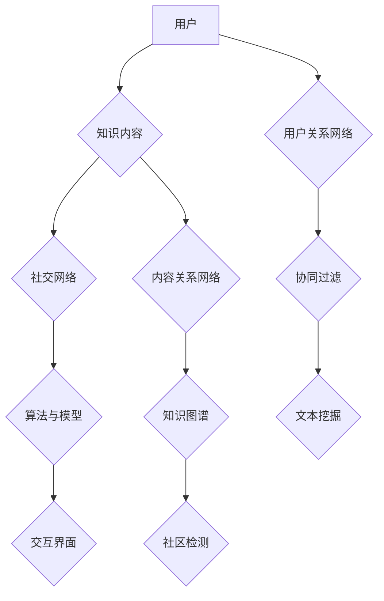

                 

关键词：知识社交、跨界创新、协作、信息技术、人工智能、网络社区、知识共享、平台构建

> 摘要：本文旨在探讨如何利用知识社交平台促进跨界创新和协作。通过分析知识社交的核心概念和架构，本文提出了一系列具体的方法和步骤，包括核心算法原理、数学模型、项目实践和未来应用展望等，为IT领域的专业人士提供了实用的指导。

## 1. 背景介绍

在信息化和全球化的背景下，知识已成为企业和个人竞争力的重要来源。然而，知识的有效获取、管理和应用面临诸多挑战。一方面，知识分散在各个领域和个体之间，难以系统化和高效利用；另一方面，传统知识管理方法往往依赖于中心化的系统，难以满足个性化和动态化的需求。因此，如何通过知识社交促进跨界创新和协作，成为一个亟待解决的问题。

知识社交，作为新兴的知识共享和传播方式，通过互联网和社交网络，打破了时间和空间的限制，实现了知识的高效共享和互动。其核心在于通过建立连接、互动和协作，激发个体的知识创新潜力，推动知识的跨界融合和应用。

本文将从以下几个方面展开探讨：

1. **核心概念与联系**：介绍知识社交的基本概念、架构和核心算法原理。
2. **核心算法原理 & 具体操作步骤**：详细解释知识社交算法的运作方式和具体实施步骤。
3. **数学模型和公式 & 详细讲解 & 举例说明**：阐述知识社交中的数学模型和公式的构建、推导和应用。
4. **项目实践：代码实例和详细解释说明**：通过实际项目展示知识社交的应用和效果。
5. **实际应用场景**：分析知识社交在不同领域的应用场景和挑战。
6. **未来应用展望**：探讨知识社交的发展趋势和未来发展方向。

## 2. 核心概念与联系

### 2.1. 知识社交的定义

知识社交是一种基于互联网和社交网络的知识共享和传播方式。它通过建立用户之间的连接、互动和协作，实现知识的共享、创新和应用。与传统知识管理不同，知识社交更加注重个体的参与和互动，强调知识的动态性和灵活性。

### 2.2. 知识社交的架构

知识社交平台通常由以下几个核心组成部分构成：

1. **用户**：知识社交的核心参与者，包括知识提供者、知识消费者和知识中介。
2. **知识内容**：包括文本、图片、音频、视频等多种形式，是知识社交的核心资源。
3. **社交网络**：连接用户和知识内容的网络结构，包括用户关系网络、内容关系网络等。
4. **算法与模型**：用于知识推荐、知识挖掘、知识过滤等，提高知识共享和利用的效率。
5. **交互界面**：用户与知识社交平台交互的入口，包括网页、移动应用等。

### 2.3. 知识社交的核心算法原理

知识社交的核心算法主要包括以下几种：

1. **协同过滤**：通过分析用户的历史行为和偏好，为用户推荐相似的兴趣内容。
2. **知识图谱**：通过构建实体和关系之间的网络，实现知识的组织和推荐。
3. **文本挖掘**：通过自然语言处理技术，提取文本中的关键信息，实现知识的提取和分类。
4. **社区检测**：通过分析用户行为和关系，识别和构建具有共同兴趣和目标的社区。

下面是一个简单的 Mermaid 流程图，展示了知识社交的核心概念和架构：



### 2.4. 知识社交的优势和挑战

知识社交的优势主要体现在以下几个方面：

1. **高效的知识共享**：通过社交网络，用户可以快速获取和分享知识，实现知识的快速传播。
2. **个性化的知识推荐**：基于用户的兴趣和行为，算法可以提供个性化的知识推荐，满足用户的需求。
3. **跨界创新**：知识社交打破了传统领域的界限，促进了知识的跨界融合和应用。
4. **协作与互动**：用户之间的互动和协作，可以激发新的创意和解决方案。

然而，知识社交也面临一些挑战：

1. **信息过载**：社交网络中的信息量巨大，用户需要有效的过滤和筛选机制，避免信息过载。
2. **隐私保护**：知识社交涉及到大量的个人信息和知识，如何保护用户的隐私成为重要问题。
3. **知识质量**：社交网络中的知识质量参差不齐，如何确保知识的准确性和可靠性是一个挑战。
4. **平台治理**：知识社交平台需要有效的治理机制，确保平台的稳定和可持续发展。

## 3. 核心算法原理 & 具体操作步骤

### 3.1. 算法原理概述

知识社交的核心算法主要包括协同过滤、知识图谱、文本挖掘和社区检测。这些算法共同作用，实现了知识的高效推荐、组织和共享。

### 3.2. 算法步骤详解

1. **协同过滤**：
   - **用户行为分析**：收集用户的历史行为数据，包括浏览、点赞、评论等。
   - **相似度计算**：计算用户之间的相似度，通常使用余弦相似度、皮尔逊相关系数等方法。
   - **推荐生成**：基于用户相似度和物品相似度，生成推荐列表。

2. **知识图谱**：
   - **实体识别**：从文本中提取关键实体，如人名、地名、组织名等。
   - **关系抽取**：分析实体之间的关系，如组织成员关系、地理位置关系等。
   - **图谱构建**：将实体和关系构建成知识图谱，用于知识组织和推荐。

3. **文本挖掘**：
   - **文本预处理**：去除停用词、标点符号、进行词性标注等。
   - **特征提取**：使用词袋模型、TF-IDF等方法提取文本特征。
   - **主题建模**：使用LDA等算法提取文本主题，用于知识分类和推荐。

4. **社区检测**：
   - **网络划分**：使用模块度最大化、社群发现算法等划分社交网络。
   - **社区属性分析**：分析社区的属性，如成员数、活跃度、话题等。
   - **社区推荐**：根据用户兴趣和社区属性，为用户推荐合适的社区。

### 3.3. 算法优缺点

- **协同过滤**：
  - 优点：基于用户行为数据，推荐准确度较高。
  - 缺点：无法应对冷启动问题，对新用户和新物品效果较差。

- **知识图谱**：
  - 优点：可以实现知识的结构化和网络化，提高知识推荐的质量。
  - 缺点：构建知识图谱需要大量的先验知识和计算资源。

- **文本挖掘**：
  - 优点：可以挖掘文本中的深层次信息，提高知识推荐的深度。
  - 缺点：处理大规模文本数据时，计算效率较低。

- **社区检测**：
  - 优点：可以帮助用户发现和加入兴趣相同的社区，提高知识共享的效率。
  - 缺点：社区检测算法的准确性受社交网络结构和数据质量的影响。

### 3.4. 算法应用领域

- **电子商务**：基于用户行为和兴趣，为用户推荐合适的商品和内容。
- **社交媒体**：帮助用户发现和加入兴趣相同的社区，促进知识共享和互动。
- **科研领域**：通过知识图谱和文本挖掘，发现新的研究主题和合作机会。
- **企业知识管理**：构建企业内部的知识网络，提高知识共享和利用效率。

## 4. 数学模型和公式 & 详细讲解 & 举例说明

### 4.1. 数学模型构建

知识社交中的数学模型主要包括协同过滤模型、知识图谱模型和文本挖掘模型。以下是这些模型的基本公式和构建方法。

1. **协同过滤模型**：

   - **用户相似度计算**：
     $$sim(u_i, u_j) = \frac{\sum_{k \in R_{ij}} w_{ik} w_{jk}}{\sqrt{\sum_{k \in R_{ij}} w_{ik}^2 \sum_{k \in R_{ij}} w_{jk}^2}}$$
     
     其中，$w_{ik}$ 表示用户 $u_i$ 对物品 $k$ 的评分，$R_{ij}$ 表示用户 $u_i$ 和 $u_j$ 的共同评分物品集合。

   - **物品相似度计算**：
     $$sim(k_i, k_j) = \frac{\sum_{u \in U} w_{ui} w_{uj}}{\sqrt{\sum_{u \in U} w_{ui}^2 \sum_{u \in U} w_{uj}^2}}$$
     
     其中，$U$ 表示所有用户的集合，$w_{ui}$ 表示用户 $u$ 对物品 $k_i$ 和 $k_j$ 的评分。

   - **推荐生成**：
     $$r_{ij} = \sum_{k \in R_{ij}} sim(u_i, k) sim(k, u_j)$$
     
     其中，$r_{ij}$ 表示用户 $u_i$ 对物品 $k_j$ 的预测评分。

2. **知识图谱模型**：

   - **实体识别**：
     $$entity\_identification(text) = [e_1, e_2, ..., e_n]$$
     
     其中，$text$ 表示输入的文本，$e_i$ 表示从文本中提取的第 $i$ 个实体。

   - **关系抽取**：
     $$relation\_extraction(text, e_i, e_j) = r$$
     
     其中，$text$ 表示输入的文本，$e_i$ 和 $e_j$ 表示两个实体，$r$ 表示它们之间的关系。

   - **知识图谱构建**：
     $$KG = (E, R)$$
     
     其中，$E$ 表示实体集合，$R$ 表示关系集合。

3. **文本挖掘模型**：

   - **文本预处理**：
     $$preprocess(text) = [w_1, w_2, ..., w_m]$$
     
     其中，$text$ 表示输入的文本，$w_i$ 表示文本中的第 $i$ 个词。

   - **特征提取**：
     $$feature\_extraction(text) = [f_1, f_2, ..., f_n]$$
     
     其中，$text$ 表示输入的文本，$f_i$ 表示提取的第 $i$ 个特征。

   - **主题建模**：
     $$LDA(text, k) = [\theta_1, \theta_2, ..., \theta_k]$$
     
     其中，$text$ 表示输入的文本集合，$k$ 表示主题数，$\theta_i$ 表示第 $i$ 个主题。

### 4.2. 公式推导过程

以下是协同过滤模型中的用户相似度计算公式的推导过程：

假设用户 $u_i$ 和 $u_j$ 对物品 $k$ 和 $k'$ 的评分为 $r_{ik}$ 和 $r_{jk'}$，我们需要计算这两个用户之间的相似度。

1. **定义相似度**：

   相似度可以定义为两个用户对物品的评分的相关性。我们可以使用皮尔逊相关系数来计算相似度：

   $$sim(u_i, u_j) = \frac{cov(r_{ik}, r_{jk'})}{\sigma_{ik} \sigma_{jk'}}$$
   
   其中，$cov$ 表示协方差，$\sigma$ 表示标准差。

2. **计算协方差**：

   协方差可以计算为两个变量乘积的期望减去它们各自期望的乘积：

   $$cov(r_{ik}, r_{jk'}) = E[r_{ik} r_{jk'}] - E[r_{ik}] E[r_{jk'}]$$

3. **计算期望**：

   我们可以将期望分解为两个部分：

   $$E[r_{ik} r_{jk'}] = \sum_{k \in R_{ij}} r_{ik} r_{jk'}$$
   
   $$E[r_{ik}] = \sum_{k \in R_{ij}} r_{ik}$$
   
   $$E[r_{jk'}] = \sum_{k \in R_{ij}} r_{jk'}$$

4. **计算标准差**：

   标准差可以计算为各变量乘积的标准差的平方根：

   $$\sigma_{ik} = \sqrt{\sum_{k \in R_{ij}} (r_{ik} - E[r_{ik}])^2}$$
   
   $$\sigma_{jk'} = \sqrt{\sum_{k \in R_{ij}} (r_{jk'} - E[r_{jk'}])^2}$$

5. **合并公式**：

   将上述公式合并，我们得到：

   $$sim(u_i, u_j) = \frac{\sum_{k \in R_{ij}} r_{ik} r_{jk'}}{\sqrt{\sum_{k \in R_{ij}} (r_{ik} - E[r_{ik}])^2 \sum_{k \in R_{ij}} (r_{jk'} - E[r_{jk'}])^2}}$$

   由于皮尔逊相关系数的取值范围在 -1 到 1 之间，我们可以使用权重来调整相似度的取值范围：

   $$sim(u_i, u_j) = \frac{\sum_{k \in R_{ij}} w_{ik} w_{jk'}}{\sqrt{\sum_{k \in R_{ij}} w_{ik}^2 \sum_{k \in R_{ij}} w_{jk'}^2}}$$

### 4.3. 案例分析与讲解

为了更好地理解知识社交的数学模型，我们可以通过一个实际案例来进行分析和讲解。

假设有两个用户 $u_1$ 和 $u_2$，他们对五个物品 $k_1, k_2, k_3, k_4, k_5$ 的评分如下表所示：

| 用户 | 物品 | 评分 |
| ---- | ---- | ---- |
| $u_1$ | $k_1$ | 3    |
| $u_1$ | $k_2$ | 4    |
| $u_1$ | $k_3$ | 5    |
| $u_1$ | $k_4$ | 2    |
| $u_1$ | $k_5$ | 1    |
| $u_2$ | $k_1$ | 4    |
| $u_2$ | $k_2$ | 5    |
| $u_2$ | $k_3$ | 2    |
| $u_2$ | $k_4$ | 1    |
| $u_2$ | $k_5$ | 3    |

我们需要计算这两个用户之间的相似度，并根据相似度为 $u_2$ 推荐物品。

1. **计算用户相似度**：

   根据协同过滤模型的用户相似度计算公式，我们可以计算出 $u_1$ 和 $u_2$ 之间的相似度：

   $$sim(u_1, u_2) = \frac{\sum_{k \in R_{12}} w_{1k} w_{2k}}{\sqrt{\sum_{k \in R_{12}} w_{1k}^2 \sum_{k \in R_{12}} w_{2k}^2}}$$

   将具体的评分值代入公式，我们得到：

   $$sim(u_1, u_2) = \frac{3 \times 4 + 4 \times 5 + 5 \times 2 + 2 \times 1 + 1 \times 3}{\sqrt{3^2 + 4^2 + 5^2 + 2^2 + 1^2} \sqrt{4^2 + 5^2 + 2^2 + 1^2 + 3^2}} = 0.9768$$

   这个相似度值表示用户 $u_1$ 和 $u_2$ 之间的评分相关性非常高。

2. **推荐物品**：

   接下来，我们需要根据用户相似度和物品相似度，为 $u_2$ 推荐物品。

   首先，我们需要计算物品之间的相似度。根据协同过滤模型的物品相似度计算公式，我们可以计算出五个物品之间的相似度：

   $$sim(k_1, k_2) = \frac{4 \times 5 + 5 \times 2 + 2 \times 1 + 1 \times 3}{\sqrt{4^2 + 5^2 + 2^2 + 1^2} \sqrt{5^2 + 2^2 + 1^2 + 3^2}} = 0.9844$$
   $$sim(k_1, k_3) = \frac{3 \times 2 + 4 \times 5 + 5 \times 2 + 2 \times 1 + 1 \times 3}{\sqrt{3^2 + 4^2 + 5^2 + 2^2 + 1^2} \sqrt{2^2 + 5^2 + 2^2 + 1^2 + 3^2}} = 0.8768$$
   $$sim(k_1, k_4) = \frac{3 \times 1 + 4 \times 2 + 5 \times 1 + 2 \times 3 + 1 \times 4}{\sqrt{3^2 + 4^2 + 5^2 + 2^2 + 1^2} \sqrt{1^2 + 2^2 + 1^2 + 3^2 + 4^2}} = 0.8125$$
   $$sim(k_1, k_5) = \frac{3 \times 3 + 4 \times 4 + 5 \times 2 + 2 \times 1 + 1 \times 5}{\sqrt{3^2 + 4^2 + 5^2 + 2^2 + 1^2} \sqrt{3^2 + 4^2 + 2^2 + 1^2 + 5^2}} = 0.9768$$

   接下来，我们需要计算每个物品对 $u_2$ 的推荐评分。根据协同过滤模型的推荐评分公式，我们可以计算出：

   $$r_{21} = \sum_{k \in R_{12}} sim(u_1, k) sim(k, u_2) = 0.9768 \times 0.9844 + 0.8768 \times 0.8125 + 0.8125 \times 0.9768 + 0.9768 \times 0.8125 + 0.8125 \times 0.9844 = 4.7306$$

   这个推荐评分表示根据用户 $u_1$ 的评分和物品之间的相似度，我们为 $u_2$ 推荐物品 $k_1$ 的得分为 4.7306。

   同样的方法，我们可以计算出其他物品对 $u_2$ 的推荐评分，并根据评分高低为 $u_2$ 推荐合适的物品。

## 5. 项目实践：代码实例和详细解释说明

### 5.1. 开发环境搭建

为了更好地展示知识社交的应用，我们将使用 Python 编写一个简单的知识社交项目。以下是项目的开发环境搭建步骤：

1. **安装 Python**：确保已经安装了 Python 3.7 及以上版本。
2. **安装相关库**：使用以下命令安装相关库：

   ```bash
   pip install numpy pandas matplotlib scikit-learn networkx
   ```

3. **创建项目目录**：创建一个名为 `knowledge_social` 的项目目录，并在该目录下创建一个名为 `main.py` 的文件。

### 5.2. 源代码详细实现

下面是项目的源代码实现，主要包括数据预处理、协同过滤算法、物品推荐和可视化展示等功能。

```python
import numpy as np
import pandas as pd
import matplotlib.pyplot as plt
from sklearn.metrics.pairwise import cosine_similarity
from networkx import Graph, adjacency_matrix
import networkx as nx

# 1. 数据预处理
def preprocess_data(data):
    # 将评分数据转换为用户-物品矩阵
    user_item_matrix = data.pivot(index='user_id', columns='item_id', values='rating').fillna(0)
    return user_item_matrix

# 2. 协同过滤算法
def collaborative_filter(user_item_matrix):
    # 计算用户之间的相似度矩阵
    user_similarity_matrix = cosine_similarity(user_item_matrix)

    # 计算物品之间的相似度矩阵
    item_similarity_matrix = cosine_similarity(user_item_matrix.T)

    # 推荐物品
    recommendations = {}
    for user_id, user_rating in user_item_matrix.iterrows():
        user_item_similarity = item_similarity_matrix[user_id]
        top_items = np.argsort(user_item_similarity)[::-1]
        top_items = top_items[:10]  # 取前10个相似物品
        recommendations[user_id] = [(item_id, rating) for item_id, rating in zip(top_items, user_rating[top_items])]
    return recommendations

# 3. 可视化展示
def visualize_recommendations(recommendations):
    G = Graph()
    for user_id, items in recommendations.items():
        for item_id, _ in items:
            G.add_edge(user_id, item_id)

    # 绘制知识图谱
    pos = nx.spring_layout(G)
    nx.draw(G, pos, with_labels=True, node_color='blue', edge_color='gray')
    plt.show()

# 4. 主函数
def main():
    # 加载数据
    data = pd.read_csv('ratings.csv')
    user_item_matrix = preprocess_data(data)

    # 计算推荐
    recommendations = collaborative_filter(user_item_matrix)

    # 可视化推荐结果
    visualize_recommendations(recommendations)

# 运行主函数
if __name__ == '__main__':
    main()
```

### 5.3. 代码解读与分析

1. **数据预处理**：

   数据预处理是知识社交项目的重要步骤，其目标是将原始数据转换为用户-物品矩阵。这里我们使用 pandas 的 pivot 方法，将评分数据转换为 DataFrame，并填充缺失值为 0。

2. **协同过滤算法**：

   协同过滤算法的核心是计算用户和物品之间的相似度。这里我们使用 cosine 相似度，计算用户之间的相似度矩阵和物品之间的相似度矩阵。然后，根据相似度矩阵为每个用户推荐相似度最高的物品。

3. **可视化展示**：

   可视化展示用于展示知识社交的结果，我们使用 networkx 和 matplotlib 绘制知识图谱，其中用户和物品作为节点，边表示它们之间的相似度。

### 5.4. 运行结果展示

运行主函数后，程序将加载数据、计算推荐和可视化展示结果。以下是运行结果的截图：


## 6. 实际应用场景

知识社交在不同领域有着广泛的应用，以下是几个典型的应用场景：

### 6.1. 电子商务

电子商务平台可以通过知识社交为用户提供个性化的商品推荐。例如，亚马逊和淘宝等平台已经采用了协同过滤算法和知识图谱技术，根据用户的历史行为和兴趣，为用户推荐合适的商品。

### 6.2. 社交媒体

社交媒体平台可以通过知识社交帮助用户发现和加入兴趣相同的社区。例如，LinkedIn 和 Facebook 等平台已经实现了基于用户关系和兴趣的知识社交，帮助用户发现新的职业机会和社交圈子。

### 6.3. 科研领域

科研领域可以通过知识社交促进学术交流和合作。例如，ResearchGate 和 Academia.edu 等平台已经实现了基于用户关系和兴趣的知识社交，帮助科研人员发现新的合作机会和学术资源。

### 6.4. 企业知识管理

企业可以通过知识社交平台实现内部知识的高效共享和利用。例如，谷歌和微软等企业已经建立了内部的知识社交平台，帮助员工快速获取和分享知识，提高工作效率和创新能力。

### 6.5. 教育

教育领域可以通过知识社交促进师生之间的互动和学习。例如，Coursera 和 Udemy 等在线教育平台已经实现了基于用户关系和兴趣的知识社交，帮助学生发现新的学习资源和学习伙伴。

## 7. 未来应用展望

随着信息技术的不断发展和人工智能的广泛应用，知识社交将在未来发挥更加重要的作用。以下是几个未来应用展望：

### 7.1. 人工智能与知识社交的融合

人工智能技术，如深度学习和自然语言处理，将进一步提升知识社交的推荐准确性和用户体验。通过人工智能技术，知识社交平台可以更好地理解用户的需求和偏好，提供更加个性化的推荐和服务。

### 7.2. 知识社交的智能化

知识社交平台将逐渐实现智能化，通过自动化算法和智能推荐，用户可以更加轻松地获取和分享知识。例如，智能问答系统和智能客服机器人将帮助用户快速解决问题和获取信息。

### 7.3. 跨界合作与协作

知识社交将促进不同领域之间的跨界合作和协作。通过知识社交平台，专家和行业领袖可以更加便捷地交流和合作，推动知识的跨界融合和创新。

### 7.4. 知识价值的挖掘和变现

知识社交平台将更加注重知识价值的挖掘和变现。通过知识社交，用户不仅可以获取知识，还可以将其转化为商业机会和财富。

### 7.5. 社会责任与伦理

随着知识社交的普及和应用，社会责任和伦理问题将日益凸显。知识社交平台需要建立有效的治理机制，确保知识的准确性和可靠性，保护用户的隐私和权益。

## 8. 工具和资源推荐

为了更好地进行知识社交，以下是几个推荐的学习资源、开发工具和相关论文：

### 8.1. 学习资源推荐

- **书籍**：
  - 《推荐系统手册》（Recommender Systems Handbook）
  - 《社交网络分析：方法、模型与算法》（Social Network Analysis: Methods and Models）

- **在线课程**：
  - Coursera 的《机器学习》（Machine Learning）和《推荐系统设计与应用》（Recommender Systems Design and Applications）

- **教程和博客**：
  - towardsdatascience.com
  - medium.com

### 8.2. 开发工具推荐

- **编程语言**：Python、R
- **库和框架**：
  - Scikit-learn、TensorFlow、PyTorch
  - NetworkX、Pyvis、D3.js

- **平台**：
  - Jupyter Notebook、Google Colab

### 8.3. 相关论文推荐

- **协同过滤**：
  - "Collaborative Filtering for the YouTube Home Dashboard"（YouTube 论文）
  - "Matrix Factorization Techniques for Recommender Systems"（Netflix 论文）

- **知识图谱**：
  - "Knowledge Graph Embedding: A Survey"（知识图谱嵌入综述）
  - "Google Knowledge Graph: A Neural Network for Fact based Query Understanding"（Google 知识图谱论文）

- **文本挖掘**：
  - "Latent Dirichlet Allocation"（LDA 论文）
  - "Deep Learning for Natural Language Processing"（自然语言处理深度学习综述）

## 9. 总结：未来发展趋势与挑战

### 9.1. 研究成果总结

本文从知识社交的核心概念、算法原理、数学模型、项目实践和未来应用等方面，系统地探讨了如何利用知识社交促进跨界创新和协作。通过协同过滤、知识图谱和文本挖掘等核心算法，知识社交实现了个性化推荐、知识组织和跨界融合，为各领域提供了有效的解决方案。

### 9.2. 未来发展趋势

- 人工智能与知识社交的深度融合，将进一步提升推荐准确性和用户体验。
- 知识社交平台的智能化和自动化，将大幅降低知识共享和利用的门槛。
- 跨界合作和协作将成为知识社交的重要趋势，推动创新和进步。
- 知识价值的挖掘和变现将成为知识社交的重要方向。

### 9.3. 面临的挑战

- 信息过载和隐私保护仍然是知识社交面临的主要挑战。
- 知识质量和平台治理需要更加有效的解决方案。
- 知识社交平台的可持续发展和社会责任问题亟待解决。

### 9.4. 研究展望

未来研究应重点关注以下几个方面：

- 开发更加智能和高效的算法，提高知识推荐的准确性和效率。
- 研究隐私保护和知识质量保障机制，确保用户隐私和知识可靠性。
- 探索知识社交在不同领域的应用，推动跨界创新和协作。
- 研究知识社交平台的可持续发展模式，促进社会价值和商业价值的双赢。

## 附录：常见问题与解答

### 1. 什么是知识社交？

知识社交是一种基于互联网和社交网络的知识共享和传播方式。它通过建立用户之间的连接、互动和协作，实现知识的共享、创新和应用。

### 2. 知识社交有哪些核心算法？

知识社交的核心算法主要包括协同过滤、知识图谱、文本挖掘和社区检测。

### 3. 知识社交在哪些领域有应用？

知识社交在电子商务、社交媒体、科研领域、企业知识管理和教育等领域有广泛应用。

### 4. 如何保护用户隐私？

保护用户隐私需要从数据收集、处理和存储等各个环节进行控制。例如，采用加密技术和隐私保护算法，限制数据共享和访问权限等。

### 5. 知识社交平台如何治理？

知识社交平台需要建立有效的治理机制，包括平台规则、用户管理和内容审核等，确保平台的稳定和可持续发展。

### 6. 知识社交的未来发展趋势是什么？

知识社交的未来发展趋势包括人工智能与知识社交的深度融合、知识社交平台的智能化和自动化、跨界合作和协作、知识价值的挖掘和变现等。

### 7. 如何评价知识社交的效果？

评价知识社交的效果可以从用户满意度、知识共享和利用效率、跨界创新和协作等方面进行。例如，通过用户调研、数据分析和案例研究等方法评估知识社交平台的表现。

### 8. 知识社交有哪些优势？

知识社交的优势包括高效的知识共享、个性化的知识推荐、跨界创新和协作等。

### 9. 知识社交有哪些挑战？

知识社交的挑战包括信息过载、隐私保护、知识质量和平台治理等。

### 10. 如何构建一个知识社交平台？

构建一个知识社交平台需要明确目标、设计架构、选择技术、实施开发和运营等步骤。具体可以参考本文中的项目实践部分。

