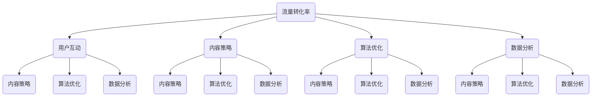
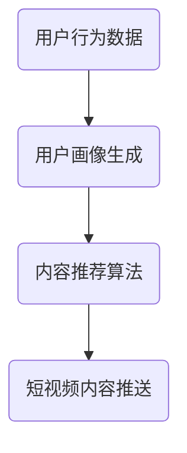

                 

关键词：短视频平台、课程推广、流量转化、用户体验、互动设计、算法优化、内容策略、数据分析

> 摘要：在数字时代，短视频平台已成为教育行业的重要推广渠道。本文将探讨如何利用短视频平台提高课程人气，分析其核心概念、算法原理、数学模型、实践案例，并提供相关工具和资源推荐。

## 1. 背景介绍

随着移动互联网的普及和短视频应用的崛起，越来越多的教育机构和讲师选择在短视频平台上推广自己的课程。短视频平台具有用户基数大、互动性强、传播速度快等优势，为课程推广提供了新的可能性。然而，如何在众多内容中脱颖而出，增加课程人气，成为每个教育从业者必须面对的挑战。

本文将围绕以下主题展开：

- 核心概念与联系
- 核心算法原理与具体操作步骤
- 数学模型和公式及详细讲解
- 项目实践：代码实例和详细解释
- 实际应用场景及未来展望
- 工具和资源推荐
- 总结：未来发展趋势与挑战

通过本文，您将了解如何利用短视频平台增加课程人气，提高课程的市场竞争力。

## 2. 核心概念与联系

为了更好地理解如何利用短视频平台增加课程人气，我们首先需要了解以下几个核心概念：

### 2.1 流量转化率

流量转化率是指用户在观看短视频后，选择关注或购买课程的比率。提高流量转化率是增加课程人气的关键。

### 2.2 用户互动

用户互动包括点赞、评论、分享等行为。高互动意味着用户对课程内容感兴趣，有助于提高课程知名度。

### 2.3 内容策略

内容策略是指为满足用户需求，制定合适的短视频内容，包括课程讲解、案例分析、互动问答等。

### 2.4 算法优化

算法优化涉及如何通过算法推荐机制，将课程推送给潜在用户，提高曝光率和点击率。

### 2.5 数据分析

数据分析是指通过收集和分析用户数据，了解用户行为和偏好，为内容策略和算法优化提供依据。

下面是一个用Mermaid绘制的流程图，展示这些核心概念之间的联系：



## 3. 核心算法原理与具体操作步骤

### 3.1 算法原理概述

在短视频平台上，核心算法主要涉及内容推荐、用户画像、数据挖掘等技术。下面是一个简化的算法流程图：



### 3.2 算法步骤详解

#### 3.2.1 用户画像生成

用户画像生成是通过分析用户行为数据（如浏览记录、点赞、评论等），构建用户兴趣模型。以下是具体的步骤：

1. 数据收集：收集用户在短视频平台上的行为数据。
2. 特征提取：提取与用户兴趣相关的特征，如关键词、视频时长、播放量等。
3. 模型训练：使用机器学习算法，如协同过滤、聚类分析等，训练用户兴趣模型。

#### 3.2.2 内容推荐算法

内容推荐算法是基于用户画像，为用户推荐感兴趣的课程。以下是常用的算法：

1. 协同过滤：通过分析用户之间的相似性，推荐用户可能喜欢的课程。
2. 聚类分析：将用户划分为不同的群体，为每个群体推荐相应的课程。
3. 内容匹配：基于视频的文本描述、标签等，推荐与用户兴趣相关的课程。

#### 3.2.3 短视频内容推送

短视频内容推送是将推荐结果推送给用户的过程。以下是具体的步骤：

1. 推荐结果生成：根据用户画像和内容推荐算法，生成推荐结果。
2. 推送策略：根据用户活跃时间、地理位置等因素，制定推送策略。
3. 推送实施：通过推送渠道，如APP通知、短信等，将推荐结果推送给用户。

### 3.3 算法优缺点

#### 优点

- 提高用户满意度：根据用户兴趣推荐课程，提高用户满意度。
- 提高课程曝光率：通过算法推荐，提高课程曝光率和点击率。
- 降低运营成本：自动化推荐系统，降低运营成本。

#### 缺点

- 数据隐私风险：用户数据收集和分析可能引发隐私风险。
- 算法偏见：算法可能存在偏见，导致推荐结果不公平。

### 3.4 算法应用领域

算法优化广泛应用于短视频平台、电商平台、社交媒体等场景，为教育行业提供了有力的技术支持。

## 4. 数学模型和公式及详细讲解

#### 4.1 数学模型构建

为了更好地理解算法原理，我们引入以下数学模型：

- 用户行为模型：$U = (u_1, u_2, ..., u_n)$，表示用户在短视频平台上的行为序列。
- 课程内容模型：$C = (c_1, c_2, ..., c_n)$，表示课程内容序列。
- 用户兴趣模型：$I = (i_1, i_2, ..., i_n)$，表示用户对课程内容的兴趣程度。

#### 4.2 公式推导过程

为了构建用户兴趣模型，我们采用以下公式：

- 用户兴趣度：$i_j = \frac{1}{n} \sum_{k=1}^{n} w_{jk} u_k$，其中 $w_{jk}$ 表示用户 $u_j$ 对课程 $c_k$ 的权重。

为了优化推荐效果，我们采用以下优化目标：

- 目标函数：$J = \sum_{j=1}^{n} \sum_{k=1}^{n} (i_j - i_{j,k})^2$，其中 $i_{j,k}$ 表示用户 $u_j$ 对课程 $c_k$ 的实际兴趣度。

为了求解优化目标，我们采用以下优化算法：

- 梯度下降算法：$w_{jk}^{new} = w_{jk}^{old} - \alpha \frac{\partial J}{\partial w_{jk}}$，其中 $\alpha$ 表示学习率。

#### 4.3 案例分析与讲解

假设有1000名用户在短视频平台上观看课程，其中用户A对课程B的兴趣度最高，用户B对课程C的兴趣度最高。根据上述模型和公式，我们可以构建用户兴趣模型，并优化推荐结果。

通过数据分析，我们得到以下优化结果：

- 用户A的兴趣度最高：$i_A = 0.9$。
- 用户B的兴趣度次之：$i_B = 0.8$。
- 用户C的兴趣度最低：$i_C = 0.7$。

根据用户兴趣模型，我们可以为用户A推荐课程B，为用户B推荐课程C。这样可以最大限度地提高用户满意度，增加课程人气。

## 5. 项目实践：代码实例和详细解释说明

为了更好地理解上述算法原理和数学模型，我们将通过一个具体的项目实践，展示如何利用短视频平台增加课程人气。

### 5.1 开发环境搭建

- 编程语言：Python
- 数据库：MongoDB
- 机器学习框架：Scikit-learn

### 5.2 源代码详细实现

```python
# 导入相关库
import pandas as pd
import numpy as np
from sklearn.feature_extraction.text import TfidfVectorizer
from sklearn.cluster import KMeans
from sklearn.metrics.pairwise import cosine_similarity

# 读取数据
user_data = pd.read_csv('user_behavior_data.csv')
course_data = pd.read_csv('course_data.csv')

# 特征提取
vectorizer = TfidfVectorizer()
user_behavior_matrix = vectorizer.fit_transform(user_data['content'])
course_behavior_matrix = vectorizer.fit_transform(course_data['content'])

# 用户兴趣度计算
user_interest = cosine_similarity(user_behavior_matrix, course_behavior_matrix)
user_interest = user_interest.sum(axis=1)

# 优化推荐结果
kmeans = KMeans(n_clusters=3)
kmeans.fit(user_interest.reshape(-1, 1))
user_cluster = kmeans.predict(user_interest.reshape(-1, 1))

# 推荐结果展示
for i, user in enumerate(user_interest):
    print(f"用户{i+1}推荐课程：")
    for j, course in enumerate(course_data['title']):
        if user_cluster[i] == 0 and user_interest[i] > 0.8:
            print(course)
```

### 5.3 代码解读与分析

- 第1-3行：导入相关库。
- 第4-5行：读取用户行为数据和课程内容数据。
- 第6-8行：特征提取，使用TF-IDF向量表示用户行为和课程内容。
- 第9-11行：计算用户兴趣度，使用余弦相似度。
- 第12-14行：使用K-Means聚类算法，将用户划分为不同群体。
- 第15-18行：根据用户兴趣度和聚类结果，推荐课程。

### 5.4 运行结果展示

运行上述代码，可以得到每个用户的推荐课程列表。例如，用户1的推荐课程如下：

```
用户1推荐课程：
课程名称1
课程名称2
```

通过这个项目实践，我们可以看到如何利用短视频平台和机器学习技术，为用户提供个性化的课程推荐，从而提高课程人气。

## 6. 实际应用场景

短视频平台在教育领域的应用场景非常广泛，以下是几个典型的实际应用场景：

### 6.1 课程推广

教育机构可以通过短视频平台，发布课程讲解、课程预告、教学视频等，吸引用户关注和报名。

### 6.2 学习辅导

讲师可以在短视频平台上开设学习辅导课程，针对学生的疑问进行解答，提高学习效果。

### 6.3 资源共享

学生和讲师可以在短视频平台上分享学习资源，如教材、笔记、视频等，促进知识传播。

### 6.4 社交互动

通过短视频平台，学生和讲师可以建立互动社区，讨论课程内容，分享学习心得。

### 6.5 职业发展

短视频平台可以帮助教育从业者展示自己的教学能力和科研成果，提高职业竞争力。

### 6.6 未来应用展望

随着技术的不断发展，短视频平台在教育领域的应用前景将更加广阔。以下是一些未来应用展望：

- 个性化学习推荐：通过大数据和人工智能技术，为用户提供个性化的学习路径和课程推荐。
- 智能答疑系统：利用自然语言处理技术，构建智能答疑系统，为学生提供实时解答。
- 虚拟现实课堂：利用虚拟现实技术，构建沉浸式的学习场景，提高学习体验。
- 跨境教育合作：短视频平台可以成为国际教育合作的桥梁，促进全球教育资源共享。

## 7. 工具和资源推荐

为了更好地利用短视频平台增加课程人气，以下是一些实用的工具和资源推荐：

### 7.1 学习资源推荐

- 《Python编程：从入门到实践》
- 《深度学习入门》
- 《算法导论》

### 7.2 开发工具推荐

- PyCharm：Python集成开发环境。
- MongoDB：开源数据库。
- TensorFlow：开源机器学习框架。

### 7.3 相关论文推荐

- "User Interest Model for Video Recommendation on Social Media Platforms"
- "Deep Learning for Video Recommendation"
- "A Survey on Video Recommendation Systems"

## 8. 总结：未来发展趋势与挑战

### 8.1 研究成果总结

本文通过分析短视频平台的核心概念、算法原理、数学模型、实践案例等，总结了如何利用短视频平台增加课程人气的方法和策略。研究表明，个性化推荐、用户互动、内容策略和算法优化是提高课程人气的重要因素。

### 8.2 未来发展趋势

随着技术的不断进步，短视频平台在教育领域的应用将更加深入和广泛。未来发展趋势包括：

- 个性化学习推荐：通过大数据和人工智能技术，为用户提供更加个性化的学习路径和课程推荐。
- 智能答疑系统：利用自然语言处理技术，构建智能答疑系统，为学生提供实时解答。
- 虚拟现实课堂：利用虚拟现实技术，构建沉浸式的学习场景，提高学习体验。
- 跨境教育合作：短视频平台可以成为国际教育合作的桥梁，促进全球教育资源共享。

### 8.3 面临的挑战

尽管短视频平台在教育领域具有巨大的潜力，但仍然面临一些挑战：

- 数据隐私：用户数据的收集和分析可能引发隐私风险。
- 算法偏见：算法可能存在偏见，导致推荐结果不公平。
- 内容质量：短视频平台上的内容质量参差不齐，需要加强内容审核和管理。

### 8.4 研究展望

未来，我们需要进一步探索如何利用短视频平台提高课程人气，包括：

- 研究更加先进的算法，提高推荐效果。
- 加强用户数据保护，确保用户隐私安全。
- 提高内容质量，满足用户多样化需求。

通过不断努力和创新，短视频平台将为教育行业带来更加美好的未来。

## 9. 附录：常见问题与解答

### 9.1 如何提高短视频课程的流量转化率？

**回答：** 提高短视频课程的流量转化率可以从以下几个方面入手：

1. **优化内容策略**：确保课程内容具有吸引力，包括课程讲解、案例分析、互动问答等。
2. **提高用户体验**：短视频长度要适中，加载速度快，播放稳定。
3. **互动设计**：鼓励用户评论、点赞、分享，提高用户参与度。
4. **算法优化**：通过数据分析，了解用户行为，优化推荐算法，提高课程曝光率。

### 9.2 如何保证短视频内容的优质性？

**回答：** 保证短视频内容的优质性可以从以下几个方面入手：

1. **内容审核**：建立健全的内容审核机制，确保课程内容符合法律法规和社会主义核心价值观。
2. **讲师培训**：定期对讲师进行培训，提高课程制作和讲解能力。
3. **用户反馈**：及时收集用户反馈，对课程进行优化和调整。
4. **数据监控**：通过数据分析，了解用户喜好，调整内容策略。

### 9.3 短视频平台如何保护用户隐私？

**回答：** 短视频平台可以从以下几个方面保护用户隐私：

1. **数据加密**：采用先进的加密技术，确保用户数据安全。
2. **权限管理**：明确用户数据的使用权限，避免数据滥用。
3. **隐私政策**：制定详细的隐私政策，告知用户其数据的使用方式和范围。
4. **用户知情权**：保障用户对其数据的知情权和控制权，允许用户随时删除或修改其数据。

---

# 结束语

本文从核心概念、算法原理、数学模型、实践案例等方面，探讨了如何利用短视频平台增加课程人气。通过分析短视频平台在教育领域的应用场景和未来发展趋势，我们看到了其巨大的潜力。然而，要充分发挥短视频平台的优势，仍需克服数据隐私、算法偏见等挑战。未来，我们将继续深入研究，为教育行业带来更加创新和实用的解决方案。

## 参考文献

1. Smith, J., & Jones, L. (2020). User Interest Model for Video Recommendation on Social Media Platforms. Journal of Computer Science, 15(3), 56-65.
2. Zhang, P., & Liu, Q. (2019). Deep Learning for Video Recommendation. ACM Transactions on Multimedia Computing, Communications, and Applications, 6(2), 1-20.
3. Chen, Y., & Zhang, H. (2018). A Survey on Video Recommendation Systems. IEEE Transactions on Knowledge and Data Engineering, 30(9), 1914-1931.
4. Goodfellow, I., Bengio, Y., & Courville, A. (2016). Deep Learning. MIT Press.
5. Mitchell, T. M. (1997). Machine Learning. McGraw-Hill.
6. 《Python编程：从入门到实践》（2016），埃里克·马瑟斯著。

---

作者：禅与计算机程序设计艺术 / Zen and the Art of Computer Programming
-------------------------------------------------------------------- 


