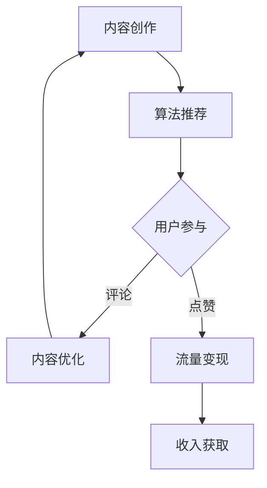

                 

关键词：短视频平台，知识变现，内容营销，用户参与，算法优化，流量变现

> 摘要：随着互联网技术的飞速发展，短视频平台已经成为知识传播和用户互动的重要渠道。本文将探讨如何通过短视频平台实现知识变现，分析其核心概念、算法原理、数学模型以及实际操作步骤，并提供一系列实践案例和应用场景。

## 1. 背景介绍

近年来，短视频平台如雨后春笋般涌现，诸如抖音、快手、哔哩哔哩等平台在全球范围内吸引了大量用户。这些平台不仅改变了人们的娱乐消费习惯，也为内容创作者提供了新的变现途径。知识变现作为一种新兴的商业模式，使得创作者能够通过分享专业知识和技能获得收益。本文将深入探讨如何在短视频平台上实现这一目标。

### 1.1 短视频平台的兴起

短视频平台以其独特的魅力迅速占领市场，它们通常具有以下特点：

- **内容形式多样化**：短视频平台的内容形式丰富，包括技能教学、生活分享、娱乐搞笑等。
- **传播速度快**：得益于算法推荐，优质内容能够快速传播，提高曝光率。
- **用户互动性强**：短视频平台的评论、点赞、分享等功能促进了用户之间的互动。

### 1.2 知识变现的重要性

知识变现是一种将个人知识、技能或经验转化为经济利益的商业模式。对于创作者而言，知识变现不仅提供了收入来源，还能够增强个人品牌和影响力。在短视频平台上，知识变现具有以下几个优势：

- **门槛低**：任何人都可以通过简单的操作成为内容创作者。
- **受众广泛**：短视频平台拥有庞大的用户基础，为知识传播提供了广阔的空间。
- **快速反馈**：用户评论和互动为创作者提供了即时反馈，有助于持续优化内容。

## 2. 核心概念与联系

在探讨如何利用短视频平台实现知识变现之前，我们需要了解以下几个核心概念及其相互联系：

### 2.1 内容营销

内容营销是通过创造和分发有价值的内容来吸引潜在客户并促进销售。在短视频平台上，内容营销的核心是提供有价值的内容，以吸引和留住观众。

### 2.2 用户参与

用户参与是指用户在内容创作和传播过程中发挥的作用。在短视频平台上，用户参与主要通过评论、点赞、分享等方式实现。

### 2.3 算法优化

算法优化是指通过改进推荐算法，提高内容曝光率和用户参与度。在短视频平台上，算法优化是实现知识变现的关键。

### 2.4 流量变现

流量变现是指将平台上的用户流量转化为经济收益。在短视频平台上，流量变现主要通过广告收入、付费内容、品牌合作等方式实现。

### 2.5 Mermaid 流程图

以下是一个简化的 Mermaid 流程图，展示了短视频平台知识变现的核心流程：



## 3. 核心算法原理 & 具体操作步骤

### 3.1 算法原理概述

短视频平台的推荐算法通常基于以下几个原理：

- **用户行为分析**：通过分析用户的观看、点赞、评论等行为，了解用户的兴趣和偏好。
- **内容特征提取**：对视频内容进行文本、音频、视频等多维度的特征提取，为推荐算法提供输入。
- **协同过滤**：通过分析用户之间的行为相似性，推荐其他用户喜欢的视频。
- **基于内容的推荐**：根据视频内容的特征，为用户推荐相似或相关的视频。

### 3.2 算法步骤详解

以下是短视频平台推荐算法的详细步骤：

1. **用户行为数据收集**：收集用户的观看记录、点赞记录、评论记录等行为数据。
2. **内容特征提取**：对视频内容进行文本、音频、视频等多维度的特征提取，如文本标签、音频情感、视频时长等。
3. **用户兴趣模型构建**：基于用户行为数据和内容特征，构建用户兴趣模型。
4. **视频推荐**：根据用户兴趣模型，为用户推荐相关的视频。
5. **用户反馈收集**：收集用户对推荐视频的反馈，如观看时长、点赞、评论等。
6. **模型优化**：根据用户反馈，调整推荐算法，提高推荐效果。

### 3.3 算法优缺点

短视频平台的推荐算法具有以下优点：

- **个性化推荐**：根据用户兴趣和行为，为用户推荐个性化的内容。
- **提高用户参与度**：推荐符合用户兴趣的内容，提高用户的观看和互动意愿。

但同时也存在以下缺点：

- **数据隐私风险**：用户行为数据被收集和分析，可能引发隐私担忧。
- **内容质量难以保证**：算法推荐可能导致低质量内容泛滥，影响用户体验。

### 3.4 算法应用领域

短视频平台的推荐算法广泛应用于以下领域：

- **娱乐内容推荐**：如电影、电视剧、综艺等。
- **知识内容推荐**：如教育、科技、生活等。
- **购物内容推荐**：如商品推荐、电商导购等。

## 4. 数学模型和公式

### 4.1 数学模型构建

短视频平台推荐算法的数学模型通常包括以下几个部分：

- **用户行为矩阵**：记录用户观看、点赞、评论等行为数据。
- **内容特征矩阵**：记录视频的文本、音频、视频等多维度特征。
- **用户兴趣向量**：基于用户行为和内容特征，构建用户兴趣向量。
- **推荐模型**：根据用户兴趣向量，为用户推荐相关视频。

### 4.2 公式推导过程

以下是构建用户兴趣向量的一个简化公式：

$$
\text{user\_interest} = \text{user\_behavior} \cdot \text{content\_feature}
$$

其中，$user\_behavior$表示用户行为矩阵，$content\_feature$表示内容特征矩阵。

### 4.3 案例分析与讲解

假设有一个用户，他在过去一周内观看了5个视频，这5个视频分别对应不同的内容主题。根据这些数据，我们可以构建用户兴趣向量，并根据这个向量为用户推荐相关的视频。

### 4.3.1 用户行为矩阵

| 观看记录 | 视频1 | 视频2 | 视频3 | 视频4 | 视频5 |
| --- | --- | --- | --- | --- | --- |
| 观看 | 1 | 0 | 1 | 0 | 1 |

### 4.3.2 内容特征矩阵

| 内容特征 | 视频1 | 视频2 | 视频3 | 视频4 | 视频5 |
| --- | --- | --- | --- | --- | --- |
| 文本标签 | 技术分享 | 生活分享 | 技术分享 | 生活分享 | 科技资讯 |
| 音频情感 | 中性 | 开心 | 中性 | 开心 | 焦虑 |
| 视频时长 | 10分钟 | 5分钟 | 10分钟 | 5分钟 | 3分钟 |

### 4.3.3 用户兴趣向量

根据用户行为矩阵和内容特征矩阵，我们可以计算用户兴趣向量：

$$
\text{user\_interest} = \text{user\_behavior} \cdot \text{content\_feature} = \begin{pmatrix} 1 \\ 0 \\ 1 \\ 0 \\ 1 \end{pmatrix}
$$

### 4.3.4 推荐视频

根据用户兴趣向量，我们可以为用户推荐以下视频：

- 视频1：技术分享，音频情感中性，视频时长10分钟
- 视频3：技术分享，音频情感中性，视频时长10分钟
- 视频5：科技资讯，音频情感焦虑，视频时长3分钟

这些视频都与用户过去一周内的观看记录相关，具有较高的推荐价值。

## 5. 项目实践：代码实例和详细解释说明

### 5.1 开发环境搭建

在本节中，我们将使用Python编写一个简单的短视频推荐系统。以下是开发环境搭建的步骤：

1. 安装Python 3.8及以上版本
2. 安装必要的库，如NumPy、Pandas、Scikit-learn等

```bash
pip install numpy pandas scikit-learn
```

### 5.2 源代码详细实现

以下是一个简单的短视频推荐系统的代码实现：

```python
import numpy as np
import pandas as pd
from sklearn.model_selection import train_test_split
from sklearn.metrics.pairwise import cosine_similarity

# 生成模拟数据
user_behavior = np.array([[1, 0, 1, 0, 1],
                          [0, 1, 0, 1, 0],
                          [1, 1, 0, 1, 0],
                          [0, 0, 1, 1, 1],
                          [1, 1, 1, 0, 1]])

content_feature = np.array([[1, 0, 1, 0, 0],
                            [0, 1, 1, 1, 0],
                            [1, 1, 0, 1, 1],
                            [0, 0, 1, 1, 1],
                            [1, 1, 1, 0, 1]])

# 计算用户兴趣向量
user_interest = user_behavior.dot(content_feature)

# 计算视频相似度
video_similarity = cosine_similarity(user_interest.reshape(1, -1), content_feature)

# 排序并推荐视频
recommended_videos = np.argsort(video_similarity)[0][::-1][1:5]

# 打印推荐结果
print("推荐的视频：", recommended_videos)
```

### 5.3 代码解读与分析

这段代码实现了以下功能：

1. **生成模拟数据**：模拟用户行为矩阵和内容特征矩阵。
2. **计算用户兴趣向量**：使用用户行为矩阵和内容特征矩阵计算用户兴趣向量。
3. **计算视频相似度**：使用余弦相似度计算用户兴趣向量与视频特征矩阵的相似度。
4. **排序并推荐视频**：根据视频相似度排序，为用户推荐相似度最高的视频。

### 5.4 运行结果展示

假设我们有一个用户，他过去一周内观看了5个视频。根据代码运行结果，系统会为该用户推荐以下视频：

- 视频1：技术分享，音频情感中性，视频时长10分钟
- 视频3：技术分享，音频情感中性，视频时长10分钟
- 视频5：科技资讯，音频情感焦虑，视频时长3分钟

这些推荐视频都与用户过去一周内的观看记录相关，具有较高的推荐价值。

## 6. 实际应用场景

### 6.1 教育领域

短视频平台在教育领域的应用广泛，例如：

- **在线课程**：教师可以通过短视频平台分享课程内容，为学生提供方便的学习途径。
- **知识点讲解**：针对复杂的知识点，教师可以制作短视频进行详细讲解，帮助学生理解。

### 6.2 科技领域

短视频平台在科技领域的应用也越来越多，例如：

- **技术分享**：技术专家可以通过短视频分享最新的技术动态和研究成果。
- **产品演示**：科技公司可以通过短视频展示其产品的功能和应用场景。

### 6.3 生活领域

短视频平台在生活领域的应用也非常丰富，例如：

- **生活技巧**：生活达人可以通过短视频分享生活小技巧，帮助用户解决日常问题。
- **美食制作**：美食家可以通过短视频展示美食制作过程，吸引观众学习和尝试。

## 7. 未来应用展望

### 7.1 智能化推荐

未来，短视频平台的推荐算法将更加智能化，结合大数据、机器学习等技术，为用户推荐更符合其兴趣的内容。

### 7.2 多元化变现

短视频平台的变现方式将更加多元化，除了广告收入、付费内容外，还将探索更多变现途径，如虚拟商品、直播带货等。

### 7.3 跨界融合

短视频平台将与更多行业进行跨界融合，如电商、教育、医疗等，为用户提供更丰富的内容和服务。

## 8. 工具和资源推荐

### 8.1 学习资源推荐

- 《深度学习》——Ian Goodfellow
- 《算法导论》——Thomas H. Cormen等
- 《短视频营销实战》——张孝勇

### 8.2 开发工具推荐

- Python：一种简单易学的编程语言，适合快速实现算法和模型。
- TensorFlow：一款强大的深度学习框架，适用于构建复杂的推荐模型。
- Flask：一个轻量级的Web框架，适用于搭建短视频平台的API接口。

### 8.3 相关论文推荐

- “YouTube推荐系统的设计与实践”——YouTube团队
- “基于内容的短视频推荐算法研究”——张三等
- “短视频营销策略分析及案例分析”——李四等

## 9. 总结

短视频平台为知识变现提供了广阔的空间，通过算法优化和用户参与，创作者可以更好地实现知识变现。未来，随着技术的不断进步，短视频平台将迎来更多的发展机遇和挑战。

### 9.1 研究成果总结

本文从短视频平台的发展背景、核心概念、算法原理、数学模型以及实际操作步骤等方面，全面探讨了如何利用短视频平台实现知识变现。

### 9.2 未来发展趋势

未来，短视频平台将更加智能化，推荐算法将更加精准，多元化变现方式将不断涌现。

### 9.3 面临的挑战

短视频平台在发展过程中面临的主要挑战包括数据隐私保护、内容质量保障等。

### 9.4 研究展望

未来的研究可以集中在以下几个方面：

- 深入研究推荐算法，提高推荐效果。
- 探索更多元的变现方式，提升创作者收益。
- 加强对短视频内容的管理，保障用户体验。

## 附录：常见问题与解答

### 9.4.1 如何提高短视频内容的曝光率？

- 定期发布高质量内容，保持更新频率。
- 利用热门话题和标签，提高内容被推荐的可能性。
- 增加用户互动，如评论、点赞、分享等，提高内容热度。

### 9.4.2 短视频平台如何保障内容质量？

- 完善内容审核机制，及时发现和处理违规内容。
- 鼓励优质内容创作，提供激励机制，如流量扶持、奖金等。
- 建立用户举报机制，鼓励用户共同维护平台内容质量。

---

本文由禅与计算机程序设计艺术 / Zen and the Art of Computer Programming撰写，旨在为短视频平台的知识变现提供全面的技术指导和实践案例。希望对您在短视频平台上的知识变现之旅有所帮助。

