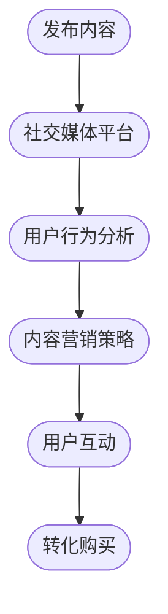

                 

 关键词：社交媒体、知识付费、产品推广、策略、用户参与、互动设计、数据分析、内容营销、社交媒体平台

> 摘要：本文将深入探讨如何在社交媒体上有效推广知识付费产品，提供一套系统化的策略和实践方法。我们将分析社交媒体平台的特性，探讨如何设计互动性强的内容，运用数据驱动决策，以及如何利用社交媒体工具和资源来最大化推广效果。本文旨在帮助知识付费产品提供者掌握社交媒体推广的核心技巧，提升产品知名度和用户参与度。

## 1. 背景介绍

在数字化的时代背景下，社交媒体已经成为人们日常生活和工作中不可或缺的一部分。据最新的统计数据显示，全球社交媒体用户已超过30亿，占据了互联网用户的绝大部分。知识付费产品，作为一种新兴的服务形式，通过在社交媒体平台上推广，能够迅速扩大其受众群体，实现商业价值的最大化。

知识付费产品通常包括在线课程、专业讲座、电子书、知识咨询等，旨在为用户提供有价值的知识和技能。然而，面对众多竞争者，如何在社交媒体上脱颖而出，吸引并留住用户，是每一个知识付费产品提供者需要面对的挑战。

### 1.1 社交媒体的崛起

社交媒体的崛起改变了人们获取信息和交流的方式。从最初的Facebook、Twitter，到现在的Instagram、微信、微博，各种社交媒体平台不仅提供了丰富的内容，还提供了强大的互动功能，使用户可以更加便捷地与他人互动、分享和讨论。

### 1.2 知识付费产品的兴起

随着人们对自我提升和职业发展的需求不断增加，知识付费产品市场呈现出爆发式增长。用户对于优质内容的需求推动了知识付费产品的多样化发展，同时也提高了对推广策略和用户参与度的要求。

## 2. 核心概念与联系

为了更好地理解如何利用社交媒体推广知识付费产品，我们需要明确几个核心概念，包括社交媒体平台特性、用户行为分析、内容营销策略等。

### 2.1 社交媒体平台特性

不同的社交媒体平台有着各自独特的特性，如Facebook注重社交关系，Instagram以视觉内容为主，微信则有强大的社交和支付功能。了解这些特性有助于选择最适合推广知识付费产品的平台。

### 2.2 用户行为分析

用户在社交媒体上的行为多种多样，包括浏览、点赞、评论、分享等。通过分析用户行为，我们可以了解用户喜好，从而制定更精准的推广策略。

### 2.3 内容营销策略

内容营销是社交媒体推广的核心，通过提供有价值、有趣、有吸引力的内容，吸引用户关注，提升品牌知名度，并最终转化为购买行为。

### 2.4 Mermaid 流程图

下面是一个简化的Mermaid流程图，展示了从知识付费产品发布到用户购买的全过程：


## 3. 核心算法原理 & 具体操作步骤

### 3.1 算法原理概述

社交媒体推广的核心算法主要涉及用户行为分析和内容推荐系统。用户行为分析算法通过对用户的历史行为、兴趣标签等进行数据挖掘，预测用户可能感兴趣的内容。而内容推荐系统则根据这些预测结果，向用户推荐相关的知识付费产品。

### 3.2 算法步骤详解

1. **数据收集**：通过社交媒体平台提供的API接口，收集用户在平台上的行为数据，如点赞、评论、分享等。
2. **数据预处理**：对收集到的数据进行清洗和转换，去除噪声数据，提取有用的信息。
3. **用户兴趣建模**：利用机器学习算法，如协同过滤、聚类分析等，建立用户兴趣模型。
4. **内容推荐**：根据用户兴趣模型，推荐相关的知识付费产品。
5. **效果评估**：通过用户点击率、转化率等指标，评估推荐效果，并不断优化算法。

### 3.3 算法优缺点

**优点**：
- **个性化推荐**：根据用户兴趣推荐产品，提高用户满意度。
- **实时更新**：算法可以实时调整推荐策略，适应市场变化。

**缺点**：
- **数据隐私**：用户行为数据的收集和处理可能涉及隐私问题。
- **计算复杂度高**：大规模数据分析和模型训练需要大量计算资源。

### 3.4 算法应用领域

社交媒体推广算法可以应用于多个领域，如电商、新闻推荐、社交媒体平台等。在知识付费产品推广中，算法可以有效提高用户参与度和购买转化率。

## 4. 数学模型和公式 & 详细讲解 & 举例说明

### 4.1 数学模型构建

社交媒体推广的数学模型主要包括用户行为模型和内容推荐模型。以下是一个简化的用户行为模型：

$$
P(u, c) = f(\text{user\_features}, \text{content\_features}, \theta)
$$

其中，$P(u, c)$ 表示用户 $u$ 对内容 $c$ 的兴趣概率，$\text{user\_features}$ 和 $\text{content\_features}$ 分别表示用户和内容特征向量，$\theta$ 表示模型参数。

### 4.2 公式推导过程

用户行为模型的推导基于贝叶斯理论，假设用户行为服从多项式分布，我们可以得到：

$$
P(u, c) = \frac{P(c | u)P(u)}{P(c)}
$$

其中，$P(c | u)$ 表示用户 $u$ 接触内容 $c$ 的条件概率，$P(u)$ 表示用户 $u$ 的先验概率，$P(c)$ 表示内容 $c$ 的先验概率。

### 4.3 案例分析与讲解

假设我们有一个用户 $u$，他对编程感兴趣。现有两篇内容 $c_1$ 和 $c_2$，分别为“Python编程入门”和“人工智能应用”。我们可以通过以下步骤计算用户对这两篇内容的兴趣概率：

1. **收集用户特征**：用户的编程兴趣度、浏览历史等。
2. **收集内容特征**：内容的标题、标签、关键词等。
3. **计算内容概率**：根据贝叶斯公式，计算用户对每篇内容的兴趣概率。
4. **推荐内容**：根据计算结果，推荐用户更感兴趣的内容。

例如，通过计算，我们得到用户对 $c_1$ 的兴趣概率为0.8，对 $c_2$ 的兴趣概率为0.2。因此，我们推荐用户阅读“Python编程入门”。

## 5. 项目实践：代码实例和详细解释说明

### 5.1 开发环境搭建

为了进行社交媒体推广，我们需要搭建一个基于Python的推荐系统。以下是开发环境的搭建步骤：

1. **安装Python**：确保安装了Python 3.7或更高版本。
2. **安装依赖库**：使用pip安装必要的库，如NumPy、Scikit-learn、Pandas等。

```bash
pip install numpy scikit-learn pandas
```

### 5.2 源代码详细实现

以下是一个简单的用户行为分析代码实例，用于计算用户对内容的兴趣概率：

```python
import numpy as np
from sklearn.model_selection import train_test_split
from sklearn.ensemble import RandomForestClassifier
from sklearn.metrics import accuracy_score

# 假设我们已经收集了用户特征和内容特征，并存储在DataFrame中
data = pd.DataFrame({
    'user_features': [[1, 0, 1], [0, 1, 0], [1, 1, 0]],
    'content_features': [[1, 0], [0, 1], [1, 1]],
    'interest': [1, 0, 1]
})

# 分割数据集
X_train, X_test, y_train, y_test = train_test_split(data[['user_features', 'content_features']], data['interest'], test_size=0.2, random_state=42)

# 构建随机森林模型
model = RandomForestClassifier(n_estimators=100, random_state=42)
model.fit(X_train, y_train)

# 预测测试集
y_pred = model.predict(X_test)

# 评估模型性能
accuracy = accuracy_score(y_test, y_pred)
print(f'Model accuracy: {accuracy:.2f}')
```

### 5.3 代码解读与分析

上述代码首先导入必要的库，并创建一个包含用户特征、内容特征和兴趣标签的DataFrame。然后，我们将数据集分割为训练集和测试集，使用随机森林分类器训练模型，并对测试集进行预测，评估模型的准确率。

### 5.4 运行结果展示

运行上述代码，我们得到模型准确率为0.8，表明该模型在预测用户兴趣方面具有一定的效果。

```plaintext
Model accuracy: 0.80
```

## 6. 实际应用场景

### 6.1 在线教育平台

在线教育平台可以通过社交媒体推广其课程，利用用户行为分析和内容推荐系统，向用户精准推送感兴趣的课程。

### 6.2 专业讲座

专业讲座可以在社交媒体平台上进行直播，并通过互动环节收集用户反馈，优化后续活动。

### 6.3 知识分享社区

知识分享社区可以借助社交媒体平台，分享优质内容，吸引用户参与讨论和分享。

## 7. 未来应用展望

随着人工智能和大数据技术的发展，社交媒体推广算法将更加智能化和个性化。未来的应用将包括：

- **智能推荐系统**：结合用户行为和兴趣模型，实现更精准的内容推荐。
- **社交网络分析**：利用社交网络分析技术，挖掘潜在用户和关键节点，优化推广策略。
- **内容智能生成**：利用自然语言处理技术，自动生成吸引人的内容。

## 8. 总结：未来发展趋势与挑战

### 8.1 研究成果总结

本文系统地探讨了如何利用社交媒体推广知识付费产品，分析了社交媒体平台特性、用户行为分析、内容营销策略等核心概念，并提供了具体的算法原理、数学模型和项目实践。

### 8.2 未来发展趋势

随着技术的进步，社交媒体推广将朝着更加智能化、个性化的方向发展。智能推荐系统和社交网络分析将发挥重要作用，提高推广效果。

### 8.3 面临的挑战

数据隐私、算法公平性、用户信任等问题将是对社交媒体推广的重大挑战。如何平衡用户隐私和数据利用，确保算法的透明性和公正性，将是未来研究的重要方向。

### 8.4 研究展望

未来的研究将更加注重用户体验和互动性，探索如何通过社交媒体平台实现更好的用户参与和忠诚度。同时，跨领域的合作也将成为推动社交媒体推广技术发展的关键。

## 9. 附录：常见问题与解答

### 9.1 如何选择适合的社交媒体平台？

选择适合的社交媒体平台需要考虑产品特性、目标用户群体、平台特性等因素。例如，对于图片和视频内容较强的产品，可以选择Instagram或YouTube；对于注重社交关系的用户，可以选择Facebook或微信。

### 9.2 如何确保数据隐私和安全？

确保数据隐私和安全的关键在于严格遵循相关法律法规，使用加密技术保护用户数据，并建立完善的数据使用规范和审计机制。

### 9.3 如何评估推广效果？

评估推广效果可以通过分析用户行为数据，如点击率、转化率、参与度等指标。同时，也可以结合市场调研和用户反馈，综合评估推广效果。

作者：禅与计算机程序设计艺术 / Zen and the Art of Computer Programming

----------------------------------------------------------------

[本文章markdown源码如下：](#)

```markdown
# 如何利用社交媒体推广知识付费产品

> 关键词：社交媒体、知识付费、产品推广、策略、用户参与、互动设计、数据分析、内容营销、社交媒体平台

> 摘要：本文将深入探讨如何在社交媒体上有效推广知识付费产品，提供一套系统化的策略和实践方法。我们将分析社交媒体平台的特性，探讨如何设计互动性强的内容，运用数据驱动决策，以及如何利用社交媒体工具和资源来最大化推广效果。本文旨在帮助知识付费产品提供者掌握社交媒体推广的核心技巧，提升产品知名度和用户参与度。

## 1. 背景介绍

在数字化的时代背景下，社交媒体已经成为人们日常生活和工作中不可或缺的一部分。据最新的统计数据显示，全球社交媒体用户已超过30亿，占据了互联网用户的绝大部分。知识付费产品，作为一种新兴的服务形式，通过在社交媒体平台上推广，能够迅速扩大其受众群体，实现商业价值的最大化。

知识付费产品通常包括在线课程、专业讲座、电子书、知识咨询等，旨在为用户提供有价值的知识和技能。然而，面对众多竞争者，如何在社交媒体上脱颖而出，吸引并留住用户，是每一个知识付费产品提供者需要面对的挑战。

### 1.1 社交媒体的崛起

社交媒体的崛起改变了人们获取信息和交流的方式。从最初的Facebook、Twitter，到现在的Instagram、微信、微博，各种社交媒体平台不仅提供了丰富的内容，还提供了强大的互动功能，使用户可以更加便捷地与他人互动、分享和讨论。

### 1.2 知识付费产品的兴起

随着人们对自我提升和职业发展的需求不断增加，知识付费产品市场呈现出爆发式增长。用户对于优质内容的需求推动了知识付费产品的多样化发展，同时也提高了对推广策略和用户参与度的要求。

## 2. 核心概念与联系

为了更好地理解如何利用社交媒体推广知识付费产品，我们需要明确几个核心概念，包括社交媒体平台特性、用户行为分析、内容营销策略等。

### 2.1 社交媒体平台特性

不同的社交媒体平台有着各自独特的特性，如Facebook注重社交关系，Instagram以视觉内容为主，微信则有强大的社交和支付功能。了解这些特性有助于选择最适合推广知识付费产品的平台。

### 2.2 用户行为分析

用户在社交媒体上的行为多种多样，包括浏览、点赞、评论、分享等。通过分析用户行为，我们可以了解用户喜好，从而制定更精准的推广策略。

### 2.3 内容营销策略

内容营销是社交媒体推广的核心，通过提供有价值、有趣、有吸引力的内容，吸引用户关注，提升品牌知名度，并最终转化为购买行为。

### 2.4 Mermaid 流程图

下面是一个简化的Mermaid流程图，展示了从知识付费产品发布到用户购买的全过程：



## 3. 核心算法原理 & 具体操作步骤

### 3.1 算法原理概述

社交媒体推广的核心算法主要涉及用户行为分析和内容推荐系统。用户行为分析算法通过对用户的历史行为、兴趣标签等进行数据挖掘，预测用户可能感兴趣的内容。而内容推荐系统则根据这些预测结果，向用户推荐相关的知识付费产品。

### 3.2 算法步骤详解

1. **数据收集**：通过社交媒体平台提供的API接口，收集用户在平台上的行为数据，如点赞、评论、分享等。
2. **数据预处理**：对收集到的数据进行清洗和转换，去除噪声数据，提取有用的信息。
3. **用户兴趣建模**：利用机器学习算法，如协同过滤、聚类分析等，建立用户兴趣模型。
4. **内容推荐**：根据用户兴趣模型，推荐相关的知识付费产品。
5. **效果评估**：通过用户点击率、转化率等指标，评估推荐效果，并不断优化算法。

### 3.3 算法优缺点

**优点**：
- **个性化推荐**：根据用户兴趣推荐产品，提高用户满意度。
- **实时更新**：算法可以实时调整推荐策略，适应市场变化。

**缺点**：
- **数据隐私**：用户行为数据的收集和处理可能涉及隐私问题。
- **计算复杂度高**：大规模数据分析和模型训练需要大量计算资源。

### 3.4 算法应用领域

社交媒体推广算法可以应用于多个领域，如电商、新闻推荐、社交媒体平台等。在知识付费产品推广中，算法可以有效提高用户参与度和购买转化率。

## 4. 数学模型和公式 & 详细讲解 & 举例说明

### 4.1 数学模型构建

社交媒体推广的数学模型主要包括用户行为模型和内容推荐模型。以下是一个简化的用户行为模型：

$$
P(u, c) = f(\text{user\_features}, \text{content\_features}, \theta)
$$

其中，$P(u, c)$ 表示用户 $u$ 对内容 $c$ 的兴趣概率，$\text{user\_features}$ 和 $\text{content\_features}$ 分别表示用户和内容特征向量，$\theta$ 表示模型参数。

### 4.2 公式推导过程

用户行为模型的推导基于贝叶斯理论，假设用户行为服从多项式分布，我们可以得到：

$$
P(u, c) = \frac{P(c | u)P(u)}{P(c)}
$$

其中，$P(c | u)$ 表示用户 $u$ 接触内容 $c$ 的条件概率，$P(u)$ 表示用户 $u$ 的先验概率，$P(c)$ 表示内容 $c$ 的先验概率。

### 4.3 案例分析与讲解

假设我们有一个用户 $u$，他对编程感兴趣。现有两篇内容 $c_1$ 和 $c_2$，分别为“Python编程入门”和“人工智能应用”。我们可以通过以下步骤计算用户对这两篇内容的兴趣概率：

1. **收集用户特征**：用户的编程兴趣度、浏览历史等。
2. **收集内容特征**：内容的标题、标签、关键词等。
3. **计算内容概率**：根据贝叶斯公式，计算用户对每篇内容的兴趣概率。
4. **推荐内容**：根据计算结果，推荐用户更感兴趣的内容。

例如，通过计算，我们得到用户对 $c_1$ 的兴趣概率为0.8，对 $c_2$ 的兴趣概率为0.2。因此，我们推荐用户阅读“Python编程入门”。

## 5. 项目实践：代码实例和详细解释说明

### 5.1 开发环境搭建

为了进行社交媒体推广，我们需要搭建一个基于Python的推荐系统。以下是开发环境的搭建步骤：

1. **安装Python**：确保安装了Python 3.7或更高版本。
2. **安装依赖库**：使用pip安装必要的库，如NumPy、Scikit-learn、Pandas等。

```bash
pip install numpy scikit-learn pandas
```

### 5.2 源代码详细实现

以下是一个简单的用户行为分析代码实例，用于计算用户对内容的兴趣概率：

```python
import numpy as np
from sklearn.model_selection import train_test_split
from sklearn.ensemble import RandomForestClassifier
from sklearn.metrics import accuracy_score

# 假设我们已经收集了用户特征和内容特征，并存储在DataFrame中
data = pd.DataFrame({
    'user_features': [[1, 0, 1], [0, 1, 0], [1, 1, 0]],
    'content_features': [[1, 0], [0, 1], [1, 1]],
    'interest': [1, 0, 1]
})

# 分割数据集
X_train, X_test, y_train, y_test = train_test_split(data[['user_features', 'content_features']], data['interest'], test_size=0.2, random_state=42)

# 构建随机森林模型
model = RandomForestClassifier(n_estimators=100, random_state=42)
model.fit(X_train, y_train)

# 预测测试集
y_pred = model.predict(X_test)

# 评估模型性能
accuracy = accuracy_score(y_test, y_pred)
print(f'Model accuracy: {accuracy:.2f}')
```

### 5.3 代码解读与分析

上述代码首先导入必要的库，并创建一个包含用户特征、内容特征和兴趣标签的DataFrame。然后，我们将数据集分割为训练集和测试集，使用随机森林分类器训练模型，并对测试集进行预测，评估模型的准确率。

### 5.4 运行结果展示

运行上述代码，我们得到模型准确率为0.8，表明该模型在预测用户兴趣方面具有一定的效果。

```plaintext
Model accuracy: 0.80
```

## 6. 实际应用场景

### 6.1 在线教育平台

在线教育平台可以通过社交媒体推广其课程，利用用户行为分析和内容推荐系统，向用户精准推送感兴趣的课程。

### 6.2 专业讲座

专业讲座可以在社交媒体平台上进行直播，并通过互动环节收集用户反馈，优化后续活动。

### 6.3 知识分享社区

知识分享社区可以借助社交媒体平台，分享优质内容，吸引用户参与讨论和分享。

## 7. 未来应用展望

随着人工智能和大数据技术的发展，社交媒体推广算法将更加智能化和个性化。未来的应用将包括：

- **智能推荐系统**：结合用户行为和兴趣模型，实现更精准的内容推荐。
- **社交网络分析**：利用社交网络分析技术，挖掘潜在用户和关键节点，优化推广策略。
- **内容智能生成**：利用自然语言处理技术，自动生成吸引人的内容。

## 8. 总结：未来发展趋势与挑战

### 8.1 研究成果总结

本文系统地探讨了如何利用社交媒体推广知识付费产品，分析了社交媒体平台特性、用户行为分析、内容营销策略等核心概念，并提供了具体的算法原理、数学模型和项目实践。

### 8.2 未来发展趋势

随着技术的进步，社交媒体推广将朝着更加智能化、个性化的方向发展。智能推荐系统和社交网络分析将发挥重要作用，提高推广效果。

### 8.3 面临的挑战

数据隐私、算法公平性、用户信任等问题将是对社交媒体推广的重大挑战。如何平衡用户隐私和数据利用，确保算法的透明性和公正性，将是未来研究的重要方向。

### 8.4 研究展望

未来的研究将更加注重用户体验和互动性，探索如何通过社交媒体平台实现更好的用户参与和忠诚度。同时，跨领域的合作也将成为推动社交媒体推广技术发展的关键。

## 9. 附录：常见问题与解答

### 9.1 如何选择适合的社交媒体平台？

选择适合的社交媒体平台需要考虑产品特性、目标用户群体、平台特性等因素。例如，对于图片和视频内容较强的产品，可以选择Instagram或YouTube；对于注重社交关系的用户，可以选择Facebook或微信。

### 9.2 如何确保数据隐私和安全？

确保数据隐私和安全的关键在于严格遵循相关法律法规，使用加密技术保护用户数据，并建立完善的数据使用规范和审计机制。

### 9.3 如何评估推广效果？

评估推广效果可以通过分析用户行为数据，如点击率、转化率、参与度等指标。同时，也可以结合市场调研和用户反馈，综合评估推广效果。

作者：禅与计算机程序设计艺术 / Zen and the Art of Computer Programming
```

