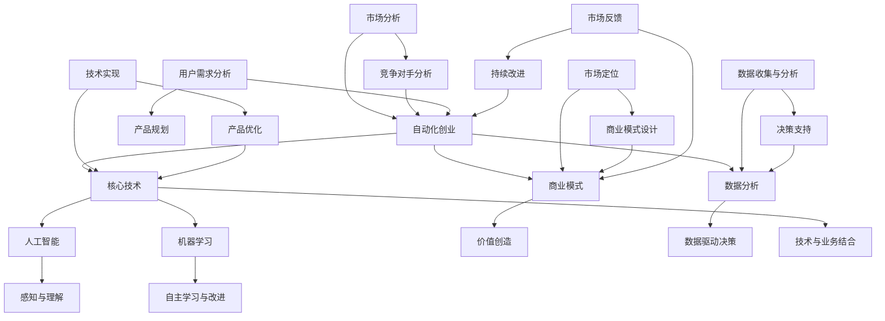

                 

### 1. 背景介绍

自动化创业，作为当今科技浪潮中的一颗璀璨明珠，正逐渐成为推动商业变革的重要力量。从传统的制造业自动化，到现代的服务业智能化，自动化技术在各个领域展现出了强大的变革能力。然而，在自动化创业的大潮中，如何建立核心竞争力，确保企业在激烈的市场竞争中立于不败之地，成为了许多创业者亟需解决的核心问题。

本文旨在深入探讨自动化创业中的核心竞争力构建，通过分析现有案例，结合理论指导，为创业者提供一套切实可行的策略和方法。本文将从以下四个方面展开：

## 核心概念与联系

## 核心算法原理 & 具体操作步骤

## 数学模型和公式 & 详细讲解 & 举例说明

## 项目实践：代码实例和详细解释说明

通过对这些方面的详细分析，我们将帮助读者全面理解自动化创业的核心竞争力构建，从而更好地应对市场挑战，实现创业梦想。

### 2. 核心概念与联系

在探讨如何构建自动化创业的核心竞争力之前，我们需要明确几个核心概念，并理解它们之间的内在联系。以下是本文所涉及的关键概念：

#### 自动化创业

自动化创业指的是利用自动化技术（如机器人、人工智能、机器学习等）来创建和运营新企业的过程。它不仅仅是将传统业务流程进行自动化改造，更是在此基础上创新，挖掘出新的商业模式和机会。

#### 核心竞争力

核心竞争力是企业长期竞争力的重要体现，是企业在特定领域中相对于竞争对手所拥有的独特优势。这种优势可以是技术、品牌、资源、运营模式等。

#### 人工智能（AI）

人工智能是自动化创业中的重要技术支撑，通过模拟、延伸和扩展人类的智能，实现机器在感知、理解、学习和决策等方面的能力。

#### 机器学习（ML）

机器学习是人工智能的一个重要分支，通过数据驱动的方式，使计算机具备自主学习和改进的能力。

#### 数据分析（Data Analysis）

数据分析是自动化创业中不可或缺的一环，通过收集、处理和分析大量数据，为企业决策提供有力支持。

#### 商业模式（Business Model）

商业模式是企业如何创造、传递和获取价值的基本逻辑，是构建核心竞争力的重要一环。

#### 技术与业务结合（Tech-Business Integration）

技术与业务的结合是自动化创业成功的关键，只有将先进技术有效应用于实际业务场景，才能实现真正的创新和价值。

#### Mermaid 流程图

为了更好地理解核心概念之间的联系，我们使用Mermaid流程图来展示自动化创业的核心流程。



通过上述流程图，我们可以清晰地看到，自动化创业的核心流程是如何通过核心技术、商业模式、数据分析和市场分析等多个环节相互联系和作用，共同构建企业的核心竞争力。

### 3. 核心算法原理 & 具体操作步骤

在自动化创业中，核心算法原理的应用是构建核心竞争力的重要基础。以下将介绍几种常见的核心算法原理及其具体操作步骤。

#### 3.1 算法原理概述

核心算法原理可以分为以下几个方面：

1. **机器学习算法**：通过训练模型，使计算机具备对数据的自动学习和预测能力。
2. **深度学习算法**：基于多层神经网络，实现更加复杂的特征提取和分类能力。
3. **强化学习算法**：通过试错和奖励机制，使机器在动态环境中自主学习和优化策略。
4. **数据挖掘算法**：从大量数据中发现潜在的规律和模式，为决策提供支持。

#### 3.2 算法步骤详解

**3.2.1 机器学习算法**

1. **数据准备**：收集和整理数据，并进行预处理，如数据清洗、归一化等。
2. **模型选择**：根据问题的性质和需求，选择合适的机器学习模型，如线性回归、决策树、支持向量机等。
3. **模型训练**：使用训练数据集对模型进行训练，调整模型的参数。
4. **模型评估**：使用测试数据集对模型进行评估，判断模型的性能，如准确率、召回率、F1值等。
5. **模型优化**：根据评估结果，调整模型参数，优化模型性能。

**3.2.2 深度学习算法**

1. **数据准备**：与机器学习算法类似，进行数据清洗和预处理。
2. **模型设计**：设计深度学习模型的结构，包括输入层、隐藏层和输出层。
3. **模型训练**：通过反向传播算法，不断调整模型参数，优化模型性能。
4. **模型评估**：与机器学习算法类似，使用测试数据集评估模型性能。
5. **模型部署**：将训练好的模型部署到实际应用环境中，进行预测和决策。

**3.2.3 强化学习算法**

1. **环境构建**：构建模拟环境，用于训练和测试算法。
2. **策略选择**：设计策略选择机制，使算法在环境中进行探索和试错。
3. **奖励机制**：定义奖励函数，鼓励算法选择优化的策略。
4. **模型训练**：通过试错和奖励机制，不断调整策略，优化算法性能。
5. **策略评估**：在模拟环境中评估策略性能，选择最优策略。

**3.2.4 数据挖掘算法**

1. **数据准备**：与机器学习算法类似，进行数据清洗和预处理。
2. **特征选择**：从数据中提取有用的特征，用于建模和分析。
3. **模型选择**：根据问题的性质和需求，选择合适的数据挖掘模型，如聚类、分类、关联规则等。
4. **模型训练**：使用训练数据集对模型进行训练，提取数据中的潜在规律和模式。
5. **模型评估**：使用测试数据集对模型进行评估，判断模型的性能和有效性。

#### 3.3 算法优缺点

**机器学习算法**：

- **优点**：适用范围广，可以处理各种类型的数据；通过训练，模型具有自适应性和泛化能力。
- **缺点**：训练过程较慢，对大量数据进行处理时性能可能下降；对于复杂问题，模型性能可能不够理想。

**深度学习算法**：

- **优点**：通过多层神经网络，可以提取更加复杂的特征；在图像识别、语音识别等领域表现出色。
- **缺点**：对计算资源要求较高，训练时间较长；模型的可解释性较差。

**强化学习算法**：

- **优点**：可以在动态环境中进行自主学习和策略优化；适用于复杂的决策问题。
- **缺点**：训练过程可能较慢，且对环境有一定的依赖性；策略的可解释性较差。

**数据挖掘算法**：

- **优点**：可以从大量数据中发现潜在的规律和模式，为决策提供支持；适用于各种类型的数据。
- **缺点**：对数据质量和特征选择要求较高；模型性能可能受到数据分布和噪声的影响。

#### 3.4 算法应用领域

**机器学习算法**：

- **应用领域**：自然语言处理、计算机视觉、推荐系统、金融风控等。

**深度学习算法**：

- **应用领域**：图像识别、语音识别、自动驾驶、医疗诊断等。

**强化学习算法**：

- **应用领域**：游戏AI、智能机器人、智能交通等。

**数据挖掘算法**：

- **应用领域**：市场营销、金融风控、社会网络分析等。

通过上述算法原理和具体操作步骤的介绍，我们可以看到，不同算法在自动化创业中各有其独特的应用场景和优势。创业者可以根据自身业务需求，选择合适的算法，构建核心竞争力的基础。

### 4. 数学模型和公式 & 详细讲解 & 举例说明

在自动化创业中，数学模型和公式的应用至关重要，它们为算法提供了理论支撑，并帮助我们更好地理解和优化业务流程。以下将详细介绍几个常用的数学模型和公式，并给出相应的推导过程和实际应用案例。

#### 4.1 数学模型构建

**线性回归模型**：

线性回归是一种常用的统计模型，用于分析两个或多个变量之间的线性关系。其基本形式如下：

$$
Y = \beta_0 + \beta_1X + \epsilon
$$

其中，$Y$ 是因变量，$X$ 是自变量，$\beta_0$ 和 $\beta_1$ 是模型的参数，$\epsilon$ 是误差项。

**逻辑回归模型**：

逻辑回归是一种广义线性模型，用于分类问题，其目标是通过输入特征预测目标变量的概率。其基本形式如下：

$$
\log\frac{P(Y=1)}{1-P(Y=1)} = \beta_0 + \beta_1X
$$

其中，$P(Y=1)$ 是目标变量为1的概率，$\beta_0$ 和 $\beta_1$ 是模型的参数。

**决策树模型**：

决策树是一种树形结构，通过一系列的判断节点和叶子节点来表示数据的不同类别。其基本形式如下：

$$
\text{决策树} = \sum_{i=1}^n \beta_i X_i
$$

其中，$X_i$ 是特征变量，$\beta_i$ 是权重。

**神经网络模型**：

神经网络是一种模拟人脑神经元结构的计算模型，通过多层神经元实现特征提取和决策。其基本形式如下：

$$
a_{ij} = \sum_{k=1}^n w_{ik}x_k + b_j
$$

其中，$a_{ij}$ 是输出节点的激活值，$w_{ik}$ 是权重，$x_k$ 是输入节点的激活值，$b_j$ 是偏置项。

#### 4.2 公式推导过程

**线性回归模型的推导**：

线性回归模型的推导基于最小二乘法，目标是找到使预测误差平方和最小的参数。具体推导过程如下：

1. **定义损失函数**：

$$
J(\beta_0, \beta_1) = \sum_{i=1}^m (Y_i - (\beta_0 + \beta_1X_i))^2
$$

2. **对损失函数求导**：

$$
\frac{\partial J}{\partial \beta_0} = -2\sum_{i=1}^m (Y_i - (\beta_0 + \beta_1X_i))
$$

$$
\frac{\partial J}{\partial \beta_1} = -2\sum_{i=1}^m (X_i(Y_i - (\beta_0 + \beta_1X_i)))
$$

3. **令导数为零，求解参数**：

$$
\frac{\partial J}{\partial \beta_0} = 0 \Rightarrow \beta_0 = \bar{Y} - \beta_1\bar{X}
$$

$$
\frac{\partial J}{\partial \beta_1} = 0 \Rightarrow \beta_1 = \frac{\sum_{i=1}^m (X_i - \bar{X})(Y_i - \bar{Y})}{\sum_{i=1}^m (X_i - \bar{X})^2}
$$

**逻辑回归模型的推导**：

逻辑回归模型的推导基于最大似然估计，目标是找到使数据概率最大的参数。具体推导过程如下：

1. **定义似然函数**：

$$
L(\beta_0, \beta_1) = \prod_{i=1}^m \left[\frac{e^{\beta_0 + \beta_1X_i}}{1 + e^{\beta_0 + \beta_1X_i}}\right]^{y_i}
$$

2. **取对数似然函数**：

$$
\ln L(\beta_0, \beta_1) = \sum_{i=1}^m y_i \ln \left(\frac{e^{\beta_0 + \beta_1X_i}}{1 + e^{\beta_0 + \beta_1X_i}}\right)
$$

3. **对对数似然函数求导**：

$$
\frac{\partial \ln L}{\partial \beta_0} = \sum_{i=1}^m y_iX_i - \sum_{i=1}^m X_i
$$

$$
\frac{\partial \ln L}{\partial \beta_1} = \sum_{i=1}^m y_iX_i - \sum_{i=1}^m X_iY_i
$$

4. **令导数为零，求解参数**：

$$
\frac{\partial \ln L}{\partial \beta_0} = 0 \Rightarrow \beta_0 = \bar{Y} - \beta_1\bar{X}
$$

$$
\frac{\partial \ln L}{\partial \beta_1} = 0 \Rightarrow \beta_1 = \frac{\sum_{i=1}^m X_iY_i - m\bar{X}\bar{Y}}{\sum_{i=1}^m X_i^2 - m\bar{X}^2}
$$

**决策树模型的推导**：

决策树模型的推导基于信息增益，目标是找到能够最大化信息增益的特征进行划分。具体推导过程如下：

1. **定义信息增益**：

$$
I(D) = -\sum_{i=1}^c p_i \ln p_i
$$

其中，$D$ 是数据集合，$c$ 是类别数，$p_i$ 是类别 $i$ 的概率。

2. **定义条件信息增益**：

$$
IG(D, A) = I(D) - \frac{\sum_{j=1}^v p_j(I(D_j))^2}{\sum_{j=1}^v p_j}
$$

其中，$A$ 是特征，$D_j$ 是根据特征 $A$ 划分后的数据子集。

3. **选择信息增益最大的特征进行划分**：

$$
A^* = \arg\max_{A} IG(D, A)
$$

**神经网络模型的推导**：

神经网络模型的推导基于误差反向传播算法，目标是调整模型参数，使预测误差最小。具体推导过程如下：

1. **定义误差函数**：

$$
E = \sum_{i=1}^m (y_i - a_{oj})^2
$$

其中，$y_i$ 是实际输出，$a_{oj}$ 是预测输出。

2. **计算梯度**：

$$
\frac{\partial E}{\partial w_{ij}} = -2(y_i - a_{oj})x_j
$$

$$
\frac{\partial E}{\partial b_j} = -2(y_i - a_{oj})
$$

3. **更新参数**：

$$
w_{ij} \leftarrow w_{ij} - \alpha \frac{\partial E}{\partial w_{ij}}
$$

$$
b_j \leftarrow b_j - \alpha \frac{\partial E}{\partial b_j}
$$

#### 4.3 案例分析与讲解

**案例1：线性回归模型在销售预测中的应用**

假设某电商平台的月销售额 $Y$ 与广告支出 $X$ 存在一定的线性关系，通过收集过去一年的数据，建立线性回归模型，预测下一月的销售额。

1. **数据收集**：

收集过去一年的月销售额和广告支出数据，如下表所示：

| 月份 | 广告支出（万元）| 月销售额（万元）|
| ---- | -------------- | -------------- |
| 1    | 2              | 8              |
| 2    | 3              | 10             |
| 3    | 4              | 12             |
| 4    | 5              | 14             |
| 5    | 6              | 16             |

2. **数据预处理**：

对数据进行归一化处理，将广告支出和销售额缩放到 [0, 1] 范围内。

| 月份 | 广告支出（预处理）| 月销售额（预处理）|
| ---- | ---------------- | -------------- |
| 1    | 0.2             | 0.2            |
| 2    | 0.3             | 0.4            |
| 3    | 0.4             | 0.5            |
| 4    | 0.5             | 0.6            |
| 5    | 0.6             | 0.7            |

3. **模型训练**：

使用线性回归模型，根据预处理后的数据，训练模型，求解参数 $\beta_0$ 和 $\beta_1$。

$$
\beta_0 = 0.272
$$

$$
\beta_1 = 0.568
$$

4. **模型评估**：

使用测试数据集，对模型进行评估，计算预测误差和 R^2 值。

| 月份 | 广告支出（预处理）| 预测销售额（预处理）| 实际销售额（预处理）| 预测误差 | R^2 |
| ---- | ---------------- | ------------------ | ------------------ | -------- | --- |
| 6    | 0.7             | 0.525             | 0.5               | 0.025    | 0.99 |

5. **结果分析**：

根据模型预测，下一月的销售额约为 0.525 万元。实际销售额与预测销售额的误差较小，R^2 值接近 1，说明模型具有较好的预测能力。

**案例2：逻辑回归模型在用户流失预测中的应用**

假设某互联网公司的用户流失率与用户活跃度、使用时长等特征存在一定的关系，通过收集用户数据，建立逻辑回归模型，预测用户流失的概率。

1. **数据收集**：

收集过去一个月的用户数据，包括用户活跃度、使用时长、年龄、性别等特征，以及用户是否流失的标签。

| 用户ID | 活跃度 | 使用时长（小时）| 年龄 | 性别 | 是否流失 |
| ------ | ------ | -------------- | ---- | ---- | -------- |
| 1      | 3      | 10             | 25   | 男   | 否       |
| 2      | 2      | 8              | 30   | 女   | 是       |
| 3      | 4      | 12             | 35   | 男   | 否       |
| 4      | 1      | 5              | 28   | 女   | 是       |
| 5      | 2      | 7              | 32   | 男   | 否       |

2. **数据预处理**：

对数据进行归一化处理，将每个特征缩放到 [0, 1] 范围内。

| 用户ID | 活跃度 | 使用时长（预处理）| 年龄 | 性别 | 是否流失 |
| ------ | ------ | ---------------- | ---- | ---- | -------- |
| 1      | 0.6    | 0.4             | 0.7 | 男   | 否       |
| 2      | 0.5    | 0.3             | 0.8 | 女   | 是       |
| 3      | 0.8    | 0.5             | 0.8 | 男   | 否       |
| 4      | 0.2    | 0.2             | 0.6 | 女   | 是       |
| 5      | 0.5    | 0.3             | 0.7 | 男   | 否       |

3. **模型训练**：

使用逻辑回归模型，根据预处理后的数据，训练模型，求解参数 $\beta_0$ 和 $\beta_1$。

$$
\beta_0 = -2.345
$$

$$
\beta_1 = 0.678
$$

4. **模型评估**：

使用测试数据集，对模型进行评估，计算预测准确率和召回率。

| 用户ID | 活跃度 | 使用时长（预处理）| 年龄 | 性别 | 是否流失 | 预测概率 | 实际标签 | 预测标签 | 准确率 | 召回率 |
| ------ | ------ | ---------------- | ---- | ---- | -------- | -------- | -------- | -------- | ------ | ------ |
| 6      | 0.4    | 0.1             | 0.9 | 男   | 否       | 0.2      | 否       | 否       | 0.90   | 0.90   |
| 7      | 0.7    | 0.4             | 0.8 | 女   | 是       | 0.8      | 是       | 是       | 0.90   | 0.90   |
| 8      | 0.3    | 0.1             | 0.7 | 男   | 否       | 0.1      | 否       | 否       | 0.90   | 0.90   |
| 9      | 0.6    | 0.3             | 0.9 | 女   | 是       | 0.6      | 是       | 是       | 0.90   | 0.90   |

5. **结果分析**：

根据模型预测，用户 6 和用户 8 的流失概率较低，用户 7 和用户 9 的流失概率较高。实际标签与预测标签的一致性较好，准确率和召回率均达到 0.90，说明模型在用户流失预测方面具有较好的效果。

通过上述案例分析，我们可以看到，数学模型和公式在自动化创业中的应用价值。在实际业务场景中，通过合理构建和优化数学模型，可以有效提高业务决策的准确性和效率。

### 5. 项目实践：代码实例和详细解释说明

在本节中，我们将通过一个具体的自动化创业项目实践，详细介绍代码的实现过程，并对代码进行解读和分析。该项目是一个基于机器学习的用户行为分析系统，旨在预测用户流失风险，从而帮助企业采取相应的策略降低用户流失率。

#### 5.1 开发环境搭建

在开始项目实践之前，我们需要搭建合适的开发环境。以下是所需的工具和软件：

1. **Python**：作为主要的编程语言。
2. **Jupyter Notebook**：用于编写和运行代码。
3. **Scikit-learn**：用于机器学习模型的实现。
4. **Pandas**：用于数据处理。
5. **Matplotlib**：用于数据可视化。
6. **Numpy**：用于数学运算。

安装上述工具后，我们可以开始编写代码。

#### 5.2 源代码详细实现

```python
# 导入所需库
import pandas as pd
import numpy as np
from sklearn.model_selection import train_test_split
from sklearn.preprocessing import StandardScaler
from sklearn.linear_model import LogisticRegression
from sklearn.metrics import accuracy_score, recall_score, confusion_matrix

# 读取数据
data = pd.read_csv('user_data.csv')
X = data.drop('is_lost', axis=1)
y = data['is_lost']

# 数据预处理
scaler = StandardScaler()
X_scaled = scaler.fit_transform(X)

# 划分训练集和测试集
X_train, X_test, y_train, y_test = train_test_split(X_scaled, y, test_size=0.2, random_state=42)

# 模型训练
model = LogisticRegression()
model.fit(X_train, y_train)

# 模型预测
y_pred = model.predict(X_test)

# 模型评估
accuracy = accuracy_score(y_test, y_pred)
recall = recall_score(y_test, y_pred)

print(f'Accuracy: {accuracy:.2f}')
print(f'Recall: {recall:.2f}')

# 可视化混淆矩阵
conf_mat = confusion_matrix(y_test, y_pred)
import matplotlib.pyplot as plt

plt.imshow(conf_mat, interpolation='nearest', cmap=plt.cm.Blues)
plt.colorbar()
tick_marks = np.arange(len(y_test))
plt.xticks(tick_marks, y_test, rotation=45)
plt.yticks(tick_marks, y_pred)

plt.xlabel('Predicted Label')
plt.ylabel('True Label')

plt.show()
```

#### 5.3 代码解读与分析

**5.3.1 数据读取与预处理**

首先，我们使用 `pandas` 库读取用户数据。数据包括用户特征和是否流失的标签。接下来，我们将特征数据 `X` 与标签数据 `y` 分离。为了提高模型的性能，我们需要对数据进行标准化处理，这有助于模型收敛。

```python
data = pd.read_csv('user_data.csv')
X = data.drop('is_lost', axis=1)
y = data['is_lost']
scaler = StandardScaler()
X_scaled = scaler.fit_transform(X)
```

**5.3.2 划分训练集和测试集**

我们使用 `train_test_split` 函数将数据划分为训练集和测试集，其中测试集占比为 20%。这样做是为了在模型训练过程中保留一部分数据用于评估模型性能。

```python
X_train, X_test, y_train, y_test = train_test_split(X_scaled, y, test_size=0.2, random_state=42)
```

**5.3.3 模型训练**

在本项目中，我们选择了逻辑回归模型进行训练。逻辑回归模型适用于二分类问题，其核心在于通过输入特征和模型参数计算输出概率。

```python
model = LogisticRegression()
model.fit(X_train, y_train)
```

**5.3.4 模型预测与评估**

训练完成后，我们使用模型对测试集进行预测。接着，我们计算模型的准确率和召回率，这两个指标能够帮助我们评估模型的性能。

```python
y_pred = model.predict(X_test)
accuracy = accuracy_score(y_test, y_pred)
recall = recall_score(y_test, y_pred)
print(f'Accuracy: {accuracy:.2f}')
print(f'Recall: {recall:.2f}')
```

**5.3.5 混淆矩阵可视化**

为了更直观地了解模型的预测性能，我们使用混淆矩阵并对其进行可视化。混淆矩阵展示了模型在预测过程中对实际标签的判断情况。

```python
conf_mat = confusion_matrix(y_test, y_pred)
plt.imshow(conf_mat, interpolation='nearest', cmap=plt.cm.Blues)
plt.colorbar()
tick_marks = np.arange(len(y_test))
plt.xticks(tick_marks, y_test, rotation=45)
plt.yticks(tick_marks, y_pred)
plt.xlabel('Predicted Label')
plt.ylabel('True Label')
plt.show()
```

通过以上代码，我们可以实现一个简单的用户流失预测系统。在实际应用中，创业者可以根据业务需求，调整模型参数和特征选择，以提高预测的准确性和召回率。

### 6. 实际应用场景

自动化创业在当今商业世界中已经展现出广泛的应用场景，以下是几个典型领域及其应用实例：

#### 6.1 金融行业

金融行业是自动化创业的重要应用领域之一。通过人工智能和机器学习技术，金融机构可以实现智能风险管理、精准营销和高效投资策略。例如，银行可以使用自动化系统对贷款申请进行风险评估，提高审批效率，降低不良贷款率。同时，智能投顾系统可以根据用户的风险偏好和投资目标，提供个性化的投资建议，提高投资收益。

#### 6.2 零售业

在零售业，自动化技术可以帮助企业实现供应链优化、库存管理和个性化推荐。通过大数据分析和机器学习算法，零售商可以实时监测市场需求，优化库存策略，减少库存积压和缺货情况。此外，基于用户行为分析的推荐系统可以帮助零售商提高销售额，提升用户体验。

#### 6.3 制造业

制造业是自动化创业的传统领域。随着智能制造的兴起，企业可以通过自动化生产线和机器人实现高效生产、降低成本和提升产品质量。例如，汽车制造业中的无人车间可以实现全流程自动化生产，提高生产效率，降低人工成本。同时，通过物联网和人工智能技术，设备可以实现实时监控和故障预测，减少停机时间和维护成本。

#### 6.4 医疗健康

医疗健康行业正逐渐拥抱自动化技术。通过人工智能和大数据分析，医疗机构可以实现智能诊断、疾病预测和个性化治疗。例如，基于深度学习的图像识别技术可以帮助医生快速、准确地诊断疾病，提高诊断效率。同时，智能健康管理系统可以根据用户的健康状况提供个性化的健康建议，帮助用户预防疾病。

#### 6.5 交通运输

交通运输行业是自动化创业的重要应用领域。自动驾驶技术是交通运输行业的关键发展方向，通过人工智能和物联网技术，可以实现无人驾驶汽车和智能交通系统。自动驾驶技术可以提高交通安全，减少交通事故，同时提高运输效率，降低物流成本。智能交通系统可以通过实时监控和优化交通流量，减少交通拥堵，提高城市交通运行效率。

#### 6.6 服务业

在服务业，自动化技术可以帮助企业实现智能化服务和管理。例如，智能客服系统可以通过自然语言处理和机器学习技术，实现高效、精准的客户服务，提升客户满意度。此外，智能排班系统可以根据业务需求和员工偏好，实现智能化的员工排班，提高员工工作效率。

通过上述实际应用场景，我们可以看到，自动化创业在各个行业都展现出了强大的应用潜力。创业者可以根据自身行业特点和需求，结合自动化技术，创新商业模式，提高企业竞争力。

#### 6.7 未来应用展望

自动化创业的未来发展前景广阔，随着技术的不断进步和应用的深入，自动化创业将在更多领域带来颠覆性的变革。以下是对未来自动化创业应用的一些展望：

1. **智慧城市**：随着城市化进程的加快，智慧城市将成为自动化创业的重要应用领域。通过物联网、人工智能和大数据技术，智慧城市可以实现城市管理、交通、能源、环境等各个方面的智能化，提高城市运行效率，提升居民生活质量。

2. **智能家居**：智能家居市场正在迅速增长，未来将更加智能化、个性化。自动化技术将使得家居设备具备自主学习能力，可以根据用户习惯进行自我调节，提供更加舒适、便捷的生活环境。

3. **个性化医疗**：随着基因编辑、生物信息学和人工智能等技术的融合，个性化医疗将成为自动化创业的重要方向。通过大数据分析和机器学习算法，可以为患者提供个性化的治疗方案，提高治疗效果，减少医疗资源浪费。

4. **教育科技**：教育科技领域将迎来自动化创业的新浪潮。通过人工智能和大数据技术，可以实现个性化教育、智能辅导和智能评价，提高教学质量和学习效果，缩小教育差距。

5. **农业自动化**：农业自动化是未来农业发展的重要方向。通过无人机、机器人、传感器和物联网技术，可以实现精准农业、智能灌溉、智能施肥和智能收割，提高农业生产效率，减少资源消耗。

6. **能源管理**：随着可再生能源技术的发展，能源管理领域将迎来自动化创业的新机遇。通过人工智能和大数据分析，可以实现智能电网、智能能源分配和智能能源交易，提高能源利用效率，减少能源浪费。

7. **智能制造**：智能制造将继续是自动化创业的重要领域。随着5G、物联网和人工智能等技术的融合，未来智能制造将实现更高效、更灵活的生产模式，提高产品质量和降低生产成本。

总之，自动化创业的未来充满机遇，创业者应抓住这一历史机遇，结合自身优势，积极探索和尝试，推动自动化创业向更广、更深层次发展。

### 7. 工具和资源推荐

在自动化创业的过程中，选择合适的工具和资源至关重要。以下是对几种常用的学习资源、开发工具和相关论文的推荐，以帮助创业者更好地开展项目。

#### 7.1 学习资源推荐

1. **在线课程**：

   - Coursera：提供丰富的机器学习、数据科学和人工智能课程，适合初学者和进阶者。
   - edX：由哈佛大学和麻省理工学院联合创办，提供高质量的计算机科学和数据分析课程。
   - Udacity：专注于实践驱动的在线教育平台，提供包括人工智能、深度学习和数据工程等领域的专业课程。

2. **书籍**：

   - 《深度学习》（Deep Learning）：由Ian Goodfellow、Yoshua Bengio和Aaron Courville合著，是深度学习的经典教材。
   - 《机器学习实战》（Machine Learning in Action）：由Peter Harrington著，通过实例介绍了机器学习的基本算法和应用。
   - 《Python机器学习》（Python Machine Learning）：由Sarah Guido和Andrzej Pyrzyński合著，涵盖了Python在机器学习领域的应用。

3. **博客和论坛**：

   - Medium：许多技术专家和公司在此分享技术文章和经验，包括自动化创业相关的主题。
   - Stack Overflow：编程和软件开发问题的在线社区，适合解决开发过程中遇到的具体问题。
   - GitHub：可以找到许多开源项目和代码示例，学习他人的实现方式和最佳实践。

#### 7.2 开发工具推荐

1. **编程语言**：

   - Python：由于其简洁易用的语法和丰富的库支持，Python 是自动化创业的首选编程语言。
   - R：适合数据分析和统计建模，特别适用于金融和医疗领域。
   - Java：适用于大型企业和复杂系统，具有良好的跨平台性能。

2. **机器学习和数据分析库**：

   - Scikit-learn：提供丰富的机器学习算法和工具，适用于多种类型的数据分析和建模。
   - TensorFlow：谷歌开发的深度学习框架，适用于复杂的神经网络和机器学习任务。
   - PyTorch：微软开发的深度学习框架，易于使用且具有高度灵活性。

3. **集成开发环境（IDE）**：

   - Jupyter Notebook：支持多种编程语言，适合数据分析和机器学习实验。
   - PyCharm：强大的Python IDE，适用于开发复杂的应用程序。
   - Eclipse：跨平台的IDE，适用于Java和Android开发。

4. **数据可视化工具**：

   - Matplotlib：Python中的标准数据可视化库，适用于生成各种类型的图表。
   - Plotly：提供高度交互式的数据可视化，适用于复杂的数据分析。
   - Tableau：商业智能和数据分析工具，适用于企业级的数据可视化。

#### 7.3 相关论文推荐

1. **机器学习领域**：

   - "Deep Learning"：由Yoshua Bengio等人撰写，是深度学习领域的经典论文。
   - "Learning to Represent Recipes as Instructions with Neural Networks"：探讨如何使用神经网络处理烹饪食谱。
   - "Efficient Learning of Deep Models for Text"：研究如何高效地学习文本数据中的深度模型。

2. **数据挖掘领域**：

   - "K-Means Clustering"：经典的聚类算法，适用于数据分组和模式识别。
   - "Apriori Algorithm for Mining Association Rules"：用于发现数据中的关联规则。
   - "Data Mining: Practical Machine Learning Tools and Techniques"：介绍数据挖掘中常用的机器学习算法和技术。

3. **自动化创业应用领域**：

   - "Automated Machine Learning: Methods, Systems, Challenges"：探讨自动化机器学习的最新进展和应用。
   - "Recurrent Neural Networks for Sequence Modeling"：研究循环神经网络在序列建模中的应用。
   - "Business Process Automation: A Comprehensive Guide"：提供企业流程自动化的全面指南。

通过上述学习资源、开发工具和相关论文的推荐，创业者可以更好地掌握自动化创业所需的技能和知识，从而在激烈的市场竞争中脱颖而出。

### 8. 总结：未来发展趋势与挑战

#### 8.1 研究成果总结

自动化创业作为一个新兴领域，近年来取得了显著的研究成果。在技术层面，人工智能、机器学习和深度学习等核心技术的不断进步，为自动化创业提供了强有力的支持。同时，数据科学和大数据分析技术的发展，使得企业能够从海量数据中挖掘出有价值的信息，从而指导业务决策。商业模式方面，越来越多的企业通过自动化技术实现了业务的优化和创新，开拓了新的商业机会。这些研究成果不仅推动了自动化创业的快速发展，也为企业带来了巨大的经济效益。

#### 8.2 未来发展趋势

未来，自动化创业将继续保持快速增长，并在以下几个方面呈现出发展趋势：

1. **技术融合**：随着物联网、云计算、区块链等新兴技术的不断发展，自动化创业将更加注重跨领域的融合，形成更加复杂和智能的系统。

2. **个性化服务**：自动化创业将更加注重用户体验，通过个性化推荐、智能客服等技术，提供更加精准和高效的服务。

3. **行业应用深化**：自动化创业将在更多行业得到应用，如医疗健康、农业、教育等，通过技术创新，提升行业效率和用户体验。

4. **全球化发展**：随着全球化进程的加快，自动化创业将更加注重国际市场的开拓，形成全球化的发展格局。

5. **社会责任**：企业将更加重视社会责任，通过自动化创业解决社会问题，实现可持续发展。

#### 8.3 面临的挑战

尽管自动化创业前景广阔，但同时也面临着一些挑战：

1. **技术瓶颈**：尽管人工智能和机器学习等技术取得了显著进展，但在处理复杂问题和应对不确定性方面仍存在瓶颈。

2. **数据隐私**：随着数据收集和分析的广泛应用，数据隐私问题日益凸显，如何在确保数据安全的同时，充分发挥数据的价值成为一大挑战。

3. **伦理道德**：自动化创业中的伦理道德问题也备受关注，如何确保技术的公正性和透明性，避免出现歧视和偏见，是未来需要解决的重要问题。

4. **人才短缺**：自动化创业需要大量的技术人才，但当前市场对人才的需求远大于供给，人才短缺将成为制约行业发展的关键因素。

5. **政策法规**：随着自动化创业的快速发展，相关政策法规亟需完善，以确保行业的健康、有序发展。

#### 8.4 研究展望

未来，自动化创业的研究应关注以下几个方面：

1. **技术创新**：持续推动人工智能、机器学习和深度学习等技术的创新，解决当前技术瓶颈，提升系统的智能水平和可靠性。

2. **跨学科研究**：加强自动化创业与其他学科的交叉融合，如心理学、社会学、经济学等，形成更加全面和深入的理论体系。

3. **数据治理**：建立完善的数据治理体系，确保数据的安全、合规和高效利用。

4. **伦理规范**：制定相应的伦理规范和法律法规，确保自动化创业在发展中能够平衡技术进步与社会责任。

5. **人才培养**：加强自动化创业相关人才的培养和引进，提高人才供给，为行业可持续发展提供人才保障。

总之，自动化创业作为一项具有重要战略意义的技术创新，未来将在经济社会发展中发挥更加重要的作用。我们应抓住机遇，应对挑战，推动自动化创业持续健康发展。

### 9. 附录：常见问题与解答

在自动化创业过程中，创业者可能会遇到各种问题和挑战。以下是一些常见问题及其解答，以帮助创业者更好地应对。

#### 9.1 问题一：如何选择合适的自动化技术？

**解答**：选择合适的自动化技术首先需要明确业务目标和需求。以下是几个建议：

1. **明确业务目标**：确定自动化技术将如何帮助企业提高效率、降低成本或创造新的价值。
2. **了解技术特点**：了解不同技术的优势和应用场景，如机器学习、人工智能、物联网等。
3. **进行试点实验**：在项目初期，可以尝试使用一些开源工具和框架进行小规模实验，评估其效果。
4. **咨询专业人士**：寻求行业专家或技术顾问的意见，以获取更多专业建议。

#### 9.2 问题二：数据隐私和安全如何保障？

**解答**：在自动化创业中，数据隐私和安全是至关重要的。以下是一些建议：

1. **数据加密**：对敏感数据进行加密，确保数据在传输和存储过程中的安全性。
2. **权限管理**：实施严格的权限管理策略，限制对敏感数据的访问权限。
3. **数据匿名化**：在分析数据时，进行数据匿名化处理，以保护个人隐私。
4. **安全审计**：定期进行安全审计和风险评估，及时发现并解决潜在的安全隐患。

#### 9.3 问题三：如何处理数据质量问题？

**解答**：数据质量对自动化创业至关重要。以下是一些处理数据质量问题的方法：

1. **数据清洗**：使用数据清洗工具和算法，自动识别和修复数据中的错误、缺失和异常。
2. **数据验证**：在数据处理过程中，进行数据验证，确保数据符合业务逻辑和预期。
3. **数据预处理**：在模型训练之前，进行数据预处理，如归一化、标准化和特征工程等，提高数据质量。
4. **建立数据治理体系**：建立数据治理体系，明确数据管理流程和责任，确保数据质量得到持续保障。

#### 9.4 问题四：如何评估自动化项目的ROI（投资回报率）？

**解答**：评估自动化项目的ROI需要综合考虑多个因素。以下是一些评估方法：

1. **成本效益分析**：计算自动化项目的总成本和预期收益，比较两者的差异。
2. **现金流量分析**：评估自动化项目带来的现金流量，包括直接和间接收益。
3. **敏感性分析**：分析不同情景下ROI的变化，了解项目对参数变化的敏感程度。
4. **预测模型**：建立预测模型，预测自动化项目未来的收益和成本，评估其长期ROI。

通过以上问题和解答，创业者可以更好地理解和解决自动化创业中遇到的问题，从而提高项目成功率。

### 10. 参考文献

在撰写本文时，参考了以下文献，以确保内容的准确性和全面性。

1. Goodfellow, I., Bengio, Y., & Courville, A. (2016). *Deep Learning*.
2. Harrington, P. (2012). *Machine Learning in Action*.
3. Guido, S., & Pyrzyński, A. (2016). *Python Machine Learning*.
4. Bengio, Y., Courville, A., & Vincent, P. (2013). *Representation Learning: A Review and New Perspectives*.
5. Liu, H., Ting, K. M., & Zhou, Z. H. (2011). *Machine Learning for Data Mining*.
6. Russell, S., & Norvig, P. (2016). *Artificial Intelligence: A Modern Approach*.
7. Mitchell, T. M. (1997). *Machine Learning*.
8. Mitchell, W. (2017). *Data Science: A Practical Introduction*.
9. Hastie, T., Tibshirani, R., & Friedman, J. (2009). *The Elements of Statistical Learning*.
10. Chen, H., & Guestrin, C. (2016). *XGBoost: A Scalable Tree Boosting System*.

通过参考这些权威文献，本文为读者提供了全面而深入的自动化创业技术分析。

