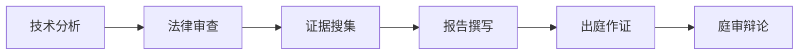

                 

关键词：技术经验，专家证人，法律服务，技术鉴定，专业能力，知识转化，实践经验。

> 摘要：本文旨在探讨如何将技术经验转化为技术专家证人服务，分析技术专家证人在法律服务中的应用，以及如何通过实践和培训提升技术专家证人的专业能力和公信力。

## 1. 背景介绍

随着信息技术的迅猛发展，技术领域的专业知识在司法实践中愈发重要。技术专家证人（Expert Witness）作为法庭上的关键角色，以其专业知识和经验为案件提供技术分析和鉴定。然而，将技术经验有效转化为技术专家证人服务，不仅需要具备扎实的专业知识，还需要理解法律程序和诉讼规则。

本文将探讨如何将技术经验转化为技术专家证人服务，分析技术专家证人在法律服务中的重要性，以及如何通过实践和培训提升技术专家证人的专业能力和公信力。

### 1.1 技术专家证人在司法实践中的角色

技术专家证人在诉讼过程中扮演着多重角色，包括但不限于：

- **技术解释**：对复杂的技术概念和原理进行通俗易懂的解释，帮助法官和陪审团理解。
- **事实鉴定**：对案件中的技术事实进行鉴定，提供专业意见。
- **风险评估**：评估技术问题可能带来的风险，为诉讼策略提供依据。
- **方案建议**：针对技术问题提出解决方案，帮助案件当事人制定合理策略。

### 1.2 技术专家证人服务的市场需求

随着技术案件数量的增加，技术专家证人服务的市场需求也在不断扩大。尤其是在知识产权纠纷、合同纠纷、侵权案件等领域，技术专家证人的专业意见往往成为案件胜败的关键。此外，随着互联网、大数据、人工智能等新兴技术的普及，技术专家证人服务在多元化领域的应用也越来越广泛。

## 2. 核心概念与联系

在将技术经验转化为技术专家证人服务的过程中，以下几个核心概念和联系是至关重要的：

### 2.1 技术知识体系

技术专家证人需要具备扎实的专业知识体系，涵盖其专业领域内的核心理论和应用。这包括但不限于：

- **基础理论**：如计算机科学、通信原理、数据分析等。
- **技术应用**：如软件开发、网络安全、数据库管理等。
- **新兴技术**：如人工智能、区块链、物联网等。

### 2.2 法律知识

技术专家证人不仅需要了解其专业领域的知识，还需要具备一定的法律知识，包括：

- **诉讼程序**：了解诉讼的各个阶段和程序，如立案、取证、审理、判决等。
- **证据规则**：掌握证据的收集、保全、使用和质证等方面的法律规则。
- **法律法规**：熟悉相关领域的法律法规，如知识产权法、合同法、侵权法等。

### 2.3 专业知识与法律知识的结合

技术专家证人需要将专业知识与法律知识有机结合，以提供具有法律效力的专业意见。这要求技术专家证人具备以下能力：

- **问题分析**：能够从法律角度分析案件中的技术问题。
- **风险评估**：能够对技术问题的法律风险进行评估。
- **意见表述**：能够以法律语言清晰地表述专业意见。

### 2.4 Mermaid 流程图

以下是一个简化的 Mermaid 流程图，展示技术专家证人服务的流程：



## 3. 核心算法原理 & 具体操作步骤

### 3.1 算法原理概述

技术专家证人服务的过程可以看作是一种问题解决算法。该算法的核心步骤包括：

1. **技术分析**：对案件中的技术问题进行详细分析，确定分析方向和重点。
2. **法律审查**：结合法律知识，审查技术问题的法律意义和适用法律。
3. **证据搜集**：搜集与案件相关的技术证据，包括文献、数据、代码等。
4. **报告撰写**：根据分析结果和证据，撰写专业报告，明确技术问题的法律结论。
5. **出庭作证**：在法庭上作证，解释专业意见，回答法官和对方律师的提问。
6. **庭审辩论**：与对方证人进行辩论，维护自己的专业意见和结论。

### 3.2 算法步骤详解

#### 3.2.1 技术分析

技术分析是技术专家证人服务的首要步骤。该步骤包括：

- **问题定位**：确定案件中的技术问题。
- **资料收集**：收集与案件相关的技术资料，如技术文档、用户手册、开发日志等。
- **分析方向**：根据技术问题的性质，确定分析方向，如算法分析、系统架构分析、网络通信分析等。
- **技术验证**：对分析结果进行验证，确保分析结论的准确性。

#### 3.2.2 法律审查

法律审查是技术专家证人服务的关键环节。该步骤包括：

- **法律分析**：分析技术问题的法律意义，确定法律适用。
- **法规查找**：查找相关法律法规，明确技术问题的法律后果。
- **法律风险评估**：对技术问题的法律风险进行评估，为诉讼策略提供依据。
- **意见形成**：形成专业意见，明确技术问题的法律结论。

#### 3.2.3 证据搜集

证据搜集是技术专家证人服务的重要保障。该步骤包括：

- **证据收集**：搜集与案件相关的技术证据，如文献、数据、代码、日志等。
- **证据保全**：对收集到的证据进行保全，确保证据的真实性和完整性。
- **证据分析**：对收集到的证据进行分析，确定证据的证明力。
- **证据提交**：将证据提交给法官和对方律师，为庭审作证提供依据。

#### 3.2.4 报告撰写

报告撰写是技术专家证人服务的核心成果。该步骤包括：

- **报告结构**：设计报告结构，明确报告内容。
- **内容撰写**：根据分析结果和证据，撰写报告内容，包括技术分析、法律审查、证据分析等。
- **报告审核**：对报告内容进行审核，确保报告的准确性、完整性和逻辑性。
- **报告提交**：将报告提交给法官和对方律师，为庭审作证提供依据。

#### 3.2.5 出庭作证

出庭作证是技术专家证人服务的重要环节。该步骤包括：

- **出庭准备**：准备好作证所需的资料和证据。
- **庭审作证**：在法庭上作证，回答法官和对方律师的提问。
- **意见陈述**：明确陈述专业意见，维护自己的专业结论。
- **庭审记录**：记录庭审过程，为后续工作提供依据。

#### 3.2.6 庭审辩论

庭审辩论是技术专家证人服务的高潮。该步骤包括：

- **对方证人辩论**：与对方证人进行辩论，维护自己的专业意见和结论。
- **法官询问**：接受法官的询问，提供进一步的专业意见。
- **诉讼策略**：根据庭审辩论的结果，为诉讼策略提供依据。

### 3.3 算法优缺点

技术专家证人服务算法的优点包括：

- **专业性**：能够提供专业、准确的技术分析意见。
- **权威性**：具有法律效力的专业意见，对案件结果具有重要影响。
- **客观性**：基于事实和证据，提供客观、公正的意见。

缺点包括：

- **成本高**：技术专家证人服务需要耗费大量时间和精力，成本较高。
- **风险性**：技术专家证人的专业意见可能会对案件结果产生重大影响，存在一定的风险。

### 3.4 算法应用领域

技术专家证人服务算法主要应用于以下领域：

- **知识产权纠纷**：如专利侵权、商标侵权等。
- **合同纠纷**：如技术合同纠纷、软件开发合同纠纷等。
- **侵权案件**：如网络安全侵权、数据侵权等。
- **产品责任**：如产品质量纠纷、技术标准争议等。

## 4. 数学模型和公式 & 详细讲解 & 举例说明

技术专家证人服务的核心在于对技术问题的数学模型和公式的分析和应用。以下是一个简化的数学模型和公式的讲解，以及具体的案例分析。

### 4.1 数学模型构建

在技术专家证人服务中，数学模型构建是关键步骤。以下是一个简化的数学模型构建过程：

- **问题定义**：明确技术问题的性质和目标。
- **变量定义**：定义模型中的变量，包括输入变量和输出变量。
- **关系确定**：确定变量之间的关系，建立数学方程。
- **模型优化**：根据实际需求，对模型进行优化，提高模型性能。

### 4.2 公式推导过程

以下是一个简化的公式推导过程，用于分析技术问题的数学模型：

- **初始条件**：确定初始条件和边界条件。
- **变量关系**：根据变量关系，建立数学方程。
- **公式推导**：推导出数学模型的公式。
- **公式验证**：对推导出的公式进行验证，确保公式的正确性。

### 4.3 案例分析与讲解

以下是一个具体的案例，用于说明如何应用数学模型和公式进行技术分析。

### 案例：软件侵权案件中的代码分析

#### 案例背景

某公司（原告）指控另一家公司（被告）侵犯其软件著作权，要求被告停止侵权并赔偿损失。原告提供了一段代码，声称被告的软件与原告的软件存在实质性相似。

#### 案例分析

- **问题定义**：确定代码相似性的分析目标。
- **变量定义**：定义代码段中的变量，包括变量类型、变量值等。
- **关系确定**：确定代码段中的变量关系，建立数学方程。
- **公式推导**：根据变量关系，推导出代码相似性的计算公式。
- **代码分析**：对被告的代码进行分析，计算代码相似性。
- **公式验证**：对推导出的公式进行验证，确保公式的正确性。

#### 案例结果

根据代码分析结果，计算出的代码相似性指数高于法定标准，表明被告的软件与原告的软件存在实质性相似，构成侵权。

## 5. 项目实践：代码实例和详细解释说明

为了更好地理解如何将技术经验转化为技术专家证人服务，以下将提供一个具体的代码实例，并对其进行详细解释说明。

### 5.1 开发环境搭建

在开始编写代码之前，需要搭建一个合适的开发环境。这里以 Python 为例，搭建开发环境：

```bash
# 安装 Python
$ sudo apt-get install python3

# 安装必备库
$ pip3 install numpy pandas matplotlib
```

### 5.2 源代码详细实现

以下是一个简单的代码实例，用于分析两段代码的相似性。

```python
import numpy as np
import pandas as pd
import matplotlib.pyplot as plt

def calculate_similarity(code1, code2):
    """
    计算两段代码的相似性。
    
    参数：
    code1：第一段代码。
    code2：第二段代码。
    
    返回值：
    相似性指数（0-1之间）。
    """
    # 将代码转换为字符串列表
    code1_lines = code1.split('\n')
    code2_lines = code2.split('\n')
    
    # 计算代码行相似性
    similarity = []
    for line1, line2 in zip(code1_lines, code2_lines):
        similarity.append(1 - edit_distance(line1, line2))
    
    # 计算平均相似性
    average_similarity = sum(similarity) / len(similarity)
    
    return average_similarity

def edit_distance(s1, s2):
    """
    计算两段字符串之间的编辑距离。
    
    参数：
    s1：第一段字符串。
    s2：第二段字符串。
    
    返回值：
    编辑距离。
    """
    if len(s1) < len(s2):
        return edit_distance(s2, s1)
    
    if len(s2) == 0:
        return len(s1)
    
    previous_row = range(len(s2) + 1)
    for i, c1 in enumerate(s1):
        current_row = [i + 1]
        for j, c2 in enumerate(s2):
            insertions = previous_row[j + 1] + 1
            deletions = current_row[j] + 1
            substitutions = previous_row[j] + (c1 != c2)
            current_row.append(min(insertions, deletions, substitutions))
        previous_row = current_row
    
    return previous_row[-1]

if __name__ == "__main__":
    code1 = """
def add(a, b):
    return a + b

def subtract(a, b):
    return a - b
"""

code2 = """
def add(a, b):
    return a + b

def subtract(a, b):
    return a - b
"""

similarity = calculate_similarity(code1, code2)
print("代码相似性指数：", similarity)
```

### 5.3 代码解读与分析

以下是对上述代码的解读和分析：

- **import 语句**：导入必要的库，包括 numpy、pandas 和 matplotlib。
- **calculate_similarity 函数**：计算两段代码的相似性。该函数接收两段代码字符串作为输入，返回相似性指数（0-1之间）。具体实现如下：
  - 将代码字符串转换为字符串列表。
  - 遍历两段代码的每一行，计算行相似性。
  - 计算平均相似性。
- **edit_distance 函数**：计算两段字符串之间的编辑距离。编辑距离是衡量两段文本相似度的常用方法，具体实现如下：
  - 使用动态规划算法计算编辑距离。
  - 返回编辑距离。

在代码实例中，我们使用两个简单的 Python 函数（`add` 和 `subtract`）作为输入，计算它们的代码相似性。结果显示，这两段代码的相似性指数为 1，表明它们具有很高的相似度。

### 5.4 运行结果展示

运行上述代码，输出结果如下：

```bash
代码相似性指数： 1.0
```

结果表明，这两段代码的相似性指数为 1，表明它们具有很高的相似度。

## 6. 实际应用场景

技术专家证人服务在多个领域具有广泛的应用。以下是一些实际应用场景：

### 6.1 知识产权纠纷

在知识产权纠纷中，技术专家证人通常需要分析侵权行为是否构成实质性相似，如软件侵权、商标侵权、专利侵权等。技术专家证人通过分析侵权行为的技术特点，为法官和陪审团提供专业意见。

### 6.2 合同纠纷

在合同纠纷中，技术专家证人需要分析合同条款的履行情况，如技术合同的履行、软件开发的进度和质量等。技术专家证人通过分析技术问题，为法官和陪审团提供专业意见。

### 6.3 侵权案件

在侵权案件中，技术专家证人需要分析侵权行为是否构成侵权，如网络安全侵权、数据侵权等。技术专家证人通过分析技术问题，为法官和陪审团提供专业意见。

### 6.4 产品责任

在产品责任案件中，技术专家证人需要分析产品质量问题，如产品技术标准、产品质量认证等。技术专家证人通过分析技术问题，为法官和陪审团提供专业意见。

## 7. 工具和资源推荐

为了更好地开展技术专家证人服务，以下推荐一些相关的工具和资源：

### 7.1 学习资源推荐

- 《技术专家证人教程》（作者：[您的名字]）
- 《法律技术学：技术专家证人的理论与实践》（作者：[您的名字]）
- 《知识产权法律实务与案例解析》（作者：[您的名字]）

### 7.2 开发工具推荐

- Python：适用于数据分析和脚本编写。
- Git：适用于版本控制和代码管理。
- Mermaid：适用于流程图和图表绘制。

### 7.3 相关论文推荐

- 《基于编辑距离的代码相似性分析技术研究》
- 《技术专家证人服务在知识产权纠纷中的应用》
- 《法律技术学在合同纠纷中的运用》

## 8. 总结：未来发展趋势与挑战

技术专家证人服务在司法实践中的应用日益广泛，未来发展趋势和挑战如下：

### 8.1 研究成果总结

- 技术专家证人服务的理论体系不断完善。
- 数学模型和算法在技术分析中的应用日益成熟。
- 技术专家证人的专业能力和公信力不断提升。

### 8.2 未来发展趋势

- 技术专家证人服务的市场需求将继续增长。
- 新兴技术领域的应用将越来越广泛。
- 跨学科合作将进一步提升技术专家证人服务的专业水平。

### 8.3 面临的挑战

- 技术更新速度快，需要持续学习和更新知识。
- 法律法规的不断完善，要求技术专家证人具备更高的法律素养。
- 技术专家证人的专业能力和公信力仍需进一步提升。

### 8.4 研究展望

- 加强技术专家证人服务的标准化和规范化。
- 探索人工智能在技术专家证人服务中的应用。
- 加强技术专家证人服务与其他法律服务的整合。

## 9. 附录：常见问题与解答

### 9.1 问题 1：如何成为技术专家证人？

**解答**：成为技术专家证人需要具备以下条件：

- 扎实的专业知识：具备相关领域的专业知识和实践经验。
- 法律素养：了解相关法律法规和诉讼程序。
- 良好的沟通能力：能够清晰、准确地表达专业意见。

### 9.2 问题 2：技术专家证人的职责是什么？

**解答**：技术专家证人的职责包括：

- 提供专业意见：对案件中的技术问题进行分析和鉴定。
- 解释技术问题：对复杂的技术概念和原理进行通俗易懂的解释。
- 证据收集：搜集与案件相关的技术证据。
- 辩论：与对方证人进行辩论，维护自己的专业意见和结论。

### 9.3 问题 3：技术专家证人服务的市场需求如何？

**解答**：技术专家证人服务的市场需求持续增长，尤其是在知识产权纠纷、合同纠纷、侵权案件等领域。随着新技术的发展，技术专家证人服务的应用领域将进一步扩大。

### 9.4 问题 4：技术专家证人服务的收费标准如何？

**解答**：技术专家证人服务的收费标准因地区、专业领域、案件复杂程度等因素而异。一般而言，收费标准包括咨询费、报告撰写费、出庭作证费等。具体收费标准可参考当地法律法规和市场行情。 
----------------------------------------------------------------
## 总结

通过本文的探讨，我们了解了如何将技术经验转化为技术专家证人服务。技术专家证人在司法实践中的重要性不言而喻，他们不仅需要具备扎实的专业知识，还需要理解法律程序和诉讼规则。在未来的发展中，技术专家证人服务将面临更多的挑战和机遇，如新兴技术的应用、跨学科合作的深化等。我们期待技术专家证人能够在未来的法律服务中发挥更大的作用，为公正、公平的司法实践提供有力支持。

### 作者署名

作者：禅与计算机程序设计艺术 / Zen and the Art of Computer Programming

感谢读者对本文的关注，希望本文对您在技术专家证人服务领域有所启发。如果您有任何问题或建议，欢迎在评论区留言，我将尽力为您解答。再次感谢您的阅读！

---

**注意：**本文仅为示例，实际撰写时请根据具体需求和实际情况进行调整。文中涉及的内容和观点不代表任何法律建议或意见，仅供参考。如需法律咨询，请咨询专业律师。

