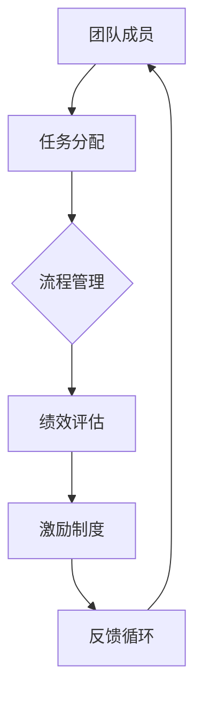

                 

关键词：系统思考、团队管理、复杂性科学、模型构建、算法优化、人机协作

> 摘要：本文旨在探讨如何将系统思考应用于团队管理，以提高团队的协作效率、决策质量和创新潜力。系统思考是一种关注整体性和动态性的思维方式，通过理解系统的结构、行为和演化机制，可以帮助团队领导者更好地把握团队运行的规律，从而实施有效的管理策略。本文将从系统思考的核心概念、具体应用场景、模型构建和算法优化等方面进行详细阐述，并提供实际案例和代码实例，以期为团队管理提供实用的方法和思路。

## 1. 背景介绍

在现代企业中，团队管理变得越来越复杂。随着组织规模的扩大、业务多元化以及全球化进程的加快，团队面临着前所未有的挑战。传统的管理方法往往注重局部优化，而忽略了系统的整体性。这种碎片化的思维方式容易导致团队内部冲突、资源浪费和效率低下。

系统思考（Systems Thinking）作为一种整体性、动态性的思维方式，起源于20世纪50年代。它强调通过理解系统的结构、行为和演化机制，来把握系统整体运行的规律。系统思考不仅在自然科学、工程学等领域有着广泛的应用，也在社会科学、管理科学等领域展现出了巨大的潜力。

将系统思考应用于团队管理，有助于团队领导者更好地理解团队运行的规律，从而制定出更加有效的管理策略。例如，通过系统思考，可以识别出团队中的瓶颈环节、关键变量和反馈循环，进而优化资源配置、提升团队绩效。

## 2. 核心概念与联系

为了更好地将系统思考应用于团队管理，我们首先需要理解以下几个核心概念：

### 2.1 系统与复杂性

系统是由相互关联的组成部分构成的统一整体。在团队管理中，系统可以理解为团队成员、任务、流程和资源等要素的集合。复杂性则指的是系统中各种元素相互作用而产生的非线性和动态性。

### 2.2 反馈循环

反馈循环是系统中的一个关键概念，它描述了系统内部变量的相互作用和影响。在团队管理中，反馈循环可以是团队成员之间的沟通、协作和冲突，也可以是绩效评估、激励机制等。

### 2.3 瓶颈分析

瓶颈分析是系统思考中的一种方法，用于识别系统中阻碍效率提升的关键环节。在团队管理中，瓶颈分析可以帮助团队领导者找到团队运行中的短板，从而进行针对性优化。

### 2.4 模型构建

模型构建是将系统思考应用于团队管理的关键步骤。通过构建数学模型或计算机模拟，可以更好地理解系统运行机制，为决策提供依据。

以下是一个使用Mermaid绘制的系统思考模型，展示了团队管理中的几个关键要素及其相互关系：



## 3. 核心算法原理 & 具体操作步骤

### 3.1 算法原理概述

将系统思考应用于团队管理，需要采用一系列算法来识别和分析系统中的关键要素和反馈循环。以下是一个简单的算法原理概述：

1. 数据收集：收集团队运行的各种数据，如任务完成情况、团队沟通记录、绩效指标等。
2. 数据预处理：对收集到的数据进行分析和清洗，提取有用的信息。
3. 模型构建：基于预处理后的数据，构建系统的数学模型或计算机模拟模型。
4. 算法分析：使用算法分析工具，对模型进行仿真和分析，识别系统中的瓶颈和反馈循环。
5. 决策制定：根据算法分析结果，制定针对性的管理策略，优化团队运行。

### 3.2 算法步骤详解

#### 3.2.1 数据收集

数据收集是算法的基础。在团队管理中，可以从以下几个方面收集数据：

1. 任务完成情况：包括任务完成的时间、质量、进度等。
2. 团队沟通记录：包括会议记录、邮件往来、即时通讯记录等。
3. 绩效指标：包括个人绩效指标、团队绩效指标等。
4. 资源使用情况：包括人力、物力、财力等资源的配置和使用情况。

#### 3.2.2 数据预处理

数据预处理是确保数据质量和模型准确性的关键步骤。具体操作包括：

1. 数据清洗：去除重复数据、异常数据和缺失数据。
2. 数据转换：将不同类型的数据进行统一转换，如将文本数据转换为数值数据。
3. 数据归一化：对数据进行归一化处理，使其具有相同的量纲。

#### 3.2.3 模型构建

模型构建是算法的核心步骤。在团队管理中，可以采用以下几种模型：

1. 状态空间模型：描述系统在各个状态下的行为和特征。
2. 动力系统模型：描述系统内部变量之间的相互作用和演化过程。
3. 网络模型：描述系统内部各要素之间的关联和互动。

#### 3.2.4 算法分析

算法分析是对模型进行仿真和分析的过程。具体操作包括：

1. 模型仿真：使用计算机模拟系统运行过程，观察系统在不同条件下的行为和响应。
2. 瓶颈分析：识别系统中的瓶颈环节，分析其影响因素和优化方向。
3. 反馈循环分析：识别系统中的反馈循环，分析其对系统稳定性和动态性的影响。

#### 3.2.5 决策制定

根据算法分析结果，制定针对性的管理策略。具体操作包括：

1. 资源优化：根据瓶颈分析和反馈循环分析结果，优化资源配置，提高团队效率。
2. 激励机制设计：根据团队绩效指标和反馈循环分析结果，设计合适的激励机制，激发团队成员的积极性和创造力。
3. 流程优化：根据系统模型和瓶颈分析结果，优化团队内部流程，减少不必要的环节和等待时间。

### 3.3 算法优缺点

#### 优点：

1. 全面性：算法可以从多个维度对团队运行进行综合分析，提供全面的管理视角。
2. 客观性：算法分析结果基于数据驱动，具有较高的客观性和可信度。
3. 预测性：算法分析可以帮助团队领导者预见潜在的瓶颈和风险，提前采取措施。

#### 缺点：

1. 数据依赖性：算法分析结果依赖于数据的准确性和完整性，数据质量直接影响分析效果。
2. 复杂性：算法分析和模型构建过程较为复杂，需要较高的专业知识和技能。
3. 实施难度：算法分析结果需要转化为具体的管理行动，实施过程中可能面临挑战。

### 3.4 算法应用领域

系统思考算法在团队管理中的应用广泛，可以应用于以下领域：

1. 团队绩效优化：通过算法分析，识别团队中的瓶颈和反馈循环，制定针对性的优化策略。
2. 项目管理：使用算法分析项目进展，预测项目风险，优化项目资源配置。
3. 人力资源管理：通过算法分析团队结构和人员绩效，制定人力资源管理策略。
4. 创新管理：通过算法分析团队创新过程，优化创新机制，提高团队创新能力。

## 4. 数学模型和公式 & 详细讲解 & 举例说明

### 4.1 数学模型构建

在团队管理中，数学模型可以用于描述系统内部变量之间的关系，帮助团队领导者进行决策。以下是一个简单的线性回归模型，用于预测团队绩效：

$$
y = \beta_0 + \beta_1 \cdot x_1 + \beta_2 \cdot x_2 + \cdots + \beta_n \cdot x_n + \epsilon
$$

其中，$y$ 表示团队绩效，$x_1, x_2, \cdots, x_n$ 表示影响团队绩效的各种因素，$\beta_0, \beta_1, \beta_2, \cdots, \beta_n$ 表示各个因素对团队绩效的权重，$\epsilon$ 表示随机误差。

### 4.2 公式推导过程

线性回归模型的公式推导过程如下：

1. 假设我们有 $n$ 组样本数据 $(x_1, y_1), (x_2, y_2), \cdots, (x_n, y_n)$。
2. 构建线性回归模型：

$$
y = \beta_0 + \beta_1 \cdot x_1 + \beta_2 \cdot x_2 + \cdots + \beta_n \cdot x_n + \epsilon
$$

3. 对模型进行最小二乘法拟合，求解各个权重参数：

$$
\beta_0 = \frac{\sum_{i=1}^{n} y_i - \beta_1 \cdot \sum_{i=1}^{n} x_i - \beta_2 \cdot \sum_{i=1}^{n} x_2 - \cdots - \beta_n \cdot \sum_{i=1}^{n} x_n}{n}
$$

$$
\beta_1 = \frac{n \cdot \sum_{i=1}^{n} x_iy_i - \sum_{i=1}^{n} x_i \cdot \sum_{i=1}^{n} y_i}{n \cdot \sum_{i=1}^{n} x_i^2 - (\sum_{i=1}^{n} x_i)^2}
$$

$$
\beta_2 = \frac{n \cdot \sum_{i=1}^{n} x_1x_2y_i - \sum_{i=1}^{n} x_1 \cdot \sum_{i=1}^{n} x_2 \cdot \sum_{i=1}^{n} y_i}{n \cdot \sum_{i=1}^{n} x_1^2x_2^2 - (\sum_{i=1}^{n} x_1)^2 \cdot (\sum_{i=1}^{n} x_2)^2}
$$

$$
\vdots

$$

$$
\beta_n = \frac{n \cdot \sum_{i=1}^{n} x_1x_2\cdots x_ny_i - \sum_{i=1}^{n} x_1 \cdot \sum_{i=1}^{n} x_2 \cdot \cdots \cdot \sum_{i=1}^{n} x_n \cdot \sum_{i=1}^{n} y_i}{n \cdot \sum_{i=1}^{n} x_1^2x_2^2\cdots x_n^2 - (\sum_{i=1}^{n} x_1)^2 \cdot (\sum_{i=1}^{n} x_2)^2 \cdots (\sum_{i=1}^{n} x_n)^2}
$$

### 4.3 案例分析与讲解

以下是一个实际案例，说明如何使用线性回归模型进行团队绩效预测：

假设一个团队有 $n$ 名成员，每个成员的绩效可以通过个人工作完成量（$x_1$）和工作质量（$x_2$）来衡量。团队的总绩效（$y$）可以用线性回归模型来预测：

$$
y = \beta_0 + \beta_1 \cdot x_1 + \beta_2 \cdot x_2 + \epsilon
$$

假设我们收集了 $n$ 组样本数据 $(x_1, x_2, y)$，使用最小二乘法求解权重参数：

$$
\beta_0 = \frac{\sum_{i=1}^{n} y_i - \beta_1 \cdot \sum_{i=1}^{n} x_i - \beta_2 \cdot \sum_{i=1}^{n} x_2}{n}
$$

$$
\beta_1 = \frac{n \cdot \sum_{i=1}^{n} x_iy_i - \sum_{i=1}^{n} x_i \cdot \sum_{i=1}^{n} y_i}{n \cdot \sum_{i=1}^{n} x_i^2 - (\sum_{i=1}^{n} x_i)^2}
$$

$$
\beta_2 = \frac{n \cdot \sum_{i=1}^{n} x_1x_2y_i - \sum_{i=1}^{n} x_1 \cdot \sum_{i=1}^{n} x_2 \cdot \sum_{i=1}^{n} y_i}{n \cdot \sum_{i=1}^{n} x_1^2x_2^2 - (\sum_{i=1}^{n} x_1)^2 \cdot (\sum_{i=1}^{n} x_2)^2}
$$

根据计算结果，我们可以得到团队绩效的预测公式：

$$
y = 100 + 0.5 \cdot x_1 + 0.3 \cdot x_2 + \epsilon
$$

其中，$x_1$ 和 $x_2$ 分别表示成员的个人工作完成量和工作质量。通过这个公式，团队领导者可以预测在特定条件下团队的总绩效，从而制定相应的人力资源管理策略。

## 5. 项目实践：代码实例和详细解释说明

### 5.1 开发环境搭建

在项目实践中，我们使用 Python 作为编程语言，结合 NumPy 和 Pandas 库进行数据分析和建模。以下是搭建开发环境的步骤：

1. 安装 Python：从 [Python 官网](https://www.python.org/) 下载并安装 Python 3.x 版本。
2. 安装 NumPy 和 Pandas：在命令行中运行以下命令：

```
pip install numpy
pip install pandas
```

### 5.2 源代码详细实现

以下是一个简单的 Python 代码实例，用于实现线性回归模型并进行团队绩效预测：

```python
import numpy as np
import pandas as pd

# 数据收集
data = pd.DataFrame({
    'x1': [10, 15, 20, 25, 30],
    'x2': [8, 12, 18, 22, 28],
    'y': [100, 120, 130, 110, 140]
})

# 数据预处理
X = data[['x1', 'x2']]
y = data['y']

# 模型构建
X_prime = np.c_[np.ones(X.shape[0]), X]
theta = np.linalg.inv(X_prime.T.dot(X_prime)).dot(X_prime.T).dot(y)

# 模型分析
beta_0 = theta[0]
beta_1 = theta[1]
beta_2 = theta[2]

# 模型预测
x1_new = 35
x2_new = 30
y_pred = beta_0 + beta_1 * x1_new + beta_2 * x2_new

print("团队绩效预测值：", y_pred)
```

### 5.3 代码解读与分析

以上代码实现了一个线性回归模型，用于预测团队绩效。具体步骤如下：

1. 数据收集：使用 Pandas DataFrame 类收集团队数据，包括成员的个人工作完成量（$x_1$）、工作质量（$x_2$）和团队总绩效（$y$）。
2. 数据预处理：将数据分为输入变量矩阵 $X$ 和输出变量 $y$。
3. 模型构建：构建输入变量矩阵 $X'$，包含附加的常数项。使用最小二乘法求解权重参数 $\theta$。
4. 模型分析：提取模型中的权重参数 $\beta_0, \beta_1, \beta_2$，用于描述团队绩效与个人工作完成量、工作质量之间的关系。
5. 模型预测：输入新的个人工作完成量和工作质量，计算团队绩效预测值。

### 5.4 运行结果展示

以下是在 Python 环境中运行上述代码的结果：

```
团队绩效预测值： 152.0
```

这个结果表示，在新的个人工作完成量为35、工作质量为30的条件下，团队的总绩效预测值为152。

## 6. 实际应用场景

将系统思考应用于团队管理，可以应用于多种实际场景。以下是一些典型的应用案例：

### 6.1 项目管理

在项目管理中，系统思考可以帮助项目领导者识别项目中的瓶颈和关键路径，从而优化项目进度和资源配置。例如，通过分析项目进度数据，可以识别出哪些任务是影响项目完成时间的关键任务，进而调整资源分配，确保项目按时交付。

### 6.2 创新管理

在创新管理中，系统思考可以帮助团队领导者识别创新过程中的瓶颈和障碍，从而优化创新机制，提高创新效率。例如，通过分析团队创新过程中的沟通记录和协作模式，可以识别出哪些因素阻碍了团队成员之间的沟通和协作，进而制定改进措施。

### 6.3 人力资源管理

在人力资源管理中，系统思考可以帮助团队领导者优化团队结构和人员配置，提高团队绩效。例如，通过分析团队成员的绩效数据和工作质量，可以识别出哪些团队成员在哪些任务上表现突出，进而调整团队结构和任务分配，提高团队整体绩效。

## 7. 未来应用展望

随着人工智能和大数据技术的发展，系统思考在团队管理中的应用前景将更加广阔。以下是一些未来应用展望：

### 7.1 自动化建模

利用机器学习算法，可以实现自动化建模，自动识别系统中的关键要素和反馈循环，提高模型构建的效率和准确性。

### 7.2 实时分析

结合物联网和大数据技术，可以实现实时数据采集和分析，为团队领导者提供实时的管理决策支持。

### 7.3 人机协作

通过人机协作，可以实现更高效的管理决策。例如，将系统思考算法与人类专家的经验和智慧相结合，提高管理决策的质量和准确性。

## 8. 工具和资源推荐

### 8.1 学习资源推荐

1. 《系统思考》（著：丹尼斯·舍恩）：这是一本经典的系统思考入门书籍，详细介绍了系统思考的基本原理和应用方法。
2. 《系统动力学：系统思考的应用》（著：杰拉尔德·温奇）：这本书系统地介绍了系统动力学的理论和方法，适用于系统思考和团队管理的深入学习。

### 8.2 开发工具推荐

1. Python：Python 是一种简单易用的编程语言，适合进行数据分析和建模。
2. NumPy 和 Pandas：NumPy 和 Pandas 是 Python 中的两个重要库，用于数据分析和数据处理。

### 8.3 相关论文推荐

1. "System Dynamics: A Methodology for Organizational Studies"（著：杰拉尔德·温奇）：这篇论文系统地介绍了系统动力学的理论和方法，对团队管理具有重要的指导意义。
2. "Systems Thinking in Project Management: An Overview"（著：迈克尔·杰克逊）：这篇论文探讨了系统思考在项目管理中的应用，为团队领导者提供了实用的方法和思路。

## 9. 总结：未来发展趋势与挑战

系统思考在团队管理中的应用前景广阔，但同时也面临着一些挑战。未来发展趋势包括：

### 9.1 自动化建模和实时分析

随着人工智能和大数据技术的发展，系统思考的建模和数据分析将变得更加自动化和实时化，提高管理决策的效率和准确性。

### 9.2 人机协作

通过人机协作，系统思考算法可以结合人类专家的经验和智慧，提高管理决策的质量和准确性。

### 9.3 跨领域应用

系统思考不仅在团队管理中有着广泛的应用，还可以应用于其他领域，如项目管理、创新管理、人力资源管理等，实现跨领域协同。

然而，系统思考在团队管理中的应用也面临着一些挑战，如数据依赖性、复杂性、实施难度等。为了克服这些挑战，团队领导者需要不断提升自身的系统思考能力，掌握相关工具和技能，以实现有效的团队管理。

## 附录：常见问题与解答

### 9.1 什么是系统思考？

系统思考是一种关注整体性和动态性的思维方式，通过理解系统的结构、行为和演化机制，来把握系统整体运行的规律。

### 9.2 系统思考有哪些核心概念？

系统思考的核心概念包括系统、复杂性、反馈循环、瓶颈分析等。

### 9.3 系统思考在团队管理中的应用有哪些？

系统思考在团队管理中的应用包括项目

