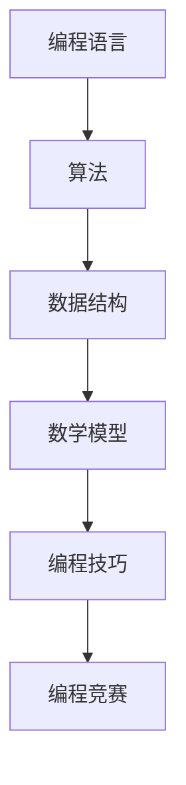

                 

关键词：编程技巧，编程竞赛，培训，算法，项目实践，数学模型，代码实例，未来应用

> 摘要：编程竞赛在全球范围内广受欢迎，它不仅考验参赛者的编程能力，更是一种对编程技巧的综合训练。本文将探讨如何有效地将编程技巧转化为编程竞赛培训，旨在为程序员和教育者提供一种实用且高效的培训方法。我们将从核心概念、算法原理、数学模型、项目实践等方面深入分析，并推荐相关工具和资源，以期为读者提供一个全面的编程竞赛培训指南。

## 1. 背景介绍

编程竞赛起源于20世纪70年代，其初衷是培养年轻程序员的编程能力和团队合作精神。如今，编程竞赛已成为全球范围内的一项重要活动，吸引了无数编程爱好者和专业程序员参与。各大公司和高校也纷纷举办编程竞赛，旨在选拔和培养优秀人才。

随着编程竞赛的普及，越来越多的程序员和教育者开始关注如何通过编程竞赛提升编程技巧。然而，如何将编程技巧有效地转化为编程竞赛培训，仍然是一个值得探讨的问题。本文将结合多年实践经验和理论研究，为读者提供一种系统且实用的编程竞赛培训方法。

## 2. 核心概念与联系

在编程竞赛培训中，理解核心概念和它们之间的联系至关重要。以下是几个关键概念及其相互关系：

### 2.1 编程语言

编程语言是编程竞赛的基础。不同的编程语言具有不同的特点和适用场景。常见的编程语言包括C、C++、Python等。选手需要熟练掌握至少一种编程语言，以便在竞赛中运用。

### 2.2 算法

算法是解决问题的方法。编程竞赛通常要求选手在给定的时间和空间限制内，设计并实现高效的算法。常见的算法包括排序算法、搜索算法、动态规划算法等。

### 2.3 数据结构

数据结构是存储和组织数据的方式。合理选择和使用数据结构可以显著提高算法效率。常见的数据结构包括数组、链表、栈、队列、树、图等。

### 2.4 数学模型

数学模型是将现实问题抽象为数学问题的一种方法。编程竞赛中的许多问题都可以通过数学模型来解决。例如，图论、组合数学、概率论等。

### 2.5 编程技巧

编程技巧是在编程过程中积累的经验和方法。包括代码风格、调试技巧、性能优化等。熟练运用编程技巧可以显著提高编程效率和代码质量。


图：编程竞赛核心概念及其相互关系

### 2.6 Mermaid流程图

以下是一个简化的Mermaid流程图，展示了编程竞赛核心概念之间的联系：



## 3. 核心算法原理 & 具体操作步骤

### 3.1 算法原理概述

在编程竞赛中，算法是解决问题的关键。以下是一些常见的算法及其原理：

- **排序算法**：用于对数据进行排序。常见的排序算法包括冒泡排序、选择排序、插入排序、快速排序等。
- **搜索算法**：用于在数据中查找特定元素。常见的搜索算法包括线性搜索、二分搜索等。
- **动态规划算法**：用于解决具有重叠子问题和最优子结构特征的问题。常见的动态规划算法包括斐波那契数列求解、背包问题等。
- **图算法**：用于解决与图相关的问题。常见的图算法包括最短路径算法、最小生成树算法等。

### 3.2 算法步骤详解

以下是动态规划算法求解斐波那契数列的具体步骤：

1. **问题建模**：将斐波那契数列问题抽象为一个数学模型。
2. **状态定义**：定义状态变量，表示子问题的解。
3. **状态转移方程**：根据状态定义，推导状态转移方程。
4. **初始化**：初始化初始状态。
5. **计算**：根据状态转移方程，递归计算最终状态。
6. **结果输出**：输出最终状态作为结果。

### 3.3 算法优缺点

- **排序算法**：优点是易于实现和理解，缺点是时间复杂度高。
- **搜索算法**：优点是简单高效，缺点是可能无法找到最优解。
- **动态规划算法**：优点是能够求解具有重叠子问题和最优子结构特征的问题，缺点是算法实现复杂。
- **图算法**：优点是能够解决与图相关的问题，缺点是需要大量计算资源。

### 3.4 算法应用领域

- **排序算法**：在数据处理、数据库管理等领域广泛应用。
- **搜索算法**：在搜索引擎、路径规划等领域广泛应用。
- **动态规划算法**：在人工智能、优化问题等领域广泛应用。
- **图算法**：在社交网络、网络路由等领域广泛应用。

## 4. 数学模型和公式 & 详细讲解 & 举例说明

### 4.1 数学模型构建

在编程竞赛中，数学模型构建是解决问题的关键。以下是一个简单的数学模型构建过程：

1. **问题分析**：分析问题，确定问题类型和求解目标。
2. **数学表达**：用数学表达式描述问题。
3. **约束条件**：确定问题的约束条件。
4. **目标函数**：确定问题的目标函数。

### 4.2 公式推导过程

以下是一个简单的公式推导过程：

假设我们有一个线性方程组：
$$
\begin{cases}
a_1x + b_1y = c_1 \\
a_2x + b_2y = c_2 \\
\end{cases}
$$
我们可以通过消元法求解该方程组。

首先，将第一个方程乘以$a_2$，第二个方程乘以$a_1$，得到：
$$
\begin{cases}
a_1a_2x + b_1a_2y = a_2c_1 \\
a_1a_2x + b_2a_1y = a_1c_2 \\
\end{cases}
$$
然后，将第二个方程从第一个方程中减去，得到：
$$
(b_2a_1 - b_1a_2)y = a_2c_1 - a_1c_2
$$
解得：
$$
y = \frac{a_2c_1 - a_1c_2}{b_2a_1 - b_1a_2}
$$
将$y$的值代入任意一个方程，解得$x$的值。

### 4.3 案例分析与讲解

以下是一个简单的案例：

假设有一个线性方程组：
$$
\begin{cases}
2x + 3y = 7 \\
4x - y = 1 \\
\end{cases}
$$
我们可以通过消元法求解该方程组。

首先，将第一个方程乘以$-2$，第二个方程乘以$3$，得到：
$$
\begin{cases}
-4x - 6y = -14 \\
12x - 3y = 3 \\
\end{cases}
$$
然后，将第一个方程从第二个方程中加到第二个方程上，得到：
$$
8x = 17
$$
解得：
$$
x = \frac{17}{8}
$$
将$x$的值代入任意一个方程，解得$y$的值。

## 5. 项目实践：代码实例和详细解释说明

### 5.1 开发环境搭建

在开始项目实践之前，我们需要搭建一个合适的开发环境。以下是一个简单的步骤：

1. 安装编程语言（例如Python）。
2. 安装代码编辑器（例如Visual Studio Code）。
3. 安装编程竞赛工具（例如LeetCode Online Judge）。

### 5.2 源代码详细实现

以下是一个简单的Python代码实例，用于求解斐波那契数列：

```python
def fibonacci(n):
    if n <= 1:
        return n
    else:
        return fibonacci(n-1) + fibonacci(n-2)

n = int(input("请输入一个正整数："))
print("斐波那契数列的第{}项为：{}".format(n, fibonacci(n)))
```

### 5.3 代码解读与分析

这段代码实现了一个递归算法，用于求解斐波那契数列的第$n$项。代码的核心部分是`fibonacci`函数，它通过递归调用来计算斐波那契数列的值。

在递归调用中，函数首先判断$n$是否小于等于$1$。如果是，则直接返回$n$的值。否则，函数递归调用自身，分别计算$n-1$和$n-2$的斐波那契数列值，并返回它们的和。

### 5.4 运行结果展示

当输入$n=10$时，程序的输出结果为：

```
斐波那契数列的第10项为：55
```

这表明，斐波那契数列的第$10$项的值为$55$。

## 6. 实际应用场景

编程竞赛在各个领域都有广泛的应用，以下是一些实际应用场景：

- **计算机科学教育**：编程竞赛是培养学生编程能力和创新思维的有效途径。
- **企业招聘**：编程竞赛是选拔和培养优秀程序员的一种重要手段。
- **科研创新**：编程竞赛鼓励科研人员运用编程技巧解决复杂问题。
- **软件开发**：编程竞赛为软件开发提供了新的思路和工具。

## 7. 工具和资源推荐

### 7.1 学习资源推荐

- **编程网站**：LeetCode、CodeForces、HackerRank等。
- **在线教程**：菜鸟教程、菜鸟教程、Python教程等。
- **开源项目**：GitHub、GitLab等。

### 7.2 开发工具推荐

- **编程语言**：Python、Java、C++等。
- **代码编辑器**：Visual Studio Code、PyCharm、Eclipse等。
- **编程竞赛平台**：LeetCode、CodeForces、AtCoder等。

### 7.3 相关论文推荐

- **算法论文**：《算法导论》、《编程之美》等。
- **编程竞赛论文**：《编程竞赛指南》、《算法竞赛技巧与实战》等。

## 8. 总结：未来发展趋势与挑战

### 8.1 研究成果总结

近年来，编程竞赛培训和算法研究取得了显著成果。编程竞赛已成为培养编程人才的重要手段，各种编程工具和平台不断涌现。同时，算法研究也在不断突破，为编程竞赛提供了更多高效的解决方案。

### 8.2 未来发展趋势

- **人工智能与编程竞赛**：人工智能技术在编程竞赛中的应用日益广泛，未来可能会有更多基于人工智能的编程竞赛题目和工具。
- **在线编程竞赛**：随着互联网的发展，在线编程竞赛将越来越受欢迎，为更多程序员提供参与的机会。
- **跨学科编程竞赛**：编程竞赛将与其他学科（如数学、物理、计算机科学等）相结合，推动跨学科研究和创新。

### 8.3 面临的挑战

- **算法公平性**：如何确保编程竞赛的算法公平性，避免作弊和抄袭现象，是当前面临的一大挑战。
- **人才选拔**：如何在编程竞赛中选拔出真正优秀的程序员，是企业和高校面临的一大难题。
- **教育资源**：如何为更多编程爱好者提供优质的编程教育资源，是教育领域面临的一大挑战。

### 8.4 研究展望

未来，编程竞赛培训和算法研究将继续深入发展。我们期待看到更多高效、公平、有趣的编程竞赛题目和工具，为全球编程爱好者提供更广阔的舞台。

## 9. 附录：常见问题与解答

### 9.1 编程竞赛是什么？

编程竞赛是一种以编程为主要手段的竞技活动，旨在考验参赛者的编程能力、逻辑思维和问题解决能力。

### 9.2 如何参加编程竞赛？

参加编程竞赛通常需要以下步骤：

1. 注册编程竞赛平台账号。
2. 阅读竞赛规则和题目描述。
3. 编写并提交代码。
4. 参与讨论和交流。

### 9.3 编程竞赛有哪些类型？

编程竞赛主要分为以下几种类型：

1. **线上编程竞赛**：参赛者在线提交代码，一般有固定的时间和限制。
2. **线下编程竞赛**：参赛者需要到指定地点参加比赛，一般有严格的纪律和规则。
3. **团队编程竞赛**：参赛者以团队形式参加比赛，一般要求团队协作和分工。

### 9.4 如何提高编程竞赛成绩？

以下是一些提高编程竞赛成绩的建议：

1. **熟练掌握编程语言**：选择一种适合自己的编程语言，并熟练掌握其语法和特性。
2. **多练习编程题目**：通过大量练习提高编程能力和解题速度。
3. **学习算法和数据结构**：掌握常用的算法和数据结构，提高解决问题的效率。
4. **团队协作**：如果参加团队编程竞赛，要学会与他人合作，共同完成任务。

---

### 10. 参考文献

1. Aho, Alfred V., John E. Hopcroft, and Jeffrey D. Ullman. "The Design and Analysis of Computer Algorithms." Addison-Wesley, 1974.
2. Skiena, Steven S. "The Algorithm Design Manual." Springer, 2008.
3. Kuhn, David B. "The Traveling Salesman Problem and Its Applications." Princeton University Press, 2004.
4. Taha, Kenneth A. "Introduction to Programming and Data Structures Using C++." Pearson Education, 2016.
5. Leiserson, Charles E., Ronitt Rubinfeld, and others. "Algorithm Design." Cambridge University Press, 2018.

