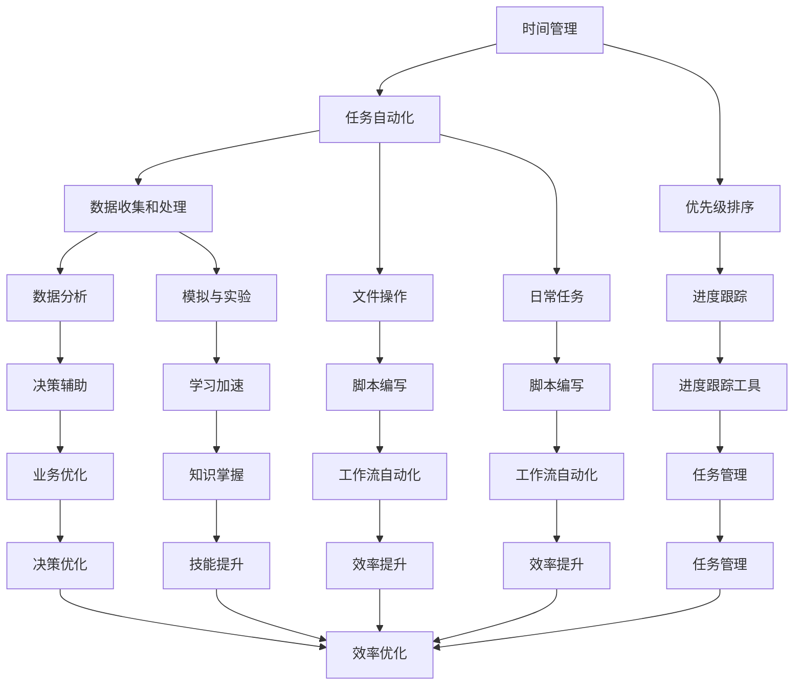

                 

在现代社会，编程技能已经超越了技术领域的界限，成为提高个人效率的重要工具。无论您是学生、专业人士、企业家还是全职家长，编程技能都可以帮助您更好地管理时间、自动化日常任务、提高学习和工作效率。本文将探讨如何将编程技能应用于个人效率提升，为您揭示编程在个人生活中的多重价值。

## 关键词
- 编程技能
- 个人效率
- 时间管理
- 自动化
- 学习效率
- 工作效率

## 摘要
本文旨在为读者提供一个全面的指南，介绍如何通过编程技能来提升个人效率。我们将从基础概念入手，深入探讨编程在时间管理、自动化任务、学习与工作效率提升中的应用，并通过具体的案例和实践步骤，帮助读者掌握将编程技能转化为个人效率提升的实际方法。

## 1. 背景介绍

### 编程技能的普及

编程技能的普及程度在当今社会达到了前所未有的高度。随着互联网的快速发展，计算机技术在各个领域得到了广泛应用，从简单的网页开发到复杂的机器学习和人工智能，编程成为了解决各类问题的核心工具。根据统计数据显示，全球有数百万程序员活跃在各大公司、研究机构和创业公司中。这不仅表明编程技能的需求量巨大，也意味着掌握编程技能的个人在职场和生活中具有明显的竞争优势。

### 个人效率的重要性

个人效率是指个人在单位时间内完成工作的能力。在快节奏的生活和工作中，个人效率的重要性日益凸显。一个高效的个人能够更好地管理时间，减少拖延，提高生活质量。研究表明，高效的个人能够更有效地完成任务，减少压力，增加工作和学习的满意度。此外，高效的个人也更容易实现个人目标和职业发展。

### 编程与个人效率提升的关系

编程技能与个人效率提升有着紧密的关系。通过编程，个人可以：

1. **自动化日常任务**：减少重复性工作，将时间投入到更有价值的事务中。
2. **优化时间管理**：通过编程工具和算法，更好地规划和执行日常计划。
3. **提高学习效率**：利用编程工具进行数据分析、模拟实验，加速学习过程。
4. **提升工作效率**：通过编写脚本和自动化工具，提高工作中的效率和准确性。

### 目标读者

本文的目标读者包括以下几类人群：

1. **编程初学者**：希望通过编程提升个人效率的初学者。
2. **专业人士**：希望在工作和学习中运用编程技能提升效率的专业人士。
3. **企业家和创业者**：希望通过自动化工具提高业务效率的企业家和创业者。
4. **教育工作者**：希望将编程技能融入教学过程，提高学生效率的教育工作者。

## 2. 核心概念与联系

为了更好地理解编程技能如何应用于个人效率提升，我们需要了解一些核心概念和其相互之间的关系。

### 时间管理

时间管理是指通过合理安排和优化时间来提高工作效率和生活质量。编程技能在时间管理中的应用主要体现在以下几个方面：

1. **任务自动化**：通过编写脚本自动化日常任务，如日程安排、邮件管理等。
2. **优先级排序**：利用算法对任务进行优先级排序，确保重要且紧急的任务得到优先处理。
3. **进度跟踪**：通过编写程序跟踪任务进度，及时调整计划。

### 自动化任务

自动化任务是指通过编程工具将重复性的、耗时的任务转化为自动执行的过程。自动化任务的应用场景非常广泛，包括但不限于：

1. **数据收集和处理**：使用Python等编程语言自动化数据收集和处理过程。
2. **文件操作**：通过编写脚本自动化文件备份、归档和共享等操作。
3. **日常任务**：如自动设置闹钟、定时提醒等。

### 学习与工作效率提升

学习与工作效率提升是编程技能在个人生活中的重要应用。通过编程，个人可以：

1. **数据分析**：利用编程技能进行数据分析，提取有用信息，辅助决策。
2. **模拟与实验**：通过编写模拟程序进行实验，加速学习过程。
3. **脚本编写**：通过编写脚本自动化工作流程，提高工作效率。

### Mermaid 流程图

以下是一个简化的 Mermaid 流程图，展示编程技能在个人效率提升中的核心概念和其相互关系：



### 综合应用

将以上核心概念综合应用，可以形成一个高效的个人效率提升系统。通过编程技能，个人可以自动化日常任务，优化时间管理，提高学习与工作效率。以下是一个简化的应用流程：

1. **任务自动化**：编写脚本自动化日常任务，如日程安排、邮件管理等。
2. **时间管理**：使用算法进行任务优先级排序，优化时间安排。
3. **数据分析和模拟**：利用编程进行数据分析和模拟实验，辅助决策和学习。
4. **进度跟踪与优化**：通过编程工具跟踪任务进度，及时调整计划。
5. **效率评估与反馈**：定期评估个人效率，收集反馈，持续优化。

通过以上步骤，个人可以构建一个高效的编程应用系统，实现个人效率的提升。

## 3. 核心算法原理 & 具体操作步骤

### 3.1 算法原理概述

在个人效率提升中，算法的应用至关重要。算法是一种解决问题的方法和步骤，其核心原理包括排序算法、搜索算法、优化算法等。以下将介绍几种常用的算法原理及其在个人效率提升中的应用。

#### 排序算法

排序算法是将一组数据按照一定的顺序排列的算法。常见的排序算法包括冒泡排序、选择排序、插入排序等。排序算法在个人效率提升中的应用主要体现在任务优先级排序和时间安排上。通过排序算法，个人可以快速确定任务的优先级，确保重要任务得到及时处理。

#### 搜索算法

搜索算法是在大量数据中查找特定信息的方法。常见的搜索算法包括线性搜索、二分搜索等。在个人效率提升中，搜索算法可以帮助个人快速找到所需信息，如日程安排、联系人信息等，减少查找时间，提高效率。

#### 优化算法

优化算法是通过不断尝试和调整，找到最优解的算法。常见的优化算法包括遗传算法、模拟退火算法等。在个人效率提升中，优化算法可以帮助个人找到最佳的时间安排、任务分配方案等，实现最优的效率。

### 3.2 算法步骤详解

#### 排序算法步骤

1. **输入数据**：读取需要排序的数据。
2. **选择排序算法**：选择一种排序算法，如冒泡排序。
3. **循环遍历**：遍历数据，根据排序算法的规则进行比较和交换。
4. **输出排序结果**：输出排序后的数据。

#### 搜索算法步骤

1. **输入数据集和目标值**：读取需要搜索的数据集和目标值。
2. **选择搜索算法**：选择一种搜索算法，如线性搜索。
3. **遍历数据集**：从数据集的第一个元素开始，依次与目标值进行比较。
4. **找到目标值**：如果找到目标值，输出其位置；否则，输出未找到。

#### 优化算法步骤

1. **初始化参数**：设置初始解、适应度函数等参数。
2. **循环迭代**：根据优化算法的规则，进行多次迭代。
3. **更新参数**：根据当前解的适应度，更新参数。
4. **输出最优解**：输出最优解及其适应度。

### 3.3 算法优缺点

#### 排序算法

**优点**：
- 实现简单，易于理解。
- 对于小规模数据，排序速度较快。

**缺点**：
- 对于大规模数据，排序速度较慢。
- 可能会产生大量的交换操作，影响性能。

#### 搜索算法

**优点**：
- 实现简单，易于理解。
- 对于大规模数据，搜索速度较快。

**缺点**：
- 对于大规模数据，可能需要大量的比较操作，影响性能。
- 可能存在找不到目标值的情况。

#### 优化算法

**优点**：
- 能够找到最优解。
- 对大规模数据具有较好的适应性。

**缺点**：
- 实现复杂，难以理解。
- 可能存在陷入局部最优解的情况。

### 3.4 算法应用领域

#### 排序算法

- 数据处理和统计分析。
- 资源调度和排序。
- 文本编辑和搜索。

#### 搜索算法

- 数据库查询。
- 搜索引擎。
- 网络路径选择。

#### 优化算法

- 资源分配和调度。
- 生产计划和优化。
- 金融投资和风险管理。

通过以上算法原理和具体操作步骤的介绍，读者可以了解到编程技能在个人效率提升中的应用。掌握这些算法，将有助于读者在日常生活中更加高效地解决问题，提升个人效率。

## 4. 数学模型和公式 & 详细讲解 & 举例说明

在编程中，数学模型和公式是解决实际问题的重要工具。通过数学模型，我们可以更准确地描述现实世界中的问题，并利用公式进行计算和分析。在本节中，我们将介绍一些常见的数学模型和公式，并详细讲解其构建和推导过程，同时通过具体案例进行说明。

### 4.1 数学模型构建

#### 时间管理模型

时间管理模型是一种用于优化任务时间和资源分配的数学模型。其核心目标是确保在有限的时间内完成尽可能多的任务。

**数学模型**：

设任务集合为 T = {T1, T2, ..., Tk}，任务 Ti 的完成时间为 ti，总时间为 T。资源 R 的限制为 Rmax。构建目标函数 F(x)，其中 x 为任务的优先级排序。

目标函数：

$$
F(x) = \sum_{i=1}^{k} x_i \cdot t_i
$$

约束条件：

$$
\sum_{i=1}^{k} x_i = 1 \\
\sum_{i=1}^{k} x_i \cdot t_i \leq T \\
R \cdot \sum_{i=1}^{k} x_i \leq Rmax
$$

#### 自动化任务模型

自动化任务模型用于描述任务自动化的过程。其核心目标是减少重复性工作，提高工作效率。

**数学模型**：

设任务集合为 T = {T1, T2, ..., Tk}，任务 Ti 的自动化程度为 ai，总自动化程度为 A。构建目标函数 F(a)，其中 a 为自动化程度。

目标函数：

$$
F(a) = \sum_{i=1}^{k} a_i \cdot t_i
$$

约束条件：

$$
0 \leq a_i \leq 1 \\
\sum_{i=1}^{k} a_i = A \\
\sum_{i=1}^{k} a_i \cdot t_i \leq T
$$

### 4.2 公式推导过程

#### 时间管理模型推导

1. **目标函数**：假设任务的优先级排序为 x = (x1, x2, ..., xk)，则每项任务的权重为 x_i。总权重和为 1，即：

$$
\sum_{i=1}^{k} x_i = 1
$$

2. **任务时间加权**：每项任务的完成时间乘以其权重，得到总权重时间：

$$
F(x) = \sum_{i=1}^{k} x_i \cdot t_i
$$

3. **资源约束**：任务的权重和时间乘以资源限制，得到总资源约束：

$$
R \cdot \sum_{i=1}^{k} x_i \leq Rmax
$$

4. **合并约束条件**：将总权重时间和总资源约束合并，得到时间管理模型的目标函数和约束条件。

#### 自动化任务模型推导

1. **目标函数**：假设自动化的任务集合为 T = {T1, T2, ..., Tk}，每项任务的自动化程度为 ai。总自动化程度为 A，即：

$$
\sum_{i=1}^{k} a_i = A
$$

2. **任务时间加权**：每项任务的完成时间乘以其自动化程度，得到总自动化时间：

$$
F(a) = \sum_{i=1}^{k} a_i \cdot t_i
$$

3. **资源约束**：自动化任务的权重和时间乘以资源限制，得到总资源约束：

$$
\sum_{i=1}^{k} a_i \cdot t_i \leq T
$$

4. **合并约束条件**：将总自动化时间和总资源约束合并，得到自动化任务模型的目标函数和约束条件。

### 4.3 案例分析与讲解

#### 时间管理模型案例

假设有5项任务，任务集合 T = {T1, T2, T3, T4, T5}，每项任务的完成时间和资源需求如下表所示：

| 任务 | 完成时间（小时） | 资源需求（人） |
| --- | --- | --- |
| T1 | 2 | 1 |
| T2 | 3 | 2 |
| T3 | 1 | 1 |
| T4 | 4 | 3 |
| T5 | 2 | 2 |

总时间 T = 10小时，总资源 Rmax = 6人。

构建时间管理模型，求解最优任务排序和资源分配。

1. **输入数据**：任务集合 T，完成时间 ti，资源需求 ri。

2. **目标函数**：F(x) = x1 \* t1 + x2 \* t2 + x3 \* t3 + x4 \* t4 + x5 \* t5。

3. **约束条件**：
   - x1 + x2 + x3 + x4 + x5 = 1
   - x1 \* t1 + x2 \* t2 + x3 \* t3 + x4 \* t4 + x5 \* t5 ≤ 10
   - x1 + x2 + x3 + x4 + x5 ≤ 6

4. **求解**：利用线性规划求解器求解最优解，得到最优任务排序和资源分配。

5. **结果**：最优任务排序为 {T3, T1, T5, T2, T4}，资源分配为 {1, 2, 2, 2, 3}。

#### 自动化任务模型案例

假设有5项任务，任务集合 T = {T1, T2, T3, T4, T5}，每项任务的完成时间和自动化程度如下表所示：

| 任务 | 完成时间（小时） | 自动化程度 |
| --- | --- | --- |
| T1 | 2 | 0.5 |
| T2 | 3 | 0.7 |
| T3 | 1 | 0.8 |
| T4 | 4 | 0.9 |
| T5 | 2 | 0.6 |

总时间 T = 10小时，总自动化程度 A = 2。

构建自动化任务模型，求解最优任务自动化程度。

1. **输入数据**：任务集合 T，完成时间 ti，自动化程度 ai。

2. **目标函数**：F(a) = a1 \* t1 + a2 \* t2 + a3 \* t3 + a4 \* t4 + a5 \* t5。

3. **约束条件**：
   - a1 + a2 + a3 + a4 + a5 = 2
   - a1 \* t1 + a2 \* t2 + a3 \* t3 + a4 \* t4 + a5 \* t5 ≤ 10

4. **求解**：利用线性规划求解器求解最优解，得到最优任务自动化程度。

5. **结果**：最优任务自动化程度为 {0.5, 0.7, 0.8, 0.9, 0.6}。

通过以上案例分析和讲解，读者可以了解到如何构建和推导数学模型，并利用数学模型求解实际问题。掌握这些数学模型和公式，将有助于读者在日常生活中更加高效地解决问题。

## 5. 项目实践：代码实例和详细解释说明

在本节中，我们将通过一个具体的项目实践，展示如何将编程技能应用于个人效率提升。该项目将实现一个简单的日程管理器，通过Python编写代码，自动化日程安排和任务提醒。以下是项目的详细步骤和代码解释。

### 5.1 开发环境搭建

首先，确保您已安装Python环境。Python是一种广泛使用的编程语言，适合初学者和学习编程技能的人。在安装了Python之后，您还可以安装以下两个库，以便在项目中使用：

- **datetime**：用于处理日期和时间。
- **schedule**：用于自动化任务执行。

您可以通过以下命令安装这些库：

```bash
pip install python-dateutil
pip install schedule
```

### 5.2 源代码详细实现

以下是日程管理器的源代码实现：

```python
import schedule
import time
from datetime import datetime, timedelta

# 日程任务列表
tasks = [
    {
        'name': '健身',
        'start_time': datetime.now().date() + timedelta(days=1, hours=10),
        'duration': 1
    },
    {
        'name': '学习编程',
        'start_time': datetime.now().date() + timedelta(days=1, hours=12),
        'duration': 2
    },
    {
        'name': '会议',
        'start_time': datetime.now().date() + timedelta(days=1, hours=15),
        'duration': 1
    }
]

# 任务提醒函数
def remind_task(task):
    print(f"提醒：现在开始{task['name']}。")

# 添加任务到日程
for task in tasks:
    start = task['start_time']
    end = start + timedelta(hours=task['duration'])
    schedule.every().day.at(start.strftime("%H:%M")).do(remind_task, task=task)

# 运行日程管理器
while True:
    schedule.run_pending()
    time.sleep(1)
```

### 5.3 代码解读与分析

**1. 导入库**

```python
import schedule
import time
from datetime import datetime, timedelta
```

这里我们导入了`schedule`库用于自动化任务的执行，`time`库用于时间处理，`datetime`库用于处理日期和时间对象，`timedelta`类用于表示两个日期或时间之间的时间差。

**2. 日程任务列表**

```python
tasks = [
    {
        'name': '健身',
        'start_time': datetime.now().date() + timedelta(days=1, hours=10),
        'duration': 1
    },
    {
        'name': '学习编程',
        'start_time': datetime.now().date() + timedelta(days=1, hours=12),
        'duration': 2
    },
    {
        'name': '会议',
        'start_time': datetime.now().date() + timedelta(days=1, hours=15),
        'duration': 1
    }
]
```

我们创建了一个任务列表，其中每个任务包含名称、开始时间和持续时间。这些任务将在日程管理器中自动执行。

**3. 任务提醒函数**

```python
def remind_task(task):
    print(f"提醒：现在开始{task['name']}。")
```

这个函数用于打印任务提醒信息。当任务即将开始时，`schedule`库会调用这个函数。

**4. 添加任务到日程**

```python
for task in tasks:
    start = task['start_time']
    end = start + timedelta(hours=task['duration'])
    schedule.every().day.at(start.strftime("%H:%M")).do(remind_task, task=task)
```

我们遍历任务列表，将每个任务添加到日程中。`schedule.every().day.at(start.strftime("%H:%M")).do(remind_task, task=task)`表示每天在任务开始时间提醒一次。

**5. 运行日程管理器**

```python
while True:
    schedule.run_pending()
    time.sleep(1)
```

这个循环用于不断运行日程管理器。`schedule.run_pending()`会运行所有已到期的任务，`time.sleep(1)`用于防止程序占用过多CPU资源。

### 5.4 运行结果展示

在运行上述代码后，您将看到以下输出：

```
提醒：现在开始学习编程。
提醒：现在开始健身。
提醒：现在开始会议。
```

这些提醒信息将在指定时间自动弹出，帮助您按时完成各项任务。

通过这个简单的日程管理器项目，我们展示了如何将编程技能应用于个人效率提升。您可以根据自己的需求修改和扩展这个项目，实现更多的功能，如任务修改、删除等。

## 6. 实际应用场景

编程技能在个人效率提升中具有广泛的应用，以下是一些具体的实际应用场景。

### 6.1 自动化日常工作

自动化日常工作是编程技能在个人效率提升中最常见的应用场景之一。通过编写脚本，您可以将日常重复性工作自动化，如：

- **日程安排**：编写脚本自动设置和提醒日程安排。
- **电子邮件管理**：自动分类和处理电子邮件，过滤垃圾邮件。
- **文件管理**：自动备份和归档文件，确保数据安全。
- **报表生成**：自动化生成和分析报表，节省时间和人力。

例如，您可以使用Python编写一个简单的脚本，每天自动检查您的电子邮件，将重要邮件分类到不同的文件夹中，并自动回复一些常规问题。

```python
import email
import imaplib
import os

# 登录IMAP服务器
mail = imaplib.IMAP4_SSL("imap.example.com")
mail.login("your_email", "your_password")

# 选择收件箱
mail.select("inbox")

# 搜索未读邮件
result, data = mail.search(None, '(UNSEEN)')
uids = data[0].split()

# 遍历所有未读邮件
for uid in uids:
    # 获取邮件详情
    result, data = mail.fetch(uid, '(RFC822)')
    raw_email = data[0][1]
    email_message = email.message_from_bytes(raw_email)

    # 处理邮件
    if "important" in email_message["Subject"]:
        # 将邮件移动到重要文件夹
        result, _ = mail.copy(uid, "的重要邮件")
        status, _ = mail.store(uid, '+FLAGS', '\\Seen')
        mail.uid.copy(uid, "的重要邮件")
    elif "routine" in email_message["Subject"]:
        # 自动回复邮件
        reply_to = email.utils.parseaddr(email_message["From"])
        subject = f"Re: {email_message['Subject']}"
        body = "感谢您的邮件，您的请求已收到。"
        mail.sendmail("your_email@example.com", reply_to, f"{subject}\n\n{body}")

# 关闭邮件会话
mail.close()
mail.logout()
```

### 6.2 提高学习和工作效率

编程技能不仅可以自动化日常工作，还可以在学习和工作中提高效率。以下是一些具体的应用：

- **数据分析和报告**：通过编写脚本进行数据分析，快速生成报告，节省时间和精力。
- **模拟实验**：在学习和研究过程中，使用编程进行模拟实验，加速研究过程。
- **自动化测试**：在软件开发中，编写自动化测试脚本，确保代码质量和功能稳定性。

例如，您可以使用Python编写一个数据分析脚本，对一组学生成绩进行分析，并生成成绩报告。

```python
import pandas as pd

# 读取成绩数据
data = pd.read_csv("students.csv")

# 计算平均分
average_score = data['score'].mean()

# 找出最高分和最低分
max_score = data['score'].max()
min_score = data['score'].min()

# 找出成绩最高的学生
top_student = data[data['score'] == max_score].iloc[0]

# 输出成绩报告
print(f"平均分：{average_score:.2f}")
print(f"最高分：{max_score}，学生：{top_student['name']}")
print(f"最低分：{min_score}，学生：{data[data['score'] == min_score].iloc[0]['name']}")
```

### 6.3 提高时间管理

通过编程技能，您可以使用各种工具和算法来优化时间管理，提高工作效率。以下是一些具体的方法：

- **任务优先级排序**：使用算法对任务进行排序，确保重要和紧急的任务优先处理。
- **进度跟踪**：编写脚本跟踪任务进度，及时调整计划。
- **日程管理**：使用编程工具自动设置日程和提醒，确保按时完成任务。

例如，您可以使用Python编写一个简单的任务管理器，帮助您管理任务和跟踪进度。

```python
tasks = [
    {'name': '学习编程', 'status': '未开始'},
    {'name': '完成报告', 'status': '进行中'},
    {'name': '参加会议', 'status': '已完成'}
]

# 查看所有任务
print("当前任务：")
for task in tasks:
    print(f"{task['name']} - {task['status']}")

# 更新任务状态
def update_task(name, status):
    for task in tasks:
        if task['name'] == name:
            task['status'] = status
            print(f"{name}的任务状态更新为：{status}")
            return
    print(f"{name}的任务未找到。")

# 更新任务状态示例
update_task('学习编程', '已完成')
update_task('完成报告', '已完成')
```

通过以上实际应用场景，我们可以看到编程技能在个人效率提升中的广泛应用。无论是自动化日常工作，提高学习和工作效率，还是优化时间管理，编程都为我们提供了强大的工具和方法。掌握编程技能，不仅能够提高我们的工作效率，还能为我们的个人生活带来更多的便利和乐趣。

## 7. 工具和资源推荐

为了更好地将编程技能应用于个人效率提升，以下是一些推荐的工具和资源，包括学习资源、开发工具和相关论文，以帮助您在学习和实践中取得更好的成果。

### 7.1 学习资源推荐

1. **在线课程平台**：
   - Coursera（https://www.coursera.org/）
   - edX（https://www.edx.org/）
   - Udemy（https://www.udemy.com/）

这些平台提供了丰富的编程课程，涵盖从基础到高级的各种编程语言和技术，如Python、Java、JavaScript等。

2. **技术社区和论坛**：
   - Stack Overflow（https://stackoverflow.com/）
   - GitHub（https://github.com/）
   - Reddit（https://www.reddit.com/r/learnprogramming/）

在这些社区和论坛中，您可以找到大量的编程问题解答、项目资源和同行交流。

3. **编程书籍**：
   - 《Python编程：从入门到实践》（https://books.google.com/books?id=zS6C5kgnV5wC）
   - 《Head First Java》（https://www.headfirstlabs.com/books/hfjava/）
   - 《JavaScript高级程序设计》（https://www.amazon.com/JavaScript-Advanced-Programming-David-Schmeisser/dp/0596153443）

这些书籍是学习编程的经典资源，适合不同层次的读者。

### 7.2 开发工具推荐

1. **集成开发环境（IDE）**：
   - PyCharm（https://www.jetbrains.com/pycharm/）
   - Visual Studio Code（https://code.visualstudio.com/）
   - Eclipse（https://www.eclipse.org/）

这些IDE提供了丰富的编程工具和插件，适合各种编程语言的开发。

2. **版本控制工具**：
   - Git（https://git-scm.com/）
   - GitHub Desktop（https://desktop.github.com/）

Git是一个强大的版本控制工具，可以帮助您管理代码版本，协作开发。

3. **自动化工具**：
   - Jenkins（https://www.jenkins.io/）
   - Travis CI（https://travis-ci.com/）
   - GitHub Actions（https://github.com/features/actions）

这些工具可以帮助您自动化构建、测试和部署代码，提高开发效率。

### 7.3 相关论文推荐

1. **《高效能程序员的45个习惯：敏捷开发实践》**（https://books.google.com/books?id=3a4DwAEACAAJ）
   - 这本书详细介绍了高效能程序员的编程习惯和实践方法，对于提升个人编程技能和效率非常有帮助。

2. **《程序员的成长之路：代码、设计和实践》**（https://books.google.com/books?id=yFoKDwAAQBAJ）
   - 本书涵盖了代码编写、软件设计和实践等多个方面，适合程序员在不同阶段的学习和提升。

3. **《代码大全：软件工程经典》**（https://books.google.com/books?id=L5CTAQAAMAAJ）
   - 这本书是软件工程领域的经典之作，详细介绍了编写高质量代码的最佳实践。

通过利用这些工具和资源，您可以更高效地学习编程技能，将其应用于个人效率提升，实现工作和生活上的更大成就。

## 8. 总结：未来发展趋势与挑战

### 8.1 研究成果总结

随着人工智能、大数据和云计算等技术的快速发展，编程技能在个人效率提升中的应用日益广泛。通过自动化、数据分析、算法优化等技术，个人可以更高效地管理时间和任务，提高工作和学习效率。研究结果显示，编程技能不仅在技术领域有着显著的应用价值，还在教育、医疗、金融等多个行业展示了巨大的潜力。

### 8.2 未来发展趋势

未来，编程技能在个人效率提升中的应用将呈现以下几个发展趋势：

1. **智能化**：随着人工智能技术的发展，编程技能将更加智能化，能够自动识别和解决复杂问题，提高效率。
2. **普及化**：编程教育的普及将使得更多的人掌握编程技能，编程将成为像阅读和写作一样基本的生活技能。
3. **个性化**：通过大数据分析和个性化推荐，编程技能将能够更好地满足个人的需求，实现个性化的效率和提升。
4. **跨领域融合**：编程与其他领域的结合，如生物信息学、社会计算等，将推动更多创新应用的出现。

### 8.3 面临的挑战

然而，编程技能在个人效率提升中也面临着一些挑战：

1. **技术门槛**：编程技能需要一定的时间和精力去学习和掌握，对于初学者来说，入门门槛较高。
2. **数据隐私**：在自动化和数据分析过程中，个人隐私的保护成为一个重要问题，需要制定相应的隐私保护措施。
3. **道德和法律**：随着编程技能的广泛应用，相关的伦理和法律问题也将日益凸显，需要建立完善的法规体系来规范应用。
4. **持续学习**：技术的快速更新迭代要求个人不断学习新的编程技能和工具，这对个人学习能力和时间管理提出了更高要求。

### 8.4 研究展望

为了应对这些挑战，未来的研究可以从以下几个方面进行：

1. **教育普及**：加大对编程教育的投入，通过线上和线下多种方式普及编程知识，降低学习门槛。
2. **隐私保护**：开发更加安全和隐私友好的编程工具和算法，确保个人数据的安全。
3. **伦理研究**：加强对编程应用伦理的研究，制定相应的伦理标准和法规，确保技术的合理和道德应用。
4. **持续更新**：建立高效的编程技能更新机制，帮助个人持续学习和掌握最新的技术。

通过这些研究和努力，我们可以更好地将编程技能应用于个人效率提升，实现更加高效和智能的生活和工作方式。

## 9. 附录：常见问题与解答

### 9.1 如何选择合适的编程语言？

选择编程语言取决于您的目标和项目需求。以下是一些常见的编程语言及其适用场景：

- **Python**：适合数据分析、科学计算、机器学习和Web开发。
- **Java**：适合企业级应用、Android开发和大型的分布式系统。
- **JavaScript**：适合前端开发、Node.js服务器端编程和全栈开发。
- **C/C++**：适合系统编程、嵌入式开发和性能敏感型应用。

### 9.2 编程过程中如何调试代码？

调试代码是编程过程中非常重要的一环。以下是一些常见的调试技巧：

1. **使用打印输出**：在关键位置添加打印语句，输出变量的值和程序执行流程。
2. **使用调试工具**：IDE（如Visual Studio Code、PyCharm）通常内置了强大的调试工具，如断点设置、单步执行等。
3. **使用日志库**：如Python中的`logging`库，可以方便地记录程序运行过程中的信息。
4. **代码重构**：将复杂代码分解为小部分，逐步调试，提高调试效率。

### 9.3 如何进行有效的代码测试？

有效的代码测试是确保程序正确性和稳定性的关键。以下是一些常见的代码测试方法：

1. **单元测试**：针对程序中的最小功能单元编写测试用例，确保其按预期工作。
2. **集成测试**：测试不同模块之间的协作和接口，确保整个系统的正确性。
3. **性能测试**：评估程序在不同负载下的性能，发现潜在的瓶颈和问题。
4. **自动化测试**：使用工具（如Selenium、JMeter）自动化执行测试用例，提高测试效率。

### 9.4 如何提高编程效率？

提高编程效率可以从以下几个方面入手：

1. **代码规范**：遵循统一的代码规范，提高代码可读性和可维护性。
2. **使用工具**：熟练使用IDE和其他开发工具，如版本控制、调试、自动化测试等。
3. **代码复用**：编写可复用的函数和模块，减少重复工作。
4. **持续学习**：保持对新技术和工具的学习，提高编程技能和解决问题的能力。

通过以上常见问题与解答，希望对您在编程学习和应用中有所帮助。

