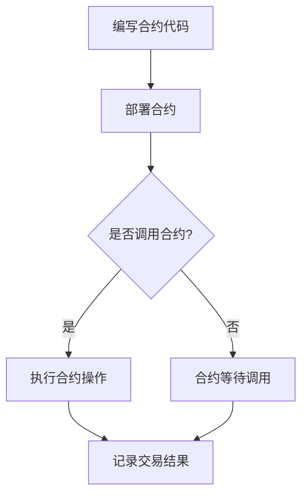

                 

智能合约开发是区块链技术的核心，它允许开发者创建自动执行的合同。随着区块链技术的快速发展，智能合约的应用场景不断扩大，从金融交易到供应链管理，从版权保护到数字身份验证，几乎无处不在。因此，了解如何将编程技能应用于智能合约开发，对程序员来说尤为重要。

## 文章关键词

- 智能合约
- 编程技能
- 区块链技术
- 脚本语言
- 合同自动化
- 安全性

## 文章摘要

本文旨在为程序员提供智能合约开发的入门指南，从基础知识到实际应用，帮助读者掌握智能合约的核心概念和开发技能。我们将探讨智能合约的工作原理，介绍常用的编程语言，并详细说明如何将编程技能应用于智能合约开发中，同时分析智能合约的安全性问题和未来发展趋势。

## 1. 背景介绍

### 区块链技术的兴起

区块链技术自2008年比特币的诞生以来，经历了快速的发展。区块链的分布式账本技术具有去中心化、透明性和不可篡改的特点，这些特性使得区块链在金融、物流、医疗等多个领域得到了广泛应用。智能合约作为区块链技术的重要组成部分，是实现自动化和去中心化的重要手段。

### 智能合约的定义

智能合约是一种自动执行的合同，它基于计算机编程语言编写，能够在满足特定条件时自动执行预先设定的协议。智能合约的出现，使得合同的执行不再依赖第三方中介机构，从而提高了交易效率，降低了交易成本。

### 编程技能的重要性

编程技能是智能合约开发的基础，无论是区块链开发者还是金融工程师，掌握编程技能都是必不可少的。通过编程，开发者可以创建功能强大、安全可靠的智能合约，满足各种实际应用需求。

## 2. 核心概念与联系

### 智能合约的工作原理

智能合约的工作原理可以简单概括为以下几个步骤：

1. **编写合约代码**：使用特定的编程语言编写智能合约代码。
2. **部署合约**：将编写好的智能合约部署到区块链网络中。
3. **调用合约**：当满足合约预设条件时，调用合约执行预定操作。

### 智能合约与区块链的关系

智能合约与区块链的关系是密不可分的。区块链提供了一个不可篡改的分布式账本，确保了智能合约执行过程中的透明性和安全性。智能合约的代码一旦部署到区块链上，就无法被篡改，这保证了合同的执行是公正和透明的。

### 核心概念原理与架构的 Mermaid 流程图



## 3. 核心算法原理 & 具体操作步骤

### 3.1 算法原理概述

智能合约的核心算法是基于条件判断和数据处理。条件判断用于确定是否满足执行合约的条件，数据处理则用于执行具体的操作。

### 3.2 算法步骤详解

1. **初始化**：读取智能合约的输入参数。
2. **条件判断**：判断输入参数是否满足执行条件。
3. **执行操作**：根据条件判断结果，执行相应的操作。
4. **记录结果**：将执行结果记录在区块链上。

### 3.3 算法优缺点

**优点**：

- **去中心化**：智能合约的执行不依赖第三方中介，去中心化的特性保证了交易的透明性和公正性。
- **安全性**：区块链的不可篡改性确保了智能合约的执行结果是可信的。

**缺点**：

- **开发难度**：智能合约的开发需要掌握特定的编程语言和区块链技术，对开发者来说具有一定的学习门槛。
- **性能瓶颈**：区块链网络的处理能力有限，可能无法满足高频交易的需求。

### 3.4 算法应用领域

智能合约的应用领域非常广泛，包括但不限于：

- **金融**：智能合约可以用于自动化股票交易、借贷合同等。
- **供应链管理**：智能合约可以用于跟踪和管理商品的生产和运输。
- **版权保护**：智能合约可以用于保护数字版权，确保权利人获得应有的报酬。
- **数字身份验证**：智能合约可以用于身份验证和访问控制。

## 4. 数学模型和公式 & 详细讲解 & 举例说明

### 4.1 数学模型构建

智能合约的数学模型主要涉及概率论和图论。例如，在去中心化金融应用中，智能合约可能会使用概率模型来计算交易的风险和收益。

### 4.2 公式推导过程

假设有一个智能合约用于股票交易，交易双方为A和B，股票价格为P。智能合约的执行条件是当P达到特定阈值时，交易自动完成。

- **概率模型**：

  $$ P(A\text{赢}) = \frac{P-P_{\text{阈值}}}{P_{\text{最高}}} $$

  $$ P(B\text{赢}) = \frac{P_{\text{最高}}-P_{\text{阈值}}}{P_{\text{最高}}} $$

### 4.3 案例分析与讲解

假设智能合约设定的股票价格阈值为100美元，最高价格为200美元。

- **A赢的概率**：

  $$ P(A\text{赢}) = \frac{200-100}{200} = 0.5 $$

- **B赢的概率**：

  $$ P(B\text{赢}) = \frac{200-100}{200} = 0.5 $$

这种情况下，交易是公平的，双方都有50%的获胜概率。

## 5. 项目实践：代码实例和详细解释说明

### 5.1 开发环境搭建

在开发智能合约之前，需要搭建一个合适的开发环境。通常，开发者会使用Ethereum的开发工具包（如Truffle）来构建和部署智能合约。

### 5.2 源代码详细实现

以下是一个简单的智能合约示例，用于实现一个简单的去中心化交易所。

```solidity
pragma solidity ^0.8.0;

contract DecentralizedExchange {
    mapping(address => uint256) public balances;

    function deposit() public payable {
        balances[msg.sender()] += msg.value;
    }

    function withdraw(uint256 amount) public {
        require(balances[msg.sender()] >= amount, "Insufficient balance");
        payable(msg.sender()).transfer(amount);
        balances[msg.sender()] -= amount;
    }
}
```

### 5.3 代码解读与分析

- **deposit()函数**：用于接收以太币，并将以太币存入合约地址。
- **withdraw()函数**：用于提取以太币，前提是提取金额不能超过合约地址的余额。

### 5.4 运行结果展示

在成功部署智能合约后，开发者可以通过区块链浏览器查看合约的状态和交易记录，确保合约按照预期运行。

## 6. 实际应用场景

智能合约的应用场景非常广泛，以下是一些实际的应用示例：

- **金融领域**：智能合约可以用于自动化股票交易、期权交易等。
- **供应链管理**：智能合约可以用于跟踪和管理商品的生产和运输过程。
- **版权保护**：智能合约可以用于保护数字版权，确保权利人获得应有的报酬。
- **数字身份验证**：智能合约可以用于身份验证和访问控制。

### 6.4 未来应用展望

随着区块链技术的不断成熟，智能合约的应用场景将进一步扩大。未来的智能合约将更加智能化，能够自动处理复杂的业务逻辑，提高交易效率，降低交易成本。同时，智能合约的安全性和性能也将得到进一步提升，为各种实际应用场景提供更加可靠的解决方案。

## 7. 工具和资源推荐

### 7.1 学习资源推荐

- 《智能合约开发实战》
- 《区块链技术指南》
- Ethereum开发文档

### 7.2 开发工具推荐

- Truffle
- Remix IDE
- MetaMask

### 7.3 相关论文推荐

- 《智能合约的设计与实现》
- 《区块链技术在金融领域的应用》
- 《去中心化金融：未来金融的蓝图》

## 8. 总结：未来发展趋势与挑战

### 8.1 研究成果总结

智能合约技术在过去几年取得了显著的成果，各种实际应用场景不断涌现。智能合约的开发工具和平台也日益成熟，为开发者提供了方便的编程环境。

### 8.2 未来发展趋势

未来的智能合约将更加智能化，能够自动处理复杂的业务逻辑，提高交易效率，降低交易成本。同时，智能合约的安全性和性能也将得到进一步提升。

### 8.3 面临的挑战

智能合约在应用过程中仍面临一些挑战，包括安全漏洞、性能瓶颈和标准统一等方面。解决这些问题需要整个行业的共同努力。

### 8.4 研究展望

随着区块链技术的不断成熟，智能合约将在更多领域得到应用。未来的研究将主要集中在提升智能合约的安全性和性能，以及探索更广泛的实际应用场景。

## 9. 附录：常见问题与解答

### Q：智能合约的安全性问题如何解决？

A：智能合约的安全性问题可以通过代码审计、使用安全的编程语言和框架、以及定期更新合约代码来解决。

### Q：智能合约的性能如何优化？

A：智能合约的性能可以通过优化代码、使用高速网络和提升区块链性能来优化。

### Q：智能合约的标准化如何实现？

A：智能合约的标准化可以通过建立统一的智能合约标准、促进不同区块链之间的互操作性来实现。

---

作者：禅与计算机程序设计艺术 / Zen and the Art of Computer Programming
```

