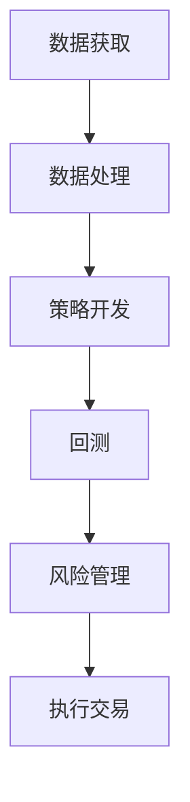

                 

关键词：量化交易、编程技能、算法交易、Python、回测、机器学习、数据分析、交易所API

> 摘要：本文旨在探讨如何将编程技能应用于量化交易领域，通过对核心概念、算法原理、数学模型、项目实践等方面的详细讲解，帮助读者理解并掌握量化交易的基本方法和技巧，从而在金融市场中实现稳健的投资回报。

## 1. 背景介绍

量化交易，也称为算法交易，是指通过使用数学模型、统计分析和计算机编程来制定投资策略，并在自动化交易系统中执行交易决策。随着金融市场的日益复杂化和信息化的推进，量化交易已成为现代金融投资领域的重要分支，吸引了大量专业人士和研究机构的关注。

编程技能在量化交易中的应用主要体现在以下几个方面：

1. **数据处理**：量化交易依赖于大量历史和实时数据，编程技能可以帮助我们高效地获取、处理和分析这些数据。
2. **策略开发**：通过编程，我们可以快速实现各种投资策略，并进行回测验证。
3. **系统自动化**：量化交易系统需要高度自动化，编程技能是构建自动化交易系统的关键。
4. **机器学习和人工智能**：利用编程技能，我们可以开发基于机器学习和人工智能的投资策略。

本文将围绕这些方面，详细介绍如何将编程技能应用于量化交易。

## 2. 核心概念与联系

### 2.1 量化交易的核心概念

量化交易涉及多个核心概念，包括：

- **市场数据**：量化交易的基础是市场数据，包括价格、成交量、订单流等。
- **交易策略**：交易策略是指投资者根据市场数据制定的交易决策规则。
- **回测**：回测是对交易策略进行历史数据验证的过程，以评估策略的有效性。
- **风险控制**：量化交易需要严格的风险控制，包括资金管理、风险平价等。

### 2.2 量化交易架构的 Mermaid 流程图



## 3. 核心算法原理 & 具体操作步骤

### 3.1 算法原理概述

量化交易的核心在于算法，以下介绍几种常见的量化交易算法：

- **趋势跟踪算法**：基于市场趋势进行交易。
- **均值回归算法**：基于价格偏离均值的行为进行交易。
- **机器学习算法**：利用机器学习模型进行预测和决策。

### 3.2 算法步骤详解

以趋势跟踪算法为例，其基本步骤如下：

1. **数据获取**：从交易所API获取历史价格数据。
2. **数据处理**：计算价格的平均值和标准差。
3. **趋势判断**：根据价格的变化情况判断市场趋势。
4. **交易决策**：根据趋势判断结果进行买入或卖出决策。
5. **风险控制**：设置止损点和资金管理规则。

### 3.3 算法优缺点

- **趋势跟踪算法**：优点是简单易实现，适用于趋势明显的市场；缺点是可能在震荡市场中表现不佳。

### 3.4 算法应用领域

趋势跟踪算法广泛应用于股票、期货、外汇等市场。

## 4. 数学模型和公式

### 4.1 数学模型构建

以趋势跟踪算法为例，其基本模型如下：

$$
T = \frac{P - \mu}{\sigma}
$$

其中，$T$ 表示趋势值，$P$ 表示当前价格，$\mu$ 表示平均值，$\sigma$ 表示标准差。

### 4.2 公式推导过程

$$
\mu = \frac{1}{n}\sum_{i=1}^{n} P_i
$$

$$
\sigma = \sqrt{\frac{1}{n}\sum_{i=1}^{n} (P_i - \mu)^2}
$$

### 4.3 案例分析与讲解

假设我们有一个股票的历史价格数据，如下表：

| 日期 | 价格（元） |
| ---- | -------- |
| 2021-01-01 | 10.00    |
| 2021-01-02 | 10.20    |
| 2021-01-03 | 10.30    |
| 2021-01-04 | 10.40    |
| 2021-01-05 | 10.50    |

根据上述公式，我们可以计算出平均值和标准差，然后判断趋势值。

## 5. 项目实践：代码实例

### 5.1 开发环境搭建

我们需要安装 Python 和相关库，如 pandas、numpy、matplotlib 等。

### 5.2 源代码详细实现

```python
import pandas as pd
import numpy as np
import matplotlib.pyplot as plt

# 读取数据
data = pd.read_csv('stock_data.csv')
price = data['price']

# 计算平均值和标准差
mu = price.mean()
sigma = price.std()

# 计算趋势值
trend = (price - mu) / sigma

# 绘图
plt.plot(price, label='Price')
plt.plot(trend, label='Trend')
plt.legend()
plt.show()
```

### 5.3 代码解读与分析

上述代码实现了趋势跟踪算法的基本步骤，包括数据读取、数据处理、趋势计算和绘图。通过可视化，我们可以直观地观察价格和趋势的变化。

### 5.4 运行结果展示

运行上述代码后，我们得到一个价格趋势图，通过观察图中的趋势线，我们可以判断市场趋势。

## 6. 实际应用场景

量化交易在金融市场中有着广泛的应用，包括股票、期货、外汇、数字货币等领域。以下是一些实际应用场景：

- **股票市场**：利用趋势跟踪算法进行短线交易。
- **期货市场**：利用均值回归算法进行跨品种套利。
- **外汇市场**：利用机器学习模型进行货币对预测。
- **数字货币市场**：利用高频交易策略进行量化投资。

## 7. 工具和资源推荐

### 7.1 学习资源推荐

- 《量化投资：技术与实践》
- 《算法交易：原理、策略与实现》
- 《Python for Finance》

### 7.2 开发工具推荐

- Python
- pandas
- numpy
- matplotlib
- backtrader

### 7.3 相关论文推荐

- "Machine Learning for Financial Markets"
- "Algorithmic Trading: An Introduction to Trading Machines"
- "High-Frequency Trading: A Practical Guide to Algorithmic Strategies and Trading Systems"

## 8. 总结：未来发展趋势与挑战

### 8.1 研究成果总结

量化交易在金融市场中取得了显著成果，为投资者带来了稳定的收益。随着技术的不断进步，量化交易将继续发挥重要作用。

### 8.2 未来发展趋势

- **大数据与人工智能**：利用大数据和人工智能技术，开发更智能的投资策略。
- **高频交易**：提高交易速度和效率，实现更精细化的投资决策。
- **跨市场交易**：在多个市场中进行交易，实现风险分散和收益最大化。

### 8.3 面临的挑战

- **数据隐私与安全**：保护交易数据的安全和隐私。
- **算法透明度**：提高算法的透明度，避免算法滥用。
- **法律与合规**：遵守相关法律法规，确保交易的合规性。

### 8.4 研究展望

量化交易将继续成为金融领域的重要研究方向，未来有望实现以下目标：

- **更智能的投资策略**：通过机器学习和深度学习，开发更智能的投资策略。
- **更高效的交易系统**：通过优化算法和系统架构，提高交易效率。
- **更广泛的适用范围**：将量化交易应用于更多领域，实现更广泛的金融创新。

## 9. 附录：常见问题与解答

### 9.1 量化交易是否适合所有投资者？

量化交易需要一定的技术背景和专业知识，对于普通投资者来说，可能需要一定的学习和实践。但对于有编程基础和技术兴趣的投资者，量化交易是一个值得尝试的领域。

### 9.2 量化交易的优势是什么？

量化交易的优势在于：

- **客观性**：基于数据分析和算法，减少人为情绪的影响。
- **稳定性**：通过回测和风险控制，实现稳定收益。
- **灵活性**：可以根据市场变化，快速调整投资策略。

### 9.3 量化交易的安全性如何保障？

量化交易的安全性可以从以下几个方面进行保障：

- **数据安全**：确保交易数据的安全和隐私。
- **算法透明度**：提高算法的透明度，避免算法滥用。
- **法律合规**：遵守相关法律法规，确保交易的合规性。

# 作者：禅与计算机程序设计艺术 / Zen and the Art of Computer Programming
```

