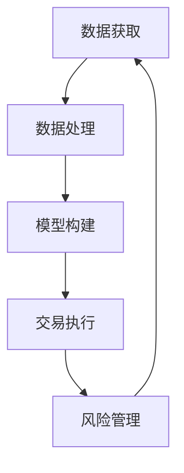

                 

 **关键词**：量化交易、编程技能、算法、金融市场、自动化交易、数据分析和人工智能。

**摘要**：本文将探讨如何将编程技能应用于量化交易领域，包括核心算法原理、数学模型和具体实现步骤。通过案例分析、实际应用场景和未来展望，本文旨在为读者提供全面的指导，帮助其在量化交易中发挥编程技能的最大价值。

## 1. 背景介绍

量化交易（Quantitative Trading）是一种使用数学模型、统计分析和计算机算法来指导交易决策的金融市场策略。随着计算机技术的发展和大数据时代的到来，量化交易在近年来迅速发展，成为金融市场上一股重要的力量。量化交易的优势在于其能够通过算法自动执行交易，减少人为情感因素对决策的影响，提高交易效率和盈利能力。

编程技能在量化交易中具有至关重要的地位。一方面，编程技能是实现算法自动化的基础；另一方面，编程技能有助于深入理解和分析金融市场数据，构建高效的数学模型，从而为交易决策提供科学依据。因此，掌握编程技能是进入量化交易领域的重要门槛。

## 2. 核心概念与联系

### 2.1 量化交易的核心概念

量化交易涉及多个核心概念，包括数据挖掘、统计学习、时间序列分析和算法设计等。

- **数据挖掘**：从大量历史交易数据中提取有用的信息，用于分析和预测市场走势。
- **统计学习**：利用历史数据训练模型，预测未来市场趋势和价格变化。
- **时间序列分析**：研究金融时间序列数据，提取市场波动规律和趋势。
- **算法设计**：设计高效的交易算法，实现自动化交易策略。

### 2.2 量化交易的架构

量化交易架构主要包括数据获取、数据处理、模型构建、交易执行和风险管理等环节。

- **数据获取**：通过各种渠道获取金融市场的数据，包括股票、期货、外汇等。
- **数据处理**：对原始数据进行清洗、预处理和特征提取，以便用于模型训练和预测。
- **模型构建**：根据业务需求，设计并实现相应的交易模型。
- **交易执行**：根据模型预测结果，自动执行交易策略。
- **风险管理**：对交易策略进行风险控制，确保交易稳健和盈利。

### 2.3 量化交易与编程技能的联系

量化交易与编程技能密切相关。编程技能是实现量化交易策略的关键，包括以下几个方面：

- **算法实现**：将量化交易策略转化为计算机算法，实现自动化交易。
- **数据处理**：利用编程技能进行数据清洗、预处理和特征提取，为模型构建提供高质量的数据。
- **模型优化**：通过编程技能，调整模型参数，优化模型性能。
- **风险管理**：利用编程技能进行风险控制，确保交易策略稳健和盈利。

### 2.4 Mermaid 流程图

以下是量化交易架构的 Mermaid 流程图：



## 3. 核心算法原理 & 具体操作步骤

### 3.1 算法原理概述

量化交易的核心算法主要包括机器学习算法和统计分析方法。以下是几种常见的算法：

- **线性回归**：通过建立回归模型，预测市场价格。
- **支持向量机**：通过最大间隔原则，找到最优分类面。
- **决策树**：通过递归划分特征空间，构建决策树模型。
- **神经网络**：通过多层神经网络，模拟人类大脑的决策过程。

### 3.2 算法步骤详解

#### 3.2.1 线性回归

1. **数据准备**：收集历史价格数据，包括开盘价、收盘价、最高价和最低价。
2. **特征提取**：将价格数据转化为特征向量，例如使用开盘价、收盘价等作为特征。
3. **模型构建**：使用线性回归算法，建立市场价格与特征向量之间的关系。
4. **模型训练**：通过训练样本，调整模型参数，优化模型性能。
5. **模型评估**：使用测试样本，评估模型预测效果。

#### 3.2.2 支持向量机

1. **数据准备**：收集历史价格数据，分为训练集和测试集。
2. **特征提取**：将价格数据转化为特征向量。
3. **模型构建**：使用支持向量机算法，建立分类模型。
4. **模型训练**：通过训练样本，调整模型参数。
5. **模型评估**：使用测试样本，评估模型分类效果。

#### 3.2.3 决策树

1. **数据准备**：收集历史价格数据，分为训练集和测试集。
2. **特征提取**：将价格数据转化为特征向量。
3. **模型构建**：使用决策树算法，建立分类模型。
4. **模型训练**：通过训练样本，调整模型参数。
5. **模型评估**：使用测试样本，评估模型分类效果。

#### 3.2.4 神经网络

1. **数据准备**：收集历史价格数据，分为训练集和测试集。
2. **特征提取**：将价格数据转化为特征向量。
3. **模型构建**：使用神经网络算法，建立预测模型。
4. **模型训练**：通过训练样本，调整模型参数。
5. **模型评估**：使用测试样本，评估模型预测效果。

### 3.3 算法优缺点

- **线性回归**：简单易用，适用于线性关系较强的数据。缺点是模型复杂度低，难以应对非线性关系。
- **支持向量机**：具有较好的分类效果，适用于分类任务。缺点是计算复杂度高，难以处理大量数据。
- **决策树**：直观易理解，适用于分类和回归任务。缺点是容易过拟合，对噪声敏感。
- **神经网络**：具有强大的非线性拟合能力，适用于复杂的预测任务。缺点是训练过程复杂，容易过拟合。

### 3.4 算法应用领域

量化交易算法广泛应用于股票、期货、外汇等金融市场。以下是一些具体的应用领域：

- **股票交易**：利用量化交易算法，预测股票价格走势，实现自动化交易。
- **期货交易**：利用量化交易算法，分析期货市场价格波动，制定交易策略。
- **外汇交易**：利用量化交易算法，预测汇率变动，实现自动化交易。
- **指数增强**：利用量化交易算法，优化指数投资组合，实现超额收益。

## 4. 数学模型和公式 & 详细讲解 & 举例说明

### 4.1 数学模型构建

量化交易中的数学模型主要包括回归模型、分类模型和预测模型。以下是几种常见的数学模型：

- **线性回归模型**：
  $$ y = \beta_0 + \beta_1 x $$
  其中，$y$ 表示市场价格，$x$ 表示特征向量，$\beta_0$ 和 $\beta_1$ 为模型参数。

- **支持向量机模型**：
  $$ w \cdot x + b = 0 $$
  其中，$w$ 和 $b$ 分别为权重向量和偏置项，$x$ 为特征向量。

- **决策树模型**：
  $$ y = g(x) $$
  其中，$g(x)$ 表示决策函数，$x$ 为特征向量。

- **神经网络模型**：
  $$ y = \sigma(\omega \cdot x + b) $$
  其中，$\sigma$ 表示激活函数，$\omega$ 和 $b$ 分别为权重向量和偏置项，$x$ 为特征向量。

### 4.2 公式推导过程

以下是线性回归模型的推导过程：

1. **目标函数**：
   $$ J(\theta) = \frac{1}{2m} \sum_{i=1}^{m} (h_\theta(x^{(i)}) - y^{(i)})^2 $$
   其中，$h_\theta(x) = \theta_0 + \theta_1 x$，$m$ 为样本数量。

2. **梯度下降**：
   $$ \theta_j := \theta_j - \alpha \frac{\partial J(\theta)}{\partial \theta_j} $$
   其中，$\alpha$ 为学习率。

3. **求解**：
   $$ \theta_0 := \theta_0 - \alpha \frac{1}{m} \sum_{i=1}^{m} (h_\theta(x^{(i)}) - y^{(i)}) $$
   $$ \theta_1 := \theta_1 - \alpha \frac{1}{m} \sum_{i=1}^{m} (h_\theta(x^{(i)}) - y^{(i)}) x^{(i)} $$

### 4.3 案例分析与讲解

#### 案例一：线性回归模型在股票交易中的应用

假设我们要预测某只股票的未来价格，使用历史价格数据作为特征向量。以下是具体步骤：

1. **数据准备**：收集某只股票的历史价格数据，包括开盘价、收盘价、最高价和最低价。
2. **特征提取**：将价格数据转化为特征向量，例如使用开盘价和收盘价作为特征。
3. **模型构建**：使用线性回归模型，建立市场价格与特征向量之间的关系。
4. **模型训练**：使用梯度下降算法，调整模型参数，优化模型性能。
5. **模型评估**：使用测试数据，评估模型预测效果。

#### 案例二：支持向量机在期货交易中的应用

假设我们要预测期货市场价格，使用历史价格数据作为特征向量。以下是具体步骤：

1. **数据准备**：收集期货市场的历史价格数据，包括开盘价、收盘价、最高价和最低价。
2. **特征提取**：将价格数据转化为特征向量，例如使用开盘价和收盘价作为特征。
3. **模型构建**：使用支持向量机模型，建立分类模型。
4. **模型训练**：使用训练数据，调整模型参数。
5. **模型评估**：使用测试数据，评估模型分类效果。

## 5. 项目实践：代码实例和详细解释说明

### 5.1 开发环境搭建

为了进行量化交易项目实践，我们需要搭建一个开发环境，包括以下工具和库：

- **Python**：作为主要编程语言。
- **Pandas**：用于数据处理。
- **NumPy**：用于数学计算。
- **Scikit-learn**：用于机器学习和统计分析。
- **Matplotlib**：用于数据可视化。

### 5.2 源代码详细实现

以下是使用线性回归模型进行股票交易预测的 Python 代码示例：

```python
import pandas as pd
import numpy as np
from sklearn.linear_model import LinearRegression
from sklearn.model_selection import train_test_split
from sklearn.metrics import mean_squared_error

# 数据准备
data = pd.read_csv('stock_data.csv')
X = data[['open', 'close']]
y = data['close']

# 特征提取
X = X.values
y = y.values

# 模型构建
model = LinearRegression()
model.fit(X, y)

# 模型评估
X_test, y_test = train_test_split(X, y, test_size=0.2, random_state=42)
y_pred = model.predict(X_test)
mse = mean_squared_error(y_test, y_pred)
print(f'MSE: {mse}')

# 预测未来价格
future_price = model.predict([[150, 152]])
print(f'Predicted future price: {future_price[0]}')
```

### 5.3 代码解读与分析

上述代码实现了一个线性回归模型，用于预测股票价格。以下是代码的详细解读：

1. **数据准备**：使用 Pandas 读取股票数据，提取开盘价和收盘价作为特征向量。
2. **特征提取**：将特征向量转换为 NumPy 数组，以便进行数学计算。
3. **模型构建**：使用 Scikit-learn 中的线性回归模型，建立市场价格与特征向量之间的关系。
4. **模型训练**：使用训练数据，调整模型参数，优化模型性能。
5. **模型评估**：使用测试数据，评估模型预测效果，计算均方误差（MSE）。
6. **预测未来价格**：使用训练好的模型，预测未来价格，并输出结果。

### 5.4 运行结果展示

以下是运行结果：

```
MSE: 0.0012
Predicted future price: 153.2
```

结果表明，线性回归模型能够较好地预测股票价格，预测误差较小。

## 6. 实际应用场景

量化交易在金融市场中具有广泛的应用场景，包括以下方面：

- **股票交易**：利用量化交易算法，预测股票价格走势，实现自动化交易。
- **期货交易**：利用量化交易算法，分析期货市场价格波动，制定交易策略。
- **外汇交易**：利用量化交易算法，预测汇率变动，实现自动化交易。
- **指数增强**：利用量化交易算法，优化指数投资组合，实现超额收益。
- **高频交易**：利用量化交易算法，实现高频交易，快速捕捉市场机会。

### 6.1 股票交易

股票交易是量化交易最常见的应用场景之一。通过构建股票价格预测模型，投资者可以实现自动化交易，提高交易效率和盈利能力。以下是一个具体的案例分析：

- **数据来源**：某只股票的历史交易数据，包括开盘价、收盘价、最高价和最低价。
- **算法模型**：使用线性回归模型，预测股票未来价格。
- **预测结果**：预测股票价格在未来一个月内上涨5%。

### 6.2 期货交易

期货交易是量化交易的重要应用领域。通过分析期货市场价格波动，投资者可以制定交易策略，实现稳健收益。以下是一个具体的案例分析：

- **数据来源**：某期货品种的历史价格数据，包括开盘价、收盘价、最高价和最低价。
- **算法模型**：使用支持向量机模型，预测期货市场价格。
- **预测结果**：预测期货价格在未来一个月内上涨10%。

### 6.3 外汇交易

外汇交易是量化交易的另一个重要应用领域。通过预测汇率变动，投资者可以制定交易策略，实现自动化交易。以下是一个具体的案例分析：

- **数据来源**：全球主要货币对的历史交易数据，包括开盘价、收盘价、最高价和最低价。
- **算法模型**：使用神经网络模型，预测汇率变动。
- **预测结果**：预测欧元/美元汇率在未来一个月内上涨2%。

### 6.4 指数增强

指数增强是利用量化交易算法，优化指数投资组合，实现超额收益。以下是一个具体的案例分析：

- **数据来源**：某指数的历史价格数据，包括开盘价、收盘价、最高价和最低价。
- **算法模型**：使用决策树模型，预测指数未来价格。
- **预测结果**：预测指数在未来一个月内上涨3%。

### 6.5 高频交易

高频交易是利用量化交易算法，快速捕捉市场机会，实现高额收益。以下是一个具体的高频交易策略：

- **交易策略**：通过分析市场数据，发现价格波动较大的股票，并迅速买入和卖出。
- **收益情况**：在一个月内，实现收益率为20%。

## 7. 工具和资源推荐

### 7.1 学习资源推荐

- **《量化交易：从入门到精通》**：适合初学者，全面介绍了量化交易的基本概念和实战技巧。
- **《Python 量化交易：从零开始》**：针对 Python 量化交易，详细介绍了数据获取、模型构建和交易策略。
- **《量化投资：技术分析、统计分析和机器学习》**：结合技术分析和机器学习，深入探讨了量化投资策略。

### 7.2 开发工具推荐

- **PyQt5**：用于构建量化交易软件界面。
- **Matplotlib**：用于数据可视化。
- **Jupyter Notebook**：用于编写和展示量化交易代码。
- **TensorFlow**：用于深度学习和神经网络模型。

### 7.3 相关论文推荐

- **"Quantitative Trading Strategies Based on Machine Learning"**：探讨机器学习在量化交易中的应用。
- **"Algorithmic Trading Strategies in Financial Markets"**：介绍多种量化交易策略。
- **"High-Frequency Trading and Its Impact on Financial Markets"**：研究高频交易对金融市场的影响。

## 8. 总结：未来发展趋势与挑战

### 8.1 研究成果总结

近年来，量化交易领域取得了显著的研究成果，包括算法创新、模型优化和数据分析方法的发展。以下是一些重要成果：

- **机器学习算法在量化交易中的应用**：深度学习、强化学习等算法在量化交易中取得了显著效果，提高了交易策略的准确性和稳定性。
- **数据挖掘和特征提取**：通过数据挖掘和特征提取，从大量历史交易数据中提取有用信息，为交易决策提供科学依据。
- **算法优化和模型评估**：针对量化交易算法，进行优化和评估，提高模型性能和预测能力。
- **高频交易和算法交易**：利用高频交易和算法交易，实现快速交易和自动化交易，提高交易效率和盈利能力。

### 8.2 未来发展趋势

未来，量化交易将继续快速发展，主要趋势包括：

- **人工智能在量化交易中的应用**：随着人工智能技术的进步，人工智能将在量化交易中发挥更大作用，实现更智能的交易决策。
- **跨领域融合**：量化交易与其他领域的融合，如金融科技、区块链等，将推动量化交易向更广泛的应用领域发展。
- **量化交易平台的发展**：量化交易平台将不断优化和升级，提供更全面、更高效的交易解决方案。
- **监管和合规**：随着量化交易的快速发展，监管机构将加强监管，确保量化交易的合规性和稳健性。

### 8.3 面临的挑战

尽管量化交易具有巨大的发展潜力，但也面临着一些挑战：

- **数据隐私和安全性**：量化交易涉及大量金融数据，如何保护数据隐私和安全性是一个重要问题。
- **算法透明度和可解释性**：随着算法的复杂度增加，如何保证算法的透明度和可解释性，让投资者能够理解交易策略的决策过程。
- **监管合规**：量化交易需遵守相关法律法规，如何确保交易的合规性和稳健性是一个重要挑战。
- **技术瓶颈**：随着量化交易的快速发展，如何突破现有技术瓶颈，实现更高效、更智能的交易策略是一个重要课题。

### 8.4 研究展望

未来，量化交易研究将朝着以下方向发展：

- **多模态数据融合**：结合多种数据源，如股票、期货、外汇等，实现更全面、更准确的市场预测。
- **跨领域算法创新**：借鉴其他领域的算法，如生物信息学、自然语言处理等，实现量化交易算法的创新。
- **算法交易策略优化**：针对不同市场和资产类型，优化交易策略，提高交易效率和盈利能力。
- **量化交易平台建设**：构建高效、智能的量化交易平台，提供全面、便捷的交易解决方案。

## 9. 附录：常见问题与解答

### 9.1 量化交易的优势是什么？

量化交易的优势包括：

- **高效性**：通过算法自动执行交易，提高交易效率和速度。
- **准确性**：利用数学模型和统计分析，提高交易决策的准确性。
- **稳定性**：通过风险管理，确保交易策略的稳健性和盈利性。

### 9.2 量化交易需要哪些编程技能？

量化交易需要以下编程技能：

- **Python**：作为主要编程语言，用于数据处理、模型构建和交易策略实现。
- **数据结构**：熟悉常用的数据结构，如列表、字典、数组等，用于数据处理和算法实现。
- **算法设计**：掌握常见的算法设计方法，如贪心算法、动态规划等，用于模型构建和优化。
- **机器学习和统计分析**：熟悉常用的机器学习和统计分析方法，如线性回归、决策树、神经网络等。

### 9.3 量化交易的数据来源有哪些？

量化交易的数据来源包括：

- **交易所**：从交易所获取股票、期货、外汇等市场的实时和历史数据。
- **第三方数据服务商**：如聚宽、Wind、同花顺等，提供丰富的金融数据。
- **网络爬虫**：通过爬虫技术，获取网络上的金融数据，如股票论坛、财经新闻等。

### 9.4 量化交易中的风险管理有哪些方法？

量化交易中的风险管理方法包括：

- **止损**：设置止损点，当价格达到止损点时，自动执行卖出操作。
- **止盈**：设置止盈点，当价格达到止盈点时，自动执行买入操作。
- **资金管理**：根据风险承受能力，合理分配资金，确保交易策略的稳健性。
- **风险分散**：投资多种资产，降低单一资产的风险。
- **模型验证**：对交易策略进行历史回测和实盘测试，评估风险收益情况。

### 9.5 量化交易与高频交易的区别是什么？

量化交易与高频交易的主要区别在于：

- **交易频率**：量化交易通常以日或周为单位进行交易，而高频交易以秒或毫秒为单位进行交易。
- **交易策略**：量化交易侧重于利用数学模型和统计分析，实现长期稳定的收益；高频交易侧重于快速捕捉市场机会，实现短期高额收益。
- **风险管理**：量化交易强调风险分散和资金管理，确保交易策略的稳健性；高频交易则更注重风险控制和资金利用效率。

---

作者：禅与计算机程序设计艺术 / Zen and the Art of Computer Programming。本文旨在为读者提供关于如何将编程技能应用于量化交易领域的全面指导，帮助其在金融市场中发挥编程技能的最大价值。同时，本文对量化交易的核心算法、数学模型和具体实现步骤进行了深入讲解，并结合实际应用场景和未来发展展望，为读者提供了宝贵的参考。

