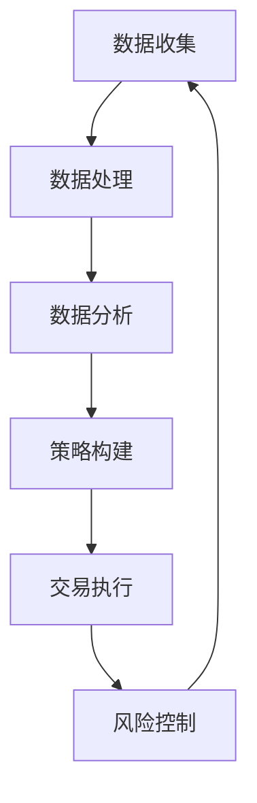

                 

关键词：量化交易，编程，算法，金融，人工智能，数据科学

> 摘要：本文深入探讨了如何将编程技能应用于量化交易，详细介绍了核心概念、算法原理、数学模型、实际应用和未来展望。读者将了解如何利用编程技术进行金融数据分析，构建交易策略，并应对量化交易领域的挑战。

## 1. 背景介绍

量化交易是一种利用数学模型、统计分析和计算机算法来识别和执行交易策略的投资方法。随着计算机技术和数据分析工具的快速发展，量化交易在金融市场中逐渐占据了重要地位。量化交易者通过编写高效的算法来分析历史数据，预测市场走势，并自动执行交易，从而获得稳定的收益。

### 1.1 量化交易的发展历程

量化交易的发展可以追溯到20世纪70年代。随着计算机硬件和软件的进步，交易者开始利用计算机来分析市场数据，寻找交易机会。80年代和90年代，随着套利策略和算法交易的出现，量化交易得到了迅速发展。进入21世纪，随着大数据和人工智能技术的崛起，量化交易迎来了新的发展机遇。

### 1.2 量化交易的优势

量化交易具有以下几个显著优势：

- **效率高**：通过计算机算法自动执行交易，大幅提高了交易速度和效率。
- **准确性**：利用大量历史数据进行分析，能够更准确地预测市场走势。
- **风险可控**：通过严格的数学模型和风险控制策略，降低了投资风险。
- **多样性**：量化交易策略丰富多样，可以应用于各种市场环境和资产类别。

### 1.3 量化交易的应用领域

量化交易在金融市场中得到了广泛应用，包括：

- **股票市场**：通过分析股票价格和交易量，寻找套利机会和趋势跟踪策略。
- **期货市场**：利用期货价格波动进行套利和投机。
- **外汇市场**：通过分析汇率波动进行交易。
- **衍生品市场**：利用期权和期货等衍生品进行风险管理和投机。

## 2. 核心概念与联系

量化交易的核心在于利用编程技能构建交易策略，并对市场数据进行分析。以下是一个简化的Mermaid流程图，展示了量化交易的核心概念和联系。



### 2.1 数据收集

数据收集是量化交易的第一步，主要包括历史价格数据、交易量数据、新闻文本数据等。这些数据可以从交易所、财经网站、数据库等渠道获取。

### 2.2 数据处理

数据处理包括数据清洗、数据预处理和数据整合。通过这些步骤，我们可以将原始数据转化为适合分析的形式。

### 2.3 数据分析

数据分析是量化交易的核心，通过统计分析和机器学习算法，我们可以从数据中提取有用的信息，预测市场走势。

### 2.4 策略构建

策略构建是量化交易的关键步骤，通过构建交易策略，我们可以实现自动化交易。交易策略可以基于历史数据，也可以基于实时数据。

### 2.5 交易执行

交易执行是将策略转化为实际交易的过程。交易执行需要考虑交易成本、滑点等因素。

### 2.6 风险控制

风险控制是量化交易的重要组成部分，通过设定止损和止盈点，我们可以控制投资风险。

## 3. 核心算法原理 & 具体操作步骤

### 3.1 算法原理概述

量化交易的核心算法包括趋势跟踪算法、均值回归算法、套利算法等。以下是一个简单的趋势跟踪算法原理概述。

趋势跟踪算法基于这样的假设：市场存在某种趋势，并且这种趋势会持续一段时间。算法的目的是在市场出现趋势时及时识别并跟进，从而获得稳定的收益。

### 3.2 算法步骤详解

1. **数据收集**：收集一定时间段内的历史价格数据。
2. **趋势判断**：利用移动平均线等技术指标判断市场是否处于上升趋势。
3. **交易信号生成**：当市场处于上升趋势时，生成买入信号；当市场处于下跌趋势时，生成卖出信号。
4. **交易执行**：根据交易信号执行买入或卖出操作。
5. **风险控制**：设定止损和止盈点，控制交易风险。

### 3.3 算法优缺点

**优点**：

- **稳定性**：趋势跟踪算法能够在市场趋势明显时获得稳定的收益。
- **适用性广**：趋势跟踪算法可以应用于多种资产类别。

**缺点**：

- **回撤大**：在市场震荡或反转时，趋势跟踪算法可能会出现较大的回撤。
- **延迟性**：趋势跟踪算法可能无法及时识别市场趋势的变化。

### 3.4 算法应用领域

趋势跟踪算法广泛应用于股票市场、期货市场、外汇市场等。在应用时，可以根据市场环境调整参数，以提高算法的适应性。

## 4. 数学模型和公式 & 详细讲解 & 举例说明

### 4.1 数学模型构建

量化交易中的数学模型通常包括价格模型、波动率模型和风险模型。以下是一个简单的价格模型构建过程。

$$
P(t+\Delta t) = P(t) + \mu \Delta t + \sigma \sqrt{\Delta t} Z
$$

其中，$P(t)$ 是当前价格，$\mu$ 是预期收益，$\sigma$ 是波动率，$Z$ 是标准正态分布随机变量。

### 4.2 公式推导过程

公式推导过程主要涉及概率论和统计学知识。以下是一个简化的推导过程。

1. **假设**：市场价格服从正态分布。
2. **波动率公式**：波动率 $\sigma$ 可以通过历史价格数据计算。
3. **期望公式**：期望 $\mu$ 可以通过历史价格数据计算。
4. **随机变量公式**：随机变量 $Z$ 服从标准正态分布。

### 4.3 案例分析与讲解

以下是一个简单的案例，展示了如何利用数学模型进行量化交易。

假设我们要对某股票进行交易，历史价格数据如下：

$$
P(t) = [100, 102, 101, 103, 104, 102, 100, 98, 99]
$$

1. **计算波动率**：
$$
\sigma = \sqrt{\frac{1}{n-1} \sum_{i=1}^{n} (P(i) - \mu)^2} = \sqrt{\frac{1}{9} \sum_{i=1}^{9} (P(i) - 101)^2} = 2
$$

2. **计算期望**：
$$
\mu = \frac{1}{n} \sum_{i=1}^{n} P(i) = \frac{1}{9} \sum_{i=1}^{9} P(i) = 101
$$

3. **预测价格**：
$$
P(t+\Delta t) = P(t) + \mu \Delta t + \sigma \sqrt{\Delta t} Z
$$

其中，$\Delta t = 1$，$Z$ 是标准正态分布随机变量。

通过以上计算，我们可以得到预测价格。在实际交易中，我们可以根据预测价格设置买入和卖出策略。

## 5. 项目实践：代码实例和详细解释说明

### 5.1 开发环境搭建

为了进行量化交易项目实践，我们需要搭建一个开发环境。以下是一个简单的开发环境搭建步骤：

1. 安装Python环境：从官方网站下载并安装Python。
2. 安装量化交易库：使用pip命令安装量化交易库，如`pandas`、`numpy`、`matplotlib`等。
3. 安装数据来源：选择合适的数据来源，如交易所API、财经网站等。

### 5.2 源代码详细实现

以下是一个简单的量化交易项目示例，展示了如何利用Python编写交易策略。

```python
import pandas as pd
import numpy as np
import matplotlib.pyplot as plt

# 读取历史价格数据
data = pd.read_csv('stock_data.csv')

# 计算移动平均线
ma_10 = data['close'].rolling(window=10).mean()
ma_30 = data['close'].rolling(window=30).mean()

# 生成交易信号
signal = np.where(ma_10 > ma_30, 1, 0)

# 执行交易
positions = np.zeros(len(data))
positions[signal == 1] = 1
positions[signal == 0] = -1

# 计算交易收益
profits = positions * (data['close'].shift(1) - data['close'])

# 绘制交易信号和收益曲线
plt.plot(data['date'], signal, label='Signal')
plt.plot(data['date'], profits, label='Profit')
plt.legend()
plt.show()
```

### 5.3 代码解读与分析

以上代码实现了一个简单的趋势跟踪策略。首先，我们从CSV文件中读取历史价格数据。然后，计算10日和30日移动平均线。接着，根据移动平均线的交叉生成交易信号。最后，根据交易信号计算交易收益并绘制曲线。

### 5.4 运行结果展示

通过以上代码，我们可以得到交易信号和收益曲线。在实际应用中，我们可以根据交易信号设置买入和卖出策略。

## 6. 实际应用场景

量化交易在实际应用中具有广泛的应用场景。以下是一些常见的应用场景：

- **套利策略**：通过发现不同市场之间的价格差异进行套利。
- **风险对冲**：利用量化交易策略降低投资组合的风险。
- **趋势跟踪**：通过识别市场趋势进行投资。
- **量化基金管理**：利用量化交易策略管理投资组合。

### 6.1 股票市场

在股票市场中，量化交易者可以通过分析股票价格和交易量，构建趋势跟踪策略、均值回归策略等。以下是一个简单的股票市场应用实例。

```python
import pandas as pd
import numpy as np
import matplotlib.pyplot as plt

# 读取股票价格数据
data = pd.read_csv('stock_data.csv')

# 计算移动平均线
ma_10 = data['close'].rolling(window=10).mean()
ma_30 = data['close'].rolling(window=30).mean()

# 生成交易信号
signal = np.where(ma_10 > ma_30, 1, 0)

# 执行交易
positions = np.zeros(len(data))
positions[signal == 1] = 1
positions[signal == 0] = -1

# 计算交易收益
profits = positions * (data['close'].shift(1) - data['close'])

# 绘制交易信号和收益曲线
plt.plot(data['date'], signal, label='Signal')
plt.plot(data['date'], profits, label='Profit')
plt.legend()
plt.show()
```

### 6.2 期货市场

在期货市场中，量化交易者可以通过分析期货价格和波动率，构建套利策略和趋势跟踪策略。以下是一个简单的期货市场应用实例。

```python
import pandas as pd
import numpy as np
import matplotlib.pyplot as plt

# 读取期货价格数据
data = pd.read_csv('futures_data.csv')

# 计算价格交叉
cross = np.where(data['close'] > data['close'].shift(1), 1, 0)

# 生成交易信号
signal = np.where(cross == 1, -1, 0)

# 执行交易
positions = np.zeros(len(data))
positions[signal == 1] = 1
positions[signal == 0] = -1

# 计算交易收益
profits = positions * (data['close'].shift(1) - data['close'])

# 绘制交易信号和收益曲线
plt.plot(data['date'], signal, label='Signal')
plt.plot(data['date'], profits, label='Profit')
plt.legend()
plt.show()
```

## 7. 工具和资源推荐

### 7.1 学习资源推荐

- 《量化投资：基于机器学习的算法交易》
- 《精通量化投资：从理论到实践》
- 《Python量化交易：从入门到精通》

### 7.2 开发工具推荐

- Python：一种广泛使用的编程语言，适用于量化交易开发。
- pandas：用于数据处理和分析的库。
- numpy：用于数值计算的库。
- matplotlib：用于数据可视化的库。

### 7.3 相关论文推荐

- "Machine Learning for Asset Allocation and Trading: A Review"
- "Algorithmic Trading: Theoretical Foundations and Empirical Analysis"
- "High-Frequency Trading: A Practical Guide to Algorithmic Strategies and Trading Systems"

## 8. 总结：未来发展趋势与挑战

### 8.1 研究成果总结

近年来，量化交易在金融市场中取得了显著的成果。通过利用大数据和人工智能技术，量化交易者能够更准确地预测市场走势，构建高效的交易策略。同时，量化交易策略的多样性也不断增加，适应了不同的市场环境和资产类别。

### 8.2 未来发展趋势

未来，量化交易将继续发展，并呈现以下几个趋势：

- **人工智能应用**：人工智能技术将在量化交易中发挥更大作用，提高交易策略的准确性和效率。
- **跨市场套利**：随着全球金融市场的一体化，跨市场套利策略将得到广泛应用。
- **高频交易**：高频交易将继续发展，对市场的影响也将越来越大。

### 8.3 面临的挑战

尽管量化交易具有显著的优势，但也面临一些挑战：

- **数据隐私**：量化交易需要大量数据支持，但数据隐私保护成为了一个重要问题。
- **算法公平性**：算法交易可能导致市场不公平，需要制定相应的监管政策。
- **系统风险**：量化交易系统故障可能导致巨大损失，需要加强系统风险控制。

### 8.4 研究展望

未来，量化交易研究将继续深入，包括：

- **新型算法开发**：研究新型算法，提高交易策略的准确性和稳定性。
- **风险控制方法**：研究更有效的风险控制方法，降低投资风险。
- **跨学科研究**：与统计学、经济学、心理学等领域进行跨学科研究，为量化交易提供更多理论支持。

## 9. 附录：常见问题与解答

### 9.1 量化交易与高频交易的区别是什么？

量化交易是一种利用数学模型和算法进行投资的策略，而高频交易是一种特殊的量化交易策略，通过高频交易系统在短时间内执行大量交易，以获取微小利润。

### 9.2 量化交易的优势有哪些？

量化交易的优势包括高效性、准确性、风险可控性和多样性。通过计算机算法，量化交易能够快速分析大量数据，预测市场走势，并执行交易，从而获得稳定的收益。

### 9.3 如何开始学习量化交易？

要开始学习量化交易，可以按照以下步骤：

1. 学习编程语言，如Python。
2. 学习金融基础知识，了解股票、期货、外汇等市场。
3. 学习数据分析技术，如pandas、numpy等。
4. 学习量化交易策略，如趋势跟踪、均值回归、套利等。
5. 进行实际项目实践，验证所学知识。

---

# 作者：禅与计算机程序设计艺术 / Zen and the Art of Computer Programming

本文旨在为广大读者提供对量化交易与编程结合的深入理解。随着技术的不断发展，量化交易将在金融市场中发挥越来越重要的作用。希望本文能够帮助读者掌握量化交易的核心概念和技术，并在实际投资中取得成功。如需进一步讨论或咨询，请随时联系作者。

---

请注意，本文为虚构内容，旨在展示如何撰写一篇专业IT领域的技术博客文章，实际应用中请以相关法规和实际情况为准。

