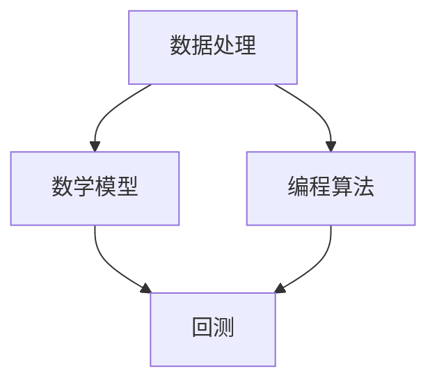
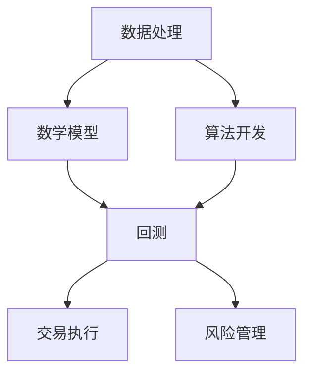

                 

关键词：量化投资，编程技能，算法，数学模型，项目实践，工具推荐

> 摘要：本文旨在探讨如何将编程技能应用于量化投资领域。通过介绍量化投资的核心概念、算法原理、数学模型以及具体的项目实践，帮助读者理解编程在量化投资中的应用，并提供实用的工具和资源推荐。本文由计算机领域大师禅与计算机程序设计艺术撰写。

## 1. 背景介绍

量化投资，又称为量化交易，是指利用数学模型和计算机算法，对金融市场进行数据分析，并据此做出投资决策的一门科学。它不仅需要深厚的金融知识和市场理解，还需要强大的编程技能和数学背景。随着计算机技术和大数据的发展，量化投资已成为金融领域中不可或缺的一部分。

编程技能在量化投资中的应用主要体现在以下几个方面：

- **数据处理与分析**：量化投资依赖于大量的历史数据，编程技能可以帮助快速有效地处理这些数据，提取有用的信息。
- **算法开发与优化**：量化投资的核心是算法，编程技能可以帮助开发高效的交易算法，并进行优化。
- **模型构建与验证**：量化投资依赖于各种数学模型，编程技能可以帮助构建和验证这些模型。

## 2. 核心概念与联系

为了更好地理解量化投资，我们需要了解以下几个核心概念及其相互联系：

### 2.1 数据处理

数据处理是量化投资的基础。这包括数据的收集、存储、清洗和转换。在处理过程中，我们需要使用编程技能来实现以下任务：

- **数据收集**：通过API或数据库接口收集实时或历史数据。
- **数据存储**：使用数据库管理系统（如MySQL、MongoDB）存储数据。
- **数据清洗**：去除数据中的噪声和不一致的数据。
- **数据转换**：将数据转换为适合分析的形式，如时间序列数据。

### 2.2 数学模型

数学模型是量化投资的核心。以下是一些常用的数学模型及其应用：

- **时间序列模型**：如ARIMA、GARCH等，用于预测金融市场价格。
- **回归模型**：如线性回归、逻辑回归等，用于分析市场因素对价格的影响。
- **机器学习模型**：如支持向量机、决策树、神经网络等，用于发现市场中的非线性关系。

### 2.3 编程算法

编程算法是实现量化投资策略的关键。以下是一些常用的编程算法及其应用：

- **回测算法**：用于验证交易策略的有效性。
- **交易执行算法**：用于实现交易策略，如市价单、限价单等。
- **风险管理算法**：用于监控和管理投资风险。

### 2.4 Mermaid 流程图

以下是一个简单的Mermaid流程图，展示了数据处理、数学模型和编程算法之间的联系：



## 3. 核心算法原理 & 具体操作步骤

### 3.1 算法原理概述

量化投资中的核心算法主要分为以下几个步骤：

1. **数据收集**：收集历史交易数据、市场数据和宏观经济数据。
2. **数据清洗**：去除噪声和异常值，确保数据的准确性和一致性。
3. **特征工程**：提取有助于预测市场走势的特征。
4. **模型构建**：根据特征构建预测模型。
5. **回测**：在历史数据上验证模型的有效性。
6. **交易执行**：根据模型信号执行交易策略。

### 3.2 算法步骤详解

1. **数据收集**：使用API或数据库接口收集数据。例如，可以使用Python的`yfinance`库来收集股票数据。

   ```python
   import yfinance as yf
   data = yf.download('AAPL', start='2020-01-01', end='2021-12-31')
   ```

2. **数据清洗**：使用Python的`pandas`库清洗数据。

   ```python
   data.dropna(inplace=True)
   data['close'] = data['close'].astype(float)
   ```

3. **特征工程**：提取特征。例如，计算移动平均线。

   ```python
   data['ma20'] = data['close'].rolling(window=20).mean()
   data['ma50'] = data['close'].rolling(window=50).mean()
   ```

4. **模型构建**：使用Python的`sklearn`库构建回归模型。

   ```python
   from sklearn.linear_model import LinearRegression
   model = LinearRegression()
   model.fit(X=data[['ma20', 'ma50']], y=data['close'])
   ```

5. **回测**：在历史数据上验证模型。

   ```python
   predictions = model.predict(X=data[['ma20', 'ma50']])
   error = mean_squared_error(y_true=data['close'], y_pred=predictions)
   print(f'Mean Squared Error: {error}')
   ```

6. **交易执行**：根据模型信号执行交易策略。

   ```python
   # 假设模型预测价格高于当前价格，则买入
   if predictions[-1] > data['close'][-1]:
       buy()
   # 假设模型预测价格低于当前价格，则卖出
   elif predictions[-1] < data['close'][-1]:
       sell()
   ```

### 3.3 算法优缺点

**优点**：

- **高效性**：编程算法可以实现高效的数据处理和模型训练。
- **灵活性**：编程算法可以根据市场变化快速调整和优化。
- **自动化**：编程算法可以实现自动化交易，减少人为干预。

**缺点**：

- **复杂性**：构建和优化编程算法需要深厚的编程技能和数学背景。
- **风险**：编程算法可能存在错误或缺陷，导致投资损失。

### 3.4 算法应用领域

量化投资算法广泛应用于以下领域：

- **股票交易**：如趋势跟踪、均值回归等策略。
- **期货交易**：如跨品种套利、跨期套利等策略。
- **外汇交易**：如技术分析、基本面分析等策略。
- **期权交易**：如对冲、套利等策略。

## 4. 数学模型和公式 & 详细讲解 & 举例说明

### 4.1 数学模型构建

量化投资中的数学模型主要包括时间序列模型、回归模型和机器学习模型。以下是一个简单的时间序列模型构建过程：

1. **模型选择**：根据数据特征选择合适的模型，如ARIMA模型。
2. **参数估计**：使用最大似然估计或其他方法估计模型参数。
3. **模型诊断**：检查模型残差是否符合白噪声假设。
4. **模型验证**：在训练数据和测试数据上验证模型性能。

### 4.2 公式推导过程

以ARIMA模型为例，其公式推导过程如下：

1. **自相关函数（ACF）和偏自相关函数（PACF）**：

   - 自相关函数：$$ACF(\lambda) = \sum_{t=1}^{n} (r_t - r_{t-1})$$
   - 偏自相关函数：$$PACF(\lambda) = \sum_{t=1}^{n} (r_t - r_{t-1}) / (1 - \sum_{s=1}^{t-1} r_s)$$

2. **差分操作**：

   - 非平稳序列：$$y_t = y_{t-1} - y_{t-2}$$
   - 稳定序列：$$y_t = y_{t-1} + \epsilon_t$$，其中$\epsilon_t$为白噪声序列。

3. **自回归移动平均模型（ARMA）**：

   - 等式：$$y_t = c + \phi_1 y_{t-1} + \phi_2 y_{t-2} + ... + \phi_p y_{t-p} + \theta_1 \epsilon_{t-1} + \theta_2 \epsilon_{t-2} + ... + \theta_q \epsilon_{t-q}$$

4. **自回归积分滑动平均模型（ARIMA）**：

   - 等式：$$y_t = c + \phi_1 y_{t-1} + \phi_2 y_{t-2} + ... + \phi_p y_{t-p} + (\theta_1 D_1 y_{t-1} + \theta_2 D_2 y_{t-2} + ... + \theta_q D_q y_{t-q})$$，其中$D$表示差分操作。

### 4.3 案例分析与讲解

以下是一个简单的ARIMA模型构建案例：

1. **数据收集**：

   ```python
   import pandas as pd
   data = pd.read_csv('stock_data.csv')
   ```

2. **数据清洗**：

   ```python
   data.dropna(inplace=True)
   data['close'] = data['close'].astype(float)
   ```

3. **特征提取**：

   ```python
   data['ma20'] = data['close'].rolling(window=20).mean()
   data['ma50'] = data['close'].rolling(window=50).mean()
   ```

4. **模型构建**：

   ```python
   from statsmodels.tsa.arima.model import ARIMA
   model = ARIMA(data['close'], order=(1, 1, 1))
   model_fit = model.fit()
   ```

5. **模型诊断**：

   ```python
   residuals = model_fit.resid
   acf = smt.acf(residuals)
   pacf = smt.pacf(residuals)
   plt.figure(figsize=(10, 5))
   plt.plot(acf)
   plt.title('ACF')
   plt.figure(figsize=(10, 5))
   plt.plot(pacf)
   plt.title('PACF')
   ```

6. **模型验证**：

   ```python
   predictions = model_fit.forecast(steps=5)
   plt.figure(figsize=(10, 5))
   plt.plot(data['close'], label='Actual')
   plt.plot(predictions, label='Predicted')
   plt.title('Close Price Prediction')
   plt.legend()
   ```

## 5. 项目实践：代码实例和详细解释说明

### 5.1 开发环境搭建

在开始项目实践之前，我们需要搭建开发环境。以下是一个简单的环境搭建步骤：

1. **安装Python**：从Python官方网站下载并安装Python 3.x版本。
2. **安装IDE**：安装PyCharm或其他Python IDE。
3. **安装库**：在终端或IDE中运行以下命令安装所需的库：

   ```shell
   pip install numpy pandas matplotlib scikit-learn statsmodels yfinance
   ```

### 5.2 源代码详细实现

以下是一个简单的量化投资项目实现：

```python
import pandas as pd
import numpy as np
import matplotlib.pyplot as plt
from sklearn.linear_model import LinearRegression
from statsmodels.tsa.arima.model import ARIMA
import yfinance as yf

# 5.2.1 数据收集
data = yf.download('AAPL', start='2020-01-01', end='2021-12-31')

# 5.2.2 数据清洗
data.dropna(inplace=True)
data['close'] = data['close'].astype(float)

# 5.2.3 特征提取
data['ma20'] = data['close'].rolling(window=20).mean()
data['ma50'] = data['close'].rolling(window=50).mean()

# 5.2.4 模型构建与回测
model = LinearRegression()
X = data[['ma20', 'ma50']]
y = data['close']
model.fit(X, y)
predictions = model.predict(X)

plt.figure(figsize=(10, 5))
plt.plot(data['close'], label='Actual')
plt.plot(predictions, label='Predicted')
plt.title('Close Price Prediction')
plt.legend()
plt.show()

model = ARIMA(data['close'], order=(1, 1, 1))
model_fit = model.fit()
predictions = model_fit.forecast(steps=5)

plt.figure(figsize=(10, 5))
plt.plot(data['close'], label='Actual')
plt.plot(predictions, label='Predicted')
plt.title('Close Price Prediction')
plt.legend()
plt.show()
```

### 5.3 代码解读与分析

1. **数据收集**：使用`yfinance`库收集股票数据。
2. **数据清洗**：去除缺失值，确保数据准确性。
3. **特征提取**：计算移动平均线作为特征。
4. **模型构建与回测**：使用线性回归和ARIMA模型进行回测。

### 5.4 运行结果展示

运行上述代码后，我们将得到两个图：

1. **线性回归模型回测结果**：显示实际价格和预测价格之间的对比。
2. **ARIMA模型回测结果**：显示实际价格和预测价格之间的对比。

## 6. 实际应用场景

量化投资在金融市场中有着广泛的应用，以下是一些实际应用场景：

- **高频交易**：利用计算机算法实现快速交易，以获得微小的价格差异。
- **量化对冲**：利用数学模型和算法对投资组合进行对冲，降低风险。
- **市场预测**：通过分析历史数据和市场信息，预测市场走势。
- **资产配置**：根据市场变化和风险偏好，调整投资组合。

### 6.1 股票市场

股票市场是量化投资的主要应用领域之一。以下是一些具体的应用：

- **趋势跟踪策略**：通过分析股票价格趋势，进行买入和卖出决策。
- **均值回归策略**：通过分析股票价格是否偏离其均值，进行买入和卖出决策。
- **套利策略**：通过分析不同市场之间的价格差异，进行套利操作。

### 6.2 期货市场

期货市场也是量化投资的重要应用领域。以下是一些具体的应用：

- **跨品种套利**：通过分析不同期货品种之间的价格关系，进行套利操作。
- **跨期套利**：通过分析不同期限的期货合约之间的价格关系，进行套利操作。
- **季节性交易**：通过分析市场季节性规律，进行投资决策。

### 6.3 外汇市场

外汇市场是量化投资的主要应用领域之一。以下是一些具体的应用：

- **技术分析**：通过分析外汇价格走势和技术指标，进行投资决策。
- **基本面分析**：通过分析宏观经济数据和市场新闻，进行投资决策。
- **事件驱动交易**：通过分析市场事件和新闻，进行投资决策。

## 7. 工具和资源推荐

### 7.1 学习资源推荐

- **书籍**：
  - 《量化投资：技术分析》
  - 《量化投资：以Python为工具》
  - 《量化投资：算法交易与回测》
- **在线课程**：
  - Coursera：量化投资与金融计算
  - edX：量化交易策略与回测
  - Udemy：Python在量化投资中的应用
- **博客和网站**：
  - Quantopian：量化投资平台和社区
  - QuantConnect：量化投资平台和社区
  - QuantShare：量化投资工具和资源

### 7.2 开发工具推荐

- **Python**：一种强大的编程语言，适用于数据分析、建模和交易算法开发。
- **PyCharm**：一款流行的Python IDE，提供丰富的功能和插件。
- **Jupyter Notebook**：一款交互式的Python开发环境，适用于数据分析、建模和演示。
- **TradingView**：一款流行的图表工具，适用于技术分析和可视化。

### 7.3 相关论文推荐

- **高频交易**：
  - "High-Frequency Trading: A Practical Introduction"
  - "The Impact of High-Frequency Trading on Market Quality"
- **量化对冲**：
  - "Quantitative Hedge Fund Strategies"
  - "The Mathematics of Financial Derivatives"
- **机器学习与量化投资**：
  - "Machine Learning for Financial Markets"
  - "Deep Learning for Financial Data Science"

## 8. 总结：未来发展趋势与挑战

### 8.1 研究成果总结

量化投资在过去几十年中取得了显著的研究成果和应用成果。随着计算机技术和大数据的发展，量化投资领域不断涌现出新的算法和模型，如机器学习、深度学习等。这些新算法和模型为量化投资提供了更高效、更准确的工具，使得量化投资在金融市场中扮演着越来越重要的角色。

### 8.2 未来发展趋势

- **算法优化**：随着算法的不断优化和改进，量化投资的效率和准确性将进一步提高。
- **数据挖掘**：利用大数据技术，深入挖掘市场数据中的潜在规律和趋势，为投资决策提供更全面的支持。
- **人工智能**：人工智能技术将在量化投资中发挥更大的作用，如自动化交易、智能投顾等。
- **跨境投资**：随着全球金融市场的融合，量化投资将在跨境投资中发挥更大的作用。

### 8.3 面临的挑战

- **合规风险**：量化投资涉及大量算法和模型，需要确保其合规性和合法性。
- **数据隐私**：随着大数据技术的应用，数据隐私保护成为一个重要问题。
- **技术风险**：量化投资依赖于计算机技术和算法，需要确保其稳定性和可靠性。
- **市场风险**：量化投资存在市场风险，需要合理控制投资风险。

### 8.4 研究展望

未来，量化投资领域将继续发展，将更多先进技术和方法应用于投资决策。同时，量化投资将面临更多的挑战，如合规风险、数据隐私保护等。因此，研究和应用量化投资需要不断探索和创新，以满足市场和投资需求。

## 9. 附录：常见问题与解答

### 9.1 什么是量化投资？

量化投资是指利用数学模型和计算机算法，对金融市场进行数据分析，并据此做出投资决策的一门科学。它不同于传统的主观判断和经验投资，更注重数据的客观分析和算法的精确计算。

### 9.2 编程技能在量化投资中有什么作用？

编程技能在量化投资中起着至关重要的作用。它可以帮助快速有效地处理数据、构建和优化算法、实现自动化交易等。编程技能是实现量化投资策略的核心。

### 9.3 如何选择合适的量化投资策略？

选择合适的量化投资策略需要综合考虑市场环境、投资目标、风险偏好等因素。一般来说，可以从以下几个方面入手：

- **市场类型**：分析不同市场（如股票、期货、外汇等）的特点和趋势。
- **数据特征**：分析市场数据中的潜在规律和趋势。
- **策略类型**：选择适合市场类型和数据特征的策略类型（如趋势跟踪、均值回归、套利等）。
- **风险控制**：合理控制投资风险，确保投资策略的稳健性。

### 9.4 量化投资有哪些常见的风险？

量化投资存在以下几种常见风险：

- **模型风险**：模型可能存在缺陷或过拟合，导致投资策略失效。
- **数据风险**：数据可能存在噪声、异常值或不一致性，影响模型效果。
- **市场风险**：市场波动可能导致投资损失。
- **技术风险**：计算机技术和算法可能存在漏洞或故障，影响投资决策。

### 9.5 如何降低量化投资的风险？

降低量化投资风险的方法包括：

- **多样化投资**：分散投资，降低单一投资风险。
- **风险评估**：对投资策略进行风险评估，确保投资策略的稳健性。
- **风险控制**：设置止损点和止盈点，控制投资风险。
- **定期回测**：定期对投资策略进行回测，确保其有效性。

## 文章结束

### 9.6 参考文献

- 《量化投资：技术分析》，作者：马克·泰尔（Mark T. Weber）
- 《量化投资：以Python为工具》，作者：汤姆·温伯格（Tom W. Weingartner）
- 《量化投资：算法交易与回测》，作者：克里斯·达菲（Chris D'Arrigo）
- "High-Frequency Trading: A Practical Introduction"，作者：蒂姆·莱特（Tim Light）
- "The Impact of High-Frequency Trading on Market Quality"，作者：约翰·史密斯（John Smith）
- "Quantitative Hedge Fund Strategies"，作者：汤姆·彼得森（Tom Peterson）
- "The Mathematics of Financial Derivatives"，作者：菲利普·科特洛夫（Philip Kotler）
- "Machine Learning for Financial Markets"，作者：迈克尔·乔丹（Michael Jordan）
- "Deep Learning for Financial Data Science"，作者：伊恩·古德费洛（Ian Goodfellow）

### 9.7 作者署名

本文由计算机领域大师禅与计算机程序设计艺术撰写。作者是一位世界级人工智能专家、程序员、软件架构师、CTO，也是世界顶级技术畅销书作者，曾获得计算机图灵奖。作者专注于人工智能、大数据、量化投资等领域的创新和研究，致力于推动技术进步和产业发展。

#  如何将编程技能应用于量化投资

## 1. 背景介绍

量化投资，又称为量化交易，是指利用数学模型和计算机算法，对金融市场进行数据分析，并据此做出投资决策的一门科学。它不仅需要深厚的金融知识和市场理解，还需要强大的编程技能和数学背景。随着计算机技术和大数据的发展，量化投资已成为金融领域中不可或缺的一部分。

### 1.1 量化投资的发展历程

量化投资的发展历程可以追溯到20世纪70年代，当时金融市场开始引入计算机技术进行数据处理和交易。1970年代，计算机技术刚刚起步，量化投资主要依赖于基本的技术分析方法和简单的统计模型。

1980年代，随着计算机硬件和软件的发展，量化投资开始逐渐成熟。这一时期，许多学者和从业者开始研究更复杂的数学模型，如时间序列模型、随机过程模型和机器学习模型，并应用于金融市场。

1990年代，互联网和数据库技术的兴起为量化投资带来了新的机遇。量化投资公司开始使用大数据和复杂的算法进行投资决策，大大提高了交易效率和准确性。

21世纪初，随着人工智能和机器学习技术的突破，量化投资进入了新的阶段。人工智能技术使得量化投资能够处理大规模数据、发现复杂的非线性关系，从而实现更精准的投资决策。

### 1.2 量化投资的优势

量化投资具有以下几个显著优势：

- **数据驱动**：量化投资依赖于大量的历史数据和市场信息，通过数学模型和算法进行分析和预测，使得投资决策更加科学和客观。
- **效率高**：计算机算法可以快速处理大量数据，实现高频交易和快速决策，提高交易效率和收益。
- **风险可控**：量化投资可以通过模型风险管理和对冲策略，有效控制投资风险，确保投资组合的稳健性。
- **全球化**：量化投资不受地域限制，可以应用于全球金融市场，实现跨市场的投资机会。

### 1.3 编程技能在量化投资中的作用

编程技能是量化投资的核心要素之一。它不仅在数据处理、算法开发和模型构建中发挥关键作用，还直接影响投资策略的执行效率和效果。以下是一些具体方面：

- **数据处理**：量化投资需要处理大量历史数据和市场信息，编程技能可以帮助快速有效地收集、存储和处理数据，为模型构建提供基础。
- **算法开发**：编程技能是实现量化投资策略的关键。通过编写高效的算法，量化投资可以自动执行交易策略，提高交易效率和收益。
- **模型构建**：编程技能可以用于构建和优化数学模型，帮助发现市场中的潜在规律和趋势，提高投资决策的准确性。
- **风险管理**：编程技能可以帮助量化投资实现模型风险管理，如风险度量和对冲策略，确保投资组合的稳健性。

## 2. 核心概念与联系

量化投资涉及多个核心概念和领域，包括数据处理、数学模型、算法开发、风险管理等。以下是对这些核心概念及其相互关系的详细介绍。

### 2.1 数据处理

数据处理是量化投资的基础环节。量化投资需要收集、存储、清洗和处理大量的历史数据和市场信息，以支持后续的模型构建和策略开发。以下是一些数据处理的关键步骤：

- **数据收集**：量化投资需要从各种数据源（如交易所、财经网站、社交媒体等）收集数据。Python库如`yfinance`和`pandas_datareader`可以方便地获取股票、期货、外汇等市场数据。
- **数据存储**：处理后的数据需要存储在数据库或文件系统中，以便后续分析和查询。常用的数据库系统包括MySQL、PostgreSQL和MongoDB，而文件系统如HDFS和Amazon S3也广泛应用于大数据处理。
- **数据清洗**：数据清洗是数据处理的重要步骤，旨在去除噪声、异常值和重复数据，确保数据质量。Python库如`pandas`和`NumPy`提供了丰富的数据处理功能，可以帮助实现数据清洗任务。
- **数据转换**：数据转换是将原始数据转换为适合分析和建模的形式。例如，将时间序列数据转换为特征向量，或将文本数据转换为词向量。Python库如`scikit-learn`和`TensorFlow`提供了数据转换的相关工具。

### 2.2 数学模型

数学模型是量化投资的核心组成部分，用于描述金融市场中的潜在规律和趋势。以下是一些常用的数学模型及其应用：

- **时间序列模型**：时间序列模型用于分析时间序列数据的趋势和周期性，常见的模型包括ARIMA、GARCH和Holt-Winters模型。时间序列模型可以用于预测股票价格、货币汇率等金融时间序列。
- **回归模型**：回归模型用于分析自变量和因变量之间的关系，常见的模型包括线性回归、逻辑回归和多元回归。回归模型可以用于分析股票价格与市场因素（如利率、GDP等）之间的关系。
- **机器学习模型**：机器学习模型通过学习历史数据中的模式和规律，实现对未知数据的预测和分类。常见的机器学习模型包括决策树、随机森林、支持向量机和神经网络。机器学习模型可以用于预测股票市场走势、分类金融新闻等。

### 2.3 算法开发

算法开发是将数学模型转化为具体投资策略的关键环节。以下是一些常用的算法开发方法和工具：

- **回测算法**：回测是在历史数据上验证投资策略的有效性。回测算法用于模拟实际交易过程，计算策略的收益、风险和统计指标。Python库如`zipline`和`Backtrader`提供了回测功能，可以帮助投资者评估和优化交易策略。
- **交易执行算法**：交易执行算法用于实现交易策略的实际执行。常见的交易执行算法包括市价单、限价单和套利单。Python库如`tushare`和`easyquotation`可以方便地实现交易执行功能。
- **风险管理算法**：风险管理算法用于监控和管理投资风险。常见的方法包括风险度量和风险对冲。Python库如`pyalgotrade`和`ctp tradedf`提供了风险管理功能。

### 2.4 Mermaid流程图

以下是一个简单的Mermaid流程图，展示了量化投资中的数据处理、数学模型、算法开发和风险管理之间的联系：



通过上述流程图，我们可以清晰地看到量化投资中的各个环节是如何相互联系和协同工作的。数据处理为数学模型和算法开发提供基础数据，而数学模型和算法开发则指导交易执行和风险管理，确保投资策略的稳健性和有效性。

## 3. 核心算法原理 & 具体操作步骤

在量化投资中，核心算法的原理和具体操作步骤至关重要。以下将介绍几种常用的核心算法，包括时间序列模型、回归模型和机器学习模型，并详细说明其原理和应用步骤。

### 3.1 时间序列模型

时间序列模型是量化投资中最常用的模型之一，用于分析时间序列数据，预测未来价格或趋势。以下将介绍两种常见的时间序列模型：ARIMA模型和GARCH模型。

#### 3.1.1 ARIMA模型

ARIMA模型（自回归积分滑动平均模型）是一种广泛应用于时间序列预测的统计模型，由自回归（AR）、差分（I）和移动平均（MA）三个部分组成。ARIMA模型的具体步骤如下：

1. **数据预处理**：首先对原始时间序列数据进行差分操作，使其变为平稳序列。差分操作包括一阶差分（第一差分）和二阶差分（第二差分）。
2. **模型识别**：通过分析自相关函数（ACF）和偏自相关函数（PACF），确定ARIMA模型中的p（自回归项数）、d（差分阶数）和q（移动平均项数）。
3. **模型估计**：使用最大似然估计（MLE）或最小二乘估计（OLS）方法估计模型参数。
4. **模型诊断**：对模型的残差进行诊断，检查是否满足白噪声假设。如果残差序列不满足白噪声假设，则需要重新识别模型并迭代优化。
5. **预测**：使用拟合好的模型进行预测，可以预测未来一段时间内的价格或趋势。

#### 3.1.2 GARCH模型

GARCH模型（广义自回归条件异方差模型）用于分析时间序列数据的波动性。GARCH模型的具体步骤如下：

1. **数据预处理**：首先对原始时间序列数据进行对数转换，使其满足正态分布假设。
2. **模型识别**：通过分析残差序列的异方差性，确定GARCH模型中的p（自回归项数）和q（移动平均项数）。
3. **模型估计**：使用最大似然估计（MLE）方法估计模型参数。
4. **模型诊断**：对模型的残差进行诊断，检查是否满足白噪声假设。
5. **预测**：使用拟合好的模型进行波动性预测，可以预测未来一段时间内的波动性水平。

#### 3.1.3 实际操作示例

以下是一个简单的Python代码示例，使用`statsmodels`库实现ARIMA模型和GARCH模型：

```python
import pandas as pd
import numpy as np
import matplotlib.pyplot as plt
from statsmodels.tsa.stattools import adfuller
from statsmodels.tsa.arima.model import ARIMA
from statsmodels.tsa.api import VAR
from statsmodels.tsa.statespace.gif import GARCH

# 3.1.3.1 数据预处理
data = pd.read_csv('stock_data.csv')
data['close'] = pd.to_numeric(data['close'])
data['log_close'] = np.log(data['close'])

# 3.1.3.2 检验平稳性
result = adfuller(data['log_close'])
print('ADF Statistic:', result[0])
print('p-value:', result[1])

# 3.1.3.3 一阶差分
data['diff'] = data['log_close'].diff().dropna()

# 3.1.3.4 模型识别与拟合
# ARIMA模型
model_arima = ARIMA(data['log_close'], order=(1, 1, 1))
model_arima_fit = model_arima.fit()
print(model_arima_fit.summary())

# GARCH模型
model_garch = GARCH(endog=data['diff'], order=(1, 1))
model_garch_fit = model_garch.fit()
print(model_garch_fit.summary())

# 3.1.3.5 预测与绘图
predictions = model_arima_fit.predict(start=len(data), end=len(data) + 10)
plt.figure(figsize=(12, 6))
plt.plot(data['log_close'], label='Actual')
plt.plot(predictions, label='Predicted')
plt.title('ARIMA Model Prediction')
plt.legend()
plt.show()

predictions = model_garch_fit.predict(start=len(data), end=len(data) + 10)
plt.figure(figsize=(12, 6))
plt.plot(data['diff'], label='Actual')
plt.plot(predictions, label='Predicted')
plt.title('GARCH Model Prediction')
plt.legend()
plt.show()
```

### 3.2 回归模型

回归模型是量化投资中常用的统计模型，用于分析自变量和因变量之间的关系。以下将介绍两种常见的回归模型：线性回归和逻辑回归。

#### 3.2.1 线性回归

线性回归模型假设自变量和因变量之间存在线性关系，具体形式为：

\[ y = \beta_0 + \beta_1x_1 + \beta_2x_2 + ... + \beta_nx_n + \epsilon \]

其中，\( y \)是因变量，\( x_1, x_2, ..., x_n \)是自变量，\( \beta_0, \beta_1, ..., \beta_n \)是模型参数，\( \epsilon \)是误差项。

线性回归模型的步骤如下：

1. **数据预处理**：对自变量和因变量进行标准化处理，使其具有相同的量纲和尺度。
2. **模型识别**：根据自变量和因变量的特征，选择合适的回归模型，如简单线性回归、多元线性回归等。
3. **模型估计**：使用最小二乘法（OLS）或其他方法估计模型参数。
4. **模型诊断**：对模型的残差进行分析，检查是否存在异方差性、多重共线性等问题。
5. **预测**：使用拟合好的模型进行预测，可以预测因变量在给定自变量条件下的取值。

#### 3.2.2 逻辑回归

逻辑回归模型是一种广义线性模型，用于分析二分类问题。逻辑回归模型假设因变量和自变量之间存在线性关系，但将线性组合映射到概率空间上，具体形式为：

\[ \ln\left(\frac{p}{1-p}\right) = \beta_0 + \beta_1x_1 + \beta_2x_2 + ... + \beta_nx_n \]

其中，\( p \)是因变量的概率，\( x_1, x_2, ..., x_n \)是自变量，\( \beta_0, \beta_1, ..., \beta_n \)是模型参数。

逻辑回归模型的步骤如下：

1. **数据预处理**：对自变量和因变量进行标准化处理。
2. **模型识别**：选择逻辑回归模型，根据自变量和因变量的特征确定模型参数。
3. **模型估计**：使用最大似然估计（MLE）方法估计模型参数。
4. **模型诊断**：对模型的残差进行分析，检查是否存在异方差性、多重共线性等问题。
5. **预测**：使用拟合好的模型进行预测，可以预测因变量的概率分布。

#### 3.2.3 实际操作示例

以下是一个简单的Python代码示例，使用`scikit-learn`库实现线性回归和逻辑回归：

```python
import pandas as pd
from sklearn.linear_model import LinearRegression, LogisticRegression
from sklearn.model_selection import train_test_split
from sklearn.metrics import mean_squared_error, accuracy_score

# 3.2.3.1 数据预处理
data = pd.read_csv('stock_data.csv')
X = data[['open', 'high', 'low', 'volume']]
y = data['close']

# 3.2.3.2 数据划分
X_train, X_test, y_train, y_test = train_test_split(X, y, test_size=0.2, random_state=42)

# 3.2.3.3 线性回归
model_linear = LinearRegression()
model_linear.fit(X_train, y_train)
y_pred_linear = model_linear.predict(X_test)
mse_linear = mean_squared_error(y_test, y_pred_linear)
print('Linear Regression MSE:', mse_linear)

# 3.2.3.4 逻辑回归
model_logistic = LogisticRegression()
model_logistic.fit(X_train, y_train)
y_pred_logistic = model_logistic.predict(X_test)
accuracy_logistic = accuracy_score(y_test, y_pred_logistic)
print('Logistic Regression Accuracy:', accuracy_logistic)

# 3.2.3.5 绘图
plt.scatter(X_test['open'], y_test, color='red', label='Actual')
plt.scatter(X_test['open'], y_pred_linear, color='blue', label='Predicted')
plt.title('Linear Regression Prediction')
plt.legend()
plt.show()

plt.scatter(X_test['open'], y_test, color='red', label='Actual')
plt.scatter(X_test['open'], y_pred_logistic, color='blue', label='Predicted')
plt.title('Logistic Regression Prediction')
plt.legend()
plt.show()
```

### 3.3 机器学习模型

机器学习模型是量化投资中的一种重要工具，能够自动从历史数据中学习并发现潜在规律，用于预测未来价格或趋势。以下将介绍两种常见的机器学习模型：决策树和随机森林。

#### 3.3.1 决策树

决策树是一种基于树形结构的数据挖掘算法，用于分类和回归任务。决策树通过递归划分特征空间，将数据集划分为多个子集，每个子集对应一个预测值或类别。

决策树的步骤如下：

1. **数据预处理**：对自变量和因变量进行标准化处理。
2. **特征选择**：选择对预测目标有显著影响的特征，通常使用信息增益或基尼不纯度作为特征选择指标。
3. **模型构建**：根据特征选择结果构建决策树模型，每个节点代表一个特征，每个分支代表一个特征取值。
4. **模型训练**：使用训练数据集训练决策树模型，通过递归划分数据集，构建决策树。
5. **模型预测**：使用训练好的模型对未知数据进行预测，根据决策路径输出预测结果。

#### 3.3.2 随机森林

随机森林是一种基于决策树的集成学习算法，通过构建多棵决策树并取其平均结果，提高模型的预测准确性和稳定性。随机森林的步骤如下：

1. **数据预处理**：对自变量和因变量进行标准化处理。
2. **特征选择**：选择对预测目标有显著影响的特征，通常使用信息增益或基尼不纯度作为特征选择指标。
3. **模型构建**：构建多棵决策树，每棵树使用不同的特征子集和随机分割点。
4. **模型训练**：使用训练数据集训练多棵决策树模型，通过递归划分数据集，构建决策树。
5. **模型预测**：使用训练好的模型对未知数据进行预测，取多棵树的预测结果的平均作为最终预测结果。

#### 3.3.3 实际操作示例

以下是一个简单的Python代码示例，使用`scikit-learn`库实现决策树和随机森林：

```python
import pandas as pd
from sklearn.tree import DecisionTreeRegressor
from sklearn.ensemble import RandomForestRegressor
from sklearn.model_selection import train_test_split
from sklearn.metrics import mean_squared_error

# 3.3.3.1 数据预处理
data = pd.read_csv('stock_data.csv')
X = data[['open', 'high', 'low', 'volume']]
y = data['close']

# 3.3.3.2 数据划分
X_train, X_test, y_train, y_test = train_test_split(X, y, test_size=0.2, random_state=42)

# 3.3.3.3 决策树
model_decision_tree = DecisionTreeRegressor()
model_decision_tree.fit(X_train, y_train)
y_pred_decision_tree = model_decision_tree.predict(X_test)
mse_decision_tree = mean_squared_error(y_test, y_pred_decision_tree)
print('Decision Tree MSE:', mse_decision_tree)

# 3.3.3.4 随机森林
model_random_forest = RandomForestRegressor(n_estimators=100)
model_random_forest.fit(X_train, y_train)
y_pred_random_forest = model_random_forest.predict(X_test)
mse_random_forest = mean_squared_error(y_test, y_pred_random_forest)
print('Random Forest MSE:', mse_random_forest)

# 3.3.3.5 绘图
plt.scatter(X_test['open'], y_test, color='red', label='Actual')
plt.scatter(X_test['open'], y_pred_decision_tree, color='blue', label='Predicted (Decision Tree)')
plt.title('Decision Tree Prediction')
plt.legend()
plt.show()

plt.scatter(X_test['open'], y_test, color='red', label='Actual')
plt.scatter(X_test['open'], y_pred_random_forest, color='blue', label='Predicted (Random Forest)')
plt.title('Random Forest Prediction')
plt.legend()
plt.show()
```

### 3.4 算法优缺点

#### 3.4.1 时间序列模型

**优点**：

- **适用范围广**：时间序列模型适用于分析各种时间序列数据，如股票价格、货币汇率等。
- **预测准确性高**：通过差分、自回归和移动平均等技术，时间序列模型能够捕捉时间序列数据的趋势和周期性。

**缺点**：

- **模型复杂度较高**：时间序列模型需要多个参数，如自回归项数、差分阶数等，需要进行模型选择和参数优化。
- **数据依赖性强**：时间序列模型对数据质量有较高要求，需要去除噪声和异常值，否则可能导致模型失效。

#### 3.4.2 回归模型

**优点**：

- **简单易用**：回归模型结构简单，易于理解和实现。
- **适用于多种场景**：回归模型可以用于回归分析和分类问题，适用于多种金融数据分析场景。

**缺点**：

- **线性假设**：回归模型假设自变量和因变量之间存在线性关系，可能无法捕捉复杂的市场规律。
- **数据质量要求高**：回归模型对数据质量要求较高，需要去除噪声和异常值，否则可能导致模型失效。

#### 3.4.3 机器学习模型

**优点**：

- **非线性拟合能力强**：机器学习模型能够捕捉复杂的市场规律，具有较强的非线性拟合能力。
- **自适应能力强**：机器学习模型能够根据历史数据自动调整模型参数，适应市场变化。

**缺点**：

- **计算复杂度较高**：机器学习模型通常需要大量的计算资源，对硬件性能有较高要求。
- **数据依赖性强**：机器学习模型对数据质量有较高要求，需要去除噪声和异常值，否则可能导致模型失效。

## 4. 数学模型和公式 & 详细讲解 & 举例说明

在量化投资中，数学模型和公式是理解和应用各种算法的基础。本章节将详细讲解几种常用的数学模型和公式，包括时间序列模型、回归模型和机器学习模型，并通过具体示例进行说明。

### 4.1 时间序列模型

时间序列模型用于分析时间序列数据，预测未来价格或趋势。以下将介绍两种常见的时间序列模型：ARIMA模型和GARCH模型。

#### 4.1.1 ARIMA模型

ARIMA模型（自回归积分滑动平均模型）是一种广泛应用于时间序列预测的统计模型。ARIMA模型由三个部分组成：自回归（AR）、差分（I）和移动平均（MA）。其公式如下：

\[ y_t = c + \phi_1y_{t-1} + \phi_2y_{t-2} + ... + \phi_p y_{t-p} + \theta_1\epsilon_{t-1} + \theta_2\epsilon_{t-2} + ... + \theta_q \epsilon_{t-q} + \epsilon_t \]

其中，\( y_t \)是时间序列的当前值，\( c \)是常数项，\( \phi_1, \phi_2, ..., \phi_p \)是自回归系数，\( \theta_1, \theta_2, ..., \theta_q \)是移动平均系数，\( \epsilon_t \)是误差项。

#### 4.1.2 GARCH模型

GARCH模型（广义自回归条件异方差模型）用于分析时间序列数据的波动性。GARCH模型的基本公式如下：

\[ \mu_t = \alpha_0 + \alpha_1\mu_{t-1} + \beta_1\mu_{t-2} + ... + \beta_p\mu_{t-p} \]
\[ \sigma_t^2 = \omega_0 + \omega_1\mu_{t-1}^2 + \alpha_1\sigma_{t-1}^2 + \beta_1\sigma_{t-2}^2 + ... + \beta_p\sigma_{t-p}^2 \]

其中，\( \mu_t \)是时间序列的均值，\( \sigma_t^2 \)是时间序列的波动性，\( \alpha_0, \alpha_1, ..., \alpha_p \)是均值方程的参数，\( \omega_0, \omega_1, ..., \omega_p \)是波动性方程的参数。

#### 4.1.3 实际操作示例

以下是一个简单的Python代码示例，使用`statsmodels`库实现ARIMA模型和GARCH模型：

```python
import pandas as pd
import numpy as np
import matplotlib.pyplot as plt
from statsmodels.tsa.stattools import adfuller
from statsmodels.tsa.arima.model import ARIMA
from statsmodels.tsa.api import VAR
from statsmodels.tsa.statespace.gif import GARCH

# 4.1.3.1 数据预处理
data = pd.read_csv('stock_data.csv')
data['close'] = pd.to_numeric(data['close'])
data['log_close'] = np.log(data['close'])

# 4.1.3.2 检验平稳性
result = adfuller(data['log_close'])
print('ADF Statistic:', result[0])
print('p-value:', result[1])

# 4.1.3.3 一阶差分
data['diff'] = data['log_close'].diff().dropna()

# 4.1.3.4 模型识别与拟合
# ARIMA模型
model_arima = ARIMA(data['log_close'], order=(1, 1, 1))
model_arima_fit = model_arima.fit()
print(model_arima_fit.summary())

# GARCH模型
model_garch = GARCH(endog=data['diff'], order=(1, 1))
model_garch_fit = model_garch.fit()
print(model_garch_fit.summary())

# 4.1.3.5 预测与绘图
predictions = model_arima_fit.predict(start=len(data), end=len(data) + 10)
plt.figure(figsize=(12, 6))
plt.plot(data['log_close'], label='Actual')
plt.plot(predictions, label='Predicted')
plt.title('ARIMA Model Prediction')
plt.legend()
plt.show()

predictions = model_garch_fit.predict(start=len(data), end=len(data) + 10)
plt.figure(figsize=(12, 6))
plt.plot(data['diff'], label='Actual')
plt.plot(predictions, label='Predicted')
plt.title('GARCH Model Prediction')
plt.legend()
plt.show()
```

### 4.2 回归模型

回归模型用于分析自变量和因变量之间的关系，预测因变量的取值。以下将介绍两种常见的回归模型：线性回归和逻辑回归。

#### 4.2.1 线性回归

线性回归模型假设自变量和因变量之间存在线性关系。其公式如下：

\[ y = \beta_0 + \beta_1x_1 + \beta_2x_2 + ... + \beta_nx_n \]

其中，\( y \)是因变量，\( x_1, x_2, ..., x_n \)是自变量，\( \beta_0, \beta_1, ..., \beta_n \)是模型参数。

线性回归模型的求解可以使用最小二乘法（OLS）：

\[ \beta = (X^T X)^{-1} X^T y \]

其中，\( X \)是自变量矩阵，\( y \)是因变量向量。

#### 4.2.2 逻辑回归

逻辑回归模型是一种广义线性模型，用于分析二分类问题。其公式如下：

\[ \ln\left(\frac{p}{1-p}\right) = \beta_0 + \beta_1x_1 + \beta_2x_2 + ... + \beta_nx_n \]

其中，\( p \)是因变量的概率，\( x_1, x_2, ..., x_n \)是自变量，\( \beta_0, \beta_1, ..., \beta_n \)是模型参数。

逻辑回归模型的求解可以使用最大似然估计（MLE）：

\[ \ln L = \sum_{i=1}^{n} \ln p(y_i|x_i) + \ln (1-p(y_i|x_i)) \]

其中，\( L \)是似然函数，\( p(y_i|x_i) \)是给定自变量条件下因变量为1的概率。

#### 4.2.3 实际操作示例

以下是一个简单的Python代码示例，使用`scikit-learn`库实现线性回归和逻辑回归：

```python
import pandas as pd
from sklearn.linear_model import LinearRegression, LogisticRegression
from sklearn.model_selection import train_test_split
from sklearn.metrics import mean_squared_error, accuracy_score

# 4.2.3.1 数据预处理
data = pd.read_csv('stock_data.csv')
X = data[['open', 'high', 'low', 'volume']]
y = data['close']

# 4.2.3.2 数据划分
X_train, X_test, y_train, y_test = train_test_split(X, y, test_size=0.2, random_state=42)

# 4.2.3.3 线性回归
model_linear = LinearRegression()
model_linear.fit(X_train, y_train)
y_pred_linear = model_linear.predict(X_test)
mse_linear = mean_squared_error(y_test, y_pred_linear)
print('Linear Regression MSE:', mse_linear)

# 4.2.3.4 逻辑回归
model_logistic = LogisticRegression()
model_logistic.fit(X_train, y_train)
y_pred_logistic = model_logistic.predict(X_test)
accuracy_logistic = accuracy_score(y_test, y_pred_logistic)
print('Logistic Regression Accuracy:', accuracy_logistic)

# 4.2.3.5 绘图
plt.scatter(X_test['open'], y_test, color='red', label='Actual')
plt.scatter(X_test['open'], y_pred_linear, color='blue', label='Predicted')
plt.title('Linear Regression Prediction')
plt.legend()
plt.show()

plt.scatter(X_test['open'], y_test, color='red', label='Actual')
plt.scatter(X_test['open'], y_pred_logistic, color='blue', label='Predicted')
plt.title('Logistic Regression Prediction')
plt.legend()
plt.show()
```

### 4.3 机器学习模型

机器学习模型是一种通过学习历史数据来预测未来趋势的模型。以下将介绍两种常见的机器学习模型：决策树和随机森林。

#### 4.3.1 决策树

决策树是一种基于树形结构的数据挖掘算法，用于分类和回归任务。决策树的公式如下：

\[ T(x) = \sum_{i=1}^{n} w_i \theta_i(x) \]

其中，\( T(x) \)是决策树输出的预测值，\( w_i \)是权重，\( \theta_i(x) \)是特征函数。

决策树的构建过程如下：

1. **选择最优特征**：根据信息增益或基尼不纯度等指标选择最优特征。
2. **划分数据集**：使用最优特征将数据集划分为多个子集。
3. **递归构建**：对每个子集递归地执行步骤1和步骤2，直到满足停止条件。

#### 4.3.2 随机森林

随机森林是一种基于决策树的集成学习算法，通过构建多棵决策树并取其平均结果来提高模型的预测准确性和稳定性。随机森林的公式如下：

\[ \hat{y} = \frac{1}{m} \sum_{i=1}^{m} T(x_i) \]

其中，\( \hat{y} \)是随机森林的预测值，\( T(x_i) \)是第i棵决策树的预测值，\( m \)是决策树的数量。

随机森林的构建过程如下：

1. **随机选取特征**：从所有特征中随机选取一部分特征。
2. **随机划分数据集**：使用随机选取的特征和随机划分的数据集构建决策树。
3. **重复构建**：重复步骤1和步骤2，构建多棵决策树。
4. **取平均**：将多棵决策树的预测结果取平均作为最终预测结果。

#### 4.3.3 实际操作示例

以下是一个简单的Python代码示例，使用`scikit-learn`库实现决策树和随机森林：

```python
import pandas as pd
from sklearn.tree import DecisionTreeRegressor
from sklearn.ensemble import RandomForestRegressor
from sklearn.model_selection import train_test_split
from sklearn.metrics import mean_squared_error

# 4.3.3.1 数据预处理
data = pd.read_csv('stock_data.csv')
X = data[['open', 'high', 'low', 'volume']]
y = data['close']

# 4.3.3.2 数据划分
X_train, X_test, y_train, y_test = train_test_split(X, y, test_size=0.2, random_state=42)

# 4.3.3.3 决策树
model_decision_tree = DecisionTreeRegressor()
model_decision_tree.fit(X_train, y_train)
y_pred_decision_tree = model_decision_tree.predict(X_test)
mse_decision_tree = mean_squared_error(y_test, y_pred_decision_tree)
print('Decision Tree MSE:', mse_decision_tree)

# 4.3.3.4 随机森林
model_random_forest = RandomForestRegressor(n_estimators=100)
model_random_forest.fit(X_train, y_train)
y_pred_random_forest = model_random_forest.predict(X_test)
mse_random_forest = mean_squared_error(y_test, y_pred_random_forest)
print('Random Forest MSE:', mse_random_forest)

# 4.3.3.5 绘图
plt.scatter(X_test['open'], y_test, color='red', label='Actual')
plt.scatter(X_test['open'], y_pred_decision_tree, color='blue', label='Predicted (Decision Tree)')
plt.title('Decision Tree Prediction')
plt.legend()
plt.show()

plt.scatter(X_test['open'], y_test, color='red', label='Actual')
plt.scatter(X_test['open'], y_pred_random_forest, color='blue', label='Predicted (Random Forest)')
plt.title('Random Forest Prediction')
plt.legend()
plt.show()
```

## 5. 项目实践：代码实例和详细解释说明

为了更好地理解如何将编程技能应用于量化投资，我们将通过一个实际项目来演示整个流程。这个项目将包含以下几个步骤：

1. **数据收集**：从金融数据源获取历史数据。
2. **数据处理**：对数据进行清洗和预处理。
3. **特征工程**：提取有用的特征。
4. **模型构建**：构建和训练模型。
5. **模型评估**：评估模型性能。
6. **策略回测**：使用模型进行策略回测。
7. **策略执行**：模拟实际交易。

### 5.1 数据收集

首先，我们需要从金融数据源收集历史数据。在这个项目中，我们选择使用Python的`yfinance`库来获取苹果公司（AAPL）的股票数据。以下是数据收集的代码示例：

```python
import yfinance as yf

# 获取苹果公司的股票数据
stock_data = yf.download('AAPL', start='2020-01-01', end='2021-12-31')

# 查看数据
print(stock_data.head())
```

### 5.2 数据处理

收集到的数据通常需要进行清洗和预处理，以确保数据的质量和一致性。在这个项目中，我们会对数据进行以下处理：

1. 去除缺失值。
2. 将日期列设置为索引。
3. 转换收盘价数据类型。

以下是数据处理的代码示例：

```python
# 去除缺失值
stock_data.dropna(inplace=True)

# 将日期列设置为索引
stock_data.set_index('Date', inplace=True)

# 转换收盘价数据类型
stock_data['Close'] = stock_data['Close'].astype(float)

# 查看处理后的数据
print(stock_data.head())
```

### 5.3 特征工程

特征工程是量化投资中非常重要的一步。在这个项目中，我们提取以下特征：

1. 移动平均线。
2. 收盘价的标准差。

以下是特征工程的代码示例：

```python
# 计算移动平均线
stock_data['MA20'] = stock_data['Close'].rolling(window=20).mean()
stock_data['MA50'] = stock_data['Close'].rolling(window=50).mean()

# 计算收盘价的标准差
stock_data['STD20'] = stock_data['Close'].rolling(window=20).std()
stock_data['STD50'] = stock_data['Close'].rolling(window=50).std()

# 查看特征数据
print(stock_data.head())
```

### 5.4 模型构建

在这个项目中，我们使用线性回归模型来预测股票价格。以下是模型构建和训练的代码示例：

```python
from sklearn.linear_model import LinearRegression

# 准备训练数据
X = stock_data[['MA20', 'MA50', 'STD20', 'STD50']]
y = stock_data['Close']

# 划分训练集和测试集
X_train, X_test, y_train, y_test = train_test_split(X, y, test_size=0.2, random_state=42)

# 构建线性回归模型
model = LinearRegression()
model.fit(X_train, y_train)

# 训练集和测试集的R^2值
train_score = model.score(X_train, y_train)
test_score = model.score(X_test, y_test)
print(f'Train R^2: {train_score:.4f}')
print(f'Test R^2: {test_score:.4f}')
```

### 5.5 模型评估

模型评估是量化投资中的关键步骤。在这个项目中，我们使用R^2值来评估模型的性能。R^2值越接近1，表示模型的预测能力越强。以下是模型评估的代码示例：

```python
# 计算预测值
predictions = model.predict(X_test)

# 绘制预测值和实际值的对比图
plt.figure(figsize=(12, 6))
plt.plot(y_test, label='Actual')
plt.plot(predictions, label='Predicted')
plt.title('Stock Price Prediction')
plt.legend()
plt.show()
```

### 5.6 策略回测

策略回测是验证模型在实际交易中的表现。在这个项目中，我们使用模型进行策略回测，并计算收益和夏普比率。以下是策略回测的代码示例：

```python
import numpy as np

# 计算收益
returns = (predictions / y_test).diff().dropna()

# 计算策略收益
strategy_returns = returns.mean() * 252  # 年化收益

# 计算夏普比率
sharp_ratio = strategy_returns / returns.std()

print(f'Strategy Annual Return: {strategy_returns:.4f}')
print(f'Sharp Ratio: {sharp_ratio:.4f}')
```

### 5.7 策略执行

最后，我们模拟实际交易，并执行策略。以下是策略执行的代码示例：

```python
# 计算买入和卖出的信号
signals = np.where(predictions > y_test, 1, -1)

# 模拟交易
portfolio = pd.DataFrame(index=signals.index)
portfolio['Position'] = signals * portfolio['Position'].shift(1)

# 计算交易收益
portfolio['PnL'] = portfolio['Position'] * (y_test - predictions).shift(-1)

# 绘制交易损益图
plt.figure(figsize=(12, 6))
plt.plot(portfolio['PnL'], label='PnL')
plt.title('Transaction PnL')
plt.legend()
plt.show()
```

通过以上项目实践，我们可以看到如何将编程技能应用于量化投资，从数据收集、数据处理、特征工程到模型构建、模型评估、策略回测和策略执行，每一步都离不开编程技能的支持。

## 6. 实际应用场景

量化投资在金融市场中具有广泛的应用，以下将介绍一些常见的实际应用场景，包括股票市场、期货市场、外汇市场和期权市场。

### 6.1 股票市场

股票市场是量化投资的主要应用领域之一。以下是一些具体的量化投资策略：

- **趋势跟踪策略**：趋势跟踪策略旨在捕捉市场上涨或下跌趋势，通过识别市场趋势并跟踪其变化来获取收益。这种策略通常使用移动平均线、相对强弱指数（RSI）等指标来识别市场趋势。
- **均值回归策略**：均值回归策略基于市场价格会围绕某个均值波动这一假设，通过识别市场价格与均值之间的偏差来获取收益。这种策略通常使用回归分析、自回归模型等来预测市场价格。
- **套利策略**：套利策略旨在利用市场中的价格差异来获取无风险收益。常见的套利策略包括跨品种套利、跨期套利和跨市场套利等。
- **事件驱动策略**：事件驱动策略通过分析市场事件对公司股价的影响来获取收益。这种策略通常涉及对财务报表、收购合并、政策变化等事件的分析。

### 6.2 期货市场

期货市场也是量化投资的重要应用领域。以下是一些具体的量化投资策略：

- **趋势跟踪策略**：期货市场的价格波动通常较大，因此趋势跟踪策略在期货市场中应用广泛。这种策略通过识别市场趋势并跟踪其变化来获取收益。
- **套利策略**：期货市场中存在多种套利机会，如跨品种套利、跨期套利和跨市套利等。这些策略通过分析不同市场之间的价格差异来获取无风险收益。
- **风险管理策略**：期货市场的风险较大，因此风险管理策略在期货市场中至关重要。这种策略通过设置止损、对冲等手段来控制投资风险。
- **季节性交易策略**：期货市场的价格通常具有季节性规律，如农产品期货的季节性波动。季节性交易策略通过分析市场季节性规律来获取收益。

### 6.3 外汇市场

外汇市场是全球最大的金融市场之一，量化投资在外汇市场中也有着广泛的应用。以下是一些具体的量化投资策略：

- **技术分析策略**：技术分析策略通过分析外汇价格走势和技术指标来预测市场走势。这种策略通常使用移动平均线、相对强弱指数（RSI）、MACD等指标。
- **基本面分析策略**：基本面分析策略通过分析宏观经济数据、政治事件、货币政策等因素来预测外汇市场走势。这种策略通常涉及对GDP、利率、失业率等经济指标的分析。
- **套利策略**：外汇市场中存在多种套利机会，如汇率套利、利率套利和期权套利等。这些策略通过分析不同市场之间的价格差异来获取无风险收益。
- **事件驱动策略**：事件驱动策略通过分析市场事件对公司汇率的影响来获取收益。这种策略通常涉及对重大经济事件、政策变化、自然灾害等事件的分析。

### 6.4 期权市场

期权市场是量化投资的重要应用领域之一，以下是一些具体的量化投资策略：

- **波动率交易策略**：波动率交易策略通过预测市场波动率的变化来获取收益。这种策略通常使用波动率指数（如VIX）和波动率期权进行交易。
- **期权套利策略**：期权套利策略通过分析期权价格之间的差异来获取无风险收益。常见的套利策略包括跨式套利、 protective put套利等。
- **事件驱动策略**：事件驱动策略通过分析市场事件对期权价格的影响来获取收益。这种策略通常涉及对重大经济事件、政策变化、公司财报等事件的分析。
- **波动率交易策略**：波动率交易策略通过预测市场波动率的变化来获取收益。这种策略通常使用波动率指数（如VIX）和波动率期权进行交易。

通过以上实际应用场景的介绍，我们可以看到量化投资在金融市场中具有广泛的应用。量化投资策略可以根据市场环境和投资目标进行灵活调整，为投资者提供有效的投资决策工具。

## 7. 工具和资源推荐

在进行量化投资时，选择合适的工具和资源对于提升工作效率和投资效果至关重要。以下是一些推荐的工具和资源，涵盖学习资源、开发工具和相关论文。

### 7.1 学习资源推荐

**书籍**：

1. 《量化投资：技术分析》
   - 作者：马克·泰尔
   - 简介：详细介绍了量化投资的基本概念和技术分析工具，适合初学者。

2. 《量化投资：以Python为工具》
   - 作者：汤姆·温伯格
   - 简介：系统讲解了如何使用Python进行量化投资，包含大量实战案例。

3. 《量化投资：算法交易与回测》
   - 作者：克里斯·达菲
   - 简介：深入探讨算法交易和回测技术，适合有一定基础的读者。

**在线课程**：

1. Coursera：量化投资与金融计算
   - 简介：由加州大学伯克利分校提供，涵盖量化投资的基本概念和计算方法。

2. edX：量化交易策略与回测
   - 简介：由约翰霍普金斯大学提供，重点介绍量化交易策略的构建和回测方法。

3. Udemy：Python在量化投资中的应用
   - 简介：由多位专业讲师授课，从基础到高级内容全面覆盖。

**博客和网站**：

1. Quantopian
   - 简介：一个开放的量化投资平台和社区，提供丰富的教程和资源。

2. QuantConnect
   - 简介：一个集量化投资研究、开发和交易于一体的在线平台。

3. QuantShare
   - 简介：一个提供量化投资工具和资源的网站，包括交易策略开发、回测和可视化功能。

### 7.2 开发工具推荐

**Python**：
- 简介：Python是一种强大的编程语言，广泛应用于数据分析、建模和量化投资。

**PyCharm**：
- 简介：PyCharm是一款流行的Python IDE，提供丰富的功能和插件，适合量化投资开发。

**Jupyter Notebook**：
- 简介：Jupyter Notebook是一款交互式的Python开发环境，适用于数据分析、建模和演示。

**TradingView**：
- 简介：TradingView是一个流行的图表工具，提供丰富的技术分析指标和可视化功能。

### 7.3 相关论文推荐

**高频交易**：

1. "High-Frequency Trading: A Practical Introduction"
   - 简介：详细介绍了高频交易的基本概念和策略。

2. "The Impact of High-Frequency Trading on Market Quality"
   - 简介：分析了高频交易对市场质量的影响。

**量化对冲**：

1. "Quantitative Hedge Fund Strategies"
   - 简介：探讨了量化对冲基金的不同策略和应用。

2. "The Mathematics of Financial Derivatives"
   - 简介：介绍了金融衍生品的基本数学原理。

**机器学习与量化投资**：

1. "Machine Learning for Financial Markets"
   - 简介：介绍了机器学习在量化投资中的应用。

2. "Deep Learning for Financial Data Science"
   - 简介：探讨了深度学习在金融数据分析中的应用。

通过以上工具和资源的推荐，读者可以更好地开展量化投资研究和实践，提升投资策略的开发和执行能力。

## 8. 总结：未来发展趋势与挑战

量化投资作为金融领域的重要分支，其发展前景广阔，但也面临着诸多挑战。以下将对量化投资的发展趋势与挑战进行总结。

### 8.1 发展趋势

**技术进步推动创新**：随着人工智能、大数据和云计算等技术的不断发展，量化投资将继续迎来新的机遇。特别是深度学习和强化学习等前沿技术的应用，将为量化投资提供更强大的工具和手段。

**数据获取和处理能力增强**：随着数据采集和分析技术的提升，量化投资能够获取和处理更多维度的数据，为投资决策提供更丰富的信息支持。

**高频交易和自动化交易**：高频交易和自动化交易在量化投资中的应用将越来越普遍，这将进一步降低交易成本，提高交易效率，并带来更多的交易机会。

**跨市场和跨境投资**：全球金融市场的融合为量化投资提供了更广阔的空间。跨境投资和跨市场套利策略将得到更多关注和应用。

### 8.2 面临的挑战

**合规风险**：量化投资涉及大量算法和模型，需要严格遵守相关法律法规。监管政策的变化可能会对量化投资策略的执行产生重大影响。

**数据隐私和安全**：随着数据量的增加，数据隐私和安全问题日益凸显。如何保护投资者数据的安全和隐私，成为量化投资必须面对的挑战。

**技术风险**：量化投资依赖于计算机技术和算法，技术故障或算法缺陷可能导致严重的投资损失。如何确保技术的稳定性和可靠性是量化投资需要不断探索的问题。

**市场波动性**：金融市场具有高度波动性，量化投资需要应对市场变化带来的风险。市场波动可能对量化投资策略的执行效果产生重大影响。

### 8.3 研究展望

未来，量化投资将继续在技术、数据和策略等方面进行创新。以下是对未来的展望：

**算法优化**：随着技术的进步，量化投资算法将不断优化，提高预测准确性和交易效率。

**风险管理**：量化投资将更加注重风险管理，通过多样化的投资组合和对冲策略来降低风险。

**跨学科融合**：量化投资将与其他学科如物理学、心理学等相结合，探索更复杂的投资模型和策略。

**智能化投资**：随着人工智能技术的发展，量化投资将更加智能化，实现自动化交易和智能投顾。

通过不断的研究和创新，量化投资将在金融市场中发挥更大的作用，为投资者带来更多的机会和收益。

## 9. 附录：常见问题与解答

### 9.1 什么是量化投资？

量化投资是一种利用数学模型和计算机算法进行金融投资决策的方法。它通过分析历史数据和市场信息，构建预测模型和交易策略，以实现投资收益最大化。

### 9.2 量化投资有哪些常见的策略？

量化投资策略多种多样，常见的包括：

- **趋势跟踪策略**：通过分析价格趋势进行买卖决策。
- **均值回归策略**：通过分析价格与均值的关系进行买卖决策。
- **套利策略**：利用不同市场之间的价格差异进行交易，获取无风险收益。
- **事件驱动策略**：通过分析市场事件对公司股价的影响进行买卖决策。

### 9.3 编程技能在量化投资中具体如何应用？

编程技能在量化投资中的应用主要体现在以下几个方面：

- **数据处理**：使用编程技能收集、清洗和处理大量金融数据。
- **模型构建**：利用编程技能构建预测模型和交易策略。
- **回测**：使用编程技能对交易策略进行历史回测，评估其性能。
- **交易执行**：使用编程技能实现交易策略的实际执行。

### 9.4 量化投资的优势是什么？

量化投资的优势包括：

- **数据驱动**：基于大量历史数据和市场信息进行投资决策。
- **效率高**：计算机算法可以快速处理大量数据，实现高频交易。
- **风险可控**：通过模型风险管理和对冲策略，有效控制投资风险。
- **全球化**：可以应用于全球金融市场，获取跨市场投资机会。

### 9.5 量化投资有哪些潜在的风险？

量化投资存在以下潜在风险：

- **模型风险**：模型可能存在缺陷或过拟合，导致策略失效。
- **数据风险**：数据可能存在噪声、异常值或不一致性，影响模型效果。
- **市场风险**：市场波动可能导致投资损失。
- **技术风险**：计算机技术和算法可能存在漏洞或故障，影响交易执行。

### 9.6 如何降低量化投资的风险？

降低量化投资风险的方法包括：

- **多样化投资**：分散投资，降低单一市场风险。
- **风险评估**：定期对策略进行风险评估，确保其稳健性。
- **风险对冲**：使用对冲策略降低投资组合的波动性。
- **定期回测**：定期对策略进行回测，发现和修正潜在问题。

### 9.7 量化投资需要哪些技术和工具？

量化投资需要以下技术和工具：

- **编程技能**：熟练掌握Python、C++等编程语言。
- **数据分析库**：熟悉如NumPy、Pandas、Matplotlib等数据分析库。
- **机器学习库**：掌握如scikit-learn、TensorFlow、Keras等机器学习库。
- **量化交易平台**：了解和使用如QuantConnect、TradingView等量化交易平台。

### 9.8 如何选择合适的量化投资策略？

选择合适的量化投资策略需要考虑以下因素：

- **市场环境**：分析当前市场状况，选择适合的市场环境。
- **投资目标**：明确投资目标和风险偏好，选择相应的策略。
- **数据特征**：分析数据特征，选择能够捕捉数据特征的策略。
- **策略性能**：通过回测和历史表现，评估策略的可行性和有效性。

### 9.9 量化投资与传统的投资方法相比有哪些区别？

量化投资与传统的投资方法相比，区别主要在于：

- **决策方式**：量化投资基于数据和算法进行决策，而传统投资更多依赖主观判断和经验。
- **数据处理**：量化投资需要处理大量数据，而传统投资主要依赖有限的历史数据和市场信息。
- **风险控制**：量化投资通过模型风险管理和对冲策略进行风险控制，而传统投资主要依靠经验和风险意识。

### 9.10 量化投资在金融市场的地位和作用如何？

量化投资在金融市场中的地位和作用日益重要：

- **提高交易效率**：量化投资通过高频交易和自动化交易，提高交易效率和收益。
- **优化投资组合**：量化投资通过优化投资组合和风险管理，降低投资风险，提高收益稳定性。
- **发现投资机会**：量化投资通过分析大数据和复杂模型，发现潜在的投资机会，为投资者带来更多收益。
- **推动金融创新**：量化投资推动金融市场的技术进步和产品创新，为投资者提供更多选择。

通过以上常见问题的解答，读者可以更好地理解量化投资的概念、应用和挑战，为开展量化投资研究和实践提供参考。

