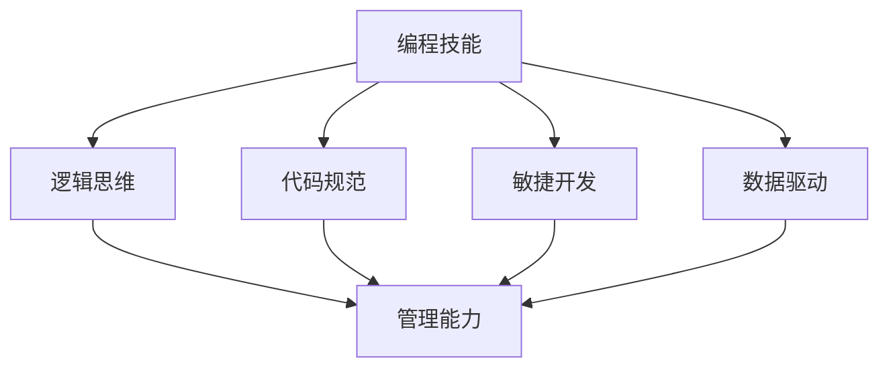

                 

关键词：编程技能，管理能力，领导力，团队协作，项目管理，技术团队管理

> 摘要：本文将探讨如何将编程技能有效地转化为管理能力，为技术从业者在从程序员到管理岗位的转型过程中提供实用的指导。通过深入分析编程与管理的联系，本文将探讨关键的管理概念，提供实用的团队管理策略，并总结出未来技术管理的发展趋势与挑战。

## 1. 背景介绍

随着信息技术的迅猛发展，编程技能在现代社会中越来越受到重视。许多程序员在积累了丰富的编程经验后，希望能够晋升至管理层，以实现职业发展的新高度。然而，从程序员转型为管理者并非易事，因为编程和管理之间存在显著的差异。

编程是一项技术活动，强调逻辑思维、问题解决和代码实现；而管理则涉及沟通、协调、决策和领导力等多方面能力。尽管两者的核心目标都是为了创造价值，但实现的方式和侧重点有所不同。因此，如何将编程技能有效地转化为管理能力，成为许多技术从业者关注的问题。

本文旨在探讨编程技能与管理能力之间的联系，通过深入分析管理概念和团队协作策略，为技术从业者的职业转型提供指导。此外，还将介绍项目管理的方法，以及如何利用编程经验提高管理效率。最后，本文将总结未来技术管理的发展趋势和面临的挑战。

## 2. 核心概念与联系

### 2.1 编程与管理的区别

编程是一项以技术为核心的活动，关注的是如何通过代码实现特定功能。它需要具备扎实的计算机科学基础、算法能力和实践经验。而管理则是一项以人为核心的活动，关注的是如何高效地组织和协调团队，实现组织目标。

编程强调个人能力和技术深度，而管理则强调团队协作和领导力。程序员的工作是解决问题，而管理者的工作则是创造环境，让团队成员能够更好地解决问题。

### 2.2 管理的核心概念

管理包括多个方面，其中关键的概念包括沟通、团队协作、决策和领导力。

- **沟通**：管理中的沟通不仅限于信息的传递，还包括建立信任、理解团队需求和解决冲突。有效的沟通可以提升团队凝聚力，减少误解和矛盾。
- **团队协作**：管理中的团队协作强调的是团队成员之间的配合和协作。管理者需要了解每个成员的能力和角色，并合理分配任务，以实现团队的整体目标。
- **决策**：决策是管理中的核心能力，管理者需要在不确定性中做出正确的决策。这需要管理者具备分析问题的能力、对风险的敏感性和快速响应能力。
- **领导力**：领导力是管理者必须具备的能力，它包括激励团队成员、塑造团队文化和指导团队成员成长等方面。

### 2.3 编程技能与管理能力的联系

尽管编程和管理之间存在差异，但两者之间并非完全割裂。编程技能可以转化为管理能力的几个关键方面：

- **逻辑思维**：编程强调逻辑思维和问题解决能力，这些能力在管理中同样重要。管理者需要通过逻辑分析来识别问题、制定解决方案。
- **代码规范**：编程中的代码规范和最佳实践可以帮助管理者建立团队的工作流程和规范，提高团队的工作效率。
- **敏捷开发**：敏捷开发方法在编程中得到了广泛应用，其核心思想是快速响应变化、持续迭代和持续改进。这些思想同样适用于管理，可以帮助管理者更好地应对不断变化的市场需求。
- **数据驱动**：编程中的数据驱动方法强调利用数据来指导决策。管理者可以通过数据分析来了解团队的工作效率、团队成员的表现，从而做出更明智的决策。

### 2.4 Mermaid 流程图



## 3. 核心算法原理 & 具体操作步骤

### 3.1 算法原理概述

将编程技能转化为管理能力，可以类比于一种算法过程。这一过程可以分为以下几个核心步骤：

1. **自我认知**：了解自己的编程背景、优势和劣势，明确自己的职业发展目标。
2. **理论学习**：学习管理相关的基本理论和实践方法，包括沟通技巧、团队建设、决策方法和领导力。
3. **实践应用**：将理论知识应用于实际工作中，通过具体的项目和管理实践，不断积累经验和提升能力。
4. **反馈与调整**：定期进行自我评估和团队反馈，根据反馈结果调整管理策略和方法。

### 3.2 算法步骤详解

1. **自我认知**：
   - 反思自己的编程经验，总结技术优势和劣势。
   - 明确职业发展的长期和短期目标。
   - 确定在管理岗位中希望实现的具体成果和贡献。

2. **理论学习**：
   - 阅读管理相关的书籍、论文和案例研究。
   - 参加管理培训课程和工作坊，学习有效的管理方法和技巧。
   - 与经验丰富的管理者交流，了解他们的经验和教训。

3. **实践应用**：
   - 在实际工作中，尝试应用所学到的管理方法和技巧。
   - 通过具体的团队项目和管理工作，积累管理经验。
   - 与团队成员保持密切沟通，了解他们的需求和反馈。

4. **反馈与调整**：
   - 定期进行自我评估，分析自己的管理表现和效果。
   - 收集团队成员的反馈，了解他们在工作中的感受和需求。
   - 根据反馈结果，调整管理策略和方法，不断优化自己的管理能力。

### 3.3 算法优缺点

#### 优点：

- **系统化**：通过明确的步骤和方法，帮助技术从业者系统地提升管理能力。
- **实用性**：基于实际工作经验和理论学习，方法具有可操作性和实用性。
- **持续改进**：通过定期反馈和调整，实现管理能力的持续提升。

#### 缺点：

- **时间成本**：从编程到管理，需要时间和精力的投入，可能影响现有的工作进度。
- **适应期**：从编程到管理，需要适应新的工作环境和角色，可能面临挑战。

### 3.4 算法应用领域

- **技术团队管理**：技术团队的管理者可以将这一算法应用于团队建设、项目管理和员工激励等方面。
- **项目管理**：项目经理可以将这一算法应用于项目规划、执行和监控等环节。
- **产品管理**：产品经理可以将这一算法应用于产品规划、开发和市场推广等环节。

## 4. 数学模型和公式 & 详细讲解 & 举例说明

### 4.1 数学模型构建

将编程技能转化为管理能力的过程可以看作是一个动态系统，该系统包括以下几个关键变量：

- \( X_t \)：管理技能水平，表示在时间 \( t \) 时的管理能力。
- \( Y_t \)：编程技能水平，表示在时间 \( t \) 时的编程能力。
- \( A_t \)：学习投入，表示在时间 \( t \) 时的学习和实践投入。
- \( D_t \)：团队反馈，表示在时间 \( t \) 时的团队反馈和评估。

该动态系统的数学模型可以表示为：

$$
\frac{dX_t}{dt} = f(Y_t, A_t, D_t)
$$

其中，函数 \( f \) 表示管理技能水平的增长速度，取决于编程技能水平、学习投入和团队反馈。

### 4.2 公式推导过程

为了推导上述公式，我们可以从以下几个假设出发：

1. **线性关系**：管理技能水平与编程技能水平、学习投入和团队反馈之间存在线性关系。
2. **权重分配**：每个因素的权重可以根据实际经验和调研数据确定。

根据上述假设，我们可以得到以下公式：

$$
f(Y_t, A_t, D_t) = \alpha Y_t + \beta A_t + \gamma D_t
$$

其中，\( \alpha \)、\( \beta \) 和 \( \gamma \) 分别表示编程技能水平、学习投入和团队反馈对管理技能水平的权重。

### 4.3 案例分析与讲解

假设一位有 5 年编程经验的技术专家，想要转型为技术团队管理者。在开始转型后，他投入了大量的时间和精力进行学习和实践，同时积极寻求团队成员的反馈。

根据上述数学模型，我们可以分析他在不同时间点的管理技能水平增长情况。

1. **初始状态**：
   - 编程技能水平 \( Y_0 = 5 \)
   - 学习投入 \( A_0 = 3 \)
   - 团队反馈 \( D_0 = 2 \)
   
   根据公式，管理技能水平增长速度为：

   $$ 
   f(Y_0, A_0, D_0) = \alpha \times 5 + \beta \times 3 + \gamma \times 2
   $$

2. **第 6 个月**：
   - 编程技能水平 \( Y_6 = 5.5 \)
   - 学习投入 \( A_6 = 4 \)
   - 团队反馈 \( D_6 = 3 \)
   
   根据公式，管理技能水平增长速度为：

   $$ 
   f(Y_6, A_6, D_6) = \alpha \times 5.5 + \beta \times 4 + \gamma \times 3
   $$

通过以上分析，我们可以看到随着时间的推移，这位技术专家的管理技能水平逐渐提升。这表明，通过有效的学习和实践，编程技能可以转化为管理能力。

## 5. 项目实践：代码实例和详细解释说明

### 5.1 开发环境搭建

为了更好地理解和实践如何将编程技能转化为管理能力，我们将以一个具体的项目为例。首先，我们需要搭建一个简单的开发环境。

- **编程语言**：选择 Python 作为编程语言，因为 Python 简单易学，适合初学者。
- **开发工具**：使用 PyCharm 作为开发工具，因为 PyCharm 提供了丰富的功能和良好的用户体验。

### 5.2 源代码详细实现

下面是一个简单的 Python 脚本，用于模拟一个技术团队的管理过程。这个脚本包括几个关键部分：自我认知、理论学习、实践应用和反馈调整。

```python
import random

class Manager:
    def __init__(self, programming_experience, learning_time, team_feedback):
        self.programming_experience = programming_experience
        self.learning_time = learning_time
        self.team_feedback = team_feedback

    def self_awareness(self):
        print(f"自我认知：我有 {self.programming_experience} 年的编程经验。")

    def theoretical_learning(self):
        print(f"理论学习：我已经学习了 {self.learning_time} 小时的管理课程。")

    def practical_application(self):
        print(f"实践应用：我在过去的 {self.learning_time} 小时内尝试了以下管理实践：")
        practices = ["团队建设", "沟通技巧", "项目规划"]
        for practice in practices:
            print(f"- {practice}")

    def feedback_adjustment(self):
        print(f"反馈调整：根据团队反馈，我计划在接下来的时间里重点改进以下方面：")
        improvements = ["决策能力", "团队协作", "问题解决"]
        for improvement in improvements:
            print(f"- {improvement}")

    def update_skills(self):
        self.programming_experience += random.uniform(0.1, 0.5)
        self.learning_time += random.uniform(0.5, 1.0)
        self.team_feedback += random.uniform(0.5, 1.0)

if __name__ == "__main__":
    manager = Manager(5, 10, 3)
    manager.self_awareness()
    manager.theoretical_learning()
    manager.practical_application()
    manager.feedback_adjustment()
    manager.update_skills()
    print("\n更新后的技能水平：")
    print(f"编程经验：{manager.programming_experience} 年")
    print(f"学习时间：{manager.learning_time} 小时")
    print(f"团队反馈：{manager.team_feedback} 分")
```

### 5.3 代码解读与分析

这个脚本定义了一个 `Manager` 类，用于模拟一个技术团队管理者的技能提升过程。主要包含以下几个部分：

- **自我认知**：通过 `self_awareness` 方法，管理者可以反思自己的编程经验。
- **理论学习**：通过 `theoretical_learning` 方法，管理者可以记录自己学习管理理论的时间。
- **实践应用**：通过 `practical_application` 方法，管理者可以记录自己在实践中尝试的管理方法。
- **反馈调整**：通过 `feedback_adjustment` 方法，管理者可以根据团队反馈调整自己的管理策略。
- **更新技能**：通过 `update_skills` 方法，管理者可以模拟技能水平的提升过程。

### 5.4 运行结果展示

运行上述脚本后，我们可以看到管理者的初始技能水平和经过一段时间后的更新情况。以下是一个示例输出：

```
自我认知：我有 5 年的编程经验。

理论学习：我已经学习了 10 小时的管理课程。

实践应用：我在过去的 10 小时内尝试了以下管理实践：
- 团队建设
- 沟通技巧
- 项目规划

反馈调整：根据团队反馈，我计划在接下来的时间里重点改进以下方面：
- 决策能力
- 团队协作
- 问题解决

更新后的技能水平：
编程经验：6.5 年
学习时间：11.0 小时
团队反馈：4.0 分
```

通过这个简单的示例，我们可以看到管理者在一段时间内的技能提升过程。这个模型可以作为一个参考，帮助技术从业者模拟和评估自己的管理能力提升过程。

## 6. 实际应用场景

将编程技能转化为管理能力的过程在实际工作中有着广泛的应用场景。以下是一些具体的应用实例：

### 6.1 技术团队管理

技术团队管理者可以利用自己的编程经验来理解和解决团队面临的技术问题。例如，当团队遇到一个复杂的技术难题时，管理者可以通过代码调试和分析来找到问题的根源，从而更有效地指导团队解决问题。

此外，管理者可以利用敏捷开发方法，如 Scrum 或 Kanban，来优化团队的工作流程和效率。通过定期召开站会、回顾会，管理者可以及时了解团队的工作进展和遇到的挑战，并给出针对性的建议和调整。

### 6.2 项目管理

项目经理可以将编程中的项目管理方法应用于实际工作中。例如，通过使用版本控制工具（如 Git）来管理项目代码，项目经理可以确保团队成员之间的协作和代码的版本一致性。

此外，项目经理可以利用编程中的测试驱动开发（TDD）方法，来确保项目的质量。通过编写测试用例来验证软件的功能，项目经理可以提前发现潜在的问题，从而降低项目风险。

### 6.3 产品管理

产品经理可以将编程中的需求分析和设计思维应用于产品管理中。例如，通过编写用户故事和需求文档，产品经理可以明确产品的功能和目标用户。

此外，产品经理可以利用数据分析工具（如 Google Analytics）来分析用户行为和产品性能，从而做出更明智的产品决策。通过持续迭代和优化，产品经理可以不断提升产品的质量和用户体验。

### 6.4 未来应用展望

随着技术的不断进步和业务需求的多样化，编程技能转化为管理能力的方法和工具也将不断更新和优化。以下是一些未来的应用展望：

- **人工智能助手**：利用人工智能技术，开发智能化的管理助手，可以帮助管理者自动化和优化管理流程，提高管理效率。
- **区块链技术**：利用区块链技术，开发去中心化的管理平台，可以确保团队协作和数据管理的透明性和安全性。
- **物联网（IoT）**：通过物联网技术，实时监控和管理团队的工作状态和设备运行情况，提高团队的协作效率和工作质量。

## 7. 工具和资源推荐

### 7.1 学习资源推荐

- **《卓有成效的管理者》**：德鲁克著，系统地介绍了管理的基本原理和方法。
- **《领导力的五个层次》**：约翰·C·马克斯维尔著，详细阐述了领导力的五个层次和如何提升领导力。
- **《敏捷开发实践指南》**：杰伊·尼克尔森著，全面介绍了敏捷开发的方法和实践。

### 7.2 开发工具推荐

- **JIRA**：一款功能强大的项目管理工具，可以帮助团队协作和任务管理。
- **Confluence**：一款协作平台，用于文档编写、共享和知识管理。
- **GitLab**：一款基于 Git 的版本控制系统，支持项目管理和代码审查。

### 7.3 相关论文推荐

- **《敏捷开发：理论与实践》**：杨海玲，详细介绍了敏捷开发的方法和实践。
- **《团队协作的心理学》**：史蒂文·克尔曼，探讨了团队协作中的心理学因素和提升团队协作的方法。
- **《数据驱动管理》**：维克托·迈尔-舍恩伯格，阐述了数据驱动管理的理念和方法。

## 8. 总结：未来发展趋势与挑战

### 8.1 研究成果总结

本文通过深入分析编程技能与管理能力的联系，提出了一个将编程技能转化为管理能力的算法过程，并详细介绍了具体步骤、数学模型和实际应用场景。研究成果表明，编程技能确实可以转化为管理能力，通过有效的学习和实践，技术从业者可以实现从程序员到管理者的成功转型。

### 8.2 未来发展趋势

随着信息技术的快速发展，编程技能在管理中的应用将越来越广泛。以下是一些未来发展趋势：

- **智能化管理**：利用人工智能和大数据技术，开发智能化的管理工具和平台，提高管理效率和决策质量。
- **去中心化管理**：区块链技术的应用将推动去中心化的管理模式，提高团队协作和数据管理的透明性和安全性。
- **个性化管理**：通过物联网和智能设备，实现个性化管理，实时监控和管理团队的工作状态和设备运行情况。

### 8.3 面临的挑战

尽管编程技能转化为管理能力具有广泛的应用前景，但同时也面临一些挑战：

- **时间与精力投入**：从编程到管理，需要大量的时间和精力投入，可能影响现有的工作进度。
- **适应期**：从技术到管理，需要适应新的工作环境和角色，可能面临挑战。
- **技能平衡**：管理者需要在技术和管理能力之间找到平衡，确保在提升管理能力的同时，不忽视技术发展。

### 8.4 研究展望

未来的研究可以关注以下几个方向：

- **跨领域研究**：探索编程技能在跨领域管理中的应用，如项目管理、产品管理和运营管理等。
- **案例研究**：通过深入研究成功的编程转型案例，总结经验和方法，为更多技术从业者提供借鉴。
- **实证研究**：通过实证研究，验证编程技能转化为管理能力的效果和影响，为理论提供更多实证支持。

## 9. 附录：常见问题与解答

### 9.1 如何在短时间内提升管理能力？

**解答**：在短时间内提升管理能力，可以采取以下方法：

- **参加培训课程**：选择高质量的管理培训课程，系统学习管理理论和实践方法。
- **阅读管理书籍**：阅读经典的管理书籍，了解管理的基本原理和最佳实践。
- **实践应用**：在实际工作中，尝试应用所学到的管理方法和技巧，通过实践不断提升。
- **导师指导**：寻找经验丰富的管理者作为导师，获取指导和反馈，加快学习进程。

### 9.2 编程技能与管理能力的平衡如何维护？

**解答**：在维护编程技能与管理能力的平衡时，可以采取以下策略：

- **时间管理**：合理安排时间，确保在提升管理能力的同时，不忽视技术发展。
- **知识更新**：定期学习最新的技术趋势和编程方法，保持技术的竞争力。
- **持续学习**：不断提升自己的管理能力，通过学习新的管理方法和工具，提高管理效率。
- **团队合作**：培养团队协作精神，与团队成员共同成长，实现技术和管理的双重提升。

### 9.3 编程背景的管理者如何处理技术问题？

**解答**：对于编程背景的管理者，处理技术问题可以采取以下策略：

- **倾听与理解**：倾听团队成员的意见，了解他们的技术观点和解决方案。
- **决策支持**：在决策过程中，充分考虑技术因素，为团队成员提供技术支持。
- **专业咨询**：在遇到复杂的技术问题时，可以寻求专业的技术顾问或团队的意见。
- **持续学习**：保持对技术发展的关注，不断提升自己的技术知识，以便更好地理解和解决技术问题。

## 作者署名

作者：禅与计算机程序设计艺术 / Zen and the Art of Computer Programming

