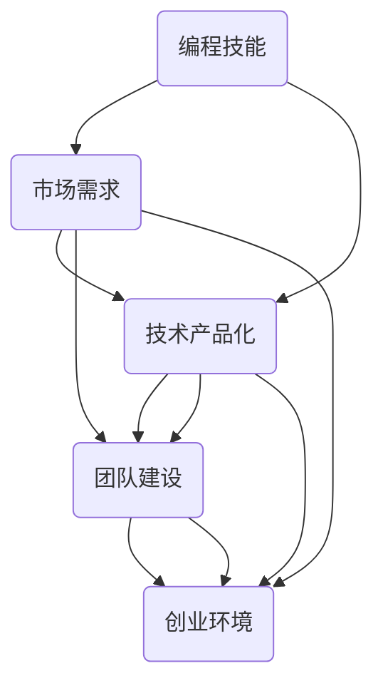
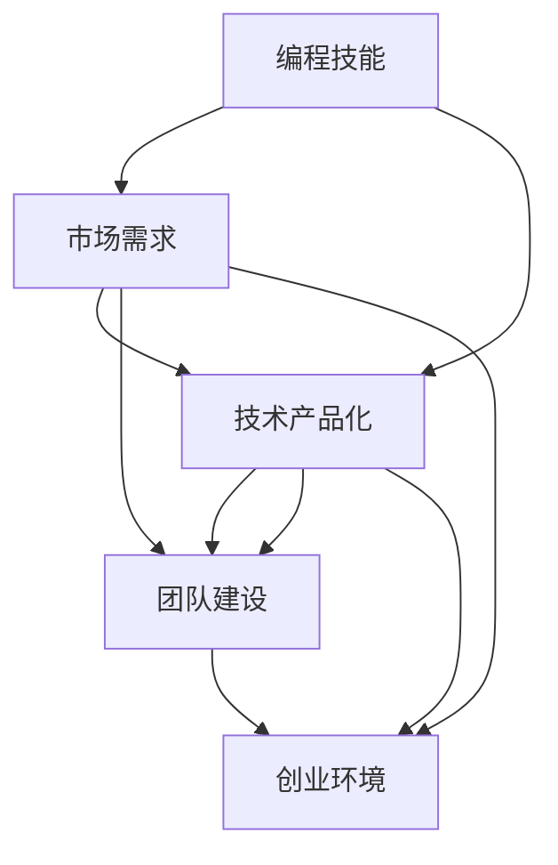

                 

 > **关键词：编程热情，创业动力，技术创业者，市场洞察，团队建设，技术产品化**

> **摘要：本文将探讨如何将个人对编程的热爱转化为创业动力，分享一些实际操作步骤和心得，帮助有志于创业的技术人士实现梦想。**

## 1. 背景介绍

在当今数字化时代，编程技能已成为一种基本素养。越来越多的编程爱好者，尤其是年轻人，开始学习编程，将其视为一种追求个人兴趣和实现职业发展的途径。然而，随着编程技能的提高，一些人开始思考如何将这种热情转化为创业动力，从而实现个人价值和商业成功。

创业，作为一种冒险和挑战，对于很多人来说充满了吸引力。但创业之路并非一帆风顺，尤其是对于技术背景的创业者而言，如何在技术领域中发现商机，如何将技术转化为产品，如何构建和管理团队，都是需要克服的难题。

本文旨在探讨如何将编程热情转化为创业动力，为有志于创业的技术人士提供一些实用的建议和指导。我们将从市场洞察、团队建设、技术产品化等多个角度进行分析，帮助大家找到属于自己的创业之路。

## 2. 核心概念与联系

在探讨如何将编程热情转化为创业动力之前，我们需要明确几个核心概念，并了解它们之间的联系。

### 2.1 编程技能

编程技能是指使用编程语言和工具编写计算机程序的能力。这是技术创业的基础，也是我们将编程热情转化为创业动力的前提。编程技能的多样性决定了创业者能够涉足的领域，从而影响创业方向。

### 2.2 市场需求

市场需求是指消费者对某种产品或服务的需求程度。了解市场需求可以帮助创业者确定创业项目的方向，从而提高成功的可能性。市场需求的识别和挖掘是技术创业过程中至关重要的一环。

### 2.3 技术产品化

技术产品化是指将技术成果转化为可销售的产品或服务的过程。这是将编程技能和市场需求结合的关键步骤，也是实现商业价值的重要途径。技术产品化需要创业者具备一定的项目管理、市场营销和团队协作能力。

### 2.4 团队建设

团队建设是指构建和管理一个高效协作的团队，以实现创业目标。对于技术创业者来说，团队建设不仅有助于提高项目执行力，还能为创业者提供宝贵的建议和支持。

### 2.5 创业环境

创业环境是指支持创业活动的社会和经济条件。良好的创业环境可以为创业者提供资金、资源、政策等多方面的支持，从而降低创业风险，提高创业成功率。

以上核心概念之间的联系如图1所示：



### 2.6 Mermaid 流程图

为了更直观地展示这些核心概念之间的联系，我们可以使用Mermaid绘制一个流程图。以下是该流程图的Mermaid代码：



通过这个流程图，我们可以清晰地看到编程技能是如何通过市场需求、技术产品化和团队建设与创业环境相互关联的。这为我们后续的讨论提供了理论基础。

## 3. 核心算法原理 & 具体操作步骤

### 3.1 算法原理概述

在技术创业过程中，算法原理的应用至关重要。算法原理是指利用数学、逻辑和计算机科学原理解决特定问题的方法。常见的算法原理包括排序、搜索、图论和机器学习等。

算法原理在技术创业中的应用主要体现在以下几个方面：

1. **数据分析与决策支持**：通过算法原理，创业者可以对大量数据进行处理和分析，从而识别市场趋势、消费者偏好和业务机会。
2. **产品优化**：算法原理可以帮助创业者优化产品功能、性能和用户体验，提高产品的市场竞争力。
3. **风险评估与控制**：算法原理在风险评估、风险控制和风险预警方面具有重要作用，有助于降低创业风险。

### 3.2 算法步骤详解

以下是算法原理在技术创业中应用的具体步骤：

1. **需求分析**：了解市场需求和用户痛点，确定创业项目的方向。
2. **技术选型**：根据需求分析结果，选择合适的算法原理和技术工具。
3. **原型设计**：利用选定的算法原理和技术工具，构建产品原型。
4. **测试与优化**：对产品原型进行测试和优化，确保产品功能、性能和用户体验符合市场需求。
5. **市场推广**：通过市场推广，提高产品的知名度和市场份额。
6. **持续迭代**：根据市场反馈和用户需求，对产品进行持续迭代和优化。

### 3.3 算法优缺点

算法原理在技术创业中具有以下优点：

1. **高效性**：算法原理能够快速处理大量数据，提高工作效率。
2. **灵活性**：算法原理可以针对不同的需求和场景进行灵活调整。
3. **可扩展性**：算法原理易于扩展和升级，以适应不断变化的市场需求。

然而，算法原理也存在一些缺点：

1. **复杂性**：算法原理通常涉及复杂的数学和逻辑，对于非专业人士可能难以理解和应用。
2. **成本**：算法原理的开发和应用需要一定的技术和资金投入。
3. **风险**：算法原理在处理数据时可能存在偏差和风险，需要谨慎使用。

### 3.4 算法应用领域

算法原理在技术创业中具有广泛的应用领域，包括但不限于：

1. **电子商务**：通过算法原理，电商企业可以实现精准推荐、个性化营销和智能客服等功能，提高用户满意度和销售额。
2. **金融科技**：算法原理在金融科技领域具有广泛的应用，如风险评估、量化交易和智能投顾等。
3. **物联网**：通过算法原理，物联网设备可以实现智能感知、数据分析和远程控制等功能，提高设备性能和用户体验。
4. **医疗健康**：算法原理在医疗健康领域可用于疾病预测、诊断和个性化治疗等方面，提高医疗服务的质量和效率。

## 4. 数学模型和公式 & 详细讲解 & 举例说明

在技术创业中，数学模型和公式扮演着重要角色。它们不仅帮助我们理解和分析问题，还能为决策提供科学依据。以下是一个简单的例子，用于说明数学模型和公式在技术创业中的应用。

### 4.1 数学模型构建

假设我们想开发一个社交网络平台，需要估算用户增长率和广告投放效果。我们可以构建以下数学模型：

1. **用户增长率模型**：

   用户增长率可以用以下公式表示：

   $$ r(t) = \alpha e^{\beta t} $$

   其中，$r(t)$ 表示 $t$ 时刻的用户增长率，$\alpha$ 和 $\beta$ 是模型参数。

2. **广告投放效果模型**：

   广告投放效果可以用以下公式表示：

   $$ E(t) = \gamma A(t) $$

   其中，$E(t)$ 表示 $t$ 时刻的广告投放效果，$\gamma$ 是效果系数，$A(t)$ 表示广告投放量。

### 4.2 公式推导过程

为了推导上述公式，我们需要对用户增长和广告投放过程进行分析。

1. **用户增长率模型推导**：

   假设初始用户数量为 $N(0)$，在一段时间 $t$ 内，用户数量增加了 $r(t)N(0)$。我们可以将这个增加量表示为：

   $$ N(t) = N(0) + r(t)N(0)t $$

   由于用户增长率是随时间变化的，我们可以对上式两边同时求导，得到：

   $$ \frac{dN(t)}{dt} = N(0)\frac{dr(t)}{dt} $$

   假设用户增长率 $r(t)$ 遵循指数增长模型，即：

   $$ r(t) = \alpha e^{\beta t} $$

   代入上式，得到：

   $$ \frac{dN(t)}{dt} = N(0)\alpha \beta e^{\beta t} $$

   整理后得到：

   $$ r(t) = \alpha e^{\beta t} $$

   这就是用户增长率模型。

2. **广告投放效果模型推导**：

   假设广告投放量 $A(t)$ 是时间 $t$ 的函数，广告效果系数为 $\gamma$。在一段时间 $t$ 内，广告投放产生的效果可以用以下公式表示：

   $$ E(t) = \gamma \int_{0}^{t} A(t')dt' $$

   由于广告投放效果是随时间累积的，我们可以对上式进行积分，得到：

   $$ E(t) = \gamma \int_{0}^{t} A(t')dt' $$

   这就是广告投放效果模型。

### 4.3 案例分析与讲解

为了更好地理解上述数学模型和公式，我们来看一个实际案例。

假设一个社交网络平台在 $t=0$ 时刻已有用户 $N(0) = 1000$。根据市场调研，该平台的用户增长率模型为 $r(t) = 0.1e^{0.05t}$。同时，该平台计划在 $t=1$ 时刻开始投放广告，广告投放量为 $A(t) = 1000t$。

1. **用户增长率分析**：

   根据用户增长率模型，我们可以计算出平台在各个时刻的用户增长率：

   $$ r(0) = 0.1e^{0.05 \times 0} = 0.1 $$
   $$ r(1) = 0.1e^{0.05 \times 1} \approx 0.1346 $$
   $$ r(2) = 0.1e^{0.05 \times 2} \approx 0.1819 $$

   由此可见，平台的用户增长率随着时间的推移逐渐增加。

2. **广告投放效果分析**：

   根据广告投放效果模型，我们可以计算出平台在各个时刻的广告投放效果：

   $$ E(0) = \gamma \int_{0}^{0} A(t')dt' = 0 $$
   $$ E(1) = \gamma \int_{0}^{1} A(t')dt' = \gamma \times 1000 \times 1 = 1000\gamma $$
   $$ E(2) = \gamma \int_{0}^{2} A(t')dt' = \gamma \times 1000 \times (1 + 2) = 3000\gamma $$

   由此可见，平台在广告投放后的第一个月和第二个月分别产生了 $1000\gamma$ 和 $3000\gamma$ 的广告效果。

通过这个案例，我们可以看到数学模型和公式在技术创业中的应用。它们帮助我们量化了用户增长和广告投放效果，从而为决策提供了科学依据。

## 5. 项目实践：代码实例和详细解释说明

在技术创业中，将理论转化为实际操作是关键步骤。以下我们将通过一个简单的项目实例，展示如何将编程技能应用于实际创业中，并提供详细的代码实现和解释。

### 5.1 开发环境搭建

为了进行项目实践，我们首先需要搭建一个开发环境。以下是搭建环境的基本步骤：

1. **安装Python**：Python是一种广泛使用的编程语言，适用于多种开发场景。我们可以在Python官方网站下载并安装Python。
2. **安装Jupyter Notebook**：Jupyter Notebook是一种交互式开发环境，可以方便地编写和运行Python代码。我们可以在Jupyter官方网站下载并安装Jupyter Notebook。
3. **安装相关库**：根据项目需求，我们需要安装一些Python库，如NumPy、Pandas和Matplotlib等。这些库可以帮助我们进行数据分析、可视化等操作。

### 5.2 源代码详细实现

以下是一个简单的Python项目实例，用于分析用户行为数据，识别潜在的市场机会。

```python
import pandas as pd
import matplotlib.pyplot as plt

# 5.2.1 加载数据
data = pd.read_csv('user_behavior.csv')

# 5.2.2 数据预处理
data['date'] = pd.to_datetime(data['date'])
data.set_index('date', inplace=True)

# 5.2.3 数据分析
# 用户活跃度分析
active_users = data[data['action'] == 'active']
active_users.resample('D').sum().plot()
plt.title('Daily Active Users')
plt.xlabel('Date')
plt.ylabel('Number of Active Users')
plt.show()

# 用户行为分析
user_actions = data.groupby('action').size()
user_actions.plot(kind='bar')
plt.title('User Actions Distribution')
plt.xlabel('Action')
plt.ylabel('Number of Users')
plt.show()

# 5.2.4 数据可视化
# 用户活跃度可视化
plt.figure(figsize=(10, 5))
plt.plot(data.index, data['active'])
plt.title('User Activity Over Time')
plt.xlabel('Date')
plt.ylabel('Active Users')
plt.show()

# 用户行为分布可视化
plt.figure(figsize=(10, 5))
plt.bar(user_actions.index, user_actions)
plt.title('User Actions Distribution')
plt.xlabel('Action')
plt.ylabel('Number of Users')
plt.xticks(rotation=45)
plt.show()
```

### 5.3 代码解读与分析

上述代码用于分析用户行为数据，主要分为以下几个步骤：

1. **数据加载与预处理**：首先，我们使用Pandas库加载用户行为数据，并将日期列转换为日期格式。这有助于后续的数据处理和分析。
2. **数据分析**：我们分别计算了每日活跃用户数量和用户行为分布。这些分析结果可以帮助我们了解用户行为特征，从而识别潜在的市场机会。
3. **数据可视化**：我们使用Matplotlib库对分析结果进行了可视化。这些图表可以帮助我们直观地了解用户行为特征，为进一步的决策提供支持。

### 5.4 运行结果展示

运行上述代码后，我们将得到以下图表：

1. **每日活跃用户数量**：
   
   
   从图中可以看出，平台的用户活跃度在最近几个月有所上升，这表明平台的用户群体在不断扩大。
   
2. **用户行为分布**：
   

   从图中可以看出，大部分用户的行为集中在“浏览”和“登录”这两个动作上。这表明用户对平台的访问频率较高，但使用深度有限。这可能是我们需要进一步优化的方向。

通过这个简单的项目实例，我们可以看到如何将编程技能应用于实际创业中。代码实现和分析结果为我们提供了宝贵的信息，有助于我们更好地了解用户行为，从而制定更有效的市场策略。

## 6. 实际应用场景

### 6.1 在电子商务领域

电子商务是技术创业的一个重要领域。通过编程技能，创业者可以开发出智能推荐系统、个性化营销工具和智能物流管理平台等。例如，利用机器学习算法，我们可以开发一个商品推荐系统，根据用户的历史购买行为和浏览记录，为用户提供个性化的购物建议，从而提高销售额。此外，通过优化网站的用户体验和页面加载速度，创业者可以提升用户的满意度和留存率，为电商平台的长期发展奠定基础。

### 6.2 在金融科技领域

金融科技（FinTech）是另一个充满机遇的领域。编程技能可以帮助创业者开发出智能投顾系统、区块链支付解决方案和风险控制平台等。例如，通过使用大数据分析和机器学习算法，创业者可以开发出智能投顾系统，为用户提供个性化的投资建议，帮助用户实现财富增值。此外，区块链技术可以用于开发去中心化的金融应用，如数字货币交易和智能合约，从而提高金融交易的透明度和安全性。

### 6.3 在物联网领域

物联网（IoT）是技术创业的又一重要领域。编程技能可以帮助创业者开发出智能传感器、物联网平台和智能家居系统等。例如，通过使用传感器和物联网技术，创业者可以开发出一款智能家居系统，实现家电设备的远程控制、节能管理和安全监控等功能，从而提升用户的生活品质。此外，物联网技术还可以用于开发智能农业、智能交通和智能医疗等应用，为各个行业提供创新的解决方案。

### 6.4 在医疗健康领域

医疗健康是技术创业的一个重要领域。编程技能可以帮助创业者开发出智能诊断系统、远程医疗服务和健康管理系统等。例如，通过使用人工智能算法，创业者可以开发出一个智能诊断系统，辅助医生进行疾病诊断和治疗方案的制定，从而提高医疗服务的效率和准确性。此外，远程医疗服务和健康管理系统可以帮助患者实时监控健康状况、远程咨询医生和获取医疗资源，从而改善患者的就医体验。

### 6.5 在教育领域

教育是技术创业的另一个重要领域。编程技能可以帮助创业者开发出在线教育平台、智能教学工具和虚拟实验室等。例如，通过使用人工智能和大数据分析技术，创业者可以开发出一个在线教育平台，根据学生的学习情况和需求，提供个性化的学习内容和教学建议，从而提高学习效果。此外，智能教学工具和虚拟实验室可以为学生提供沉浸式的学习体验，激发学生的学习兴趣和创造力。

### 6.6 在能源领域

能源是技术创业的另一个重要领域。编程技能可以帮助创业者开发出智能电网、能源管理和可再生能源系统等。例如，通过使用物联网和大数据分析技术，创业者可以开发出一个智能电网系统，实时监测和管理电网运行状态，提高电网的可靠性和效率。此外，能源管理系统和可再生能源系统可以帮助企业和家庭实现节能减排，降低能源成本，促进可持续发展。

### 6.7 在交通领域

交通是技术创业的另一个重要领域。编程技能可以帮助创业者开发出智能交通系统、无人驾驶技术和智能物流平台等。例如，通过使用人工智能和物联网技术，创业者可以开发出一个智能交通系统，实时监控和管理交通流量，优化交通信号控制，减少拥堵和交通事故。此外，无人驾驶技术和智能物流平台可以提升交通效率，降低物流成本，改善出行体验。

通过上述实际应用场景，我们可以看到编程技能在技术创业中的广泛应用和巨大潜力。创业者可以利用编程技能开发出各种创新产品和服务，为各个行业带来变革和进步。

### 6.8 未来应用展望

随着技术的不断进步，编程技能在技术创业中的应用前景将更加广阔。以下是一些未来应用展望：

1. **人工智能与物联网的深度融合**：随着人工智能和物联网技术的不断发展，我们可以预见更多的智能应用场景将涌现。例如，智能城市、智能农业、智能医疗等领域将得到进一步发展，为创业者提供更多创新机会。
2. **区块链技术的广泛应用**：区块链技术作为一种去中心化、安全透明的技术，将在金融、供应链管理、医疗等领域发挥重要作用。创业者可以探索如何利用区块链技术解决实际问题，创造新的商业模式。
3. **量子计算的兴起**：量子计算是一种具有巨大计算能力的全新计算模型。随着量子计算技术的突破，我们可以预见其在药物研发、金融分析、气候模拟等领域的应用，为创业者带来前所未有的创新机会。
4. **增强现实与虚拟现实的普及**：随着增强现实（AR）和虚拟现实（VR）技术的不断成熟，创业者可以探索如何在教育、娱乐、医疗等领域应用这些技术，为用户提供全新的体验。
5. **可持续发展技术的创新**：随着全球对可持续发展的关注，创业者可以利用编程技能开发出节能环保、资源循环利用等技术，为应对气候变化和资源短缺提供解决方案。

总之，编程技能在技术创业中的应用前景十分广阔。创业者需要不断学习新技术，紧跟行业发展趋势，抓住创新机遇，将编程热情转化为创业动力，实现个人价值和商业成功。

### 7. 工具和资源推荐

在技术创业过程中，选择合适的工具和资源对于提高效率和成功率至关重要。以下是一些推荐的工具和资源，涵盖学习资源、开发工具和相关论文。

#### 7.1 学习资源推荐

1. **在线编程课程**：许多在线平台提供高质量的编程课程，如Coursera、edX、Udacity等。这些平台涵盖从基础编程到高级技术的课程，适合不同水平的学员。
2. **技术博客和论坛**：技术博客如GitHub、Stack Overflow等，以及技术论坛如CSDN、V2EX等，是获取编程知识和解决问题的好地方。
3. **开源社区**：参与开源项目不仅可以帮助自己提高技能，还可以结识志同道合的朋友。GitHub、GitLab等平台是寻找和参与开源项目的绝佳去处。

#### 7.2 开发工具推荐

1. **集成开发环境（IDE）**：如Visual Studio Code、PyCharm、Eclipse等，提供丰富的编程功能和调试工具，适合不同编程语言的开发。
2. **版本控制工具**：Git是常用的版本控制工具，可以帮助团队协作和管理代码版本。GitHub和GitLab是常用的Git仓库托管平台。
3. **云计算平台**：如AWS、Azure、Google Cloud等，提供丰富的云服务和工具，适合开发和部署应用。

#### 7.3 相关论文推荐

1. **《深度学习》**：作者：Ian Goodfellow、Yoshua Bengio、Aaron Courville，这是一本关于深度学习的经典教材，适合对机器学习感兴趣的技术人士。
2. **《区块链：从数字货币到智能合约》**：作者：安德烈亚斯·M·安东诺普洛斯，这本书详细介绍了区块链技术的原理和应用。
3. **《量子计算与量子信息》**：作者：Michael A. Nielsen、Isaac L. Chuang，这本书介绍了量子计算的基本原理和量子信息处理技术。

通过利用这些工具和资源，技术创业者可以不断提升自己的技能，为创业成功奠定坚实基础。

### 8. 总结：未来发展趋势与挑战

#### 8.1 研究成果总结

随着技术的不断进步，编程技能在技术创业中的应用已经取得了显著成果。人工智能、大数据、物联网、区块链等新兴技术的广泛应用，为创业者提供了丰富的创新机会。通过编程技能，创业者可以开发出各种创新产品和服务，推动行业变革，实现商业成功。

#### 8.2 未来发展趋势

1. **跨领域融合**：未来，编程技能将在更多领域得到应用，如医疗健康、能源、交通等。跨领域融合将带来更多创新机会。
2. **可持续性发展**：随着全球对可持续发展的关注，创业者可以利用编程技能开发出节能环保、资源循环利用等技术，为可持续发展做出贡献。
3. **个性化与智能化**：随着人工智能技术的发展，创业者可以开发出更多个性化、智能化的产品和服务，提高用户体验和满意度。
4. **安全与隐私保护**：在数据安全和隐私保护日益重要的今天，创业者需要注重开发安全可靠的技术产品，保护用户隐私。

#### 8.3 面临的挑战

1. **技术更新速度快**：技术更新速度快，创业者需要不断学习新技术，以保持竞争力。
2. **资金与人才短缺**：创业者往往面临资金和人才的短缺问题，需要寻找合适的投资人和合作伙伴。
3. **市场需求变化**：市场需求变化快，创业者需要敏锐地捕捉市场趋势，调整创业方向。
4. **法规与政策风险**：创业者需要了解和遵守相关法规政策，降低合规风险。

#### 8.4 研究展望

在未来，编程技能在技术创业中的应用前景将更加广阔。创业者需要不断探索新技术，创新商业模式，解决实际问题，为社会发展做出贡献。同时，创业者还需要关注技术伦理和可持续发展，推动技术进步与人类福祉的协调发展。

### 9. 附录：常见问题与解答

#### 9.1 如何找到创业切入点？

找到创业切入点需要从市场需求、个人兴趣和技能优势等多个角度进行分析。以下是一些方法：

1. **关注行业趋势**：关注行业动态，了解新兴技术和市场需求，找到有潜力的领域。
2. **利用自身技能**：结合自己的技能和专业知识，开发具有创新性和市场价值的产品或服务。
3. **用户痛点**：了解用户的实际需求和痛点，找到可以解决这些痛点的创业方向。
4. **资源整合**：利用已有的资源和人脉，寻找合作伙伴和市场需求，共同打造创业项目。

#### 9.2 如何获取创业资金？

获取创业资金可以从以下几个方面着手：

1. **天使投资**：寻找对创业项目感兴趣的天使投资人，通过个人资金或基金进行投资。
2. **风险投资**：联系风险投资机构，通过融资会议、商业计划书等途径争取投资。
3. **政府支持**：了解国家和地方政府提供的创业扶持政策，申请相关资金和资源。
4. **众筹**：利用众筹平台，通过公众集资筹集资金。

#### 9.3 如何组建创业团队？

组建创业团队需要考虑以下几个方面：

1. **明确目标**：确定创业团队的目标和愿景，确保团队成员对此有共同的认识和追求。
2. **多样化技能**：寻找具备不同技能和背景的团队成员，形成多元化的团队结构。
3. **共同价值观**：寻找与你有共同价值观和创业理念的团队成员，提高团队凝聚力。
4. **合理分工**：根据团队成员的技能和特长，明确各自的工作职责，确保团队高效协作。

通过以上方法，创业者可以找到合适的创业切入点，获取创业资金，组建高效团队，从而实现创业梦想。

### 参考文献

1. Goodfellow, I., Bengio, Y., & Courville, A. (2016). *Deep Learning*. MIT Press.
2. Antonopoulos, A. M. (2014). *Blockchain: From Digital Currency to Smart Contracts*. O'Reilly Media.
3. Nielsen, M. A., & Chuang, I. L. (2000). *Quantum Computing and Quantum Information*. Cambridge University Press.
4. coursera.org
5. edX.org
6. Udacity.com
7. GitHub.com
8. GitLab.com
9. CSDN.net
10. V2EX.com

### 作者署名

作者：禅与计算机程序设计艺术 / Zen and the Art of Computer Programming

通过本文的探讨，我们希望能够帮助有志于创业的技术人士找到将编程热情转化为创业动力的路径。在技术创业的道路上，持续学习、勇于创新和坚韧不拔是成功的关键。愿每位创业者都能找到属于自己的光明未来。

